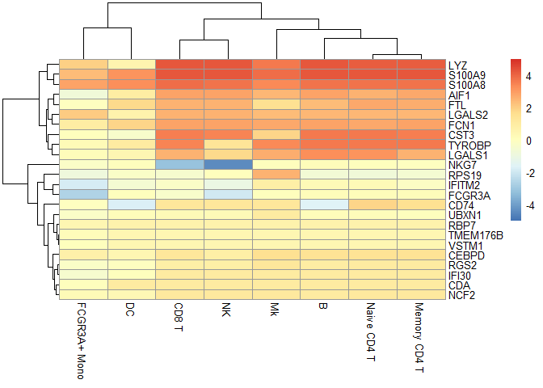
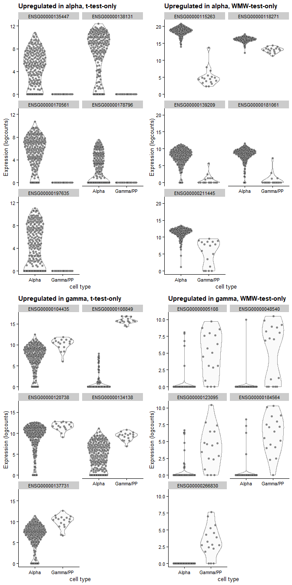
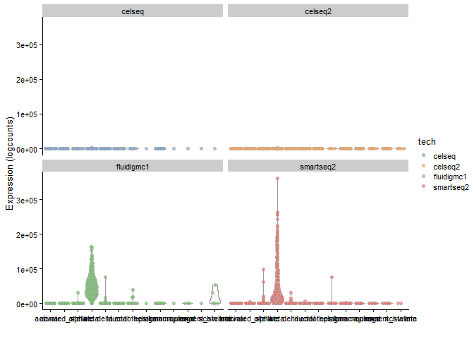

Differential Expression
================

Created by: Ahmed Mahfouz

# Overview

In this tutorial we will explore different methods to perform
differential expression analysis on scRNA-seq data. The exercises are
based on: - Seurat Differential expression testing
[vignette](https://satijalab.org/seurat/v3.2/de_vignette.html)

Load required packages:

``` r
suppressMessages(require(Seurat))
```

    ## Warning: package 'Seurat' was built under R version 3.6.3

``` r
suppressMessages(require(scran))
```

    ## Warning: package 'S4Vectors' was built under R version 3.6.3

    ## Warning: package 'GenomeInfoDb' was built under R version 3.6.3

    ## Warning: package 'DelayedArray' was built under R version 3.6.3

    ## Warning: package 'matrixStats' was built under R version 3.6.3

``` r
suppressMessages(require(scater))
```

    ## Warning: package 'ggplot2' was built under R version 3.6.3

``` r
suppressMessages(require(pheatmap))
suppressMessages(require(BiocFileCache))
```

    ## Warning: package 'dbplyr' was built under R version 3.6.3

``` r
suppressMessages(require(DropletUtils))
suppressMessages(require(scRNAseq))
suppressMessages(require(EnsDb.Hsapiens.v86))
```

## Data preprocessing

``` r
pbmc <- readRDS(file = "pbmc3k_final.rds")
```

## Differential expression testing in Seurat

In Seurat, differential expression analysis can be performed using the
FindMarkers function. Differential expression is performed between
groups of cells. The function will automatically retrieve the cluster
identities from the seurat object using the `Idents()` function. To test
for differential expression between two specific groups of cells,
specify the `ident.1` and `ident.2` parameters.

As a default, Seurat performs differential expression based on the
non-parameteric Wilcoxon rank sum test.

List options for groups to perform differential expression
    on.

``` r
levels(pbmc)
```

    ## [1] "Naive CD4 T"  "Memory CD4 T" "CD14+ Mono"   "B"            "CD8 T"       
    ## [6] "FCGR3A+ Mono" "NK"           "DC"           "Mk"

``` r
# Find differentially expressed features between CD14+ and FCGR3A+ Monocytes
monocyte.de.markers <- FindMarkers(pbmc, ident.1 = "CD14+ Mono", ident.2 = "FCGR3A+ Mono")
# view results
head(monocyte.de.markers)
```

    ##                p_val avg_logFC pct.1 pct.2    p_val_adj
    ## FCGR3A 1.193617e-101 -2.617707 0.131 0.975 1.636926e-97
    ## LYZ     8.134552e-75  1.812078 1.000 0.988 1.115572e-70
    ## RHOC    4.479768e-68 -1.611576 0.162 0.864 6.143554e-64
    ## S100A8  7.471811e-65  2.610696 0.975 0.500 1.024684e-60
    ## S100A9  1.318422e-64  2.286734 0.996 0.870 1.808084e-60
    ## IFITM2  4.821669e-64 -1.445772 0.677 1.000 6.612437e-60

The results data frame has the following columns : p\_val : p\_val
(unadjusted) avg\_logFC : log fold-chage of the average expression
between the two groups. Positive values indicate that the feature is
more highly expressed in the first group. pct.1 : The percentage of
cells where the feature is detected in the first group pct.2 : The
percentage of cells where the feature is detected in the second group
p\_val\_adj : Adjusted p-value, based on bonferroni correction using all
features in the dataset.

If the ident.2 parameter is omitted or set to NULL, FindMarkers will
test for differentially expressed features between the group specified
by ident.1 and all other cells.

``` r
# Find differentially expressed features between CD14+ Monocytes and all other cells, only
# search for positive markers
monocyte.de.markers <- FindMarkers(pbmc, ident.1 = "CD14+ Mono", ident.2 = NULL, only.pos = TRUE)
# view results
head(monocyte.de.markers)
```

    ##                p_val avg_logFC pct.1 pct.2     p_val_adj
    ## S100A9  0.000000e+00  3.860873 0.996 0.215  0.000000e+00
    ## S100A8  0.000000e+00  3.796640 0.975 0.121  0.000000e+00
    ## LGALS2  0.000000e+00  2.634294 0.908 0.059  0.000000e+00
    ## FCN1    0.000000e+00  2.352693 0.952 0.151  0.000000e+00
    ## CD14   2.856582e-294  1.951644 0.667 0.028 3.917516e-290
    ## TYROBP 3.190467e-284  2.111879 0.994 0.265 4.375406e-280

To increase the speed of marker discovery, particularly for large
datasets, Seurat allows for pre-filtering of features or cells. For
example, features that are very infrequently detected in either group of
cells, or features that are expressed at similar average levels, are
unlikely to be differentially expressed. Example use cases of the
`min.pct`, `logfc.threshold`, `min.diff.pct`, and `max.cells.per.ident`
parameters are demonstrated
below.

``` r
# Pre-filter features that are detected at <50% frequency in either CD14+ Monocytes or FCGR3A+
# Monocytes
head(FindMarkers(pbmc, ident.1 = "CD14+ Mono", ident.2 = "FCGR3A+ Mono", min.pct = 0.5))
```

    ##                p_val avg_logFC pct.1 pct.2    p_val_adj
    ## FCGR3A 1.193617e-101 -2.617707 0.131 0.975 1.636926e-97
    ## LYZ     8.134552e-75  1.812078 1.000 0.988 1.115572e-70
    ## RHOC    4.479768e-68 -1.611576 0.162 0.864 6.143554e-64
    ## S100A8  7.471811e-65  2.610696 0.975 0.500 1.024684e-60
    ## S100A9  1.318422e-64  2.286734 0.996 0.870 1.808084e-60
    ## IFITM2  4.821669e-64 -1.445772 0.677 1.000 6.612437e-60

``` r
# Pre-filter features that have less than a two-fold change between the average expression of
# CD14+ Monocytes vs FCGR3A+ Monocytes
head(FindMarkers(pbmc, ident.1 = "CD14+ Mono", ident.2 = "FCGR3A+ Mono", logfc.threshold = log(2)))
```

    ##                p_val avg_logFC pct.1 pct.2    p_val_adj
    ## FCGR3A 1.193617e-101 -2.617707 0.131 0.975 1.636926e-97
    ## LYZ     8.134552e-75  1.812078 1.000 0.988 1.115572e-70
    ## RHOC    4.479768e-68 -1.611576 0.162 0.864 6.143554e-64
    ## S100A8  7.471811e-65  2.610696 0.975 0.500 1.024684e-60
    ## S100A9  1.318422e-64  2.286734 0.996 0.870 1.808084e-60
    ## IFITM2  4.821669e-64 -1.445772 0.677 1.000 6.612437e-60

``` r
# Pre-filter features whose detection percentages across the two groups are similar (within
# 0.25)
head(FindMarkers(pbmc, ident.1 = "CD14+ Mono", ident.2 = "FCGR3A+ Mono", min.diff.pct = 0.25))
```

    ##                p_val avg_logFC pct.1 pct.2    p_val_adj
    ## FCGR3A 1.193617e-101 -2.617707 0.131 0.975 1.636926e-97
    ## RHOC    4.479768e-68 -1.611576 0.162 0.864 6.143554e-64
    ## S100A8  7.471811e-65  2.610696 0.975 0.500 1.024684e-60
    ## IFITM2  4.821669e-64 -1.445772 0.677 1.000 6.612437e-60
    ## LGALS2  1.034540e-57  2.049431 0.908 0.265 1.418768e-53
    ## CDKN1C  2.886353e-48 -1.007729 0.029 0.506 3.958345e-44

Finally, you can also identify all cluster markers in one go using
`FindAllMarkers`.

``` r
head(FindAllMarkers(pbmc, logfc.threshold = log(2), min.pct = 0.5, min.diff.pct = 0.25))
```

    ## Calculating cluster Naive CD4 T

    ## Calculating cluster Memory CD4 T

    ## Calculating cluster CD14+ Mono

    ## Calculating cluster B

    ## Calculating cluster CD8 T

    ## Calculating cluster FCGR3A+ Mono

    ## Calculating cluster NK

    ## Calculating cluster DC

    ## Calculating cluster Mk

    ##                  p_val  avg_logFC pct.1 pct.2     p_val_adj     cluster
    ## CYBA     1.090337e-124 -1.0909689 0.661 0.914 1.495288e-120 Naive CD4 T
    ## HLA-DRB1 1.716574e-112 -2.1095267 0.102 0.588 2.354109e-108 Naive CD4 T
    ## LDHB     1.963031e-107  0.7300635 0.901 0.594 2.692101e-103 Naive CD4 T
    ## HLA-DRA  1.488495e-105 -2.5744877 0.260 0.668 2.041322e-101 Naive CD4 T
    ## HLA-DPB1 5.609579e-104 -1.9997531 0.195 0.635 7.692977e-100 Naive CD4 T
    ## HLA-DPA1  1.565361e-99 -1.9240160 0.172 0.609  2.146736e-95 Naive CD4 T
    ##              gene
    ## CYBA         CYBA
    ## HLA-DRB1 HLA-DRB1
    ## LDHB         LDHB
    ## HLA-DRA   HLA-DRA
    ## HLA-DPB1 HLA-DPB1
    ## HLA-DPA1 HLA-DPA1

### Alternative DE tests in Seurat

The following differential expression tests are currently supported by
Seurat: “wilcox” : Wilcoxon rank sum test (default) “bimod” :
Likelihood-ratio test for single cell feature expression, (McDavid et
al., Bioinformatics, 2013) “roc” : Standard AUC classifier “t” :
Student’s t-test “poisson” : Likelihood ratio test assuming an
underlying negative binomial distribution. Use only for UMI-based
datasets “negbinom” : Likelihood ratio test assuming an underlying
negative binomial distribution. Use only for UMI-based datasets “LR” :
Uses a logistic regression framework to determine differentially
expressed genes. Constructs a logistic regression model predicting group
membership based on each feature individually and compares this to a
null model with a likelihood ratio test. “MAST” : GLM-framework that
treates cellular detection rate as a covariate (Finak et al, Genome
Biology, 2015) (Installation instructions) “DESeq2” : DE based on a
model using the negative binomial distribution (Love et al, Genome
Biology, 2014) (Installation instructions)

For MAST and DESeq2 please ensure that these packages are installed
separately in order to use them as part of Seurat. Once installed, use
the test.use parameter can be used to specify which DE test to use.

``` r
# Test for DE features using the MAST package
head(FindMarkers(pbmc, ident.1 = "CD14+ Mono", ident.2 = "FCGR3A+ Mono", test.use = "MAST"))
```

    ## Assuming data assay in position 1, with name et is log-transformed.

    ## 
    ## Done!

    ## Combining coefficients and standard errors

    ## Warning in melt(coefAndCI, as.is = TRUE): The melt generic in data.table has
    ## been passed a array and will attempt to redirect to the relevant reshape2
    ## method; please note that reshape2 is deprecated, and this redirection is now
    ## deprecated as well. To continue using melt methods from reshape2 while both
    ## libraries are attached, e.g. melt.list, you can prepend the namespace like
    ## reshape2::melt(coefAndCI). In the next version, this warning will become an
    ## error.

    ## Calculating log-fold changes

    ## Warning in melt(lfc): The melt generic in data.table has been passed a list
    ## and will attempt to redirect to the relevant reshape2 method; please note that
    ## reshape2 is deprecated, and this redirection is now deprecated as well. To
    ## continue using melt methods from reshape2 while both libraries are attached,
    ## e.g. melt.list, you can prepend the namespace like reshape2::melt(lfc). In the
    ## next version, this warning will become an error.

    ## Calculating likelihood ratio tests

    ## Refitting on reduced model...

    ## 
    ## Done!

    ## Warning in melt(llrt): The melt generic in data.table has been passed a list
    ## and will attempt to redirect to the relevant reshape2 method; please note that
    ## reshape2 is deprecated, and this redirection is now deprecated as well. To
    ## continue using melt methods from reshape2 while both libraries are attached,
    ## e.g. melt.list, you can prepend the namespace like reshape2::melt(llrt). In the
    ## next version, this warning will become an error.

    ##                p_val avg_logFC pct.1 pct.2     p_val_adj
    ## LYZ    1.228136e-144  1.812078 1.000 0.988 1.684266e-140
    ## FCGR3A 3.977801e-119 -2.617707 0.131 0.975 5.455156e-115
    ## S100A9  2.481257e-95  2.286734 0.996 0.870  3.402796e-91
    ## S100A8  3.626489e-92  2.610696 0.975 0.500  4.973367e-88
    ## IFITM2  7.942512e-87 -1.445772 0.677 1.000  1.089236e-82
    ## LGALS2  1.275856e-75  2.049431 0.908 0.265  1.749709e-71

## Differential expression analysis using scran

The `findMarkers()` function is `scran` uses a different approach to
identify marker genes compared to Seurat. While in Seurat the default is
to perform one vs all comparisons, `findMarkers()` in scran performs
pairwise comparisons between clusters for each gene. The default test in
`findMarkers()` is the Welch t-test.

scran intentionally uses pairwise comparisons between clusters rather
than comparing each cluster to the average of all other cells. The
latter approach is sensitive to the population composition, potentially
resulting in substantially different sets of markers when cell type
abundances change in different contexts. In the worst case, the presence
of a single dominant subpopulation will drive the selection of top
markers for every other cluster, pushing out useful genes that can
resolve the various minor subpopulations.

First, let’s convert our Seurat object to a SingleCellExperiment object.

``` r
pbmc.sce <- as.SingleCellExperiment(pbmc)
```

`findMarkers()` returns a list of DataFrames containing ranked candidate
markers for each cluster.

``` r
markers.pbmc <- findMarkers(pbmc.sce, groups=pbmc.sce$ident)
```

You can then choose one dataframe (in this example, corresponding to
CD14+ Mono). This DataFrame contains log2-fold changes of expression in
the chosen cluster over each other cluster as well as several statistics
obtained by combining p-values across the pairwise comparisons involving
the cluster of interest.

``` r
chosen <- "CD14+ Mono"
interesting <- markers.pbmc[[chosen]]
colnames(interesting)
```

    ##  [1] "Top"                "p.value"            "FDR"               
    ##  [4] "logFC.Naive CD4 T"  "logFC.Memory CD4 T" "logFC.B"           
    ##  [7] "logFC.CD8 T"        "logFC.FCGR3A+ Mono" "logFC.NK"          
    ## [10] "logFC.DC"           "logFC.Mk"

And then you can look at the top markers for your cluster of interest.
Of particular interest is the `Top` field. The set of genes with `Top`
\(≤ X\) is the union of the top \(X\) genes (ranked by p-value) from
each pairwise comparison involving the cluster of interest.

``` r
interesting[1:10,1:4]
```

    ## DataFrame with 10 rows and 4 columns
    ##              Top               p.value                   FDR  logFC.Naive CD4 T
    ##        <integer>             <numeric>             <numeric>          <numeric>
    ## CDA            1  4.01062949344458e-74  4.01472794694156e-72   1.04335723439152
    ## S100A9         1                     0                     0   4.28716954530638
    ## CEBPD          1 1.12631877510195e-110 2.27151995319827e-108   1.45753299586284
    ## IFITM2         1 3.07885972880577e-102 4.96746850833434e-100  0.222813847163074
    ## TYROBP         1                     0                     0   3.61338499877889
    ## NKG7           1 9.08546796594544e-273 9.58446982192139e-270 0.0526559539954602
    ## RBP7           2  1.84590081794877e-37  8.21905318745114e-36  0.613592297182638
    ## S100A8         2 6.16647714371785e-288 8.45670675489458e-285    3.7459142235795
    ## FCGR3A         2   8.2842545362296e-99   1.2765198506725e-96  0.159807836421551
    ## RGS2           2  7.27415907644524e-87   8.6745928325538e-85   1.07556996944427

You can then plot a heatmap of the top 5 genes for CD14+ Mono cells

``` r
best.set <- interesting[interesting$Top <= 5,]

# Note: if you use scran v1.16, this is a built-in function
getMarkerEffects <- function(x, prefix="logFC", strip=TRUE, remove.na.col=FALSE) {
    regex <- paste0("^", prefix, "\\.")
    i <- grep(regex, colnames(x))
    out <- as.matrix(x[,i])

    if (strip) {
        colnames(out) <- sub(regex, "", colnames(out))
    }
    if (remove.na.col) {
        out <- out[,!colAnyNAs(out),drop=FALSE]
    }

    out
}
###

logFCs <- getMarkerEffects(best.set)

pheatmap(logFCs, breaks=seq(-5, 5, length.out=101))
```

<!-- -->

The `summary.logFC` field provides a summary of the direction and effect
size for each gene. logFC is defined here as the log-fold change from
the comparison with the lowest p-value. The `p.value` field contains the
combined  
p-value that is obtained by applying Simes’ method to the pairwise
p-values for each gene.

### Wilcoxon vs t-test

Also in scran, you can use differnt DE tests. Beside the default Welch
t-test, you can also use a Wilcoxon rank-sum test or a binomial
test.

``` r
markers.pbmc.wrs <- findMarkers(pbmc.sce, groups=pbmc.sce$ident, test="wilcox")

interesting.wrs <- markers.pbmc.wrs[[chosen]]
interesting.wrs[1:10,1:4]
```

    ## DataFrame with 10 rows and 4 columns
    ##                  Top               p.value                   FDR
    ##            <integer>             <numeric>             <numeric>
    ## FCER1A             1  4.64057041848649e-68  3.42154745801738e-66
    ## FCGR3A             1 9.54893467048998e-101  1.25917394299136e-98
    ## GP9                1  1.85354527381353e-93  2.21039303348507e-91
    ## CCL5               1 1.69716029320422e-130 4.23179204745514e-128
    ## CST7               1 1.86618607279535e-117  3.3674836581994e-115
    ## TYROBP             1 1.85312024326622e-213 2.54136910161525e-209
    ## CD79A              1 1.32826117450449e-142 4.33708898741778e-140
    ## S100A9             2 1.13305682129058e-211 7.76937062358933e-208
    ## AP001189.4         2  1.45416142884412e-92  1.69003134196342e-90
    ## LYZ                2 6.67527363764037e-192 9.15447026665993e-189
    ##              AUC.Naive CD4 T
    ##                    <numeric>
    ## FCER1A      0.49977881396461
    ## FCGR3A     0.546680714968914
    ## GP9        0.501041666666667
    ## CCL5       0.480957077953132
    ## CST7       0.487018770923003
    ## TYROBP     0.996428144428503
    ## CD79A      0.502708034433285
    ## S100A9     0.996272716403635
    ## AP001189.4               0.5
    ## LYZ        0.999748923959828

One advantage of the Wilcoxon rank-sum test over the Welch t-test is
that it is symmetric with respect to differences in the size of the
groups being compared. In other words, it is less affected by the number
of cells in each group. On the other hand, the t-test will favor genes
where the larger group has the higher relative variance as this
increases the estimated degrees of freedom and decreases the resulting
p-value

To illustrate this we will use an example from [“Orchestrating
Single-Cell Analysis with
Bioconductor”](https://osca.bioconductor.org/marker-detection.html).
In this example, we will compare alpha and gamma cells in the human
pancreas data set from Lawlor et
al. (2017)

``` r
sce.lawlor <- readRDS(file = "sce_lawlor.rds")

marker.lawlor.t <- findMarkers(sce.lawlor, groups=sce.lawlor$`cell type`, 
                               direction="up", restrict=c("Alpha", "Gamma/PP"))
marker.lawlor.w <- findMarkers(sce.lawlor, groups=sce.lawlor$`cell type`, 
                               direction="up", restrict=c("Alpha", "Gamma/PP"), test.type="wilcox")

# Upregulated in alpha:
marker.alpha.t <- marker.lawlor.t$Alpha
marker.alpha.w <- marker.lawlor.w$Alpha
chosen.alpha.t <- rownames(marker.alpha.t)[1:5]
chosen.alpha.w <- rownames(marker.alpha.w)[1:5]
u.alpha.t <- setdiff(chosen.alpha.t, chosen.alpha.w)
u.alpha.w <- setdiff(chosen.alpha.w, chosen.alpha.t)

# Upregulated in gamma:
marker.gamma.t <- marker.lawlor.t$`Gamma/PP`
marker.gamma.w <- marker.lawlor.w$`Gamma/PP`
chosen.gamma.t <- rownames(marker.gamma.t)[1:5]
chosen.gamma.w <- rownames(marker.gamma.w)[1:5]
u.gamma.t <- setdiff(chosen.gamma.t, chosen.gamma.w)
u.gamma.w <- setdiff(chosen.gamma.w, chosen.gamma.t)

# Examining all uniquely detected markers in each direction.
subset <- sce.lawlor[,sce.lawlor$`cell type` %in% c("Alpha", "Gamma/PP")]
gridExtra::grid.arrange(
  plotExpression(subset, x="cell type", features=u.alpha.t, ncol=2) +
    ggtitle("Upregulated in alpha, t-test-only"),
  plotExpression(subset, x="cell type", features=u.alpha.w, ncol=2) +
    ggtitle("Upregulated in alpha, WMW-test-only"),
  plotExpression(subset, x="cell type", features=u.gamma.t, ncol=2) +
    ggtitle("Upregulated in gamma, t-test-only"),
  plotExpression(subset, x="cell type", features=u.gamma.w, ncol=2) +
    ggtitle("Upregulated in gamma, WMW-test-only"),
  ncol=2
)
```

<!-- -->

Can you observe the effects of the tests in the resulting genes?

## DE testing for integrated data

Nowadays, it is common to work with multiple scRNA-seq datasets. As we
have seen in the integration practical, several strategies exist to
integrate multiple datasets and perform cell-based analysis
(e.g. clustering or trajectory inference) using the integrated data
(i.e. data corrected for batch effects).

But what about gene-based analysis? Can we use the integrated
(i.e. corrected) data for differential expression analysis? In general,
this is not recommended. The reason is that arbitrary correction
algorithms do not preserve the magnitude or the direction of differences
in per-gene expression when attempting to align multiple batches.
Further, the correction can introduce artificial agreement across
batches. For a good discussion of these implications, check
[chapter 13.7](https://osca.bioconductor.org/integrating-datasets.html#using-corrected-values)
in [“Orchestrating Single-Cell Analysis with
Bioconductor”](https://osca.bioconductor.org/marker-detection.html)

For these reasons, it is preferred to perform DE testing using the
uncorrected expression data. There are two strategies to handle the
batch effects in this case.

### Identifying conserved markers (Seurat)

To identify canonical cell type marker genes that are conserved across
batches, Seurat provides the `FindConservedMarkers` function. This
function performs differential gene expression testing for each
dataset/group/batch separately and combines the p-values using
meta-analysis methods from the MetaDE R package.

For this example, we will use the pancreas datasets used in the
integration
session.

``` r
# Free up some memory before we read new data
rm(list = ls())

pancreas.data <- readRDS(file = "../session-integration/session-integration_files/pancreas_expression_matrix.rds")
metadata <- readRDS(file = "../session-integration/session-integration_files/pancreas_metadata.rds")

pancreas <- CreateSeuratObject(pancreas.data, meta.data = metadata)

# here, we have not integrated the data so the default assay is "RNA", if you have integrated the data using Seurat, the default assay will be "Integrated". Make sure to switch it to "RNA" before performing DE analysis
# DefaultAssay(pancreas) <- "RNA"

Idents(pancreas) <- pancreas@meta.data$celltype
table(Idents(pancreas))
```

    ## 
    ##              gamma             acinar              alpha              delta 
    ##                359                711               2281                405 
    ##               beta             ductal        endothelial activated_stellate 
    ##               1172               1065                 61                180 
    ##            schwann               mast         macrophage            epsilon 
    ##                 12                 17                 24                 14 
    ## quiescent_stellate 
    ##                 20

``` r
beta.markers <- FindConservedMarkers(pancreas, ident.1 = "beta", grouping.var = "tech", verbose = FALSE,
                                     logfc.threshold = 0.1, min.pct = 0.25, min.diff.pct = 0.25)
head(beta.markers, n=10)
```

    ##         fluidigmc1_p_val fluidigmc1_avg_logFC fluidigmc1_pct.1 fluidigmc1_pct.2
    ## MAFA        3.981596e-74             67.38721            0.736            0.042
    ## WSCD2       5.698251e-51                  Inf            0.574            0.047
    ## MAPT        1.567132e-25                  Inf            0.725            0.413
    ## GCGR        7.947015e-24                  Inf            0.360            0.050
    ## SIX2        1.501030e-22                  Inf            0.306            0.032
    ## VAT1L       2.927537e-24                  Inf            0.395            0.068
    ## SLC6A17     7.594508e-37                  Inf            0.636            0.163
    ## CYP2U1      1.379476e-46                  Inf            0.659            0.116
    ## TJP2        1.597056e-42                 -Inf            0.097            0.637
    ## FAM222A     6.629597e-21                  Inf            0.605            0.253
    ##         fluidigmc1_p_val_adj  celseq_p_val celseq_avg_logFC celseq_pct.1
    ## MAFA            1.368196e-69 2.929676e-126       30.4795016        0.870
    ## WSCD2           1.958090e-46  4.753034e-64        2.2409871        0.329
    ## MAPT            5.385135e-21  1.290528e-54        2.0373503        0.571
    ## GCGR            2.730833e-19  1.806608e-37        0.8290695        0.273
    ## SIX2            5.157989e-18  6.630289e-39        1.8249141        0.317
    ## VAT1L           1.005990e-19  4.798772e-34        0.7656752        0.298
    ## SLC6A17         2.609701e-32  1.609674e-46        1.6996130        0.509
    ## CYP2U1          4.740294e-42  6.759662e-34        1.0427855        0.398
    ## TJP2            5.487965e-38  3.380016e-35       -5.9858106        0.031
    ## FAM222A         2.278128e-16  5.127653e-26        2.8469803        0.602
    ##         celseq_pct.2 celseq_p_val_adj celseq2_p_val celseq2_avg_logFC
    ## MAFA           0.081    1.006725e-121  0.000000e+00          90.72643
    ## WSCD2          0.001     1.633285e-59 1.156007e-235          16.70437
    ## MAPT           0.087     4.434641e-50 2.241201e-186          29.33607
    ## GCGR           0.017     6.208049e-33  1.757203e-86           8.21201
    ## SIX2           0.026     2.278366e-34 3.144109e-130          10.51066
    ## VAT1L          0.028     1.649002e-29 1.730819e-130          22.40595
    ## SLC6A17        0.079     5.531323e-42 1.290591e-125          33.28972
    ## CYP2U1         0.066     2.322823e-29 3.196670e-119          25.91878
    ## TJP2           0.592     1.161475e-30 2.038755e-104         -30.59057
    ## FAM222A        0.210     1.762015e-21  2.764955e-90          55.55877
    ##         celseq2_pct.1 celseq2_pct.2 celseq2_p_val_adj smartseq2_p_val
    ## MAFA            0.928         0.111      0.000000e+00    0.000000e+00
    ## WSCD2           0.593         0.016     3.972388e-231   1.859050e-279
    ## MAPT            0.780         0.151     7.701439e-182    1.233230e-70
    ## GCGR            0.292         0.021      6.038276e-82   6.954531e-167
    ## SIX2            0.544         0.076     1.080410e-125   5.765168e-134
    ## VAT1L           0.613         0.103     5.947612e-126   3.684366e-126
    ## SLC6A17         0.746         0.207     4.434858e-121    3.081687e-32
    ## CYP2U1          0.766         0.245     1.098472e-114    4.496166e-83
    ## TJP2            0.106         0.715     7.005774e-100    1.993403e-70
    ## FAM222A         0.890         0.516      9.501215e-86    1.221882e-29
    ##         smartseq2_avg_logFC smartseq2_pct.1 smartseq2_pct.2 smartseq2_p_val_adj
    ## MAFA              324.91290           0.860           0.029        0.000000e+00
    ## WSCD2             452.91290           0.724           0.031       6.388254e-275
    ## MAPT              198.91290           0.523           0.128        4.237750e-66
    ## GCGR              511.91199           0.568           0.044       2.389785e-162
    ## SIX2               10.91325           0.451           0.033       1.981085e-129
    ## VAT1L             157.91290           0.549           0.066       1.266059e-121
    ## SLC6A17          -177.08709           0.539           0.212        1.058960e-27
    ## CYP2U1             45.91290           0.636           0.174        1.545017e-78
    ## TJP2                   -Inf           0.107           0.687        6.849930e-66
    ## FAM222A           -60.08710           0.656           0.338        4.198754e-25
    ##             max_pval minimump_p_val
    ## MAFA    3.981596e-74   0.000000e+00
    ## WSCD2   5.698251e-51  7.436200e-279
    ## MAPT    1.567132e-25  8.964804e-186
    ## GCGR    7.947015e-24  2.781812e-166
    ## SIX2    1.501030e-22  2.306067e-133
    ## VAT1L   2.927537e-24  6.923275e-130
    ## SLC6A17 3.081687e-32  5.162364e-125
    ## CYP2U1  6.759662e-34  1.278668e-118
    ## TJP2    3.380016e-35  8.155020e-104
    ## FAM222A 6.629597e-21   1.105982e-89

### Identifying consistent markers (scran)

Alternatively, we can perform DE tests on the uncorrected data with
blocking on the batch. The rational here is that we expect true DE
between clusters to be present in a within-batch comparison where batch
effects are absent. This strategy penalizes genes that exhibit
inconsistent DE across batches,

``` r
pancreas.sce <- as.SingleCellExperiment(pancreas)

m.out <- findMarkers(pancreas.sce, group = pancreas.sce$celltype, block = pancreas.sce$tech,
    direction="up", lfc=1)

demo <- m.out[["beta"]]
as.data.frame(demo[1:20,c("Top", "p.value", "FDR")]) 
```

    ##          Top       p.value           FDR
    ## FOXA2      1  4.554605e-84  3.477998e-81
    ## HADH       1 2.513761e-157 4.319019e-153
    ## INS        1 4.000786e-161 1.374790e-156
    ## NPTX2      1  1.049383e-96  1.442397e-93
    ## SCGN       1 7.971148e-146 6.847814e-142
    ## SYT13      1 1.648870e-127 9.443351e-124
    ## UCHL1      1 1.491498e-146 1.708411e-142
    ## ATP2A3     2  1.856414e-79  1.301876e-76
    ## G6PC2      2 1.278306e-104 2.091734e-101
    ## PDX1       2 8.682236e-108 1.988985e-104
    ## SYNE2      2  1.616372e-70  8.678656e-68
    ## MAFA       3  2.245018e-96  2.967137e-93
    ## PFKFB2     3 3.608581e-106 6.526403e-103
    ## PLCXD3     3  2.436981e-86  1.993857e-83
    ## ADCYAP1    4  1.825964e-76  1.161956e-73
    ## GNAS       4 3.677415e-142 2.527340e-138
    ## ITPR3      4  9.801586e-61  3.472288e-58
    ## PFN2       4 3.287749e-117 1.412212e-113
    ## RAP1GAP2   4  6.021610e-96  7.663726e-93
    ## RRAGD      4  2.348942e-86  1.968700e-83

``` r
plotExpression(pancreas.sce, x=I(factor(pancreas.sce$celltype)), 
    features="INS", colour_by="tech") + facet_wrap(~colour_by)
```

<!-- -->

### Session info

``` r
sessionInfo()
```

    ## R version 3.6.2 (2019-12-12)
    ## Platform: x86_64-w64-mingw32/x64 (64-bit)
    ## Running under: Windows 10 x64 (build 18363)
    ## 
    ## Matrix products: default
    ## 
    ## locale:
    ## [1] LC_COLLATE=English_United States.1252 
    ## [2] LC_CTYPE=English_United States.1252   
    ## [3] LC_MONETARY=English_United States.1252
    ## [4] LC_NUMERIC=C                          
    ## [5] LC_TIME=English_United States.1252    
    ## 
    ## attached base packages:
    ## [1] parallel  stats4    stats     graphics  grDevices utils     datasets 
    ## [8] methods   base     
    ## 
    ## other attached packages:
    ##  [1] EnsDb.Hsapiens.v86_2.99.0   ensembldb_2.10.2           
    ##  [3] AnnotationFilter_1.10.0     GenomicFeatures_1.38.2     
    ##  [5] AnnotationDbi_1.48.0        scRNAseq_2.0.2             
    ##  [7] DropletUtils_1.6.1          BiocFileCache_1.10.2       
    ##  [9] dbplyr_1.4.4                pheatmap_1.0.12            
    ## [11] scater_1.14.6               ggplot2_3.3.2              
    ## [13] scran_1.14.6                SingleCellExperiment_1.8.0 
    ## [15] SummarizedExperiment_1.16.1 DelayedArray_0.12.3        
    ## [17] BiocParallel_1.20.1         matrixStats_0.57.0         
    ## [19] Biobase_2.46.0              GenomicRanges_1.38.0       
    ## [21] GenomeInfoDb_1.22.1         IRanges_2.20.2             
    ## [23] S4Vectors_0.24.4            BiocGenerics_0.32.0        
    ## [25] Seurat_3.2.2               
    ## 
    ## loaded via a namespace (and not attached):
    ##   [1] reticulate_1.16               R.utils_2.10.1               
    ##   [3] tidyselect_1.1.0              RSQLite_2.2.1                
    ##   [5] htmlwidgets_1.5.2             grid_3.6.2                   
    ##   [7] Rtsne_0.15                    munsell_0.5.0                
    ##   [9] mutoss_0.1-12                 codetools_0.2-16             
    ##  [11] ica_1.0-2                     statmod_1.4.34               
    ##  [13] future_1.19.1                 miniUI_0.1.1.1               
    ##  [15] withr_2.3.0                   colorspace_1.4-1             
    ##  [17] knitr_1.30                    ROCR_1.0-11                  
    ##  [19] tensor_1.5                    gbRd_0.4-11                  
    ##  [21] listenv_0.8.0                 Rdpack_2.0                   
    ##  [23] labeling_0.3                  GenomeInfoDbData_1.2.2       
    ##  [25] mnormt_2.0.2                  polyclip_1.10-0              
    ##  [27] farver_2.0.3                  bit64_4.0.5                  
    ##  [29] rhdf5_2.30.1                  TH.data_1.0-10               
    ##  [31] vctrs_0.3.4                   generics_0.0.2               
    ##  [33] xfun_0.18                     R6_2.4.1                     
    ##  [35] ggbeeswarm_0.6.0              rsvd_1.0.3                   
    ##  [37] locfit_1.5-9.4                bitops_1.0-6                 
    ##  [39] spatstat.utils_1.17-0         assertthat_0.2.1             
    ##  [41] promises_1.1.1                scales_1.1.1                 
    ##  [43] multcomp_1.4-14               beeswarm_0.2.3               
    ##  [45] gtable_0.3.0                  globals_0.13.1               
    ##  [47] goftest_1.2-2                 sandwich_3.0-0               
    ##  [49] rlang_0.4.8                   splines_3.6.2                
    ##  [51] rtracklayer_1.46.0            lazyeval_0.2.2               
    ##  [53] BiocManager_1.30.10           yaml_2.2.1                   
    ##  [55] reshape2_1.4.4                abind_1.4-5                  
    ##  [57] httpuv_1.5.4                  tools_3.6.2                  
    ##  [59] ellipsis_0.3.1                RColorBrewer_1.1-2           
    ##  [61] ggridges_0.5.2                TFisher_0.2.0                
    ##  [63] Rcpp_1.0.5                    plyr_1.8.6                   
    ##  [65] progress_1.2.2                zlibbioc_1.32.0              
    ##  [67] purrr_0.3.4                   RCurl_1.98-1.2               
    ##  [69] prettyunits_1.1.1             rpart_4.1-15                 
    ##  [71] openssl_1.4.3                 deldir_0.1-29                
    ##  [73] pbapply_1.4-3                 viridis_0.5.1                
    ##  [75] cowplot_1.1.0                 zoo_1.8-8                    
    ##  [77] ggrepel_0.8.2                 cluster_2.1.0                
    ##  [79] magrittr_1.5                  data.table_1.13.0            
    ##  [81] lmtest_0.9-38                 RANN_2.6.1                   
    ##  [83] tmvnsim_1.0-2                 mvtnorm_1.1-1                
    ##  [85] ProtGenerics_1.18.0           fitdistrplus_1.1-1           
    ##  [87] hms_0.5.3                     patchwork_1.0.1              
    ##  [89] mime_0.9                      evaluate_0.14                
    ##  [91] xtable_1.8-4                  XML_3.99-0.3                 
    ##  [93] gridExtra_2.3                 compiler_3.6.2               
    ##  [95] biomaRt_2.42.1                tibble_3.0.4                 
    ##  [97] KernSmooth_2.23-17            crayon_1.3.4                 
    ##  [99] R.oo_1.24.0                   htmltools_0.5.0              
    ## [101] mgcv_1.8-33                   later_1.1.0.1                
    ## [103] tidyr_1.1.2                   DBI_1.1.0                    
    ## [105] ExperimentHub_1.12.0          MASS_7.3-53                  
    ## [107] rappdirs_0.3.1                MAST_1.12.0                  
    ## [109] Matrix_1.2-18                 rbibutils_1.3                
    ## [111] R.methodsS3_1.8.1             metap_1.4                    
    ## [113] igraph_1.2.6                  pkgconfig_2.0.3              
    ## [115] sn_1.6-2                      GenomicAlignments_1.22.1     
    ## [117] numDeriv_2016.8-1.1           plotly_4.9.2.1               
    ## [119] xml2_1.3.2                    vipor_0.4.5                  
    ## [121] dqrng_0.2.1                   multtest_2.42.0              
    ## [123] XVector_0.26.0                stringr_1.4.0                
    ## [125] digest_0.6.25                 sctransform_0.3.1            
    ## [127] RcppAnnoy_0.0.16              spatstat.data_1.4-3          
    ## [129] Biostrings_2.54.0             rmarkdown_2.4                
    ## [131] leiden_0.3.3                  uwot_0.1.8                   
    ## [133] edgeR_3.28.1                  DelayedMatrixStats_1.8.0     
    ## [135] curl_4.3                      shiny_1.5.0                  
    ## [137] Rsamtools_2.2.3               lifecycle_0.2.0              
    ## [139] nlme_3.1-149                  jsonlite_1.7.1               
    ## [141] Rhdf5lib_1.8.0                BiocNeighbors_1.4.2          
    ## [143] viridisLite_0.3.0             askpass_1.1                  
    ## [145] limma_3.42.2                  pillar_1.4.6                 
    ## [147] lattice_0.20-41               plotrix_3.7-8                
    ## [149] fastmap_1.0.1                 httr_1.4.2                   
    ## [151] survival_3.2-7                interactiveDisplayBase_1.24.0
    ## [153] glue_1.4.2                    spatstat_1.64-1              
    ## [155] png_0.1-7                     BiocVersion_3.10.1           
    ## [157] bit_4.0.4                     stringi_1.5.3                
    ## [159] HDF5Array_1.14.4              blob_1.2.1                   
    ## [161] BiocSingular_1.2.2            AnnotationHub_2.18.0         
    ## [163] memoise_1.1.0                 mathjaxr_1.0-1               
    ## [165] dplyr_1.0.2                   irlba_2.3.3                  
    ## [167] future.apply_1.6.0
