Dimensionality Reduction
================
Thomas Hollt

# Dimensionality Reduction & Visualization

In this tutorial we will look at different ways to visualize single cell
RNA-seq datasets using dimensionality reduction. We will apply the
Principal Component Analysis (PCA), t-distributed Stochastic Neighbor
Embedding (t-SNE) and Uniform Manifold Approximation and Projection
(UMAP) algorithms. Further, we will look at different ways to plot the
dimensionality reduced data and augment them with additional
information, such as gene expression or meta-information.

## Datasets

For this tutorial we will use the same three human pancreatic islet cell
datasets as in the previous tutorial on data integration. The raw data
matrix and associated metadata are available
[here](https://www.dropbox.com/s/1zxbn92y5du9pu0/pancreas_v3_files.tar.gz?dl=1).

### Data preprocessing

Load required packages. Here, we will use the Seurat functions for the
dimensionality reduction. They are also available as pure R functions
but Seurat nicely packages them for our data. We will use ggplot for
creating the plots.

``` r
suppressMessages(require(Seurat))
suppressMessages(require(ggplot2))
```

### Data loading and preprocessing

Loading and preprocessing is based on the previous data integration lab.

Load in expression matrix and metadata. The metadata file contains the
technology (`tech` column) and cell type annotations (`cell type`
column) for each cell in the four datasets. The data is assumed to be in
`~/scrna-seq2019/day3/1-dimensionality-reduction/`. You can just change
this to your preferred location, if you do not want to copy the
data.

``` r
pancreas.data <- readRDS(file = "~/scrna-seq2019/day3/1-dimensionality-reduction/pancreas_expression_matrix.rds")
metadata <- readRDS(file = "~/scrna-seq2019/day3/1-dimensionality-reduction/pancreas_metadata.rds")
```

Create a Seurat object with all datasets as in the previous labs

``` r
pancreas <- CreateSeuratObject(pancreas.data, meta.data = metadata)
```

We separate the individual datasets into new Seurat objects.

Note: from here on we only use the smartseq2 dataset to manage
computation time. You can pick any of the above or the combined.
`smartseq2` is the largest of the separated, so if you want to speed up
the workflow you can switch to the others. Check the `pancreas.list` for
the individual sizes. Make sure you do not remove the objects you want
to use.

``` r
# split the data by using the tech meta data
pancreas.list <- SplitObject(pancreas, split.by = "tech")

# you can use any subsets from the list. For the lab we continue with the smartseq2 data
# celseq <- pancreas.list[[1]]
# celseq2 <- pancreas.list[[2]]
# fluidigmc1 <- pancreas.list[[3]]
smartseq2 <- pancreas.list[[4]]

# Free up the memory
remove(pancreas.list)
remove(pancreas)
remove(pancreas.data)
gc()
```

    ##            used  (Mb) gc trigger   (Mb) limit (Mb)  max used   (Mb)
    ## Ncells  2115727 113.0    4026795  215.1         NA   3574800  191.0
    ## Vcells 48386207 369.2  204485069 1560.1      16384 212579549 1621.9

We use the same normalization and feature selection as in the previous
lab.

``` r
# Normalize and find variable features
smartseq2 <- NormalizeData(smartseq2, verbose = FALSE)
smartseq2 <- FindVariableFeatures(smartseq2, selection.method = "vst", nfeatures = 2000, verbose = FALSE)
    
# Run the standard workflow for visualization and clustering
smartseq2 <- ScaleData(smartseq2, verbose = FALSE)
```

## Dimensionality Reduction

From here on, we will have a look at the different dimensionality
reduction methods and their parameterizations.

### PCA

We start with PCA. Seurat provides the `RunPCA` function, we use
`smartseq2` as input data. `npcs` refers to the number of prinicpal
components to compute. We set it to `100.` This will take a bit longer
to compute but will allow use to explore the differences using different
numbers of PCs below. By assigning the result to our `smartseq2` data
object it wil lbe available in the object with the default name `pca`.

``` r
smartseq2 <- RunPCA(smartseq2, npcs = 100, verbose = FALSE)
```

We can now plot the first two components using the `DimPlot` function.
The first argument here is the Seurat data object `smartseq2`. By
providing the `Rreduction = "pca"` argument, `DimPlot` looks in the
object for the PCA we created and assigned above.

``` r
DimPlot(smartseq2, reduction = "pca")
```

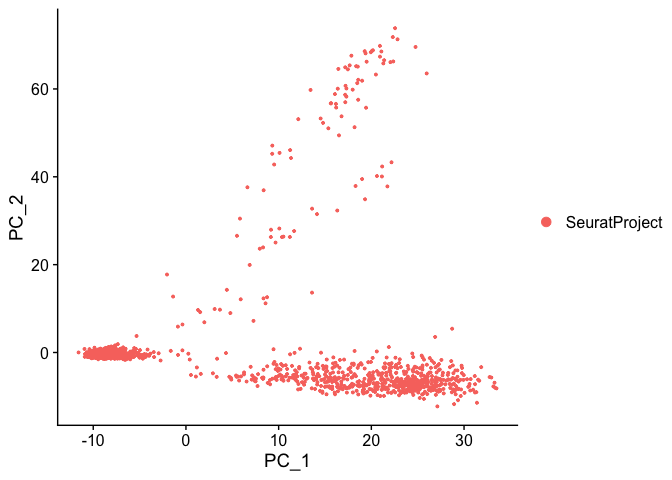<!-- -->

This plot shows some structure of the data. Every dot is a cell, but we
do not know which cells belong to which dot, etc. We can add meta
information by the `group.by` parameter. We use the `celltype` that we
have read from the metadata
object.

``` r
DimPlot(smartseq2, reduction = "pca", group.by = "celltype")
```

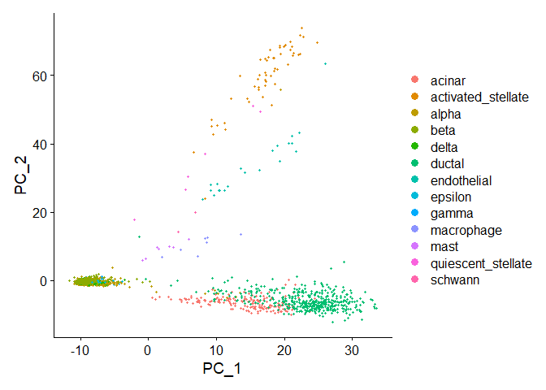<!-- -->

We can see that only a few of the labelled cell-types separate well but
many are clumped together on the bottom of the plot.

Let’s have a look at the PCs to understand a bit better how PCA
separates the data. Using the `DimHeatmap` function, we can plot the
expression of the top genes for each PC for a number of cells. We will
plot the first six components `dims = 1:6` for 500 random cells `cells
= 500`. Each component will produce one heatmap, the cells will be the
columns in the heatmap and the top genes for each component the
rows.

``` r
DimHeatmap(smartseq2, dims = 1:6, cells = 500, balanced = TRUE)
```

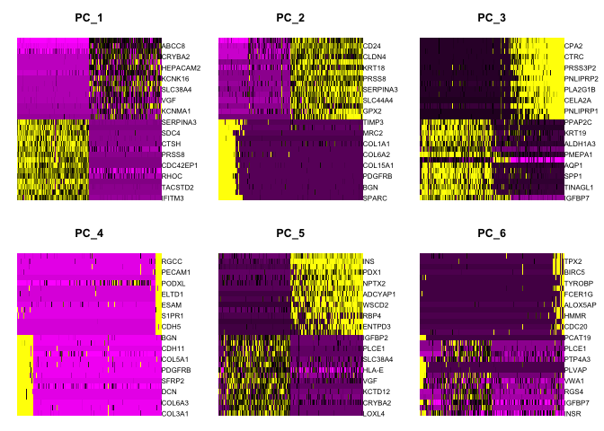<!-- -->

As discussed in the lecture, and indicated above, PCA is not optimal for
visualization, but can be very helpful in reducing the complexity before
applying non-linear dimensionality reduction methods. For that, let’s
have a look how many PCs actually cover the main vairation. A very
simple, fast-to-compute way is simply looking at the standard deviation
per PC. We use the
`ElbowPlot`.

``` r
ElbowPlot(smartseq2, ndims = 100)
```

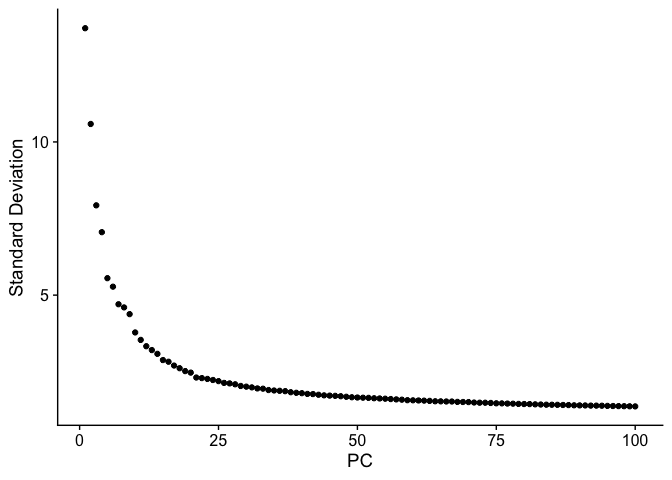<!-- -->

As we can see there is a very steep drop in standard deviation within
the first 20 or so PCs indicating that we will likelyl be able to use
roughly that number of PCs as input to follwing computations with little
impact on the results.

### t-SNE

Let’s try out t-SNE. Seurat by default uses the [Barnes Hut (BH) SNE
implementation](https://arxiv.org/abs/1301.3342).

Similar to the PCA Seurat provies a convenient function to run t-SNE
called `RunTSNE`. We provide the `smartseq2` data object as parameter.
By default `RunTSNE` will look for and use the PCA we created above as
input, we can also force it with `reduction = "pca"`. Again we use
`DimPlot` to plot the result, this time using `reduction = "tsne"` to
indicate that we want to plot the t-SNE computation. We create two
plots, the first without and the second with the cell-types used for
grouping. Already without the coloring, we can see much more structure
in the plot than in the PCA plot. With the color overlay we see that
most cell-types are nicely separated in the plot.

``` r
smartseq2 <- RunTSNE(smartseq2, reduction = "pca")

DimPlot(smartseq2, reduction = "tsne")
```

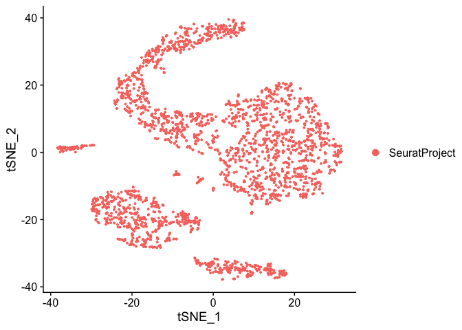<!-- -->

``` r
DimPlot(smartseq2, reduction = "tsne", group.by = "celltype")
```

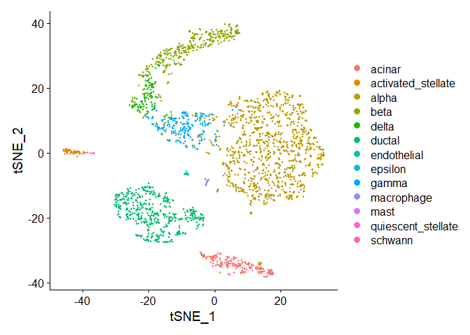<!-- -->

Above we did not specify the number of PCs to use as input. Let’s have a
look what happens with different numbers of PCs as input. We simply run
`RunTSNE` multiple times with `dims` defining a range of PCs. *Note*
every run overwrites the `tsne` object nested in the `smartseq2` object.
Therefore we plot the tsne directly after each run and store all plots
in the `tsne_mult` list. We add `+ NoLegend() + ggtitle("n PCs")` to
remove the list of cell types for compactness and add a title.

``` r
# PC_1 to PC_5
smartseq2 <- RunTSNE(smartseq2, reduction = "pca", dims = 1:5)
tsne_mult <- list(DimPlot(smartseq2, reduction = "tsne", group.by = "celltype") + NoLegend() + ggtitle("5 PCs"))

# PC_1 to PC_10
smartseq2 <- RunTSNE(smartseq2, reduction = "pca", dims = 1:10)
tsne_mult[[2]] <- DimPlot(smartseq2, reduction = "tsne", group.by = "celltype") + NoLegend() + ggtitle("10 PCs")

# PC_1 to PC_30
smartseq2 <- RunTSNE(smartseq2, reduction = "pca", dims = 1:30)
tsne_mult[[3]] <- DimPlot(smartseq2, reduction = "tsne", group.by = "celltype") + NoLegend() + ggtitle("30 PCs")

# PC_1 to PC_100
smartseq2 <- RunTSNE(smartseq2, reduction = "pca", dims = 1:100)
tsne_mult[[4]] <- DimPlot(smartseq2, reduction = "tsne", group.by = "celltype") + NoLegend() + ggtitle("100 PCs")

CombinePlots(plots = tsne_mult)
```

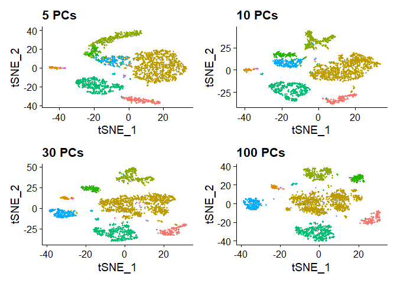<!-- -->

Looking at these plots, it seems `RunTSNE` by default only uses 5 PCs
(the plot is identical to the plot with default parameters above), but
we get much clearer separation of clusters using 10 or even 30 PCs. This
is not surprising considering the plot above of the standard deviation
within the PCs above. Therefore we will use 30 PCs in the following, by
explicitly setting `dims = 1:30`. *Note* that t-SNE is slower with more
input dimensions (here the PCs), so it is good to find a middleground
between capturing as much variation as possible with as few PCs as
possible. However, using the default 5 does clearly not produce optimal
results for this dataset. When using t-SNE with PCA preprocessing with
your own data, always check how many PCs you need to cover the variance,
as done above.

t-SNE has a few hyper-parameters that can be tuned for better
visualization. There is an [excellent
tutorial](https://distill.pub/2016/misread-tsne/). The main parameter is
the perplexity, basically indicating how many neighbors to look at. We
will run different perplexities to see the effect. As we will see, a
perplexity of 30 is the default. This value often works well, again it
might be advisable to test different values with other data. *Note*,
higher perplexity values make t-SNE slower to compute.

``` r
# Perplexity 3
smartseq2 <- RunTSNE(smartseq2, reduction = "pca", dims = 1:30, perplexity = 3)
tsne_mult <- list(DimPlot(smartseq2, reduction = "tsne", group.by = "celltype") + NoLegend() + ggtitle("30PCs, Perplexity 3"))

# Perplexity 10
smartseq2 <- RunTSNE(smartseq2, reduction = "pca", dims = 1:30, perplexity = 10)
tsne_mult[[2]] <- DimPlot(smartseq2, reduction = "tsne", group.by = "celltype") + NoLegend() + ggtitle("30PCs, Perplexity 10")

# Perplexity 30
smartseq2 <- RunTSNE(smartseq2, reduction = "pca", dims = 1:30, perplexity = 30)
tsne_mult[[3]] <- DimPlot(smartseq2, reduction = "tsne", group.by = "celltype") + NoLegend() + ggtitle("30PCs, Perplexity 30")

# Perplexity 200
smartseq2 <- RunTSNE(smartseq2, reduction = "pca", dims = 1:30, perplexity = 200)
tsne_mult[[4]] <- DimPlot(smartseq2, reduction = "tsne", group.by = "celltype") + NoLegend() + ggtitle("30PCs, Perplexity 200")

CombinePlots(plots = tsne_mult)
```

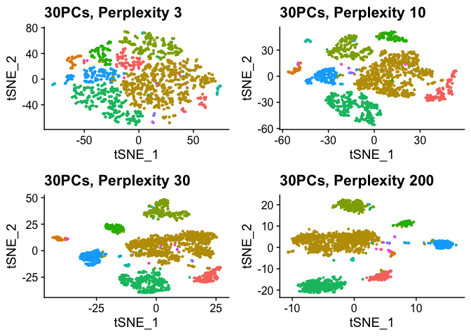<!-- -->

Another important parameter is the number of iterations. t-SNE gradually
optimizes the low-dimensional space. The more iterations the more there
is to optimize. We will run different numbers of iterations to see the
effect. As we will see, 1000 iterations is the default. This value often
works well, again it might be advisable to test different values with
other data. Especially for larger datasets you will need more
iterations. *Note*, more iterations make t-SNE slower to compute.

``` r
# 100 iterations
smartseq2 <- RunTSNE(smartseq2, reduction = "pca", dims = 1:30, max_iter = 100)
tsne_mult <- list(DimPlot(smartseq2, reduction = "tsne", group.by = "celltype") + NoLegend() + ggtitle("100 iterations"))

# 500 iterations
smartseq2 <- RunTSNE(smartseq2, reduction = "pca", dims = 1:30, max_iter = 500)
tsne_mult[[2]] <- DimPlot(smartseq2, reduction = "tsne", group.by = "celltype") + NoLegend() + ggtitle("500 iterations")

# 1000 iterations
smartseq2 <- RunTSNE(smartseq2, reduction = "pca", dims = 1:30, max_iter = 1000)
tsne_mult[[3]] <- DimPlot(smartseq2, reduction = "tsne", group.by = "celltype") + NoLegend() + ggtitle("1000 iterations")

# 2000 iterations
smartseq2 <- RunTSNE(smartseq2, reduction = "pca", dims = 1:30, max_iter = 2000)
tsne_mult[[4]] <- DimPlot(smartseq2, reduction = "tsne", group.by = "celltype") + NoLegend() + ggtitle("2000 iterations")

CombinePlots(plots = tsne_mult)
```

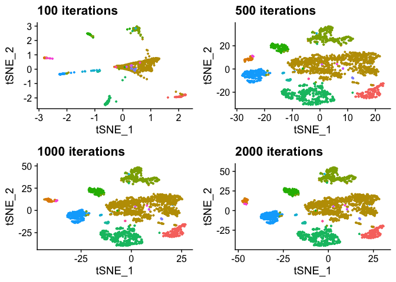<!-- -->

As we see after 100 iterations the main structure becomes apparent, but
there is very little detail. 500 to 2000 iterations all look very
similar, with 500 still a bit more loose than 1000, indicating that the
optimization converges somewhere between 500 and 1000 iterations. In
this case running 2000 would definitely not necessary.

### UMAP

We have seen t-SNE and it’s main parameters. Let’s have a look at UMAP.
Its main function call is very similar to t-SNE and PCA and called
`RunUMAP`. Again, by default it looks for the PCA in the `smartseq2`
data object, but we have to provide it with the number of PCs (or
`dims`) to use. Here, we use `30`. As expected, the plot looks rather
similar to the t-SNE plot, with more compact
    clusters.

``` r
smartseq2 <- RunUMAP(smartseq2, dims = 1:30)
```

    ## Warning: The default method for RunUMAP has changed from calling Python UMAP via reticulate to the R-native UWOT using the cosine metric
    ## To use Python UMAP via reticulate, set umap.method to 'umap-learn' and metric to 'correlation'
    ## This message will be shown once per session

    ## 11:35:40 UMAP embedding parameters a = 0.9922 b = 1.112

    ## 11:35:40 Read 2394 rows and found 30 numeric columns

    ## 11:35:40 Using Annoy for neighbor search, n_neighbors = 30

    ## 11:35:40 Building Annoy index with metric = cosine, n_trees = 50

    ## 0%   10   20   30   40   50   60   70   80   90   100%

    ## [----|----|----|----|----|----|----|----|----|----|

    ## **************************************************|
    ## 11:35:40 Writing NN index file to temp file /var/folders/t9/0110q2cj1fd512cpn27w71rh0000gn/T//RtmpSmPkwp/file56486bce46f8
    ## 11:35:40 Searching Annoy index using 1 thread, search_k = 3000
    ## 11:35:41 Annoy recall = 100%
    ## 11:35:41 Commencing smooth kNN distance calibration using 1 thread
    ## 11:35:41 Initializing from normalized Laplacian + noise
    ## 11:35:41 Commencing optimization for 500 epochs, with 96362 positive edges
    ## 11:35:45 Optimization finished

``` r
DimPlot(smartseq2, reduction = "umap", group.by = "celltype")
```

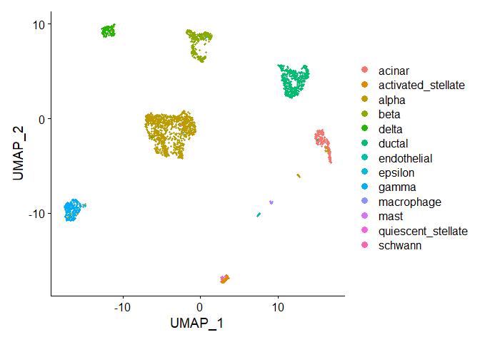<!-- -->

Just like t-SNE UMAP has a bunch of parameters. In fact, Seurat exposes
wuite a few more than for t-SNE. We will look at the most important in
the following. While there is no site that systematically and
interactively explores them as for t-SNE there is a [comparison with the
same datasets
available](https://jlmelville.github.io/uwot/umap-simple.html).

Again, we start with a different number of PCs. similar to t-SNE, 5 is
clearly not enough, 30 provides decent separation and detail. Just like
for t-SNE, test this parameter to match your own data in real-world
experiments.

``` r
# PC_1 to PC_5
smartseq2 <- RunUMAP(smartseq2, dims = 1:5)
```

    ## 11:35:46 UMAP embedding parameters a = 0.9922 b = 1.112

    ## 11:35:46 Read 2394 rows and found 5 numeric columns

    ## 11:35:46 Using Annoy for neighbor search, n_neighbors = 30

    ## 11:35:46 Building Annoy index with metric = cosine, n_trees = 50

    ## 0%   10   20   30   40   50   60   70   80   90   100%

    ## [----|----|----|----|----|----|----|----|----|----|

    ## **************************************************|
    ## 11:35:47 Writing NN index file to temp file /var/folders/t9/0110q2cj1fd512cpn27w71rh0000gn/T//RtmpSmPkwp/file56481ac336da
    ## 11:35:47 Searching Annoy index using 1 thread, search_k = 3000
    ## 11:35:47 Annoy recall = 100%
    ## 11:35:47 Commencing smooth kNN distance calibration using 1 thread
    ## 11:35:48 Initializing from normalized Laplacian + noise
    ## 11:35:48 Commencing optimization for 500 epochs, with 91420 positive edges
    ## 11:35:52 Optimization finished

``` r
umap_mult <- list(DimPlot(smartseq2, reduction = "umap", group.by = "celltype") + NoLegend() + ggtitle("5 PCs"))

# PC_1 to PC_10
smartseq2 <- RunUMAP(smartseq2, dims = 1:10)
```

    ## 11:35:52 UMAP embedding parameters a = 0.9922 b = 1.112
    ## 11:35:52 Read 2394 rows and found 10 numeric columns
    ## 11:35:52 Using Annoy for neighbor search, n_neighbors = 30
    ## 11:35:52 Building Annoy index with metric = cosine, n_trees = 50
    ## 0%   10   20   30   40   50   60   70   80   90   100%
    ## [----|----|----|----|----|----|----|----|----|----|
    ## **************************************************|
    ## 11:35:52 Writing NN index file to temp file /var/folders/t9/0110q2cj1fd512cpn27w71rh0000gn/T//RtmpSmPkwp/file56486462ff0
    ## 11:35:52 Searching Annoy index using 1 thread, search_k = 3000
    ## 11:35:53 Annoy recall = 100%
    ## 11:35:53 Commencing smooth kNN distance calibration using 1 thread
    ## 11:35:54 Initializing from normalized Laplacian + noise
    ## 11:35:54 Commencing optimization for 500 epochs, with 93358 positive edges
    ## 11:35:58 Optimization finished

``` r
umap_mult[[2]] <- DimPlot(smartseq2, reduction = "umap", group.by = "celltype") + NoLegend() + ggtitle("10 PCs")

# PC_1 to PC_30
smartseq2 <- RunUMAP(smartseq2, dims = 1:30)
```

    ## 11:35:58 UMAP embedding parameters a = 0.9922 b = 1.112
    ## 11:35:58 Read 2394 rows and found 30 numeric columns
    ## 11:35:58 Using Annoy for neighbor search, n_neighbors = 30
    ## 11:35:58 Building Annoy index with metric = cosine, n_trees = 50
    ## 0%   10   20   30   40   50   60   70   80   90   100%
    ## [----|----|----|----|----|----|----|----|----|----|
    ## **************************************************|
    ## 11:35:59 Writing NN index file to temp file /var/folders/t9/0110q2cj1fd512cpn27w71rh0000gn/T//RtmpSmPkwp/file564869f538c7
    ## 11:35:59 Searching Annoy index using 1 thread, search_k = 3000
    ## 11:35:59 Annoy recall = 100%
    ## 11:35:59 Commencing smooth kNN distance calibration using 1 thread
    ## 11:36:00 Initializing from normalized Laplacian + noise
    ## 11:36:00 Commencing optimization for 500 epochs, with 96362 positive edges
    ## 11:36:04 Optimization finished

``` r
umap_mult[[3]] <- DimPlot(smartseq2, reduction = "umap", group.by = "celltype") + NoLegend() + ggtitle("30 PCs")

# PC_1 to PC_100
smartseq2 <- RunUMAP(smartseq2, dims = 1:100)
```

    ## 11:36:04 UMAP embedding parameters a = 0.9922 b = 1.112
    ## 11:36:04 Read 2394 rows and found 100 numeric columns
    ## 11:36:04 Using Annoy for neighbor search, n_neighbors = 30
    ## 11:36:04 Building Annoy index with metric = cosine, n_trees = 50
    ## 0%   10   20   30   40   50   60   70   80   90   100%
    ## [----|----|----|----|----|----|----|----|----|----|
    ## **************************************************|
    ## 11:36:04 Writing NN index file to temp file /var/folders/t9/0110q2cj1fd512cpn27w71rh0000gn/T//RtmpSmPkwp/file56486262c729
    ## 11:36:05 Searching Annoy index using 1 thread, search_k = 3000
    ## 11:36:05 Annoy recall = 100%
    ## 11:36:05 Commencing smooth kNN distance calibration using 1 thread
    ## 11:36:06 Initializing from normalized Laplacian + noise
    ## 11:36:06 Commencing optimization for 500 epochs, with 101052 positive edges
    ## 11:36:10 Optimization finished

``` r
umap_mult[[4]] <- DimPlot(smartseq2, reduction = "umap", group.by = "celltype") + NoLegend() + ggtitle("100 PCs")

CombinePlots(plots = umap_mult)
```

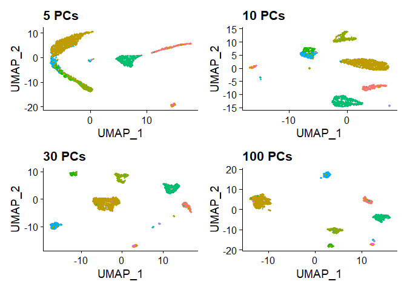<!-- -->

The `n.neighbors` parameter sets the number of neighbors to consider for
UMAP. This parameter is similar to the perplexity in t-SNE. We try a
similar range of values for comparison. The results are quite similar to
t-SNE. with low values, clearly the structures are too spread out, but
quickly the embeddings become quite stable. The default vaule for
RunUMAP is 30. Similar to t-SNE this value is quite general. Again, it’s
always a good idea to run some test with new data to find a good value.

``` r
# 3 Neighbors
smartseq2 <- RunUMAP(smartseq2, dims = 1:30, n.neighbors = 3)
```

    ## 11:36:12 UMAP embedding parameters a = 0.9922 b = 1.112

    ## 11:36:12 Read 2394 rows and found 30 numeric columns

    ## 11:36:12 Using Annoy for neighbor search, n_neighbors = 3

    ## 11:36:12 Building Annoy index with metric = cosine, n_trees = 50

    ## 0%   10   20   30   40   50   60   70   80   90   100%

    ## [----|----|----|----|----|----|----|----|----|----|

    ## **************************************************|
    ## 11:36:12 Writing NN index file to temp file /var/folders/t9/0110q2cj1fd512cpn27w71rh0000gn/T//RtmpSmPkwp/file56481953caf1
    ## 11:36:12 Searching Annoy index using 1 thread, search_k = 300
    ## 11:36:12 Annoy recall = 100%
    ## 11:36:13 Commencing smooth kNN distance calibration using 1 thread
    ## 11:36:13 Found 13 connected components, falling back to 'spca' initialization with init_sdev = 1
    ## 11:36:13 Initializing from PCA
    ## 11:36:13 PCA: 2 components explained 44.03% variance
    ## 11:36:13 Commencing optimization for 500 epochs, with 7612 positive edges
    ## 11:36:14 Optimization finished

``` r
umap_mult <- list(DimPlot(smartseq2, reduction = "umap", group.by = "celltype") + NoLegend() + ggtitle("3 Neighbors"))

# 10 Neighbors
smartseq2 <- RunUMAP(smartseq2, dims = 1:30, n.neighbors = 10)
```

    ## 11:36:14 UMAP embedding parameters a = 0.9922 b = 1.112
    ## 11:36:14 Read 2394 rows and found 30 numeric columns
    ## 11:36:14 Using Annoy for neighbor search, n_neighbors = 10
    ## 11:36:14 Building Annoy index with metric = cosine, n_trees = 50
    ## 0%   10   20   30   40   50   60   70   80   90   100%
    ## [----|----|----|----|----|----|----|----|----|----|
    ## **************************************************|
    ## 11:36:15 Writing NN index file to temp file /var/folders/t9/0110q2cj1fd512cpn27w71rh0000gn/T//RtmpSmPkwp/file56484c30a134
    ## 11:36:15 Searching Annoy index using 1 thread, search_k = 1000
    ## 11:36:15 Annoy recall = 100%
    ## 11:36:15 Commencing smooth kNN distance calibration using 1 thread
    ## 11:36:15 Found 4 connected components, falling back to 'spca' initialization with init_sdev = 1
    ## 11:36:15 Initializing from PCA
    ## 11:36:15 PCA: 2 components explained 44.03% variance
    ## 11:36:15 Commencing optimization for 500 epochs, with 31898 positive edges
    ## 11:36:18 Optimization finished

``` r
umap_mult[[2]] <- DimPlot(smartseq2, reduction = "umap", group.by = "celltype") + NoLegend() + ggtitle("10 Neighbors")

# 30 Neighbors
smartseq2 <- RunUMAP(smartseq2, dims = 1:30, n.neighbors = 30)
```

    ## 11:36:18 UMAP embedding parameters a = 0.9922 b = 1.112
    ## 11:36:18 Read 2394 rows and found 30 numeric columns
    ## 11:36:18 Using Annoy for neighbor search, n_neighbors = 30
    ## 11:36:18 Building Annoy index with metric = cosine, n_trees = 50
    ## 0%   10   20   30   40   50   60   70   80   90   100%
    ## [----|----|----|----|----|----|----|----|----|----|
    ## **************************************************|
    ## 11:36:18 Writing NN index file to temp file /var/folders/t9/0110q2cj1fd512cpn27w71rh0000gn/T//RtmpSmPkwp/file5648ca78400
    ## 11:36:18 Searching Annoy index using 1 thread, search_k = 3000
    ## 11:36:19 Annoy recall = 100%
    ## 11:36:19 Commencing smooth kNN distance calibration using 1 thread
    ## 11:36:19 Initializing from normalized Laplacian + noise
    ## 11:36:20 Commencing optimization for 500 epochs, with 96362 positive edges
    ## 11:36:24 Optimization finished

``` r
umap_mult[[3]] <- DimPlot(smartseq2, reduction = "umap", group.by = "celltype") + NoLegend() + ggtitle("30 Neighbors")

# 200 Neighbors
smartseq2 <- RunUMAP(smartseq2, dims = 1:30, n.neighbors = 200)
```

    ## 11:36:24 UMAP embedding parameters a = 0.9922 b = 1.112
    ## 11:36:24 Read 2394 rows and found 30 numeric columns
    ## 11:36:24 Using Annoy for neighbor search, n_neighbors = 200
    ## 11:36:24 Building Annoy index with metric = cosine, n_trees = 50
    ## 0%   10   20   30   40   50   60   70   80   90   100%
    ## [----|----|----|----|----|----|----|----|----|----|
    ## **************************************************|
    ## 11:36:24 Writing NN index file to temp file /var/folders/t9/0110q2cj1fd512cpn27w71rh0000gn/T//RtmpSmPkwp/file564849cb227d
    ## 11:36:24 Searching Annoy index using 1 thread, search_k = 20000
    ## 11:36:27 Annoy recall = 100%
    ## 11:36:27 Commencing smooth kNN distance calibration using 1 thread
    ## 11:36:28 Initializing from normalized Laplacian + noise
    ## 11:36:28 Commencing optimization for 500 epochs, with 368410 positive edges
    ## 11:36:35 Optimization finished

``` r
umap_mult[[4]] <- DimPlot(smartseq2, reduction = "umap", group.by = "celltype") + NoLegend() + ggtitle("200 Neighbors")

CombinePlots(plots = umap_mult)
```

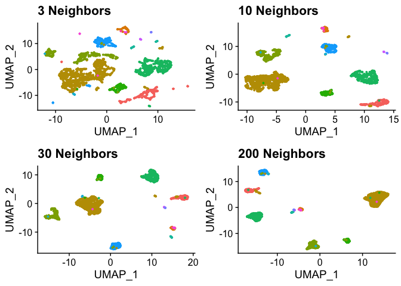<!-- -->

Another parameter is `min.dist`. There is no directly comparable
parameter in t-SNE. Generally, `min.dist` defines the compactnes of the
final embedding. The default value is 0.3.

``` r
# Min Distance 0.01
smartseq2 <- RunUMAP(smartseq2, dims = 1:30, min.dist = 0.01)
```

    ## 11:36:36 UMAP embedding parameters a = 1.896 b = 0.8006

    ## 11:36:36 Read 2394 rows and found 30 numeric columns

    ## 11:36:36 Using Annoy for neighbor search, n_neighbors = 30

    ## 11:36:36 Building Annoy index with metric = cosine, n_trees = 50

    ## 0%   10   20   30   40   50   60   70   80   90   100%

    ## [----|----|----|----|----|----|----|----|----|----|

    ## **************************************************|
    ## 11:36:37 Writing NN index file to temp file /var/folders/t9/0110q2cj1fd512cpn27w71rh0000gn/T//RtmpSmPkwp/file56482c3eaf95
    ## 11:36:37 Searching Annoy index using 1 thread, search_k = 3000
    ## 11:36:37 Annoy recall = 100%
    ## 11:36:37 Commencing smooth kNN distance calibration using 1 thread
    ## 11:36:38 Initializing from normalized Laplacian + noise
    ## 11:36:38 Commencing optimization for 500 epochs, with 96362 positive edges
    ## 11:36:42 Optimization finished

``` r
umap_mult <- list(DimPlot(smartseq2, reduction = "umap", group.by = "celltype") + NoLegend() + ggtitle("Min Dist 0.01"))

# Min Distance 0.1
smartseq2 <- RunUMAP(smartseq2, dims = 1:30, min.dist = 0.1)
```

    ## 11:36:42 UMAP embedding parameters a = 1.577 b = 0.8951
    ## 11:36:42 Read 2394 rows and found 30 numeric columns
    ## 11:36:42 Using Annoy for neighbor search, n_neighbors = 30
    ## 11:36:42 Building Annoy index with metric = cosine, n_trees = 50
    ## 0%   10   20   30   40   50   60   70   80   90   100%
    ## [----|----|----|----|----|----|----|----|----|----|
    ## **************************************************|
    ## 11:36:42 Writing NN index file to temp file /var/folders/t9/0110q2cj1fd512cpn27w71rh0000gn/T//RtmpSmPkwp/file5648477975e4
    ## 11:36:42 Searching Annoy index using 1 thread, search_k = 3000
    ## 11:36:43 Annoy recall = 100%
    ## 11:36:43 Commencing smooth kNN distance calibration using 1 thread
    ## 11:36:43 Initializing from normalized Laplacian + noise
    ## 11:36:43 Commencing optimization for 500 epochs, with 96362 positive edges
    ## 11:36:48 Optimization finished

``` r
umap_mult[[2]] <- DimPlot(smartseq2, reduction = "umap", group.by = "celltype") + NoLegend() + ggtitle("Min Dist 0.1")

# Min Distance 0.3
smartseq2 <- RunUMAP(smartseq2, dims = 1:30, min.dist = 0.3)
```

    ## 11:36:48 UMAP embedding parameters a = 0.9922 b = 1.112
    ## 11:36:48 Read 2394 rows and found 30 numeric columns
    ## 11:36:48 Using Annoy for neighbor search, n_neighbors = 30
    ## 11:36:48 Building Annoy index with metric = cosine, n_trees = 50
    ## 0%   10   20   30   40   50   60   70   80   90   100%
    ## [----|----|----|----|----|----|----|----|----|----|
    ## **************************************************|
    ## 11:36:48 Writing NN index file to temp file /var/folders/t9/0110q2cj1fd512cpn27w71rh0000gn/T//RtmpSmPkwp/file5648772af064
    ## 11:36:48 Searching Annoy index using 1 thread, search_k = 3000
    ## 11:36:49 Annoy recall = 100%
    ## 11:36:49 Commencing smooth kNN distance calibration using 1 thread
    ## 11:36:49 Initializing from normalized Laplacian + noise
    ## 11:36:49 Commencing optimization for 500 epochs, with 96362 positive edges
    ## 11:36:53 Optimization finished

``` r
umap_mult[[3]] <- DimPlot(smartseq2, reduction = "umap", group.by = "celltype") + NoLegend() + ggtitle("Min Dist 0.3")

# Min Distance 1.0
smartseq2 <- RunUMAP(smartseq2, dims = 1:30, min.dist = 1.0)
```

    ## 11:36:53 UMAP embedding parameters a = 0.115 b = 1.929
    ## 11:36:53 Read 2394 rows and found 30 numeric columns
    ## 11:36:53 Using Annoy for neighbor search, n_neighbors = 30
    ## 11:36:53 Building Annoy index with metric = cosine, n_trees = 50
    ## 0%   10   20   30   40   50   60   70   80   90   100%
    ## [----|----|----|----|----|----|----|----|----|----|
    ## **************************************************|
    ## 11:36:54 Writing NN index file to temp file /var/folders/t9/0110q2cj1fd512cpn27w71rh0000gn/T//RtmpSmPkwp/file5648240c725b
    ## 11:36:54 Searching Annoy index using 1 thread, search_k = 3000
    ## 11:36:54 Annoy recall = 100%
    ## 11:36:54 Commencing smooth kNN distance calibration using 1 thread
    ## 11:36:55 Initializing from normalized Laplacian + noise
    ## 11:36:55 Commencing optimization for 500 epochs, with 96362 positive edges
    ## 11:36:59 Optimization finished

``` r
umap_mult[[4]] <- DimPlot(smartseq2, reduction = "umap", group.by = "celltype") + NoLegend() + ggtitle("Min Dist 1.0")

CombinePlots(plots = umap_mult)
```

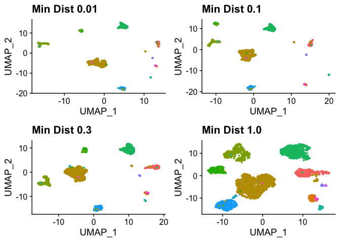<!-- -->

n.epochs is comparable to the number of iterations in t-SNE. Typically,
UMAP needs fewer of these to converge, but also changes more when it is
run longer. The default is 500. Again, this should be adjusted to your
data.

``` r
# 10 epochs
smartseq2 <- RunUMAP(smartseq2, dims = 1:30, n.epochs = 10)
```

    ## 11:37:00 UMAP embedding parameters a = 0.9922 b = 1.112

    ## 11:37:00 Read 2394 rows and found 30 numeric columns

    ## 11:37:00 Using Annoy for neighbor search, n_neighbors = 30

    ## 11:37:00 Building Annoy index with metric = cosine, n_trees = 50

    ## 0%   10   20   30   40   50   60   70   80   90   100%

    ## [----|----|----|----|----|----|----|----|----|----|

    ## **************************************************|
    ## 11:37:01 Writing NN index file to temp file /var/folders/t9/0110q2cj1fd512cpn27w71rh0000gn/T//RtmpSmPkwp/file5648e70295f
    ## 11:37:01 Searching Annoy index using 1 thread, search_k = 3000
    ## 11:37:01 Annoy recall = 100%
    ## 11:37:01 Commencing smooth kNN distance calibration using 1 thread
    ## 11:37:02 Initializing from normalized Laplacian + noise
    ## 11:37:02 Commencing optimization for 10 epochs, with 48114 positive edges
    ## 11:37:02 Optimization finished

``` r
umap_mult <- list(DimPlot(smartseq2, reduction = "umap", group.by = "celltype") + NoLegend() + ggtitle("10 Epochs"))

# 100 epochs
smartseq2 <- RunUMAP(smartseq2, dims = 1:30, n.epochs = 100)
```

    ## 11:37:02 UMAP embedding parameters a = 0.9922 b = 1.112
    ## 11:37:02 Read 2394 rows and found 30 numeric columns
    ## 11:37:02 Using Annoy for neighbor search, n_neighbors = 30
    ## 11:37:02 Building Annoy index with metric = cosine, n_trees = 50
    ## 0%   10   20   30   40   50   60   70   80   90   100%
    ## [----|----|----|----|----|----|----|----|----|----|
    ## **************************************************|
    ## 11:37:02 Writing NN index file to temp file /var/folders/t9/0110q2cj1fd512cpn27w71rh0000gn/T//RtmpSmPkwp/file564865ac2360
    ## 11:37:02 Searching Annoy index using 1 thread, search_k = 3000
    ## 11:37:03 Annoy recall = 100%
    ## 11:37:03 Commencing smooth kNN distance calibration using 1 thread
    ## 11:37:03 Initializing from normalized Laplacian + noise
    ## 11:37:03 Commencing optimization for 100 epochs, with 93004 positive edges
    ## 11:37:04 Optimization finished

``` r
umap_mult[[2]] <- DimPlot(smartseq2, reduction = "umap", group.by = "celltype") + NoLegend() + ggtitle("100 Epochs")

# 500 epochs
smartseq2 <- RunUMAP(smartseq2, dims = 1:30, n.epochs = 500)
```

    ## 11:37:04 UMAP embedding parameters a = 0.9922 b = 1.112
    ## 11:37:04 Read 2394 rows and found 30 numeric columns
    ## 11:37:04 Using Annoy for neighbor search, n_neighbors = 30
    ## 11:37:04 Building Annoy index with metric = cosine, n_trees = 50
    ## 0%   10   20   30   40   50   60   70   80   90   100%
    ## [----|----|----|----|----|----|----|----|----|----|
    ## **************************************************|
    ## 11:37:05 Writing NN index file to temp file /var/folders/t9/0110q2cj1fd512cpn27w71rh0000gn/T//RtmpSmPkwp/file5648846a7c6
    ## 11:37:05 Searching Annoy index using 1 thread, search_k = 3000
    ## 11:37:05 Annoy recall = 100%
    ## 11:37:05 Commencing smooth kNN distance calibration using 1 thread
    ## 11:37:06 Initializing from normalized Laplacian + noise
    ## 11:37:06 Commencing optimization for 500 epochs, with 96362 positive edges
    ## 11:37:10 Optimization finished

``` r
umap_mult[[3]] <- DimPlot(smartseq2, reduction = "umap", group.by = "celltype") + NoLegend() + ggtitle("500 Epochs")

# 1000 epochs
smartseq2 <- RunUMAP(smartseq2, dims = 1:30, n.epochs = 1000)
```

    ## 11:37:10 UMAP embedding parameters a = 0.9922 b = 1.112
    ## 11:37:10 Read 2394 rows and found 30 numeric columns
    ## 11:37:10 Using Annoy for neighbor search, n_neighbors = 30
    ## 11:37:10 Building Annoy index with metric = cosine, n_trees = 50
    ## 0%   10   20   30   40   50   60   70   80   90   100%
    ## [----|----|----|----|----|----|----|----|----|----|
    ## **************************************************|
    ## 11:37:10 Writing NN index file to temp file /var/folders/t9/0110q2cj1fd512cpn27w71rh0000gn/T//RtmpSmPkwp/file564856b0bc68
    ## 11:37:10 Searching Annoy index using 1 thread, search_k = 3000
    ## 11:37:11 Annoy recall = 100%
    ## 11:37:11 Commencing smooth kNN distance calibration using 1 thread
    ## 11:37:11 Initializing from normalized Laplacian + noise
    ## 11:37:11 Commencing optimization for 1000 epochs, with 96728 positive edges
    ## 11:37:19 Optimization finished

``` r
umap_mult[[4]] <- DimPlot(smartseq2, reduction = "umap", group.by = "celltype") + NoLegend() + ggtitle("1000 Epochs")

CombinePlots(plots = umap_mult)
```

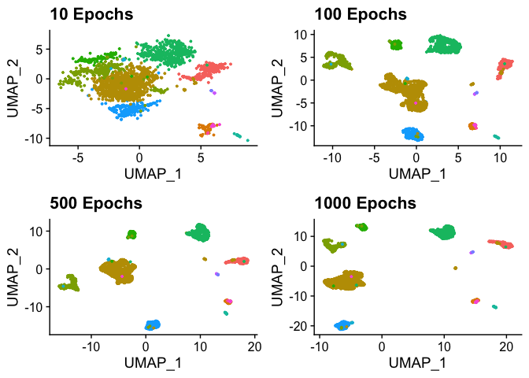<!-- -->

Finally `RunUMAP` allows to set the distance metric for the
high-dimensional space. While in principle this is also possible with
t-SNE, `RunTSNE`, and most other implementations, do not provide this
option. The four posibilites, `Euclidean`, `cosine`, `manhattan`, and
`hamming` distance are shown below. `Cosine` distance is the default
(RunTSNE uses Euclidean distances).

There is not necesarily a clear winner. Hamming distances perfom worse
but they are usually used for different data, such as text as they
ignore the numerical difference for a given comparison. Going with the
dafualt cosine is definitely not a bad choice in most applications.

``` r
# Euclidena distance
smartseq2 <- RunUMAP(smartseq2, dims = 1:30, metric = "euclidean")
```

    ## 11:37:21 UMAP embedding parameters a = 0.9922 b = 1.112

    ## 11:37:21 Read 2394 rows and found 30 numeric columns

    ## 11:37:21 Using FNN for neighbor search, n_neighbors = 30

    ## 11:37:21 Commencing smooth kNN distance calibration using 1 thread

    ## 11:37:22 Initializing from normalized Laplacian + noise

    ## 11:37:22 Commencing optimization for 500 epochs, with 98320 positive edges

    ## 11:37:26 Optimization finished

``` r
umap_mult <- list(DimPlot(smartseq2, reduction = "umap", group.by = "celltype") + NoLegend() + ggtitle("Euclidean"))

# Cosine distance
smartseq2 <- RunUMAP(smartseq2, dims = 1:30, metric = "cosine")
```

    ## 11:37:26 UMAP embedding parameters a = 0.9922 b = 1.112

    ## 11:37:26 Read 2394 rows and found 30 numeric columns

    ## 11:37:26 Using Annoy for neighbor search, n_neighbors = 30

    ## 11:37:26 Building Annoy index with metric = cosine, n_trees = 50

    ## 0%   10   20   30   40   50   60   70   80   90   100%

    ## [----|----|----|----|----|----|----|----|----|----|

    ## **************************************************|
    ## 11:37:26 Writing NN index file to temp file /var/folders/t9/0110q2cj1fd512cpn27w71rh0000gn/T//RtmpSmPkwp/file564831681cdb
    ## 11:37:26 Searching Annoy index using 1 thread, search_k = 3000
    ## 11:37:27 Annoy recall = 100%
    ## 11:37:27 Commencing smooth kNN distance calibration using 1 thread
    ## 11:37:27 Initializing from normalized Laplacian + noise
    ## 11:37:27 Commencing optimization for 500 epochs, with 96362 positive edges
    ## 11:37:31 Optimization finished

``` r
umap_mult[[2]] <- DimPlot(smartseq2, reduction = "umap", group.by = "celltype") + NoLegend() + ggtitle("Cosine")

# Manhattan distance
smartseq2 <- RunUMAP(smartseq2, dims = 1:30, metric = "manhattan")
```

    ## 11:37:31 UMAP embedding parameters a = 0.9922 b = 1.112
    ## 11:37:31 Read 2394 rows and found 30 numeric columns
    ## 11:37:31 Using Annoy for neighbor search, n_neighbors = 30
    ## 11:37:31 Building Annoy index with metric = manhattan, n_trees = 50
    ## 0%   10   20   30   40   50   60   70   80   90   100%
    ## [----|----|----|----|----|----|----|----|----|----|
    ## **************************************************|
    ## 11:37:32 Writing NN index file to temp file /var/folders/t9/0110q2cj1fd512cpn27w71rh0000gn/T//RtmpSmPkwp/file56482a3e8734
    ## 11:37:32 Searching Annoy index using 1 thread, search_k = 3000
    ## 11:37:32 Annoy recall = 100%
    ## 11:37:32 Commencing smooth kNN distance calibration using 1 thread
    ## 11:37:33 Initializing from normalized Laplacian + noise
    ## 11:37:33 Commencing optimization for 500 epochs, with 98884 positive edges
    ## 11:37:37 Optimization finished

``` r
umap_mult[[3]] <- DimPlot(smartseq2, reduction = "umap", group.by = "celltype") + NoLegend() + ggtitle("Manhattan")

# Hamming distance
smartseq2 <- RunUMAP(smartseq2, dims = 1:30, metric = "hamming")
```

    ## 11:37:37 UMAP embedding parameters a = 0.9922 b = 1.112
    ## 11:37:37 Read 2394 rows and found 30 numeric columns
    ## 11:37:37 Using Annoy for neighbor search, n_neighbors = 30
    ## 11:37:37 Building Annoy index with metric = hamming, n_trees = 50
    ## 0%   10   20   30   40   50   60   70   80   90   100%
    ## [----|----|----|----|----|----|----|----|----|----|
    ## **************************************************|
    ## 11:37:37 Writing NN index file to temp file /var/folders/t9/0110q2cj1fd512cpn27w71rh0000gn/T//RtmpSmPkwp/file56486f1e7c96
    ## 11:37:37 Searching Annoy index using 1 thread, search_k = 3000
    ## 11:37:38 Annoy recall = 100%
    ## 11:37:38 Commencing smooth kNN distance calibration using 1 thread
    ## 11:37:38 3 smooth knn distance failures
    ## 11:37:38 Initializing from normalized Laplacian + noise
    ## 11:37:38 Commencing optimization for 500 epochs, with 94656 positive edges
    ## 11:37:42 Optimization finished

``` r
umap_mult[[4]] <- DimPlot(smartseq2, reduction = "umap", group.by = "celltype") + NoLegend() + ggtitle("Hamming")

CombinePlots(plots = umap_mult)
```

<!-- -->

## Visualization

Finally, let’s have a brief look at some visualization options. We have
already use color gor gouping. With `label = TRUE` we can add a
text-label to each group and with `repel = TRUE` we can make sure those
labels dont clump together. Finally, `pt.size = 0.5` changes the size of
the dots used in the plot.

``` r
#Re-run a t-SNE so we do not rely on changes above
smartseq2 <- RunTSNE(smartseq2, dims = 1:30)

DimPlot(smartseq2, reduction = "tsne", group.by = "celltype", label = TRUE, repel = TRUE, pt.size = 0.5) + NoLegend()
```

    ## Warning: Using `as.character()` on a quosure is deprecated as of rlang 0.3.0.
    ## Please use `as_label()` or `as_name()` instead.
    ## This warning is displayed once per session.

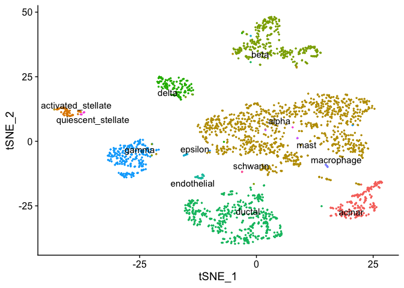<!-- -->

Another property we might want to look at in our dimensionality
reduction plot is the expression of individual Genes. We can overlay
gene expression as color using the `FeaturePlot`. Here, we first find
the *top two* features correlated to the *first and second PCs* and
combine them into a single vector which will be the parameter for the
`FeaturePlot`.

Finally, we call `FeaturePlot` with the `smartseq2` data object,
`features = topFeaturesPC` uses the extracted feature vector to create
one plot for each feature in the list and lastly, `reduction = "pca"`
will create PCA plots.

Not surprisingly, the top two features of the first PC form a smooth
gradient on the PC\_1 axis and the top two features of the second PC a
smooth gradient on the PC\_2 axis.

``` r
# find top genes for PCs 1 and 2
topFeaturesPC1 <- TopFeatures(object = smartseq2[["pca"]], nfeatures = 2, dim = 1)
topFeaturesPC2 <- TopFeatures(object = smartseq2[["pca"]], nfeatures = 2, dim = 2)

# combine the genes into a single vector
topFeaturesPC <- c(topFeaturesPC1, topFeaturesPC2)
print(topFeaturesPC)
```

    ## [1] "LGALS3" "IFITM3" "COL1A2" "SPARC"

``` r
# feature plot with the defined genes
FeaturePlot(smartseq2, features = topFeaturesPC, reduction = "pca")
```

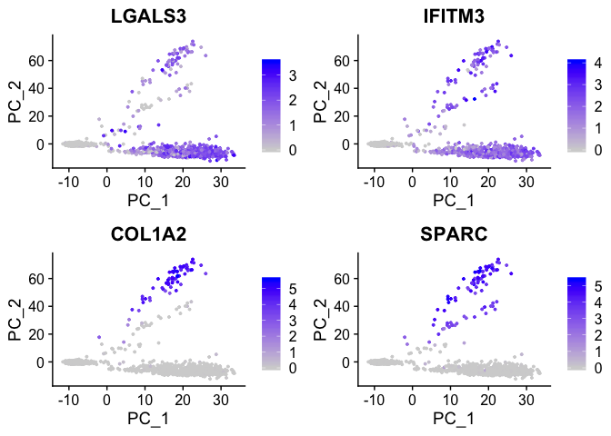<!-- -->

Let’s have a look at the same features on a t-SNE plot. The bahvior here
is quite different, with the high expression being very localized to
specific clusters in the maps. Again, not surprising as t-SNE uses
these

``` r
FeaturePlot(smartseq2, features = topFeaturesPC, reduction = "tsne")
```

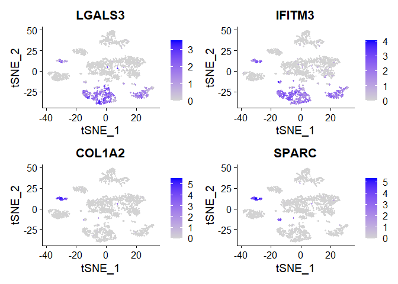<!-- -->

It is clear that the top PCs are fundamental to forming the clusters, so
let’s have a look at more PCs and pick the top gene per PC for a few
more PCs.

``` r
for(i in 1:6) {
  topFeaturesPC[[i]] <- TopFeatures(object = smartseq2[["pca"]], nfeatures = 1, dim = i)
}
print(topFeaturesPC)
```

    ## [1] "IFITM3" "SPARC"  "CTRB1"  "PLVAP"  "HADH"   "NUSAP1"

``` r
FeaturePlot(smartseq2, features = topFeaturesPC, reduction = "tsne")
```

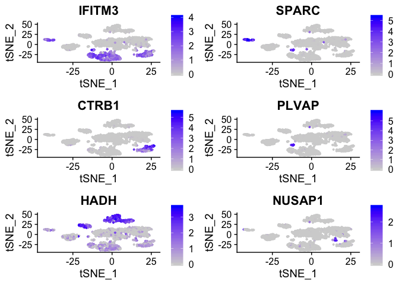<!-- -->

Finally, let’s create a more interactive plot. First we create a regular
`FeaturePlot`, here with just one gene `features = "TM4SF4"`. Instead of
plotting in directly we save the plot in the `interactivePlot` variable.

With `HoverLocator` we can then embedd this plot into an interactive
version. The `information = FetchData(smartseq2, vars = c("celltype",
topFeaturesPC))` creates a set of properties that will be shown on hover
over each point. Im this case, we show the cell-type from the meta
information.

The result is a plot that allows us to inspect single cells in
detail.

``` r
interactivePlot <- FeaturePlot(smartseq2, reduction = "tsne", features = "TM4SF4")

HoverLocator(plot = interactivePlot, information = FetchData(smartseq2, vars = c("celltype", topFeaturesPC)))
```

    ## Warning in if (is.na(col)) {: the condition has length > 1 and only the
    ## first element will be used
    
    ## Warning in if (is.na(col)) {: the condition has length > 1 and only the
    ## first element will be used

    ## Warning: `error_y.color` does not currently support multiple values.

    ## Warning: `error_x.color` does not currently support multiple values.

    ## Warning: `line.color` does not currently support multiple values.

    ## Warning: The titlefont attribute is deprecated. Use title = list(font
    ## = ...) instead.

<!--html_preserve-->

<div id="htmlwidget-93ac06fd2bcec9a15727" class="plotly html-widget" style="width:672px;height:480px;">

</div>

<script type="application/json" data-for="htmlwidget-93ac06fd2bcec9a15727">{"x":{"visdat":{"564831c1afcc":["function () ","plotlyVisDat"]},"cur_data":"564831c1afcc","attrs":{"564831c1afcc":{"x":{},"y":{},"mode":"markers","hoverinfo":"text","text":{},"color":{},"alpha_stroke":1,"sizes":[10,100],"spans":[1,20],"type":"scatter"}},"layout":{"margin":{"b":40,"l":60,"t":25,"r":10},"xaxis":{"domain":[0,1],"automargin":true,"title":"tSNE_1","showgrid":false,"zeroline":false,"showline":true},"yaxis":{"domain":[0,1],"automargin":true,"title":"tSNE_2","showgrid":false,"zeroline":false,"showline":true},"title":"TM4SF4","titlefont":{"color":"black"},"paper_bgcolor":"white","plot_bgcolor":"white","hovermode":"closest","showlegend":false},"source":"A","config":{"showSendToCloud":false},"data":[{"x":[-16.145319080785,-6.61573809297628,-14.589336721471,-26.6153768612577,-3.01670228358509,24.6642661023257,-2.257936403513,-19.5017299442952,-15.430842456339,2.73513671024427,2.65911057287398,2.32577525592693,5.32062114630375,3.58866982726749,18.9847593234294,2.42072025574577,2.62586852203067,-2.08848424883421,-16.3863491437396,1.99328704260707,-7.22884279101062,-1.64703552159556,1.33339751752453,1.50465082919561,-0.213316015097253,-25.0133483019436,-1.34811393351173,1.30280569160041,1.94822220074479,-16.6509399110056,-1.70192231386091,1.94557225315719,-27.8777444302674,1.46451030381122,-12.5732968660379,2.20190243403882,14.8767945226476,1.15594766494549,3.49074726576126,0.0280774941827734,3.0706798335846,3.51240300388262,-1.38975949289016,-2.10477055227022,1.97241571100163,-40.4935547629134,24.3178142142918,-3.85509765408671,2.85314894102789,-1.15881741524009,1.13686487008105,-2.28280305667688,-7.00915735727788,0.885605125273069,-24.2362028375769,-16.2531822105104,18.4235864015003,-2.02530620447764,-23.1935620556384,-4.53143114735963,1.2391619556307,-1.90986268412633,3.14022672867778,18.9533816501869,-5.48168611075406,4.19513487559832,-16.340038273831,-20.4103242942102,18.5179937541362,-17.2038563075715,1.92638397180353,-1.23542218467043,4.4047487737746,1.58882669044185,15.1177991710813,-27.6756485646394,-0.413570242222891,-31.0108692734174,-3.76612060473788,18.2745575581853,-23.3578413094226,-3.04666654103819,2.91906992142254,-1.3161763382805,0.845279750904327,3.73752360456178,0.398177091199225,-17.1196860602328,17.5451060018783,-0.0534385219965383,3.85167441236365,-0.345821494297487,2.18188998321342,-0.235442258783638,-17.6925287281285,-1.12408876687272,6.33321759333974,-14.4877135934828,-0.126010842160228,0.263509498677318,-15.9488558083208,20.2658097784053,18.8701288267421,-18.4373813036062,-0.959592840277741,-3.99296839841675,-16.9997296733992,2.36809009519206,23.2731299524983,-2.76004748756902,0.151005406106994,4.32331260151714,1.57060952507202,2.89907208223994,1.68201810555381,-0.218811953486644,-1.42685029196519,2.71178161928077,3.20142943120994,3.87786242111463,-15.2321279553459,0.610738643716608,-21.4535643316838,-0.901196369930658,22.3925824302259,19.0327920696715,9.54757317231069,0.31052495496993,23.4938501550449,19.2743599618742,-16.1778424744478,-25.7621928857732,3.56850336375767,-28.9311433501233,-20.2961562714972,-4.50855075168346,-17.0693640962929,3.17936295325637,19.2798452835521,-24.5625241688638,1.05538797635315,-25.2199992669207,-24.1772061401342,-2.05138975446653,5.16523480204281,0.713407550373318,-2.29308503353272,3.56268547955949,1.95140901747609,1.74572970998355,2.4068029885604,15.0729629015328,-27.58786789043,-26.5834853877132,0.352198187342299,21.0938391704384,-13.7683668479595,-2.1589266606845,0.319653281933976,0.549281864186586,-15.1812991131352,-0.500089423104307,0.156165795575473,0.804450114581216,7.79909038555249,0.991722725714274,0.623643630828721,-7.42688216870151,-0.469330424066788,2.69572213095389,-27.3150130593434,-3.73136195478337,-1.91604736814306,-5.72894383215312,-38.2260702505166,-0.80668320226792,4.01874024593775,-1.77376091188663,3.97029200693968,1.36004382850696,-0.743015445062116,-3.17030823222711,-2.60183377894199,-0.540189083418421,3.7715144528365,-17.7627912473669,0.384981030967749,-6.28540530437703,1.98121979859627,-11.6381987247723,15.8961534886488,0.339418304423908,1.01928377845837,5.93596795233326,2.65883406661179,-2.87247324399548,1.60041333240086,18.1824422526107,0.313875394254111,18.5086842279579,10.876854692097,-15.9316893657468,-23.4929392075755,-17.7634409153113,-3.83597687312575,-1.23256915467249,-5.51783159483535,2.52340463255248,-1.66825661973054,2.06652736008816,-2.87371078429869,-0.913865455141908,-0.0938630402709797,20.1897234146875,-3.4607014567663,-4.77401930420232,0.743185104461771,-1.04487841906028,3.77069430598382,11.5807059524019,-6.22639070696037,8.76751501754409,-6.39179436769322,-2.44449512558669,18.4140121163694,5.07957456137674,17.9861740415487,-26.6423125423449,-5.14914536332404,4.25418801030108,-5.87660358979901,0.559333486273446,0.86132742405221,-0.471425459401666,-1.69063864349108,-26.1683171207431,-27.2113558561275,4.66263611876081,-1.37694476077897,-3.9496522141271,3.45403338256468,-1.1138428951476,2.1766072798762,-1.62033475145606,-3.32164325822123,5.52595431418257,-27.8569913969971,3.65402942760669,-1.64349803218178,-8.45593842501454,5.28452096843288,-0.674767075070101,6.07709227342656,3.26214175425892,-3.91442939373328,-5.21916076067391,-7.13246610123268,0.396546309481528,-0.700081341580418,-8.14487705068579,-3.50706274899089,-3.20340444286221,-6.17855274939262,5.2281008304236,3.09263725545455,4.48783765958623,1.429956399135,5.06421845347048,5.54286870865748,2.64355585660474,-0.449083107936923,0.584321373429743,-5.47339308712099,18.2392621064532,0.0634131457309395,3.92388873344724,-1.58034641921803,-6.22842404529412,-0.0831005941457832,-19.0633710960413,13.4438094066264,19.7793473785834,3.98770875397209,2.29850305401048,-4.18878237445533,-27.499045145222,-1.43026332819848,3.39544640207038,2.35535090751272,-1.08873165182424,4.16179577360892,-3.76564739252634,22.4571284543741,15.1245541407558,2.96083200484067,-26.7292516435448,2.53121453839911,2.21667275814941,-20.0387867200426,-0.953094916376802,-27.1007391207356,1.9145763258079,2.88647315441362,18.963538540779,-0.705131303394114,17.8905503152052,-17.5458411539395,-2.71410170041948,-4.24130565077199,-6.8651910978037,-0.991678614840431,8.70436223989777,15.0951000924076,2.10377645742048,5.82224356426988,-18.2324731034575,-2.11491094965444,0.463253089407411,17.9069513014346,-4.13549029455494,-30.5584260270082,-28.6369552785668,-27.4793600247764,-28.1758237469975,1.475994927165,-30.2266827817255,16.7220163921332,-16.9981408377371,-28.9629512261092,-7.39834047197367,4.44738161005942,-8.51510284486544,-31.229817942858,-8.45026220507002,-31.8402336333441,-1.19143002932924,-8.53478488036793,-23.7713998876278,-30.3011686050141,20.7044838850104,-29.6762619653973,-27.5704374658809,-22.3983136944411,-30.5676874587674,-29.2699367507971,3.08025447174213,-0.82002918297478,2.31656074649909,-11.8413262717317,-17.2083013805293,19.4545638978594,-24.7061320275746,2.428141279562,0.827507793834011,-1.21792611254333,5.37762241056921,3.86121267798756,-1.57431813402981,-24.8095084203127,-2.08731206630476,2.77745370684523,-4.52108207021418,-16.862449095612,20.5830348751035,-29.1395019944173,-9.98003502885299,-2.23341270468468,-30.7489247848174,-30.104279560222,-31.5459998988635,21.7762985103302,-8.09165215903957,-27.9275011908593,-26.0190086375902,-29.1599831214157,-6.88338081211047,-3.42849042118033,2.45329046308196,-15.1571665956784,3.24364759495581,7.04914816211666,2.4619876472193,-25.8224620132063,-29.3571366238481,2.87193850448281,0.447413637995182,-31.2608464772412,1.6534874927833,-28.7036754539832,-6.9562771662052,0.384783158952276,4.48681134777035,3.16975721197951,-3.50153689216349,-23.5048448301733,5.85532430128363,-24.4214370133435,-31.7402158503722,-27.0112110226943,19.0981438654527,-8.47418270332203,-30.4856960545892,-2.7041396562413,-31.7624747628122,-29.6348474477284,-0.444004532623705,-29.9785836976132,-17.9036355428101,-39.9620654893207,-6.77912488529652,-23.6682984252323,-28.008018104545,-3.35587396392971,5.09347821752719,18.4830850207827,-5.69833522650641,5.91367408775208,-3.84056216137931,3.31719247357196,-1.72851778217788,-3.2688932700105,-29.7147987068693,-0.0568508779135696,0.196412029365137,4.50408129727741,-25.8102785540935,4.13866328980758,-1.1590610010836,-4.36455746861933,-26.2824299568002,-31.4379648029412,-31.1223044080616,-22.4090227207223,-24.1541670219182,-27.7846017181364,0.187733347457651,2.49466928150971,0.725180052555639,-3.03578582029972,-7.60264049874977,4.70680787455172,1.33435941784552,3.06086280145648,-30.8184547426012,-4.56057838570938,-18.0855634882143,-2.01869666908403,-3.07352608269605,-4.8784463046581,2.43151986498993,-29.8877190213082,-17.0512865276594,-5.03749525711308,-30.9471263821021,-27.8563733314872,0.693594544431407,-6.9398525511857,-25.667746591527,-4.92293954308246,3.07876533425397,-5.72860966335196,-1.38474391620405,-1.98023551334771,5.59599023240716,17.0015933157237,-24.5276913844445,-2.45380941324209,-8.40762744618113,-7.18906387014312,-6.43698670650285,-16.6171307182436,-5.58689058995261,19.1907581420264,22.4164523308564,-0.300979681293769,21.0960617970626,-29.135435854275,15.4162607842447,-31.4121428774097,-21.4337124513683,-5.32245323035362,-10.4249737015667,-30.4406618280539,19.454646650879,2.92887058906177,-13.9417585051014,4.17056358643185,2.3368096379417,16.9961517763098,-27.9362299989686,-0.132157450316078,13.8923924937555,13.9387761482298,-7.0193313308734,-1.49694120124055,-30.4691114205326,-29.6206582471782,-6.09348533380494,-20.0964944296406,-27.1630888548118,23.3645375033402,-31.6101607658454,-4.70860663897149,11.4900184462305,-2.385782075032,5.3982509948564,-6.35663581827951,-31.1589305850375,-4.37151839763641,-8.32661806906559,2.271719131245,-2.02260035551969,-2.3910429008076,-25.8934580620869,3.93710242734695,0.246275964830382,-1.73879493738988,21.6924478932435,-7.11652400076087,1.84477394666293,5.88152840336488,-7.45970241874702,-29.9174509676561,-9.99056081969324,4.75932590928459,-8.77665324091725,6.72414879995134,-14.7823746632334,2.75178631135203,5.27126852057397,-0.483021314367342,-5.90699087226002,-2.26168925475614,4.2021342124104,-30.4476004321008,-7.13020118134475,16.4333325024072,-2.73638208736804,-26.8310926065249,-20.9504559327356,4.92155017469385,-2.94208763910948,-8.39241542893907,-7.48303770585839,3.61119469687014,13.6987521679232,-8.5620931967969,-6.84057308791153,-25.6022365591894,3.00711993335201,4.3262963710301,14.4262416953436,-7.51127276683076,-4.84119411438042,-0.513286882350839,-29.4702529340183,-0.503144162412375,-0.90211235236832,-31.4308135426636,1.07738153182143,8.2949852909021,-1.35639882340728,-29.1052330183743,7.76067795598351,-6.1806339831603,-1.80302314105518,-3.22693389297081,0.0268927764807963,3.01769957687727,-29.5220839143199,-41.1298305200806,-15.542869956781,-15.8007913697008,3.54763493601078,-24.5017247883091,-19.207947284206,-10.8772382532676,-3.8150410866711,-8.9470655864367,-8.59307925535893,-16.2648021440813,-36.8682416720498,-11.4497508953083,-24.2814525313601,-9.36121414259909,-9.55103843070672,-3.71848439582618,-3.90646713537055,-5.06894479546348,5.24780342526581,-9.43676676017978,-8.64331383975988,-10.5599784983269,-7.69741147025192,-25.4050782442982,-8.05161733094637,-3.2208044942728,-23.5123902309446,-38.0174745857174,-10.6980235615001,-16.5579522469284,-25.9531431351945,-4.79836144320608,-25.3362510576903,-17.5949472397661,-17.4703204435082,-9.41513028414816,-15.0954624949322,-23.3800092341244,-7.78060971123134,-3.56775002104984,-3.070177117813,-25.6806138537219,-5.07586212525719,-8.92319144606305,16.0638141232251,-6.51430931197476,-8.94703844288676,-5.48210055714949,-10.8878227309111,-14.8931828501224,-8.46244006503922,-7.51317454801967,-7.22719129313175,-7.89980995197742,-23.4386124730348,-11.5612255032918,-9.94918407185055,-18.2859312482579,-3.43263784552442,-25.0209759740817,-4.9056085566824,-7.70208943799756,-4.07066448228845,-9.69227626559422,-11.3973929184882,-3.79325920759716,-24.3036253737164,-10.6862813716247,4.99298757605934,-37.6064466732962,-25.205204431393,-8.34979550474155,-1.99126430712858,-9.99161347884067,-15.1528195684798,-24.9377155029995,-11.5274699017688,-1.8156741924604,-24.4506514167831,-9.98584507443683,-16.8665353483778,-12.1062480778032,26.3589590428162,-7.04442428408525,-12.0756631852166,-8.6802631396476,-10.7808581544121,-10.8409935809875,5.39794423060223,-9.34746183955899,-11.5085817063104,5.12046274226539,-4.36901000433558,-9.65876784470971,-8.73529784000861,-2.741919252033,-8.34019383882377,-8.25217753033319,-26.8468622439967,-6.39281203025715,-2.66267739606657,-11.0885962877969,-3.69934684362416,4.00330591549573,-8.15208311047089,-8.50727381099895,-9.98802377703992,-9.62968616918572,-25.1973826600372,15.8918018477381,-1.9383596361275,-3.59984942135855,-25.2885099270148,-9.69857993316952,-2.63645504259299,-10.4328014950462,-8.65799534081501,4.37398240978797,-11.4590076501694,-22.61522122799,-37.8574773379611,-4.90292071604796,-9.21600274668904,-22.8308107359653,-16.2184047532047,-6.05707970435664,-10.765230838574,-16.7833253469749,-9.00967603389283,4.4786828061803,-5.39324107358268,-1.23369041194331,-6.955372596562,-38.1767498251955,-6.83702945214947,-7.6197527913359,-12.4327668553535,-11.1700871971048,-37.7501229566131,-3.9358655468043,-17.8858889467581,5.14256565744401,-9.5739636962511,-2.56439478909199,-5.39663946056689,-24.2088627524213,-8.57176797382415,-7.94155588898342,-23.4000345510382,-3.65911534759628,-16.4764432963289,-4.46308253039445,5.06617655373917,-10.8490352832645,-11.3878557085538,-24.8940361688301,-11.0103122409719,-10.7994428662559,5.3234244484895,-3.32377021572318,-25.473973069047,-3.41596650856766,-26.7128208156675,-4.05398562110965,-23.2449691974585,-36.931316044751,-10.5844799398746,-38.0543029048578,-19.0909843664659,-10.8767531969018,-9.37923732082627,-24.1955674015053,-7.3256080218294,-10.6652793554616,-3.2195431999367,-26.6908629982204,-10.35047990016,-3.31213496692048,2.73376336312996,-10.3859162577728,-11.4555232641164,-37.0168119313232,-8.06531902157554,-25.1869024369049,-17.5218269430797,-10.4871938048083,-3.8338105750581,-24.4860239127867,-23.7961605108377,-9.72490846921882,4.73613364754707,5.34632417247471,-10.8470506502833,-10.3067389268154,-4.28652191961077,-25.0865924307817,-24.9098774831337,17.140746160922,-22.3251042192243,-8.15554325288737,-11.7816766799162,-4.14925292577866,-10.0068016332541,-9.65352898746662,5.16778384799591,-4.08922064782521,-11.270775680232,-16.147700694378,-11.6149071144239,4.54396803275282,-13.2495357135531,-13.2825373054882,9.06862593372448,9.96611029430541,-14.2970291836884,-5.07630479964949,12.5939158030718,10.5081412095033,-0.381241204036294,12.8595925275663,25.7198958693948,25.0717324503989,25.7126507251825,23.9173601289137,9.29880044853105,26.4500795325205,-40.0329357958348,25.560891317792,-13.8824923422215,-11.9931288553529,-40.4752317165978,-27.7461604376556,-15.2320146860489,-14.1637998375346,-28.1094833713185,-26.7849640648421,21.9226861529002,22.2863131734419,9.75277126625883,-15.3371689721982,26.2611221273417,11.7382890161193,-13.641731723862,-12.5486158254865,26.3389985424008,20.8935682835333,12.4180366634081,9.65029098070757,21.7350131682747,11.6095844733263,12.3844665348835,-13.7808494550989,-14.7089326505518,23.4634234126099,11.1514305715665,23.7658680233291,-14.3510403487694,-13.474446292169,-7.41920694029745,-14.0355013660599,-13.3019848647285,-6.90803829391058,25.1137127784724,25.3325816263558,26.2663930263742,-12.7462654024926,-13.041785166989,-28.6841655659937,12.889907755754,-28.6065758931646,24.6586534150854,12.8780443031335,-13.8679070993446,-13.8723056030307,24.0897001525548,-13.0930990702514,21.3469495245402,10.7197567888529,26.0541061075366,25.7166677855519,-27.7219179652647,-7.04087780808054,21.7631827205789,19.5200279210666,-12.9474138233143,5.31856305160556,10.7689874303619,10.8106196934307,-25.364975077074,20.4883296768428,17.7341729357074,10.6510768544999,-13.4364555778687,25.2709843666951,9.71061070294014,-13.0760175118225,9.78769909006863,-13.772748339117,11.6716140053249,22.1941129466719,22.071153664692,-14.3229267385884,12.4639631486521,9.52998292289481,13.4362052796348,-14.9832192174561,11.1988166818702,20.5344829336841,25.829191030055,25.1392933466247,23.9957163824325,-13.7015355886199,-14.1052993637645,-15.1858104724493,-14.3655544391123,-13.2189810921626,-14.7891249149167,21.2168933065963,18.1604124338127,24.9731750664723,12.9174016498799,12.4287713500775,-26.4609446801588,12.1864367588633,22.346276986557,-25.5321973681888,-27.220891736333,10.5488026741069,11.6862033090145,23.8519869744728,23.8022835096967,25.0361290507274,-27.8510123868907,-3.30047353876566,12.1637728548021,-13.4128094265543,24.3199028595107,-14.1268612513312,-6.34595773902662,-14.4406679155298,-13.1360830243021,-28.3861981145145,24.4407237280348,11.5070164382357,9.4603466344756,21.5985215998908,-23.6997864954086,25.3618584993953,-7.24158145832519,-28.3091063043718,22.088852012723,-26.6872798691103,-14.1765280892175,11.8332337383603,-13.6375206102781,-9.38381038379639,-14.4535437160103,25.5392078767454,11.650599341351,24.8321971987571,25.2076327383463,21.0727176883038,-15.5568273371706,10.2061242819935,11.8669202323582,9.03563778199458,21.4515272505405,-5.50223506386811,-5.51444621146841,-1.72232817588638,24.7361804687339,23.8231760285861,26.6710592609593,12.2293607278429,-13.0698090570406,24.2097870813171,-13.4221936397374,-14.841153099408,21.6489564697469,10.6066479780857,12.5353327603521,25.7016848801343,26.7295164150042,-13.6582279761675,-12.6522941152645,-12.6593769032144,21.0169144626418,10.9999374958807,-26.889528965343,-27.3842925248391,-14.9575927018595,20.6608255579229,-12.2660576593035,-9.16775328150258,25.4623523642942,-13.4565315980854,9.98874447881066,-28.3689657792119,22.809306098649,24.3223077256679,1.4669129029606,-14.1286601107643,-14.3828691947806,26.9009641713675,11.7582404352469,23.8462763598221,-13.6534765738124,9.29228843193155,21.9582041083386,21.5865193425502,24.423919039632,-13.7301507882395,13.8951121605682,-14.7621254273706,-14.5730880540622,23.0680148380277,24.6379411780459,25.4255324093373,-14.3589953948732,-27.982079237131,24.1095878854338,21.7565186244708,5.6853191806746,-26.5740346328709,22.6858557806947,25.1332302026139,-13.4358606458781,10.3657262611218,22.4431082215338,-13.6121074798344,-14.4547444827519,11.8713303722153,12.3139085457672,22.9098733459654,25.5189097220147,22.8676002020104,25.0404925329411,12.9367917034311,26.7349475528323,-28.5496605870745,26.2305958178144,12.502376399818,7.2657712525083,25.2860993972706,25.3734179858202,26.2634567633897,-13.5114510688806,25.30818389262,12.9259107548758,21.9588329471207,12.3114350526479,-13.5211097681503,-26.2858543786599,25.3015499648571,-14.979654447469,-0.754936886268402,22.9330376013006,-15.1614594950082,10.0145610329789,11.7890627498935,21.3490904879454,26.1102994408876,-7.13678348509167,11.1022730352445,10.192572306095,-13.8587034568822,-13.0200123220135,25.7731330734452,13.0744607278941,-13.0759301489533,-14.519798361065,-12.3519192100905,5.27024687461272,4.53440632323977,18.4866638919057,11.2311587240168,14.6351374565249,19.7092611155646,15.1296381654696,-14.3083413474473,13.3388991255845,-15.3240119994899,5.66237468539508,16.6897651307661,9.58875671959189,16.0070866153445,20.8463008048758,6.67085195453621,21.7840140027921,10.7906079895343,15.9075645143865,22.2122968334607,15.1970433328475,-28.1159144183942,15.1196388920861,17.210906494749,14.343607105352,15.2013944571659,6.99471105280793,17.4765962904983,15.1848873580523,8.18218757419883,-39.7635537903651,7.03099979278646,20.7346627882841,1.2024701570368,18.4989762303063,21.2427388388748,6.25438507218801,7.0705053958745,17.7730341303956,14.7431469912049,16.6402747556345,3.0285966992107,17.704821372224,0.241825658982362,-12.6367273787867,1.65872631825204,14.9627097304457,10.3543330442586,15.4126677334816,19.1962855618616,14.2795699580775,18.7576018404661,-28.9333455046777,15.9839759714224,13.7301515008897,11.231736263177,6.15353763401824,5.86848445397699,13.8669211341845,5.86094469835447,10.7060117825297,3.65292302588275,19.5016498013635,15.6980027987917,-41.1506816743465,19.3618626485032,19.3639045157045,5.37405395062491,-14.8065456823883,-39.4144473285473,13.0495507462285,22.3347830925629,6.44984689778139,24.0875647014767,-41.3683213667658,18.9595460897223,15.3489858107516,14.6873655807308,18.4580876160297,13.8946947033195,19.4640420740925,19.3245502564602,-15.2561876289616,5.96672129198922,-3.0845563231491,19.8918232345478,6.14345921313115,-9.40254767136109,9.13960249693916,5.53411753127431,21.2368949154241,21.5989805838616,13.7726096345102,15.4711379946232,12.9184798674105,20.8257109709451,6.19656286867981,17.7132277893746,5.65144988628455,21.4101145264889,19.2473546970286,17.0441696420685,-28.383882273009,-10.5834463207953,20.1871429639171,22.7622496524228,12.9039145654169,17.9997393076214,14.8733693488359,9.86030616879932,19.2519001183217,10.3638758082616,-40.5612755509938,13.9675601003608,18.0454950644572,15.7887476032079,8.51289884278672,15.0429170863926,8.13616037942405,21.7786978944248,19.4251927973296,15.3243851953552,8.24552438442491,8.3890391478749,20.852083385425,19.4674430955544,12.7272838536652,17.8959433551363,-8.89037660889239,5.37685340195674,15.2014836735561,7.50567037427995,20.1576012144062,8.4114547065371,1.953552891975,22.121975299737,2.7802115856249,15.2080158306654,19.0010716313674,13.2575052660753,15.2570459706981,18.4925800528679,16.8083978871703,6.20517614928104,17.172950561583,17.9670613712692,13.0175934380841,16.8983449052351,1.72294497272683,13.4262516245064,18.0740676921722,18.1280030779906,21.9598196425136,9.95689056097102,6.5324862558944,13.1231118100171,9.16258618736165,23.099042144377,10.486808724349,8.77001842027342,17.6086023130742,-40.5437421032932,16.7239461989309,23.2867675255031,-9.97040830339576,17.4394888289312,14.219566373094,3.9327149754131,20.3044739732181,6.74726213704998,21.0126904293155,19.8064630177854,16.1185697445266,17.3931677058274,8.46800446336139,7.29002579620041,18.2688463569422,24.0275315149582,7.83514104212854,-29.2163824591297,-40.6080832216104,5.84496848741458,-9.89363851501237,15.8669792021174,7.1919357218086,-39.7373097590941,6.53137002776633,7.59781800658636,8.05138798589772,15.2686895166583,17.4308535338456,12.3938960225892,13.9037698248643,19.79789692356,-40.3694815970826,14.1370844909587,15.647239420557,20.2352849762079,9.58347142002953,8.08951019306428,6.541784173579,18.6731892853201,21.6448169549102,16.2358094681957,9.92160677703905,17.9860412194173,8.43896910228603,-14.7897009514793,2.91791205433341,13.7019306156072,-16.2586317964019,16.8000642128637,14.1843541396819,18.9383501670837,15.1837129494247,-40.7187752115954,21.5577482902303,20.2393602426161,8.78055954110874,15.2357377132867,21.4311166840271,9.67283312175053,-28.379287592112,16.117132826854,22.6868628263526,7.26941460654016,15.1488781735981,20.1619076940048,11.7560128182736,11.2604134807722,-8.29020056857776,13.0974750453777,12.9849646511408,10.0164309461983,19.3672226421547,8.57563476903064,14.8208730354751,16.6502953357928,10.5014033421575,10.2180940053655,15.1334618424028,6.14262778910839,5.64932688428657,-9.86764212345788,15.5568704347694,13.4408477194551,9.79351940506062,11.3970899471581,-8.95857429644542,12.0747574772993,3.15015064676737,13.2619396224309,-0.0793012435745522,-2.59719824248847,5.90194181863969,7.07889861617441,15.4313688849178,21.6254976104279,-15.0639906841686,1.34973958394313,5.41844801634751,15.4965885617497,12.7951619310878,10.7813233107218,18.7975408615757,5.01766860617027,7.65740840298244,-9.61674979012309,18.1494415592916,8.62544814631654,19.1891592142145,-13.5490813393684,-37.6408709173939,1.68158124083522,6.88590019216365,7.20106330475309,-12.1540506860655,-15.1721746925247,17.6266675148843,13.9406083458807,16.2816234425092,15.8504337487646,14.2689718901155,17.167799015056,13.7874873357147,22.1837925795388,16.7348439052884,20.3660870376697,14.7378896365315,22.7853361417324,17.9442795157954,-7.75563963372687,-24.5480544140562,20.2012306365203,19.1416349254928,18.9017216810014,22.6035077342405,22.7163498847644,-6.64399030411181,-42.8172608450166,-24.1232029759879,17.707539683336,14.4867048637162,-10.5402023537397,21.3026966417126,18.3307462115175,2.44661350389316,-4.54402724580213,-6.92882828270298,-7.88125969111235,4.67812212355934,10.5142162398043,18.6624157368579,16.3132265589118,-1.24734147582303,21.0159106858021,9.62250085727911,22.4765693166391,17.8191190686315,16.9349552262774,13.446131789574,-8.09791851920321,-42.671230410589,20.9052638404418,12.7748038114257,-3.4705221870803,-16.6355886889535,1.28880412305231,-7.28916878737724,-10.2820585259721,-8.0356165634122,15.1074705578564,-7.32313387250878,7.95682571043316,-3.68699479659758,13.658260637826,-9.58561796183359,22.011454009235,-16.0526906314629,15.2366169567426,17.3900252020957,22.7626906236525,8.40330894711263,10.7008865096492,19.1959376185361,16.5532332962545,-15.5713955638721,22.750791818782,20.7855639654461,15.9296705726336,22.8336738700912,21.2183901541537,21.1312341367912,-1.68640885910863,-5.8981177337471,17.7391223279406,17.101355864414,17.4245058874156,21.3199906232555,20.317169901365,-43.2973546222413,16.2752063533051,-6.84311171258726,16.0781301468518,22.3616331300061,14.8074556984012,-7.02173575782871,-2.32294930277492,-2.55372651097977,16.8195735305399,14.6388279249596,19.112840411467,-41.8106594518509,19.5962761094789,19.5877701095443,20.6993858009853,20.3384133233288,21.3629872517239,22.0041032711027,-6.68237643351137,13.0706402351027,-7.89016096615923,13.027048480934,-24.5856534555834,-7.967879028677,14.8503354787841,-8.15919682562383,23.8753940334624,20.8632367914462,22.5341934790643,16.2702337522749,17.448038040789,20.9876927897101,9.53393575850552,13.0662601410354,-8.00829490594416,13.1243945822646,-14.3921713938613,21.5387135431438,-8.28363220318292,18.4906463888711,20.6908021425492,20.4463972089602,-1.23802957082388,-7.66400228779385,17.1947891263456,23.0280064991546,22.3771001276039,23.0370661164742,-6.53762854843378,16.757479433982,20.7287661693046,-26.7557313625899,21.7492217801613,16.6554105734227,-6.20948769867968,18.6439993812423,12.9746364797862,22.5118591836872,19.9615996038692,-18.3735038036743,8.78032712623391,-3.23130068305597,0.643896458042951,22.9299609488299,-7.75891434242384,-24.3909608746562,12.2546145702332,-5.14559245296502,22.602671963917,-2.94502567403624,17.6100149244854,21.9581595046087,19.9272319730708,19.3230950577461,-41.0274579462224,22.945820523038,-6.98181317063211,-2.12165377939656,19.8925254186736,-10.4924840524552,-3.71856019493257,-12.5464637408615,20.7608661602851,18.6932939271388,22.0965618226294,-4.51366323570544,-16.2998399383245,-42.3680051255087,12.4642146198112,19.7669187179908,-4.72564956143228,20.6438492016712,-15.9919496883332,21.7261296131141,-41.310369759178,-3.55396734711019,23.0389560737403,12.9457045862336,17.2739460346011,-5.81188433295967,16.7743005269074,-6.17421139416357,-6.07943351225096,-6.35402519338734,-4.24823368561705,20.7118237521158,-15.7513901366987,-41.8242946752362,16.8086242365307,13.2994823531658,-7.27034153327424,20.2710835428283,12.3949128791714,20.1282975337121,21.4598069601433,16.3636905374941,13.0097046607411,20.2333351433216,20.0415203939282,20.6281377471579,20.3357769682404,-7.03996094795714,17.5424843924377,-0.969445647776043,-24.3235363973459,22.4273832978014,-11.8546524735032,22.7120576817208,-6.19952542853362,12.027772725735,13.1280532784948,-1.52492883016775,-6.64139901426116,-1.68800436677018,-7.20330515992687,22.8059317400408,21.1414445634908,-5.93550502387533,15.2426284975289,-42.5928479131172,-7.19464812813409,16.4847505266166,19.1461613626516,-41.4388564945642,22.0904702267421,23.3961046635136,15.0584665693477,21.1040714345608,-6.80901023058769,-10.1413344328694,-1.26432282635002,-3.93839790048095,-8.45474137052544,20.9023573686585,21.9477086784609,-5.53762338871066,-6.00738975814935,8.77959183054196,-42.5480568874621,22.4664120578041,14.046187180159,12.8261740688229,-6.06604320487822,-37.4331123165248,-7.63132286110398,20.157397798207,17.3973009992338,16.5180535728752,-41.2661451748303,-6.00223123860251,-2.57069261501629,-4.7416384253605,17.4970638353542,17.0275760703787,22.7609643456649,18.3076557171245,23.9296230535941,-6.6461202679735,-6.80647847062306,15.1621681741274,21.1357860319394,-6.4704031594551,-7.0724999910857,-28.8339986971979,-7.03675626332106,-3.77010325299097,19.7589574895194,21.0541285295098,2.27349600612141,-1.2294273850845,21.2101666110149,20.8918172513055,-5.34490470985626,-6.98085289377171,-6.88789985281579,-8.29693016125021,18.9643445876472,23.1017948340072,20.6763112250451,-7.79566100576567,22.0431411136525,19.0720343400945,-4.69777437667335,12.6497118320109,19.7822470741105,22.1252305077227,-1.1690477605112,-5.1185140461942,12.5987377993151,18.8056905031694,-2.26217030799275,13.9605913265935,16.3071222824183,19.7063085157691,-26.3025723890371,23.5277473753046,22.4310687495959,19.6743426988712,19.7688563941561,20.9423482457241,-12.1046051409381,17.4667075405782,-11.9356202997449,23.9102780396212,14.0680359035224,-6.52059376281687,23.6021101849732,3.91311880461685,-39.9654026219761,7.22605270432208,18.3484678843297,-40.0863352710988,-7.96682823097068,12.3720794373232,-6.10531810944147,-11.9095504796068,22.2947488928574,-7.26444266790222,7.57764152009457,8.18443660752858,-8.7152228484202,24.7417567600334,5.96355435337572,-7.77958381015119,-39.437669600132,19.6137959892572,-7.60850021446126,6.56811405121959,19.3898769310298,-3.51063686381869,-14.4028431496926,-12.1491652008212,23.294762725328,25.2906759942378,-7.42584327648226,11.6525316879802,6.17231527996537,-11.3988600817242,1.3862986971873,-15.2368330788178,-11.0463755426618,9.81308563564938,11.7095442512583,17.9770724038354,24.8007475882872,-11.6797219297105,-29.4895781064519,-9.43169893376468,-12.3514492563281,-13.2442891617581,20.0465647091227,-11.0887960284679,-7.85035112995721,2.44425831639908,16.101900588464,4.76367676861805,15.6226259233549,15.7263311501509,16.2958909034338,23.6709356304497,-0.56159631579285,8.31175432908486,-12.5615712840327,9.14222814560969,23.0111671628595,15.5643184242346,-10.662052918941,-28.6028460705972,5.79017731577191,15.1376514304707,19.4414222590986,-13.9787557853115,23.1354969322244,-12.7742882866801,-2.82699877596225,21.9658950286322,15.8995803796254,23.6241164006175,23.3914907490745,-15.2913398387457,9.74360934920857,15.1441544978445,0.235495919479611,-13.3902797415747,19.153580323268,-3.9369686368728,-12.7804212314414,21.698353311495,21.8438663218219,13.0787804907127,12.8310515750226,11.0987625554063,14.9624999211598,-12.2076912470179,20.8356659560999,-9.23072895831112,17.5146760068938,-41.148276972023,22.9670812476371,-14.6610246941096,-14.3087467521806,7.89625285554974,21.4437570021234,-1.51141757798108,-7.88485442990322,16.1039033966191,14.4642445714742,8.3562881398969,15.2171488777477,-6.57185263162925,-12.6625007751377,-9.20440901721117,-11.0912177254655,16.5041168275598,22.1856293655093,-11.5349040480331,18.6761004928266,-28.5310062204273,5.69696608904531,23.4173482530261,-11.5641031317737,3.1776761581425,-11.6993593651908,19.2379914846426,-13.0847097653824,-14.4879388222615,-14.4115731069762,20.1190085444539,-8.13406675431284,12.18112531237,2.62650716352762,24.2265942267603,22.8567640351473,-8.1938627690609,-7.63355481775418,12.2940586217914,-9.98689531699954,10.5375933328031,24.1459919384137,15.4021716396967,18.8441685108575,13.131420352771,23.2448819312806,6.58069925902205,5.81054000786344,19.1024217762062,-7.51483331081582,-10.8333080495835,15.5665288421978,-15.2748209769806,20.3098770742876,23.19191353905,-8.13230138588508,22.5836501717691,-7.59386095037088,3.07032261649822,8.61068156056737,19.7877088903317,23.7161722006567,-14.4407053694781,-15.3099768747128,2.65722492121997,11.798491116875,-29.1136870671277,17.2968441471309,8.67942691919701,-14.8399430412494,-11.8383523868289,8.6028697293612,-12.0541875491027,24.0399734759708,22.2366939626092,-2.94765936731782,-39.2796736532618,20.7770989384669,-2.77015380246316,-11.1638383315278,5.7927577376853,-3.37325794932052,-2.76201280714969,-6.388130664968,4.43274582106488,-1.17631620900555,1.54097116910147,0.994254549242383,1.91109362689748,-25.1729172563719,1.20663611458505,-4.56411840152747,8.62286956849099,9.65141313107213,9.23597014465062,-16.6875482194938,3.9140988008165,17.2956098697075,2.08676212329925,6.67532956338695,21.6427118670373,17.1247649859008,-0.676097579983778,14.0210346103555,9.06704098470809,2.25544817350306,-2.04317189786959,3.57062867005522,-2.0692324713456,-0.15627946241877,-25.0378735481861,-40.4780487357344,-0.381659509214472,-25.983730741975,7.2912989550766,8.93895188996773,-5.30092441544563,-0.31868780688973,22.9944685137485,4.389100570428,8.04716932250881,4.20876106621233,-4.083401458013,4.69562838168702,2.17100500618703,-1.86666253031087,21.5665277662574,-3.18810289861708,3.27504025633522,-1.65283368352963,7.68798284241385,-1.08623063482934,15.9558262058836,4.54348470639003,1.94261432645463,-0.547717716361316,21.435332399285,8.2890919678872,-29.2030399416183,2.06162212598025,1.51867132678606,-20.8040118214609,-0.424649840539716,-3.07073919193669,2.31943908621955,3.98589255079024,-0.803183271868238,-1.14922367825425,-4.23839950050524,16.4438805407737,-1.9554908021165,8.24860992239108,-0.976398766079019,0.368118299137969,-40.8007188870813,1.87289280646873,1.49052889392271,1.65555097111172,-2.54812149642318,-26.1129437400418,22.0089458511479,-5.21054991000027,9.40485696951567,5.21199384749186,-40.6891339762147,-25.1322062102456,1.05491896299766,-41.188979472369,6.65059770810627,-10.6877878786798,17.9726085318459,-1.73326457377248,3.44782249896768,0.290797625914268,7.47338892406598,5.85993201960171,-5.3232149879778,4.52620843178218,-41.4087297999637,21.1958216067801,5.12745634468785,17.9974856488601,-40.4185730459098,-1.89789956426975,3.24252800771298,2.95867147979296,3.76495380673937,-4.58033217309985,-2.26731168714289,6.38229059561331,21.4093830527576,8.65333457983154,0.830777894724837,-4.64194104924488,-6.09765285282939,8.7784322985301,-30.0375634609188,2.20529808665776,8.85350709073198,-1.57304041463208,4.1674201301323,-4.02426258193602,-2.39594344358038,0.798949843197933,1.1831326077712,2.51862283676489,-3.04448109980164,-1.31934149999847,-4.7148229169862,-2.63166369621696,1.66022896082307,-1.77392328155615,8.1337542713539,8.27705369657944,-4.61031800822299,1.97400118518494,4.9467601202911,8.21693133060065,15.5925483715886,21.4252704915077,0.498617653925805,1.60987820876002,15.1631451212069,7.98534544267027,-5.403526753138,-2.47663606027646,3.82473079264074,-4.00268576990449,1.45962155628092,8.53740141665076,7.07138734629142,1.66907959847022,3.43911637413593,-0.947706327389958,1.36763122648458,3.58251876904619,-1.46145520210814,4.13245190022212,0.992463635845739,4.09657167987094,3.29910925659376,-17.8468315352983,6.4513438259025,6.11686927733035,-1.19920975983594,21.73726004637,-40.9802127187359,-26.9042769487629,3.70552431678928,6.64406575442899,0.788216192171264,2.7377731249568,22.0013491950168,9.5279818676222,19.8661720034575,-0.746143425338466,7.94068923940348,-4.58280135213336,-3.64846190640033,-41.2235419308632,3.03510417458351,-0.430505722224834,-2.32384480077102,-2.04411044936708,-1.2051393434984,0.479141969432816,3.18168950961765,7.48778808315811,-4.71630175853114,-2.3208768575296,7.52038124607747,7.993285644987,6.05260344044455,21.6010115621036,1.56291867826301,26.1529145734473,17.0955360568433,-1.43323834783532,-2.64919689383973,0.745346256568894,5.85149073322724,-1.28806402705963,4.60660683470381,-0.770069484055305,-2.37931090752809,-3.2618727071289,2.01373620203763,8.48766277204081,-5.69772153602921,-2.20061515050032,21.282867247393,-0.344165052267356,-42.2171808168198,6.38924206344465,6.90518000396722,1.93072782324744,-3.29796924641547,-3.43105432596122,3.20843471207123,-3.82050789373327,6.32578410235,-20.7422589173046,-40.5353563410928,0.450034909485836,17.5622667028302,-3.71204169388805,2.3536164479086,7.10217055885266,1.29822962868874,-0.628881873212455,18.0882421093126,2.03035549278259,-0.730244330568922,8.98160098823367,-2.63131158212742,-5.94823375804578,-1.89234601499141,4.86838374037285,8.60432048013812,0.480218765604778,-28.5572254773379,5.44959212481326,3.95757770254866,4.19875331492684,1.22005105363245,-6.23071919680272,0.0842608449371928,15.0878090141222,5.72764627321941,5.26915279052461,15.9149646091481,-3.08489260920881,-30.3051467731116,6.32707226300113,-1.75107034906601,0.105808507073691,4.21083758119858,3.33198658614413,-13.6163508804561,2.65790211758344,-2.30230012430797,0.314452558438079,-5.63029578492314,21.5141580869451,8.7663723371511,13.4672844427614,0.375038549873499,-5.35432238718529,-41.2070372033039,-4.49838627480484,5.23604577800142,-0.902942598347631,-2.6219689032713,-11.7751848910748,-40.2442088911191,9.38432542839069,-2.31939286477821,1.09770781433708,0.476941869561522,-0.974613847377416,1.92705058392202,8.02441026319458,-1.67380135186855,8.33640708834173,4.39038569815971,-4.69383922971658,3.27465125651442,6.75169304182988,5.58285901449159,1.43199501914794,-17.8548294477854,1.49652517694016,14.9757301229879,-2.82957664105993,1.81509986618612,-25.0736508014234,-19.4098575293638,0.645102896381943,-0.798598141394646,0.409652632550297,-28.6890854966853,0.594428425842577,-18.7260402286377,-2.9682633047841,2.43349464712292,-3.27952479337306,-19.1268212474195,3.66584022555274,23.2689683559481,6.26918804474417,-2.22676721929747,2.0496794140115,2.42628867626537,1.74295172647883,-0.912273512179549,-1.59169406129963,-24.5303891755395,-0.458299408723014,-4.43556069991218,-20.0867760674605,-6.629094469797,0.758029707972412,2.27880820555841,0.320826750946285,1.92215877138803,2.16986443755057,-19.3216314296143,-20.3439127400666,2.55821133658754,-21.2069354045945,2.79372041803651,1.4747835816495,-24.4349218281136,-0.738660852684215,-19.6788819450094,3.458763076709,0.360315429022394,-29.6951262849793,1.12404191247465,0.395692544652331,2.08741106054563,2.29471346035778,-19.9468843165591,0.328248766425629,-1.53212435322211,2.36366521599577,23.0780261546655,0.866759031506135,-28.2867323250952,2.1721523504826,-21.412777856196,-2.61061040993313,3.22214740299214,4.85873854507058,1.8505131975198,1.06776939988943,-20.6457180168204,-0.233677962346301,0.0593187798386395,1.09766267828495,-2.38523008428896,21.1473481284715,-2.20926677203842,4.07392839532033,-3.5757005731279,-24.3416772056725,2.81950635592646,-1.29637579573583,-40.5822891359355,21.5701826567213,1.9454157418504,1.48453188080096,-20.9393845073674,1.57948608428209,-19.0469739006232,-17.5649857656382,-1.14831037434547,2.50049115557894,-20.5767601002644,-24.4647358997583,-29.943978949081,1.11955917609325,9.69540360299976,2.40092270385373,4.24413447122628,-1.51677294739052,-28.2414035145622,0.92383490768983,2.19664847254069,2.87908031357349,4.85287039210067,-1.82185444147656,0.819729256880611,-20.9285356446163,-2.44699889486773,0.6438502413032,-20.8216853420172,2.40382548977124,2.83452549313392,2.89537449770405,-28.8401721796225,0.582537619934312,2.94062560972727,-22.7438430320057,17.1831686774589,15.204166361705,0.658402174650785,0.859695501629366,-0.868611093393922,1.9683502939844,2.94051335984989,-28.2829387024568,-18.6360755721086,0.0954079580467033,-1.55701155966743,-20.9543551077722,1.15643325138462,1.69921528061613,0.67544933774519,1.02580093630771,-27.4926622213966,-0.207450388226224,1.62420909094416,4.84864503145444,-29.2658690877465,2.19557680558413,-19.4047561365507,-1.16230279244948,18.5771617254374,4.94733396816437,-3.5439138683911,0.308718747597595,-29.7831528291091,1.71697424724228,-24.1717013273278,1.26877785628229,2.30432427535911,-2.24722459725236,0.410213949667092,1.4854933032561,0.301093381372086,-19.2123956686651,-21.0500935485416,18.4421659210591,1.38236376281247,6.24574248962119,1.83671292925212,-2.04502375997565,22.4679862010373,-19.8598085867885,-21.0381778308944,4.36223233937472,10.9746986021291,2.63610304827626,-24.7138201707446,2.45876757314791,-1.76788657381563,-2.84683274185762,9.43880254776698,-1.47764598993296,-2.80451915931202,-40.6489137452412,-19.5024480023604,0.609028336230689,0.506046659748859,-3.72870927939388,-2.38185915343856,-26.9251159326636,-1.27595871542008,-0.121508611455485,13.4430327724922,-19.2264611976089,0.547055403607992,-19.456612858083,-3.45166836892098,0.551905876198748,-1.73563081678663,1.57225791811205,1.44808701597699,-4.3512586443161,1.22267259960401,-0.577740653931449,-24.5685770210381,-23.2521817237634,-2.50600170421767,-0.648178047811564,19.8166920909704,3.0727953455085,1.46460741765163,0.135065334595654,1.49994967206394,-28.5619333262106,-20.9021743807656,1.51925335794541,-19.3672754619046,0.718402483629819,-6.86094114480357,-0.864289402516069,3.86129636545025,0.192920796028789,11.0090194565754,-25.0467977354678,-2.53718314487368,-28.1161344110573,20.4502764382744,-0.0521629085561476,-1.80750378358923,-0.574482439733129,0.299028267894693,-1.44612186994971,1.61031607797696,-19.3749149622674,4.88057889436589,2.131246058817,0.830118490230318,0.358930646840952,-28.779440143562,1.76467561698293,-15.4739098603137,1.599977303949,2.89467504429391,-1.01252726964355,24.551433213405,-19.5874858752235,3.57043760944591,2.30482288457909,-1.82374915794954,-28.8483892085493,2.61186051913246,4.85766559372327,-26.9247301744246,-1.13183459997764,2.07161209541162,2.41445668175008,3.38373833227748,3.02802867718904,2.18600067979069,2.51217753509002,0.239318883633769,-4.86529290222573,1.91699381753313,-19.08267568844,-26.9779839558588,-28.2159224810361,0.669085476381232,-26.394641968368,2.24498619204429,4.23718731755501,1.88628895153681,23.396657258573,23.3120638703804,0.839826370658717,22.7195890329018,-3.33328628809114,-1.10846587217926,2.17491364352761,-24.5085044930386,8.77471149396696,3.49446086295942,1.94524166138828,4.5193893282075,1.54463248942332,23.5319514345793,-40.3271667643547,8.53334813450877,4.53005523780279,-2.64198843250132,0.588967914942752,-24.7195531974119,2.07782824862965,-7.13758598793521,-1.23263916370404,-20.366002740763,0.675411553478854,-20.706250016857,-2.93528308957303,2.21844132529548,0.953190852087494,4.48405960308594,-40.5890014773476,2.17363372120373,3.39178218981913,-0.145987589359959,-1.90007257752009,-1.50863060922982,-1.29537035707318,3.75218833560928,-20.1108024473511,-27.4473757565805,3.1298900377473,2.39355924162601,8.77204260814989,4.26270094721957],"y":[20.0143006034292,3.61018328049189,18.6020250119604,-7.54085144172707,8.69564731035528,-21.2885307180637,33.020374041973,20.7574472248184,18.9359786913705,-9.63087839472139,-10.4412153983262,-11.2499826814623,-8.503607911685,-11.6443887613311,-29.0969478314679,-10.8197345498679,-10.542308974713,32.872030428152,18.7945502663334,-9.89117825158272,-39.276711001044,32.6650797884059,-9.68804806428615,-9.89658371698886,-27.5410254258685,-5.12775327323637,32.5726522627538,-9.0939309047314,-9.74361521041595,17.9741137396584,31.8695354894344,-10.5291676536878,-7.06262037758849,-10.4939447066172,5.81037655658659,-11.0348906167125,-9.14195981403909,8.04019632280194,-11.5218040831617,40.5030431986336,-10.7743878298644,-9.30524505260889,32.5077664378947,32.6903960096686,-10.7533881098843,10.7386106844405,-20.6857537634226,32.1024097908978,-10.1014810559093,-18.7726886225103,-11.0489077622425,32.7887890428593,4.31858980545916,-11.0352264265636,-4.30582549092664,16.4870030605402,-24.8947135182274,32.3936906943283,-3.93152258294327,35.5122427576162,-10.6950799611936,37.8349866509495,7.04403386871067,-28.6733474040393,7.7514874981502,-9.99643891408219,22.3791643114476,24.8550971186655,-28.1011147888873,19.2059029245756,11.7376791494095,38.7358002886825,35.8153784249143,37.3717784801758,-14.6419840574882,-2.50403511059395,35.8553349351273,-7.79366799295821,8.76244805699931,-27.6941939095984,-3.50018140731974,6.75852745544016,43.9268258336742,36.5268721288289,39.3384103215726,11.8318903322763,36.4741097800692,18.9671432811235,-25.5523120690305,37.3870580263882,-35.3452331196514,7.80676696173113,11.6573709163801,36.0008294910931,23.0367073687552,35.3928189492368,6.58208644375474,19.8415176448476,37.799193232083,39.8755115062658,20.6497886414296,-28.2920219204399,-28.2194205723058,23.3547900930507,38.0203779004112,7.60197595798246,18.3132887051638,-37.6651571285152,-22.7122956767852,10.1461259518693,38.2887825058285,4.88374518101603,36.3207533977193,-30.499616093574,11.6985753427365,37.51083073214,35.5319641919953,-11.9638615756276,43.9852528616319,0.823320505430939,-5.29432513380388,7.83420219675619,-4.95090554336528,39.3305328638488,-27.9344930246087,-28.0753948299857,-1.46887794871352,34.9987865797309,-22.1684148722478,-28.1746028997684,18.9817433310103,-3.57421934775691,6.57357178757527,-7.0270851485629,20.9951032615045,6.85015411177801,23.0746872409871,2.15781817275765,-28.3005872248721,-3.61498507254448,34.2828082198697,-3.18135645910139,-5.12811783876581,7.70566531396146,0.849388800409156,39.1474501584002,35.6341222938569,11.4888533006283,35.8058747408837,11.6676392141592,34.3128872051367,-14.6223676204784,-4.40466455327189,-2.21919885638913,38.6975777464157,-28.5306862819515,18.1661359984845,36.2475218443792,-36.8258781274005,38.0100718116881,19.1110799856188,37.6819881189495,38.5562848194062,36.7254674304724,10.5349665020798,12.4872970006725,6.8487075694192,6.11061105348274,38.5905384177066,34.1723108863,-1.81209935850556,4.08995062774812,8.34808818011416,7.3498426820608,10.518362830604,38.6730447591907,8.43794289401319,8.58317802937168,-37.1483884081581,37.5373527906036,-38.9793723963718,11.0827338443789,6.84936519947308,7.9120260563758,13.9734546406435,20.6691015348751,3.2503898136439,-0.548178287005141,2.43348145852814,-13.9910416010549,-25.7768478689783,7.14900452970443,10.6349468223952,11.5809894985066,-37.5722795193399,-30.7157707439562,2.7565643894468,-5.95820452031257,39.0327703348041,-5.99479319082225,30.1462686961488,20.4901376424304,-5.16066407065852,20.5637939531108,5.47485980012478,39.0945890108189,7.19761389628664,39.4890265794811,10.8768740436721,-36.6491701023135,-30.7561184860065,9.30114279323726,-37.3871142427701,-29.8621618109562,7.4928804894578,10.2781439760319,36.7756305421856,10.4603112929233,-36.8659935174079,0.104764346532288,-2.04451759977152,1.18792113555193,9.13328372094336,8.57522448272825,-28.1702542181754,11.8547627436109,-28.1434248241999,-1.86378778473145,8.14711067499572,1.16615860789155,2.56429350094874,10.0850932321205,10.6153272750227,1.98166340418137,5.78099674094114,-0.747937019487254,-2.44757866019627,-5.77920583682304,6.75780637693381,7.06993479324854,4.1902806602764,10.3943958223147,37.6480929910028,5.74331281518572,6.61216720032776,11.0903357917302,-3.28878445865407,7.04514943026457,9.39291030538262,6.57814830045001,-34.8496699879194,9.75414546584364,5.19908447688619,5.2395739967878,9.7624050394106,5.6444317847235,-2.09351567953433,4.11751150287929,-29.6167208713344,-4.86986710114686,-3.21106426343648,6.85270778048187,-0.159495203343381,-0.922790565443548,33.5389028047509,9.85174672353067,12.2528760581363,-33.6311274211062,12.8841374888361,11.0827020861432,38.2449715251353,39.0734159304909,8.41996791748892,-28.9828308748546,11.375637983143,3.2026850373188,5.53105629301273,0.598565858815051,10.1066858902465,20.7410214263536,-13.7950353596783,-28.7524889859,6.241543263066,40.7364325308197,-29.5527187645087,-1.82060051621099,8.61978339133987,8.15564866691832,-26.488591833986,7.80203142635314,-36.3999976991064,9.94729200698134,-27.6762199829909,-14.6480565274601,38.0231804559272,-2.7852093346575,1.69162893625622,7.43339641932964,20.4687183350138,32.417778456314,-1.82543743691982,4.56909506102744,-34.3474029601777,-27.7768108453221,36.3974428088941,-5.80819305724881,21.4869532762615,6.90136900605827,8.90134170695158,8.87753199358967,5.36668309236622,13.2114793572618,-14.6328233171805,11.0936229100094,-1.48316224989601,23.3971363753922,41.5061991082913,7.68165179633804,-26.7104272990429,6.65814791771875,-3.5550096927578,-5.74699474785227,-4.53341695573865,-6.20403358768332,6.79118840494775,-4.51058978904353,5.8087297392455,20.2266270838182,-2.62111999401408,-3.76951607185999,-5.37808731654498,-4.14459778444255,-3.14785699074683,-2.21900023831344,-5.56299421404268,4.61490282729283,-3.24121208363156,-5.3342747141252,-5.1360065236686,6.68500411974431,-3.83661236587151,-3.33561727928319,-1.09992383881147,-2.59633517739932,-5.47786258669216,41.4760373117912,4.23861015179813,-26.6214766654697,-14.1720722141775,19.0352391519226,-23.5731325273023,-7.09970869097903,8.50513127752065,13.5262982894092,40.7947525507736,10.7535281882554,42.5297856045477,5.63784314558917,-3.78725954225844,14.2492154758917,36.627799088797,3.76113661829891,18.9871834350289,6.23046926980141,-1.56210057248442,-3.64881453286752,14.0934749961736,-5.83690020517766,-2.87361980804852,-5.71385113739885,6.24310738149415,-3.4859860752509,-5.74586707499269,-6.94369532698312,-2.86680366782614,-2.89119666851834,4.67824781267564,5.6843965478731,17.1198781470792,41.5658205854131,12.9502394805843,-13.0368591594845,-4.8335320386727,-2.92853546079702,41.0972683170566,40.6307293275511,-4.77771313298304,-17.0523424655874,-4.40927427868231,-0.213385764050504,14.0881304460593,9.619978401894,41.4671566011817,10.841523246594,-5.01936484664928,10.9592419039208,-4.90531273627914,-7.2245171441416,-6.12927882879472,-29.3879221772403,2.27728744264355,-4.1850935042243,4.60987785757491,-7.21700188781055,-5.28199156680371,14.5942311926038,-5.88864321765482,20.1814032281249,11.889488136481,-4.15345908156579,-8.96995360212988,-5.85846651716919,4.84090648484711,13.5378927170701,8.14033111109444,10.2422366128663,9.28117308638625,4.56017702162994,9.60982068943271,12.7686487309435,7.45616633520606,-6.49078771934533,5.04067137075442,14.2235942442293,5.96732009420244,-6.20254619427555,3.5743506784602,13.9557779908825,-2.76362591820035,-2.69844002744768,-7.56493310249949,-5.93893956473074,-5.43823464426705,-3.66593009285767,-7.77123028029156,4.94226974766496,-12.6744716463659,-28.0896962889213,5.55821492722768,-2.78136200191306,10.7664940566415,6.88266127469177,43.6203566045933,-5.91573424530713,3.72373187455892,22.5379682522246,41.4355317363745,-11.8292691672492,-2.72628175340882,-13.0447710200583,-6.62809805558457,20.1809268582009,-4.0748883518614,-5.37591977909277,-7.03152403927719,5.80188128379259,-4.61042875745963,-2.2416598946543,-2.26077386214287,36.8240966684562,6.88189216225062,13.5747935572588,11.1263397602179,1.81555561227386,-28.1859151489025,-3.77099652666968,4.99750293216414,-1.72610474051559,-4.97177764733333,-4.29497573178291,19.0587861736441,-3.09473906508366,-29.6213486127843,-0.676894182683835,14.6697746291252,3.26928120462593,-3.12623841058136,-3.09168948397005,-4.68033495653038,-3.51570680413437,10.4520443496167,-0.50677609344617,-3.63076015746004,-27.2865910546322,10.4121631761476,22.153944694525,4.10635031583947,7.2488250771761,-28.1390673355357,-3.62071331668964,3.96938199410023,-0.932456059432015,-0.825152815647907,-2.1121448066773,13.6959566238098,-5.68332339603831,-5.23456976034275,6.62064025659673,24.3375341766614,-1.57200903923273,-22.0385801699595,-5.38824137300444,5.1952409392056,-0.0146031369084,5.52193196197481,-1.2172098160716,-3.27278401541433,-6.90442415586357,4.81720431619878,-4.13688223147228,5.90674544947077,12.9463130930432,6.53571899258861,-3.74797468012521,9.73242889387123,14.7424761064275,12.9932953854154,6.35295978037631,-2.65873648993079,6.39566533708976,3.20120438602251,-3.47108678965438,-4.74520682014481,-4.29902973536785,3.69768276560509,3.79694196471768,-1.64804212848034,-4.97884476041915,10.6477402090392,11.1042623627063,35.8571240331997,-2.91560587713791,3.71895181032872,10.6974923453928,-3.03298437494595,-4.89623873827109,-3.83450028836128,10.8234171720785,-1.3342549353576,21.1267413352871,3.77234111683597,4.72607781364013,-2.79414728937052,-3.07873317470211,9.54515927757548,-1.24059856381248,2.43860881505293,-4.01388173943941,-5.66839829982571,44.0609398976306,-12.1139721443501,-0.174155334264812,-2.8610260922309,-2.36811940004614,14.3520391761365,-4.10890543546371,-27.5305385931365,9.09193945254272,-4.40953136360325,11.5633286364513,9.49017007633467,5.89348139092902,-6.46407842865407,5.40730412384287,-3.37860654191856,12.7929955667619,4.51042253680784,14.5462054454894,8.21424111050127,-4.12363558516948,12.8220542246125,17.7061457134049,21.2116439307632,6.63701571500863,-4.3761514788172,20.5989628189007,3.57833307606742,34.3197281122173,5.15493051473144,5.14682315844501,17.0806578221773,11.2359441310218,-13.0053025870389,-7.57007586060249,6.14687053800397,3.55563313662648,35.6784064933676,35.0078428376312,33.836636670204,-35.7069966572358,4.94840002972707,2.69005136967903,4.03007404937007,6.88611123906958,0.0361564924922712,8.65795995014406,35.6793992488356,-2.75925298659376,11.7048217062587,1.16580601366403,16.9811036437168,-0.168091766393309,35.5796600251466,0.00474026684052493,17.7474688900173,17.7058732644662,-1.34015172001373,-5.19743843342407,-3.57342590139387,4.43811845879409,34.486388291368,-11.8266774829685,-6.62776782785526,2.14285250645662,9.83312449795853,-28.7910301323239,9.1520839283346,5.01184084226003,4.28611610811261,0.948072346542992,-5.04489772147379,8.53907371553101,3.59116375531236,11.8583406172973,7.27989334846387,-2.77438203433129,-13.0153983304713,6.06160265023152,18.0649081677138,35.9359129786066,0.201037288968365,35.9410691072539,3.61230115743746,35.5261933202061,5.25412471998257,-13.077768019231,34.1241549361522,0.55092414799743,5.12951223726562,-36.6725617769634,11.3454713629663,-1.04012765179861,4.90618344840859,36.5275012427188,2.60135989310703,-5.23835141656278,-0.810545804436218,-12.9757157789429,36.6838220695037,-3.55665964482266,4.48346779674019,17.5580371773166,3.58767876408316,-17.9853849100447,4.92111765950487,5.23039597836061,8.2824444558165,3.38817049636765,5.77122889823587,-35.6081435622064,8.63456388995732,-12.9752271383636,-36.2232831625017,34.0833680147785,5.37899183001653,5.73720952807702,36.9655432487554,5.96790862317562,9.46242409257233,-5.14097325977329,5.47021616100749,37.9633886438462,5.74547915194696,35.4087180805898,-11.6104775389271,5.72278759226229,6.81886511845179,5.26074235435743,8.07915399184011,-0.829652727440477,-28.8709471032956,37.512352981906,36.2462609859299,-1.06867034479515,7.7307463293886,36.861655553133,5.08749466043003,5.87523831135668,-36.7062366458256,-12.9618747694734,-3.10144955595443,11.5399242107665,8.46113403505489,8.34089085394387,-4.35650327412039,16.1608073350083,6.73104889205835,0.0210340369874893,17.4574102585166,9.58554132144288,-35.2868071295285,-19.3803453439084,30.6478699331333,6.71346545553022,11.5715980654068,7.52271303509614,6.59655230641436,6.39485376036331,4.5053214992989,11.5166883351004,34.3705318224403,17.9783989005419,-36.6088330376646,7.23555812730283,36.0323406631984,6.31485464337403,-1.1624076906051,6.07650457534491,8.19110690953129,-2.54830683602894,34.7882958173968,17.2978891296712,34.6028518290663,-32.5692137754848,1.47167017428926,1.58091982323333,0.605483600306323,0.823649836346514,1.60469442159505,-35.9254218966774,35.2078085504882,-1.42424453455528,36.1202810102538,-5.2007181572721,34.4030205894644,-2.59234344265904,11.2331377576137,-0.310917449775482,11.5472403384722,20.1903144883213,6.58025382240177,8.20728365717661,-1.46059722978902,11.8784138211986,8.27927473857669,35.0704417739869,-5.01654463698556,8.63898678163732,0.37796935934018,-37.5494194149702,6.22326457008841,1.98809653760813,11.1038622007936,9.78707861420698,-0.0692054578996005,17.7860222967113,6.74663215643329,34.6476988288727,-1.29922549667512,-1.72572471704671,8.24169641172685,-36.0123943290281,-36.2395997159454,3.66134140841104,7.39298534839092,33.8559938069568,-0.455978905505692,-0.229954388947042,-28.6816519042342,-1.05537748820296,8.31272327990768,3.62342140798031,33.9639669741697,4.9695738638318,8.93935598974683,-33.1049125603425,34.2216233229719,-13.4488574648448,16.1925883580261,-12.9319319101143,-36.2970780987073,-31.8915426232456,-29.5040506499935,34.4625540781476,35.7504103700881,-29.4027835413661,-25.5132220988332,6.30386637577172,36.2224317556737,-21.0504027661117,6.85775771736031,-17.0043166263646,-17.6219527154453,-25.4993065504876,-18.7615440548066,34.9541783488417,-15.5674991314815,9.78471508856456,-16.8333242368375,-23.6876408341998,-26.9291558264098,10.5551380710659,-12.9955611940896,-24.7390952857162,-25.3948222260371,-13.3314320289143,-12.8636468544724,-20.8239546854351,-22.39934350779,31.2801225916935,-26.9114694089471,-15.9842435077493,36.5650351777485,-26.7200379760051,-22.8139021510128,-15.8545417444823,-21.1574706878874,36.3775823685651,6.68002922573983,-21.6811621720585,36.8113074435231,36.3829578844865,-23.2748263696032,-26.8995609344092,-19.4745771712817,36.430242062904,-18.7154895932528,-26.5705840578491,-30.2224015333797,-20.3901960909696,-23.9672791863748,-29.3398025739714,-20.0383190466937,-24.59611774538,-24.9871986743596,-15.9667348633729,-23.9273151668514,-27.782257449093,-13.2236003472162,5.73467132472369,-12.8021539317769,-17.5976818496794,6.27083802060116,20.7109381550947,-30.5515614598867,-18.0304043816275,-27.6783543972355,-20.8251806774431,5.77813224600342,-15.9025503547765,-17.0789128678362,-12.2314438590423,-29.7173459280273,-16.5848912961446,6.46279038380154,-26.9480788632116,36.0375208759266,36.0653138302285,6.54107719578893,-12.2153841277044,-21.2445525993275,6.92079773299433,34.9376949700924,-29.2193699505201,-26.3262617117548,6.65095116865205,-27.8198314775169,31.4353400385994,-22.7836245217223,36.3540909901464,-22.7630021469312,-21.0807431329429,-29.9461711587648,36.1174070655363,35.3445396263044,17.3263465644147,23.4376282306353,36.7820503228894,9.73141326486495,-16.7734925584579,-25.1343163404233,-18.1075670341229,-27.3387670498119,-24.0059024900755,-25.8775973450149,-27.7527082244241,-24.1652578960981,-24.7466030377948,7.9274713464241,6.90235995246352,-25.1087283539331,6.49304114953583,36.4619121804812,-13.0245775288825,36.5519831127098,-20.543018482059,-12.2763610735237,-12.6694503026189,6.81269260603389,6.33103621355658,-18.8400853222849,-18.0730349227785,-25.5746979328663,-13.9675697273085,-26.2250468908675,6.46875905322411,-30.2281015991163,-25.6405957879544,-23.24474081493,-29.0005211772412,-30.1983558357234,-23.7915494587378,-12.5693965145692,-18.0053115362805,35.9127466322444,35.5719953209691,-20.8697247601202,-10.7963981252728,-25.9897495521056,-20.4622912152909,-13.9262247063247,-16.735630122157,-13.0039147878843,-23.5183340889937,36.5010952353994,-27.1795886642899,-34.7307135789477,-24.8738867758385,-16.5592086947498,6.98789851675054,-25.5504954497138,-26.8385161589856,-20.9319623929297,-5.5460106029563,35.2817953195634,5.5042461254063,33.748786469908,-20.9146032032394,-28.6617382751367,-29.1378793942952,-21.0360892413068,-25.1964283619858,-17.9940861625257,-15.7554056047809,5.76489661767347,-28.2668303318631,-18.2269555732962,-24.2297885478687,-27.7938796549098,-20.5583896832176,35.3853514665743,6.58818098380809,-16.7663806308984,-16.1071485427458,-27.8311428995778,-22.9454104218884,-27.0904150081018,-21.1741206583364,35.892919885398,-13.0115727369535,-12.5321050268721,-27.6960577592378,-21.0686948212792,-27.2868897211663,-34.7590631331011,-16.1483095878842,-24.8200100418871,34.2201341533134,-13.5552813948794,-20.455823975012,-18.2506638664984,33.9504028189244,-23.9729914071216,-28.1442101152386,-15.97410448917,5.75082681315518,-18.7488733775009,-25.8034623169555,33.9225488124672,-16.689721788576,-20.9789402877426,-24.4223571435856,-27.3801425807613,6.26296412053343,23.4815332595387,-24.1168954839805,-19.5953128663091,-18.5111550906853,-16.6164576639161,-24.7620948203634,-12.6094259906197,-19.3516972274717,-21.2258607591386,36.326950432315,-12.1858785438744,-20.6196335392002,-24.1273176570561,-28.2301606354894,34.1514241376099,-16.7514515497957,-27.3916362647581,-25.0952017188969,5.07900195673375,36.1605126614764,-20.0801578747233,-15.8067841338361,-20.117260512176,-23.9032528100205,6.29698111218161,-15.6506495485481,-13.2897709024032,-16.1652175598363,36.6188022474161,35.2935585926593,-16.469195988985,-16.6092140310814,-16.2595332021421,-26.5927532022388,-17.3815953669076,6.11466877036275,-16.6700062377503,6.32670553813114,-23.0351667442911,-12.4568898292682,-26.7760795282328,-26.6206279724746,-20.9553413314915,-19.9540687358612,-25.9199483634931,35.9842043720508,36.2347046903748,-16.3018880192556,-15.9568739777912,-20.3165564693939,7.18954391999231,34.6077354709271,-23.0032359610058,-27.2012385293659,-16.4920325121282,5.48728951205297,-30.5695296859188,-30.4613798252851,-26.6901769719946,33.2581315819832,33.9982548014605,10.0507449123169,7.17135603544681,15.3902516442219,14.2383747026554,-14.6468939622057,21.6117107978305,13.6790345961789,22.3953083469877,35.5049843383446,11.6717901229358,9.70838327072259,9.40616254155257,11.8285278682559,12.1339269302248,9.79471353331654,30.1898169754475,15.4750173611242,8.00702839557599,11.9599127703735,-1.76318186814127,-14.6443602134595,14.7873928990575,13.4836472955501,6.04305699908072,34.5097998283818,3.89629852714458,10.7047902277122,30.8416900965697,9.85537801325555,34.2971862542538,9.42420175005958,32.5472005933115,13.1891046691275,9.59866336280274,14.098423979236,10.8756160164174,12.2145408838556,9.86117825930158,12.5005393604094,34.4567337828613,11.9511936481656,10.3909732334304,-13.9845532949852,9.12643960301786,10.3494767843612,13.478233994222,15.5897366944507,9.70648932706619,14.4030088005954,10.774044024595,-12.3383088914757,13.2665863450087,11.1732903564705,12.3068910129895,35.0556353125435,33.3742495153202,11.1549955823005,34.6791333225342,15.1269818087499,34.1264784660421,7.82843413458149,12.5700741412756,10.924940043596,7.62190843716739,7.1688233874205,33.7921688393025,20.8020204241542,10.0346952213449,14.5865921369909,9.5670861322495,11.4722485991101,-18.7928965405896,10.4286200799594,14.7307918873793,13.712002479738,11.5179208946141,15.2903805604633,14.9612196843077,7.57988261070482,15.4535094958521,21.8058147121245,34.6217233119937,41.870338295636,13.9502141001204,34.7692869876918,-33.5711260143663,13.0029347406293,13.2895084373335,11.3158505200618,11.0291901065484,12.9012421943959,11.2373549973099,13.4224502667429,10.573855918304,33.8363942721259,13.2176747172628,35.3289358161764,13.7246707243886,11.9488166534466,11.4710300956717,-1.7677069452914,-26.9840620008785,-4.06133337812641,11.4841709350011,15.218352619725,11.6396305147201,14.4188250773537,11.6972604366252,13.6678523371457,15.7795516524761,9.89138544005502,14.6879293838882,8.68647259187124,9.45025621651362,11.5617194027791,11.9424400464749,13.8782748119368,8.63494290411604,13.5489328031884,10.2033123314948,11.3736666431261,29.4106640448981,9.23315042701022,10.5377638253431,13.3138071121972,13.1679451862237,-30.557345833716,34.9095853719956,11.2507010597262,10.3885233543125,14.6708824950789,13.1102574059905,36.8307529253957,11.217109415404,33.8430490319683,14.5802668541689,10.7371547448596,14.4325070976245,6.62377221211273,15.0193279430704,10.3739812101517,34.7135138622941,15.3669825803411,9.5361301054692,11.9872177075971,15.3919373461807,32.3406354429955,11.2869516918544,8.77299791617629,10.2582563785572,9.78937295184565,14.1842640063925,10.3503529539241,17.9856332432953,11.6348609794248,11.4774938684302,11.4907715586378,10.4246213393798,15.019348662433,9.93240415229679,15.8759954042644,11.7352664482715,-29.9477931497088,10.5400918605933,15.4291531246161,33.9140941095155,8.53880646622785,34.2405686911755,10.8819426741792,12.9163024609151,9.50763554712097,10.743606182068,10.2571089859204,11.4524352928519,15.6376500842079,-28.2770620419405,30.708597221727,-4.78728434685297,10.0515226456952,34.453517347989,-30.1146386691757,13.5535126222437,9.58035147053751,9.93183048615015,11.8874834817002,34.3437612769642,12.6573628294175,7.71858316985446,13.016523980994,11.2257024971051,13.7848125947203,12.9551752133048,10.0586020169918,16.0417776958497,13.4164521318766,8.58949823969058,12.9155969030256,11.564601403112,33.9503006969316,-27.3268204268215,13.797578815464,11.0182584295767,13.2730997104419,12.6549019313153,35.926351547095,20.7534655581737,34.6704886386597,11.8775914606068,23.3669062761346,15.676992272957,9.47471933389689,10.0203784711606,-9.69869603305714,10.7387800726057,13.5885828606514,7.46592076596703,1.19813543843747,12.8626930719528,13.6835434867887,3.95735200127444,-2.49396690053164,9.01153899208751,10.6341859256905,34.227906368278,-9.6109637605592,7.68494338880698,33.0139270126403,12.0521235955108,-34.7381644402485,12.181873049358,12.1165730550188,14.0450546144347,9.72142062888949,28.8510972665313,10.0227203149101,14.4620099225228,10.5830218962816,10.5500463593715,-14.6444813366532,33.621081780573,33.8348751239139,-29.9539364024123,12.5922391558893,12.8057969772751,13.4118839863009,14.8466397886187,-30.3588771175087,14.5562893774786,35.1266699025152,14.3367895759331,10.0899482246538,9.99992985234891,34.5639329063915,9.74103640963589,12.1692229616355,13.5253209710637,21.8571217229848,8.14930802239812,35.3116654273605,15.636378411739,14.0553088647921,10.7653759165964,4.16733329073223,34.6077675456714,34.9211305748754,-30.0193231706872,12.0636870044138,28.9376416869886,13.8488004722028,19.8208382672503,10.4157845778453,9.24989342975942,12.2464459087978,34.1398031778797,-14.2582751692892,21.8381554898956,11.4289216993125,12.9191682533796,10.5838578049868,7.6498609792524,10.762939282449,16.7806137823954,34.2586236579405,-25.8310137895445,0.796428699477836,-2.55864912178782,2.7226196481279,-4.13319335683087,2.80636622681959,-30.9871943820319,-11.0999515637847,-26.9032347835925,1.76164553946488,2.67665535467351,-5.24612386850643,-6.2859750850975,-33.7543014794541,12.3479357338952,-10.9639802772956,-2.52984415443998,2.96553528770701,-4.50841893482903,-24.0051811268439,1.89826437844676,32.0863047108302,-25.5686591810649,-28.5617639594475,-28.2932519228238,42.200140953406,30.6999134203402,-3.5848406240339,-1.26371920153478,-17.9520486230484,-3.47784013003164,7.85619842894345,2.35821656173342,-1.69068928269321,-1.3384228281581,1.19732889523644,-26.5125532330399,12.4992952645136,-3.91994633208797,34.9337901825881,-25.9383915817197,24.6558911921212,32.9152428430335,-31.0323996579875,-32.8959949722555,-31.7539807817937,1.33656694354263,-26.9777734415336,7.27383559527756,-24.962521424286,34.3140958044692,-32.5988537605107,-1.39776124589448,23.4749002972747,-9.95364143245191,1.28053805489818,-4.05899561238481,10.6283349259602,30.3947861776622,-1.32387135309048,2.59470690966921,24.1748358572303,-6.46370492069529,-1.54532100748478,-25.6997424030875,-4.41398830125524,-3.36476299193164,-4.09133668675706,-28.3166741776178,-27.3224783902244,-3.67326136938408,-1.13816865903342,-2.77613609642119,-1.48037993671529,-23.382196423031,12.3072133413434,-1.51243961163479,-30.6650528942799,1.60991123956222,-1.4216658815995,2.11062326151201,-29.1872623399978,-24.1061651919916,-24.8959551533021,5.6840742155195,3.1067056828782,-0.978651035264619,11.2693745012287,-0.97875014140272,-2.94486869243201,0.490257113790878,-2.61803602279052,-23.8533747663848,-5.31324703227738,-25.2769004884524,1.31439986427785,-25.7840573911728,35.051691433013,-11.2922944470072,-30.8276311869085,-9.0496740569685,-26.3592246328471,-2.73794484011977,-3.85456450338221,-1.4998841959389,-1.72174730463065,5.44416560341205,-25.944539270921,7.70957110922359,33.4669170054541,-28.6055651268531,34.9099475864762,-22.9644599439039,0.371118201028925,-26.6641093938604,-2.07717641162649,-3.33711634585679,-23.7953131435722,-23.9136395625472,-28.2183210914734,1.44243344878922,-25.9694224956278,-26.6139403891543,-26.0482318768982,-28.5726277081539,-1.08180866793596,-1.69423003590513,-13.8597352542424,-25.7510732080781,0.800168511527649,-27.9880316642098,0.530216800598755,35.5890504188726,-5.66918933056448,-2.74311666177036,24.4211053278796,1.19623709438108,-25.2753152190824,8.72164572943605,-25.9681704429379,-31.7583528418191,-11.1925949856426,32.9692038214948,-19.3770447478191,-3.27795142185247,-2.21172266178796,-0.348201694488173,-2.41617078132451,0.784673733663169,2.31979010136357,11.5635153867788,-1.58933442254446,-20.6841513064173,-25.5694758788341,-23.4808992620671,-26.8210690571425,-26.5414241421604,-32.1499516739793,-2.87361946740063,0.787734813179478,0.466087297948967,-26.7009135774204,23.3590960776359,12.5248026554215,1.9790334658474,-3.11720525023332,-24.6279453337739,2.33952635234976,22.0062387084093,-24.9466539048795,10.6970416670298,-25.9788377917723,-25.9723141613106,34.447308553013,1.79697942479709,-28.1839655973688,3.52094947775421,-27.848966053626,-27.8144664299104,-30.1901296832451,-27.6729672455002,6.37606279230614,24.0497263175505,12.8957033026018,0.343680670199735,1.30729431825755,-28.0719963527517,-23.863299158763,32.872293695186,-1.32314500322084,-1.68849790654567,-1.22363282771532,33.1983974435559,2.43010955354226,-1.33751257089134,-4.14175699604057,-0.632201644215344,-20.545200314059,-3.61205970630031,-23.566034811075,-11.1281500575062,-3.85413394741526,-14.3836492764408,-2.95149554448606,-25.0499638274197,32.9173404482811,1.30026991524075,-24.1463186122225,-28.2183967421385,-4.39782051861118,-31.4405485055022,-3.25802994406527,-24.4810648493488,-26.9996127217456,0.037273016297971,12.3324256453603,-32.1169101349846,4.13863565942511,0.919989577049195,12.9364584349937,-3.85319354197338,-0.596862629717907,0.359509852915117,-25.9679056496567,-25.1876496876199,-32.5744888721022,-25.7577221095641,-24.5495864943138,-26.7573395974932,-0.963083919673164,-2.88632812910552,-19.4768969149848,-26.6461397175178,1.19370952425714,12.4267861640227,-24.9687357138882,3.14422838342161,32.7824324542633,-24.1416395589828,10.3914015622509,-26.8234011136348,-23.3687547044411,-2.69688146084922,-1.05037428574386,10.7830307227705,-27.9294143330132,-28.1527508036819,-24.6563381194807,-1.07851426156813,0.854484384937714,-25.6927070225872,3.56172172273724,-2.8495474242851,-31.4521397092458,-26.871837897469,6.27292225950555,-24.34329181509,-25.5376964837794,-31.1173246117872,-13.1080146588663,-30.9908808225708,-24.8598097496464,2.32084447480584,-25.9323915278045,-32.7161530345543,-25.7721746431048,-25.8151902508912,-2.09415027099821,-27.5580976900095,-31.127178014864,-26.0573684077933,-31.7210311441177,2.66156890601594,-2.41416672468852,-25.0973690195191,-32.4141817538268,-25.5303221547114,-1.4360385578445,-27.9944031554063,35.2178721559825,-0.226919582634767,-25.6638031412416,-23.9320159401099,-26.9129295508084,32.975217493322,3.0297731969438,-24.5491599238817,-25.1263046080652,-25.7904313563614,0.844120136246445,-13.4551406137131,-0.752758926571494,-5.5832709538743,-0.950395524350765,0.0789184362139314,-2.24644175477154,-32.1900424374324,14.0877869186676,-31.1862815059297,12.3960376710592,17.7806447709861,-35.20303825377,15.081949145214,11.7873026230344,10.9055876356901,33.5119984882514,-26.5031097130418,9.85213856602113,-33.459319938928,14.9511383463208,-26.4324715510785,-30.8591589192886,15.1812512655276,-34.7285310016205,31.7138590900884,13.825508435285,-33.1705223573785,12.9331479114761,32.3713532562406,-34.9771919080654,10.2522010699179,11.280553609906,-32.7381376797581,34.7052758544005,17.8378672819943,-23.5044095509166,19.7724473036461,-31.2161605032362,14.9800714598283,12.57709703182,-39.2797248945958,15.1773330748947,32.9537359198773,-27.7408823412726,-21.6892711724092,18.9481576690281,-28.6472468485511,15.2573358014122,16.5529895321681,-26.0669918334133,13.7093436645476,-28.2062208662452,-12.2326879048052,-33.8622305040675,-14.2321658041362,-31.2015394765565,15.9013336356943,-28.1280739058983,-34.1563229934612,41.1501067054831,10.367673226377,14.752795964484,17.1384922995728,15.5234530179457,11.9053039171394,14.3537546782974,-16.5227262569531,13.7281419811355,-13.5037634341413,3.97900914630223,15.0198837754887,17.560485124659,-29.1430112364074,-3.87972074091775,32.285231634404,-14.6529244598059,17.9951559308186,19.5337487544635,16.400735233095,-13.7780414085056,-23.5704217109286,16.16828115364,16.7353914383362,11.7051345694862,12.1453050342514,21.9350903377898,3.92150811230981,17.9192193716645,34.8115282210261,-32.1967855239724,18.0956433951681,-23.3980698871825,-13.8373548956269,12.3242458510825,0.0390455930965709,9.54566606301111,10.6473321472782,18.4518555463547,16.8110586372008,-31.2164816077705,12.6127618798023,-32.626620197177,16.5717454298433,10.03865803871,14.9239683229048,19.784442923431,20.2161064392799,32.6934901438666,16.7651625742269,-25.7100088458666,-32.2748325312842,17.0617143942165,18.0178599603623,14.8237687030201,14.6992354732715,-35.1155464799169,-32.5349156930489,-34.6015204230112,-26.1608280856272,17.1411636362245,16.2531270417789,-14.2209166024948,16.3450990560228,-3.68140501112331,32.3140853538161,15.3535328618786,-28.6751322259047,33.2098750931302,-23.8537977245686,7.04200627056576,-13.8705196949232,21.1540108727182,19.8838836892692,15.6725993084531,-35.4932942801666,14.8173085423185,12.0987052700264,12.7593324139563,15.5691055419879,-33.2881023648487,-34.4963634450583,16.2236843299116,-27.1932372474797,15.1860082857729,15.4797468058811,17.6840726316871,16.4579029627045,18.1749859571061,15.4189068911123,32.8186342627452,32.3080219621311,18.0979920344402,-33.0889711746143,-28.0390296325449,17.8551279552066,19.4985061489117,16.1079633572254,11.757589394073,-34.9591383994286,16.332428782579,-29.6888420075406,33.4814345275692,28.5416968804391,16.303649618124,15.694744549959,20.0435775061321,21.6855178638753,38.1407348517886,14.1857010609543,-12.7986580081644,17.4985308384519,30.1981045289739,20.7363597024182,-14.4539872137227,30.002251246765,-30.1370089483469,13.2136895061605,12.175839996235,-28.4284818703068,10.187527652404,15.2015822914073,-28.4341828562948,-28.3287931094391,33.2568365288055,-22.8935999715228,-28.2719896189685,-39.0597478734564,-5.50807844800646,-29.6074221981791,-27.47274530875,-27.1938497351343,-31.7600406999745,-7.39156898309551,-22.740626490267,-38.3446993689227,-8.7785475919685,-5.99932400437177,-9.00007092779979,20.8559061741351,-3.55469761757261,-4.34963980066366,-28.0888808863497,-6.83636617219877,-28.3410107447303,-4.48228047756033,-36.5252922950743,-14.0911933000801,-9.62303341254741,-33.0380242486102,0.00155698821966662,-29.3941746220875,-37.3055304692896,-2.14668726229497,-9.49495632313309,12.0543329727927,-2.89068005510338,-9.73963299665826,-7.37860610885466,-8.84077063465748,-35.4001536992641,-22.1292869775555,-27.8179305101233,-29.8185564187343,-5.36244186175421,-29.799696556339,-36.7375228533417,-2.00932868577823,-30.0152879182506,-38.2614192290045,-27.3617508919229,-34.6082878290809,-27.4601257823471,-39.4603325254607,-6.31785913042938,-33.1277825085737,-25.8285444435525,-5.96145160745973,-29.7379539773955,-20.9069198000563,-28.0988409624975,-7.52014410626606,-7.73203288051932,-28.3985098787277,-31.7907129802642,25.0216709717118,-31.6385825377057,-11.8430576143244,-31.4226808123058,47.0842377180073,-28.0632819227262,-34.8095432382129,-20.1559724040685,-26.0177464223725,-38.0550555000877,-4.89168256598906,-3.01187998032633,-20.8370178351982,12.2701626808083,-1.05383757627567,-28.6093522169267,-0.853290833370592,-38.5168004330272,-9.85872069253614,-26.9032462456936,-20.4777576862785,-8.86931757313808,-8.13848448158839,11.7343241978672,-9.9350888959859,-30.5451589617772,13.0916418512756,-5.86339602197775,7.11883499341781,-26.3506894572884,-35.5762423367377,46.6488737969624,-21.2220995837017,-7.58837250641013,-6.6328466933337,-38.8824471731383,43.4724505080408,12.7527219343797,-29.5570991583078,-1.78687326675032,-25.4119535786631,11.6640626127287,-39.3176874404959,-1.44929790602204,-28.2863542076222,-4.61793315799506,-37.8091983681527,-37.9032039798544,-5.93210207400774,-28.8146541505281,-8.97247129575948,-4.50990181525082,-38.4627881815815,-38.7494985039496,-5.9988825131093,-8.51398033922517,-28.1049654708778,-6.41163661801368,-33.8630770869626,44.4461984121045,-36.6297274216193,-37.5557890637573,29.6332042900574,-27.6502803770113,-2.89796334751302,-31.4187671142734,-32.930704110961,-38.7200759110794,-39.585647368736,-0.859936227464974,-33.9851127233979,-5.4757327350533,-8.90414494174822,-37.4301266110624,-31.1112428867358,-3.2103574477358,-9.01814827528051,-14.8789586936877,-29.2985091277773,-31.3463578649972,-31.3823288501511,-9.67197896253374,-9.08222445252348,-39.4637043654567,-34.1741200304477,-29.3730950318933,-36.6318152955647,-29.433551610397,-7.31332747093017,-6.96546042927734,-30.039726803407,-28.4924832028077,-32.7912249419687,-26.0264451226714,-4.37145452328351,-3.09376373969468,47.6672414956756,-3.45394774845164,-29.4885748015799,-1.17203779152263,22.2767169073936,-6.02548258958444,-5.44887435946759,-34.8190270666397,-28.9089213911198,12.5395691016687,-8.64133044047677,-4.12039577818609,-4.16232774955121,-22.2245926894963,-29.0312546836894,-28.8026866166625,-5.92863729815077,-26.4284844856176,-32.5023400194387,-7.7352811603761,-39.7072045234325,-37.0364047553757,12.9348291430707,-30.0789687795991,-25.9483293528462,-34.1549097949101,-1.21961929394862,-34.433734513869,-31.6583529610518,-29.9701116883964,-4.46578088570187,-37.3815364576065,-36.3160606404329,-5.25996699698512,-7.37548875452957,-6.24227898890297,-28.018028448396,-27.2568851178674,-17.6464345054552,-26.0698431989236,-36.5669900984863,-37.9224482902762,29.6567801831975,-6.37246056407797,-34.4256727027726,44.4222271508509,-33.5178905860914,-37.8183562501869,-5.35874029678804,-29.0284006047599,-7.87057372177486,-20.6042461766299,-38.5130510087324,-28.4804472831169,-26.1119821423069,12.7672797581462,-5.64368956380843,-5.59776752059994,-29.3917950639958,-37.7021525758857,-5.09932057352333,48.153002851,-39.5044181611081,-5.43592224368494,24.8166421697313,11.4348489022468,-22.3435365246893,-26.8190665552293,-37.1023531538743,39.5839119691135,-5.19424909261,-22.9825011831991,-31.98201306795,-24.4825419730348,-27.7199344676769,-32.2420896235681,-7.1874219558933,-37.8295138582902,-20.6278160723852,-38.9324771641697,46.5167016100805,-4.42989414944746,-21.7946645332776,-7.67128776521823,-11.4950080329765,-0.914595610057821,43.062028199477,-20.6261899666394,-38.9937042803518,-27.7371067571344,-14.6296176895717,-2.15595662024663,-11.4915332416227,-15.030901380837,-31.4313992171442,-9.13635432545133,-7.81235430321544,-35.4999133131103,-21.8694474854604,-29.9622687310366,-4.14827517305674,18.0956073876722,-28.0542037149543,-37.9460424931459,-22.5928438654491,-37.6300222422494,-28.5638664635982,-7.2306293419912,-13.8093699752904,-21.1519245670263,-20.5207121188186,13.0043387098092,-37.4311732250224,-11.4459332476739,-32.6178768378033,-37.5171789697047,-14.204077369246,11.4599102541792,-8.42191865876886,-4.87106245380139,-32.9366112154641,-23.2226575965308,-28.2105090954293,-27.9228828158069,-8.628062331896,-38.9559502593266,-8.69745030151795,-29.8978777576214,-37.1113619063155,-2.19546443318593,-7.71579666549877,-1.85259377794488,42.9595678413322,22.0770359580341,-37.3560519665328,-14.5765133564269,42.3728355100472,47.2178541745558,-8.6537653322825,22.3268561717535,-3.51061869013744,36.5852800401053,41.4616470254192,-5.5599524909977,-21.3750101727201,24.0405017928897,42.2028443768955,-32.9346782146444,11.0528755609444,22.0224957627438,47.3085800221314,-23.1828921068643,-6.62226046624434,-0.488237076993989,-4.95400023981412,46.4370021535229,47.2130782213362,-2.22024299556998,2.0005249113033,-8.33415169248056,-1.86192243469992,6.47244122774559,24.2463436482605,5.1627750913303,-21.3688221331542,-35.4392530997172,-28.8269209028007,43.9810349801519,-33.0521346076871,21.980308944709,24.3112146281161,46.035968546235,23.0599695021029,46.5411894413468,43.7724038702878,-9.43025141374728,-35.5707471947979,21.295379300422,-2.28742479494244,44.5136257297121,-8.80562328606825,-1.57569502065782,-29.4152224925914,-31.1023426425372,-34.4203514531259,22.1180657091446,44.3799941551353,-4.05846348973212,-0.721625034589269,-23.7656813839637,-4.54008037392354,-4.61357788952743,-35.450376718579,-3.35701826565758,-1.33427050900433,47.8547797119298,-1.90519663613671,44.1113310158827,-22.6590341125373,23.1992272103101,-36.8739192000827,-28.9732369339075,-37.5825561399682,1.47500891739311,-28.2955123524557,1.78675419777973,-0.27449560048108,-37.065081455229,-9.68282252362859,47.4964697451494,-17.9553540907358,11.4512123825152,-28.6889351819373,4.3223933861807,-2.11547408093932,24.462917244054,43.5372278766887,23.5805940876601,20.5381084999727,-36.1388605585254,-33.237968808333,24.6575763108488,-7.96290236110678,-8.5967390757494,-0.158871779293416,-5.93488085256257,-33.9876498750547,-0.395659647277604,-0.124114210649144,-7.70442704908336,-21.5712789540902,-35.4590101137742,48.0217536908492,47.0837327362269,1.7573101390279,-3.6758735568106,-3.23360648700918,2.36651155709966,-21.0987667738417,22.9267819990883,-32.0264176379346,-4.43791836190571,47.6045134271621,-8.14639134703455,-21.4560308459393,-3.25125640319372,-5.92265414124905,-4.57599899727155,-9.79926228543655,-2.05845445804604,-2.707108884322,-1.87627300225459,45.4103801058716,-3.44987122729368,-8.71802926232783,21.5748016899393,45.7791329561063,-29.6632431116215,24.4868959511001,-37.7182828467003,46.6050526914945,-1.80039441007109,-2.82960463221084,-9.45251873938572,44.1493030212532,-1.03781949993971,41.3747280889648,-8.71404236291917,-1.63721786663477,23.7594048079412,-3.58283943002751,-27.4545739574182,44.6971815192562,-34.2817533301878,44.4508696876851,-8.22517148848161,45.0037692980759,-8.86421267081343,43.7625636502369,-34.6623694847975,-4.04500405861106,-31.9036405938735,-37.2347411260479,-37.9229822931395,21.8790945853744,22.8605418416655,-27.3360956443243,45.7871026940151,-5.20444147984984,-0.878188607313797,-0.206737030713621,-28.9506327884536,22.3335659679389,22.6114158312608,45.4543250248416,-5.53279208429655,47.8616090730882,-8.90342782033678,45.8195621740791,-0.533928363618211,42.4140176364206,-1.40993807881829,1.75933236016079,-0.882924816485538,11.9280877611095,21.556631248923,-21.3242284989445,-36.6865275971583,1.05308622694192,-2.72684660582141,-9.70447668067017,-37.1729426485839,-2.03898432235288,-13.7947171556545,22.3844042878841,45.0807724081804,22.2440449084373,-5.03896308581815,-20.6195025953594,0.691984795801215,44.2291909118235,44.5541873946545,1.64853419249174,-37.4241798837125,-4.21453260678963,-9.69242890992279,-5.68673785093367,-3.06198273279493,-1.41361612939706,-27.2112233502501,-4.10444563062896,-37.274978326469,-5.17337081270074,46.4273899530799,-7.38365556123606,22.54600952877,46.7245313312201,21.9993721625637,44.5996428063511,-37.8450681945332,-3.43106138289397,48.1292018181627,41.8232268771122,-5.53119310690811,-8.05520047216378,0.400582994060995,-8.20661178032487,-27.8330993221077,-0.261533258032954,-4.57848624491314,0.130118325000846,-0.171904491113772,-4.10745532654232,-3.27950261083899,21.3189418737625,39.1905023300112,44.3555079775947,29.6283055914538,42.8899110114284,-8.79334281368785,-3.70257704257328,-5.444043069837,-17.1534806215581,46.1552239794021,-0.183067842373594,-21.8040574756975,23.0445436482771,46.9014859734309,-31.8713976145864,-0.589927606293099,-6.7136168740163,-2.68922138388754,39.1811666722923,-9.44434697475383,0.550573156893572,-2.24434306829284,-34.2429023954534,47.2678609465145,-1.43740024737067,-34.7101338596168,45.7733915685468,43.8690507815629,2.29160586180284,-0.89302350293622,21.3055912650178,-8.91499012914372,-9.12104879025487,-1.19102938193323,-6.9115655441668,-32.8634527482188,46.30481856758,46.9825605514079,-22.8672187861274,-21.6170027721212,-1.73343597144326,-28.6076203348378,-1.68337397845652,1.24900117983281,37.8235774911039,-6.2615231430882,1.19001523255634,45.6196439719968,46.5565299108182,45.3835541796775,44.9370842431803,-28.7185344897521,11.2209944031037,-5.90298520962348,-4.0846060962772,0.619987975714418,42.636217786547,-8.51037087137756,-35.4774996848259,-37.7708222809707,-2.29778551662467,23.200640993202,43.8460564884034,24.6959568696477,0.344494218496789,46.087213098416,44.8365930710332,-2.35063022104117,12.4977145971167,-4.98804081423322,45.9074905352177,43.1043950160834,1.9099869074968,-0.178902782533206,-0.696279386616287,-0.663452719328719,23.9663488821026,-6.75102991281635,47.2965416271611,46.3498490166844,1.19581728391908,47.5464855428677],"mode":"markers","hoverinfo":["text","text","text","text","text","text","text","text","text","text","text","text","text","text","text","text","text","text","text","text","text","text","text","text","text","text","text","text","text","text","text","text","text","text","text","text","text","text","text","text","text","text","text","text","text","text","text","text","text","text","text","text","text","text","text","text","text","text","text","text","text","text","text","text","text","text","text","text","text","text","text","text","text","text","text","text","text","text","text","text","text","text","text","text","text","text","text","text","text","text","text","text","text","text","text","text","text","text","text","text","text","text","text","text","text","text","text","text","text","text","text","text","text","text","text","text","text","text","text","text","text","text","text","text","text","text","text","text","text","text","text","text","text","text","text","text","text","text","text","text","text","text","text","text","text","text","text","text","text","text","text","text","text","text","text","text","text","text","text","text","text","text","text","text","text","text","text","text","text","text","text","text","text","text","text","text","text","text","text","text","text","text","text","text","text","text","text","text","text","text","text","text","text","text","text","text","text","text","text","text","text","text","text","text","text","text","text","text","text","text","text","text","text","text","text","text","text","text","text","text","text","text","text","text","text","text","text","text","text","text","text","text","text","text","text","text","text","text","text","text","text","text","text","text","text","text","text","text","text","text","text","text","text","text","text","text","text","text","text","text","text","text","text","text","text","text","text","text","text","text","text","text","text","text","text","text","text","text","text","text","text","text","text","text","text","text","text","text","text","text","text","text","text","text","text","text","text","text","text","text","text","text","text","text","text","text","text","text","text","text","text","text","text","text","text","text","text","text","text","text","text","text","text","text","text","text","text","text","text","text","text","text","text","text","text","text","text","text","text","text","text","text","text","text","text","text","text","text","text","text","text","text","text","text","text","text","text","text","text","text","text","text","text","text","text","text","text","text","text","text","text","text","text","text","text","text","text","text","text","text","text","text","text","text","text","text","text","text","text","text","text","text","text","text","text","text","text","text","text","text","text","text","text","text","text","text","text","text","text","text","text","text","text","text","text","text","text","text","text","text","text","text","text","text","text","text","text","text","text","text","text","text","text","text","text","text","text","text","text","text","text","text","text","text","text","text","text","text","text","text","text","text","text","text","text","text","text","text","text","text","text","text","text","text","text","text","text","text","text","text","text","text","text","text","text","text","text","text","text","text","text","text","text","text","text","text","text","text","text","text","text","text","text","text","text","text","text","text","text","text","text","text","text","text","text","text","text","text","text","text","text","text","text","text","text","text","text","text","text","text","text","text","text","text","text","text","text","text","text","text","text","text","text","text","text","text","text","text","text","text","text","text","text","text","text","text","text","text","text","text","text","text","text","text","text","text","text","text","text","text","text","text","text","text","text","text","text","text","text","text","text","text","text","text","text","text","text","text","text","text","text","text","text","text","text","text","text","text","text","text","text","text","text","text","text","text","text","text","text","text","text","text","text","text","text","text","text","text","text","text","text","text","text","text","text","text","text","text","text","text","text","text","text","text","text","text","text","text","text","text","text","text","text","text","text","text","text","text","text","text","text","text","text","text","text","text","text","text","text","text","text","text","text","text","text","text","text","text","text","text","text","text","text","text","text","text","text","text","text","text","text","text","text","text","text","text","text","text","text","text","text","text","text","text","text","text","text","text","text","text","text","text","text","text","text","text","text","text","text","text","text","text","text","text","text","text","text","text","text","text","text","text","text","text","text","text","text","text","text","text","text","text","text","text","text","text","text","text","text","text","text","text","text","text","text","text","text","text","text","text","text","text","text","text","text","text","text","text","text","text","text","text","text","text","text","text","text","text","text","text","text","text","text","text","text","text","text","text","text","text","text","text","text","text","text","text","text","text","text","text","text","text","text","text","text","text","text","text","text","text","text","text","text","text","text","text","text","text","text","text","text","text","text","text","text","text","text","text","text","text","text","text","text","text","text","text","text","text","text","text","text","text","text","text","text","text","text","text","text","text","text","text","text","text","text","text","text","text","text","text","text","text","text","text","text","text","text","text","text","text","text","text","text","text","text","text","text","text","text","text","text","text","text","text","text","text","text","text","text","text","text","text","text","text","text","text","text","text","text","text","text","text","text","text","text","text","text","text","text","text","text","text","text","text","text","text","text","text","text","text","text","text","text","text","text","text","text","text","text","text","text","text","text","text","text","text","text","text","text","text","text","text","text","text","text","text","text","text","text","text","text","text","text","text","text","text","text","text","text","text","text","text","text","text","text","text","text","text","text","text","text","text","text","text","text","text","text","text","text","text","text","text","text","text","text","text","text","text","text","text","text","text","text","text","text","text","text","text","text","text","text","text","text","text","text","text","text","text","text","text","text","text","text","text","text","text","text","text","text","text","text","text","text","text","text","text","text","text","text","text","text","text","text","text","text","text","text","text","text","text","text","text","text","text","text","text","text","text","text","text","text","text","text","text","text","text","text","text","text","text","text","text","text","text","text","text","text","text","text","text","text","text","text","text","text","text","text","text","text","text","text","text","text","text","text","text","text","text","text","text","text","text","text","text","text","text","text","text","text","text","text","text","text","text","text","text","text","text","text","text","text","text","text","text","text","text","text","text","text","text","text","text","text","text","text","text","text","text","text","text","text","text","text","text","text","text","text","text","text","text","text","text","text","text","text","text","text","text","text","text","text","text","text","text","text","text","text","text","text","text","text","text","text","text","text","text","text","text","text","text","text","text","text","text","text","text","text","text","text","text","text","text","text","text","text","text","text","text","text","text","text","text","text","text","text","text","text","text","text","text","text","text","text","text","text","text","text","text","text","text","text","text","text","text","text","text","text","text","text","text","text","text","text","text","text","text","text","text","text","text","text","text","text","text","text","text","text","text","text","text","text","text","text","text","text","text","text","text","text","text","text","text","text","text","text","text","text","text","text","text","text","text","text","text","text","text","text","text","text","text","text","text","text","text","text","text","text","text","text","text","text","text","text","text","text","text","text","text","text","text","text","text","text","text","text","text","text","text","text","text","text","text","text","text","text","text","text","text","text","text","text","text","text","text","text","text","text","text","text","text","text","text","text","text","text","text","text","text","text","text","text","text","text","text","text","text","text","text","text","text","text","text","text","text","text","text","text","text","text","text","text","text","text","text","text","text","text","text","text","text","text","text","text","text","text","text","text","text","text","text","text","text","text","text","text","text","text","text","text","text","text","text","text","text","text","text","text","text","text","text","text","text","text","text","text","text","text","text","text","text","text","text","text","text","text","text","text","text","text","text","text","text","text","text","text","text","text","text","text","text","text","text","text","text","text","text","text","text","text","text","text","text","text","text","text","text","text","text","text","text","text","text","text","text","text","text","text","text","text","text","text","text","text","text","text","text","text","text","text","text","text","text","text","text","text","text","text","text","text","text","text","text","text","text","text","text","text","text","text","text","text","text","text","text","text","text","text","text","text","text","text","text","text","text","text","text","text","text","text","text","text","text","text","text","text","text","text","text","text","text","text","text","text","text","text","text","text","text","text","text","text","text","text","text","text","text","text","text","text","text","text","text","text","text","text","text","text","text","text","text","text","text","text","text","text","text","text","text","text","text","text","text","text","text","text","text","text","text","text","text","text","text","text","text","text","text","text","text","text","text","text","text","text","text","text","text","text","text","text","text","text","text","text","text","text","text","text","text","text","text","text","text","text","text","text","text","text","text","text","text","text","text","text","text","text","text","text","text","text","text","text","text","text","text","text","text","text","text","text","text","text","text","text","text","text","text","text","text","text","text","text","text","text","text","text","text","text","text","text","text","text","text","text","text","text","text","text","text","text","text","text","text","text","text","text","text","text","text","text","text","text","text","text","text","text","text","text","text","text","text","text","text","text","text","text","text","text","text","text","text","text","text","text","text","text","text","text","text","text","text","text","text","text","text","text","text","text","text","text","text","text","text","text","text","text","text","text","text","text","text","text","text","text","text","text","text","text","text","text","text","text","text","text","text","text","text","text","text","text","text","text","text","text","text","text","text","text","text","text","text","text","text","text","text","text","text","text","text","text","text","text","text","text","text","text","text","text","text","text","text","text","text","text","text","text","text","text","text","text","text","text","text","text","text","text","text","text","text","text","text","text","text","text","text","text","text","text","text","text","text","text","text","text","text","text","text","text","text","text","text","text","text","text","text","text","text","text","text","text","text","text","text","text","text","text","text","text","text","text","text","text","text","text","text","text","text","text","text","text","text","text","text","text","text","text","text","text","text","text","text","text","text","text","text","text","text","text","text","text","text","text","text","text","text","text","text","text","text","text","text","text","text","text","text","text","text","text","text","text","text","text","text","text","text","text","text","text","text","text","text","text","text","text","text","text","text","text","text","text","text","text","text","text","text","text","text","text","text","text","text","text","text","text","text","text","text","text","text","text","text","text","text","text","text","text","text","text","text","text","text","text","text","text","text","text","text","text","text","text","text","text","text","text","text","text","text","text","text","text","text","text","text","text","text","text","text","text","text","text","text","text","text","text","text","text","text","text","text","text","text","text","text","text","text","text","text","text","text","text","text","text","text","text","text","text","text","text","text","text","text","text","text","text","text","text","text","text","text","text","text","text","text","text","text","text","text","text","text","text","text","text","text","text","text","text","text","text","text","text","text","text","text","text","text","text","text","text","text","text","text","text","text","text","text","text","text","text","text","text","text","text","text","text","text","text","text","text","text","text","text","text","text","text","text","text","text","text","text","text","text","text","text","text","text","text","text","text","text","text","text","text","text","text","text","text","text","text","text","text","text","text","text","text","text","text","text","text","text","text","text","text","text","text","text","text","text","text","text","text","text","text","text","text","text","text","text","text","text","text","text","text","text","text","text","text","text","text","text","text","text","text","text","text","text","text","text","text","text","text","text","text","text","text","text","text","text","text","text","text","text","text","text","text","text","text","text","text","text","text","text","text","text","text","text","text","text","text","text","text","text","text","text","text","text","text","text","text","text","text","text","text","text","text","text","text","text","text","text","text","text","text","text","text","text","text","text","text","text","text","text","text","text","text","text","text","text","text","text","text","text","text","text","text","text","text","text","text","text","text","text","text","text","text","text","text","text","text","text","text","text","text","text","text","text","text","text","text","text","text","text","text","text","text","text","text","text","text","text","text","text","text","text","text","text","text","text","text","text","text","text","text","text","text","text","text","text","text","text","text","text","text","text","text","text","text","text","text","text","text","text","text","text","text","text","text","text","text","text","text","text","text","text","text","text","text","text","text","text","text","text","text","text","text","text","text","text","text","text","text","text","text","text","text","text","text","text","text","text","text","text","text","text","text","text","text","text","text","text","text","text","text","text","text","text","text","text","text","text","text","text","text","text","text","text","text","text","text","text","text","text","text","text","text","text","text","text","text","text","text","text","text","text","text","text","text","text","text","text","text","text","text","text","text","text","text","text","text","text","text","text","text","text","text","text","text","text","text","text","text","text","text","text","text","text","text","text","text","text","text","text","text","text","text","text","text","text","text","text","text","text","text","text","text","text","text","text","text","text","text","text","text","text","text","text","text","text","text","text","text","text","text","text","text","text"],"text":["AZ_A10<br>celltype: delta<br>IFITM3: 0.000000000<br>SPARC: 0.000000000<br>CTRB1: 0.011390332<br>PLVAP: 0.000000000<br>HADH: 2.252490947<br>NUSAP1: 0.000000000","AZ_A11<br>celltype: alpha<br>IFITM3: 0.000000000<br>SPARC: 0.000000000<br>CTRB1: 0.000000000<br>PLVAP: 0.000000000<br>HADH: 0.000000000<br>NUSAP1: 0.000000000","AZ_A12<br>celltype: delta<br>IFITM3: 0.000000000<br>SPARC: 0.000000000<br>CTRB1: 0.000000000<br>PLVAP: 0.000000000<br>HADH: 2.083702961<br>NUSAP1: 0.000000000","AZ_A2<br>celltype: gamma<br>IFITM3: 0.000000000<br>SPARC: 0.000000000<br>CTRB1: 0.025655523<br>PLVAP: 0.000000000<br>HADH: 0.000000000<br>NUSAP1: 0.000000000","AZ_A6<br>celltype: alpha<br>IFITM3: 0.013185619<br>SPARC: 0.000000000<br>CTRB1: 0.076625425<br>PLVAP: 0.000000000<br>HADH: 0.000000000<br>NUSAP1: 0.000000000","AZ_A7<br>celltype: acinar<br>IFITM3: 1.418745820<br>SPARC: 0.000000000<br>CTRB1: 4.546167643<br>PLVAP: 0.000000000<br>HADH: 1.110073138<br>NUSAP1: 0.000000000","AZ_A8<br>celltype: beta<br>IFITM3: 0.000000000<br>SPARC: 0.000000000<br>CTRB1: 0.000000000<br>PLVAP: 0.000000000<br>HADH: 1.678539862<br>NUSAP1: 0.000000000","AZ_B1<br>celltype: delta<br>IFITM3: 0.000000000<br>SPARC: 0.000000000<br>CTRB1: 0.000000000<br>PLVAP: 0.000000000<br>HADH: 2.936825058<br>NUSAP1: 0.000000000","AZ_B10<br>celltype: delta<br>IFITM3: 0.000000000<br>SPARC: 0.000000000<br>CTRB1: 0.017044666<br>PLVAP: 0.000000000<br>HADH: 3.447140528<br>NUSAP1: 0.000000000","AZ_B11<br>celltype: alpha<br>IFITM3: 0.000000000<br>SPARC: 0.000000000<br>CTRB1: 0.000000000<br>PLVAP: 0.000000000<br>HADH: 1.051535526<br>NUSAP1: 0.000000000","AZ_B12<br>celltype: alpha<br>IFITM3: 0.000000000<br>SPARC: 0.000000000<br>CTRB1: 0.004074504<br>PLVAP: 0.000000000<br>HADH: 0.000000000<br>NUSAP1: 0.000000000","AZ_B2<br>celltype: alpha<br>IFITM3: 0.000000000<br>SPARC: 0.000000000<br>CTRB1: 0.000000000<br>PLVAP: 0.000000000<br>HADH: 0.205340906<br>NUSAP1: 0.000000000","AZ_B3<br>celltype: alpha<br>IFITM3: 0.000000000<br>SPARC: 0.000000000<br>CTRB1: 0.000000000<br>PLVAP: 0.000000000<br>HADH: 0.769172979<br>NUSAP1: 0.000000000","AZ_B5<br>celltype: alpha<br>IFITM3: 0.000000000<br>SPARC: 0.000000000<br>CTRB1: 0.000000000<br>PLVAP: 0.000000000<br>HADH: 0.003850762<br>NUSAP1: 0.000000000","AZ_B8<br>celltype: acinar<br>IFITM3: 1.624187521<br>SPARC: 0.000000000<br>CTRB1: 3.379621518<br>PLVAP: 0.000000000<br>HADH: 0.947164454<br>NUSAP1: 0.000000000","AZ_B9<br>celltype: alpha<br>IFITM3: 0.000000000<br>SPARC: 0.000000000<br>CTRB1: 0.000000000<br>PLVAP: 0.000000000<br>HADH: 0.000000000<br>NUSAP1: 0.000000000","AZ_C1<br>celltype: alpha<br>IFITM3: 0.000000000<br>SPARC: 0.000000000<br>CTRB1: 0.000000000<br>PLVAP: 0.000000000<br>HADH: 0.000000000<br>NUSAP1: 0.000000000","AZ_C10<br>celltype: beta<br>IFITM3: 0.027320148<br>SPARC: 0.000000000<br>CTRB1: 0.000000000<br>PLVAP: 0.000000000<br>HADH: 1.567460411<br>NUSAP1: 0.000000000","AZ_C11<br>celltype: delta<br>IFITM3: 0.000000000<br>SPARC: 0.000000000<br>CTRB1: 0.000000000<br>PLVAP: 0.000000000<br>HADH: 2.088669406<br>NUSAP1: 0.000000000","AZ_C2<br>celltype: alpha<br>IFITM3: 0.000000000<br>SPARC: 0.000000000<br>CTRB1: 0.000000000<br>PLVAP: 0.000000000<br>HADH: 0.000000000<br>NUSAP1: 0.000000000","AZ_C3<br>celltype: ductal<br>IFITM3: 0.563491494<br>SPARC: 0.000000000<br>CTRB1: 0.000000000<br>PLVAP: 0.000000000<br>HADH: 0.000000000<br>NUSAP1: 0.000000000","AZ_C4<br>celltype: beta<br>IFITM3: 0.000000000<br>SPARC: 0.000000000<br>CTRB1: 0.000000000<br>PLVAP: 0.011336332<br>HADH: 1.842577340<br>NUSAP1: 0.000000000","AZ_C5<br>celltype: alpha<br>IFITM3: 0.000000000<br>SPARC: 0.000000000<br>CTRB1: 0.000000000<br>PLVAP: 0.000000000<br>HADH: 0.000000000<br>NUSAP1: 0.000000000","AZ_C8<br>celltype: alpha<br>IFITM3: 0.000000000<br>SPARC: 0.000000000<br>CTRB1: 0.000000000<br>PLVAP: 0.000000000<br>HADH: 0.000000000<br>NUSAP1: 0.000000000","AZ_C9<br>celltype: ductal<br>IFITM3: 1.977354921<br>SPARC: 0.000000000<br>CTRB1: 0.000000000<br>PLVAP: 0.000000000<br>HADH: 0.271444824<br>NUSAP1: 0.000000000","AZ_D12<br>celltype: gamma<br>IFITM3: 0.000000000<br>SPARC: 0.000000000<br>CTRB1: 0.000000000<br>PLVAP: 0.000000000<br>HADH: 0.000000000<br>NUSAP1: 0.000000000","AZ_D2<br>celltype: beta<br>IFITM3: 0.000000000<br>SPARC: 0.000000000<br>CTRB1: 0.000000000<br>PLVAP: 0.000000000<br>HADH: 1.550571065<br>NUSAP1: 0.000000000","AZ_D3<br>celltype: alpha<br>IFITM3: 0.000000000<br>SPARC: 0.000000000<br>CTRB1: 0.000000000<br>PLVAP: 0.000000000<br>HADH: 0.000000000<br>NUSAP1: 0.000000000","AZ_D4<br>celltype: alpha<br>IFITM3: 0.000000000<br>SPARC: 0.000000000<br>CTRB1: 0.000000000<br>PLVAP: 0.014099018<br>HADH: 0.638970425<br>NUSAP1: 0.000000000","AZ_D5<br>celltype: delta<br>IFITM3: 0.000000000<br>SPARC: 0.000000000<br>CTRB1: 0.000000000<br>PLVAP: 0.000000000<br>HADH: 1.492969675<br>NUSAP1: 0.000000000","AZ_D6<br>celltype: beta<br>IFITM3: 0.018173067<br>SPARC: 0.000000000<br>CTRB1: 0.000000000<br>PLVAP: 0.000000000<br>HADH: 1.458860653<br>NUSAP1: 0.000000000","AZ_D7<br>celltype: alpha<br>IFITM3: 0.000000000<br>SPARC: 0.000000000<br>CTRB1: 0.000000000<br>PLVAP: 0.000000000<br>HADH: 0.000000000<br>NUSAP1: 0.000000000","AZ_D8<br>celltype: gamma<br>IFITM3: 0.000000000<br>SPARC: 0.000000000<br>CTRB1: 0.000000000<br>PLVAP: 0.000000000<br>HADH: 0.000000000<br>NUSAP1: 0.000000000","AZ_D9<br>celltype: alpha<br>IFITM3: 0.000000000<br>SPARC: 0.000000000<br>CTRB1: 0.000000000<br>PLVAP: 0.000000000<br>HADH: 0.000000000<br>NUSAP1: 0.000000000","AZ_E12<br>celltype: alpha<br>IFITM3: 0.000000000<br>SPARC: 0.000000000<br>CTRB1: 0.000000000<br>PLVAP: 0.000000000<br>HADH: 0.000000000<br>NUSAP1: 0.000000000","AZ_E2<br>celltype: alpha<br>IFITM3: 0.000000000<br>SPARC: 0.000000000<br>CTRB1: 0.000000000<br>PLVAP: 0.000000000<br>HADH: 0.000000000<br>NUSAP1: 0.000000000","AZ_E3<br>celltype: macrophage<br>IFITM3: 0.547339363<br>SPARC: 0.000000000<br>CTRB1: 0.000000000<br>PLVAP: 0.000000000<br>HADH: 0.000000000<br>NUSAP1: 0.000000000","AZ_E4<br>celltype: alpha<br>IFITM3: 0.000000000<br>SPARC: 0.000000000<br>CTRB1: 0.000000000<br>PLVAP: 0.000000000<br>HADH: 0.000000000<br>NUSAP1: 0.000000000","AZ_E5<br>celltype: alpha<br>IFITM3: 0.000000000<br>SPARC: 0.000000000<br>CTRB1: 0.000000000<br>PLVAP: 0.000000000<br>HADH: 0.000000000<br>NUSAP1: 0.000000000","AZ_E7<br>celltype: beta<br>IFITM3: 0.000000000<br>SPARC: 0.000000000<br>CTRB1: 0.000000000<br>PLVAP: 0.000000000<br>HADH: 2.683380188<br>NUSAP1: 0.000000000","AZ_E8<br>celltype: alpha<br>IFITM3: 0.000000000<br>SPARC: 0.000000000<br>CTRB1: 0.007534882<br>PLVAP: 0.000000000<br>HADH: 0.000000000<br>NUSAP1: 0.000000000","AZ_E9<br>celltype: alpha<br>IFITM3: 0.000000000<br>SPARC: 0.000000000<br>CTRB1: 0.000000000<br>PLVAP: 0.000000000<br>HADH: 0.000000000<br>NUSAP1: 0.000000000","AZ_F1<br>celltype: beta<br>IFITM3: 0.000000000<br>SPARC: 0.000000000<br>CTRB1: 0.017963802<br>PLVAP: 0.000000000<br>HADH: 1.793233647<br>NUSAP1: 0.000000000","AZ_F2<br>celltype: beta<br>IFITM3: 0.000000000<br>SPARC: 0.000000000<br>CTRB1: 0.036735819<br>PLVAP: 0.000000000<br>HADH: 2.279801123<br>NUSAP1: 0.000000000","AZ_F4<br>celltype: alpha<br>IFITM3: 0.000000000<br>SPARC: 0.000000000<br>CTRB1: 0.030539289<br>PLVAP: 0.000000000<br>HADH: 0.742351100<br>NUSAP1: 0.000000000","AZ_F5<br>celltype: activated_stellate<br>IFITM3: 0.645228146<br>SPARC: 2.824629674<br>CTRB1: 0.030263570<br>PLVAP: 0.000000000<br>HADH: 0.030263570<br>NUSAP1: 0.000000000","AZ_F6<br>celltype: acinar<br>IFITM3: 2.114958345<br>SPARC: 0.000000000<br>CTRB1: 4.585443571<br>PLVAP: 0.000000000<br>HADH: 0.113969604<br>NUSAP1: 0.377078336","AZ_F7<br>celltype: beta<br>IFITM3: 0.003923158<br>SPARC: 0.000000000<br>CTRB1: 0.003923158<br>PLVAP: 0.000000000<br>HADH: 1.661078753<br>NUSAP1: 0.000000000","AZ_F8<br>celltype: alpha<br>IFITM3: 0.018589382<br>SPARC: 0.000000000<br>CTRB1: 0.018589382<br>PLVAP: 0.000000000<br>HADH: 0.000000000<br>NUSAP1: 0.000000000","AZ_F9<br>celltype: ductal<br>IFITM3: 1.084633650<br>SPARC: 0.000000000<br>CTRB1: 0.000000000<br>PLVAP: 0.000000000<br>HADH: 0.051575364<br>NUSAP1: 0.000000000","AZ_G1<br>celltype: alpha<br>IFITM3: 0.000000000<br>SPARC: 0.000000000<br>CTRB1: 0.000000000<br>PLVAP: 0.000000000<br>HADH: 0.000000000<br>NUSAP1: 0.000000000","AZ_G2<br>celltype: beta<br>IFITM3: 0.000000000<br>SPARC: 0.000000000<br>CTRB1: 0.000000000<br>PLVAP: 0.000000000<br>HADH: 2.485134892<br>NUSAP1: 0.000000000","AZ_G3<br>celltype: alpha<br>IFITM3: 0.000000000<br>SPARC: 0.000000000<br>CTRB1: 0.000000000<br>PLVAP: 0.000000000<br>HADH: 0.000000000<br>NUSAP1: 0.000000000","AZ_G4<br>celltype: alpha<br>IFITM3: 0.000000000<br>SPARC: 0.000000000<br>CTRB1: 0.000000000<br>PLVAP: 0.036411215<br>HADH: 0.036411215<br>NUSAP1: 0.000000000","AZ_G5<br>celltype: gamma<br>IFITM3: 0.000000000<br>SPARC: 0.000000000<br>CTRB1: 0.000000000<br>PLVAP: 0.000000000<br>HADH: 1.962743479<br>NUSAP1: 0.000000000","AZ_G6<br>celltype: delta<br>IFITM3: 0.000000000<br>SPARC: 0.000000000<br>CTRB1: 0.000000000<br>PLVAP: 0.000000000<br>HADH: 1.375514093<br>NUSAP1: 0.000000000","AZ_H10<br>celltype: acinar<br>IFITM3: 1.969467380<br>SPARC: 0.008102781<br>CTRB1: 2.864940412<br>PLVAP: 0.000000000<br>HADH: 0.501293792<br>NUSAP1: 0.000000000","AZ_H11<br>celltype: beta<br>IFITM3: 0.000000000<br>SPARC: 0.000000000<br>CTRB1: 0.000000000<br>PLVAP: 0.000000000<br>HADH: 1.893109779<br>NUSAP1: 0.000000000","AZ_H5<br>celltype: gamma<br>IFITM3: 0.000000000<br>SPARC: 0.000000000<br>CTRB1: 0.000000000<br>PLVAP: 0.000000000<br>HADH: 0.000000000<br>NUSAP1: 0.000000000","AZ_H6<br>celltype: beta<br>IFITM3: 0.000000000<br>SPARC: 0.000000000<br>CTRB1: 0.000000000<br>PLVAP: 0.000000000<br>HADH: 2.399087104<br>NUSAP1: 0.000000000","AZ_H9<br>celltype: alpha<br>IFITM3: 0.000000000<br>SPARC: 0.000000000<br>CTRB1: 0.000000000<br>PLVAP: 0.000000000<br>HADH: 0.000000000<br>NUSAP1: 0.000000000","HP1502401_A10<br>celltype: beta<br>IFITM3: 0.000000000<br>SPARC: 0.000000000<br>CTRB1: 0.000000000<br>PLVAP: 0.000000000<br>HADH: 1.335093621<br>NUSAP1: 0.000000000","HP1502401_A12<br>celltype: alpha<br>IFITM3: 0.000000000<br>SPARC: 0.000000000<br>CTRB1: 0.000000000<br>PLVAP: 0.000000000<br>HADH: 0.566599411<br>NUSAP1: 0.000000000","HP1502401_A14<br>celltype: acinar<br>IFITM3: 2.377450374<br>SPARC: 0.000000000<br>CTRB1: 2.268848514<br>PLVAP: 0.000000000<br>HADH: 0.331072441<br>NUSAP1: 0.000000000","HP1502401_A15<br>celltype: alpha<br>IFITM3: 0.000000000<br>SPARC: 0.000000000<br>CTRB1: 0.000000000<br>PLVAP: 0.000000000<br>HADH: 0.000000000<br>NUSAP1: 0.000000000","HP1502401_A17<br>celltype: alpha<br>IFITM3: 0.025966515<br>SPARC: 0.000000000<br>CTRB1: 0.000000000<br>PLVAP: 0.000000000<br>HADH: 0.000000000<br>NUSAP1: 0.000000000","HP1502401_A18<br>celltype: delta<br>IFITM3: 0.000000000<br>SPARC: 0.008183968<br>CTRB1: 0.024353671<br>PLVAP: 0.000000000<br>HADH: 2.267276842<br>NUSAP1: 0.000000000","HP1502401_A2<br>celltype: delta<br>IFITM3: 0.000000000<br>SPARC: 0.000000000<br>CTRB1: 0.000000000<br>PLVAP: 0.000000000<br>HADH: 1.695274835<br>NUSAP1: 0.000000000","HP1502401_A22<br>celltype: acinar<br>IFITM3: 2.090533415<br>SPARC: 0.000000000<br>CTRB1: 1.976664058<br>PLVAP: 0.000000000<br>HADH: 1.329102415<br>NUSAP1: 0.000000000","HP1502401_A24<br>celltype: delta<br>IFITM3: 0.000000000<br>SPARC: 0.000000000<br>CTRB1: 0.000000000<br>PLVAP: 0.000000000<br>HADH: 0.000000000<br>NUSAP1: 0.000000000","HP1502401_A4<br>celltype: alpha<br>IFITM3: 0.007598728<br>SPARC: 0.000000000<br>CTRB1: 0.000000000<br>PLVAP: 0.000000000<br>HADH: 0.000000000<br>NUSAP1: 0.230588447","HP1502401_A6<br>celltype: beta<br>IFITM3: 0.000000000<br>SPARC: 0.000000000<br>CTRB1: 0.000000000<br>PLVAP: 0.000000000<br>HADH: 2.381936833<br>NUSAP1: 0.000000000","HP1502401_A7<br>celltype: beta<br>IFITM3: 0.000000000<br>SPARC: 0.000000000<br>CTRB1: 0.000000000<br>PLVAP: 0.000000000<br>HADH: 2.839084246<br>NUSAP1: 0.000000000","HP1502401_B1<br>celltype: beta<br>IFITM3: 0.000000000<br>SPARC: 0.000000000<br>CTRB1: 0.000000000<br>PLVAP: 0.000000000<br>HADH: 2.372304150<br>NUSAP1: 0.000000000","HP1502401_B10<br>celltype: alpha<br>IFITM3: 0.000000000<br>SPARC: 0.000000000<br>CTRB1: 0.000000000<br>PLVAP: 0.000000000<br>HADH: 0.029188756<br>NUSAP1: 1.609148790","HP1502401_B11<br>celltype: gamma<br>IFITM3: 0.000000000<br>SPARC: 0.000000000<br>CTRB1: 0.000000000<br>PLVAP: 0.000000000<br>HADH: 0.972865956<br>NUSAP1: 0.000000000","HP1502401_B14<br>celltype: beta<br>IFITM3: 0.000000000<br>SPARC: 0.000000000<br>CTRB1: 0.000000000<br>PLVAP: 0.000000000<br>HADH: 2.131034782<br>NUSAP1: 0.000000000","HP1502401_B15<br>celltype: gamma<br>IFITM3: 0.000000000<br>SPARC: 0.000000000<br>CTRB1: 0.030122306<br>PLVAP: 0.000000000<br>HADH: 0.000000000<br>NUSAP1: 0.000000000","HP1502401_B16<br>celltype: alpha<br>IFITM3: 0.027599607<br>SPARC: 0.000000000<br>CTRB1: 0.000000000<br>PLVAP: 0.000000000<br>HADH: 0.000000000<br>NUSAP1: 0.000000000","HP1502401_B17<br>celltype: acinar<br>IFITM3: 2.288524954<br>SPARC: 0.000000000<br>CTRB1: 2.613772186<br>PLVAP: 0.000000000<br>HADH: 0.000000000<br>NUSAP1: 0.000000000","HP1502401_B18<br>celltype: gamma<br>IFITM3: 0.000000000<br>SPARC: 0.000000000<br>CTRB1: 0.000000000<br>PLVAP: 0.000000000<br>HADH: 0.000000000<br>NUSAP1: 0.000000000","HP1502401_B20<br>celltype: alpha<br>IFITM3: 0.000000000<br>SPARC: 0.000000000<br>CTRB1: 0.000000000<br>PLVAP: 0.000000000<br>HADH: 1.517742091<br>NUSAP1: 0.000000000","HP1502401_B21<br>celltype: beta<br>IFITM3: 0.000000000<br>SPARC: 0.000000000<br>CTRB1: 0.009506887<br>PLVAP: 0.000000000<br>HADH: 2.201987628<br>NUSAP1: 0.000000000","HP1502401_B23<br>celltype: beta<br>IFITM3: 0.000000000<br>SPARC: 0.000000000<br>CTRB1: 0.012230623<br>PLVAP: 0.000000000<br>HADH: 0.824085629<br>NUSAP1: 0.000000000","HP1502401_B24<br>celltype: beta<br>IFITM3: 0.000000000<br>SPARC: 0.000000000<br>CTRB1: 0.000000000<br>PLVAP: 0.000000000<br>HADH: 1.963773539<br>NUSAP1: 0.014345123","HP1502401_B5<br>celltype: alpha<br>IFITM3: 0.000000000<br>SPARC: 0.000000000<br>CTRB1: 0.000000000<br>PLVAP: 0.000000000<br>HADH: 0.000000000<br>NUSAP1: 0.000000000","HP1502401_B7<br>celltype: beta<br>IFITM3: 0.000000000<br>SPARC: 0.000000000<br>CTRB1: 0.000000000<br>PLVAP: 0.000000000<br>HADH: 3.560464231<br>NUSAP1: 0.000000000","HP1502401_B8<br>celltype: delta<br>IFITM3: 0.000000000<br>SPARC: 0.000000000<br>CTRB1: 0.000000000<br>PLVAP: 0.000000000<br>HADH: 1.694121287<br>NUSAP1: 0.000000000","HP1502401_C1<br>celltype: acinar<br>IFITM3: 3.328844099<br>SPARC: 0.000000000<br>CTRB1: 3.172463056<br>PLVAP: 0.000000000<br>HADH: 0.388847054<br>NUSAP1: 0.000000000","HP1502401_C10<br>celltype: beta<br>IFITM3: 0.000000000<br>SPARC: 0.000000000<br>CTRB1: 0.000000000<br>PLVAP: 0.000000000<br>HADH: 2.918990676<br>NUSAP1: 0.000000000","HP1502401_C12<br>celltype: ductal<br>IFITM3: 2.562779150<br>SPARC: 0.000000000<br>CTRB1: 0.000000000<br>PLVAP: 0.000000000<br>HADH: 0.000000000<br>NUSAP1: 0.000000000","HP1502401_C14<br>celltype: alpha<br>IFITM3: 0.000000000<br>SPARC: 0.000000000<br>CTRB1: 0.000000000<br>PLVAP: 0.000000000<br>HADH: 0.010023549<br>NUSAP1: 0.000000000","HP1502401_C16<br>celltype: alpha<br>IFITM3: 0.013111761<br>SPARC: 0.000000000<br>CTRB1: 0.000000000<br>PLVAP: 0.000000000<br>HADH: 0.633541798<br>NUSAP1: 0.000000000","HP1502401_C18<br>celltype: beta<br>IFITM3: 0.012094005<br>SPARC: 0.000000000<br>CTRB1: 0.000000000<br>PLVAP: 0.000000000<br>HADH: 1.375406900<br>NUSAP1: 0.000000000","HP1502401_C20<br>celltype: delta<br>IFITM3: 0.000000000<br>SPARC: 0.000000000<br>CTRB1: 0.000000000<br>PLVAP: 0.000000000<br>HADH: 1.010594422<br>NUSAP1: 0.000000000","HP1502401_C21<br>celltype: beta<br>IFITM3: 0.000000000<br>SPARC: 0.000000000<br>CTRB1: 0.000000000<br>PLVAP: 0.000000000<br>HADH: 2.855761645<br>NUSAP1: 0.000000000","HP1502401_C4<br>celltype: alpha<br>IFITM3: 0.000000000<br>SPARC: 0.000000000<br>CTRB1: 0.000000000<br>PLVAP: 0.000000000<br>HADH: 0.112918078<br>NUSAP1: 0.000000000","HP1502401_C5<br>celltype: delta<br>IFITM3: 0.000000000<br>SPARC: 0.000000000<br>CTRB1: 0.000000000<br>PLVAP: 0.000000000<br>HADH: 2.259586694<br>NUSAP1: 0.000000000","HP1502401_C6<br>celltype: beta<br>IFITM3: 0.000000000<br>SPARC: 0.000000000<br>CTRB1: 0.000000000<br>PLVAP: 0.000000000<br>HADH: 2.822247347<br>NUSAP1: 0.000000000","HP1502401_C7<br>celltype: beta<br>IFITM3: 0.000000000<br>SPARC: 0.000000000<br>CTRB1: 0.000000000<br>PLVAP: 0.000000000<br>HADH: 2.887154957<br>NUSAP1: 0.000000000","HP1502401_C8<br>celltype: delta<br>IFITM3: 0.000000000<br>SPARC: 0.000000000<br>CTRB1: 0.013685121<br>PLVAP: 0.000000000<br>HADH: 2.363835840<br>NUSAP1: 0.000000000","HP1502401_D10<br>celltype: acinar<br>IFITM3: 2.010949047<br>SPARC: 0.000000000<br>CTRB1: 1.816636942<br>PLVAP: 0.000000000<br>HADH: 0.830854877<br>NUSAP1: 0.000000000","HP1502401_D11<br>celltype: acinar<br>IFITM3: 3.056522443<br>SPARC: 0.000000000<br>CTRB1: 2.377466241<br>PLVAP: 0.000000000<br>HADH: 0.000000000<br>NUSAP1: 0.000000000","HP1502401_D12<br>celltype: delta<br>IFITM3: 0.000000000<br>SPARC: 0.000000000<br>CTRB1: 0.017257726<br>PLVAP: 0.000000000<br>HADH: 2.141398997<br>NUSAP1: 0.942611318","HP1502401_D13<br>celltype: beta<br>IFITM3: 0.000000000<br>SPARC: 0.000000000<br>CTRB1: 0.000000000<br>PLVAP: 0.000000000<br>HADH: 2.778541589<br>NUSAP1: 0.000000000","HP1502401_D16<br>celltype: alpha<br>IFITM3: 0.000000000<br>SPARC: 0.000000000<br>CTRB1: 0.000000000<br>PLVAP: 0.000000000<br>HADH: 0.000000000<br>NUSAP1: 0.000000000","HP1502401_D17<br>celltype: delta<br>IFITM3: 0.000000000<br>SPARC: 0.000000000<br>CTRB1: 0.000000000<br>PLVAP: 0.000000000<br>HADH: 0.000000000<br>NUSAP1: 0.000000000","HP1502401_D18<br>celltype: ductal<br>IFITM3: 2.210133107<br>SPARC: 0.008190208<br>CTRB1: 0.000000000<br>PLVAP: 0.000000000<br>HADH: 0.773706022<br>NUSAP1: 0.000000000","HP1502401_D2<br>celltype: acinar<br>IFITM3: 1.650032759<br>SPARC: 0.000000000<br>CTRB1: 3.457334492<br>PLVAP: 0.000000000<br>HADH: 0.509396747<br>NUSAP1: 0.098024872","HP1502401_D20<br>celltype: alpha<br>IFITM3: 0.000000000<br>SPARC: 0.000000000<br>CTRB1: 0.000000000<br>PLVAP: 0.000000000<br>HADH: 0.009025772<br>NUSAP1: 0.000000000","HP1502401_D22<br>celltype: beta<br>IFITM3: 0.000000000<br>SPARC: 0.000000000<br>CTRB1: 0.000000000<br>PLVAP: 0.000000000<br>HADH: 1.774196701<br>NUSAP1: 0.000000000","HP1502401_D24<br>celltype: alpha<br>IFITM3: 0.000000000<br>SPARC: 0.000000000<br>CTRB1: 0.000000000<br>PLVAP: 0.000000000<br>HADH: 0.000000000<br>NUSAP1: 0.000000000","HP1502401_D3<br>celltype: beta<br>IFITM3: 0.000000000<br>SPARC: 0.000000000<br>CTRB1: 0.000000000<br>PLVAP: 0.000000000<br>HADH: 2.913311567<br>NUSAP1: 0.000000000","HP1502401_D4<br>celltype: ductal<br>IFITM3: 2.432858070<br>SPARC: 0.000000000<br>CTRB1: 0.000000000<br>PLVAP: 0.000000000<br>HADH: 1.729051886<br>NUSAP1: 0.811918670","HP1502401_D5<br>celltype: alpha<br>IFITM3: 0.074168797<br>SPARC: 0.000000000<br>CTRB1: 0.000000000<br>PLVAP: 0.000000000<br>HADH: 0.000000000<br>NUSAP1: 0.000000000","HP1502401_D6<br>celltype: beta<br>IFITM3: 0.000000000<br>SPARC: 0.000000000<br>CTRB1: 0.000000000<br>PLVAP: 0.000000000<br>HADH: 2.648406161<br>NUSAP1: 0.009553270","HP1502401_D7<br>celltype: beta<br>IFITM3: 0.000000000<br>SPARC: 0.000000000<br>CTRB1: 0.000000000<br>PLVAP: 0.000000000<br>HADH: 2.132413587<br>NUSAP1: 0.921468114","HP1502401_D8<br>celltype: alpha<br>IFITM3: 0.000000000<br>SPARC: 0.000000000<br>CTRB1: 0.009330114<br>PLVAP: 0.000000000<br>HADH: 0.009330114<br>NUSAP1: 0.000000000","HP1502401_E10<br>celltype: beta<br>IFITM3: 0.016869069<br>SPARC: 0.000000000<br>CTRB1: 0.000000000<br>PLVAP: 0.000000000<br>HADH: 3.619554867<br>NUSAP1: 0.000000000","HP1502401_E11<br>celltype: alpha<br>IFITM3: 0.000000000<br>SPARC: 0.000000000<br>CTRB1: 0.000000000<br>PLVAP: 0.000000000<br>HADH: 0.043594543<br>NUSAP1: 0.000000000","HP1502401_E14<br>celltype: epsilon<br>IFITM3: 0.019954608<br>SPARC: 0.000000000<br>CTRB1: 0.000000000<br>PLVAP: 0.000000000<br>HADH: 0.000000000<br>NUSAP1: 0.000000000","HP1502401_E16<br>celltype: alpha<br>IFITM3: 0.020744232<br>SPARC: 0.000000000<br>CTRB1: 0.000000000<br>PLVAP: 0.000000000<br>HADH: 0.000000000<br>NUSAP1: 0.000000000","HP1502401_E17<br>celltype: alpha<br>IFITM3: 0.000000000<br>SPARC: 0.000000000<br>CTRB1: 0.000000000<br>PLVAP: 0.000000000<br>HADH: 3.202716930<br>NUSAP1: 0.000000000","HP1502401_E19<br>celltype: beta<br>IFITM3: 0.000000000<br>SPARC: 0.000000000<br>CTRB1: 0.000000000<br>PLVAP: 0.000000000<br>HADH: 2.670957359<br>NUSAP1: 0.000000000","HP1502401_E2<br>celltype: acinar<br>IFITM3: 2.504917655<br>SPARC: 0.000000000<br>CTRB1: 2.903718746<br>PLVAP: 0.000000000<br>HADH: 1.053836694<br>NUSAP1: 0.000000000","HP1502401_E20<br>celltype: acinar<br>IFITM3: 2.728386229<br>SPARC: 0.000000000<br>CTRB1: 2.103297142<br>PLVAP: 0.000000000<br>HADH: 0.370987086<br>NUSAP1: 0.000000000","HP1502401_E21<br>celltype: alpha<br>IFITM3: 0.099887235<br>SPARC: 0.000000000<br>CTRB1: 0.006160181<br>PLVAP: 0.000000000<br>HADH: 0.006160181<br>NUSAP1: 0.000000000","HP1502401_E22<br>celltype: beta<br>IFITM3: 0.000000000<br>SPARC: 0.000000000<br>CTRB1: 0.035465087<br>PLVAP: 0.000000000<br>HADH: 3.186154145<br>NUSAP1: 0.000000000","HP1502401_E23<br>celltype: acinar<br>IFITM3: 1.563670088<br>SPARC: 0.000000000<br>CTRB1: 3.605918263<br>PLVAP: 0.000000000<br>HADH: 0.000000000<br>NUSAP1: 0.000000000","HP1502401_E24<br>celltype: acinar<br>IFITM3: 2.907424371<br>SPARC: 0.000000000<br>CTRB1: 2.384894927<br>PLVAP: 0.000000000<br>HADH: 0.600366741<br>NUSAP1: 0.000000000","HP1502401_E3<br>celltype: delta<br>IFITM3: 0.000000000<br>SPARC: 0.000000000<br>CTRB1: 0.000000000<br>PLVAP: 0.000000000<br>HADH: 0.651414905<br>NUSAP1: 0.000000000","HP1502401_E5<br>celltype: gamma<br>IFITM3: 0.000000000<br>SPARC: 0.000000000<br>CTRB1: 0.000000000<br>PLVAP: 0.000000000<br>HADH: 0.000000000<br>NUSAP1: 0.000000000","HP1502401_E6<br>celltype: alpha<br>IFITM3: 0.000000000<br>SPARC: 0.000000000<br>CTRB1: 0.000000000<br>PLVAP: 0.000000000<br>HADH: 0.000000000<br>NUSAP1: 0.000000000","HP1502401_E7<br>celltype: gamma<br>IFITM3: 0.000000000<br>SPARC: 0.000000000<br>CTRB1: 0.000000000<br>PLVAP: 0.000000000<br>HADH: 1.278629771<br>NUSAP1: 0.000000000","HP1502401_E9<br>celltype: delta<br>IFITM3: 0.000000000<br>SPARC: 0.000000000<br>CTRB1: 0.000000000<br>PLVAP: 0.000000000<br>HADH: 1.749715245<br>NUSAP1: 0.000000000","HP1502401_F10<br>celltype: alpha<br>IFITM3: 0.008322756<br>SPARC: 0.000000000<br>CTRB1: 0.008322756<br>PLVAP: 0.000000000<br>HADH: 0.000000000<br>NUSAP1: 0.000000000","HP1502401_F11<br>celltype: delta<br>IFITM3: 0.000000000<br>SPARC: 0.000000000<br>CTRB1: 0.000000000<br>PLVAP: 0.000000000<br>HADH: 0.000000000<br>NUSAP1: 0.000000000","HP1502401_F12<br>celltype: alpha<br>IFITM3: 0.005560222<br>SPARC: 0.000000000<br>CTRB1: 0.005560222<br>PLVAP: 0.000000000<br>HADH: 0.000000000<br>NUSAP1: 0.000000000","HP1502401_F13<br>celltype: acinar<br>IFITM3: 3.631987721<br>SPARC: 0.000000000<br>CTRB1: 1.841629257<br>PLVAP: 0.000000000<br>HADH: 0.000000000<br>NUSAP1: 0.000000000","HP1502401_F15<br>celltype: gamma<br>IFITM3: 0.000000000<br>SPARC: 0.000000000<br>CTRB1: 0.000000000<br>PLVAP: 0.000000000<br>HADH: 0.000000000<br>NUSAP1: 0.000000000","HP1502401_F16<br>celltype: beta<br>IFITM3: 0.000000000<br>SPARC: 0.000000000<br>CTRB1: 0.000000000<br>PLVAP: 0.000000000<br>HADH: 3.671493753<br>NUSAP1: 0.000000000","HP1502401_F17<br>celltype: gamma<br>IFITM3: 0.000000000<br>SPARC: 0.000000000<br>CTRB1: 0.000000000<br>PLVAP: 0.000000000<br>HADH: 0.000000000<br>NUSAP1: 0.000000000","HP1502401_F18<br>celltype: gamma<br>IFITM3: 0.000000000<br>SPARC: 0.012561606<br>CTRB1: 0.000000000<br>PLVAP: 0.000000000<br>HADH: 0.012561606<br>NUSAP1: 0.000000000","HP1502401_F19<br>celltype: alpha<br>IFITM3: 0.000000000<br>SPARC: 0.000000000<br>CTRB1: 0.000000000<br>PLVAP: 0.000000000<br>HADH: 0.015721295<br>NUSAP1: 0.000000000","HP1502401_F20<br>celltype: alpha<br>IFITM3: 0.000000000<br>SPARC: 0.000000000<br>CTRB1: 0.000000000<br>PLVAP: 0.000000000<br>HADH: 0.007742853<br>NUSAP1: 0.000000000","HP1502401_F21<br>celltype: beta<br>IFITM3: 0.000000000<br>SPARC: 0.000000000<br>CTRB1: 0.000000000<br>PLVAP: 0.000000000<br>HADH: 2.453582252<br>NUSAP1: 0.000000000","HP1502401_F22<br>celltype: beta<br>IFITM3: 0.000000000<br>SPARC: 0.000000000<br>CTRB1: 0.000000000<br>PLVAP: 0.000000000<br>HADH: 2.567426006<br>NUSAP1: 0.000000000","HP1502401_F23<br>celltype: alpha<br>IFITM3: 0.000000000<br>SPARC: 0.000000000<br>CTRB1: 0.000000000<br>PLVAP: 0.000000000<br>HADH: 0.000000000<br>NUSAP1: 0.000000000","HP1502401_F24<br>celltype: beta<br>IFITM3: 0.000000000<br>SPARC: 0.000000000<br>CTRB1: 0.000000000<br>PLVAP: 0.000000000<br>HADH: 1.722133620<br>NUSAP1: 0.000000000","HP1502401_F4<br>celltype: alpha<br>IFITM3: 0.000000000<br>SPARC: 0.000000000<br>CTRB1: 0.000000000<br>PLVAP: 0.000000000<br>HADH: 0.000000000<br>NUSAP1: 0.000000000","HP1502401_F9<br>celltype: beta<br>IFITM3: 0.000000000<br>SPARC: 0.000000000<br>CTRB1: 0.000000000<br>PLVAP: 0.000000000<br>HADH: 2.407584737<br>NUSAP1: 0.000000000","HP1502401_G10<br>celltype: alpha<br>IFITM3: 0.026319560<br>SPARC: 0.000000000<br>CTRB1: 0.000000000<br>PLVAP: 0.000000000<br>HADH: 0.026319560<br>NUSAP1: 0.326926954","HP1502401_G11<br>celltype: gamma<br>IFITM3: 0.000000000<br>SPARC: 0.000000000<br>CTRB1: 0.000000000<br>PLVAP: 0.000000000<br>HADH: 1.835929404<br>NUSAP1: 0.000000000","HP1502401_G12<br>celltype: gamma<br>IFITM3: 0.000000000<br>SPARC: 0.000000000<br>CTRB1: 0.000000000<br>PLVAP: 0.000000000<br>HADH: 1.231417104<br>NUSAP1: 0.000000000","HP1502401_G14<br>celltype: beta<br>IFITM3: 0.000000000<br>SPARC: 0.000000000<br>CTRB1: 0.000000000<br>PLVAP: 0.000000000<br>HADH: 2.706117852<br>NUSAP1: 0.000000000","HP1502401_G18<br>celltype: acinar<br>IFITM3: 1.178498385<br>SPARC: 0.000000000<br>CTRB1: 3.040803872<br>PLVAP: 0.000000000<br>HADH: 0.743677044<br>NUSAP1: 0.331934050","HP1502401_G20<br>celltype: beta<br>IFITM3: 0.007639264<br>SPARC: 0.000000000<br>CTRB1: 0.000000000<br>PLVAP: 0.000000000<br>HADH: 1.678164774<br>NUSAP1: 0.000000000","HP1502401_G22<br>celltype: beta<br>IFITM3: 0.000000000<br>SPARC: 0.000000000<br>CTRB1: 0.037249156<br>PLVAP: 0.000000000<br>HADH: 2.955783239<br>NUSAP1: 0.000000000","HP1502401_G23<br>celltype: ductal<br>IFITM3: 2.586430692<br>SPARC: 0.000000000<br>CTRB1: 0.000000000<br>PLVAP: 0.000000000<br>HADH: 1.224890418<br>NUSAP1: 0.000000000","HP1502401_G24<br>celltype: beta<br>IFITM3: 0.000000000<br>SPARC: 0.000000000<br>CTRB1: 0.000000000<br>PLVAP: 0.000000000<br>HADH: 2.877583047<br>NUSAP1: 0.000000000","HP1502401_G3<br>celltype: delta<br>IFITM3: 0.000000000<br>SPARC: 0.000000000<br>CTRB1: 0.000000000<br>PLVAP: 0.000000000<br>HADH: 2.991388136<br>NUSAP1: 0.000000000","HP1502401_G4<br>celltype: beta<br>IFITM3: 0.000000000<br>SPARC: 0.000000000<br>CTRB1: 0.000000000<br>PLVAP: 0.000000000<br>HADH: 2.555167406<br>NUSAP1: 0.000000000","HP1502401_G5<br>celltype: beta<br>IFITM3: 0.000000000<br>SPARC: 0.000000000<br>CTRB1: 0.000000000<br>PLVAP: 0.000000000<br>HADH: 2.357100197<br>NUSAP1: 0.000000000","HP1502401_G6<br>celltype: beta<br>IFITM3: 0.000000000<br>SPARC: 0.000000000<br>CTRB1: 0.000000000<br>PLVAP: 0.000000000<br>HADH: 0.629712752<br>NUSAP1: 0.000000000","HP1502401_G7<br>celltype: alpha<br>IFITM3: 0.000000000<br>SPARC: 0.000000000<br>CTRB1: 0.000000000<br>PLVAP: 0.000000000<br>HADH: 0.007436167<br>NUSAP1: 0.000000000","HP1502401_G8<br>celltype: alpha<br>IFITM3: 0.000000000<br>SPARC: 0.000000000<br>CTRB1: 0.000000000<br>PLVAP: 0.000000000<br>HADH: 0.017693580<br>NUSAP1: 0.000000000","HP1502401_H1<br>celltype: alpha<br>IFITM3: 0.000000000<br>SPARC: 0.000000000<br>CTRB1: 0.000000000<br>PLVAP: 0.000000000<br>HADH: 0.000000000<br>NUSAP1: 0.000000000","HP1502401_H10<br>celltype: alpha<br>IFITM3: 0.048381240<br>SPARC: 0.000000000<br>CTRB1: 0.000000000<br>PLVAP: 0.000000000<br>HADH: 0.048381240<br>NUSAP1: 0.000000000","HP1502401_H11<br>celltype: beta<br>IFITM3: 0.000000000<br>SPARC: 0.000000000<br>CTRB1: 0.000000000<br>PLVAP: 0.000000000<br>HADH: 1.117943582<br>NUSAP1: 0.000000000","HP1502401_H12<br>celltype: beta<br>IFITM3: 0.000000000<br>SPARC: 0.000000000<br>CTRB1: 0.000000000<br>PLVAP: 0.000000000<br>HADH: 2.708324818<br>NUSAP1: 0.000000000","HP1502401_H13<br>celltype: gamma<br>IFITM3: 0.000000000<br>SPARC: 0.000000000<br>CTRB1: 0.000000000<br>PLVAP: 0.000000000<br>HADH: 0.255530384<br>NUSAP1: 0.000000000","HP1502401_H14<br>celltype: alpha<br>IFITM3: 0.245783211<br>SPARC: 0.034235030<br>CTRB1: 0.000000000<br>PLVAP: 0.000000000<br>HADH: 0.000000000<br>NUSAP1: 0.000000000","HP1502401_H15<br>celltype: alpha<br>IFITM3: 0.000000000<br>SPARC: 0.000000000<br>CTRB1: 0.000000000<br>PLVAP: 0.000000000<br>HADH: 0.000000000<br>NUSAP1: 0.000000000","HP1502401_H16<br>celltype: alpha<br>IFITM3: 0.009808414<br>SPARC: 0.019521557<br>CTRB1: 0.000000000<br>PLVAP: 0.000000000<br>HADH: 0.000000000<br>NUSAP1: 0.000000000","HP1502401_H18<br>celltype: activated_stellate<br>IFITM3: 3.361646985<br>SPARC: 5.053861798<br>CTRB1: 0.011922034<br>PLVAP: 0.000000000<br>HADH: 0.324824885<br>NUSAP1: 0.000000000","HP1502401_H19<br>celltype: beta<br>IFITM3: 0.000000000<br>SPARC: 0.000000000<br>CTRB1: 0.000000000<br>PLVAP: 0.000000000<br>HADH: 2.840123059<br>NUSAP1: 0.000000000","HP1502401_H2<br>celltype: alpha<br>IFITM3: 0.000000000<br>SPARC: 0.000000000<br>CTRB1: 0.000000000<br>PLVAP: 0.000000000<br>HADH: 0.000000000<br>NUSAP1: 0.000000000","HP1502401_H20<br>celltype: alpha<br>IFITM3: 0.000000000<br>SPARC: 0.010265650<br>CTRB1: 0.000000000<br>PLVAP: 0.000000000<br>HADH: 0.000000000<br>NUSAP1: 0.000000000","HP1502401_H21<br>celltype: ductal<br>IFITM3: 2.028313092<br>SPARC: 0.000000000<br>CTRB1: 0.000000000<br>PLVAP: 0.000000000<br>HADH: 1.110980022<br>NUSAP1: 0.000000000","HP1502401_H22<br>celltype: beta<br>IFITM3: 0.000000000<br>SPARC: 0.032864185<br>CTRB1: 0.000000000<br>PLVAP: 0.000000000<br>HADH: 2.927727497<br>NUSAP1: 0.000000000","HP1502401_H23<br>celltype: ductal<br>IFITM3: 2.436243357<br>SPARC: 0.009187770<br>CTRB1: 0.000000000<br>PLVAP: 0.000000000<br>HADH: 0.036255195<br>NUSAP1: 0.000000000","HP1502401_H24<br>celltype: alpha<br>IFITM3: 0.000000000<br>SPARC: 0.007842163<br>CTRB1: 0.000000000<br>PLVAP: 0.000000000<br>HADH: 0.000000000<br>NUSAP1: 0.000000000","HP1502401_H3<br>celltype: alpha<br>IFITM3: 0.000000000<br>SPARC: 0.000000000<br>CTRB1: 0.000000000<br>PLVAP: 0.000000000<br>HADH: 1.051234904<br>NUSAP1: 0.000000000","HP1502401_H4<br>celltype: alpha<br>IFITM3: 0.006934980<br>SPARC: 0.000000000<br>CTRB1: 0.000000000<br>PLVAP: 0.000000000<br>HADH: 0.006934980<br>NUSAP1: 0.000000000","HP1502401_H5<br>celltype: alpha<br>IFITM3: 0.000000000<br>SPARC: 0.000000000<br>CTRB1: 0.000000000<br>PLVAP: 0.000000000<br>HADH: 0.000000000<br>NUSAP1: 0.000000000","HP1502401_H6<br>celltype: delta<br>IFITM3: 0.000000000<br>SPARC: 0.000000000<br>CTRB1: 0.000000000<br>PLVAP: 0.000000000<br>HADH: 1.302957377<br>NUSAP1: 0.000000000","HP1502401_H7<br>celltype: alpha<br>IFITM3: 0.000000000<br>SPARC: 0.000000000<br>CTRB1: 0.000000000<br>PLVAP: 0.000000000<br>HADH: 0.000000000<br>NUSAP1: 0.000000000","HP1502401_H8<br>celltype: alpha<br>IFITM3: 0.117416243<br>SPARC: 0.000000000<br>CTRB1: 0.000000000<br>PLVAP: 0.000000000<br>HADH: 0.050608920<br>NUSAP1: 0.000000000","HP1502401_I1<br>celltype: alpha<br>IFITM3: 0.000000000<br>SPARC: 0.000000000<br>CTRB1: 0.000000000<br>PLVAP: 0.000000000<br>HADH: 0.000000000<br>NUSAP1: 0.000000000","HP1502401_I12<br>celltype: endothelial<br>IFITM3: 2.569282491<br>SPARC: 3.132841378<br>CTRB1: 0.000000000<br>PLVAP: 4.272023873<br>HADH: 0.000000000<br>NUSAP1: 0.000000000","HP1502401_I14<br>celltype: acinar<br>IFITM3: 2.626552834<br>SPARC: 0.000000000<br>CTRB1: 2.035149238<br>PLVAP: 0.000000000<br>HADH: 0.527911038<br>NUSAP1: 0.000000000","HP1502401_I15<br>celltype: alpha<br>IFITM3: 0.203819058<br>SPARC: 0.000000000<br>CTRB1: 0.000000000<br>PLVAP: 0.000000000<br>HADH: 0.000000000<br>NUSAP1: 0.000000000","HP1502401_I16<br>celltype: alpha<br>IFITM3: 0.000000000<br>SPARC: 0.000000000<br>CTRB1: 0.000000000<br>PLVAP: 0.000000000<br>HADH: 0.000000000<br>NUSAP1: 0.000000000","HP1502401_I18<br>celltype: alpha<br>IFITM3: 0.000000000<br>SPARC: 0.000000000<br>CTRB1: 0.000000000<br>PLVAP: 0.000000000<br>HADH: 0.031591866<br>NUSAP1: 0.000000000","HP1502401_I2<br>celltype: ductal<br>IFITM3: 2.154126743<br>SPARC: 0.000000000<br>CTRB1: 0.012176940<br>PLVAP: 0.006107005<br>HADH: 0.012176940<br>NUSAP1: 0.000000000","HP1502401_I21<br>celltype: ductal<br>IFITM3: 0.927355687<br>SPARC: 0.000000000<br>CTRB1: 0.007764756<br>PLVAP: 0.000000000<br>HADH: 0.540659021<br>NUSAP1: 0.000000000","HP1502401_I22<br>celltype: alpha<br>IFITM3: 0.000000000<br>SPARC: 0.000000000<br>CTRB1: 0.000000000<br>PLVAP: 0.000000000<br>HADH: 0.000000000<br>NUSAP1: 0.000000000","HP1502401_I23<br>celltype: alpha<br>IFITM3: 1.351893180<br>SPARC: 0.000000000<br>CTRB1: 0.000000000<br>PLVAP: 0.000000000<br>HADH: 0.000000000<br>NUSAP1: 0.000000000","HP1502401_I24<br>celltype: beta<br>IFITM3: 0.008806277<br>SPARC: 0.000000000<br>CTRB1: 0.000000000<br>PLVAP: 0.000000000<br>HADH: 2.204618466<br>NUSAP1: 0.000000000","HP1502401_I4<br>celltype: alpha<br>IFITM3: 1.246025722<br>SPARC: 0.000000000<br>CTRB1: 0.000000000<br>PLVAP: 0.000000000<br>HADH: 0.000000000<br>NUSAP1: 0.000000000","HP1502401_I6<br>celltype: beta<br>IFITM3: 0.941753493<br>SPARC: 0.000000000<br>CTRB1: 0.000000000<br>PLVAP: 0.000000000<br>HADH: 2.546797153<br>NUSAP1: 0.000000000","HP1502401_I7<br>celltype: delta<br>IFITM3: 0.000000000<br>SPARC: 0.000000000<br>CTRB1: 0.000000000<br>PLVAP: 0.000000000<br>HADH: 2.053447777<br>NUSAP1: 0.000000000","HP1502401_I8<br>celltype: gamma<br>IFITM3: 0.000000000<br>SPARC: 0.000000000<br>CTRB1: 0.000000000<br>PLVAP: 0.000000000<br>HADH: 0.570607236<br>NUSAP1: 0.000000000","HP1502401_I9<br>celltype: delta<br>IFITM3: 0.000000000<br>SPARC: 0.000000000<br>CTRB1: 0.000000000<br>PLVAP: 0.000000000<br>HADH: 2.806453947<br>NUSAP1: 0.000000000","HP1502401_J1<br>celltype: alpha<br>IFITM3: 0.000000000<br>SPARC: 0.000000000<br>CTRB1: 0.006037554<br>PLVAP: 0.000000000<br>HADH: 0.713734025<br>NUSAP1: 0.000000000","HP1502401_J10<br>celltype: beta<br>IFITM3: 0.000000000<br>SPARC: 0.000000000<br>CTRB1: 0.000000000<br>PLVAP: 0.000000000<br>HADH: 2.005144659<br>NUSAP1: 0.000000000","HP1502401_J11<br>celltype: alpha<br>IFITM3: 0.015660678<br>SPARC: 0.000000000<br>CTRB1: 0.000000000<br>PLVAP: 0.000000000<br>HADH: 0.000000000<br>NUSAP1: 0.000000000","HP1502401_J12<br>celltype: beta<br>IFITM3: 0.008878467<br>SPARC: 0.000000000<br>CTRB1: 0.008878467<br>PLVAP: 0.000000000<br>HADH: 2.202105259<br>NUSAP1: 0.000000000","HP1502401_J14<br>celltype: alpha<br>IFITM3: 0.024806920<br>SPARC: 0.000000000<br>CTRB1: 0.000000000<br>PLVAP: 0.000000000<br>HADH: 0.024806920<br>NUSAP1: 0.000000000","HP1502401_J15<br>celltype: ductal<br>IFITM3: 1.623178278<br>SPARC: 0.000000000<br>CTRB1: 0.000000000<br>PLVAP: 0.000000000<br>HADH: 0.000000000<br>NUSAP1: 0.000000000","HP1502401_J17<br>celltype: ductal<br>IFITM3: 2.741205470<br>SPARC: 0.000000000<br>CTRB1: 0.000000000<br>PLVAP: 0.000000000<br>HADH: 0.491523702<br>NUSAP1: 0.000000000","HP1502401_J18<br>celltype: alpha<br>IFITM3: 0.171306405<br>SPARC: 0.017639164<br>CTRB1: 0.000000000<br>PLVAP: 0.000000000<br>HADH: 1.002900736<br>NUSAP1: 0.000000000","HP1502401_J19<br>celltype: ductal<br>IFITM3: 2.880730193<br>SPARC: 0.000000000<br>CTRB1: 0.000000000<br>PLVAP: 0.000000000<br>HADH: 0.813001867<br>NUSAP1: 0.000000000","HP1502401_J2<br>celltype: acinar<br>IFITM3: 2.164961410<br>SPARC: 0.000000000<br>CTRB1: 2.644133994<br>PLVAP: 0.000000000<br>HADH: 1.000595793<br>NUSAP1: 0.123563546","HP1502401_J20<br>celltype: alpha<br>IFITM3: 0.013313560<br>SPARC: 0.000000000<br>CTRB1: 0.000000000<br>PLVAP: 0.000000000<br>HADH: 0.000000000<br>NUSAP1: 0.000000000","HP1502401_J21<br>celltype: alpha<br>IFITM3: 0.000000000<br>SPARC: 0.000000000<br>CTRB1: 0.000000000<br>PLVAP: 0.000000000<br>HADH: 0.000000000<br>NUSAP1: 0.000000000","HP1502401_J22<br>celltype: beta<br>IFITM3: 0.000000000<br>SPARC: 0.000000000<br>CTRB1: 0.000000000<br>PLVAP: 0.000000000<br>HADH: 0.829041258<br>NUSAP1: 0.000000000","HP1502401_J23<br>celltype: alpha<br>IFITM3: 0.005427528<br>SPARC: 0.005427528<br>CTRB1: 0.000000000<br>PLVAP: 0.000000000<br>HADH: 0.000000000<br>NUSAP1: 0.000000000","HP1502401_J24<br>celltype: ductal<br>IFITM3: 2.187296190<br>SPARC: 0.000000000<br>CTRB1: 0.000000000<br>PLVAP: 0.000000000<br>HADH: 1.285119330<br>NUSAP1: 0.000000000","HP1502401_J4<br>celltype: alpha<br>IFITM3: 0.394347233<br>SPARC: 0.000000000<br>CTRB1: 0.010926802<br>PLVAP: 0.000000000<br>HADH: 0.000000000<br>NUSAP1: 0.000000000","HP1502401_J6<br>celltype: alpha<br>IFITM3: 0.000000000<br>SPARC: 0.000000000<br>CTRB1: 0.000000000<br>PLVAP: 0.000000000<br>HADH: 0.249169498<br>NUSAP1: 0.000000000","HP1502401_J7<br>celltype: mast<br>IFITM3: 1.044707132<br>SPARC: 0.000000000<br>CTRB1: 0.000000000<br>PLVAP: 0.000000000<br>HADH: 0.063731250<br>NUSAP1: 0.000000000","HP1502401_J8<br>celltype: alpha<br>IFITM3: 0.000000000<br>SPARC: 0.000000000<br>CTRB1: 0.000000000<br>PLVAP: 0.000000000<br>HADH: 0.872312313<br>NUSAP1: 0.000000000","HP1502401_K1<br>celltype: alpha<br>IFITM3: 0.000000000<br>SPARC: 0.000000000<br>CTRB1: 0.000000000<br>PLVAP: 0.000000000<br>HADH: 0.000000000<br>NUSAP1: 0.000000000","HP1502401_K10<br>celltype: acinar<br>IFITM3: 2.841199878<br>SPARC: 0.000000000<br>CTRB1: 2.433494895<br>PLVAP: 0.000000000<br>HADH: 0.853388075<br>NUSAP1: 0.000000000","HP1502401_K11<br>celltype: alpha<br>IFITM3: 0.000000000<br>SPARC: 0.000000000<br>CTRB1: 0.000000000<br>PLVAP: 0.247835478<br>HADH: 0.000000000<br>NUSAP1: 0.000000000","HP1502401_K12<br>celltype: acinar<br>IFITM3: 3.128065449<br>SPARC: 0.000000000<br>CTRB1: 0.197454568<br>PLVAP: 0.000000000<br>HADH: 0.362276029<br>NUSAP1: 0.197454568","HP1502401_K14<br>celltype: gamma<br>IFITM3: 0.000000000<br>SPARC: 0.000000000<br>CTRB1: 0.000000000<br>PLVAP: 0.000000000<br>HADH: 0.000000000<br>NUSAP1: 0.000000000","HP1502401_K15<br>celltype: alpha<br>IFITM3: 0.000000000<br>SPARC: 0.000000000<br>CTRB1: 0.000000000<br>PLVAP: 0.000000000<br>HADH: 0.000000000<br>NUSAP1: 0.000000000","HP1502401_K16<br>celltype: alpha<br>IFITM3: 0.022217853<br>SPARC: 0.000000000<br>CTRB1: 0.000000000<br>PLVAP: 0.000000000<br>HADH: 0.011170630<br>NUSAP1: 0.000000000","HP1502401_K17<br>celltype: alpha<br>IFITM3: 0.000000000<br>SPARC: 0.000000000<br>CTRB1: 0.691563716<br>PLVAP: 0.000000000<br>HADH: 0.000000000<br>NUSAP1: 0.000000000","HP1502401_K2<br>celltype: alpha<br>IFITM3: 0.000000000<br>SPARC: 0.000000000<br>CTRB1: 0.000000000<br>PLVAP: 0.000000000<br>HADH: 0.009737128<br>NUSAP1: 0.000000000","HP1502401_K20<br>celltype: alpha<br>IFITM3: 0.000000000<br>SPARC: 0.000000000<br>CTRB1: 0.000000000<br>PLVAP: 0.000000000<br>HADH: 0.000000000<br>NUSAP1: 0.000000000","HP1502401_K21<br>celltype: alpha<br>IFITM3: 0.000000000<br>SPARC: 0.000000000<br>CTRB1: 0.000000000<br>PLVAP: 0.000000000<br>HADH: 0.000000000<br>NUSAP1: 0.000000000","HP1502401_K22<br>celltype: alpha<br>IFITM3: 0.000000000<br>SPARC: 0.000000000<br>CTRB1: 0.000000000<br>PLVAP: 0.000000000<br>HADH: 0.008218263<br>NUSAP1: 0.000000000","HP1502401_K23<br>celltype: gamma<br>IFITM3: 0.000000000<br>SPARC: 0.000000000<br>CTRB1: 0.000000000<br>PLVAP: 0.000000000<br>HADH: 0.000000000<br>NUSAP1: 0.000000000","HP1502401_K24<br>celltype: gamma<br>IFITM3: 0.000000000<br>SPARC: 0.000000000<br>CTRB1: 0.000000000<br>PLVAP: 0.000000000<br>HADH: 0.569806212<br>NUSAP1: 0.000000000","HP1502401_K3<br>celltype: alpha<br>IFITM3: 0.000000000<br>SPARC: 0.000000000<br>CTRB1: 0.016541661<br>PLVAP: 0.000000000<br>HADH: 0.016541661<br>NUSAP1: 0.000000000","HP1502401_K5<br>celltype: alpha<br>IFITM3: 0.840229853<br>SPARC: 0.000000000<br>CTRB1: 0.000000000<br>PLVAP: 0.000000000<br>HADH: 0.000000000<br>NUSAP1: 0.000000000","HP1502401_K6<br>celltype: alpha<br>IFITM3: 0.000000000<br>SPARC: 0.000000000<br>CTRB1: 0.000000000<br>PLVAP: 0.000000000<br>HADH: 0.000000000<br>NUSAP1: 0.000000000","HP1502401_K9<br>celltype: alpha<br>IFITM3: 0.060591552<br>SPARC: 0.000000000<br>CTRB1: 0.000000000<br>PLVAP: 0.000000000<br>HADH: 0.008883972<br>NUSAP1: 0.000000000","HP1502401_L1<br>celltype: alpha<br>IFITM3: 0.005566310<br>SPARC: 0.000000000<br>CTRB1: 0.000000000<br>PLVAP: 0.000000000<br>HADH: 0.000000000<br>NUSAP1: 0.000000000","HP1502401_L10<br>celltype: beta<br>IFITM3: 0.000000000<br>SPARC: 0.000000000<br>CTRB1: 0.000000000<br>PLVAP: 0.000000000<br>HADH: 1.955772532<br>NUSAP1: 0.000000000","HP1502401_L11<br>celltype: alpha<br>IFITM3: 0.059533770<br>SPARC: 0.000000000<br>CTRB1: 0.000000000<br>PLVAP: 0.000000000<br>HADH: 0.015219002<br>NUSAP1: 0.000000000","HP1502401_L12<br>celltype: alpha<br>IFITM3: 0.000000000<br>SPARC: 0.000000000<br>CTRB1: 0.000000000<br>PLVAP: 0.008107734<br>HADH: 0.984690145<br>NUSAP1: 0.000000000","HP1502401_L13<br>celltype: alpha<br>IFITM3: 0.000000000<br>SPARC: 0.000000000<br>CTRB1: 0.000000000<br>PLVAP: 0.000000000<br>HADH: 0.000000000<br>NUSAP1: 0.000000000","HP1502401_L14<br>celltype: gamma<br>IFITM3: 0.000000000<br>SPARC: 0.000000000<br>CTRB1: 0.000000000<br>PLVAP: 0.000000000<br>HADH: 0.000000000<br>NUSAP1: 0.000000000","HP1502401_L15<br>celltype: alpha<br>IFITM3: 0.000000000<br>SPARC: 0.000000000<br>CTRB1: 0.000000000<br>PLVAP: 0.000000000<br>HADH: 0.000000000<br>NUSAP1: 0.000000000","HP1502401_L16<br>celltype: alpha<br>IFITM3: 0.000000000<br>SPARC: 0.000000000<br>CTRB1: 0.000000000<br>PLVAP: 0.000000000<br>HADH: 0.000000000<br>NUSAP1: 0.000000000","HP1502401_L17<br>celltype: alpha<br>IFITM3: 0.000000000<br>SPARC: 0.000000000<br>CTRB1: 0.000000000<br>PLVAP: 0.000000000<br>HADH: 0.000000000<br>NUSAP1: 0.000000000","HP1502401_L18<br>celltype: ductal<br>IFITM3: 1.702224946<br>SPARC: 0.025896510<br>CTRB1: 0.000000000<br>PLVAP: 0.000000000<br>HADH: 0.051139285<br>NUSAP1: 0.000000000","HP1502401_L2<br>celltype: alpha<br>IFITM3: 0.000000000<br>SPARC: 0.000000000<br>CTRB1: 0.008224549<br>PLVAP: 0.000000000<br>HADH: 0.000000000<br>NUSAP1: 0.000000000","HP1502401_L20<br>celltype: alpha<br>IFITM3: 0.063695177<br>SPARC: 0.000000000<br>CTRB1: 0.000000000<br>PLVAP: 0.000000000<br>HADH: 0.000000000<br>NUSAP1: 0.000000000","HP1502401_L21<br>celltype: alpha<br>IFITM3: 0.344432641<br>SPARC: 0.000000000<br>CTRB1: 0.007315835<br>PLVAP: 0.000000000<br>HADH: 0.000000000<br>NUSAP1: 0.000000000","HP1502401_L22<br>celltype: alpha<br>IFITM3: 0.000000000<br>SPARC: 0.000000000<br>CTRB1: 0.000000000<br>PLVAP: 0.000000000<br>HADH: 0.000000000<br>NUSAP1: 0.000000000","HP1502401_L23<br>celltype: alpha<br>IFITM3: 0.000000000<br>SPARC: 0.000000000<br>CTRB1: 0.007331094<br>PLVAP: 0.000000000<br>HADH: 0.000000000<br>NUSAP1: 0.000000000","HP1502401_L3<br>celltype: alpha<br>IFITM3: 0.000000000<br>SPARC: 0.000000000<br>CTRB1: 0.000000000<br>PLVAP: 0.000000000<br>HADH: 0.000000000<br>NUSAP1: 0.000000000","HP1502401_L4<br>celltype: alpha<br>IFITM3: 0.000000000<br>SPARC: 0.000000000<br>CTRB1: 0.000000000<br>PLVAP: 0.000000000<br>HADH: 0.000000000<br>NUSAP1: 0.000000000","HP1502401_L5<br>celltype: ductal<br>IFITM3: 2.256287192<br>SPARC: 0.000000000<br>CTRB1: 0.000000000<br>PLVAP: 0.000000000<br>HADH: 0.000000000<br>NUSAP1: 0.000000000","HP1502401_L7<br>celltype: alpha<br>IFITM3: 0.250925691<br>SPARC: 0.000000000<br>CTRB1: 0.000000000<br>PLVAP: 0.000000000<br>HADH: 0.010134705<br>NUSAP1: 0.000000000","HP1502401_L9<br>celltype: alpha<br>IFITM3: 0.000000000<br>SPARC: 0.000000000<br>CTRB1: 0.000000000<br>PLVAP: 0.000000000<br>HADH: 0.000000000<br>NUSAP1: 0.000000000","HP1502401_M1<br>celltype: alpha<br>IFITM3: 0.000000000<br>SPARC: 0.000000000<br>CTRB1: 0.000000000<br>PLVAP: 0.000000000<br>HADH: 0.000000000<br>NUSAP1: 0.000000000","HP1502401_M10<br>celltype: alpha<br>IFITM3: 0.054092379<br>SPARC: 0.000000000<br>CTRB1: 0.000000000<br>PLVAP: 0.000000000<br>HADH: 0.054092379<br>NUSAP1: 0.000000000","HP1502401_M11<br>celltype: alpha<br>IFITM3: 0.000000000<br>SPARC: 0.000000000<br>CTRB1: 0.000000000<br>PLVAP: 0.000000000<br>HADH: 0.643133889<br>NUSAP1: 0.000000000","HP1502401_M12<br>celltype: beta<br>IFITM3: 0.000000000<br>SPARC: 0.000000000<br>CTRB1: 0.000000000<br>PLVAP: 0.000000000<br>HADH: 0.019048050<br>NUSAP1: 0.000000000","HP1502401_M14<br>celltype: alpha<br>IFITM3: 0.008248415<br>SPARC: 0.000000000<br>CTRB1: 0.000000000<br>PLVAP: 0.000000000<br>HADH: 0.000000000<br>NUSAP1: 0.000000000","HP1502401_M15<br>celltype: alpha<br>IFITM3: 0.000000000<br>SPARC: 0.000000000<br>CTRB1: 0.000000000<br>PLVAP: 0.000000000<br>HADH: 0.000000000<br>NUSAP1: 0.000000000","HP1502401_M16<br>celltype: ductal<br>IFITM3: 2.097825617<br>SPARC: 0.000000000<br>CTRB1: 0.000000000<br>PLVAP: 0.000000000<br>HADH: 1.196873582<br>NUSAP1: 1.298501624","HP1502401_M18<br>celltype: alpha<br>IFITM3: 0.105861032<br>SPARC: 0.071804175<br>CTRB1: 0.000000000<br>PLVAP: 0.000000000<br>HADH: 0.036546429<br>NUSAP1: 0.000000000","HP1502401_M19<br>celltype: alpha<br>IFITM3: 0.000000000<br>SPARC: 0.000000000<br>CTRB1: 0.000000000<br>PLVAP: 0.000000000<br>HADH: 0.000000000<br>NUSAP1: 0.000000000","HP1502401_M2<br>celltype: beta<br>IFITM3: 0.000000000<br>SPARC: 0.000000000<br>CTRB1: 0.023452994<br>PLVAP: 0.000000000<br>HADH: 3.018410482<br>NUSAP1: 0.007878939","HP1502401_M20<br>celltype: beta<br>IFITM3: 0.007073286<br>SPARC: 0.000000000<br>CTRB1: 0.000000000<br>PLVAP: 0.000000000<br>HADH: 2.600600060<br>NUSAP1: 0.000000000","HP1502401_M21<br>celltype: alpha<br>IFITM3: 0.000000000<br>SPARC: 0.000000000<br>CTRB1: 0.000000000<br>PLVAP: 0.000000000<br>HADH: 0.000000000<br>NUSAP1: 0.000000000","HP1502401_M22<br>celltype: acinar<br>IFITM3: 1.389807767<br>SPARC: 0.000000000<br>CTRB1: 1.070293482<br>PLVAP: 0.000000000<br>HADH: 0.267019068<br>NUSAP1: 0.000000000","HP1502401_M23<br>celltype: alpha<br>IFITM3: 0.009675588<br>SPARC: 0.000000000<br>CTRB1: 0.000000000<br>PLVAP: 0.000000000<br>HADH: 0.009675588<br>NUSAP1: 0.000000000","HP1502401_M24<br>celltype: alpha<br>IFITM3: 0.061982216<br>SPARC: 0.000000000<br>CTRB1: 0.000000000<br>PLVAP: 0.000000000<br>HADH: 0.000000000<br>NUSAP1: 0.000000000","HP1502401_M3<br>celltype: alpha<br>IFITM3: 0.000000000<br>SPARC: 0.000000000<br>CTRB1: 0.000000000<br>PLVAP: 0.000000000<br>HADH: 0.037396341<br>NUSAP1: 0.000000000","HP1502401_M4<br>celltype: alpha<br>IFITM3: 0.278270627<br>SPARC: 0.000000000<br>CTRB1: 0.000000000<br>PLVAP: 0.000000000<br>HADH: 0.010638002<br>NUSAP1: 0.000000000","HP1502401_M5<br>celltype: alpha<br>IFITM3: 0.000000000<br>SPARC: 0.000000000<br>CTRB1: 0.000000000<br>PLVAP: 0.000000000<br>HADH: 0.000000000<br>NUSAP1: 0.000000000","HP1502401_M6<br>celltype: delta<br>IFITM3: 0.000000000<br>SPARC: 0.000000000<br>CTRB1: 0.000000000<br>PLVAP: 0.000000000<br>HADH: 1.656101011<br>NUSAP1: 0.000000000","HP1502401_M7<br>celltype: alpha<br>IFITM3: 0.000000000<br>SPARC: 0.000000000<br>CTRB1: 0.000000000<br>PLVAP: 0.000000000<br>HADH: 0.759052182<br>NUSAP1: 1.428037223","HP1502401_M8<br>celltype: acinar<br>IFITM3: 1.640320033<br>SPARC: 0.000000000<br>CTRB1: 2.701619225<br>PLVAP: 0.000000000<br>HADH: 0.000000000<br>NUSAP1: 0.000000000","HP1502401_M9<br>celltype: alpha<br>IFITM3: 0.000000000<br>SPARC: 0.000000000<br>CTRB1: 0.000000000<br>PLVAP: 0.000000000<br>HADH: 0.000000000<br>NUSAP1: 0.000000000","HP1502401_N1<br>celltype: beta<br>IFITM3: 0.000000000<br>SPARC: 0.000000000<br>CTRB1: 0.007668685<br>PLVAP: 0.000000000<br>HADH: 1.862932512<br>NUSAP1: 0.000000000","HP1502401_N10<br>celltype: ductal<br>IFITM3: 2.580072343<br>SPARC: 0.000000000<br>CTRB1: 0.005689162<br>PLVAP: 0.000000000<br>HADH: 0.000000000<br>NUSAP1: 0.000000000","HP1502401_N11<br>celltype: gamma<br>IFITM3: 0.000000000<br>SPARC: 0.000000000<br>CTRB1: 0.000000000<br>PLVAP: 0.000000000<br>HADH: 1.358617958<br>NUSAP1: 0.000000000","HP1502401_N12<br>celltype: alpha<br>IFITM3: 0.000000000<br>SPARC: 0.000000000<br>CTRB1: 0.000000000<br>PLVAP: 0.000000000<br>HADH: 0.010000563<br>NUSAP1: 0.000000000","HP1502401_N15<br>celltype: alpha<br>IFITM3: 0.000000000<br>SPARC: 0.000000000<br>CTRB1: 0.000000000<br>PLVAP: 0.000000000<br>HADH: 0.000000000<br>NUSAP1: 0.000000000","HP1502401_N16<br>celltype: ductal<br>IFITM3: 2.316738146<br>SPARC: 0.000000000<br>CTRB1: 0.000000000<br>PLVAP: 0.000000000<br>HADH: 0.659731977<br>NUSAP1: 0.000000000","HP1502401_N17<br>celltype: alpha<br>IFITM3: 0.256001004<br>SPARC: 0.000000000<br>CTRB1: 0.000000000<br>PLVAP: 0.000000000<br>HADH: 0.000000000<br>NUSAP1: 0.000000000","HP1502401_N18<br>celltype: ductal<br>IFITM3: 3.135928746<br>SPARC: 0.009330271<br>CTRB1: 0.018574292<br>PLVAP: 0.000000000<br>HADH: 0.009330271<br>NUSAP1: 0.009330271","HP1502401_N19<br>celltype: alpha<br>IFITM3: 0.000000000<br>SPARC: 0.000000000<br>CTRB1: 0.000000000<br>PLVAP: 0.000000000<br>HADH: 0.007767790<br>NUSAP1: 0.000000000","HP1502401_N2<br>celltype: acinar<br>IFITM3: 1.159902921<br>SPARC: 0.000000000<br>CTRB1: 3.793112411<br>PLVAP: 0.000000000<br>HADH: 0.508937227<br>NUSAP1: 0.000000000","HP1502401_N20<br>celltype: alpha<br>IFITM3: 0.000000000<br>SPARC: 0.000000000<br>CTRB1: 0.000000000<br>PLVAP: 0.000000000<br>HADH: 0.026219595<br>NUSAP1: 2.168378232","HP1502401_N21<br>celltype: beta<br>IFITM3: 0.000000000<br>SPARC: 0.020744877<br>CTRB1: 0.020744877<br>PLVAP: 0.000000000<br>HADH: 2.900787848<br>NUSAP1: 0.000000000","HP1502401_N23<br>celltype: gamma<br>IFITM3: 0.010494917<br>SPARC: 0.000000000<br>CTRB1: 0.000000000<br>PLVAP: 0.000000000<br>HADH: 0.000000000<br>NUSAP1: 0.000000000","HP1502401_N3<br>celltype: alpha<br>IFITM3: 0.000000000<br>SPARC: 0.000000000<br>CTRB1: 0.009981727<br>PLVAP: 0.000000000<br>HADH: 0.000000000<br>NUSAP1: 0.000000000","HP1502401_N4<br>celltype: alpha<br>IFITM3: 0.025210826<br>SPARC: 0.000000000<br>CTRB1: 0.000000000<br>PLVAP: 0.000000000<br>HADH: 0.000000000<br>NUSAP1: 0.000000000","HP1502401_N7<br>celltype: delta<br>IFITM3: 0.000000000<br>SPARC: 0.000000000<br>CTRB1: 0.025885918<br>PLVAP: 0.000000000<br>HADH: 2.416010615<br>NUSAP1: 0.000000000","HP1502401_N8<br>celltype: beta<br>IFITM3: 0.000000000<br>SPARC: 0.000000000<br>CTRB1: 0.007592019<br>PLVAP: 0.000000000<br>HADH: 2.159480820<br>NUSAP1: 0.000000000","HP1502401_N9<br>celltype: gamma<br>IFITM3: 0.000000000<br>SPARC: 0.000000000<br>CTRB1: 0.042920438<br>PLVAP: 0.000000000<br>HADH: 0.300725676<br>NUSAP1: 0.000000000","HP1502401_O1<br>celltype: alpha<br>IFITM3: 0.000000000<br>SPARC: 0.000000000<br>CTRB1: 0.000000000<br>PLVAP: 0.000000000<br>HADH: 0.025181685<br>NUSAP1: 0.000000000","HP1502401_O10<br>celltype: ductal<br>IFITM3: 1.862317578<br>SPARC: 0.000000000<br>CTRB1: 0.000000000<br>PLVAP: 0.000000000<br>HADH: 0.021352319<br>NUSAP1: 0.000000000","HP1502401_O14<br>celltype: acinar<br>IFITM3: 2.352256054<br>SPARC: 0.000000000<br>CTRB1: 2.660588325<br>PLVAP: 0.000000000<br>HADH: 0.814600886<br>NUSAP1: 0.000000000","HP1502401_O16<br>celltype: beta<br>IFITM3: 0.000000000<br>SPARC: 0.000000000<br>CTRB1: 0.000000000<br>PLVAP: 0.000000000<br>HADH: 2.121913540<br>NUSAP1: 0.000000000","HP1502401_O17<br>celltype: alpha<br>IFITM3: 0.257056995<br>SPARC: 0.000000000<br>CTRB1: 0.154861689<br>PLVAP: 0.000000000<br>HADH: 0.080425621<br>NUSAP1: 0.000000000","HP1502401_O18<br>celltype: delta<br>IFITM3: 0.010105516<br>SPARC: 0.000000000<br>CTRB1: 0.000000000<br>PLVAP: 0.000000000<br>HADH: 2.563792069<br>NUSAP1: 0.000000000","HP1502401_O2<br>celltype: alpha<br>IFITM3: 0.043454537<br>SPARC: 0.000000000<br>CTRB1: 0.004922588<br>PLVAP: 0.000000000<br>HADH: 0.009821062<br>NUSAP1: 0.000000000","HP1502401_O20<br>celltype: alpha<br>IFITM3: 0.008758410<br>SPARC: 0.000000000<br>CTRB1: 0.000000000<br>PLVAP: 0.000000000<br>HADH: 0.008758410<br>NUSAP1: 0.000000000","HP1502401_O21<br>celltype: alpha<br>IFITM3: 0.000000000<br>SPARC: 0.000000000<br>CTRB1: 0.000000000<br>PLVAP: 0.000000000<br>HADH: 0.009434949<br>NUSAP1: 0.000000000","HP1502401_O22<br>celltype: alpha<br>IFITM3: 0.000000000<br>SPARC: 0.000000000<br>CTRB1: 0.000000000<br>PLVAP: 0.000000000<br>HADH: 0.007719578<br>NUSAP1: 0.000000000","HP1502401_O23<br>celltype: alpha<br>IFITM3: 0.000000000<br>SPARC: 0.000000000<br>CTRB1: 0.000000000<br>PLVAP: 0.000000000<br>HADH: 0.000000000<br>NUSAP1: 0.000000000","HP1502401_O24<br>celltype: alpha<br>IFITM3: 0.169878206<br>SPARC: 0.000000000<br>CTRB1: 0.000000000<br>PLVAP: 0.000000000<br>HADH: 0.000000000<br>NUSAP1: 2.530040536","HP1502401_O3<br>celltype: alpha<br>IFITM3: 0.000000000<br>SPARC: 0.000000000<br>CTRB1: 0.000000000<br>PLVAP: 0.000000000<br>HADH: 0.000000000<br>NUSAP1: 0.000000000","HP1502401_O4<br>celltype: alpha<br>IFITM3: 0.000000000<br>SPARC: 0.000000000<br>CTRB1: 0.000000000<br>PLVAP: 0.000000000<br>HADH: 0.000000000<br>NUSAP1: 0.000000000","HP1502401_O6<br>celltype: delta<br>IFITM3: 0.000000000<br>SPARC: 0.000000000<br>CTRB1: 0.000000000<br>PLVAP: 0.000000000<br>HADH: 1.065440490<br>NUSAP1: 0.000000000","HP1502401_O7<br>celltype: beta<br>IFITM3: 0.000000000<br>SPARC: 0.000000000<br>CTRB1: 0.000000000<br>PLVAP: 0.000000000<br>HADH: 2.924781030<br>NUSAP1: 0.000000000","HP1502401_O8<br>celltype: alpha<br>IFITM3: 0.000000000<br>SPARC: 0.000000000<br>CTRB1: 0.000000000<br>PLVAP: 0.000000000<br>HADH: 0.077549810<br>NUSAP1: 0.000000000","HP1504101T2D_A10<br>celltype: acinar<br>IFITM3: 2.401838096<br>SPARC: 0.000000000<br>CTRB1: 2.540410703<br>PLVAP: 0.000000000<br>HADH: 0.010206628<br>NUSAP1: 0.000000000","HP1504101T2D_A12<br>celltype: alpha<br>IFITM3: 0.000000000<br>SPARC: 0.000000000<br>CTRB1: 0.000000000<br>PLVAP: 0.000000000<br>HADH: 0.000000000<br>NUSAP1: 0.000000000","HP1504101T2D_A13<br>celltype: gamma<br>IFITM3: 0.000000000<br>SPARC: 0.000000000<br>CTRB1: 0.000000000<br>PLVAP: 0.000000000<br>HADH: 0.650363943<br>NUSAP1: 0.000000000","HP1504101T2D_A15<br>celltype: gamma<br>IFITM3: 0.000000000<br>SPARC: 0.000000000<br>CTRB1: 0.021538075<br>PLVAP: 0.000000000<br>HADH: 0.021538075<br>NUSAP1: 0.000000000","HP1504101T2D_A17<br>celltype: gamma<br>IFITM3: 0.000000000<br>SPARC: 0.000000000<br>CTRB1: 0.000000000<br>PLVAP: 0.000000000<br>HADH: 0.571734692<br>NUSAP1: 0.000000000","HP1504101T2D_A18<br>celltype: gamma<br>IFITM3: 0.000000000<br>SPARC: 0.000000000<br>CTRB1: 0.000000000<br>PLVAP: 0.000000000<br>HADH: 0.014486520<br>NUSAP1: 0.000000000","HP1504101T2D_A19<br>celltype: alpha<br>IFITM3: 0.000000000<br>SPARC: 0.000000000<br>CTRB1: 0.011308334<br>PLVAP: 0.000000000<br>HADH: 0.000000000<br>NUSAP1: 0.000000000","HP1504101T2D_A20<br>celltype: gamma<br>IFITM3: 0.000000000<br>SPARC: 0.000000000<br>CTRB1: 0.000000000<br>PLVAP: 0.000000000<br>HADH: 0.014741594<br>NUSAP1: 0.000000000","HP1504101T2D_A23<br>celltype: alpha<br>IFITM3: 0.000000000<br>SPARC: 0.000000000<br>CTRB1: 0.000000000<br>PLVAP: 0.000000000<br>HADH: 0.000000000<br>NUSAP1: 0.000000000","HP1504101T2D_A24<br>celltype: delta<br>IFITM3: 0.000000000<br>SPARC: 0.000000000<br>CTRB1: 0.000000000<br>PLVAP: 0.000000000<br>HADH: 2.073749086<br>NUSAP1: 0.000000000","HP1504101T2D_A4<br>celltype: gamma<br>IFITM3: 0.000000000<br>SPARC: 0.000000000<br>CTRB1: 0.015579187<br>PLVAP: 0.000000000<br>HADH: 0.000000000<br>NUSAP1: 0.000000000","HP1504101T2D_A5<br>celltype: alpha<br>IFITM3: 0.000000000<br>SPARC: 0.000000000<br>CTRB1: 0.000000000<br>PLVAP: 0.000000000<br>HADH: 0.000000000<br>NUSAP1: 0.000000000","HP1504101T2D_A6<br>celltype: alpha<br>IFITM3: 0.000000000<br>SPARC: 0.000000000<br>CTRB1: 0.000000000<br>PLVAP: 0.000000000<br>HADH: 0.000000000<br>NUSAP1: 0.000000000","HP1504101T2D_A8<br>celltype: alpha<br>IFITM3: 0.000000000<br>SPARC: 0.000000000<br>CTRB1: 0.000000000<br>PLVAP: 0.000000000<br>HADH: 1.262552815<br>NUSAP1: 0.000000000","HP1504101T2D_B10<br>celltype: gamma<br>IFITM3: 0.000000000<br>SPARC: 0.000000000<br>CTRB1: 0.000000000<br>PLVAP: 0.000000000<br>HADH: 0.025892151<br>NUSAP1: 0.000000000","HP1504101T2D_B11<br>celltype: alpha<br>IFITM3: 0.000000000<br>SPARC: 0.000000000<br>CTRB1: 0.000000000<br>PLVAP: 0.000000000<br>HADH: 0.000000000<br>NUSAP1: 0.000000000","HP1504101T2D_B12<br>celltype: gamma<br>IFITM3: 0.000000000<br>SPARC: 0.000000000<br>CTRB1: 0.000000000<br>PLVAP: 0.000000000<br>HADH: 0.990643857<br>NUSAP1: 0.000000000","HP1504101T2D_B13<br>celltype: alpha<br>IFITM3: 0.000000000<br>SPARC: 0.000000000<br>CTRB1: 0.000000000<br>PLVAP: 0.000000000<br>HADH: 0.000000000<br>NUSAP1: 0.000000000","HP1504101T2D_B16<br>celltype: alpha<br>IFITM3: 0.088003245<br>SPARC: 0.000000000<br>CTRB1: 0.000000000<br>PLVAP: 0.000000000<br>HADH: 1.080840950<br>NUSAP1: 0.000000000","HP1504101T2D_B17<br>celltype: gamma<br>IFITM3: 0.000000000<br>SPARC: 0.000000000<br>CTRB1: 0.000000000<br>PLVAP: 0.000000000<br>HADH: 0.000000000<br>NUSAP1: 0.000000000","HP1504101T2D_B18<br>celltype: gamma<br>IFITM3: 0.000000000<br>SPARC: 0.012664312<br>CTRB1: 0.000000000<br>PLVAP: 0.000000000<br>HADH: 0.000000000<br>NUSAP1: 0.000000000","HP1504101T2D_B21<br>celltype: alpha<br>IFITM3: 0.000000000<br>SPARC: 0.000000000<br>CTRB1: 0.000000000<br>PLVAP: 0.000000000<br>HADH: 0.000000000<br>NUSAP1: 0.000000000","HP1504101T2D_B22<br>celltype: gamma<br>IFITM3: 0.000000000<br>SPARC: 0.000000000<br>CTRB1: 0.000000000<br>PLVAP: 0.000000000<br>HADH: 0.000000000<br>NUSAP1: 0.000000000","HP1504101T2D_B24<br>celltype: gamma<br>IFITM3: 0.000000000<br>SPARC: 0.000000000<br>CTRB1: 0.000000000<br>PLVAP: 0.000000000<br>HADH: 0.876898925<br>NUSAP1: 0.000000000","HP1504101T2D_B3<br>celltype: beta<br>IFITM3: 0.000000000<br>SPARC: 0.000000000<br>CTRB1: 0.000000000<br>PLVAP: 0.000000000<br>HADH: 0.000000000<br>NUSAP1: 0.000000000","HP1504101T2D_B4<br>celltype: gamma<br>IFITM3: 0.000000000<br>SPARC: 0.000000000<br>CTRB1: 0.000000000<br>PLVAP: 0.000000000<br>HADH: 0.000000000<br>NUSAP1: 0.000000000","HP1504101T2D_B5<br>celltype: gamma<br>IFITM3: 0.000000000<br>SPARC: 0.000000000<br>CTRB1: 0.000000000<br>PLVAP: 0.000000000<br>HADH: 0.000000000<br>NUSAP1: 0.000000000","HP1504101T2D_B6<br>celltype: beta<br>IFITM3: 0.000000000<br>SPARC: 0.000000000<br>CTRB1: 0.000000000<br>PLVAP: 0.000000000<br>HADH: 2.387772728<br>NUSAP1: 0.000000000","HP1504101T2D_B7<br>celltype: alpha<br>IFITM3: 0.000000000<br>SPARC: 0.023534540<br>CTRB1: 0.000000000<br>PLVAP: 0.000000000<br>HADH: 0.000000000<br>NUSAP1: 0.619119439","HP1504101T2D_B8<br>celltype: ductal<br>IFITM3: 2.635261437<br>SPARC: 0.000000000<br>CTRB1: 0.000000000<br>PLVAP: 0.000000000<br>HADH: 0.490166202<br>NUSAP1: 0.000000000","HP1504101T2D_C1<br>celltype: endothelial<br>IFITM3: 2.450732620<br>SPARC: 3.516241585<br>CTRB1: 0.000000000<br>PLVAP: 5.980617388<br>HADH: 0.000000000<br>NUSAP1: 0.000000000","HP1504101T2D_C10<br>celltype: delta<br>IFITM3: 0.000000000<br>SPARC: 0.000000000<br>CTRB1: 0.019548633<br>PLVAP: 0.038722434<br>HADH: 2.333864037<br>NUSAP1: 0.000000000","HP1504101T2D_C11<br>celltype: acinar<br>IFITM3: 2.812550310<br>SPARC: 0.000000000<br>CTRB1: 3.633009922<br>PLVAP: 0.014167473<br>HADH: 0.000000000<br>NUSAP1: 0.000000000","HP1504101T2D_C12<br>celltype: gamma<br>IFITM3: 0.000000000<br>SPARC: 0.000000000<br>CTRB1: 0.035240722<br>PLVAP: 0.000000000<br>HADH: 0.540800281<br>NUSAP1: 0.000000000","HP1504101T2D_C14<br>celltype: alpha<br>IFITM3: 0.000000000<br>SPARC: 0.015025563<br>CTRB1: 0.000000000<br>PLVAP: 0.029828696<br>HADH: 0.000000000<br>NUSAP1: 0.000000000","HP1504101T2D_C15<br>celltype: alpha<br>IFITM3: 0.000000000<br>SPARC: 0.000000000<br>CTRB1: 0.000000000<br>PLVAP: 0.000000000<br>HADH: 0.000000000<br>NUSAP1: 0.000000000","HP1504101T2D_C16<br>celltype: epsilon<br>IFITM3: 0.000000000<br>SPARC: 0.000000000<br>CTRB1: 0.000000000<br>PLVAP: 0.000000000<br>HADH: 2.205482370<br>NUSAP1: 0.000000000","HP1504101T2D_C17<br>celltype: alpha<br>IFITM3: 0.000000000<br>SPARC: 0.000000000<br>CTRB1: 0.000000000<br>PLVAP: 0.014543828<br>HADH: 0.000000000<br>NUSAP1: 0.000000000","HP1504101T2D_C18<br>celltype: beta<br>IFITM3: 0.000000000<br>SPARC: 0.000000000<br>CTRB1: 0.000000000<br>PLVAP: 0.010466532<br>HADH: 2.391721176<br>NUSAP1: 0.000000000","HP1504101T2D_C20<br>celltype: alpha<br>IFITM3: 0.000000000<br>SPARC: 0.000000000<br>CTRB1: 0.000000000<br>PLVAP: 0.000000000<br>HADH: 0.000000000<br>NUSAP1: 0.000000000","HP1504101T2D_C21<br>celltype: gamma<br>IFITM3: 0.016257322<br>SPARC: 0.000000000<br>CTRB1: 0.000000000<br>PLVAP: 0.000000000<br>HADH: 0.000000000<br>NUSAP1: 0.000000000","HP1504101T2D_C22<br>celltype: alpha<br>IFITM3: 0.489894756<br>SPARC: 0.000000000<br>CTRB1: 0.010657321<br>PLVAP: 0.000000000<br>HADH: 0.000000000<br>NUSAP1: 0.000000000","HP1504101T2D_C24<br>celltype: beta<br>IFITM3: 0.000000000<br>SPARC: 0.000000000<br>CTRB1: 0.000000000<br>PLVAP: 0.094379367<br>HADH: 2.082852883<br>NUSAP1: 0.000000000","HP1504101T2D_C4<br>celltype: alpha<br>IFITM3: 0.000000000<br>SPARC: 0.000000000<br>CTRB1: 0.000000000<br>PLVAP: 0.000000000<br>HADH: 0.000000000<br>NUSAP1: 0.000000000","HP1504101T2D_C9<br>celltype: delta<br>IFITM3: 0.000000000<br>SPARC: 0.000000000<br>CTRB1: 0.017611019<br>PLVAP: 0.000000000<br>HADH: 2.761128546<br>NUSAP1: 0.000000000","HP1504101T2D_D1<br>celltype: gamma<br>IFITM3: 1.228862584<br>SPARC: 0.000000000<br>CTRB1: 0.000000000<br>PLVAP: 0.000000000<br>HADH: 0.000000000<br>NUSAP1: 0.000000000","HP1504101T2D_D11<br>celltype: gamma<br>IFITM3: 0.315247969<br>SPARC: 0.000000000<br>CTRB1: 0.000000000<br>PLVAP: 0.000000000<br>HADH: 0.000000000<br>NUSAP1: 0.000000000","HP1504101T2D_D12<br>celltype: gamma<br>IFITM3: 0.015034870<br>SPARC: 0.000000000<br>CTRB1: 0.000000000<br>PLVAP: 0.000000000<br>HADH: 0.000000000<br>NUSAP1: 0.000000000","HP1504101T2D_D13<br>celltype: alpha<br>IFITM3: 0.345443831<br>SPARC: 0.000000000<br>CTRB1: 0.000000000<br>PLVAP: 0.000000000<br>HADH: 0.721954072<br>NUSAP1: 0.000000000","HP1504101T2D_D15<br>celltype: gamma<br>IFITM3: 0.000000000<br>SPARC: 0.000000000<br>CTRB1: 0.000000000<br>PLVAP: 0.000000000<br>HADH: 0.744820709<br>NUSAP1: 0.000000000","HP1504101T2D_D17<br>celltype: gamma<br>IFITM3: 0.000000000<br>SPARC: 0.000000000<br>CTRB1: 0.000000000<br>PLVAP: 0.000000000<br>HADH: 0.000000000<br>NUSAP1: 0.000000000","HP1504101T2D_D18<br>celltype: gamma<br>IFITM3: 0.010398477<br>SPARC: 0.000000000<br>CTRB1: 0.000000000<br>PLVAP: 0.000000000<br>HADH: 0.679100870<br>NUSAP1: 0.000000000","HP1504101T2D_D19<br>celltype: alpha<br>IFITM3: 0.055550810<br>SPARC: 0.000000000<br>CTRB1: 0.000000000<br>PLVAP: 0.000000000<br>HADH: 0.000000000<br>NUSAP1: 0.000000000","HP1504101T2D_D2<br>celltype: alpha<br>IFITM3: 0.029730061<br>SPARC: 0.000000000<br>CTRB1: 0.000000000<br>PLVAP: 0.000000000<br>HADH: 0.000000000<br>NUSAP1: 0.000000000","HP1504101T2D_D21<br>celltype: gamma<br>IFITM3: 0.000000000<br>SPARC: 0.000000000<br>CTRB1: 0.000000000<br>PLVAP: 0.000000000<br>HADH: 0.596965158<br>NUSAP1: 0.000000000","HP1504101T2D_D23<br>celltype: gamma<br>IFITM3: 0.000000000<br>SPARC: 0.000000000<br>CTRB1: 0.000000000<br>PLVAP: 0.000000000<br>HADH: 0.574384931<br>NUSAP1: 0.000000000","HP1504101T2D_D24<br>celltype: gamma<br>IFITM3: 0.000000000<br>SPARC: 0.000000000<br>CTRB1: 0.023496880<br>PLVAP: 0.000000000<br>HADH: 0.000000000<br>NUSAP1: 0.000000000","HP1504101T2D_D5<br>celltype: alpha<br>IFITM3: 0.000000000<br>SPARC: 0.000000000<br>CTRB1: 0.000000000<br>PLVAP: 0.000000000<br>HADH: 0.366351524<br>NUSAP1: 0.000000000","HP1504101T2D_D6<br>celltype: alpha<br>IFITM3: 0.000000000<br>SPARC: 0.000000000<br>CTRB1: 0.000000000<br>PLVAP: 0.000000000<br>HADH: 0.501938926<br>NUSAP1: 0.000000000","HP1504101T2D_D7<br>celltype: alpha<br>IFITM3: 0.000000000<br>SPARC: 0.000000000<br>CTRB1: 0.000000000<br>PLVAP: 0.000000000<br>HADH: 0.146694987<br>NUSAP1: 0.000000000","HP1504101T2D_D8<br>celltype: beta<br>IFITM3: 0.000000000<br>SPARC: 0.000000000<br>CTRB1: 0.000000000<br>PLVAP: 0.000000000<br>HADH: 1.369744172<br>NUSAP1: 0.000000000","HP1504101T2D_D9<br>celltype: beta<br>IFITM3: 0.000000000<br>SPARC: 0.000000000<br>CTRB1: 0.000000000<br>PLVAP: 0.000000000<br>HADH: 3.669497556<br>NUSAP1: 0.000000000","HP1504101T2D_E1<br>celltype: alpha<br>IFITM3: 0.000000000<br>SPARC: 0.000000000<br>CTRB1: 0.000000000<br>PLVAP: 0.049283921<br>HADH: 0.000000000<br>NUSAP1: 0.000000000","HP1504101T2D_E10<br>celltype: alpha<br>IFITM3: 0.347742871<br>SPARC: 0.000000000<br>CTRB1: 0.000000000<br>PLVAP: 0.000000000<br>HADH: 0.000000000<br>NUSAP1: 0.000000000","HP1504101T2D_E11<br>celltype: gamma<br>IFITM3: 0.000000000<br>SPARC: 0.000000000<br>CTRB1: 0.022783246<br>PLVAP: 0.000000000<br>HADH: 0.000000000<br>NUSAP1: 0.000000000","HP1504101T2D_E14<br>celltype: gamma<br>IFITM3: 0.000000000<br>SPARC: 0.000000000<br>CTRB1: 0.000000000<br>PLVAP: 0.000000000<br>HADH: 1.076133035<br>NUSAP1: 0.000000000","HP1504101T2D_E15<br>celltype: beta<br>IFITM3: 0.012455633<br>SPARC: 0.000000000<br>CTRB1: 0.000000000<br>PLVAP: 0.000000000<br>HADH: 2.720502533<br>NUSAP1: 0.000000000","HP1504101T2D_E16<br>celltype: beta<br>IFITM3: 0.000000000<br>SPARC: 0.000000000<br>CTRB1: 0.000000000<br>PLVAP: 0.000000000<br>HADH: 2.507876854<br>NUSAP1: 0.000000000","HP1504101T2D_E18<br>celltype: gamma<br>IFITM3: 0.000000000<br>SPARC: 0.000000000<br>CTRB1: 0.013672959<br>PLVAP: 0.000000000<br>HADH: 1.074101176<br>NUSAP1: 0.000000000","HP1504101T2D_E19<br>celltype: ductal<br>IFITM3: 0.000000000<br>SPARC: 0.000000000<br>CTRB1: 0.000000000<br>PLVAP: 0.000000000<br>HADH: 0.523782336<br>NUSAP1: 1.416579365","HP1504101T2D_E20<br>celltype: gamma<br>IFITM3: 0.000000000<br>SPARC: 0.000000000<br>CTRB1: 0.000000000<br>PLVAP: 0.000000000<br>HADH: 0.000000000<br>NUSAP1: 0.000000000","HP1504101T2D_E21<br>celltype: delta<br>IFITM3: 0.037307459<br>SPARC: 0.000000000<br>CTRB1: 0.000000000<br>PLVAP: 0.000000000<br>HADH: 0.592087134<br>NUSAP1: 0.000000000","HP1504101T2D_E22<br>celltype: alpha<br>IFITM3: 0.000000000<br>SPARC: 0.000000000<br>CTRB1: 0.000000000<br>PLVAP: 0.000000000<br>HADH: 0.000000000<br>NUSAP1: 0.000000000","HP1504101T2D_E23<br>celltype: alpha<br>IFITM3: 0.000000000<br>SPARC: 0.000000000<br>CTRB1: 0.000000000<br>PLVAP: 0.000000000<br>HADH: 0.000000000<br>NUSAP1: 0.000000000","HP1504101T2D_E24<br>celltype: beta<br>IFITM3: 0.008227249<br>SPARC: 0.000000000<br>CTRB1: 0.187748174<br>PLVAP: 0.000000000<br>HADH: 2.509033312<br>NUSAP1: 0.000000000","HP1504101T2D_E3<br>celltype: alpha<br>IFITM3: 0.000000000<br>SPARC: 0.000000000<br>CTRB1: 0.000000000<br>PLVAP: 0.000000000<br>HADH: 0.000000000<br>NUSAP1: 0.000000000","HP1504101T2D_E4<br>celltype: gamma<br>IFITM3: 0.000000000<br>SPARC: 0.000000000<br>CTRB1: 0.000000000<br>PLVAP: 0.000000000<br>HADH: 0.000000000<br>NUSAP1: 0.000000000","HP1504101T2D_E6<br>celltype: alpha<br>IFITM3: 0.000000000<br>SPARC: 0.000000000<br>CTRB1: 0.000000000<br>PLVAP: 0.000000000<br>HADH: 0.043782834<br>NUSAP1: 0.000000000","HP1504101T2D_E7<br>celltype: gamma<br>IFITM3: 0.000000000<br>SPARC: 0.000000000<br>CTRB1: 0.000000000<br>PLVAP: 0.000000000<br>HADH: 0.000000000<br>NUSAP1: 0.000000000","HP1504101T2D_E8<br>celltype: gamma<br>IFITM3: 0.000000000<br>SPARC: 0.000000000<br>CTRB1: 0.000000000<br>PLVAP: 0.000000000<br>HADH: 0.039070674<br>NUSAP1: 0.000000000","HP1504101T2D_E9<br>celltype: gamma<br>IFITM3: 0.000000000<br>SPARC: 0.000000000<br>CTRB1: 0.000000000<br>PLVAP: 0.000000000<br>HADH: 0.000000000<br>NUSAP1: 0.000000000","HP1504101T2D_F1<br>celltype: acinar<br>IFITM3: 2.616505361<br>SPARC: 0.000000000<br>CTRB1: 3.457902410<br>PLVAP: 0.000000000<br>HADH: 1.136111754<br>NUSAP1: 0.000000000","HP1504101T2D_F10<br>celltype: alpha<br>IFITM3: 0.000000000<br>SPARC: 0.000000000<br>CTRB1: 0.000000000<br>PLVAP: 0.000000000<br>HADH: 0.000000000<br>NUSAP1: 0.000000000","HP1504101T2D_F11<br>celltype: gamma<br>IFITM3: 0.000000000<br>SPARC: 0.000000000<br>CTRB1: 0.000000000<br>PLVAP: 0.000000000<br>HADH: 0.047407970<br>NUSAP1: 0.000000000","HP1504101T2D_F12<br>celltype: alpha<br>IFITM3: 0.000000000<br>SPARC: 0.000000000<br>CTRB1: 0.000000000<br>PLVAP: 0.000000000<br>HADH: 0.000000000<br>NUSAP1: 0.000000000","HP1504101T2D_F13<br>celltype: gamma<br>IFITM3: 0.000000000<br>SPARC: 0.026561246<br>CTRB1: 0.000000000<br>PLVAP: 0.000000000<br>HADH: 0.000000000<br>NUSAP1: 0.000000000","HP1504101T2D_F14<br>celltype: gamma<br>IFITM3: 0.000000000<br>SPARC: 0.000000000<br>CTRB1: 0.015419626<br>PLVAP: 0.000000000<br>HADH: 0.634314992<br>NUSAP1: 0.000000000","HP1504101T2D_F15<br>celltype: alpha<br>IFITM3: 0.000000000<br>SPARC: 0.000000000<br>CTRB1: 0.000000000<br>PLVAP: 0.000000000<br>HADH: 0.000000000<br>NUSAP1: 0.000000000","HP1504101T2D_F16<br>celltype: gamma<br>IFITM3: 0.000000000<br>SPARC: 0.000000000<br>CTRB1: 0.000000000<br>PLVAP: 0.000000000<br>HADH: 0.000000000<br>NUSAP1: 0.000000000","HP1504101T2D_F17<br>celltype: delta<br>IFITM3: 0.000000000<br>SPARC: 0.000000000<br>CTRB1: 0.000000000<br>PLVAP: 0.000000000<br>HADH: 1.658189837<br>NUSAP1: 0.000000000","HP1504101T2D_F18<br>celltype: activated_stellate<br>IFITM3: 3.185852993<br>SPARC: 5.011824615<br>CTRB1: 0.000000000<br>PLVAP: 0.000000000<br>HADH: 0.000000000<br>NUSAP1: 0.000000000","HP1504101T2D_F19<br>celltype: alpha<br>IFITM3: 0.007057401<br>SPARC: 0.007057401<br>CTRB1: 0.000000000<br>PLVAP: 0.000000000<br>HADH: 0.000000000<br>NUSAP1: 0.000000000","HP1504101T2D_F2<br>celltype: gamma<br>IFITM3: 0.000000000<br>SPARC: 0.000000000<br>CTRB1: 0.000000000<br>PLVAP: 0.000000000<br>HADH: 0.309831318<br>NUSAP1: 0.000000000","HP1504101T2D_F20<br>celltype: gamma<br>IFITM3: 0.000000000<br>SPARC: 0.000000000<br>CTRB1: 0.009043648<br>PLVAP: 0.000000000<br>HADH: 0.000000000<br>NUSAP1: 0.000000000","HP1504101T2D_F22<br>celltype: alpha<br>IFITM3: 0.000000000<br>SPARC: 0.000000000<br>CTRB1: 0.007348382<br>PLVAP: 0.000000000<br>HADH: 0.000000000<br>NUSAP1: 0.000000000","HP1504101T2D_F24<br>celltype: alpha<br>IFITM3: 0.000000000<br>SPARC: 0.078815046<br>CTRB1: 0.000000000<br>PLVAP: 0.000000000<br>HADH: 0.000000000<br>NUSAP1: 0.000000000","HP1504101T2D_F3<br>celltype: alpha<br>IFITM3: 0.000000000<br>SPARC: 0.022087411<br>CTRB1: 0.000000000<br>PLVAP: 0.000000000<br>HADH: 0.000000000<br>NUSAP1: 0.000000000","HP1504101T2D_F5<br>celltype: alpha<br>IFITM3: 0.000000000<br>SPARC: 0.000000000<br>CTRB1: 0.000000000<br>PLVAP: 0.000000000<br>HADH: 0.000000000<br>NUSAP1: 0.000000000","HP1504101T2D_F7<br>celltype: alpha<br>IFITM3: 0.000000000<br>SPARC: 0.000000000<br>CTRB1: 0.000000000<br>PLVAP: 0.000000000<br>HADH: 0.000000000<br>NUSAP1: 0.000000000","HP1504101T2D_G1<br>celltype: alpha<br>IFITM3: 0.000000000<br>SPARC: 0.011712040<br>CTRB1: 0.000000000<br>PLVAP: 0.023288494<br>HADH: 0.000000000<br>NUSAP1: 0.000000000","HP1504101T2D_G10<br>celltype: alpha<br>IFITM3: 0.304122989<br>SPARC: 0.000000000<br>CTRB1: 0.000000000<br>PLVAP: 0.000000000<br>HADH: 0.374976869<br>NUSAP1: 0.000000000","HP1504101T2D_G12<br>celltype: alpha<br>IFITM3: 0.000000000<br>SPARC: 0.000000000<br>CTRB1: 0.000000000<br>PLVAP: 0.000000000<br>HADH: 0.000000000<br>NUSAP1: 0.000000000","HP1504101T2D_G14<br>celltype: alpha<br>IFITM3: 0.000000000<br>SPARC: 0.000000000<br>CTRB1: 0.000000000<br>PLVAP: 0.000000000<br>HADH: 0.000000000<br>NUSAP1: 0.000000000","HP1504101T2D_G16<br>celltype: gamma<br>IFITM3: 0.000000000<br>SPARC: 0.000000000<br>CTRB1: 0.000000000<br>PLVAP: 0.000000000<br>HADH: 0.000000000<br>NUSAP1: 0.000000000","HP1504101T2D_G17<br>celltype: alpha<br>IFITM3: 0.000000000<br>SPARC: 0.000000000<br>CTRB1: 0.000000000<br>PLVAP: 0.000000000<br>HADH: 0.000000000<br>NUSAP1: 0.000000000","HP1504101T2D_G19<br>celltype: alpha<br>IFITM3: 0.475181928<br>SPARC: 0.000000000<br>CTRB1: 0.000000000<br>PLVAP: 0.000000000<br>HADH: 0.000000000<br>NUSAP1: 0.000000000","HP1504101T2D_G2<br>celltype: alpha<br>IFITM3: 0.000000000<br>SPARC: 0.000000000<br>CTRB1: 0.000000000<br>PLVAP: 0.000000000<br>HADH: 1.013616420<br>NUSAP1: 0.000000000","HP1504101T2D_G21<br>celltype: gamma<br>IFITM3: 0.000000000<br>SPARC: 0.000000000<br>CTRB1: 0.000000000<br>PLVAP: 0.000000000<br>HADH: 2.228883786<br>NUSAP1: 0.000000000","HP1504101T2D_G22<br>celltype: alpha<br>IFITM3: 0.000000000<br>SPARC: 0.000000000<br>CTRB1: 0.000000000<br>PLVAP: 0.000000000<br>HADH: 0.000000000<br>NUSAP1: 0.000000000","HP1504101T2D_G23<br>celltype: alpha<br>IFITM3: 0.000000000<br>SPARC: 0.000000000<br>CTRB1: 0.000000000<br>PLVAP: 0.000000000<br>HADH: 0.000000000<br>NUSAP1: 0.000000000","HP1504101T2D_G24<br>celltype: alpha<br>IFITM3: 0.000000000<br>SPARC: 0.000000000<br>CTRB1: 0.000000000<br>PLVAP: 0.000000000<br>HADH: 0.779976690<br>NUSAP1: 0.000000000","HP1504101T2D_G3<br>celltype: gamma<br>IFITM3: 0.000000000<br>SPARC: 0.000000000<br>CTRB1: 0.000000000<br>PLVAP: 0.000000000<br>HADH: 0.000000000<br>NUSAP1: 0.000000000","HP1504101T2D_G4<br>celltype: gamma<br>IFITM3: 0.000000000<br>SPARC: 0.000000000<br>CTRB1: 0.000000000<br>PLVAP: 0.000000000<br>HADH: 0.018235736<br>NUSAP1: 0.000000000","HP1504101T2D_G8<br>celltype: gamma<br>IFITM3: 0.000000000<br>SPARC: 0.000000000<br>CTRB1: 0.000000000<br>PLVAP: 0.000000000<br>HADH: 0.910129850<br>NUSAP1: 0.000000000","HP1504101T2D_G9<br>celltype: beta<br>IFITM3: 0.000000000<br>SPARC: 0.000000000<br>CTRB1: 0.000000000<br>PLVAP: 0.000000000<br>HADH: 0.000000000<br>NUSAP1: 0.000000000","HP1504101T2D_H1<br>celltype: gamma<br>IFITM3: 0.018428198<br>SPARC: 0.000000000<br>CTRB1: 0.000000000<br>PLVAP: 0.000000000<br>HADH: 0.000000000<br>NUSAP1: 0.000000000","HP1504101T2D_H14<br>celltype: gamma<br>IFITM3: 0.000000000<br>SPARC: 0.000000000<br>CTRB1: 0.000000000<br>PLVAP: 0.000000000<br>HADH: 0.000000000<br>NUSAP1: 0.000000000","HP1504101T2D_H15<br>celltype: alpha<br>IFITM3: 0.000000000<br>SPARC: 0.000000000<br>CTRB1: 0.000000000<br>PLVAP: 0.000000000<br>HADH: 0.000000000<br>NUSAP1: 0.000000000","HP1504101T2D_H17<br>celltype: alpha<br>IFITM3: 0.000000000<br>SPARC: 0.000000000<br>CTRB1: 0.000000000<br>PLVAP: 0.000000000<br>HADH: 0.000000000<br>NUSAP1: 0.000000000","HP1504101T2D_H18<br>celltype: ductal<br>IFITM3: 2.982264304<br>SPARC: 0.008528887<br>CTRB1: 0.000000000<br>PLVAP: 0.000000000<br>HADH: 0.000000000<br>NUSAP1: 0.000000000","HP1504101T2D_H2<br>celltype: alpha<br>IFITM3: 0.000000000<br>SPARC: 0.000000000<br>CTRB1: 0.000000000<br>PLVAP: 0.000000000<br>HADH: 0.000000000<br>NUSAP1: 0.000000000","HP1504101T2D_H20<br>celltype: alpha<br>IFITM3: 0.000000000<br>SPARC: 0.000000000<br>CTRB1: 0.000000000<br>PLVAP: 0.000000000<br>HADH: 0.000000000<br>NUSAP1: 0.000000000","HP1504101T2D_H21<br>celltype: alpha<br>IFITM3: 0.000000000<br>SPARC: 0.012013600<br>CTRB1: 0.000000000<br>PLVAP: 0.000000000<br>HADH: 0.000000000<br>NUSAP1: 0.000000000","HP1504101T2D_H22<br>celltype: alpha<br>IFITM3: 0.378847000<br>SPARC: 0.000000000<br>CTRB1: 0.000000000<br>PLVAP: 0.000000000<br>HADH: 0.612171644<br>NUSAP1: 0.000000000","HP1504101T2D_H23<br>celltype: beta<br>IFITM3: 0.000000000<br>SPARC: 0.000000000<br>CTRB1: 0.000000000<br>PLVAP: 0.000000000<br>HADH: 2.391262192<br>NUSAP1: 0.000000000","HP1504101T2D_H24<br>celltype: gamma<br>IFITM3: 0.000000000<br>SPARC: 0.008931534<br>CTRB1: 0.000000000<br>PLVAP: 0.000000000<br>HADH: 0.704460647<br>NUSAP1: 0.000000000","HP1504101T2D_H4<br>celltype: alpha<br>IFITM3: 0.000000000<br>SPARC: 0.000000000<br>CTRB1: 0.000000000<br>PLVAP: 0.000000000<br>HADH: 0.000000000<br>NUSAP1: 0.000000000","HP1504101T2D_H5<br>celltype: delta<br>IFITM3: 0.000000000<br>SPARC: 0.000000000<br>CTRB1: 0.000000000<br>PLVAP: 0.000000000<br>HADH: 0.658149828<br>NUSAP1: 0.000000000","HP1504101T2D_H6<br>celltype: beta<br>IFITM3: 0.000000000<br>SPARC: 0.000000000<br>CTRB1: 0.000000000<br>PLVAP: 0.000000000<br>HADH: 1.129978373<br>NUSAP1: 0.000000000","HP1504101T2D_H7<br>celltype: schwann<br>IFITM3: 2.021874203<br>SPARC: 3.890822421<br>CTRB1: 0.000000000<br>PLVAP: 0.000000000<br>HADH: 0.810080461<br>NUSAP1: 0.000000000","HP1504101T2D_H9<br>celltype: alpha<br>IFITM3: 0.228822165<br>SPARC: 0.000000000<br>CTRB1: 0.000000000<br>PLVAP: 0.000000000<br>HADH: 0.995139385<br>NUSAP1: 0.000000000","HP1504101T2D_I1<br>celltype: alpha<br>IFITM3: 0.000000000<br>SPARC: 0.000000000<br>CTRB1: 0.000000000<br>PLVAP: 0.045938560<br>HADH: 0.000000000<br>NUSAP1: 0.000000000","HP1504101T2D_I10<br>celltype: gamma<br>IFITM3: 0.000000000<br>SPARC: 0.000000000<br>CTRB1: 0.055272303<br>PLVAP: 0.000000000<br>HADH: 0.000000000<br>NUSAP1: 0.000000000","HP1504101T2D_I11<br>celltype: delta<br>IFITM3: 0.000000000<br>SPARC: 0.000000000<br>CTRB1: 0.073748734<br>PLVAP: 0.000000000<br>HADH: 1.120530131<br>NUSAP1: 0.000000000","HP1504101T2D_I14<br>celltype: alpha<br>IFITM3: 0.049627189<br>SPARC: 0.000000000<br>CTRB1: 0.000000000<br>PLVAP: 0.000000000<br>HADH: 0.000000000<br>NUSAP1: 0.000000000","HP1504101T2D_I15<br>celltype: gamma<br>IFITM3: 0.000000000<br>SPARC: 0.000000000<br>CTRB1: 0.000000000<br>PLVAP: 0.000000000<br>HADH: 1.356383789<br>NUSAP1: 0.000000000","HP1504101T2D_I16<br>celltype: gamma<br>IFITM3: 0.000000000<br>SPARC: 0.000000000<br>CTRB1: 0.000000000<br>PLVAP: 0.000000000<br>HADH: 0.000000000<br>NUSAP1: 0.000000000","HP1504101T2D_I17<br>celltype: alpha<br>IFITM3: 0.017834304<br>SPARC: 0.000000000<br>CTRB1: 0.000000000<br>PLVAP: 0.000000000<br>HADH: 0.443289228<br>NUSAP1: 0.000000000","HP1504101T2D_I18<br>celltype: alpha<br>IFITM3: 0.169410931<br>SPARC: 0.000000000<br>CTRB1: 0.000000000<br>PLVAP: 0.000000000<br>HADH: 0.000000000<br>NUSAP1: 0.000000000","HP1504101T2D_I19<br>celltype: gamma<br>IFITM3: 0.000000000<br>SPARC: 0.000000000<br>CTRB1: 0.000000000<br>PLVAP: 0.000000000<br>HADH: 0.030899651<br>NUSAP1: 0.000000000","HP1504101T2D_I20<br>celltype: alpha<br>IFITM3: 0.000000000<br>SPARC: 0.000000000<br>CTRB1: 0.008841071<br>PLVAP: 0.000000000<br>HADH: 0.140600352<br>NUSAP1: 0.000000000","HP1504101T2D_I21<br>celltype: beta<br>IFITM3: 0.000000000<br>SPARC: 0.000000000<br>CTRB1: 0.055598283<br>PLVAP: 0.000000000<br>HADH: 0.998860980<br>NUSAP1: 0.000000000","HP1504101T2D_I22<br>celltype: alpha<br>IFITM3: 0.000000000<br>SPARC: 0.000000000<br>CTRB1: 0.000000000<br>PLVAP: 0.000000000<br>HADH: 0.562457929<br>NUSAP1: 0.000000000","HP1504101T2D_I23<br>celltype: alpha<br>IFITM3: 0.000000000<br>SPARC: 0.000000000<br>CTRB1: 0.000000000<br>PLVAP: 0.000000000<br>HADH: 0.000000000<br>NUSAP1: 0.000000000","HP1504101T2D_I24<br>celltype: alpha<br>IFITM3: 0.000000000<br>SPARC: 0.000000000<br>CTRB1: 0.005859782<br>PLVAP: 0.000000000<br>HADH: 0.000000000<br>NUSAP1: 0.540573961","HP1504101T2D_I5<br>celltype: alpha<br>IFITM3: 0.000000000<br>SPARC: 0.000000000<br>CTRB1: 0.000000000<br>PLVAP: 0.000000000<br>HADH: 0.000000000<br>NUSAP1: 0.000000000","HP1504101T2D_I6<br>celltype: acinar<br>IFITM3: 1.920937232<br>SPARC: 0.000000000<br>CTRB1: 2.933921124<br>PLVAP: 0.000000000<br>HADH: 0.000000000<br>NUSAP1: 0.000000000","HP1504101T2D_I7<br>celltype: gamma<br>IFITM3: 0.000000000<br>SPARC: 0.000000000<br>CTRB1: 0.000000000<br>PLVAP: 0.000000000<br>HADH: 0.281115676<br>NUSAP1: 0.000000000","HP1504101T2D_I8<br>celltype: alpha<br>IFITM3: 0.000000000<br>SPARC: 0.000000000<br>CTRB1: 0.000000000<br>PLVAP: 0.000000000<br>HADH: 0.013705641<br>NUSAP1: 0.000000000","HP1504101T2D_J1<br>celltype: alpha<br>IFITM3: 0.497895523<br>SPARC: 0.000000000<br>CTRB1: 0.167203742<br>PLVAP: 0.000000000<br>HADH: 0.905232013<br>NUSAP1: 0.000000000","HP1504101T2D_J11<br>celltype: alpha<br>IFITM3: 0.215066248<br>SPARC: 0.000000000<br>CTRB1: 0.009186293<br>PLVAP: 0.000000000<br>HADH: 0.000000000<br>NUSAP1: 0.000000000","HP1504101T2D_J13<br>celltype: alpha<br>IFITM3: 0.199789744<br>SPARC: 0.000000000<br>CTRB1: 0.000000000<br>PLVAP: 0.000000000<br>HADH: 0.010475699<br>NUSAP1: 0.000000000","HP1504101T2D_J14<br>celltype: delta<br>IFITM3: 0.000000000<br>SPARC: 0.000000000<br>CTRB1: 0.000000000<br>PLVAP: 0.000000000<br>HADH: 1.588589832<br>NUSAP1: 0.000000000","HP1504101T2D_J15<br>celltype: alpha<br>IFITM3: 0.017906992<br>SPARC: 0.000000000<br>CTRB1: 0.017906992<br>PLVAP: 0.000000000<br>HADH: 0.000000000<br>NUSAP1: 0.000000000","HP1504101T2D_J16<br>celltype: acinar<br>IFITM3: 3.487875600<br>SPARC: 0.000000000<br>CTRB1: 1.828798278<br>PLVAP: 0.000000000<br>HADH: 0.620110900<br>NUSAP1: 0.000000000","HP1504101T2D_J18<br>celltype: alpha<br>IFITM3: 0.026813127<br>SPARC: 0.000000000<br>CTRB1: 0.000000000<br>PLVAP: 0.000000000<br>HADH: 0.026813127<br>NUSAP1: 0.000000000","HP1504101T2D_J2<br>celltype: alpha<br>IFITM3: 0.000000000<br>SPARC: 0.000000000<br>CTRB1: 0.000000000<br>PLVAP: 0.000000000<br>HADH: 0.000000000<br>NUSAP1: 0.000000000","HP1504101T2D_J20<br>celltype: alpha<br>IFITM3: 0.000000000<br>SPARC: 0.000000000<br>CTRB1: 0.009149027<br>PLVAP: 0.000000000<br>HADH: 0.000000000<br>NUSAP1: 0.000000000","HP1504101T2D_J22<br>celltype: gamma<br>IFITM3: 0.000000000<br>SPARC: 0.000000000<br>CTRB1: 0.000000000<br>PLVAP: 0.000000000<br>HADH: 0.038844511<br>NUSAP1: 0.000000000","HP1504101T2D_J24<br>celltype: alpha<br>IFITM3: 0.000000000<br>SPARC: 0.000000000<br>CTRB1: 0.000000000<br>PLVAP: 0.000000000<br>HADH: 0.635907752<br>NUSAP1: 0.000000000","HP1504101T2D_J3<br>celltype: gamma<br>IFITM3: 0.025538628<br>SPARC: 0.000000000<br>CTRB1: 0.000000000<br>PLVAP: 0.000000000<br>HADH: 0.671463120<br>NUSAP1: 0.000000000","HP1504101T2D_J5<br>celltype: gamma<br>IFITM3: 0.000000000<br>SPARC: 0.000000000<br>CTRB1: 0.000000000<br>PLVAP: 0.000000000<br>HADH: 0.213339926<br>NUSAP1: 0.000000000","HP1504101T2D_J6<br>celltype: alpha<br>IFITM3: 0.000000000<br>SPARC: 0.000000000<br>CTRB1: 0.000000000<br>PLVAP: 0.000000000<br>HADH: 0.000000000<br>NUSAP1: 0.000000000","HP1504101T2D_J7<br>celltype: alpha<br>IFITM3: 0.000000000<br>SPARC: 0.016732871<br>CTRB1: 0.000000000<br>PLVAP: 0.000000000<br>HADH: 0.903411169<br>NUSAP1: 0.000000000","HP1504101T2D_J9<br>celltype: gamma<br>IFITM3: 0.000000000<br>SPARC: 0.000000000<br>CTRB1: 0.000000000<br>PLVAP: 0.000000000<br>HADH: 0.000000000<br>NUSAP1: 0.000000000","HP1504101T2D_K10<br>celltype: acinar<br>IFITM3: 3.017165689<br>SPARC: 0.000000000<br>CTRB1: 5.039738348<br>PLVAP: 0.000000000<br>HADH: 0.579309812<br>NUSAP1: 0.000000000","HP1504101T2D_K12<br>celltype: alpha<br>IFITM3: 0.000000000<br>SPARC: 0.000000000<br>CTRB1: 0.000000000<br>PLVAP: 0.000000000<br>HADH: 0.000000000<br>NUSAP1: 0.000000000","HP1504101T2D_K14<br>celltype: delta<br>IFITM3: 0.096788222<br>SPARC: 0.000000000<br>CTRB1: 0.096788222<br>PLVAP: 0.000000000<br>HADH: 1.398423374<br>NUSAP1: 0.000000000","HP1504101T2D_K17<br>celltype: alpha<br>IFITM3: 0.000000000<br>SPARC: 0.000000000<br>CTRB1: 0.000000000<br>PLVAP: 0.000000000<br>HADH: 0.000000000<br>NUSAP1: 0.000000000","HP1504101T2D_K18<br>celltype: alpha<br>IFITM3: 0.011789990<br>SPARC: 0.000000000<br>CTRB1: 0.000000000<br>PLVAP: 0.000000000<br>HADH: 0.000000000<br>NUSAP1: 0.000000000","HP1504101T2D_K19<br>celltype: acinar<br>IFITM3: 2.171140447<br>SPARC: 0.000000000<br>CTRB1: 3.451609507<br>PLVAP: 0.000000000<br>HADH: 1.279416994<br>NUSAP1: 0.000000000","HP1504101T2D_K2<br>celltype: gamma<br>IFITM3: 0.018114272<br>SPARC: 0.000000000<br>CTRB1: 0.000000000<br>PLVAP: 0.000000000<br>HADH: 1.013350540<br>NUSAP1: 0.000000000","HP1504101T2D_K20<br>celltype: alpha<br>IFITM3: 0.000000000<br>SPARC: 0.000000000<br>CTRB1: 0.021316429<br>PLVAP: 0.000000000<br>HADH: 0.000000000<br>NUSAP1: 0.000000000","HP1504101T2D_K22<br>celltype: alpha<br>IFITM3: 0.000000000<br>SPARC: 0.000000000<br>CTRB1: 0.011179296<br>PLVAP: 0.000000000<br>HADH: 0.000000000<br>NUSAP1: 0.000000000","HP1504101T2D_K23<br>celltype: alpha<br>IFITM3: 0.000000000<br>SPARC: 0.000000000<br>CTRB1: 0.013898320<br>PLVAP: 0.000000000<br>HADH: 0.000000000<br>NUSAP1: 0.000000000","HP1504101T2D_K24<br>celltype: alpha<br>IFITM3: 0.038806218<br>SPARC: 0.000000000<br>CTRB1: 0.007882653<br>PLVAP: 0.000000000<br>HADH: 0.000000000<br>NUSAP1: 0.000000000","HP1504101T2D_K4<br>celltype: alpha<br>IFITM3: 0.743948919<br>SPARC: 0.000000000<br>CTRB1: 0.010561612<br>PLVAP: 0.000000000<br>HADH: 0.000000000<br>NUSAP1: 0.000000000","HP1504101T2D_K8<br>celltype: gamma<br>IFITM3: 0.000000000<br>SPARC: 0.000000000<br>CTRB1: 0.000000000<br>PLVAP: 0.000000000<br>HADH: 0.000000000<br>NUSAP1: 0.000000000","HP1504101T2D_L1<br>celltype: gamma<br>IFITM3: 0.000000000<br>SPARC: 0.000000000<br>CTRB1: 0.000000000<br>PLVAP: 0.000000000<br>HADH: 0.000000000<br>NUSAP1: 0.000000000","HP1504101T2D_L10<br>celltype: alpha<br>IFITM3: 0.000000000<br>SPARC: 0.000000000<br>CTRB1: 0.008570112<br>PLVAP: 0.000000000<br>HADH: 0.000000000<br>NUSAP1: 0.000000000","HP1504101T2D_L11<br>celltype: delta<br>IFITM3: 0.000000000<br>SPARC: 0.000000000<br>CTRB1: 0.000000000<br>PLVAP: 0.000000000<br>HADH: 2.033672699<br>NUSAP1: 0.000000000","HP1504101T2D_L13<br>celltype: gamma<br>IFITM3: 0.000000000<br>SPARC: 0.000000000<br>CTRB1: 0.000000000<br>PLVAP: 0.000000000<br>HADH: 0.000000000<br>NUSAP1: 0.000000000","HP1504101T2D_L14<br>celltype: acinar<br>IFITM3: 1.607449188<br>SPARC: 0.000000000<br>CTRB1: 3.680563898<br>PLVAP: 0.000000000<br>HADH: 0.391825914<br>NUSAP1: 0.000000000","HP1504101T2D_L15<br>celltype: gamma<br>IFITM3: 0.000000000<br>SPARC: 0.000000000<br>CTRB1: 0.000000000<br>PLVAP: 0.000000000<br>HADH: 0.000000000<br>NUSAP1: 0.000000000","HP1504101T2D_L18<br>celltype: alpha<br>IFITM3: 0.000000000<br>SPARC: 0.000000000<br>CTRB1: 0.000000000<br>PLVAP: 0.000000000<br>HADH: 0.000000000<br>NUSAP1: 0.000000000","HP1504101T2D_L19<br>celltype: alpha<br>IFITM3: 0.000000000<br>SPARC: 0.000000000<br>CTRB1: 0.000000000<br>PLVAP: 0.000000000<br>HADH: 0.498370317<br>NUSAP1: 0.000000000","HP1504101T2D_L2<br>celltype: alpha<br>IFITM3: 0.000000000<br>SPARC: 0.000000000<br>CTRB1: 0.010335454<br>PLVAP: 0.000000000<br>HADH: 0.000000000<br>NUSAP1: 0.000000000","HP1504101T2D_L21<br>celltype: alpha<br>IFITM3: 0.000000000<br>SPARC: 0.000000000<br>CTRB1: 0.000000000<br>PLVAP: 0.000000000<br>HADH: 0.000000000<br>NUSAP1: 0.000000000","HP1504101T2D_L23<br>celltype: alpha<br>IFITM3: 0.000000000<br>SPARC: 0.000000000<br>CTRB1: 0.010182890<br>PLVAP: 0.000000000<br>HADH: 0.000000000<br>NUSAP1: 0.000000000","HP1504101T2D_L24<br>celltype: gamma<br>IFITM3: 0.000000000<br>SPARC: 0.000000000<br>CTRB1: 0.000000000<br>PLVAP: 0.000000000<br>HADH: 1.036212181<br>NUSAP1: 0.000000000","HP1504101T2D_L3<br>celltype: alpha<br>IFITM3: 0.000000000<br>SPARC: 0.000000000<br>CTRB1: 0.000000000<br>PLVAP: 0.000000000<br>HADH: 0.000000000<br>NUSAP1: 0.000000000","HP1504101T2D_L4<br>celltype: alpha<br>IFITM3: 0.912484579<br>SPARC: 0.000000000<br>CTRB1: 0.000000000<br>PLVAP: 0.000000000<br>HADH: 0.547962599<br>NUSAP1: 0.000000000","HP1504101T2D_L5<br>celltype: alpha<br>IFITM3: 0.000000000<br>SPARC: 0.000000000<br>CTRB1: 0.027070674<br>PLVAP: 0.000000000<br>HADH: 0.630257018<br>NUSAP1: 0.000000000","HP1504101T2D_L7<br>celltype: alpha<br>IFITM3: 0.000000000<br>SPARC: 0.000000000<br>CTRB1: 0.000000000<br>PLVAP: 0.000000000<br>HADH: 0.000000000<br>NUSAP1: 0.000000000","HP1504101T2D_L8<br>celltype: alpha<br>IFITM3: 0.000000000<br>SPARC: 0.000000000<br>CTRB1: 0.000000000<br>PLVAP: 0.000000000<br>HADH: 0.550744698<br>NUSAP1: 0.000000000","HP1504101T2D_M1<br>celltype: gamma<br>IFITM3: 0.000000000<br>SPARC: 0.000000000<br>CTRB1: 0.000000000<br>PLVAP: 0.013492823<br>HADH: 0.000000000<br>NUSAP1: 0.000000000","HP1504101T2D_M10<br>celltype: alpha<br>IFITM3: 0.011736921<br>SPARC: 0.000000000<br>CTRB1: 0.023337683<br>PLVAP: 0.000000000<br>HADH: 0.000000000<br>NUSAP1: 0.000000000","HP1504101T2D_M15<br>celltype: alpha<br>IFITM3: 0.000000000<br>SPARC: 0.000000000<br>CTRB1: 0.000000000<br>PLVAP: 0.000000000<br>HADH: 0.000000000<br>NUSAP1: 0.000000000","HP1504101T2D_M18<br>celltype: alpha<br>IFITM3: 0.000000000<br>SPARC: 0.000000000<br>CTRB1: 0.000000000<br>PLVAP: 0.000000000<br>HADH: 0.008636952<br>NUSAP1: 0.000000000","HP1504101T2D_M19<br>celltype: alpha<br>IFITM3: 0.000000000<br>SPARC: 0.000000000<br>CTRB1: 0.000000000<br>PLVAP: 0.000000000<br>HADH: 0.007985930<br>NUSAP1: 0.000000000","HP1504101T2D_M2<br>celltype: alpha<br>IFITM3: 0.000000000<br>SPARC: 0.000000000<br>CTRB1: 0.000000000<br>PLVAP: 0.000000000<br>HADH: 0.390991260<br>NUSAP1: 0.000000000","HP1504101T2D_M21<br>celltype: alpha<br>IFITM3: 0.205440828<br>SPARC: 0.000000000<br>CTRB1: 0.000000000<br>PLVAP: 0.000000000<br>HADH: 0.511907174<br>NUSAP1: 0.000000000","HP1504101T2D_M23<br>celltype: alpha<br>IFITM3: 0.000000000<br>SPARC: 0.000000000<br>CTRB1: 0.000000000<br>PLVAP: 0.000000000<br>HADH: 0.820930886<br>NUSAP1: 0.000000000","HP1504101T2D_M24<br>celltype: alpha<br>IFITM3: 0.006810985<br>SPARC: 0.000000000<br>CTRB1: 0.000000000<br>PLVAP: 0.000000000<br>HADH: 0.000000000<br>NUSAP1: 0.000000000","HP1504101T2D_M3<br>celltype: gamma<br>IFITM3: 0.000000000<br>SPARC: 0.000000000<br>CTRB1: 0.000000000<br>PLVAP: 0.000000000<br>HADH: 0.000000000<br>NUSAP1: 0.000000000","HP1504101T2D_M4<br>celltype: alpha<br>IFITM3: 0.000000000<br>SPARC: 0.000000000<br>CTRB1: 0.000000000<br>PLVAP: 0.000000000<br>HADH: 0.000000000<br>NUSAP1: 0.000000000","HP1504101T2D_M5<br>celltype: alpha<br>IFITM3: 0.000000000<br>SPARC: 0.000000000<br>CTRB1: 0.000000000<br>PLVAP: 0.000000000<br>HADH: 0.000000000<br>NUSAP1: 0.000000000","HP1504101T2D_M6<br>celltype: alpha<br>IFITM3: 0.000000000<br>SPARC: 0.000000000<br>CTRB1: 0.000000000<br>PLVAP: 0.000000000<br>HADH: 0.000000000<br>NUSAP1: 0.000000000","HP1504101T2D_M7<br>celltype: alpha<br>IFITM3: 0.000000000<br>SPARC: 0.000000000<br>CTRB1: 0.000000000<br>PLVAP: 0.000000000<br>HADH: 0.000000000<br>NUSAP1: 0.000000000","HP1504101T2D_M8<br>celltype: epsilon<br>IFITM3: 0.000000000<br>SPARC: 0.000000000<br>CTRB1: 0.000000000<br>PLVAP: 0.000000000<br>HADH: 0.000000000<br>NUSAP1: 0.000000000","HP1504101T2D_M9<br>celltype: alpha<br>IFITM3: 0.000000000<br>SPARC: 0.000000000<br>CTRB1: 0.000000000<br>PLVAP: 0.000000000<br>HADH: 0.000000000<br>NUSAP1: 0.000000000","HP1504101T2D_N1<br>celltype: alpha<br>IFITM3: 0.000000000<br>SPARC: 0.000000000<br>CTRB1: 0.000000000<br>PLVAP: 0.000000000<br>HADH: 0.000000000<br>NUSAP1: 0.000000000","HP1504101T2D_N10<br>celltype: beta<br>IFITM3: 0.000000000<br>SPARC: 0.000000000<br>CTRB1: 0.000000000<br>PLVAP: 0.000000000<br>HADH: 2.778732084<br>NUSAP1: 0.000000000","HP1504101T2D_N12<br>celltype: alpha<br>IFITM3: 0.000000000<br>SPARC: 0.000000000<br>CTRB1: 0.000000000<br>PLVAP: 0.000000000<br>HADH: 0.000000000<br>NUSAP1: 0.000000000","HP1504101T2D_N13<br>celltype: alpha<br>IFITM3: 0.000000000<br>SPARC: 0.000000000<br>CTRB1: 0.000000000<br>PLVAP: 0.000000000<br>HADH: 0.000000000<br>NUSAP1: 0.000000000","HP1504101T2D_N15<br>celltype: alpha<br>IFITM3: 0.000000000<br>SPARC: 0.000000000<br>CTRB1: 0.000000000<br>PLVAP: 0.000000000<br>HADH: 0.695179923<br>NUSAP1: 0.000000000","HP1504101T2D_N16<br>celltype: gamma<br>IFITM3: 0.011860678<br>SPARC: 0.000000000<br>CTRB1: 0.000000000<br>PLVAP: 0.000000000<br>HADH: 0.000000000<br>NUSAP1: 0.000000000","HP1504101T2D_N17<br>celltype: alpha<br>IFITM3: 0.000000000<br>SPARC: 0.000000000<br>CTRB1: 0.000000000<br>PLVAP: 0.000000000<br>HADH: 0.000000000<br>NUSAP1: 0.000000000","HP1504101T2D_N19<br>celltype: alpha<br>IFITM3: 0.000000000<br>SPARC: 0.000000000<br>CTRB1: 0.000000000<br>PLVAP: 0.000000000<br>HADH: 0.000000000<br>NUSAP1: 0.000000000","HP1504101T2D_N2<br>celltype: alpha<br>IFITM3: 0.000000000<br>SPARC: 0.000000000<br>CTRB1: 0.000000000<br>PLVAP: 0.000000000<br>HADH: 0.000000000<br>NUSAP1: 0.000000000","HP1504101T2D_N20<br>celltype: gamma<br>IFITM3: 0.000000000<br>SPARC: 0.000000000<br>CTRB1: 0.000000000<br>PLVAP: 0.000000000<br>HADH: 0.000000000<br>NUSAP1: 0.000000000","HP1504101T2D_N21<br>celltype: delta<br>IFITM3: 0.054964726<br>SPARC: 0.000000000<br>CTRB1: 0.000000000<br>PLVAP: 0.000000000<br>HADH: 2.375486475<br>NUSAP1: 0.000000000","HP1504101T2D_N22<br>celltype: alpha<br>IFITM3: 0.000000000<br>SPARC: 0.000000000<br>CTRB1: 0.000000000<br>PLVAP: 0.000000000<br>HADH: 0.017286276<br>NUSAP1: 0.000000000","HP1504101T2D_N24<br>celltype: alpha<br>IFITM3: 0.000000000<br>SPARC: 0.000000000<br>CTRB1: 0.000000000<br>PLVAP: 0.000000000<br>HADH: 0.000000000<br>NUSAP1: 0.000000000","HP1504101T2D_N5<br>celltype: alpha<br>IFITM3: 0.000000000<br>SPARC: 0.000000000<br>CTRB1: 0.000000000<br>PLVAP: 0.000000000<br>HADH: 0.000000000<br>NUSAP1: 0.000000000","HP1504101T2D_N6<br>celltype: alpha<br>IFITM3: 0.000000000<br>SPARC: 0.000000000<br>CTRB1: 0.000000000<br>PLVAP: 0.000000000<br>HADH: 0.000000000<br>NUSAP1: 0.000000000","HP1504101T2D_N7<br>celltype: alpha<br>IFITM3: 0.000000000<br>SPARC: 0.060410796<br>CTRB1: 0.000000000<br>PLVAP: 0.000000000<br>HADH: 0.000000000<br>NUSAP1: 0.000000000","HP1504101T2D_N8<br>celltype: alpha<br>IFITM3: 0.000000000<br>SPARC: 0.000000000<br>CTRB1: 0.000000000<br>PLVAP: 0.000000000<br>HADH: 0.000000000<br>NUSAP1: 0.000000000","HP1504101T2D_N9<br>celltype: alpha<br>IFITM3: 0.000000000<br>SPARC: 0.000000000<br>CTRB1: 0.000000000<br>PLVAP: 0.000000000<br>HADH: 0.010493155<br>NUSAP1: 0.000000000","HP1504101T2D_O10<br>celltype: alpha<br>IFITM3: 0.063060203<br>SPARC: 0.000000000<br>CTRB1: 0.010790070<br>PLVAP: 0.000000000<br>HADH: 0.739886583<br>NUSAP1: 0.000000000","HP1504101T2D_O11<br>celltype: gamma<br>IFITM3: 0.012465415<br>SPARC: 0.000000000<br>CTRB1: 0.024777354<br>PLVAP: 0.000000000<br>HADH: 0.000000000<br>NUSAP1: 0.000000000","HP1504101T2D_O12<br>celltype: beta<br>IFITM3: 0.009765369<br>SPARC: 0.000000000<br>CTRB1: 0.000000000<br>PLVAP: 0.000000000<br>HADH: 2.367981442<br>NUSAP1: 0.000000000","HP1504101T2D_O13<br>celltype: alpha<br>IFITM3: 0.000000000<br>SPARC: 0.000000000<br>CTRB1: 0.000000000<br>PLVAP: 0.000000000<br>HADH: 0.000000000<br>NUSAP1: 0.000000000","HP1504101T2D_O14<br>celltype: alpha<br>IFITM3: 0.000000000<br>SPARC: 0.000000000<br>CTRB1: 0.000000000<br>PLVAP: 0.000000000<br>HADH: 0.000000000<br>NUSAP1: 0.000000000","HP1504101T2D_O16<br>celltype: alpha<br>IFITM3: 0.000000000<br>SPARC: 0.000000000<br>CTRB1: 0.000000000<br>PLVAP: 0.000000000<br>HADH: 0.790489743<br>NUSAP1: 0.000000000","HP1504101T2D_O20<br>celltype: alpha<br>IFITM3: 0.010166977<br>SPARC: 0.000000000<br>CTRB1: 0.000000000<br>PLVAP: 0.000000000<br>HADH: 0.000000000<br>NUSAP1: 0.000000000","HP1504101T2D_O22<br>celltype: alpha<br>IFITM3: 0.000000000<br>SPARC: 0.000000000<br>CTRB1: 0.000000000<br>PLVAP: 0.000000000<br>HADH: 0.000000000<br>NUSAP1: 0.000000000","HP1504101T2D_O23<br>celltype: gamma<br>IFITM3: 0.000000000<br>SPARC: 0.000000000<br>CTRB1: 0.000000000<br>PLVAP: 0.000000000<br>HADH: 0.000000000<br>NUSAP1: 0.000000000","HP1504101T2D_O24<br>celltype: ductal<br>IFITM3: 2.431456963<br>SPARC: 0.000000000<br>CTRB1: 0.156317772<br>PLVAP: 0.000000000<br>HADH: 0.414514586<br>NUSAP1: 0.000000000","HP1504101T2D_O3<br>celltype: alpha<br>IFITM3: 0.000000000<br>SPARC: 0.000000000<br>CTRB1: 0.000000000<br>PLVAP: 0.000000000<br>HADH: 0.708005094<br>NUSAP1: 0.000000000","HP1504101T2D_O4<br>celltype: gamma<br>IFITM3: 0.000000000<br>SPARC: 0.000000000<br>CTRB1: 0.000000000<br>PLVAP: 0.000000000<br>HADH: 0.000000000<br>NUSAP1: 0.000000000","HP1504101T2D_O6<br>celltype: alpha<br>IFITM3: 0.000000000<br>SPARC: 0.000000000<br>CTRB1: 0.011501055<br>PLVAP: 0.000000000<br>HADH: 0.411425750<br>NUSAP1: 0.000000000","HP1504101T2D_O9<br>celltype: alpha<br>IFITM3: 0.000000000<br>SPARC: 0.000000000<br>CTRB1: 0.000000000<br>PLVAP: 0.000000000<br>HADH: 0.000000000<br>NUSAP1: 0.000000000","HP1504101T2D_P11<br>celltype: alpha<br>IFITM3: 0.000000000<br>SPARC: 0.000000000<br>CTRB1: 0.000000000<br>PLVAP: 0.000000000<br>HADH: 0.000000000<br>NUSAP1: 0.000000000","HP1504101T2D_P12<br>celltype: gamma<br>IFITM3: 0.000000000<br>SPARC: 0.000000000<br>CTRB1: 0.000000000<br>PLVAP: 0.000000000<br>HADH: 0.000000000<br>NUSAP1: 0.000000000","HP1504101T2D_P14<br>celltype: quiescent_stellate<br>IFITM3: 1.338889502<br>SPARC: 2.664981748<br>CTRB1: 0.000000000<br>PLVAP: 0.000000000<br>HADH: 0.173753390<br>NUSAP1: 0.000000000","HP1504101T2D_P17<br>celltype: alpha<br>IFITM3: 0.000000000<br>SPARC: 0.012135070<br>CTRB1: 0.000000000<br>PLVAP: 0.000000000<br>HADH: 0.000000000<br>NUSAP1: 0.000000000","HP1504101T2D_P18<br>celltype: alpha<br>IFITM3: 0.000000000<br>SPARC: 0.007561959<br>CTRB1: 0.000000000<br>PLVAP: 0.000000000<br>HADH: 0.483925672<br>NUSAP1: 0.000000000","HP1504101T2D_P2<br>celltype: alpha<br>IFITM3: 0.000000000<br>SPARC: 0.000000000<br>CTRB1: 0.000000000<br>PLVAP: 0.000000000<br>HADH: 0.000000000<br>NUSAP1: 0.000000000","HP1504101T2D_P21<br>celltype: alpha<br>IFITM3: 0.000000000<br>SPARC: 0.000000000<br>CTRB1: 0.000000000<br>PLVAP: 0.000000000<br>HADH: 0.008702359<br>NUSAP1: 0.000000000","HP1504101T2D_P22<br>celltype: alpha<br>IFITM3: 0.000000000<br>SPARC: 0.000000000<br>CTRB1: 0.000000000<br>PLVAP: 0.000000000<br>HADH: 0.687336235<br>NUSAP1: 0.000000000","HP1504101T2D_P24<br>celltype: gamma<br>IFITM3: 0.000000000<br>SPARC: 0.000000000<br>CTRB1: 0.000000000<br>PLVAP: 0.000000000<br>HADH: 0.006565719<br>NUSAP1: 0.000000000","HP1504101T2D_P3<br>celltype: activated_stellate<br>IFITM3: 1.912412953<br>SPARC: 3.267938935<br>CTRB1: 0.000000000<br>PLVAP: 0.000000000<br>HADH: 0.000000000<br>NUSAP1: 0.000000000","HP1504101T2D_P4<br>celltype: delta<br>IFITM3: 0.000000000<br>SPARC: 0.000000000<br>CTRB1: 0.000000000<br>PLVAP: 0.000000000<br>HADH: 0.090377756<br>NUSAP1: 0.000000000","HP1504101T2D_P5<br>celltype: delta<br>IFITM3: 0.000000000<br>SPARC: 0.000000000<br>CTRB1: 0.000000000<br>PLVAP: 0.000000000<br>HADH: 2.911971389<br>NUSAP1: 0.000000000","HP1504101T2D_P7<br>celltype: alpha<br>IFITM3: 0.000000000<br>SPARC: 0.012291539<br>CTRB1: 0.000000000<br>PLVAP: 0.000000000<br>HADH: 0.000000000<br>NUSAP1: 0.000000000","HP1504101T2D_P9<br>celltype: gamma<br>IFITM3: 0.000000000<br>SPARC: 0.000000000<br>CTRB1: 0.000000000<br>PLVAP: 0.000000000<br>HADH: 1.535522214<br>NUSAP1: 0.000000000","HP1504901_A10<br>celltype: delta<br>IFITM3: 0.000000000<br>SPARC: 0.000000000<br>CTRB1: 0.000000000<br>PLVAP: 0.051196897<br>HADH: 0.051196897<br>NUSAP1: 0.000000000","HP1504901_A14<br>celltype: alpha<br>IFITM3: 0.000000000<br>SPARC: 0.032137165<br>CTRB1: 0.000000000<br>PLVAP: 0.000000000<br>HADH: 0.000000000<br>NUSAP1: 0.000000000","HP1504901_A16<br>celltype: beta<br>IFITM3: 0.000000000<br>SPARC: 0.000000000<br>CTRB1: 0.000000000<br>PLVAP: 0.000000000<br>HADH: 1.706170632<br>NUSAP1: 0.000000000","HP1504901_A19<br>celltype: alpha<br>IFITM3: 0.025304033<br>SPARC: 0.000000000<br>CTRB1: 0.000000000<br>PLVAP: 0.000000000<br>HADH: 0.000000000<br>NUSAP1: 0.000000000","HP1504901_A2<br>celltype: alpha<br>IFITM3: 0.000000000<br>SPARC: 0.084710287<br>CTRB1: 0.000000000<br>PLVAP: 0.000000000<br>HADH: 0.029041418<br>NUSAP1: 0.000000000","HP1504901_A21<br>celltype: delta<br>IFITM3: 0.000000000<br>SPARC: 0.000000000<br>CTRB1: 0.000000000<br>PLVAP: 0.034924750<br>HADH: 2.422284048<br>NUSAP1: 0.000000000","HP1504901_A22<br>celltype: quiescent_stellate<br>IFITM3: 1.851310808<br>SPARC: 4.083812332<br>CTRB1: 0.000000000<br>PLVAP: 0.000000000<br>HADH: 1.185140152<br>NUSAP1: 0.000000000","HP1504901_A23<br>celltype: endothelial<br>IFITM3: 1.960862854<br>SPARC: 2.555973255<br>CTRB1: 0.000000000<br>PLVAP: 4.043741527<br>HADH: 0.000000000<br>NUSAP1: 0.000000000","HP1504901_A5<br>celltype: gamma<br>IFITM3: 0.055904832<br>SPARC: 0.000000000<br>CTRB1: 0.000000000<br>PLVAP: 0.000000000<br>HADH: 0.000000000<br>NUSAP1: 0.000000000","HP1504901_A9<br>celltype: alpha<br>IFITM3: 0.000000000<br>SPARC: 0.047923001<br>CTRB1: 0.000000000<br>PLVAP: 0.000000000<br>HADH: 0.047923001<br>NUSAP1: 0.000000000","HP1504901_B1<br>celltype: alpha<br>IFITM3: 0.000000000<br>SPARC: 0.109587606<br>CTRB1: 0.000000000<br>PLVAP: 0.000000000<br>HADH: 0.000000000<br>NUSAP1: 0.000000000","HP1504901_B10<br>celltype: beta<br>IFITM3: 0.000000000<br>SPARC: 0.000000000<br>CTRB1: 0.000000000<br>PLVAP: 0.000000000<br>HADH: 2.846514666<br>NUSAP1: 0.000000000","HP1504901_B11<br>celltype: beta<br>IFITM3: 0.000000000<br>SPARC: 0.000000000<br>CTRB1: 0.000000000<br>PLVAP: 0.000000000<br>HADH: 2.908516667<br>NUSAP1: 0.000000000","HP1504901_B13<br>celltype: alpha<br>IFITM3: 0.000000000<br>SPARC: 0.021104464<br>CTRB1: 0.000000000<br>PLVAP: 0.000000000<br>HADH: 2.201762500<br>NUSAP1: 0.000000000","HP1504901_B14<br>celltype: ductal<br>IFITM3: 2.030872140<br>SPARC: 0.017594255<br>CTRB1: 0.000000000<br>PLVAP: 0.000000000<br>HADH: 0.017594255<br>NUSAP1: 0.000000000","HP1504901_B15<br>celltype: alpha<br>IFITM3: 0.000000000<br>SPARC: 0.079606002<br>CTRB1: 0.000000000<br>PLVAP: 0.000000000<br>HADH: 0.000000000<br>NUSAP1: 0.000000000","HP1504901_B16<br>celltype: alpha<br>IFITM3: 0.019774198<br>SPARC: 0.019774198<br>CTRB1: 0.000000000<br>PLVAP: 0.000000000<br>HADH: 0.000000000<br>NUSAP1: 0.000000000","HP1504901_B18<br>celltype: alpha<br>IFITM3: 0.000000000<br>SPARC: 0.000000000<br>CTRB1: 0.000000000<br>PLVAP: 0.000000000<br>HADH: 0.000000000<br>NUSAP1: 0.000000000","HP1504901_B2<br>celltype: alpha<br>IFITM3: 0.000000000<br>SPARC: 0.024851927<br>CTRB1: 0.000000000<br>PLVAP: 0.000000000<br>HADH: 0.000000000<br>NUSAP1: 0.000000000","HP1504901_B20<br>celltype: gamma<br>IFITM3: 0.000000000<br>SPARC: 0.000000000<br>CTRB1: 0.000000000<br>PLVAP: 0.000000000<br>HADH: 1.651913676<br>NUSAP1: 0.000000000","HP1504901_B21<br>celltype: alpha<br>IFITM3: 0.000000000<br>SPARC: 0.000000000<br>CTRB1: 0.000000000<br>PLVAP: 0.000000000<br>HADH: 0.023510802<br>NUSAP1: 0.000000000","HP1504901_B22<br>celltype: beta<br>IFITM3: 0.000000000<br>SPARC: 0.053841366<br>CTRB1: 0.000000000<br>PLVAP: 0.000000000<br>HADH: 2.783488246<br>NUSAP1: 0.000000000","HP1504901_B23<br>celltype: gamma<br>IFITM3: 0.000000000<br>SPARC: 0.066039742<br>CTRB1: 0.033564928<br>PLVAP: 0.000000000<br>HADH: 0.000000000<br>NUSAP1: 0.000000000","HP1504901_B24<br>celltype: activated_stellate<br>IFITM3: 2.288147151<br>SPARC: 4.584913277<br>CTRB1: 0.000000000<br>PLVAP: 0.023529224<br>HADH: 1.182273335<br>NUSAP1: 0.000000000","HP1504901_B3<br>celltype: alpha<br>IFITM3: 0.000000000<br>SPARC: 0.036610794<br>CTRB1: 0.000000000<br>PLVAP: 0.000000000<br>HADH: 0.106041185<br>NUSAP1: 0.000000000","HP1504901_B4<br>celltype: delta<br>IFITM3: 0.026005075<br>SPARC: 0.051350991<br>CTRB1: 0.000000000<br>PLVAP: 0.000000000<br>HADH: 3.192231805<br>NUSAP1: 0.000000000","HP1504901_B6<br>celltype: gamma<br>IFITM3: 0.000000000<br>SPARC: 0.034413656<br>CTRB1: 0.000000000<br>PLVAP: 0.000000000<br>HADH: 0.067682306<br>NUSAP1: 0.000000000","HP1504901_B7<br>celltype: beta<br>IFITM3: 0.000000000<br>SPARC: 0.039273399<br>CTRB1: 0.000000000<br>PLVAP: 0.000000000<br>HADH: 3.079539446<br>NUSAP1: 0.000000000","HP1504901_B8<br>celltype: gamma<br>IFITM3: 0.000000000<br>SPARC: 0.025508529<br>CTRB1: 0.000000000<br>PLVAP: 0.000000000<br>HADH: 0.025508529<br>NUSAP1: 0.000000000","HP1504901_B9<br>celltype: delta<br>IFITM3: 0.059793351<br>SPARC: 0.059793351<br>CTRB1: 0.000000000<br>PLVAP: 0.000000000<br>HADH: 2.956922524<br>NUSAP1: 0.000000000","HP1504901_C10<br>celltype: delta<br>IFITM3: 0.000000000<br>SPARC: 0.000000000<br>CTRB1: 0.000000000<br>PLVAP: 0.000000000<br>HADH: 3.154049466<br>NUSAP1: 0.000000000","HP1504901_C11<br>celltype: alpha<br>IFITM3: 0.034944034<br>SPARC: 0.034944034<br>CTRB1: 0.000000000<br>PLVAP: 0.034944034<br>HADH: 0.000000000<br>NUSAP1: 0.000000000","HP1504901_C13<br>celltype: epsilon<br>IFITM3: 0.000000000<br>SPARC: 0.000000000<br>CTRB1: 0.000000000<br>PLVAP: 0.000000000<br>HADH: 0.034495456<br>NUSAP1: 0.000000000","HP1504901_C14<br>celltype: gamma<br>IFITM3: 0.036306108<br>SPARC: 0.000000000<br>CTRB1: 0.000000000<br>PLVAP: 0.000000000<br>HADH: 0.000000000<br>NUSAP1: 0.000000000","HP1504901_C16<br>celltype: alpha<br>IFITM3: 0.000000000<br>SPARC: 0.000000000<br>CTRB1: 0.000000000<br>PLVAP: 0.000000000<br>HADH: 0.000000000<br>NUSAP1: 0.000000000","HP1504901_C17<br>celltype: beta<br>IFITM3: 0.028406966<br>SPARC: 0.000000000<br>CTRB1: 0.000000000<br>PLVAP: 0.028406966<br>HADH: 3.152253205<br>NUSAP1: 0.000000000","HP1504901_C2<br>celltype: schwann<br>IFITM3: 2.357141917<br>SPARC: 2.790354708<br>CTRB1: 0.000000000<br>PLVAP: 0.025579852<br>HADH: 0.000000000<br>NUSAP1: 0.000000000","HP1504901_C23<br>celltype: gamma<br>IFITM3: 0.000000000<br>SPARC: 0.000000000<br>CTRB1: 0.000000000<br>PLVAP: 0.033199172<br>HADH: 0.000000000<br>NUSAP1: 0.000000000","HP1504901_D1<br>celltype: alpha<br>IFITM3: 0.000000000<br>SPARC: 0.000000000<br>CTRB1: 0.000000000<br>PLVAP: 0.000000000<br>HADH: 0.000000000<br>NUSAP1: 0.000000000","HP1504901_D12<br>celltype: alpha<br>IFITM3: 0.000000000<br>SPARC: 0.000000000<br>CTRB1: 0.000000000<br>PLVAP: 0.000000000<br>HADH: 0.000000000<br>NUSAP1: 0.000000000","HP1504901_D13<br>celltype: acinar<br>IFITM3: 2.259744735<br>SPARC: 0.000000000<br>CTRB1: 1.731146251<br>PLVAP: 0.000000000<br>HADH: 0.804577578<br>NUSAP1: 0.000000000","HP1504901_D14<br>celltype: alpha<br>IFITM3: 0.000000000<br>SPARC: 0.030685537<br>CTRB1: 0.000000000<br>PLVAP: 0.000000000<br>HADH: 0.000000000<br>NUSAP1: 0.000000000","HP1504901_D15<br>celltype: alpha<br>IFITM3: 0.029728352<br>SPARC: 0.000000000<br>CTRB1: 0.000000000<br>PLVAP: 0.000000000<br>HADH: 0.029728352<br>NUSAP1: 0.000000000","HP1504901_D16<br>celltype: alpha<br>IFITM3: 0.000000000<br>SPARC: 0.000000000<br>CTRB1: 0.000000000<br>PLVAP: 0.049482839<br>HADH: 1.585280117<br>NUSAP1: 0.000000000","HP1504901_D17<br>celltype: alpha<br>IFITM3: 0.000000000<br>SPARC: 0.091335129<br>CTRB1: 0.000000000<br>PLVAP: 0.000000000<br>HADH: 0.000000000<br>NUSAP1: 0.000000000","HP1504901_D18<br>celltype: epsilon<br>IFITM3: 0.000000000<br>SPARC: 0.021988573<br>CTRB1: 0.000000000<br>PLVAP: 0.000000000<br>HADH: 0.537327701<br>NUSAP1: 0.000000000","HP1504901_D2<br>celltype: alpha<br>IFITM3: 0.021634534<br>SPARC: 0.021634534<br>CTRB1: 0.000000000<br>PLVAP: 0.021634534<br>HADH: 0.000000000<br>NUSAP1: 0.000000000","HP1504901_D21<br>celltype: alpha<br>IFITM3: 0.000000000<br>SPARC: 0.087249908<br>CTRB1: 0.000000000<br>PLVAP: 0.000000000<br>HADH: 0.000000000<br>NUSAP1: 0.000000000","HP1504901_D22<br>celltype: alpha<br>IFITM3: 0.000000000<br>SPARC: 0.000000000<br>CTRB1: 0.000000000<br>PLVAP: 0.000000000<br>HADH: 0.000000000<br>NUSAP1: 0.000000000","HP1504901_D23<br>celltype: alpha<br>IFITM3: 0.000000000<br>SPARC: 0.055903998<br>CTRB1: 0.000000000<br>PLVAP: 0.037614396<br>HADH: 0.834319534<br>NUSAP1: 0.000000000","HP1504901_D24<br>celltype: gamma<br>IFITM3: 0.000000000<br>SPARC: 0.116089371<br>CTRB1: 0.000000000<br>PLVAP: 0.000000000<br>HADH: 0.000000000<br>NUSAP1: 0.000000000","HP1504901_D4<br>celltype: endothelial<br>IFITM3: 2.031580766<br>SPARC: 3.800792816<br>CTRB1: 0.000000000<br>PLVAP: 3.469151351<br>HADH: 0.000000000<br>NUSAP1: 0.000000000","HP1504901_D5<br>celltype: alpha<br>IFITM3: 0.025857803<br>SPARC: 0.000000000<br>CTRB1: 0.000000000<br>PLVAP: 0.025857803<br>HADH: 0.000000000<br>NUSAP1: 0.000000000","HP1504901_D6<br>celltype: delta<br>IFITM3: 0.000000000<br>SPARC: 0.000000000<br>CTRB1: 0.000000000<br>PLVAP: 0.035036725<br>HADH: 1.722739599<br>NUSAP1: 0.000000000","HP1504901_D7<br>celltype: beta<br>IFITM3: 0.000000000<br>SPARC: 0.000000000<br>CTRB1: 0.000000000<br>PLVAP: 0.000000000<br>HADH: 2.465482916<br>NUSAP1: 0.000000000","HP1504901_D9<br>celltype: gamma<br>IFITM3: 0.043854753<br>SPARC: 0.022167762<br>CTRB1: 0.000000000<br>PLVAP: 0.022167762<br>HADH: 0.043854753<br>NUSAP1: 0.000000000","HP1504901_E10<br>celltype: beta<br>IFITM3: 0.000000000<br>SPARC: 0.028047845<br>CTRB1: 0.000000000<br>PLVAP: 0.028047845<br>HADH: 2.601748981<br>NUSAP1: 0.000000000","HP1504901_E14<br>celltype: alpha<br>IFITM3: 0.000000000<br>SPARC: 0.000000000<br>CTRB1: 0.000000000<br>PLVAP: 0.018237299<br>HADH: 0.000000000<br>NUSAP1: 0.000000000","HP1504901_E16<br>celltype: beta<br>IFITM3: 0.000000000<br>SPARC: 0.000000000<br>CTRB1: 0.000000000<br>PLVAP: 0.028797364<br>HADH: 2.755243711<br>NUSAP1: 0.000000000","HP1504901_E18<br>celltype: alpha<br>IFITM3: 0.038628785<br>SPARC: 0.000000000<br>CTRB1: 0.000000000<br>PLVAP: 0.075820718<br>HADH: 0.000000000<br>NUSAP1: 0.000000000","HP1504901_E2<br>celltype: endothelial<br>IFITM3: 2.657530939<br>SPARC: 3.256388758<br>CTRB1: 0.000000000<br>PLVAP: 4.522057769<br>HADH: 0.021231003<br>NUSAP1: 0.000000000","HP1504901_E21<br>celltype: beta<br>IFITM3: 0.028240493<br>SPARC: 0.082435942<br>CTRB1: 0.000000000<br>PLVAP: 0.000000000<br>HADH: 1.594140695<br>NUSAP1: 0.000000000","HP1504901_E23<br>celltype: gamma<br>IFITM3: 0.000000000<br>SPARC: 0.104706548<br>CTRB1: 0.000000000<br>PLVAP: 0.027222268<br>HADH: 0.000000000<br>NUSAP1: 0.000000000","HP1504901_E24<br>celltype: alpha<br>IFITM3: 0.000000000<br>SPARC: 0.024762996<br>CTRB1: 0.000000000<br>PLVAP: 0.000000000<br>HADH: 0.995067112<br>NUSAP1: 0.000000000","HP1504901_E6<br>celltype: ductal<br>IFITM3: 2.147827512<br>SPARC: 0.031039211<br>CTRB1: 0.000000000<br>PLVAP: 0.031039211<br>HADH: 0.000000000<br>NUSAP1: 0.000000000","HP1504901_E9<br>celltype: activated_stellate<br>IFITM3: 2.800720033<br>SPARC: 5.132385187<br>CTRB1: 0.000000000<br>PLVAP: 0.024702861<br>HADH: 0.000000000<br>NUSAP1: 0.000000000","HP1504901_F1<br>celltype: gamma<br>IFITM3: 0.000000000<br>SPARC: 0.000000000<br>CTRB1: 0.000000000<br>PLVAP: 0.000000000<br>HADH: 1.136733070<br>NUSAP1: 0.000000000","HP1504901_F10<br>celltype: alpha<br>IFITM3: 0.000000000<br>SPARC: 0.000000000<br>CTRB1: 0.017492566<br>PLVAP: 0.000000000<br>HADH: 0.017492566<br>NUSAP1: 0.000000000","HP1504901_F11<br>celltype: beta<br>IFITM3: 0.000000000<br>SPARC: 0.056269202<br>CTRB1: 0.000000000<br>PLVAP: 0.056269202<br>HADH: 2.950588471<br>NUSAP1: 0.000000000","HP1504901_F12<br>celltype: alpha<br>IFITM3: 0.049088285<br>SPARC: 0.000000000<br>CTRB1: 0.000000000<br>PLVAP: 0.024845320<br>HADH: 0.000000000<br>NUSAP1: 0.000000000","HP1504901_F14<br>celltype: epsilon<br>IFITM3: 0.021706528<br>SPARC: 0.021706528<br>CTRB1: 0.000000000<br>PLVAP: 0.000000000<br>HADH: 1.594922115<br>NUSAP1: 0.000000000","HP1504901_F15<br>celltype: gamma<br>IFITM3: 0.000000000<br>SPARC: 0.000000000<br>CTRB1: 0.000000000<br>PLVAP: 0.000000000<br>HADH: 0.000000000<br>NUSAP1: 0.000000000","HP1504901_F16<br>celltype: endothelial<br>IFITM3: 2.327025409<br>SPARC: 3.366168714<br>CTRB1: 0.018583681<br>PLVAP: 3.129877010<br>HADH: 0.000000000<br>NUSAP1: 0.000000000","HP1504901_F17<br>celltype: beta<br>IFITM3: 0.025959167<br>SPARC: 0.000000000<br>CTRB1: 0.000000000<br>PLVAP: 0.000000000<br>HADH: 2.466624450<br>NUSAP1: 0.000000000","HP1504901_F18<br>celltype: gamma<br>IFITM3: 0.000000000<br>SPARC: 0.000000000<br>CTRB1: 0.000000000<br>PLVAP: 0.022373499<br>HADH: 0.000000000<br>NUSAP1: 0.000000000","HP1504901_F19<br>celltype: alpha<br>IFITM3: 0.019868730<br>SPARC: 0.077210738<br>CTRB1: 0.000000000<br>PLVAP: 0.000000000<br>HADH: 0.000000000<br>NUSAP1: 0.000000000","HP1504901_F2<br>celltype: delta<br>IFITM3: 0.000000000<br>SPARC: 0.018451082<br>CTRB1: 0.000000000<br>PLVAP: 0.018451082<br>HADH: 1.218958404<br>NUSAP1: 0.000000000","HP1504901_F20<br>celltype: alpha<br>IFITM3: 0.000000000<br>SPARC: 0.000000000<br>CTRB1: 0.000000000<br>PLVAP: 0.000000000<br>HADH: 0.000000000<br>NUSAP1: 0.000000000","HP1504901_F23<br>celltype: acinar<br>IFITM3: 0.235296544<br>SPARC: 0.020201034<br>CTRB1: 4.381178412<br>PLVAP: 0.020201034<br>HADH: 0.000000000<br>NUSAP1: 0.000000000","HP1504901_F24<br>celltype: alpha<br>IFITM3: 0.000000000<br>SPARC: 0.000000000<br>CTRB1: 0.000000000<br>PLVAP: 0.000000000<br>HADH: 0.000000000<br>NUSAP1: 0.000000000","HP1504901_F3<br>celltype: alpha<br>IFITM3: 0.000000000<br>SPARC: 0.034994421<br>CTRB1: 0.034994421<br>PLVAP: 0.000000000<br>HADH: 0.000000000<br>NUSAP1: 0.000000000","HP1504901_F4<br>celltype: alpha<br>IFITM3: 0.000000000<br>SPARC: 0.000000000<br>CTRB1: 0.018063488<br>PLVAP: 0.000000000<br>HADH: 0.000000000<br>NUSAP1: 0.000000000","HP1504901_F5<br>celltype: alpha<br>IFITM3: 0.000000000<br>SPARC: 0.018181823<br>CTRB1: 0.000000000<br>PLVAP: 0.000000000<br>HADH: 0.000000000<br>NUSAP1: 0.000000000","HP1504901_F6<br>celltype: alpha<br>IFITM3: 0.000000000<br>SPARC: 0.000000000<br>CTRB1: 0.000000000<br>PLVAP: 0.000000000<br>HADH: 0.000000000<br>NUSAP1: 0.000000000","HP1504901_F8<br>celltype: ductal<br>IFITM3: 1.025509032<br>SPARC: 0.000000000<br>CTRB1: 0.000000000<br>PLVAP: 0.000000000<br>HADH: 0.000000000<br>NUSAP1: 0.000000000","HP1504901_F9<br>celltype: alpha<br>IFITM3: 0.000000000<br>SPARC: 0.019353969<br>CTRB1: 0.000000000<br>PLVAP: 0.000000000<br>HADH: 0.000000000<br>NUSAP1: 0.000000000","HP1504901_G10<br>celltype: endothelial<br>IFITM3: 2.463397631<br>SPARC: 3.410022849<br>CTRB1: 0.000000000<br>PLVAP: 3.723877905<br>HADH: 0.044988301<br>NUSAP1: 0.000000000","HP1504901_G11<br>celltype: ductal<br>IFITM3: 2.418451242<br>SPARC: 0.019973661<br>CTRB1: 0.000000000<br>PLVAP: 0.000000000<br>HADH: 0.000000000<br>NUSAP1: 0.000000000","HP1504901_G12<br>celltype: beta<br>IFITM3: 0.000000000<br>SPARC: 0.052298952<br>CTRB1: 0.000000000<br>PLVAP: 0.000000000<br>HADH: 2.266356955<br>NUSAP1: 0.000000000","HP1504901_G13<br>celltype: alpha<br>IFITM3: 0.000000000<br>SPARC: 0.000000000<br>CTRB1: 0.000000000<br>PLVAP: 0.048582127<br>HADH: 0.000000000<br>NUSAP1: 0.000000000","HP1504901_G15<br>celltype: alpha<br>IFITM3: 0.000000000<br>SPARC: 0.026212859<br>CTRB1: 0.000000000<br>PLVAP: 0.000000000<br>HADH: 0.000000000<br>NUSAP1: 0.000000000","HP1504901_G16<br>celltype: beta<br>IFITM3: 0.000000000<br>SPARC: 0.000000000<br>CTRB1: 0.000000000<br>PLVAP: 0.000000000<br>HADH: 2.599494276<br>NUSAP1: 0.000000000","HP1504901_G19<br>celltype: alpha<br>IFITM3: 0.019538282<br>SPARC: 0.094083991<br>CTRB1: 0.000000000<br>PLVAP: 0.019538282<br>HADH: 0.000000000<br>NUSAP1: 0.000000000","HP1504901_G2<br>celltype: alpha<br>IFITM3: 0.025139521<br>SPARC: 0.025139521<br>CTRB1: 0.000000000<br>PLVAP: 0.025139521<br>HADH: 0.000000000<br>NUSAP1: 0.000000000","HP1504901_G20<br>celltype: gamma<br>IFITM3: 0.000000000<br>SPARC: 0.000000000<br>CTRB1: 0.000000000<br>PLVAP: 0.000000000<br>HADH: 0.023474981<br>NUSAP1: 0.000000000","HP1504901_G3<br>celltype: alpha<br>IFITM3: 0.000000000<br>SPARC: 0.000000000<br>CTRB1: 0.000000000<br>PLVAP: 0.000000000<br>HADH: 0.816857287<br>NUSAP1: 0.000000000","HP1504901_G4<br>celltype: beta<br>IFITM3: 0.032196147<br>SPARC: 0.000000000<br>CTRB1: 0.000000000<br>PLVAP: 0.000000000<br>HADH: 1.620830028<br>NUSAP1: 0.000000000","HP1504901_G6<br>celltype: alpha<br>IFITM3: 0.000000000<br>SPARC: 0.053854320<br>CTRB1: 0.000000000<br>PLVAP: 0.053854320<br>HADH: 0.053854320<br>NUSAP1: 0.000000000","HP1504901_G8<br>celltype: beta<br>IFITM3: 0.000000000<br>SPARC: 0.024252726<br>CTRB1: 0.000000000<br>PLVAP: 0.000000000<br>HADH: 3.092798968<br>NUSAP1: 0.000000000","HP1504901_G9<br>celltype: alpha<br>IFITM3: 0.000000000<br>SPARC: 0.018932788<br>CTRB1: 0.000000000<br>PLVAP: 0.000000000<br>HADH: 0.000000000<br>NUSAP1: 0.000000000","HP1504901_H1<br>celltype: alpha<br>IFITM3: 0.000000000<br>SPARC: 0.000000000<br>CTRB1: 0.000000000<br>PLVAP: 0.000000000<br>HADH: 0.000000000<br>NUSAP1: 0.000000000","HP1504901_H10<br>celltype: alpha<br>IFITM3: 0.000000000<br>SPARC: 0.000000000<br>CTRB1: 0.000000000<br>PLVAP: 0.000000000<br>HADH: 0.000000000<br>NUSAP1: 0.000000000","HP1504901_H11<br>celltype: alpha<br>IFITM3: 0.028180245<br>SPARC: 0.028180245<br>CTRB1: 0.000000000<br>PLVAP: 0.028180245<br>HADH: 0.000000000<br>NUSAP1: 0.000000000","HP1504901_H12<br>celltype: alpha<br>IFITM3: 0.000000000<br>SPARC: 0.000000000<br>CTRB1: 0.000000000<br>PLVAP: 0.000000000<br>HADH: 0.024739653<br>NUSAP1: 0.000000000","HP1504901_H14<br>celltype: gamma<br>IFITM3: 0.000000000<br>SPARC: 0.000000000<br>CTRB1: 0.000000000<br>PLVAP: 0.000000000<br>HADH: 0.000000000<br>NUSAP1: 0.000000000","HP1504901_H16<br>celltype: acinar<br>IFITM3: 1.859941900<br>SPARC: 0.000000000<br>CTRB1: 0.968576620<br>PLVAP: 0.000000000<br>HADH: 0.180269229<br>NUSAP1: 0.000000000","HP1504901_H17<br>celltype: beta<br>IFITM3: 0.000000000<br>SPARC: 0.026225027<br>CTRB1: 0.000000000<br>PLVAP: 0.000000000<br>HADH: 2.476075338<br>NUSAP1: 1.012962641","HP1504901_H18<br>celltype: beta<br>IFITM3: 0.000000000<br>SPARC: 0.023401475<br>CTRB1: 0.000000000<br>PLVAP: 0.000000000<br>HADH: 2.032046234<br>NUSAP1: 0.000000000","HP1504901_H19<br>celltype: gamma<br>IFITM3: 0.000000000<br>SPARC: 0.000000000<br>CTRB1: 0.000000000<br>PLVAP: 0.000000000<br>HADH: 0.000000000<br>NUSAP1: 0.000000000","HP1504901_H4<br>celltype: alpha<br>IFITM3: 0.000000000<br>SPARC: 0.040300250<br>CTRB1: 0.000000000<br>PLVAP: 0.000000000<br>HADH: 0.000000000<br>NUSAP1: 0.000000000","HP1504901_H5<br>celltype: beta<br>IFITM3: 0.000000000<br>SPARC: 0.000000000<br>CTRB1: 0.000000000<br>PLVAP: 0.000000000<br>HADH: 2.674529875<br>NUSAP1: 0.000000000","HP1504901_H6<br>celltype: alpha<br>IFITM3: 0.000000000<br>SPARC: 0.000000000<br>CTRB1: 0.000000000<br>PLVAP: 0.000000000<br>HADH: 0.000000000<br>NUSAP1: 0.000000000","HP1504901_H8<br>celltype: alpha<br>IFITM3: 0.000000000<br>SPARC: 0.000000000<br>CTRB1: 0.000000000<br>PLVAP: 0.000000000<br>HADH: 0.000000000<br>NUSAP1: 0.000000000","HP1504901_I10<br>celltype: ductal<br>IFITM3: 1.283158389<br>SPARC: 0.044358284<br>CTRB1: 0.000000000<br>PLVAP: 0.000000000<br>HADH: 1.407141517<br>NUSAP1: 0.000000000","HP1504901_I17<br>celltype: endothelial<br>IFITM3: 2.116258358<br>SPARC: 3.330456455<br>CTRB1: 0.000000000<br>PLVAP: 4.181235658<br>HADH: 0.000000000<br>NUSAP1: 0.000000000","HP1504901_I18<br>celltype: gamma<br>IFITM3: 0.000000000<br>SPARC: 0.180375003<br>CTRB1: 0.000000000<br>PLVAP: 0.000000000<br>HADH: 0.000000000<br>NUSAP1: 0.000000000","HP1504901_I19<br>celltype: activated_stellate<br>IFITM3: 2.305470173<br>SPARC: 4.633036710<br>CTRB1: 0.000000000<br>PLVAP: 0.017148843<br>HADH: 0.000000000<br>NUSAP1: 0.000000000","HP1504901_I2<br>celltype: alpha<br>IFITM3: 0.032126736<br>SPARC: 0.063253390<br>CTRB1: 0.000000000<br>PLVAP: 0.063253390<br>HADH: 0.000000000<br>NUSAP1: 0.000000000","HP1504901_I21<br>celltype: alpha<br>IFITM3: 0.000000000<br>SPARC: 0.041417560<br>CTRB1: 0.000000000<br>PLVAP: 0.041417560<br>HADH: 0.000000000<br>NUSAP1: 0.000000000","HP1504901_I22<br>celltype: gamma<br>IFITM3: 0.000000000<br>SPARC: 0.000000000<br>CTRB1: 0.000000000<br>PLVAP: 0.072684401<br>HADH: 2.314743089<br>NUSAP1: 0.000000000","HP1504901_I23<br>celltype: delta<br>IFITM3: 0.000000000<br>SPARC: 0.026035680<br>CTRB1: 0.026035680<br>PLVAP: 0.051410668<br>HADH: 2.157500923<br>NUSAP1: 0.000000000","HP1504901_I24<br>celltype: alpha<br>IFITM3: 0.000000000<br>SPARC: 0.049306768<br>CTRB1: 0.000000000<br>PLVAP: 0.000000000<br>HADH: 0.000000000<br>NUSAP1: 0.000000000","HP1504901_I3<br>celltype: alpha<br>IFITM3: 0.000000000<br>SPARC: 0.092556987<br>CTRB1: 0.000000000<br>PLVAP: 0.031813751<br>HADH: 0.000000000<br>NUSAP1: 0.000000000","HP1504901_I7<br>celltype: delta<br>IFITM3: 0.000000000<br>SPARC: 0.000000000<br>CTRB1: 0.000000000<br>PLVAP: 0.000000000<br>HADH: 3.040088824<br>NUSAP1: 0.000000000","HP1504901_I8<br>celltype: alpha<br>IFITM3: 0.000000000<br>SPARC: 0.020368879<br>CTRB1: 0.000000000<br>PLVAP: 0.020368879<br>HADH: 0.020368879<br>NUSAP1: 0.000000000","HP1504901_J10<br>celltype: ductal<br>IFITM3: 1.800828034<br>SPARC: 0.016989298<br>CTRB1: 0.000000000<br>PLVAP: 0.000000000<br>HADH: 0.097858404<br>NUSAP1: 0.000000000","HP1504901_J13<br>celltype: ductal<br>IFITM3: 0.000000000<br>SPARC: 0.539135426<br>CTRB1: 0.000000000<br>PLVAP: 0.112513456<br>HADH: 0.000000000<br>NUSAP1: 0.000000000","HP1504901_J15<br>celltype: ductal<br>IFITM3: 0.550526435<br>SPARC: 2.074772258<br>CTRB1: 0.000000000<br>PLVAP: 3.401576865<br>HADH: 2.435402669<br>NUSAP1: 0.968545652","HP1504901_J17<br>celltype: alpha<br>IFITM3: 0.019694282<br>SPARC: 0.000000000<br>CTRB1: 0.000000000<br>PLVAP: 0.000000000<br>HADH: 0.000000000<br>NUSAP1: 0.000000000","HP1504901_J18<br>celltype: activated_stellate<br>IFITM3: 1.333863905<br>SPARC: 5.139472536<br>CTRB1: 0.000000000<br>PLVAP: 0.037248023<br>HADH: 1.135449911<br>NUSAP1: 0.000000000","HP1504901_J19<br>celltype: alpha<br>IFITM3: 0.000000000<br>SPARC: 0.170559879<br>CTRB1: 0.000000000<br>PLVAP: 0.000000000<br>HADH: 0.000000000<br>NUSAP1: 0.000000000","HP1504901_J20<br>celltype: alpha<br>IFITM3: 0.000000000<br>SPARC: 0.000000000<br>CTRB1: 0.000000000<br>PLVAP: 0.000000000<br>HADH: 0.000000000<br>NUSAP1: 0.000000000","HP1504901_J22<br>celltype: alpha<br>IFITM3: 0.011571364<br>SPARC: 0.023010362<br>CTRB1: 0.000000000<br>PLVAP: 0.023010362<br>HADH: 0.971172224<br>NUSAP1: 0.000000000","HP1504901_J23<br>celltype: alpha<br>IFITM3: 0.020157503<br>SPARC: 0.078301021<br>CTRB1: 0.020157503<br>PLVAP: 0.000000000<br>HADH: 0.000000000<br>NUSAP1: 0.000000000","HP1504901_J24<br>celltype: activated_stellate<br>IFITM3: 2.565668260<br>SPARC: 5.070200787<br>CTRB1: 0.000000000<br>PLVAP: 0.000000000<br>HADH: 0.000000000<br>NUSAP1: 0.000000000","HP1504901_J3<br>celltype: beta<br>IFITM3: 0.000000000<br>SPARC: 0.093795565<br>CTRB1: 0.000000000<br>PLVAP: 0.000000000<br>HADH: 1.562244714<br>NUSAP1: 0.000000000","HP1504901_J4<br>celltype: delta<br>IFITM3: 0.000000000<br>SPARC: 0.060927599<br>CTRB1: 0.000000000<br>PLVAP: 0.020724412<br>HADH: 3.070040807<br>NUSAP1: 0.000000000","HP1504901_J5<br>celltype: ductal<br>IFITM3: 1.009795354<br>SPARC: 0.000000000<br>CTRB1: 0.000000000<br>PLVAP: 0.000000000<br>HADH: 0.000000000<br>NUSAP1: 0.000000000","HP1504901_J6<br>celltype: alpha<br>IFITM3: 0.000000000<br>SPARC: 0.108667468<br>CTRB1: 0.000000000<br>PLVAP: 0.022698740<br>HADH: 0.000000000<br>NUSAP1: 0.000000000","HP1504901_J7<br>celltype: beta<br>IFITM3: 0.000000000<br>SPARC: 0.000000000<br>CTRB1: 0.000000000<br>PLVAP: 0.029869371<br>HADH: 3.125431321<br>NUSAP1: 0.000000000","HP1504901_J8<br>celltype: alpha<br>IFITM3: 0.000000000<br>SPARC: 0.052864895<br>CTRB1: 0.000000000<br>PLVAP: 0.078284973<br>HADH: 0.052864895<br>NUSAP1: 0.000000000","HP1504901_J9<br>celltype: gamma<br>IFITM3: 0.029283469<br>SPARC: 0.112315478<br>CTRB1: 0.000000000<br>PLVAP: 0.000000000<br>HADH: 0.057733757<br>NUSAP1: 0.000000000","HP1504901_K1<br>celltype: alpha<br>IFITM3: 0.000000000<br>SPARC: 0.300235576<br>CTRB1: 0.000000000<br>PLVAP: 0.161343396<br>HADH: 0.000000000<br>NUSAP1: 0.000000000","HP1504901_K12<br>celltype: alpha<br>IFITM3: 0.000000000<br>SPARC: 0.000000000<br>CTRB1: 0.000000000<br>PLVAP: 0.000000000<br>HADH: 0.066547968<br>NUSAP1: 0.000000000","HP1504901_K14<br>celltype: gamma<br>IFITM3: 0.000000000<br>SPARC: 0.000000000<br>CTRB1: 0.000000000<br>PLVAP: 0.000000000<br>HADH: 0.000000000<br>NUSAP1: 0.000000000","HP1504901_K19<br>celltype: beta<br>IFITM3: 0.000000000<br>SPARC: 0.030434948<br>CTRB1: 0.000000000<br>PLVAP: 0.000000000<br>HADH: 2.535240273<br>NUSAP1: 0.000000000","HP1504901_K20<br>celltype: delta<br>IFITM3: 0.000000000<br>SPARC: 0.000000000<br>CTRB1: 0.000000000<br>PLVAP: 0.000000000<br>HADH: 1.897102015<br>NUSAP1: 0.000000000","HP1504901_K22<br>celltype: beta<br>IFITM3: 0.000000000<br>SPARC: 0.019523481<br>CTRB1: 0.000000000<br>PLVAP: 0.000000000<br>HADH: 1.536293403<br>NUSAP1: 0.000000000","HP1504901_K23<br>celltype: ductal<br>IFITM3: 1.371620266<br>SPARC: 0.046724264<br>CTRB1: 0.000000000<br>PLVAP: 0.000000000<br>HADH: 0.358022210<br>NUSAP1: 0.000000000","HP1504901_K5<br>celltype: alpha<br>IFITM3: 0.000000000<br>SPARC: 0.000000000<br>CTRB1: 0.000000000<br>PLVAP: 0.000000000<br>HADH: 0.000000000<br>NUSAP1: 0.000000000","HP1504901_K6<br>celltype: alpha<br>IFITM3: 0.000000000<br>SPARC: 0.000000000<br>CTRB1: 0.000000000<br>PLVAP: 0.000000000<br>HADH: 0.000000000<br>NUSAP1: 0.000000000","HP1504901_L12<br>celltype: gamma<br>IFITM3: 0.000000000<br>SPARC: 0.000000000<br>CTRB1: 0.000000000<br>PLVAP: 0.000000000<br>HADH: 0.000000000<br>NUSAP1: 0.000000000","HP1504901_L13<br>celltype: alpha<br>IFITM3: 0.030371625<br>SPARC: 0.030371625<br>CTRB1: 0.000000000<br>PLVAP: 0.030371625<br>HADH: 0.000000000<br>NUSAP1: 0.000000000","HP1504901_L14<br>celltype: alpha<br>IFITM3: 0.000000000<br>SPARC: 0.000000000<br>CTRB1: 0.000000000<br>PLVAP: 0.000000000<br>HADH: 0.000000000<br>NUSAP1: 0.000000000","HP1504901_L16<br>celltype: ductal<br>IFITM3: 1.864023387<br>SPARC: 0.000000000<br>CTRB1: 0.000000000<br>PLVAP: 0.000000000<br>HADH: 0.000000000<br>NUSAP1: 0.000000000","HP1504901_L17<br>celltype: beta<br>IFITM3: 0.031137705<br>SPARC: 0.199991910<br>CTRB1: 0.000000000<br>PLVAP: 0.344410786<br>HADH: 2.976989177<br>NUSAP1: 0.000000000","HP1504901_L18<br>celltype: gamma<br>IFITM3: 0.000000000<br>SPARC: 0.021414599<br>CTRB1: 0.000000000<br>PLVAP: 0.021414599<br>HADH: 0.000000000<br>NUSAP1: 0.000000000","HP1504901_L22<br>celltype: beta<br>IFITM3: 0.000000000<br>SPARC: 0.016513279<br>CTRB1: 0.000000000<br>PLVAP: 0.000000000<br>HADH: 2.311654429<br>NUSAP1: 0.000000000","HP1504901_L3<br>celltype: gamma<br>IFITM3: 0.000000000<br>SPARC: 0.042301587<br>CTRB1: 0.000000000<br>PLVAP: 0.000000000<br>HADH: 0.042301587<br>NUSAP1: 0.000000000","HP1504901_L8<br>celltype: beta<br>IFITM3: 0.000000000<br>SPARC: 0.000000000<br>CTRB1: 0.000000000<br>PLVAP: 0.000000000<br>HADH: 2.873658456<br>NUSAP1: 0.000000000","HP1504901_L9<br>celltype: gamma<br>IFITM3: 0.000000000<br>SPARC: 0.037681020<br>CTRB1: 0.000000000<br>PLVAP: 0.000000000<br>HADH: 0.000000000<br>NUSAP1: 0.000000000","HP1504901_M11<br>celltype: quiescent_stellate<br>IFITM3: 2.522081853<br>SPARC: 4.456694856<br>CTRB1: 0.000000000<br>PLVAP: 0.000000000<br>HADH: 0.000000000<br>NUSAP1: 0.000000000","HP1504901_M18<br>celltype: alpha<br>IFITM3: 0.000000000<br>SPARC: 0.106318844<br>CTRB1: 0.000000000<br>PLVAP: 0.000000000<br>HADH: 0.000000000<br>NUSAP1: 0.000000000","HP1504901_M19<br>celltype: activated_stellate<br>IFITM3: 3.115529811<br>SPARC: 4.930826612<br>CTRB1: 0.000000000<br>PLVAP: 0.000000000<br>HADH: 0.000000000<br>NUSAP1: 0.000000000","HP1504901_M21<br>celltype: delta<br>IFITM3: 0.000000000<br>SPARC: 0.000000000<br>CTRB1: 0.000000000<br>PLVAP: 0.000000000<br>HADH: 1.331987191<br>NUSAP1: 0.000000000","HP1504901_M24<br>celltype: alpha<br>IFITM3: 0.000000000<br>SPARC: 0.000000000<br>CTRB1: 0.000000000<br>PLVAP: 0.000000000<br>HADH: 1.099387769<br>NUSAP1: 0.000000000","HP1504901_M3<br>celltype: alpha<br>IFITM3: 0.000000000<br>SPARC: 0.106432432<br>CTRB1: 0.000000000<br>PLVAP: 0.000000000<br>HADH: 0.000000000<br>NUSAP1: 0.000000000","HP1504901_M4<br>celltype: gamma<br>IFITM3: 0.000000000<br>SPARC: 0.078241258<br>CTRB1: 0.000000000<br>PLVAP: 0.000000000<br>HADH: 0.966097673<br>NUSAP1: 0.000000000","HP1504901_N1<br>celltype: alpha<br>IFITM3: 0.000000000<br>SPARC: 0.051846568<br>CTRB1: 0.000000000<br>PLVAP: 0.000000000<br>HADH: 0.000000000<br>NUSAP1: 0.000000000","HP1504901_N12<br>celltype: alpha<br>IFITM3: 0.000000000<br>SPARC: 0.000000000<br>CTRB1: 0.000000000<br>PLVAP: 0.000000000<br>HADH: 0.000000000<br>NUSAP1: 0.000000000","HP1504901_N13<br>celltype: beta<br>IFITM3: 0.040915374<br>SPARC: 0.000000000<br>CTRB1: 0.000000000<br>PLVAP: 0.000000000<br>HADH: 0.866348138<br>NUSAP1: 0.000000000","HP1504901_N15<br>celltype: gamma<br>IFITM3: 0.000000000<br>SPARC: 0.000000000<br>CTRB1: 0.000000000<br>PLVAP: 0.000000000<br>HADH: 2.483603167<br>NUSAP1: 0.000000000","HP1504901_N16<br>celltype: alpha<br>IFITM3: 0.000000000<br>SPARC: 0.023042547<br>CTRB1: 0.000000000<br>PLVAP: 0.000000000<br>HADH: 0.000000000<br>NUSAP1: 0.000000000","HP1504901_N17<br>celltype: alpha<br>IFITM3: 0.000000000<br>SPARC: 0.064931104<br>CTRB1: 0.000000000<br>PLVAP: 0.032992465<br>HADH: 1.156968889<br>NUSAP1: 0.000000000","HP1504901_N18<br>celltype: ductal<br>IFITM3: 2.243850059<br>SPARC: 0.072317069<br>CTRB1: 0.000000000<br>PLVAP: 0.029557302<br>HADH: 0.000000000<br>NUSAP1: 0.000000000","HP1504901_N19<br>celltype: alpha<br>IFITM3: 0.000000000<br>SPARC: 0.026912498<br>CTRB1: 0.000000000<br>PLVAP: 0.000000000<br>HADH: 0.000000000<br>NUSAP1: 0.000000000","HP1504901_N2<br>celltype: alpha<br>IFITM3: 0.000000000<br>SPARC: 0.000000000<br>CTRB1: 0.000000000<br>PLVAP: 0.044257164<br>HADH: 0.000000000<br>NUSAP1: 0.000000000","HP1504901_N21<br>celltype: quiescent_stellate<br>IFITM3: 2.659268856<br>SPARC: 4.620086388<br>CTRB1: 0.000000000<br>PLVAP: 0.000000000<br>HADH: 0.000000000<br>NUSAP1: 0.000000000","HP1504901_N22<br>celltype: alpha<br>IFITM3: 0.064773373<br>SPARC: 0.000000000<br>CTRB1: 0.000000000<br>PLVAP: 0.000000000<br>HADH: 0.026414916<br>NUSAP1: 0.000000000","HP1504901_N23<br>celltype: gamma<br>IFITM3: 0.000000000<br>SPARC: 0.000000000<br>CTRB1: 0.000000000<br>PLVAP: 0.027517124<br>HADH: 0.000000000<br>NUSAP1: 0.000000000","HP1504901_N24<br>celltype: delta<br>IFITM3: 0.000000000<br>SPARC: 0.083733699<br>CTRB1: 0.000000000<br>PLVAP: 0.000000000<br>HADH: 1.962029629<br>NUSAP1: 0.000000000","HP1504901_N7<br>celltype: alpha<br>IFITM3: 0.000000000<br>SPARC: 0.000000000<br>CTRB1: 0.000000000<br>PLVAP: 0.000000000<br>HADH: 0.000000000<br>NUSAP1: 0.000000000","HP1504901_N8<br>celltype: beta<br>IFITM3: 0.000000000<br>SPARC: 0.019503452<br>CTRB1: 0.000000000<br>PLVAP: 0.000000000<br>HADH: 2.126513869<br>NUSAP1: 0.000000000","HP1504901_N9<br>celltype: gamma<br>IFITM3: 0.000000000<br>SPARC: 0.230824182<br>CTRB1: 0.000000000<br>PLVAP: 0.000000000<br>HADH: 0.000000000<br>NUSAP1: 0.000000000","HP1504901_O1<br>celltype: gamma<br>IFITM3: 0.000000000<br>SPARC: 0.000000000<br>CTRB1: 0.000000000<br>PLVAP: 0.064589812<br>HADH: 0.064589812<br>NUSAP1: 0.000000000","HP1504901_O10<br>celltype: alpha<br>IFITM3: 0.000000000<br>SPARC: 0.021884531<br>CTRB1: 0.000000000<br>PLVAP: 0.000000000<br>HADH: 0.000000000<br>NUSAP1: 0.000000000","HP1504901_O11<br>celltype: ductal<br>IFITM3: 1.395447572<br>SPARC: 0.023630254<br>CTRB1: 0.438234413<br>PLVAP: 0.000000000<br>HADH: 0.899596681<br>NUSAP1: 0.000000000","HP1504901_O14<br>celltype: ductal<br>IFITM3: 0.921192204<br>SPARC: 0.000000000<br>CTRB1: 0.000000000<br>PLVAP: 0.000000000<br>HADH: 0.023354580<br>NUSAP1: 0.000000000","HP1504901_O16<br>celltype: alpha<br>IFITM3: 0.000000000<br>SPARC: 0.018416625<br>CTRB1: 0.000000000<br>PLVAP: 0.000000000<br>HADH: 0.000000000<br>NUSAP1: 0.000000000","HP1504901_O17<br>celltype: alpha<br>IFITM3: 0.000000000<br>SPARC: 0.000000000<br>CTRB1: 0.000000000<br>PLVAP: 0.000000000<br>HADH: 0.000000000<br>NUSAP1: 0.000000000","HP1504901_O20<br>celltype: beta<br>IFITM3: 0.000000000<br>SPARC: 0.016655365<br>CTRB1: 0.000000000<br>PLVAP: 0.000000000<br>HADH: 0.096009059<br>NUSAP1: 0.000000000","HP1504901_O21<br>celltype: gamma<br>IFITM3: 0.028664785<br>SPARC: 0.028664785<br>CTRB1: 0.000000000<br>PLVAP: 0.000000000<br>HADH: 2.047236096<br>NUSAP1: 0.000000000","HP1504901_O24<br>celltype: gamma<br>IFITM3: 0.000000000<br>SPARC: 0.045573446<br>CTRB1: 0.000000000<br>PLVAP: 0.000000000<br>HADH: 0.000000000<br>NUSAP1: 0.000000000","HP1504901_O4<br>celltype: acinar<br>IFITM3: 1.673703849<br>SPARC: 0.025915101<br>CTRB1: 0.000000000<br>PLVAP: 0.000000000<br>HADH: 0.455894541<br>NUSAP1: 0.000000000","HP1504901_O5<br>celltype: gamma<br>IFITM3: 0.000000000<br>SPARC: 0.053080876<br>CTRB1: 0.000000000<br>PLVAP: 0.000000000<br>HADH: 1.207210106<br>NUSAP1: 0.000000000","HP1504901_O6<br>celltype: alpha<br>IFITM3: 0.000000000<br>SPARC: 0.026401386<br>CTRB1: 0.000000000<br>PLVAP: 0.000000000<br>HADH: 0.000000000<br>NUSAP1: 0.000000000","HP1504901_O7<br>celltype: alpha<br>IFITM3: 0.000000000<br>SPARC: 0.000000000<br>CTRB1: 0.030475206<br>PLVAP: 0.000000000<br>HADH: 0.000000000<br>NUSAP1: 0.000000000","HP1504901_O8<br>celltype: beta<br>IFITM3: 0.000000000<br>SPARC: 0.000000000<br>CTRB1: 0.000000000<br>PLVAP: 0.000000000<br>HADH: 2.937991906<br>NUSAP1: 0.000000000","HP1504901_O9<br>celltype: alpha<br>IFITM3: 0.000000000<br>SPARC: 0.056276381<br>CTRB1: 0.000000000<br>PLVAP: 0.000000000<br>HADH: 0.000000000<br>NUSAP1: 0.000000000","HP1504901_P10<br>celltype: alpha<br>IFITM3: 0.000000000<br>SPARC: 0.000000000<br>CTRB1: 0.000000000<br>PLVAP: 0.021119797<br>HADH: 0.000000000<br>NUSAP1: 0.000000000","HP1504901_P11<br>celltype: ductal<br>IFITM3: 1.737859398<br>SPARC: 0.068082432<br>CTRB1: 0.000000000<br>PLVAP: 0.000000000<br>HADH: 0.000000000<br>NUSAP1: 0.000000000","HP1504901_P14<br>celltype: beta<br>IFITM3: 0.054046031<br>SPARC: 0.054046031<br>CTRB1: 0.000000000<br>PLVAP: 0.000000000<br>HADH: 2.864990702<br>NUSAP1: 0.000000000","HP1504901_P18<br>celltype: endothelial<br>IFITM3: 1.279909219<br>SPARC: 2.529500664<br>CTRB1: 0.000000000<br>PLVAP: 3.448902177<br>HADH: 0.017993184<br>NUSAP1: 0.000000000","HP1504901_P21<br>celltype: delta<br>IFITM3: 0.000000000<br>SPARC: 0.025031594<br>CTRB1: 0.000000000<br>PLVAP: 0.025031594<br>HADH: 2.206719040<br>NUSAP1: 0.000000000","HP1504901_P3<br>celltype: endothelial<br>IFITM3: 1.589939968<br>SPARC: 2.665661985<br>CTRB1: 0.000000000<br>PLVAP: 4.357903337<br>HADH: 0.000000000<br>NUSAP1: 0.000000000","HP1504901_P7<br>celltype: ductal<br>IFITM3: 1.963333293<br>SPARC: 0.000000000<br>CTRB1: 0.000000000<br>PLVAP: 0.034584822<br>HADH: 0.000000000<br>NUSAP1: 0.000000000","HP1506401_A12<br>celltype: ductal<br>IFITM3: 2.107270673<br>SPARC: 0.000000000<br>CTRB1: 0.643547178<br>PLVAP: 0.000000000<br>HADH: 0.755664116<br>NUSAP1: 0.000000000","HP1506401_A13<br>celltype: ductal<br>IFITM3: 2.629078019<br>SPARC: 0.000000000<br>CTRB1: 0.460325826<br>PLVAP: 0.000000000<br>HADH: 0.000000000<br>NUSAP1: 0.000000000","HP1506401_A15<br>celltype: beta<br>IFITM3: 0.000000000<br>SPARC: 0.000000000<br>CTRB1: 0.202131797<br>PLVAP: 0.000000000<br>HADH: 2.537537412<br>NUSAP1: 0.000000000","HP1506401_A17<br>celltype: beta<br>IFITM3: 0.000000000<br>SPARC: 0.000000000<br>CTRB1: 0.000000000<br>PLVAP: 0.000000000<br>HADH: 2.235878089<br>NUSAP1: 0.000000000","HP1506401_A18<br>celltype: ductal<br>IFITM3: 2.789742417<br>SPARC: 0.000000000<br>CTRB1: 0.000000000<br>PLVAP: 0.000000000<br>HADH: 0.719581812<br>NUSAP1: 0.000000000","HP1506401_A20<br>celltype: ductal<br>IFITM3: 2.583181273<br>SPARC: 0.000000000<br>CTRB1: 0.000000000<br>PLVAP: 0.000000000<br>HADH: 0.459207125<br>NUSAP1: 0.000000000","HP1506401_A21<br>celltype: alpha<br>IFITM3: 0.000000000<br>SPARC: 0.000000000<br>CTRB1: 0.052213371<br>PLVAP: 0.000000000<br>HADH: 0.000000000<br>NUSAP1: 0.000000000","HP1506401_A24<br>celltype: beta<br>IFITM3: 0.034376860<br>SPARC: 0.000000000<br>CTRB1: 0.099776301<br>PLVAP: 0.000000000<br>HADH: 2.909487245<br>NUSAP1: 0.000000000","HP1506401_A4<br>celltype: ductal<br>IFITM3: 1.285300452<br>SPARC: 0.000000000<br>CTRB1: 0.054727529<br>PLVAP: 0.000000000<br>HADH: 0.498898947<br>NUSAP1: 0.000000000","HP1506401_A5<br>celltype: alpha<br>IFITM3: 0.000000000<br>SPARC: 0.000000000<br>CTRB1: 0.000000000<br>PLVAP: 0.000000000<br>HADH: 0.000000000<br>NUSAP1: 0.000000000","HP1506401_A6<br>celltype: acinar<br>IFITM3: 0.998686386<br>SPARC: 0.000000000<br>CTRB1: 4.505233844<br>PLVAP: 0.000000000<br>HADH: 0.500054104<br>NUSAP1: 0.000000000","HP1506401_A7<br>celltype: acinar<br>IFITM3: 1.317200166<br>SPARC: 0.000000000<br>CTRB1: 4.996483250<br>PLVAP: 0.000000000<br>HADH: 0.418555364<br>NUSAP1: 0.000000000","HP1506401_A9<br>celltype: acinar<br>IFITM3: 1.139298605<br>SPARC: 0.000000000<br>CTRB1: 2.664061944<br>PLVAP: 0.000000000<br>HADH: 0.892684932<br>NUSAP1: 0.265061287","HP1506401_B1<br>celltype: acinar<br>IFITM3: 1.548857662<br>SPARC: 0.017411942<br>CTRB1: 5.000624965<br>PLVAP: 0.000000000<br>HADH: 0.532142706<br>NUSAP1: 0.051351870","HP1506401_B11<br>celltype: beta<br>IFITM3: 0.031970397<br>SPARC: 0.000000000<br>CTRB1: 0.122171402<br>PLVAP: 0.000000000<br>HADH: 2.515308874<br>NUSAP1: 0.000000000","HP1506401_B14<br>celltype: acinar<br>IFITM3: 0.476598431<br>SPARC: 0.000000000<br>CTRB1: 4.500202837<br>PLVAP: 0.000000000<br>HADH: 0.192279495<br>NUSAP1: 0.119741589","HP1506401_B15<br>celltype: activated_stellate<br>IFITM3: 3.081708573<br>SPARC: 4.510667459<br>CTRB1: 0.146816583<br>PLVAP: 0.000000000<br>HADH: 0.333148005<br>NUSAP1: 0.000000000","HP1506401_B16<br>celltype: acinar<br>IFITM3: 1.503799170<br>SPARC: 0.000000000<br>CTRB1: 5.127260493<br>PLVAP: 0.000000000<br>HADH: 0.148844945<br>NUSAP1: 0.000000000","HP1506401_B17<br>celltype: ductal<br>IFITM3: 2.161997271<br>SPARC: 0.014511073<br>CTRB1: 0.097415316<br>PLVAP: 0.000000000<br>HADH: 1.231510266<br>NUSAP1: 0.000000000","HP1506401_B18<br>celltype: ductal<br>IFITM3: 2.437432991<br>SPARC: 0.000000000<br>CTRB1: 0.859598567<br>PLVAP: 0.000000000<br>HADH: 0.000000000<br>NUSAP1: 0.000000000","HP1506401_B20<br>celltype: activated_stellate<br>IFITM3: 3.468550765<br>SPARC: 3.725671248<br>CTRB1: 0.597826774<br>PLVAP: 0.000000000<br>HADH: 0.000000000<br>NUSAP1: 0.000000000","HP1506401_B22<br>celltype: gamma<br>IFITM3: 0.071167438<br>SPARC: 0.000000000<br>CTRB1: 0.416290961<br>PLVAP: 0.000000000<br>HADH: 0.463789359<br>NUSAP1: 0.000000000","HP1506401_B23<br>celltype: ductal<br>IFITM3: 1.922522664<br>SPARC: 0.000000000<br>CTRB1: 0.595882014<br>PLVAP: 0.000000000<br>HADH: 1.383033923<br>NUSAP1: 0.000000000","HP1506401_B24<br>celltype: ductal<br>IFITM3: 2.443082391<br>SPARC: 0.000000000<br>CTRB1: 0.074604502<br>PLVAP: 0.000000000<br>HADH: 0.528933525<br>NUSAP1: 0.000000000","HP1506401_B3<br>celltype: gamma<br>IFITM3: 0.000000000<br>SPARC: 0.000000000<br>CTRB1: 0.204365322<br>PLVAP: 0.000000000<br>HADH: 0.000000000<br>NUSAP1: 0.000000000","HP1506401_B4<br>celltype: gamma<br>IFITM3: 0.000000000<br>SPARC: 0.000000000<br>CTRB1: 0.038159753<br>PLVAP: 0.000000000<br>HADH: 0.000000000<br>NUSAP1: 0.000000000","HP1506401_B5<br>celltype: acinar<br>IFITM3: 2.024034452<br>SPARC: 0.000000000<br>CTRB1: 4.552809386<br>PLVAP: 0.000000000<br>HADH: 0.549926097<br>NUSAP1: 0.000000000","HP1506401_B6<br>celltype: acinar<br>IFITM3: 2.421396134<br>SPARC: 0.000000000<br>CTRB1: 2.720238789<br>PLVAP: 0.000000000<br>HADH: 0.388955968<br>NUSAP1: 0.038855228","HP1506401_B8<br>celltype: beta<br>IFITM3: 0.022050151<br>SPARC: 0.000000000<br>CTRB1: 0.043624565<br>PLVAP: 0.000000000<br>HADH: 2.123143473<br>NUSAP1: 0.000000000","HP1506401_C12<br>celltype: ductal<br>IFITM3: 2.406737170<br>SPARC: 0.000000000<br>CTRB1: 0.396515691<br>PLVAP: 0.000000000<br>HADH: 0.795969714<br>NUSAP1: 0.000000000","HP1506401_C13<br>celltype: acinar<br>IFITM3: 1.155064910<br>SPARC: 0.000000000<br>CTRB1: 4.832926736<br>PLVAP: 0.000000000<br>HADH: 0.333119799<br>NUSAP1: 0.134312956","HP1506401_C15<br>celltype: beta<br>IFITM3: 0.255117449<br>SPARC: 0.000000000<br>CTRB1: 0.255117449<br>PLVAP: 0.000000000<br>HADH: 2.704673393<br>NUSAP1: 0.000000000","HP1506401_C16<br>celltype: ductal<br>IFITM3: 1.841865572<br>SPARC: 0.000000000<br>CTRB1: 0.222204205<br>PLVAP: 0.000000000<br>HADH: 0.913470043<br>NUSAP1: 0.000000000","HP1506401_C17<br>celltype: ductal<br>IFITM3: 1.784280933<br>SPARC: 0.000000000<br>CTRB1: 0.034782970<br>PLVAP: 0.000000000<br>HADH: 1.276432896<br>NUSAP1: 0.000000000","HP1506401_C23<br>celltype: acinar<br>IFITM3: 0.771015261<br>SPARC: 0.000000000<br>CTRB1: 5.314472420<br>PLVAP: 0.000000000<br>HADH: 0.487721586<br>NUSAP1: 0.000000000","HP1506401_C24<br>celltype: acinar<br>IFITM3: 2.158319973<br>SPARC: 0.000000000<br>CTRB1: 2.602120504<br>PLVAP: 0.000000000<br>HADH: 0.920747796<br>NUSAP1: 0.000000000","HP1506401_C4<br>celltype: beta<br>IFITM3: 0.000000000<br>SPARC: 0.000000000<br>CTRB1: 0.035169758<br>PLVAP: 0.000000000<br>HADH: 3.069388590<br>NUSAP1: 0.000000000","HP1506401_C5<br>celltype: alpha<br>IFITM3: 0.000000000<br>SPARC: 0.000000000<br>CTRB1: 0.009760593<br>PLVAP: 0.000000000<br>HADH: 0.000000000<br>NUSAP1: 0.309622257","HP1506401_C7<br>celltype: acinar<br>IFITM3: 2.460277964<br>SPARC: 0.000000000<br>CTRB1: 4.601653409<br>PLVAP: 0.000000000<br>HADH: 0.523466851<br>NUSAP1: 0.000000000","HP1506401_C8<br>celltype: beta<br>IFITM3: 0.000000000<br>SPARC: 0.000000000<br>CTRB1: 0.106767405<br>PLVAP: 0.000000000<br>HADH: 2.859374694<br>NUSAP1: 0.000000000","HP1506401_C9<br>celltype: beta<br>IFITM3: 0.000000000<br>SPARC: 0.000000000<br>CTRB1: 0.066567024<br>PLVAP: 0.000000000<br>HADH: 2.218233372<br>NUSAP1: 0.000000000","HP1506401_D1<br>celltype: ductal<br>IFITM3: 1.961257443<br>SPARC: 0.000000000<br>CTRB1: 0.115990402<br>PLVAP: 0.000000000<br>HADH: 0.664174354<br>NUSAP1: 0.000000000","HP1506401_D10<br>celltype: ductal<br>IFITM3: 2.115892483<br>SPARC: 0.000000000<br>CTRB1: 1.417618669<br>PLVAP: 0.000000000<br>HADH: 1.642816029<br>NUSAP1: 0.000000000","HP1506401_D12<br>celltype: acinar<br>IFITM3: 1.345297584<br>SPARC: 0.000000000<br>CTRB1: 4.301654138<br>PLVAP: 0.000000000<br>HADH: 0.458582210<br>NUSAP1: 0.023006497","HP1506401_D13<br>celltype: beta<br>IFITM3: 0.000000000<br>SPARC: 0.000000000<br>CTRB1: 0.252026656<br>PLVAP: 0.000000000<br>HADH: 2.660807421<br>NUSAP1: 0.000000000","HP1506401_D14<br>celltype: acinar<br>IFITM3: 2.251745979<br>SPARC: 0.000000000<br>CTRB1: 4.041531375<br>PLVAP: 0.000000000<br>HADH: 0.330025084<br>NUSAP1: 0.000000000","HP1506401_D15<br>celltype: ductal<br>IFITM3: 2.185336471<br>SPARC: 0.000000000<br>CTRB1: 0.035892712<br>PLVAP: 0.000000000<br>HADH: 0.757474863<br>NUSAP1: 0.167819542","HP1506401_D17<br>celltype: ductal<br>IFITM3: 2.465032933<br>SPARC: 0.000000000<br>CTRB1: 0.099243128<br>PLVAP: 0.000000000<br>HADH: 1.218559023<br>NUSAP1: 0.067244084","HP1506401_D18<br>celltype: ductal<br>IFITM3: 0.595534800<br>SPARC: 0.000000000<br>CTRB1: 0.751062781<br>PLVAP: 0.000000000<br>HADH: 0.266394827<br>NUSAP1: 0.000000000","HP1506401_D2<br>celltype: ductal<br>IFITM3: 2.002456248<br>SPARC: 0.000000000<br>CTRB1: 0.097101116<br>PLVAP: 0.000000000<br>HADH: 1.094754857<br>NUSAP1: 0.000000000","HP1506401_D21<br>celltype: ductal<br>IFITM3: 2.545994276<br>SPARC: 0.000000000<br>CTRB1: 0.000000000<br>PLVAP: 0.000000000<br>HADH: 0.726929385<br>NUSAP1: 0.000000000","HP1506401_D22<br>celltype: ductal<br>IFITM3: 1.114620397<br>SPARC: 0.000000000<br>CTRB1: 1.114620397<br>PLVAP: 0.000000000<br>HADH: 0.000000000<br>NUSAP1: 0.293715183","HP1506401_D23<br>celltype: acinar<br>IFITM3: 1.189487600<br>SPARC: 0.000000000<br>CTRB1: 4.024498659<br>PLVAP: 0.000000000<br>HADH: 1.165760362<br>NUSAP1: 0.000000000","HP1506401_D24<br>celltype: acinar<br>IFITM3: 1.373173511<br>SPARC: 0.000000000<br>CTRB1: 2.186549712<br>PLVAP: 0.000000000<br>HADH: 0.952168300<br>NUSAP1: 0.050858978","HP1506401_D3<br>celltype: acinar<br>IFITM3: 1.633972330<br>SPARC: 0.000000000<br>CTRB1: 4.794129362<br>PLVAP: 0.000000000<br>HADH: 0.035309852<br>NUSAP1: 0.157617301","HP1506401_D7<br>celltype: ductal<br>IFITM3: 2.461189098<br>SPARC: 0.000000000<br>CTRB1: 0.074803172<br>PLVAP: 0.000000000<br>HADH: 0.841750033<br>NUSAP1: 0.177459787","HP1506401_D8<br>celltype: ductal<br>IFITM3: 2.863752504<br>SPARC: 0.000000000<br>CTRB1: 0.051616370<br>PLVAP: 0.000000000<br>HADH: 0.991433387<br>NUSAP1: 0.000000000","HP1506401_D9<br>celltype: gamma<br>IFITM3: 0.034213476<br>SPARC: 0.000000000<br>CTRB1: 0.245643648<br>PLVAP: 0.000000000<br>HADH: 0.000000000<br>NUSAP1: 0.000000000","HP1506401_E11<br>celltype: alpha<br>IFITM3: 0.000000000<br>SPARC: 0.000000000<br>CTRB1: 0.293402712<br>PLVAP: 0.000000000<br>HADH: 0.000000000<br>NUSAP1: 0.000000000","HP1506401_E12<br>celltype: gamma<br>IFITM3: 0.000000000<br>SPARC: 0.000000000<br>CTRB1: 0.088941747<br>PLVAP: 0.000000000<br>HADH: 0.000000000<br>NUSAP1: 0.000000000","HP1506401_E14<br>celltype: acinar<br>IFITM3: 1.883118082<br>SPARC: 0.000000000<br>CTRB1: 4.082275173<br>PLVAP: 0.000000000<br>HADH: 0.558599827<br>NUSAP1: 0.000000000","HP1506401_E15<br>celltype: alpha<br>IFITM3: 0.000000000<br>SPARC: 0.000000000<br>CTRB1: 0.099578006<br>PLVAP: 0.000000000<br>HADH: 0.000000000<br>NUSAP1: 0.000000000","HP1506401_E16<br>celltype: delta<br>IFITM3: 0.033029629<br>SPARC: 0.000000000<br>CTRB1: 0.264078533<br>PLVAP: 0.000000000<br>HADH: 1.464304636<br>NUSAP1: 0.000000000","HP1506401_E17<br>celltype: ductal<br>IFITM3: 1.900694329<br>SPARC: 0.000000000<br>CTRB1: 0.008963722<br>PLVAP: 0.000000000<br>HADH: 0.825522042<br>NUSAP1: 0.165582508","HP1506401_E18<br>celltype: acinar<br>IFITM3: 1.865802992<br>SPARC: 0.000000000<br>CTRB1: 4.073606072<br>PLVAP: 0.000000000<br>HADH: 0.829349833<br>NUSAP1: 0.023050483","HP1506401_E19<br>celltype: ductal<br>IFITM3: 1.991152236<br>SPARC: 0.000000000<br>CTRB1: 0.000000000<br>PLVAP: 0.000000000<br>HADH: 1.529029251<br>NUSAP1: 0.643654357","HP1506401_E20<br>celltype: acinar<br>IFITM3: 2.347740617<br>SPARC: 0.000000000<br>CTRB1: 3.990260056<br>PLVAP: 0.000000000<br>HADH: 0.344573049<br>NUSAP1: 0.000000000","HP1506401_E21<br>celltype: alpha<br>IFITM3: 0.088755521<br>SPARC: 0.000000000<br>CTRB1: 0.555325245<br>PLVAP: 0.000000000<br>HADH: 0.000000000<br>NUSAP1: 0.000000000","HP1506401_E23<br>celltype: acinar<br>IFITM3: 1.073468310<br>SPARC: 0.000000000<br>CTRB1: 4.826279771<br>PLVAP: 0.000000000<br>HADH: 0.371070549<br>NUSAP1: 0.000000000","HP1506401_E24<br>celltype: acinar<br>IFITM3: 1.971826269<br>SPARC: 0.000000000<br>CTRB1: 4.971589600<br>PLVAP: 0.000000000<br>HADH: 0.236761975<br>NUSAP1: 0.057669037","HP1506401_E3<br>celltype: gamma<br>IFITM3: 0.000000000<br>SPARC: 0.000000000<br>CTRB1: 0.269299668<br>PLVAP: 0.000000000<br>HADH: 0.000000000<br>NUSAP1: 0.000000000","HP1506401_E6<br>celltype: ductal<br>IFITM3: 2.134766249<br>SPARC: 0.000000000<br>CTRB1: 0.536497263<br>PLVAP: 0.000000000<br>HADH: 0.163394960<br>NUSAP1: 0.085031013","HP1506401_E8<br>celltype: alpha<br>IFITM3: 1.954737152<br>SPARC: 0.000000000<br>CTRB1: 3.716442670<br>PLVAP: 0.000000000<br>HADH: 0.794083552<br>NUSAP1: 0.851139264","HP1506401_E9<br>celltype: alpha<br>IFITM3: 0.000000000<br>SPARC: 0.000000000<br>CTRB1: 0.597513999<br>PLVAP: 0.000000000<br>HADH: 0.000000000<br>NUSAP1: 0.000000000","HP1506401_F10<br>celltype: ductal<br>IFITM3: 2.411722011<br>SPARC: 0.000000000<br>CTRB1: 0.000000000<br>PLVAP: 0.000000000<br>HADH: 1.275627545<br>NUSAP1: 0.000000000","HP1506401_F11<br>celltype: beta<br>IFITM3: 0.000000000<br>SPARC: 0.000000000<br>CTRB1: 0.162049557<br>PLVAP: 0.000000000<br>HADH: 2.967442066<br>NUSAP1: 0.000000000","HP1506401_F12<br>celltype: beta<br>IFITM3: 0.000000000<br>SPARC: 0.000000000<br>CTRB1: 0.048333293<br>PLVAP: 0.000000000<br>HADH: 3.199578325<br>NUSAP1: 0.000000000","HP1506401_F13<br>celltype: alpha<br>IFITM3: 0.000000000<br>SPARC: 0.000000000<br>CTRB1: 0.000000000<br>PLVAP: 0.000000000<br>HADH: 0.113227633<br>NUSAP1: 0.000000000","HP1506401_F14<br>celltype: gamma<br>IFITM3: 0.055502905<br>SPARC: 0.000000000<br>CTRB1: 0.487225088<br>PLVAP: 0.000000000<br>HADH: 0.000000000<br>NUSAP1: 0.000000000","HP1506401_F16<br>celltype: acinar<br>IFITM3: 1.996572768<br>SPARC: 0.000000000<br>CTRB1: 2.760517147<br>PLVAP: 0.000000000<br>HADH: 0.771317129<br>NUSAP1: 0.000000000","HP1506401_F17<br>celltype: alpha<br>IFITM3: 0.102761495<br>SPARC: 0.000000000<br>CTRB1: 0.069667259<br>PLVAP: 0.000000000<br>HADH: 0.035440198<br>NUSAP1: 0.000000000","HP1506401_F18<br>celltype: beta<br>IFITM3: 0.000000000<br>SPARC: 0.000000000<br>CTRB1: 0.060542503<br>PLVAP: 0.000000000<br>HADH: 2.442881381<br>NUSAP1: 0.000000000","HP1506401_F19<br>celltype: ductal<br>IFITM3: 2.395813237<br>SPARC: 0.000000000<br>CTRB1: 0.000000000<br>PLVAP: 0.000000000<br>HADH: 1.451231404<br>NUSAP1: 0.000000000","HP1506401_F2<br>celltype: acinar<br>IFITM3: 1.829632575<br>SPARC: 0.000000000<br>CTRB1: 1.964543497<br>PLVAP: 0.000000000<br>HADH: 0.611831860<br>NUSAP1: 0.000000000","HP1506401_F20<br>celltype: alpha<br>IFITM3: 0.000000000<br>SPARC: 0.000000000<br>CTRB1: 0.093645257<br>PLVAP: 0.000000000<br>HADH: 0.093645257<br>NUSAP1: 0.000000000","HP1506401_F21<br>celltype: ductal<br>IFITM3: 1.999564201<br>SPARC: 0.000000000<br>CTRB1: 0.000000000<br>PLVAP: 0.000000000<br>HADH: 0.742416430<br>NUSAP1: 0.000000000","HP1506401_F22<br>celltype: beta<br>IFITM3: 0.000000000<br>SPARC: 0.000000000<br>CTRB1: 0.021904138<br>PLVAP: 0.000000000<br>HADH: 1.777722478<br>NUSAP1: 0.000000000","HP1506401_F23<br>celltype: ductal<br>IFITM3: 2.252542361<br>SPARC: 0.000000000<br>CTRB1: 0.043049034<br>PLVAP: 0.000000000<br>HADH: 0.455750490<br>NUSAP1: 0.000000000","HP1506401_F24<br>celltype: beta<br>IFITM3: 0.120981294<br>SPARC: 0.000000000<br>CTRB1: 0.050162099<br>PLVAP: 0.000000000<br>HADH: 2.372339421<br>NUSAP1: 0.000000000","HP1506401_F3<br>celltype: acinar<br>IFITM3: 0.931490398<br>SPARC: 0.000000000<br>CTRB1: 3.321804118<br>PLVAP: 0.000000000<br>HADH: 0.874820581<br>NUSAP1: 0.000000000","HP1506401_F5<br>celltype: acinar<br>IFITM3: 2.699370781<br>SPARC: 0.000000000<br>CTRB1: 3.631431389<br>PLVAP: 0.000000000<br>HADH: 0.508301760<br>NUSAP1: 0.375311732","HP1506401_F7<br>celltype: ductal<br>IFITM3: 2.089968650<br>SPARC: 0.000000000<br>CTRB1: 0.779681213<br>PLVAP: 0.000000000<br>HADH: 0.779681213<br>NUSAP1: 0.000000000","HP1506401_F8<br>celltype: beta<br>IFITM3: 0.000000000<br>SPARC: 0.000000000<br>CTRB1: 0.000000000<br>PLVAP: 0.000000000<br>HADH: 2.259079797<br>NUSAP1: 0.000000000","HP1506401_F9<br>celltype: beta<br>IFITM3: 0.072879247<br>SPARC: 0.000000000<br>CTRB1: 0.264210704<br>PLVAP: 0.000000000<br>HADH: 3.013265940<br>NUSAP1: 0.000000000","HP1506401_G1<br>celltype: alpha<br>IFITM3: 0.000000000<br>SPARC: 0.000000000<br>CTRB1: 0.000000000<br>PLVAP: 0.000000000<br>HADH: 0.000000000<br>NUSAP1: 0.000000000","HP1506401_G11<br>celltype: delta<br>IFITM3: 0.000000000<br>SPARC: 0.000000000<br>CTRB1: 0.000000000<br>PLVAP: 0.000000000<br>HADH: 1.791146987<br>NUSAP1: 0.000000000","HP1506401_G12<br>celltype: beta<br>IFITM3: 0.000000000<br>SPARC: 0.000000000<br>CTRB1: 0.041131490<br>PLVAP: 0.000000000<br>HADH: 2.640244017<br>NUSAP1: 0.000000000","HP1506401_G13<br>celltype: alpha<br>IFITM3: 0.000000000<br>SPARC: 0.000000000<br>CTRB1: 0.083579644<br>PLVAP: 0.000000000<br>HADH: 0.000000000<br>NUSAP1: 0.000000000","HP1506401_G14<br>celltype: acinar<br>IFITM3: 1.143261882<br>SPARC: 0.000000000<br>CTRB1: 4.837306217<br>PLVAP: 0.000000000<br>HADH: 0.436770686<br>NUSAP1: 0.000000000","HP1506401_G15<br>celltype: acinar<br>IFITM3: 2.096736901<br>SPARC: 0.000000000<br>CTRB1: 3.071750618<br>PLVAP: 0.000000000<br>HADH: 0.722830300<br>NUSAP1: 0.000000000","HP1506401_G16<br>celltype: acinar<br>IFITM3: 1.357944754<br>SPARC: 0.000000000<br>CTRB1: 4.093684598<br>PLVAP: 0.000000000<br>HADH: 0.285238566<br>NUSAP1: 0.000000000","HP1506401_G18<br>celltype: ductal<br>IFITM3: 2.256305734<br>SPARC: 0.000000000<br>CTRB1: 0.059817183<br>PLVAP: 0.000000000<br>HADH: 0.629510926<br>NUSAP1: 0.000000000","HP1506401_G19<br>celltype: ductal<br>IFITM3: 1.694202787<br>SPARC: 0.000000000<br>CTRB1: 0.000000000<br>PLVAP: 0.000000000<br>HADH: 0.831025809<br>NUSAP1: 0.169823839","HP1506401_G2<br>celltype: ductal<br>IFITM3: 2.465099735<br>SPARC: 0.000000000<br>CTRB1: 0.375781866<br>PLVAP: 0.000000000<br>HADH: 0.822930155<br>NUSAP1: 0.000000000","HP1506401_G20<br>celltype: ductal<br>IFITM3: 2.658846116<br>SPARC: 0.000000000<br>CTRB1: 0.000000000<br>PLVAP: 0.000000000<br>HADH: 1.151150433<br>NUSAP1: 0.269135605","HP1506401_G21<br>celltype: ductal<br>IFITM3: 3.012826741<br>SPARC: 0.000000000<br>CTRB1: 0.314396409<br>PLVAP: 0.000000000<br>HADH: 1.357969558<br>NUSAP1: 0.000000000","HP1506401_G23<br>celltype: ductal<br>IFITM3: 2.501454905<br>SPARC: 0.000000000<br>CTRB1: 0.258979524<br>PLVAP: 0.000000000<br>HADH: 1.163348272<br>NUSAP1: 0.000000000","HP1506401_G24<br>celltype: alpha<br>IFITM3: 0.016003465<br>SPARC: 0.000000000<br>CTRB1: 0.106992086<br>PLVAP: 0.000000000<br>HADH: 0.031754849<br>NUSAP1: 0.000000000","HP1506401_G3<br>celltype: alpha<br>IFITM3: 0.000000000<br>SPARC: 0.000000000<br>CTRB1: 0.192821581<br>PLVAP: 0.000000000<br>HADH: 0.000000000<br>NUSAP1: 0.000000000","HP1506401_G4<br>celltype: acinar<br>IFITM3: 1.838139587<br>SPARC: 0.000000000<br>CTRB1: 2.460494322<br>PLVAP: 0.000000000<br>HADH: 0.573861904<br>NUSAP1: 0.248310483","HP1506401_G5<br>celltype: alpha<br>IFITM3: 0.016562922<br>SPARC: 0.000000000<br>CTRB1: 0.016562922<br>PLVAP: 0.000000000<br>HADH: 0.000000000<br>NUSAP1: 0.000000000","HP1506401_G6<br>celltype: beta<br>IFITM3: 0.000000000<br>SPARC: 0.000000000<br>CTRB1: 0.098710101<br>PLVAP: 0.000000000<br>HADH: 2.925141731<br>NUSAP1: 0.000000000","HP1506401_G8<br>celltype: gamma<br>IFITM3: 0.051402738<br>SPARC: 0.000000000<br>CTRB1: 0.000000000<br>PLVAP: 0.000000000<br>HADH: 0.000000000<br>NUSAP1: 0.000000000","HP1506401_G9<br>celltype: beta<br>IFITM3: 0.000000000<br>SPARC: 0.000000000<br>CTRB1: 0.206976591<br>PLVAP: 0.000000000<br>HADH: 3.138774171<br>NUSAP1: 0.000000000","HP1506401_H1<br>celltype: acinar<br>IFITM3: 1.302617226<br>SPARC: 0.000000000<br>CTRB1: 4.599523343<br>PLVAP: 0.000000000<br>HADH: 0.730836828<br>NUSAP1: 0.000000000","HP1506401_H11<br>celltype: gamma<br>IFITM3: 0.076998393<br>SPARC: 0.000000000<br>CTRB1: 0.542535352<br>PLVAP: 0.000000000<br>HADH: 0.788732370<br>NUSAP1: 0.000000000","HP1506401_H12<br>celltype: gamma<br>IFITM3: 0.000000000<br>SPARC: 0.000000000<br>CTRB1: 0.089774103<br>PLVAP: 0.000000000<br>HADH: 0.000000000<br>NUSAP1: 0.000000000","HP1506401_H13<br>celltype: alpha<br>IFITM3: 0.000000000<br>SPARC: 0.000000000<br>CTRB1: 0.156060283<br>PLVAP: 0.000000000<br>HADH: 0.000000000<br>NUSAP1: 0.000000000","HP1506401_H14<br>celltype: alpha<br>IFITM3: 0.000000000<br>SPARC: 0.000000000<br>CTRB1: 0.311963068<br>PLVAP: 0.000000000<br>HADH: 0.000000000<br>NUSAP1: 0.000000000","HP1506401_H15<br>celltype: acinar<br>IFITM3: 1.947534858<br>SPARC: 0.032321084<br>CTRB1: 4.200177459<br>PLVAP: 0.000000000<br>HADH: 0.534301078<br>NUSAP1: 0.123452562","HP1506401_H16<br>celltype: acinar<br>IFITM3: 1.326039122<br>SPARC: 0.000000000<br>CTRB1: 3.503988186<br>PLVAP: 0.000000000<br>HADH: 0.609946638<br>NUSAP1: 0.099883026","HP1506401_H18<br>celltype: acinar<br>IFITM3: 1.939939038<br>SPARC: 0.000000000<br>CTRB1: 2.137370290<br>PLVAP: 0.000000000<br>HADH: 0.946705146<br>NUSAP1: 0.056772476","HP1506401_H19<br>celltype: gamma<br>IFITM3: 0.000000000<br>SPARC: 0.000000000<br>CTRB1: 0.290799046<br>PLVAP: 0.000000000<br>HADH: 0.000000000<br>NUSAP1: 0.000000000","HP1506401_H2<br>celltype: ductal<br>IFITM3: 2.256575288<br>SPARC: 0.000000000<br>CTRB1: 0.155940306<br>PLVAP: 0.000000000<br>HADH: 0.878091800<br>NUSAP1: 0.371575389","HP1506401_H22<br>celltype: alpha<br>IFITM3: 0.000000000<br>SPARC: 0.000000000<br>CTRB1: 0.336895631<br>PLVAP: 0.000000000<br>HADH: 0.000000000<br>NUSAP1: 0.000000000","HP1506401_H23<br>celltype: ductal<br>IFITM3: 1.620373293<br>SPARC: 0.000000000<br>CTRB1: 0.228014714<br>PLVAP: 0.000000000<br>HADH: 1.245787306<br>NUSAP1: 0.000000000","HP1506401_H3<br>celltype: acinar<br>IFITM3: 1.739121155<br>SPARC: 0.000000000<br>CTRB1: 3.889452830<br>PLVAP: 0.000000000<br>HADH: 0.735277384<br>NUSAP1: 0.000000000","HP1506401_H4<br>celltype: ductal<br>IFITM3: 2.481604726<br>SPARC: 0.000000000<br>CTRB1: 0.027821572<br>PLVAP: 0.000000000<br>HADH: 0.226266557<br>NUSAP1: 0.000000000","HP1506401_H6<br>celltype: ductal<br>IFITM3: 1.813364203<br>SPARC: 0.000000000<br>CTRB1: 0.123601717<br>PLVAP: 0.000000000<br>HADH: 1.044476846<br>NUSAP1: 0.000000000","HP1506401_H7<br>celltype: ductal<br>IFITM3: 2.502853108<br>SPARC: 0.000000000<br>CTRB1: 0.011154854<br>PLVAP: 0.000000000<br>HADH: 0.917537318<br>NUSAP1: 0.000000000","HP1506401_H9<br>celltype: ductal<br>IFITM3: 1.478893877<br>SPARC: 0.000000000<br>CTRB1: 0.283583386<br>PLVAP: 0.000000000<br>HADH: 1.123815605<br>NUSAP1: 0.000000000","HP1506401_I1<br>celltype: gamma<br>IFITM3: 0.000000000<br>SPARC: 0.000000000<br>CTRB1: 0.065005206<br>PLVAP: 0.000000000<br>HADH: 0.000000000<br>NUSAP1: 0.000000000","HP1506401_I10<br>celltype: acinar<br>IFITM3: 2.076474306<br>SPARC: 0.000000000<br>CTRB1: 4.594299388<br>PLVAP: 0.000000000<br>HADH: 0.584286363<br>NUSAP1: 0.040925255","HP1506401_I11<br>celltype: beta<br>IFITM3: 0.000000000<br>SPARC: 0.000000000<br>CTRB1: 0.015967230<br>PLVAP: 0.000000000<br>HADH: 1.865062041<br>NUSAP1: 0.000000000","HP1506401_I12<br>celltype: beta<br>IFITM3: 0.025930289<br>SPARC: 0.000000000<br>CTRB1: 0.123408973<br>PLVAP: 0.000000000<br>HADH: 2.713395896<br>NUSAP1: 0.000000000","HP1506401_I13<br>celltype: acinar<br>IFITM3: 2.266093598<br>SPARC: 0.000000000<br>CTRB1: 4.270726020<br>PLVAP: 0.000000000<br>HADH: 0.400832966<br>NUSAP1: 0.000000000","HP1506401_I14<br>celltype: gamma<br>IFITM3: 0.033306106<br>SPARC: 0.000000000<br>CTRB1: 0.156435056<br>PLVAP: 0.000000000<br>HADH: 0.000000000<br>NUSAP1: 0.000000000","HP1506401_I15<br>celltype: acinar<br>IFITM3: 1.814129661<br>SPARC: 0.000000000<br>CTRB1: 3.021601695<br>PLVAP: 0.000000000<br>HADH: 0.758797721<br>NUSAP1: 0.000000000","HP1506401_I16<br>celltype: ductal<br>IFITM3: 0.818950518<br>SPARC: 0.119392250<br>CTRB1: 0.410285004<br>PLVAP: 0.000000000<br>HADH: 0.119392250<br>NUSAP1: 0.226038276","HP1506401_I17<br>celltype: gamma<br>IFITM3: 0.009239315<br>SPARC: 0.000000000<br>CTRB1: 0.009239315<br>PLVAP: 0.000000000<br>HADH: 0.000000000<br>NUSAP1: 0.000000000","HP1506401_I18<br>celltype: alpha<br>IFITM3: 0.320563472<br>SPARC: 0.000000000<br>CTRB1: 4.636891890<br>PLVAP: 0.000000000<br>HADH: 1.267187490<br>NUSAP1: 0.320563472","HP1506401_I2<br>celltype: gamma<br>IFITM3: 0.000000000<br>SPARC: 0.000000000<br>CTRB1: 0.137108801<br>PLVAP: 0.000000000<br>HADH: 0.462356794<br>NUSAP1: 0.000000000","HP1506401_I21<br>celltype: ductal<br>IFITM3: 2.529794489<br>SPARC: 0.000000000<br>CTRB1: 0.038281234<br>PLVAP: 0.000000000<br>HADH: 1.605507567<br>NUSAP1: 0.000000000","HP1506401_I23<br>celltype: beta<br>IFITM3: 0.000000000<br>SPARC: 0.000000000<br>CTRB1: 0.000000000<br>PLVAP: 0.000000000<br>HADH: 2.890424044<br>NUSAP1: 0.000000000","HP1506401_I24<br>celltype: ductal<br>IFITM3: 2.542113113<br>SPARC: 0.000000000<br>CTRB1: 0.166385449<br>PLVAP: 0.000000000<br>HADH: 0.919712340<br>NUSAP1: 0.000000000","HP1506401_I3<br>celltype: ductal<br>IFITM3: 3.043075970<br>SPARC: 0.000000000<br>CTRB1: 0.000000000<br>PLVAP: 0.000000000<br>HADH: 1.222703545<br>NUSAP1: 0.000000000","HP1506401_I4<br>celltype: ductal<br>IFITM3: 2.093139228<br>SPARC: 0.000000000<br>CTRB1: 0.077700829<br>PLVAP: 0.000000000<br>HADH: 1.218933835<br>NUSAP1: 0.000000000","HP1506401_I6<br>celltype: acinar<br>IFITM3: 1.315806890<br>SPARC: 0.000000000<br>CTRB1: 4.458625481<br>PLVAP: 0.000000000<br>HADH: 0.569743341<br>NUSAP1: 0.039616043","HP1506401_I8<br>celltype: alpha<br>IFITM3: 0.051377379<br>SPARC: 0.000000000<br>CTRB1: 0.100243614<br>PLVAP: 0.000000000<br>HADH: 0.000000000<br>NUSAP1: 0.000000000","HP1506401_J11<br>celltype: acinar<br>IFITM3: 1.501680529<br>SPARC: 0.000000000<br>CTRB1: 3.921835181<br>PLVAP: 0.000000000<br>HADH: 0.627171228<br>NUSAP1: 0.000000000","HP1506401_J14<br>celltype: acinar<br>IFITM3: 2.255618840<br>SPARC: 0.000000000<br>CTRB1: 2.167386340<br>PLVAP: 0.000000000<br>HADH: 0.572978832<br>NUSAP1: 0.062469372","HP1506401_J15<br>celltype: acinar<br>IFITM3: 2.183714156<br>SPARC: 0.000000000<br>CTRB1: 2.534026833<br>PLVAP: 0.000000000<br>HADH: 0.613618792<br>NUSAP1: 0.000000000","HP1506401_J16<br>celltype: epsilon<br>IFITM3: 0.000000000<br>SPARC: 0.000000000<br>CTRB1: 0.233510731<br>PLVAP: 0.000000000<br>HADH: 0.581701043<br>NUSAP1: 0.000000000","HP1506401_J17<br>celltype: beta<br>IFITM3: 0.034292915<br>SPARC: 0.000000000<br>CTRB1: 0.218503905<br>PLVAP: 0.000000000<br>HADH: 2.492733233<br>NUSAP1: 0.000000000","HP1506401_J18<br>celltype: alpha<br>IFITM3: 0.393155769<br>SPARC: 0.000000000<br>CTRB1: 1.579636908<br>PLVAP: 0.000000000<br>HADH: 0.393155769<br>NUSAP1: 0.000000000","HP1506401_J19<br>celltype: beta<br>IFITM3: 0.000000000<br>SPARC: 0.000000000<br>CTRB1: 0.000000000<br>PLVAP: 0.000000000<br>HADH: 2.354025933<br>NUSAP1: 0.000000000","HP1506401_J2<br>celltype: acinar<br>IFITM3: 1.877971648<br>SPARC: 0.000000000<br>CTRB1: 4.706888616<br>PLVAP: 0.000000000<br>HADH: 0.688276265<br>NUSAP1: 0.000000000","HP1506401_J20<br>celltype: ductal<br>IFITM3: 1.624320608<br>SPARC: 0.000000000<br>CTRB1: 0.090541321<br>PLVAP: 0.000000000<br>HADH: 0.834231172<br>NUSAP1: 0.000000000","HP1506401_J21<br>celltype: ductal<br>IFITM3: 2.344590143<br>SPARC: 0.000000000<br>CTRB1: 0.000000000<br>PLVAP: 0.000000000<br>HADH: 1.194658443<br>NUSAP1: 0.000000000","HP1506401_J22<br>celltype: ductal<br>IFITM3: 2.497026884<br>SPARC: 0.000000000<br>CTRB1: 0.474121933<br>PLVAP: 0.000000000<br>HADH: 1.009410608<br>NUSAP1: 0.000000000","HP1506401_J23<br>celltype: acinar<br>IFITM3: 1.576110108<br>SPARC: 0.000000000<br>CTRB1: 4.151238364<br>PLVAP: 0.000000000<br>HADH: 0.510380949<br>NUSAP1: 0.063589303","HP1506401_J24<br>celltype: acinar<br>IFITM3: 1.826970595<br>SPARC: 0.000000000<br>CTRB1: 3.749718342<br>PLVAP: 0.000000000<br>HADH: 1.128247076<br>NUSAP1: 0.061415320","HP1506401_J3<br>celltype: acinar<br>IFITM3: 1.023843404<br>SPARC: 0.000000000<br>CTRB1: 5.216949481<br>PLVAP: 0.000000000<br>HADH: 0.055085463<br>NUSAP1: 0.000000000","HP1506401_J4<br>celltype: alpha<br>IFITM3: 0.076298938<br>SPARC: 0.000000000<br>CTRB1: 0.538576862<br>PLVAP: 0.000000000<br>HADH: 0.000000000<br>NUSAP1: 0.000000000","HP1506401_J5<br>celltype: ductal<br>IFITM3: 2.037432849<br>SPARC: 0.000000000<br>CTRB1: 0.575641365<br>PLVAP: 0.000000000<br>HADH: 0.938655316<br>NUSAP1: 0.000000000","HP1506401_J6<br>celltype: acinar<br>IFITM3: 1.405991186<br>SPARC: 0.000000000<br>CTRB1: 4.747232239<br>PLVAP: 0.000000000<br>HADH: 0.278228808<br>NUSAP1: 0.000000000","HP1506401_J7<br>celltype: ductal<br>IFITM3: 2.119990956<br>SPARC: 0.000000000<br>CTRB1: 0.358540467<br>PLVAP: 0.000000000<br>HADH: 0.134309117<br>NUSAP1: 0.000000000","HP1506401_J8<br>celltype: ductal<br>IFITM3: 2.202942061<br>SPARC: 0.000000000<br>CTRB1: 0.089001353<br>PLVAP: 0.000000000<br>HADH: 0.582884755<br>NUSAP1: 0.000000000","HP1506401_J9<br>celltype: acinar<br>IFITM3: 2.340152422<br>SPARC: 0.000000000<br>CTRB1: 3.932642973<br>PLVAP: 0.000000000<br>HADH: 0.827607225<br>NUSAP1: 0.478254587","HP1506401_K1<br>celltype: beta<br>IFITM3: 0.000000000<br>SPARC: 0.000000000<br>CTRB1: 0.000000000<br>PLVAP: 0.000000000<br>HADH: 2.154627582<br>NUSAP1: 0.000000000","HP1506401_K12<br>celltype: alpha<br>IFITM3: 0.102056471<br>SPARC: 0.000000000<br>CTRB1: 0.194655198<br>PLVAP: 0.000000000<br>HADH: 0.357523407<br>NUSAP1: 0.000000000","HP1506401_K14<br>celltype: acinar<br>IFITM3: 1.136677990<br>SPARC: 0.000000000<br>CTRB1: 4.835091999<br>PLVAP: 0.000000000<br>HADH: 0.258439635<br>NUSAP1: 0.189107099","HP1506401_K15<br>celltype: acinar<br>IFITM3: 0.246686368<br>SPARC: 0.000000000<br>CTRB1: 4.747847941<br>PLVAP: 0.000000000<br>HADH: 0.246686368<br>NUSAP1: 0.000000000","HP1506401_K16<br>celltype: ductal<br>IFITM3: 2.078752141<br>SPARC: 0.000000000<br>CTRB1: 0.111142725<br>PLVAP: 0.000000000<br>HADH: 0.879897574<br>NUSAP1: 0.000000000","HP1506401_K17<br>celltype: ductal<br>IFITM3: 2.575676910<br>SPARC: 0.000000000<br>CTRB1: 0.011627903<br>PLVAP: 0.000000000<br>HADH: 1.229940014<br>NUSAP1: 0.000000000","HP1506401_K19<br>celltype: ductal<br>IFITM3: 2.357208894<br>SPARC: 0.000000000<br>CTRB1: 0.000000000<br>PLVAP: 0.000000000<br>HADH: 0.664522572<br>NUSAP1: 0.000000000","HP1506401_K2<br>celltype: acinar<br>IFITM3: 2.692047034<br>SPARC: 0.000000000<br>CTRB1: 2.821371708<br>PLVAP: 0.000000000<br>HADH: 0.954278502<br>NUSAP1: 0.000000000","HP1506401_K21<br>celltype: beta<br>IFITM3: 0.000000000<br>SPARC: 0.000000000<br>CTRB1: 0.136189836<br>PLVAP: 0.000000000<br>HADH: 2.580280299<br>NUSAP1: 0.000000000","HP1506401_K22<br>celltype: gamma<br>IFITM3: 0.000000000<br>SPARC: 0.000000000<br>CTRB1: 0.000000000<br>PLVAP: 0.000000000<br>HADH: 0.000000000<br>NUSAP1: 0.000000000","HP1506401_K23<br>celltype: gamma<br>IFITM3: 0.000000000<br>SPARC: 0.000000000<br>CTRB1: 0.076933199<br>PLVAP: 0.000000000<br>HADH: 0.000000000<br>NUSAP1: 0.000000000","HP1506401_K4<br>celltype: ductal<br>IFITM3: 1.455832587<br>SPARC: 0.000000000<br>CTRB1: 0.089789832<br>PLVAP: 0.000000000<br>HADH: 0.000000000<br>NUSAP1: 0.000000000","HP1506401_K6<br>celltype: acinar<br>IFITM3: 1.952328924<br>SPARC: 0.000000000<br>CTRB1: 3.000628282<br>PLVAP: 0.000000000<br>HADH: 0.237031653<br>NUSAP1: 0.000000000","HP1506401_L1<br>celltype: ductal<br>IFITM3: 1.537922282<br>SPARC: 0.000000000<br>CTRB1: 0.412101207<br>PLVAP: 0.000000000<br>HADH: 0.412101207<br>NUSAP1: 0.000000000","HP1506401_L10<br>celltype: ductal<br>IFITM3: 3.065168878<br>SPARC: 0.000000000<br>CTRB1: 0.082719092<br>PLVAP: 0.000000000<br>HADH: 0.667112688<br>NUSAP1: 0.000000000","HP1506401_L11<br>celltype: acinar<br>IFITM3: 2.159585474<br>SPARC: 0.000000000<br>CTRB1: 3.934530296<br>PLVAP: 0.000000000<br>HADH: 0.534700349<br>NUSAP1: 0.000000000","HP1506401_L13<br>celltype: ductal<br>IFITM3: 2.064759474<br>SPARC: 0.000000000<br>CTRB1: 0.333322845<br>PLVAP: 0.000000000<br>HADH: 0.626106937<br>NUSAP1: 0.274960164","HP1506401_L14<br>celltype: beta<br>IFITM3: 0.000000000<br>SPARC: 0.000000000<br>CTRB1: 0.586847962<br>PLVAP: 0.000000000<br>HADH: 2.788499760<br>NUSAP1: 0.000000000","HP1506401_L17<br>celltype: gamma<br>IFITM3: 0.231211224<br>SPARC: 0.000000000<br>CTRB1: 0.297756535<br>PLVAP: 0.000000000<br>HADH: 0.000000000<br>NUSAP1: 0.000000000","HP1506401_L18<br>celltype: acinar<br>IFITM3: 2.234824690<br>SPARC: 0.000000000<br>CTRB1: 4.205279979<br>PLVAP: 0.000000000<br>HADH: 0.165383722<br>NUSAP1: 0.000000000","HP1506401_L19<br>celltype: acinar<br>IFITM3: 1.434862920<br>SPARC: 0.000000000<br>CTRB1: 5.034891102<br>PLVAP: 0.000000000<br>HADH: 0.255281152<br>NUSAP1: 0.000000000","HP1506401_L2<br>celltype: beta<br>IFITM3: 0.103184236<br>SPARC: 0.000000000<br>CTRB1: 0.682218110<br>PLVAP: 0.000000000<br>HADH: 1.635190409<br>NUSAP1: 0.000000000","HP1506401_L20<br>celltype: ductal<br>IFITM3: 2.332988974<br>SPARC: 0.000000000<br>CTRB1: 0.074831061<br>PLVAP: 0.000000000<br>HADH: 0.750901715<br>NUSAP1: 0.000000000","HP1506401_L21<br>celltype: ductal<br>IFITM3: 2.226049210<br>SPARC: 0.000000000<br>CTRB1: 0.281380138<br>PLVAP: 0.000000000<br>HADH: 0.703737890<br>NUSAP1: 0.000000000","HP1506401_L22<br>celltype: acinar<br>IFITM3: 1.090560928<br>SPARC: 0.000000000<br>CTRB1: 5.560098843<br>PLVAP: 0.000000000<br>HADH: 0.220734942<br>NUSAP1: 0.000000000","HP1506401_L23<br>celltype: alpha<br>IFITM3: 0.602248996<br>SPARC: 0.000000000<br>CTRB1: 0.816970891<br>PLVAP: 0.000000000<br>HADH: 0.047457139<br>NUSAP1: 0.000000000","HP1506401_L3<br>celltype: acinar<br>IFITM3: 1.593820532<br>SPARC: 0.000000000<br>CTRB1: 4.926055719<br>PLVAP: 0.000000000<br>HADH: 0.509403226<br>NUSAP1: 0.051379228","HP1506401_L4<br>celltype: ductal<br>IFITM3: 2.331612558<br>SPARC: 0.000000000<br>CTRB1: 0.060380025<br>PLVAP: 0.000000000<br>HADH: 0.317319185<br>NUSAP1: 0.254994111","HP1506401_L5<br>celltype: beta<br>IFITM3: 0.000000000<br>SPARC: 0.000000000<br>CTRB1: 0.345595338<br>PLVAP: 0.000000000<br>HADH: 2.081704388<br>NUSAP1: 0.000000000","HP1506401_L7<br>celltype: alpha<br>IFITM3: 1.995421950<br>SPARC: 0.000000000<br>CTRB1: 3.942491140<br>PLVAP: 0.000000000<br>HADH: 0.845945652<br>NUSAP1: 0.366996895","HP1506401_L9<br>celltype: acinar<br>IFITM3: 2.203885268<br>SPARC: 0.000000000<br>CTRB1: 3.904631900<br>PLVAP: 0.000000000<br>HADH: 0.184982152<br>NUSAP1: 0.000000000","HP1506401_M1<br>celltype: acinar<br>IFITM3: 1.934176099<br>SPARC: 0.000000000<br>CTRB1: 3.786419183<br>PLVAP: 0.000000000<br>HADH: 0.629772134<br>NUSAP1: 0.165229605","HP1506401_M11<br>celltype: ductal<br>IFITM3: 2.083386118<br>SPARC: 0.000000000<br>CTRB1: 0.000000000<br>PLVAP: 0.000000000<br>HADH: 0.820396264<br>NUSAP1: 0.000000000","HP1506401_M12<br>celltype: alpha<br>IFITM3: 0.000000000<br>SPARC: 0.000000000<br>CTRB1: 0.063370876<br>PLVAP: 0.000000000<br>HADH: 0.179204803<br>NUSAP1: 0.000000000","HP1506401_M14<br>celltype: delta<br>IFITM3: 0.128813383<br>SPARC: 0.000000000<br>CTRB1: 0.601507102<br>PLVAP: 0.000000000<br>HADH: 1.357646519<br>NUSAP1: 0.000000000","HP1506401_M16<br>celltype: ductal<br>IFITM3: 2.226905674<br>SPARC: 0.000000000<br>CTRB1: 0.048624538<br>PLVAP: 0.000000000<br>HADH: 1.145025852<br>NUSAP1: 0.000000000","HP1506401_M17<br>celltype: acinar<br>IFITM3: 1.209361125<br>SPARC: 0.000000000<br>CTRB1: 4.883957925<br>PLVAP: 0.000000000<br>HADH: 0.715417975<br>NUSAP1: 0.000000000","HP1506401_M18<br>celltype: acinar<br>IFITM3: 0.931095164<br>SPARC: 0.000000000<br>CTRB1: 5.121027131<br>PLVAP: 0.000000000<br>HADH: 0.000000000<br>NUSAP1: 0.091740544","HP1506401_M19<br>celltype: acinar<br>IFITM3: 1.536745428<br>SPARC: 0.000000000<br>CTRB1: 4.668089539<br>PLVAP: 0.000000000<br>HADH: 0.081460672<br>NUSAP1: 0.353717504","HP1506401_M21<br>celltype: ductal<br>IFITM3: 1.702334224<br>SPARC: 0.000000000<br>CTRB1: 0.047617010<br>PLVAP: 0.000000000<br>HADH: 0.705148433<br>NUSAP1: 0.000000000","HP1506401_M24<br>celltype: gamma<br>IFITM3: 0.000000000<br>SPARC: 0.000000000<br>CTRB1: 0.076870481<br>PLVAP: 0.000000000<br>HADH: 0.000000000<br>NUSAP1: 0.000000000","HP1506401_M3<br>celltype: acinar<br>IFITM3: 1.548466883<br>SPARC: 0.000000000<br>CTRB1: 4.338162918<br>PLVAP: 0.000000000<br>HADH: 0.000000000<br>NUSAP1: 0.000000000","HP1506401_M4<br>celltype: acinar<br>IFITM3: 1.622830874<br>SPARC: 0.000000000<br>CTRB1: 2.765375833<br>PLVAP: 0.000000000<br>HADH: 0.600010056<br>NUSAP1: 0.000000000","HP1506401_M5<br>celltype: beta<br>IFITM3: 0.000000000<br>SPARC: 0.000000000<br>CTRB1: 0.647754737<br>PLVAP: 0.000000000<br>HADH: 1.535786860<br>NUSAP1: 0.000000000","HP1506401_M6<br>celltype: gamma<br>IFITM3: 0.096190978<br>SPARC: 0.000000000<br>CTRB1: 0.141025455<br>PLVAP: 0.000000000<br>HADH: 0.000000000<br>NUSAP1: 0.000000000","HP1506401_M8<br>celltype: acinar<br>IFITM3: 1.939438055<br>SPARC: 0.000000000<br>CTRB1: 3.521213458<br>PLVAP: 0.000000000<br>HADH: 0.552852113<br>NUSAP1: 0.000000000","HP1506401_N1<br>celltype: acinar<br>IFITM3: 2.247671174<br>SPARC: 0.000000000<br>CTRB1: 1.844538044<br>PLVAP: 0.000000000<br>HADH: 0.860959841<br>NUSAP1: 0.000000000","HP1506401_N10<br>celltype: ductal<br>IFITM3: 2.177583653<br>SPARC: 0.000000000<br>CTRB1: 0.084572176<br>PLVAP: 0.000000000<br>HADH: 0.162546287<br>NUSAP1: 0.084572176","HP1506401_N11<br>celltype: beta<br>IFITM3: 0.526899954<br>SPARC: 0.000000000<br>CTRB1: 1.005833124<br>PLVAP: 0.000000000<br>HADH: 2.464018528<br>NUSAP1: 0.000000000","HP1506401_N15<br>celltype: acinar<br>IFITM3: 1.818362937<br>SPARC: 0.000000000<br>CTRB1: 3.956702120<br>PLVAP: 0.000000000<br>HADH: 0.846755371<br>NUSAP1: 0.000000000","HP1506401_N16<br>celltype: ductal<br>IFITM3: 2.156845937<br>SPARC: 0.000000000<br>CTRB1: 0.518467361<br>PLVAP: 0.000000000<br>HADH: 0.156886580<br>NUSAP1: 0.000000000","HP1506401_N17<br>celltype: ductal<br>IFITM3: 1.920208635<br>SPARC: 0.000000000<br>CTRB1: 0.783098100<br>PLVAP: 0.000000000<br>HADH: 1.023300117<br>NUSAP1: 0.000000000","HP1506401_N19<br>celltype: alpha<br>IFITM3: 1.132629710<br>SPARC: 0.000000000<br>CTRB1: 0.000000000<br>PLVAP: 0.000000000<br>HADH: 0.470683379<br>NUSAP1: 0.000000000","HP1506401_N20<br>celltype: beta<br>IFITM3: 0.000000000<br>SPARC: 0.000000000<br>CTRB1: 0.039174307<br>PLVAP: 0.000000000<br>HADH: 1.859436679<br>NUSAP1: 0.000000000","HP1506401_N21<br>celltype: acinar<br>IFITM3: 2.709222838<br>SPARC: 0.000000000<br>CTRB1: 2.759779244<br>PLVAP: 0.000000000<br>HADH: 0.000000000<br>NUSAP1: 0.000000000","HP1506401_N22<br>celltype: acinar<br>IFITM3: 1.308985401<br>SPARC: 0.000000000<br>CTRB1: 4.152591013<br>PLVAP: 0.000000000<br>HADH: 0.816516313<br>NUSAP1: 0.235713296","HP1506401_N23<br>celltype: acinar<br>IFITM3: 2.655542953<br>SPARC: 0.000000000<br>CTRB1: 3.209999884<br>PLVAP: 0.000000000<br>HADH: 0.785693942<br>NUSAP1: 0.000000000","HP1506401_N24<br>celltype: acinar<br>IFITM3: 3.010817082<br>SPARC: 0.000000000<br>CTRB1: 2.135395291<br>PLVAP: 0.000000000<br>HADH: 0.866082339<br>NUSAP1: 0.179648707","HP1506401_N4<br>celltype: alpha<br>IFITM3: 0.016270760<br>SPARC: 0.000000000<br>CTRB1: 0.032281015<br>PLVAP: 0.000000000<br>HADH: 0.000000000<br>NUSAP1: 0.000000000","HP1506401_N5<br>celltype: acinar<br>IFITM3: 0.870003145<br>SPARC: 0.000000000<br>CTRB1: 4.962122286<br>PLVAP: 0.000000000<br>HADH: 0.290696415<br>NUSAP1: 0.155874274","HP1506401_N7<br>celltype: gamma<br>IFITM3: 0.000000000<br>SPARC: 0.000000000<br>CTRB1: 0.000000000<br>PLVAP: 0.000000000<br>HADH: 0.000000000<br>NUSAP1: 0.000000000","HP1506401_N9<br>celltype: acinar<br>IFITM3: 0.988094417<br>SPARC: 0.000000000<br>CTRB1: 5.089474925<br>PLVAP: 0.000000000<br>HADH: 0.247655463<br>NUSAP1: 0.042325135","HP1506401_O10<br>celltype: beta<br>IFITM3: 0.011915911<br>SPARC: 0.000000000<br>CTRB1: 0.035330043<br>PLVAP: 0.000000000<br>HADH: 2.133461318<br>NUSAP1: 0.000000000","HP1506401_O11<br>celltype: beta<br>IFITM3: 0.000000000<br>SPARC: 0.000000000<br>CTRB1: 0.048528127<br>PLVAP: 0.000000000<br>HADH: 2.787519263<br>NUSAP1: 0.000000000","HP1506401_O12<br>celltype: acinar<br>IFITM3: 2.118047355<br>SPARC: 0.000000000<br>CTRB1: 3.842752413<br>PLVAP: 0.000000000<br>HADH: 0.390592963<br>NUSAP1: 0.000000000","HP1506401_O16<br>celltype: acinar<br>IFITM3: 1.870733916<br>SPARC: 0.000000000<br>CTRB1: 4.305611504<br>PLVAP: 0.000000000<br>HADH: 0.622131453<br>NUSAP1: 0.000000000","HP1506401_O18<br>celltype: acinar<br>IFITM3: 0.939252077<br>SPARC: 0.000000000<br>CTRB1: 4.764121035<br>PLVAP: 0.000000000<br>HADH: 0.388671934<br>NUSAP1: 0.000000000","HP1506401_O2<br>celltype: ductal<br>IFITM3: 2.228066041<br>SPARC: 0.000000000<br>CTRB1: 0.201989435<br>PLVAP: 0.000000000<br>HADH: 0.696769538<br>NUSAP1: 0.000000000","HP1506401_O21<br>celltype: acinar<br>IFITM3: 1.669982340<br>SPARC: 0.000000000<br>CTRB1: 5.145531497<br>PLVAP: 0.000000000<br>HADH: 0.365899865<br>NUSAP1: 0.000000000","HP1506401_O23<br>celltype: alpha<br>IFITM3: 0.000000000<br>SPARC: 0.000000000<br>CTRB1: 0.338836646<br>PLVAP: 0.000000000<br>HADH: 0.056017601<br>NUSAP1: 0.000000000","HP1506401_O24<br>celltype: alpha<br>IFITM3: 2.524182065<br>SPARC: 0.000000000<br>CTRB1: 3.613090837<br>PLVAP: 0.000000000<br>HADH: 0.754784018<br>NUSAP1: 0.341249626","HP1506401_O3<br>celltype: alpha<br>IFITM3: 0.170906143<br>SPARC: 0.000000000<br>CTRB1: 0.444133221<br>PLVAP: 0.000000000<br>HADH: 0.000000000<br>NUSAP1: 0.000000000","HP1506401_O4<br>celltype: ductal<br>IFITM3: 1.634145546<br>SPARC: 0.000000000<br>CTRB1: 0.255028484<br>PLVAP: 0.000000000<br>HADH: 1.147303402<br>NUSAP1: 0.109929478","HP1506401_O6<br>celltype: gamma<br>IFITM3: 0.000000000<br>SPARC: 0.000000000<br>CTRB1: 0.254232218<br>PLVAP: 0.000000000<br>HADH: 0.000000000<br>NUSAP1: 0.000000000","HP1506401_O7<br>celltype: acinar<br>IFITM3: 2.494147767<br>SPARC: 0.000000000<br>CTRB1: 1.694786345<br>PLVAP: 0.000000000<br>HADH: 0.942987839<br>NUSAP1: 0.000000000","HP1506401_O8<br>celltype: ductal<br>IFITM3: 1.499929840<br>SPARC: 0.000000000<br>CTRB1: 0.355077209<br>PLVAP: 0.000000000<br>HADH: 0.000000000<br>NUSAP1: 0.000000000","HP1506401_P1<br>celltype: ductal<br>IFITM3: 1.506317444<br>SPARC: 0.000000000<br>CTRB1: 0.651965581<br>PLVAP: 0.000000000<br>HADH: 0.918019211<br>NUSAP1: 0.000000000","HP1506401_P10<br>celltype: acinar<br>IFITM3: 1.470147323<br>SPARC: 0.000000000<br>CTRB1: 4.388611606<br>PLVAP: 0.000000000<br>HADH: 0.116955564<br>NUSAP1: 0.000000000","HP1506401_P11<br>celltype: ductal<br>IFITM3: 2.168500638<br>SPARC: 0.000000000<br>CTRB1: 0.366433654<br>PLVAP: 0.000000000<br>HADH: 1.132130320<br>NUSAP1: 0.000000000","HP1506401_P12<br>celltype: beta<br>IFITM3: 0.047410781<br>SPARC: 0.000000000<br>CTRB1: 0.135979089<br>PLVAP: 0.000000000<br>HADH: 2.072294604<br>NUSAP1: 0.000000000","HP1506401_P14<br>celltype: beta<br>IFITM3: 0.025803289<br>SPARC: 0.000000000<br>CTRB1: 0.168031209<br>PLVAP: 0.000000000<br>HADH: 2.458809214<br>NUSAP1: 0.000000000","HP1506401_P15<br>celltype: alpha<br>IFITM3: 1.838485451<br>SPARC: 0.920511419<br>CTRB1: 4.188967882<br>PLVAP: 0.000000000<br>HADH: 1.951934264<br>NUSAP1: 1.951934264","HP1506401_P17<br>celltype: acinar<br>IFITM3: 1.354151126<br>SPARC: 0.000000000<br>CTRB1: 4.932796220<br>PLVAP: 0.000000000<br>HADH: 0.391306623<br>NUSAP1: 0.000000000","HP1506401_P18<br>celltype: ductal<br>IFITM3: 1.213524346<br>SPARC: 0.000000000<br>CTRB1: 0.780545312<br>PLVAP: 0.000000000<br>HADH: 0.464570827<br>NUSAP1: 0.000000000","HP1506401_P19<br>celltype: alpha<br>IFITM3: 0.000000000<br>SPARC: 0.000000000<br>CTRB1: 0.185606524<br>PLVAP: 0.000000000<br>HADH: 0.000000000<br>NUSAP1: 0.000000000","HP1506401_P20<br>celltype: beta<br>IFITM3: 0.022004540<br>SPARC: 0.022004540<br>CTRB1: 0.022004540<br>PLVAP: 0.000000000<br>HADH: 2.386770081<br>NUSAP1: 0.000000000","HP1506401_P21<br>celltype: ductal<br>IFITM3: 2.268049604<br>SPARC: 0.000000000<br>CTRB1: 0.000000000<br>PLVAP: 0.000000000<br>HADH: 0.371493354<br>NUSAP1: 0.000000000","HP1506401_P22<br>celltype: ductal<br>IFITM3: 2.731999312<br>SPARC: 0.000000000<br>CTRB1: 0.662519399<br>PLVAP: 0.000000000<br>HADH: 0.590801003<br>NUSAP1: 0.000000000","HP1506401_P23<br>celltype: acinar<br>IFITM3: 1.670302461<br>SPARC: 0.000000000<br>CTRB1: 4.986423901<br>PLVAP: 0.000000000<br>HADH: 0.434672398<br>NUSAP1: 0.000000000","HP1506401_P3<br>celltype: alpha<br>IFITM3: 0.097415723<br>SPARC: 0.000000000<br>CTRB1: 0.704673191<br>PLVAP: 0.000000000<br>HADH: 0.000000000<br>NUSAP1: 0.000000000","HP1506401_P4<br>celltype: ductal<br>IFITM3: 1.822725426<br>SPARC: 0.000000000<br>CTRB1: 0.036054665<br>PLVAP: 0.000000000<br>HADH: 0.657546126<br>NUSAP1: 0.000000000","HP1506401_P5<br>celltype: ductal<br>IFITM3: 2.523876826<br>SPARC: 0.000000000<br>CTRB1: 0.103967530<br>PLVAP: 0.000000000<br>HADH: 0.940512240<br>NUSAP1: 0.000000000","HP1506401_P9<br>celltype: ductal<br>IFITM3: 1.722845385<br>SPARC: 0.000000000<br>CTRB1: 0.715669060<br>PLVAP: 0.000000000<br>HADH: 0.189885350<br>NUSAP1: 0.000000000","HP1507101_A12<br>celltype: beta<br>IFITM3: 0.000000000<br>SPARC: 0.000000000<br>CTRB1: 0.000000000<br>PLVAP: 0.000000000<br>HADH: 2.654652581<br>NUSAP1: 0.000000000","HP1507101_A13<br>celltype: beta<br>IFITM3: 0.000000000<br>SPARC: 0.000000000<br>CTRB1: 0.000000000<br>PLVAP: 0.000000000<br>HADH: 2.689296468<br>NUSAP1: 0.000000000","HP1507101_A14<br>celltype: alpha<br>IFITM3: 0.000000000<br>SPARC: 0.000000000<br>CTRB1: 0.000000000<br>PLVAP: 0.000000000<br>HADH: 0.000000000<br>NUSAP1: 0.217083428","HP1507101_A16<br>celltype: alpha<br>IFITM3: 0.000000000<br>SPARC: 0.000000000<br>CTRB1: 0.000000000<br>PLVAP: 0.000000000<br>HADH: 0.000000000<br>NUSAP1: 0.000000000","HP1507101_A18<br>celltype: alpha<br>IFITM3: 0.000000000<br>SPARC: 0.000000000<br>CTRB1: 0.000000000<br>PLVAP: 0.000000000<br>HADH: 0.000000000<br>NUSAP1: 0.000000000","HP1507101_A20<br>celltype: alpha<br>IFITM3: 0.000000000<br>SPARC: 0.000000000<br>CTRB1: 0.000000000<br>PLVAP: 0.000000000<br>HADH: 0.000000000<br>NUSAP1: 0.000000000","HP1507101_A22<br>celltype: alpha<br>IFITM3: 0.716702042<br>SPARC: 0.000000000<br>CTRB1: 0.000000000<br>PLVAP: 0.000000000<br>HADH: 0.000000000<br>NUSAP1: 1.949346579","HP1507101_A3<br>celltype: delta<br>IFITM3: 0.000000000<br>SPARC: 0.000000000<br>CTRB1: 0.000000000<br>PLVAP: 0.000000000<br>HADH: 1.977270815<br>NUSAP1: 0.000000000","HP1507101_A4<br>celltype: alpha<br>IFITM3: 0.000000000<br>SPARC: 0.000000000<br>CTRB1: 0.000000000<br>PLVAP: 0.000000000<br>HADH: 0.000000000<br>NUSAP1: 0.000000000","HP1507101_A5<br>celltype: delta<br>IFITM3: 0.000000000<br>SPARC: 0.000000000<br>CTRB1: 0.000000000<br>PLVAP: 0.000000000<br>HADH: 2.435135596<br>NUSAP1: 0.000000000","HP1507101_A6<br>celltype: beta<br>IFITM3: 0.000000000<br>SPARC: 0.000000000<br>CTRB1: 0.000000000<br>PLVAP: 0.000000000<br>HADH: 2.619268678<br>NUSAP1: 0.000000000","HP1507101_B1<br>celltype: alpha<br>IFITM3: 0.000000000<br>SPARC: 0.000000000<br>CTRB1: 0.000000000<br>PLVAP: 0.000000000<br>HADH: 0.000000000<br>NUSAP1: 0.000000000","HP1507101_B10<br>celltype: alpha<br>IFITM3: 0.000000000<br>SPARC: 0.000000000<br>CTRB1: 0.000000000<br>PLVAP: 0.000000000<br>HADH: 0.565441657<br>NUSAP1: 0.000000000","HP1507101_B11<br>celltype: alpha<br>IFITM3: 0.000000000<br>SPARC: 0.000000000<br>CTRB1: 0.000000000<br>PLVAP: 0.000000000<br>HADH: 0.374764486<br>NUSAP1: 0.000000000","HP1507101_B12<br>celltype: alpha<br>IFITM3: 0.000000000<br>SPARC: 0.000000000<br>CTRB1: 0.000000000<br>PLVAP: 0.000000000<br>HADH: 0.000000000<br>NUSAP1: 0.000000000","HP1507101_B13<br>celltype: alpha<br>IFITM3: 0.000000000<br>SPARC: 0.000000000<br>CTRB1: 0.000000000<br>PLVAP: 0.000000000<br>HADH: 0.000000000<br>NUSAP1: 0.000000000","HP1507101_B14<br>celltype: alpha<br>IFITM3: 0.000000000<br>SPARC: 0.000000000<br>CTRB1: 0.000000000<br>PLVAP: 0.000000000<br>HADH: 0.000000000<br>NUSAP1: 0.000000000","HP1507101_B15<br>celltype: alpha<br>IFITM3: 0.024645872<br>SPARC: 0.024645872<br>CTRB1: 0.000000000<br>PLVAP: 0.000000000<br>HADH: 1.200128792<br>NUSAP1: 0.048698907","HP1507101_B16<br>celltype: alpha<br>IFITM3: 0.000000000<br>SPARC: 0.000000000<br>CTRB1: 0.000000000<br>PLVAP: 0.000000000<br>HADH: 0.000000000<br>NUSAP1: 0.000000000","HP1507101_B18<br>celltype: alpha<br>IFITM3: 0.000000000<br>SPARC: 0.000000000<br>CTRB1: 0.000000000<br>PLVAP: 0.000000000<br>HADH: 0.000000000<br>NUSAP1: 0.000000000","HP1507101_B19<br>celltype: alpha<br>IFITM3: 0.000000000<br>SPARC: 0.000000000<br>CTRB1: 0.000000000<br>PLVAP: 0.000000000<br>HADH: 0.000000000<br>NUSAP1: 0.000000000","HP1507101_B20<br>celltype: gamma<br>IFITM3: 0.000000000<br>SPARC: 0.000000000<br>CTRB1: 0.000000000<br>PLVAP: 0.000000000<br>HADH: 0.000000000<br>NUSAP1: 0.000000000","HP1507101_B23<br>celltype: alpha<br>IFITM3: 0.000000000<br>SPARC: 0.000000000<br>CTRB1: 0.000000000<br>PLVAP: 0.000000000<br>HADH: 0.902565992<br>NUSAP1: 2.347433274","HP1507101_B24<br>celltype: alpha<br>IFITM3: 0.000000000<br>SPARC: 0.000000000<br>CTRB1: 0.000000000<br>PLVAP: 0.000000000<br>HADH: 0.053166689<br>NUSAP1: 0.000000000","HP1507101_B3<br>celltype: alpha<br>IFITM3: 0.000000000<br>SPARC: 0.000000000<br>CTRB1: 0.000000000<br>PLVAP: 0.000000000<br>HADH: 0.000000000<br>NUSAP1: 0.000000000","HP1507101_B4<br>celltype: alpha<br>IFITM3: 0.385457415<br>SPARC: 0.000000000<br>CTRB1: 0.000000000<br>PLVAP: 0.000000000<br>HADH: 0.000000000<br>NUSAP1: 0.000000000","HP1507101_B5<br>celltype: beta<br>IFITM3: 0.000000000<br>SPARC: 0.000000000<br>CTRB1: 0.000000000<br>PLVAP: 0.000000000<br>HADH: 2.960913413<br>NUSAP1: 0.000000000","HP1507101_B6<br>celltype: alpha<br>IFITM3: 0.045816533<br>SPARC: 0.000000000<br>CTRB1: 0.000000000<br>PLVAP: 0.000000000<br>HADH: 0.283806781<br>NUSAP1: 0.000000000","HP1507101_B7<br>celltype: alpha<br>IFITM3: 0.291548992<br>SPARC: 0.000000000<br>CTRB1: 0.000000000<br>PLVAP: 0.000000000<br>HADH: 0.000000000<br>NUSAP1: 0.000000000","HP1507101_C10<br>celltype: beta<br>IFITM3: 0.000000000<br>SPARC: 0.000000000<br>CTRB1: 0.000000000<br>PLVAP: 0.000000000<br>HADH: 1.968709605<br>NUSAP1: 0.000000000","HP1507101_C11<br>celltype: activated_stellate<br>IFITM3: 3.594338979<br>SPARC: 4.483541753<br>CTRB1: 0.000000000<br>PLVAP: 0.000000000<br>HADH: 1.051771420<br>NUSAP1: 0.000000000","HP1507101_C12<br>celltype: beta<br>IFITM3: 0.000000000<br>SPARC: 0.000000000<br>CTRB1: 0.000000000<br>PLVAP: 0.000000000<br>HADH: 2.962347269<br>NUSAP1: 0.000000000","HP1507101_C14<br>celltype: alpha<br>IFITM3: 0.175741909<br>SPARC: 0.000000000<br>CTRB1: 0.000000000<br>PLVAP: 0.000000000<br>HADH: 0.000000000<br>NUSAP1: 0.062076224","HP1507101_C15<br>celltype: beta<br>IFITM3: 0.000000000<br>SPARC: 0.000000000<br>CTRB1: 0.000000000<br>PLVAP: 0.000000000<br>HADH: 2.185459736<br>NUSAP1: 0.000000000","HP1507101_C18<br>celltype: alpha<br>IFITM3: 0.000000000<br>SPARC: 0.000000000<br>CTRB1: 0.000000000<br>PLVAP: 0.000000000<br>HADH: 0.000000000<br>NUSAP1: 0.000000000","HP1507101_C2<br>celltype: alpha<br>IFITM3: 0.000000000<br>SPARC: 0.000000000<br>CTRB1: 0.000000000<br>PLVAP: 0.000000000<br>HADH: 0.362064103<br>NUSAP1: 0.000000000","HP1507101_C20<br>celltype: alpha<br>IFITM3: 0.000000000<br>SPARC: 0.000000000<br>CTRB1: 0.000000000<br>PLVAP: 0.000000000<br>HADH: 0.000000000<br>NUSAP1: 0.000000000","HP1507101_C24<br>celltype: alpha<br>IFITM3: 0.000000000<br>SPARC: 0.000000000<br>CTRB1: 0.000000000<br>PLVAP: 0.000000000<br>HADH: 0.000000000<br>NUSAP1: 0.000000000","HP1507101_C4<br>celltype: alpha<br>IFITM3: 0.000000000<br>SPARC: 0.025053356<br>CTRB1: 0.000000000<br>PLVAP: 0.000000000<br>HADH: 0.141689624<br>NUSAP1: 0.000000000","HP1507101_C5<br>celltype: alpha<br>IFITM3: 0.000000000<br>SPARC: 0.000000000<br>CTRB1: 0.000000000<br>PLVAP: 0.000000000<br>HADH: 0.000000000<br>NUSAP1: 0.000000000","HP1507101_C6<br>celltype: alpha<br>IFITM3: 0.000000000<br>SPARC: 0.000000000<br>CTRB1: 0.000000000<br>PLVAP: 0.000000000<br>HADH: 0.000000000<br>NUSAP1: 0.000000000","HP1507101_C7<br>celltype: beta<br>IFITM3: 0.000000000<br>SPARC: 0.000000000<br>CTRB1: 0.000000000<br>PLVAP: 0.000000000<br>HADH: 3.080961450<br>NUSAP1: 0.000000000","HP1507101_C8<br>celltype: alpha<br>IFITM3: 0.000000000<br>SPARC: 0.000000000<br>CTRB1: 0.000000000<br>PLVAP: 0.000000000<br>HADH: 0.093543130<br>NUSAP1: 0.000000000","HP1507101_D1<br>celltype: alpha<br>IFITM3: 0.023516663<br>SPARC: 0.000000000<br>CTRB1: 0.000000000<br>PLVAP: 0.000000000<br>HADH: 0.000000000<br>NUSAP1: 0.000000000","HP1507101_D10<br>celltype: endothelial<br>IFITM3: 2.418554532<br>SPARC: 3.548402029<br>CTRB1: 0.000000000<br>PLVAP: 4.780070227<br>HADH: 0.438787338<br>NUSAP1: 0.000000000","HP1507101_D11<br>celltype: alpha<br>IFITM3: 0.000000000<br>SPARC: 0.163669685<br>CTRB1: 0.000000000<br>PLVAP: 0.000000000<br>HADH: 0.000000000<br>NUSAP1: 0.000000000","HP1507101_D12<br>celltype: alpha<br>IFITM3: 0.000000000<br>SPARC: 0.000000000<br>CTRB1: 0.000000000<br>PLVAP: 0.000000000<br>HADH: 0.000000000<br>NUSAP1: 0.000000000","HP1507101_D14<br>celltype: alpha<br>IFITM3: 0.031194434<br>SPARC: 0.000000000<br>CTRB1: 0.000000000<br>PLVAP: 0.000000000<br>HADH: 0.000000000<br>NUSAP1: 0.000000000","HP1507101_D15<br>celltype: alpha<br>IFITM3: 0.000000000<br>SPARC: 0.082283236<br>CTRB1: 0.000000000<br>PLVAP: 0.000000000<br>HADH: 0.000000000<br>NUSAP1: 0.000000000","HP1507101_D16<br>celltype: alpha<br>IFITM3: 0.000000000<br>SPARC: 0.000000000<br>CTRB1: 0.000000000<br>PLVAP: 0.000000000<br>HADH: 0.000000000<br>NUSAP1: 0.000000000","HP1507101_D17<br>celltype: alpha<br>IFITM3: 0.000000000<br>SPARC: 0.000000000<br>CTRB1: 0.000000000<br>PLVAP: 0.000000000<br>HADH: 0.037642293<br>NUSAP1: 0.000000000","HP1507101_D18<br>celltype: alpha<br>IFITM3: 0.000000000<br>SPARC: 0.016000674<br>CTRB1: 0.000000000<br>PLVAP: 0.000000000<br>HADH: 0.000000000<br>NUSAP1: 0.000000000","HP1507101_D19<br>celltype: gamma<br>IFITM3: 0.000000000<br>SPARC: 0.000000000<br>CTRB1: 0.000000000<br>PLVAP: 0.000000000<br>HADH: 0.735662766<br>NUSAP1: 0.000000000","HP1507101_D2<br>celltype: alpha<br>IFITM3: 0.000000000<br>SPARC: 0.000000000<br>CTRB1: 0.000000000<br>PLVAP: 0.000000000<br>HADH: 0.000000000<br>NUSAP1: 0.000000000","HP1507101_D20<br>celltype: alpha<br>IFITM3: 0.000000000<br>SPARC: 0.000000000<br>CTRB1: 0.000000000<br>PLVAP: 0.000000000<br>HADH: 0.043615811<br>NUSAP1: 0.000000000","HP1507101_D21<br>celltype: alpha<br>IFITM3: 0.090661454<br>SPARC: 0.000000000<br>CTRB1: 0.000000000<br>PLVAP: 0.000000000<br>HADH: 0.000000000<br>NUSAP1: 0.000000000","HP1507101_D22<br>celltype: beta<br>IFITM3: 0.000000000<br>SPARC: 0.000000000<br>CTRB1: 0.000000000<br>PLVAP: 0.000000000<br>HADH: 2.603700972<br>NUSAP1: 0.000000000","HP1507101_D23<br>celltype: beta<br>IFITM3: 0.000000000<br>SPARC: 0.000000000<br>CTRB1: 0.000000000<br>PLVAP: 0.000000000<br>HADH: 2.275282289<br>NUSAP1: 0.000000000","HP1507101_D24<br>celltype: alpha<br>IFITM3: 0.000000000<br>SPARC: 0.000000000<br>CTRB1: 0.000000000<br>PLVAP: 0.000000000<br>HADH: 0.000000000<br>NUSAP1: 0.000000000","HP1507101_D3<br>celltype: beta<br>IFITM3: 0.000000000<br>SPARC: 0.000000000<br>CTRB1: 0.000000000<br>PLVAP: 0.000000000<br>HADH: 2.335668935<br>NUSAP1: 0.000000000","HP1507101_D5<br>celltype: alpha<br>IFITM3: 0.000000000<br>SPARC: 0.000000000<br>CTRB1: 0.000000000<br>PLVAP: 0.000000000<br>HADH: 0.000000000<br>NUSAP1: 0.000000000","HP1507101_D6<br>celltype: beta<br>IFITM3: 0.000000000<br>SPARC: 0.000000000<br>CTRB1: 0.000000000<br>PLVAP: 0.000000000<br>HADH: 2.809336560<br>NUSAP1: 0.000000000","HP1507101_D7<br>celltype: alpha<br>IFITM3: 0.130026034<br>SPARC: 0.000000000<br>CTRB1: 0.000000000<br>PLVAP: 0.000000000<br>HADH: 0.000000000<br>NUSAP1: 0.000000000","HP1507101_D8<br>celltype: alpha<br>IFITM3: 0.000000000<br>SPARC: 0.000000000<br>CTRB1: 0.000000000<br>PLVAP: 0.000000000<br>HADH: 0.000000000<br>NUSAP1: 0.000000000","HP1507101_D9<br>celltype: activated_stellate<br>IFITM3: 3.243483958<br>SPARC: 4.606204762<br>CTRB1: 0.000000000<br>PLVAP: 0.000000000<br>HADH: 0.000000000<br>NUSAP1: 0.000000000","HP1507101_E10<br>celltype: alpha<br>IFITM3: 0.000000000<br>SPARC: 0.000000000<br>CTRB1: 0.000000000<br>PLVAP: 0.000000000<br>HADH: 0.181161012<br>NUSAP1: 0.000000000","HP1507101_E12<br>celltype: alpha<br>IFITM3: 0.000000000<br>SPARC: 0.000000000<br>CTRB1: 0.000000000<br>PLVAP: 0.000000000<br>HADH: 0.000000000<br>NUSAP1: 0.000000000","HP1507101_E14<br>celltype: beta<br>IFITM3: 0.000000000<br>SPARC: 0.000000000<br>CTRB1: 0.000000000<br>PLVAP: 0.000000000<br>HADH: 2.896269441<br>NUSAP1: 0.000000000","HP1507101_E16<br>celltype: delta<br>IFITM3: 0.000000000<br>SPARC: 0.000000000<br>CTRB1: 0.000000000<br>PLVAP: 0.000000000<br>HADH: 2.056491665<br>NUSAP1: 0.000000000","HP1507101_E18<br>celltype: activated_stellate<br>IFITM3: 2.905136946<br>SPARC: 3.779714199<br>CTRB1: 0.000000000<br>PLVAP: 0.000000000<br>HADH: 0.198445232<br>NUSAP1: 0.000000000","HP1507101_E2<br>celltype: alpha<br>IFITM3: 0.000000000<br>SPARC: 0.000000000<br>CTRB1: 0.000000000<br>PLVAP: 0.000000000<br>HADH: 0.167000955<br>NUSAP1: 0.000000000","HP1507101_E20<br>celltype: alpha<br>IFITM3: 0.000000000<br>SPARC: 0.000000000<br>CTRB1: 0.000000000<br>PLVAP: 0.000000000<br>HADH: 0.000000000<br>NUSAP1: 0.000000000","HP1507101_E21<br>celltype: alpha<br>IFITM3: 0.000000000<br>SPARC: 0.000000000<br>CTRB1: 0.000000000<br>PLVAP: 0.000000000<br>HADH: 0.000000000<br>NUSAP1: 0.000000000","HP1507101_E22<br>celltype: acinar<br>IFITM3: 1.593442687<br>SPARC: 0.000000000<br>CTRB1: 4.813518460<br>PLVAP: 0.000000000<br>HADH: 0.705430422<br>NUSAP1: 0.000000000","HP1507101_E23<br>celltype: activated_stellate<br>IFITM3: 3.649358585<br>SPARC: 4.131669428<br>CTRB1: 0.000000000<br>PLVAP: 0.000000000<br>HADH: 0.000000000<br>NUSAP1: 0.000000000","HP1507101_E24<br>celltype: alpha<br>IFITM3: 0.000000000<br>SPARC: 0.000000000<br>CTRB1: 0.000000000<br>PLVAP: 0.000000000<br>HADH: 0.000000000<br>NUSAP1: 0.000000000","HP1507101_E3<br>celltype: alpha<br>IFITM3: 0.000000000<br>SPARC: 0.000000000<br>CTRB1: 0.000000000<br>PLVAP: 0.000000000<br>HADH: 0.000000000<br>NUSAP1: 0.000000000","HP1507101_E6<br>celltype: alpha<br>IFITM3: 0.000000000<br>SPARC: 0.000000000<br>CTRB1: 0.000000000<br>PLVAP: 0.000000000<br>HADH: 0.128417487<br>NUSAP1: 0.000000000","HP1507101_E7<br>celltype: alpha<br>IFITM3: 0.000000000<br>SPARC: 0.000000000<br>CTRB1: 0.000000000<br>PLVAP: 0.000000000<br>HADH: 0.400374062<br>NUSAP1: 0.000000000","HP1507101_E8<br>celltype: alpha<br>IFITM3: 0.039612277<br>SPARC: 0.000000000<br>CTRB1: 0.000000000<br>PLVAP: 0.000000000<br>HADH: 0.000000000<br>NUSAP1: 0.000000000","HP1507101_E9<br>celltype: alpha<br>IFITM3: 0.000000000<br>SPARC: 0.000000000<br>CTRB1: 0.000000000<br>PLVAP: 0.000000000<br>HADH: 0.000000000<br>NUSAP1: 0.000000000","HP1507101_F1<br>celltype: alpha<br>IFITM3: 0.000000000<br>SPARC: 0.000000000<br>CTRB1: 0.000000000<br>PLVAP: 0.000000000<br>HADH: 0.020811236<br>NUSAP1: 0.000000000","HP1507101_F10<br>celltype: delta<br>IFITM3: 0.000000000<br>SPARC: 0.000000000<br>CTRB1: 0.000000000<br>PLVAP: 0.000000000<br>HADH: 2.239806755<br>NUSAP1: 0.000000000","HP1507101_F11<br>celltype: beta<br>IFITM3: 0.000000000<br>SPARC: 0.000000000<br>CTRB1: 0.000000000<br>PLVAP: 0.000000000<br>HADH: 2.582623727<br>NUSAP1: 0.000000000","HP1507101_F12<br>celltype: delta<br>IFITM3: 0.000000000<br>SPARC: 0.025549851<br>CTRB1: 0.000000000<br>PLVAP: 0.000000000<br>HADH: 2.300586010<br>NUSAP1: 0.000000000","HP1507101_F13<br>celltype: alpha<br>IFITM3: 0.000000000<br>SPARC: 0.000000000<br>CTRB1: 0.000000000<br>PLVAP: 0.000000000<br>HADH: 0.201117753<br>NUSAP1: 0.000000000","HP1507101_F14<br>celltype: beta<br>IFITM3: 0.000000000<br>SPARC: 0.000000000<br>CTRB1: 0.000000000<br>PLVAP: 0.000000000<br>HADH: 2.269150858<br>NUSAP1: 0.000000000","HP1507101_F15<br>celltype: ductal<br>IFITM3: 2.599679921<br>SPARC: 0.000000000<br>CTRB1: 0.000000000<br>PLVAP: 0.000000000<br>HADH: 1.333261442<br>NUSAP1: 0.000000000","HP1507101_F16<br>celltype: alpha<br>IFITM3: 0.000000000<br>SPARC: 0.000000000<br>CTRB1: 0.000000000<br>PLVAP: 0.000000000<br>HADH: 0.458065472<br>NUSAP1: 0.000000000","HP1507101_F17<br>celltype: alpha<br>IFITM3: 0.000000000<br>SPARC: 0.000000000<br>CTRB1: 0.000000000<br>PLVAP: 0.000000000<br>HADH: 0.000000000<br>NUSAP1: 0.000000000","HP1507101_F18<br>celltype: alpha<br>IFITM3: 0.000000000<br>SPARC: 0.000000000<br>CTRB1: 0.000000000<br>PLVAP: 0.000000000<br>HADH: 0.166288388<br>NUSAP1: 0.000000000","HP1507101_F19<br>celltype: alpha<br>IFITM3: 0.000000000<br>SPARC: 0.000000000<br>CTRB1: 0.000000000<br>PLVAP: 0.000000000<br>HADH: 0.000000000<br>NUSAP1: 0.000000000","HP1507101_F2<br>celltype: alpha<br>IFITM3: 0.000000000<br>SPARC: 0.000000000<br>CTRB1: 0.000000000<br>PLVAP: 0.000000000<br>HADH: 0.000000000<br>NUSAP1: 0.000000000","HP1507101_F20<br>celltype: alpha<br>IFITM3: 0.000000000<br>SPARC: 0.000000000<br>CTRB1: 0.000000000<br>PLVAP: 0.000000000<br>HADH: 0.000000000<br>NUSAP1: 0.000000000","HP1507101_F21<br>celltype: alpha<br>IFITM3: 0.000000000<br>SPARC: 0.000000000<br>CTRB1: 0.000000000<br>PLVAP: 0.000000000<br>HADH: 0.000000000<br>NUSAP1: 0.000000000","HP1507101_F22<br>celltype: alpha<br>IFITM3: 0.000000000<br>SPARC: 0.000000000<br>CTRB1: 0.000000000<br>PLVAP: 0.000000000<br>HADH: 0.188001408<br>NUSAP1: 0.000000000","HP1507101_F23<br>celltype: beta<br>IFITM3: 0.000000000<br>SPARC: 0.000000000<br>CTRB1: 0.000000000<br>PLVAP: 0.000000000<br>HADH: 2.631886111<br>NUSAP1: 0.000000000","HP1507101_F3<br>celltype: alpha<br>IFITM3: 0.000000000<br>SPARC: 0.000000000<br>CTRB1: 0.000000000<br>PLVAP: 0.000000000<br>HADH: 0.497958635<br>NUSAP1: 0.000000000","HP1507101_F4<br>celltype: beta<br>IFITM3: 0.000000000<br>SPARC: 0.000000000<br>CTRB1: 0.000000000<br>PLVAP: 0.000000000<br>HADH: 2.691104854<br>NUSAP1: 0.035448113","HP1507101_F5<br>celltype: alpha<br>IFITM3: 0.000000000<br>SPARC: 0.000000000<br>CTRB1: 0.000000000<br>PLVAP: 0.000000000<br>HADH: 0.000000000<br>NUSAP1: 0.000000000","HP1507101_F7<br>celltype: alpha<br>IFITM3: 0.000000000<br>SPARC: 0.000000000<br>CTRB1: 0.000000000<br>PLVAP: 0.000000000<br>HADH: 0.262584569<br>NUSAP1: 0.000000000","HP1507101_F8<br>celltype: alpha<br>IFITM3: 0.000000000<br>SPARC: 0.000000000<br>CTRB1: 0.000000000<br>PLVAP: 0.000000000<br>HADH: 0.000000000<br>NUSAP1: 0.000000000","HP1507101_F9<br>celltype: gamma<br>IFITM3: 0.050343836<br>SPARC: 0.050343836<br>CTRB1: 0.000000000<br>PLVAP: 0.000000000<br>HADH: 0.000000000<br>NUSAP1: 0.187748881","HP1507101_G10<br>celltype: ductal<br>IFITM3: 1.385618952<br>SPARC: 0.000000000<br>CTRB1: 0.000000000<br>PLVAP: 0.000000000<br>HADH: 0.946829999<br>NUSAP1: 0.000000000","HP1507101_G11<br>celltype: alpha<br>IFITM3: 0.000000000<br>SPARC: 0.000000000<br>CTRB1: 0.000000000<br>PLVAP: 0.000000000<br>HADH: 0.244100191<br>NUSAP1: 0.000000000","HP1507101_G12<br>celltype: alpha<br>IFITM3: 0.000000000<br>SPARC: 0.000000000<br>CTRB1: 0.000000000<br>PLVAP: 0.000000000<br>HADH: 0.000000000<br>NUSAP1: 0.000000000","HP1507101_G13<br>celltype: alpha<br>IFITM3: 0.000000000<br>SPARC: 0.503287636<br>CTRB1: 0.000000000<br>PLVAP: 0.000000000<br>HADH: 0.000000000<br>NUSAP1: 0.000000000","HP1507101_G14<br>celltype: alpha<br>IFITM3: 0.064739702<br>SPARC: 0.000000000<br>CTRB1: 0.000000000<br>PLVAP: 0.000000000<br>HADH: 0.000000000<br>NUSAP1: 0.000000000","HP1507101_G15<br>celltype: alpha<br>IFITM3: 0.000000000<br>SPARC: 0.267801442<br>CTRB1: 0.000000000<br>PLVAP: 0.000000000<br>HADH: 0.000000000<br>NUSAP1: 0.000000000","HP1507101_G16<br>celltype: alpha<br>IFITM3: 0.000000000<br>SPARC: 0.000000000<br>CTRB1: 0.000000000<br>PLVAP: 0.000000000<br>HADH: 0.327039441<br>NUSAP1: 0.000000000","HP1507101_G18<br>celltype: alpha<br>IFITM3: 0.000000000<br>SPARC: 0.000000000<br>CTRB1: 0.000000000<br>PLVAP: 0.000000000<br>HADH: 0.000000000<br>NUSAP1: 0.000000000","HP1507101_G19<br>celltype: alpha<br>IFITM3: 0.000000000<br>SPARC: 0.000000000<br>CTRB1: 0.000000000<br>PLVAP: 0.000000000<br>HADH: 0.796885616<br>NUSAP1: 0.000000000","HP1507101_G2<br>celltype: activated_stellate<br>IFITM3: 3.038711254<br>SPARC: 3.983114220<br>CTRB1: 0.000000000<br>PLVAP: 0.000000000<br>HADH: 0.000000000<br>NUSAP1: 0.000000000","HP1507101_G20<br>celltype: alpha<br>IFITM3: 0.000000000<br>SPARC: 0.000000000<br>CTRB1: 0.000000000<br>PLVAP: 0.000000000<br>HADH: 0.000000000<br>NUSAP1: 0.000000000","HP1507101_G22<br>celltype: alpha<br>IFITM3: 0.000000000<br>SPARC: 0.000000000<br>CTRB1: 0.000000000<br>PLVAP: 0.000000000<br>HADH: 0.000000000<br>NUSAP1: 0.000000000","HP1507101_G23<br>celltype: alpha<br>IFITM3: 0.000000000<br>SPARC: 0.000000000<br>CTRB1: 0.000000000<br>PLVAP: 0.000000000<br>HADH: 0.348233181<br>NUSAP1: 0.000000000","HP1507101_G24<br>celltype: alpha<br>IFITM3: 0.000000000<br>SPARC: 0.000000000<br>CTRB1: 0.000000000<br>PLVAP: 0.000000000<br>HADH: 0.000000000<br>NUSAP1: 0.000000000","HP1507101_G3<br>celltype: alpha<br>IFITM3: 0.000000000<br>SPARC: 0.000000000<br>CTRB1: 0.000000000<br>PLVAP: 0.000000000<br>HADH: 0.000000000<br>NUSAP1: 0.000000000","HP1507101_G4<br>celltype: alpha<br>IFITM3: 0.000000000<br>SPARC: 0.000000000<br>CTRB1: 0.000000000<br>PLVAP: 0.000000000<br>HADH: 0.000000000<br>NUSAP1: 0.000000000","HP1507101_G6<br>celltype: alpha<br>IFITM3: 0.349923719<br>SPARC: 0.000000000<br>CTRB1: 0.000000000<br>PLVAP: 0.000000000<br>HADH: 0.000000000<br>NUSAP1: 0.000000000","HP1507101_G8<br>celltype: alpha<br>IFITM3: 0.000000000<br>SPARC: 0.000000000<br>CTRB1: 0.000000000<br>PLVAP: 0.000000000<br>HADH: 0.000000000<br>NUSAP1: 0.000000000","HP1507101_G9<br>celltype: alpha<br>IFITM3: 0.000000000<br>SPARC: 0.000000000<br>CTRB1: 0.000000000<br>PLVAP: 0.000000000<br>HADH: 0.000000000<br>NUSAP1: 0.000000000","HP1507101_H1<br>celltype: alpha<br>IFITM3: 0.000000000<br>SPARC: 0.000000000<br>CTRB1: 0.000000000<br>PLVAP: 0.000000000<br>HADH: 0.000000000<br>NUSAP1: 0.000000000","HP1507101_H10<br>celltype: beta<br>IFITM3: 0.000000000<br>SPARC: 0.000000000<br>CTRB1: 0.000000000<br>PLVAP: 0.000000000<br>HADH: 2.267510938<br>NUSAP1: 0.000000000","HP1507101_H11<br>celltype: alpha<br>IFITM3: 0.000000000<br>SPARC: 0.000000000<br>CTRB1: 0.000000000<br>PLVAP: 0.000000000<br>HADH: 0.000000000<br>NUSAP1: 0.000000000","HP1507101_H12<br>celltype: alpha<br>IFITM3: 0.000000000<br>SPARC: 0.000000000<br>CTRB1: 0.000000000<br>PLVAP: 0.000000000<br>HADH: 0.018765657<br>NUSAP1: 0.000000000","HP1507101_H14<br>celltype: alpha<br>IFITM3: 0.000000000<br>SPARC: 0.000000000<br>CTRB1: 0.000000000<br>PLVAP: 0.000000000<br>HADH: 0.000000000<br>NUSAP1: 0.000000000","HP1507101_H15<br>celltype: alpha<br>IFITM3: 0.000000000<br>SPARC: 0.000000000<br>CTRB1: 0.000000000<br>PLVAP: 0.000000000<br>HADH: 0.000000000<br>NUSAP1: 0.000000000","HP1507101_H16<br>celltype: ductal<br>IFITM3: 3.042553994<br>SPARC: 0.000000000<br>CTRB1: 0.000000000<br>PLVAP: 0.000000000<br>HADH: 0.866789509<br>NUSAP1: 0.000000000","HP1507101_H17<br>celltype: beta<br>IFITM3: 0.000000000<br>SPARC: 0.000000000<br>CTRB1: 0.000000000<br>PLVAP: 0.000000000<br>HADH: 2.800811585<br>NUSAP1: 0.000000000","HP1507101_H20<br>celltype: alpha<br>IFITM3: 0.000000000<br>SPARC: 0.000000000<br>CTRB1: 0.000000000<br>PLVAP: 0.000000000<br>HADH: 0.263251115<br>NUSAP1: 0.000000000","HP1507101_H21<br>celltype: alpha<br>IFITM3: 0.000000000<br>SPARC: 0.000000000<br>CTRB1: 0.000000000<br>PLVAP: 0.000000000<br>HADH: 0.000000000<br>NUSAP1: 0.000000000","HP1507101_H22<br>celltype: alpha<br>IFITM3: 0.000000000<br>SPARC: 0.000000000<br>CTRB1: 0.036664492<br>PLVAP: 0.000000000<br>HADH: 0.232233692<br>NUSAP1: 0.000000000","HP1507101_H23<br>celltype: alpha<br>IFITM3: 0.000000000<br>SPARC: 0.000000000<br>CTRB1: 0.000000000<br>PLVAP: 0.000000000<br>HADH: 0.000000000<br>NUSAP1: 0.000000000","HP1507101_H24<br>celltype: beta<br>IFITM3: 0.000000000<br>SPARC: 0.000000000<br>CTRB1: 0.000000000<br>PLVAP: 0.000000000<br>HADH: 2.915898710<br>NUSAP1: 0.000000000","HP1507101_H3<br>celltype: alpha<br>IFITM3: 0.038897401<br>SPARC: 0.000000000<br>CTRB1: 0.000000000<br>PLVAP: 0.000000000<br>HADH: 0.000000000<br>NUSAP1: 0.000000000","HP1507101_H4<br>celltype: beta<br>IFITM3: 0.000000000<br>SPARC: 0.000000000<br>CTRB1: 0.000000000<br>PLVAP: 0.000000000<br>HADH: 2.058451883<br>NUSAP1: 0.000000000","HP1507101_H5<br>celltype: alpha<br>IFITM3: 0.000000000<br>SPARC: 0.000000000<br>CTRB1: 0.000000000<br>PLVAP: 0.000000000<br>HADH: 0.027064372<br>NUSAP1: 0.000000000","HP1507101_H6<br>celltype: alpha<br>IFITM3: 0.000000000<br>SPARC: 0.000000000<br>CTRB1: 0.000000000<br>PLVAP: 0.000000000<br>HADH: 0.000000000<br>NUSAP1: 0.000000000","HP1507101_H7<br>celltype: alpha<br>IFITM3: 0.000000000<br>SPARC: 0.000000000<br>CTRB1: 0.000000000<br>PLVAP: 0.000000000<br>HADH: 0.479557452<br>NUSAP1: 0.000000000","HP1507101_H9<br>celltype: alpha<br>IFITM3: 0.000000000<br>SPARC: 0.000000000<br>CTRB1: 0.000000000<br>PLVAP: 0.000000000<br>HADH: 0.000000000<br>NUSAP1: 0.000000000","HP1507101_I10<br>celltype: alpha<br>IFITM3: 0.000000000<br>SPARC: 0.000000000<br>CTRB1: 0.000000000<br>PLVAP: 0.000000000<br>HADH: 0.163801345<br>NUSAP1: 0.000000000","HP1507101_I11<br>celltype: alpha<br>IFITM3: 0.000000000<br>SPARC: 0.000000000<br>CTRB1: 0.000000000<br>PLVAP: 0.000000000<br>HADH: 0.024313287<br>NUSAP1: 0.000000000","HP1507101_I12<br>celltype: beta<br>IFITM3: 0.000000000<br>SPARC: 0.000000000<br>CTRB1: 0.000000000<br>PLVAP: 0.000000000<br>HADH: 2.311465498<br>NUSAP1: 0.000000000","HP1507101_I13<br>celltype: alpha<br>IFITM3: 0.571129713<br>SPARC: 0.023785671<br>CTRB1: 0.000000000<br>PLVAP: 0.000000000<br>HADH: 0.091925574<br>NUSAP1: 0.000000000","HP1507101_I15<br>celltype: alpha<br>IFITM3: 0.000000000<br>SPARC: 0.763116600<br>CTRB1: 0.000000000<br>PLVAP: 0.000000000<br>HADH: 0.000000000<br>NUSAP1: 0.000000000","HP1507101_I16<br>celltype: alpha<br>IFITM3: 0.000000000<br>SPARC: 0.000000000<br>CTRB1: 0.000000000<br>PLVAP: 0.000000000<br>HADH: 0.000000000<br>NUSAP1: 0.000000000","HP1507101_I17<br>celltype: alpha<br>IFITM3: 0.370289261<br>SPARC: 0.000000000<br>CTRB1: 0.000000000<br>PLVAP: 0.000000000<br>HADH: 0.202186865<br>NUSAP1: 0.000000000","HP1507101_I18<br>celltype: beta<br>IFITM3: 0.000000000<br>SPARC: 0.000000000<br>CTRB1: 0.000000000<br>PLVAP: 0.000000000<br>HADH: 2.267091007<br>NUSAP1: 0.000000000","HP1507101_I19<br>celltype: alpha<br>IFITM3: 0.000000000<br>SPARC: 0.000000000<br>CTRB1: 0.000000000<br>PLVAP: 0.000000000<br>HADH: 0.000000000<br>NUSAP1: 0.000000000","HP1507101_I2<br>celltype: alpha<br>IFITM3: 0.000000000<br>SPARC: 0.000000000<br>CTRB1: 0.000000000<br>PLVAP: 0.000000000<br>HADH: 0.000000000<br>NUSAP1: 0.000000000","HP1507101_I20<br>celltype: alpha<br>IFITM3: 0.000000000<br>SPARC: 0.000000000<br>CTRB1: 0.000000000<br>PLVAP: 0.000000000<br>HADH: 0.000000000<br>NUSAP1: 0.000000000","HP1507101_I22<br>celltype: alpha<br>IFITM3: 0.000000000<br>SPARC: 0.000000000<br>CTRB1: 0.000000000<br>PLVAP: 0.000000000<br>HADH: 0.127481978<br>NUSAP1: 0.000000000","HP1507101_I23<br>celltype: alpha<br>IFITM3: 0.000000000<br>SPARC: 0.000000000<br>CTRB1: 0.000000000<br>PLVAP: 0.000000000<br>HADH: 0.000000000<br>NUSAP1: 0.000000000","HP1507101_I24<br>celltype: alpha<br>IFITM3: 0.000000000<br>SPARC: 0.000000000<br>CTRB1: 0.000000000<br>PLVAP: 0.000000000<br>HADH: 0.000000000<br>NUSAP1: 0.000000000","HP1507101_I4<br>celltype: alpha<br>IFITM3: 0.000000000<br>SPARC: 0.000000000<br>CTRB1: 0.000000000<br>PLVAP: 0.000000000<br>HADH: 0.000000000<br>NUSAP1: 0.000000000","HP1507101_I5<br>celltype: alpha<br>IFITM3: 0.000000000<br>SPARC: 0.000000000<br>CTRB1: 0.000000000<br>PLVAP: 0.000000000<br>HADH: 0.000000000<br>NUSAP1: 0.000000000","HP1507101_I6<br>celltype: alpha<br>IFITM3: 0.000000000<br>SPARC: 0.000000000<br>CTRB1: 0.000000000<br>PLVAP: 0.000000000<br>HADH: 0.000000000<br>NUSAP1: 0.000000000","HP1507101_I8<br>celltype: alpha<br>IFITM3: 0.000000000<br>SPARC: 0.000000000<br>CTRB1: 0.000000000<br>PLVAP: 0.000000000<br>HADH: 0.000000000<br>NUSAP1: 0.000000000","HP1507101_J1<br>celltype: alpha<br>IFITM3: 0.099347067<br>SPARC: 0.000000000<br>CTRB1: 0.000000000<br>PLVAP: 0.000000000<br>HADH: 0.000000000<br>NUSAP1: 0.000000000","HP1507101_J11<br>celltype: alpha<br>IFITM3: 0.000000000<br>SPARC: 0.030730048<br>CTRB1: 0.000000000<br>PLVAP: 0.000000000<br>HADH: 0.000000000<br>NUSAP1: 0.000000000","HP1507101_J12<br>celltype: activated_stellate<br>IFITM3: 2.789871547<br>SPARC: 3.746455609<br>CTRB1: 0.000000000<br>PLVAP: 0.000000000<br>HADH: 0.662812584<br>NUSAP1: 0.000000000","HP1507101_J13<br>celltype: alpha<br>IFITM3: 0.000000000<br>SPARC: 0.000000000<br>CTRB1: 0.000000000<br>PLVAP: 0.000000000<br>HADH: 0.437486340<br>NUSAP1: 0.000000000","HP1507101_J14<br>celltype: alpha<br>IFITM3: 0.000000000<br>SPARC: 0.000000000<br>CTRB1: 0.000000000<br>PLVAP: 0.000000000<br>HADH: 0.632370942<br>NUSAP1: 0.000000000","HP1507101_J15<br>celltype: ductal<br>IFITM3: 2.942428962<br>SPARC: 0.000000000<br>CTRB1: 0.000000000<br>PLVAP: 0.000000000<br>HADH: 1.167511676<br>NUSAP1: 0.000000000","HP1507101_J17<br>celltype: alpha<br>IFITM3: 0.000000000<br>SPARC: 0.032298898<br>CTRB1: 0.000000000<br>PLVAP: 0.000000000<br>HADH: 0.308284277<br>NUSAP1: 0.000000000","HP1507101_J18<br>celltype: alpha<br>IFITM3: 0.088285847<br>SPARC: 0.000000000<br>CTRB1: 0.000000000<br>PLVAP: 0.000000000<br>HADH: 0.000000000<br>NUSAP1: 0.000000000","HP1507101_J19<br>celltype: beta<br>IFITM3: 0.000000000<br>SPARC: 0.000000000<br>CTRB1: 0.000000000<br>PLVAP: 0.000000000<br>HADH: 2.567650872<br>NUSAP1: 0.000000000","HP1507101_J2<br>celltype: alpha<br>IFITM3: 0.000000000<br>SPARC: 0.000000000<br>CTRB1: 0.000000000<br>PLVAP: 0.000000000<br>HADH: 0.000000000<br>NUSAP1: 0.000000000","HP1507101_J20<br>celltype: beta<br>IFITM3: 0.000000000<br>SPARC: 0.000000000<br>CTRB1: 0.000000000<br>PLVAP: 0.000000000<br>HADH: 2.863888343<br>NUSAP1: 0.000000000","HP1507101_J21<br>celltype: alpha<br>IFITM3: 0.000000000<br>SPARC: 0.000000000<br>CTRB1: 0.000000000<br>PLVAP: 0.000000000<br>HADH: 0.000000000<br>NUSAP1: 0.000000000","HP1507101_J22<br>celltype: alpha<br>IFITM3: 0.000000000<br>SPARC: 0.000000000<br>CTRB1: 0.000000000<br>PLVAP: 0.000000000<br>HADH: 0.000000000<br>NUSAP1: 0.000000000","HP1507101_J23<br>celltype: alpha<br>IFITM3: 0.000000000<br>SPARC: 0.000000000<br>CTRB1: 0.000000000<br>PLVAP: 0.000000000<br>HADH: 0.000000000<br>NUSAP1: 0.000000000","HP1507101_J24<br>celltype: alpha<br>IFITM3: 0.000000000<br>SPARC: 0.000000000<br>CTRB1: 0.000000000<br>PLVAP: 0.000000000<br>HADH: 0.000000000<br>NUSAP1: 0.000000000","HP1507101_J3<br>celltype: alpha<br>IFITM3: 0.000000000<br>SPARC: 0.000000000<br>CTRB1: 0.000000000<br>PLVAP: 0.000000000<br>HADH: 0.256207459<br>NUSAP1: 0.000000000","HP1507101_J4<br>celltype: alpha<br>IFITM3: 0.000000000<br>SPARC: 0.000000000<br>CTRB1: 0.000000000<br>PLVAP: 0.000000000<br>HADH: 0.000000000<br>NUSAP1: 0.053921998","HP1507101_J5<br>celltype: alpha<br>IFITM3: 0.239705368<br>SPARC: 0.000000000<br>CTRB1: 0.000000000<br>PLVAP: 0.000000000<br>HADH: 0.000000000<br>NUSAP1: 0.000000000","HP1507101_J7<br>celltype: acinar<br>IFITM3: 1.491688627<br>SPARC: 0.000000000<br>CTRB1: 2.475702189<br>PLVAP: 0.000000000<br>HADH: 0.674359210<br>NUSAP1: 0.000000000","HP1507101_J8<br>celltype: beta<br>IFITM3: 0.000000000<br>SPARC: 0.000000000<br>CTRB1: 0.000000000<br>PLVAP: 0.000000000<br>HADH: 2.367030816<br>NUSAP1: 0.000000000","HP1507101_J9<br>celltype: gamma<br>IFITM3: 0.000000000<br>SPARC: 0.000000000<br>CTRB1: 0.000000000<br>PLVAP: 0.000000000<br>HADH: 0.000000000<br>NUSAP1: 0.000000000","HP1507101_K13<br>celltype: activated_stellate<br>IFITM3: 3.186975080<br>SPARC: 4.297181110<br>CTRB1: 0.000000000<br>PLVAP: 0.000000000<br>HADH: 0.000000000<br>NUSAP1: 0.000000000","HP1507101_K15<br>celltype: beta<br>IFITM3: 0.000000000<br>SPARC: 0.000000000<br>CTRB1: 0.000000000<br>PLVAP: 0.000000000<br>HADH: 2.197529397<br>NUSAP1: 0.000000000","HP1507101_K16<br>celltype: ductal<br>IFITM3: 2.992860926<br>SPARC: 0.000000000<br>CTRB1: 0.000000000<br>PLVAP: 0.000000000<br>HADH: 0.416482773<br>NUSAP1: 0.000000000","HP1507101_K17<br>celltype: alpha<br>IFITM3: 0.000000000<br>SPARC: 0.000000000<br>CTRB1: 0.000000000<br>PLVAP: 0.000000000<br>HADH: 0.000000000<br>NUSAP1: 0.000000000","HP1507101_K2<br>celltype: alpha<br>IFITM3: 0.000000000<br>SPARC: 0.000000000<br>CTRB1: 0.000000000<br>PLVAP: 0.000000000<br>HADH: 0.000000000<br>NUSAP1: 0.000000000","HP1507101_K20<br>celltype: activated_stellate<br>IFITM3: 3.023888801<br>SPARC: 4.662033711<br>CTRB1: 0.000000000<br>PLVAP: 0.000000000<br>HADH: 0.367969856<br>NUSAP1: 0.000000000","HP1507101_K22<br>celltype: alpha<br>IFITM3: 0.000000000<br>SPARC: 0.000000000<br>CTRB1: 0.000000000<br>PLVAP: 0.000000000<br>HADH: 0.000000000<br>NUSAP1: 0.000000000","HP1507101_K23<br>celltype: beta<br>IFITM3: 0.000000000<br>SPARC: 0.000000000<br>CTRB1: 0.000000000<br>PLVAP: 0.000000000<br>HADH: 2.935335605<br>NUSAP1: 0.000000000","HP1507101_K24<br>celltype: alpha<br>IFITM3: 0.000000000<br>SPARC: 0.000000000<br>CTRB1: 0.000000000<br>PLVAP: 0.000000000<br>HADH: 0.000000000<br>NUSAP1: 0.000000000","HP1507101_K3<br>celltype: alpha<br>IFITM3: 0.000000000<br>SPARC: 0.000000000<br>CTRB1: 0.000000000<br>PLVAP: 0.000000000<br>HADH: 0.000000000<br>NUSAP1: 0.000000000","HP1507101_K4<br>celltype: alpha<br>IFITM3: 0.000000000<br>SPARC: 0.000000000<br>CTRB1: 0.000000000<br>PLVAP: 0.000000000<br>HADH: 0.345607401<br>NUSAP1: 0.000000000","HP1507101_K5<br>celltype: alpha<br>IFITM3: 0.000000000<br>SPARC: 0.000000000<br>CTRB1: 0.000000000<br>PLVAP: 0.000000000<br>HADH: 0.823648828<br>NUSAP1: 0.000000000","HP1507101_K6<br>celltype: alpha<br>IFITM3: 0.000000000<br>SPARC: 0.000000000<br>CTRB1: 0.000000000<br>PLVAP: 0.000000000<br>HADH: 0.000000000<br>NUSAP1: 0.000000000","HP1507101_K8<br>celltype: alpha<br>IFITM3: 0.000000000<br>SPARC: 0.000000000<br>CTRB1: 0.000000000<br>PLVAP: 0.000000000<br>HADH: 0.000000000<br>NUSAP1: 0.000000000","HP1507101_L1<br>celltype: activated_stellate<br>IFITM3: 2.754418773<br>SPARC: 4.641271937<br>CTRB1: 0.000000000<br>PLVAP: 0.000000000<br>HADH: 0.579468898<br>NUSAP1: 0.000000000","HP1507101_L10<br>celltype: alpha<br>IFITM3: 0.000000000<br>SPARC: 0.386416913<br>CTRB1: 0.000000000<br>PLVAP: 0.000000000<br>HADH: 0.535057937<br>NUSAP1: 0.000000000","HP1507101_L11<br>celltype: alpha<br>IFITM3: 0.000000000<br>SPARC: 0.000000000<br>CTRB1: 0.000000000<br>PLVAP: 0.000000000<br>HADH: 0.000000000<br>NUSAP1: 0.000000000","HP1507101_L13<br>celltype: alpha<br>IFITM3: 0.000000000<br>SPARC: 0.000000000<br>CTRB1: 0.000000000<br>PLVAP: 0.000000000<br>HADH: 0.000000000<br>NUSAP1: 0.000000000","HP1507101_L14<br>celltype: alpha<br>IFITM3: 0.000000000<br>SPARC: 0.000000000<br>CTRB1: 0.000000000<br>PLVAP: 0.000000000<br>HADH: 0.000000000<br>NUSAP1: 0.000000000","HP1507101_L15<br>celltype: alpha<br>IFITM3: 0.000000000<br>SPARC: 0.000000000<br>CTRB1: 0.000000000<br>PLVAP: 0.000000000<br>HADH: 0.000000000<br>NUSAP1: 0.000000000","HP1507101_L16<br>celltype: beta<br>IFITM3: 0.000000000<br>SPARC: 0.000000000<br>CTRB1: 0.000000000<br>PLVAP: 0.000000000<br>HADH: 2.096090090<br>NUSAP1: 0.000000000","HP1507101_L17<br>celltype: acinar<br>IFITM3: 2.737086073<br>SPARC: 0.258304588<br>CTRB1: 2.678121676<br>PLVAP: 0.000000000<br>HADH: 0.463398261<br>NUSAP1: 0.000000000","HP1507101_L18<br>celltype: alpha<br>IFITM3: 0.000000000<br>SPARC: 0.000000000<br>CTRB1: 0.000000000<br>PLVAP: 0.000000000<br>HADH: 0.000000000<br>NUSAP1: 0.000000000","HP1507101_L19<br>celltype: alpha<br>IFITM3: 0.000000000<br>SPARC: 0.171317052<br>CTRB1: 0.000000000<br>PLVAP: 0.000000000<br>HADH: 0.171317052<br>NUSAP1: 0.000000000","HP1507101_L2<br>celltype: alpha<br>IFITM3: 0.000000000<br>SPARC: 0.000000000<br>CTRB1: 0.000000000<br>PLVAP: 0.000000000<br>HADH: 0.000000000<br>NUSAP1: 0.000000000","HP1507101_L21<br>celltype: alpha<br>IFITM3: 0.000000000<br>SPARC: 0.000000000<br>CTRB1: 0.000000000<br>PLVAP: 0.000000000<br>HADH: 0.237439532<br>NUSAP1: 0.000000000","HP1507101_L22<br>celltype: beta<br>IFITM3: 0.000000000<br>SPARC: 0.000000000<br>CTRB1: 0.000000000<br>PLVAP: 0.000000000<br>HADH: 2.551007499<br>NUSAP1: 0.000000000","HP1507101_L23<br>celltype: delta<br>IFITM3: 0.000000000<br>SPARC: 0.000000000<br>CTRB1: 0.000000000<br>PLVAP: 0.000000000<br>HADH: 1.960920686<br>NUSAP1: 0.000000000","HP1507101_L24<br>celltype: beta<br>IFITM3: 0.000000000<br>SPARC: 0.173227015<br>CTRB1: 0.000000000<br>PLVAP: 0.000000000<br>HADH: 2.682239548<br>NUSAP1: 0.000000000","HP1507101_L3<br>celltype: alpha<br>IFITM3: 0.000000000<br>SPARC: 0.000000000<br>CTRB1: 0.000000000<br>PLVAP: 0.000000000<br>HADH: 0.083927069<br>NUSAP1: 0.000000000","HP1507101_L4<br>celltype: delta<br>IFITM3: 0.000000000<br>SPARC: 0.000000000<br>CTRB1: 0.000000000<br>PLVAP: 0.000000000<br>HADH: 1.467083435<br>NUSAP1: 0.000000000","HP1507101_L5<br>celltype: alpha<br>IFITM3: 0.000000000<br>SPARC: 0.000000000<br>CTRB1: 0.000000000<br>PLVAP: 0.000000000<br>HADH: 0.000000000<br>NUSAP1: 0.000000000","HP1507101_L6<br>celltype: alpha<br>IFITM3: 0.000000000<br>SPARC: 0.000000000<br>CTRB1: 0.000000000<br>PLVAP: 0.000000000<br>HADH: 0.000000000<br>NUSAP1: 0.000000000","HP1507101_L7<br>celltype: alpha<br>IFITM3: 0.280766103<br>SPARC: 0.052615197<br>CTRB1: 0.000000000<br>PLVAP: 0.000000000<br>HADH: 0.150204556<br>NUSAP1: 0.000000000","HP1507101_L8<br>celltype: macrophage<br>IFITM3: 1.276033846<br>SPARC: 0.000000000<br>CTRB1: 0.000000000<br>PLVAP: 0.200996883<br>HADH: 0.125374218<br>NUSAP1: 0.000000000","HP1507101_M10<br>celltype: activated_stellate<br>IFITM3: 2.292723663<br>SPARC: 3.564127466<br>CTRB1: 0.000000000<br>PLVAP: 0.031187818<br>HADH: 0.471194060<br>NUSAP1: 0.000000000","HP1507101_M12<br>celltype: alpha<br>IFITM3: 0.000000000<br>SPARC: 0.000000000<br>CTRB1: 0.000000000<br>PLVAP: 0.000000000<br>HADH: 0.000000000<br>NUSAP1: 0.000000000","HP1507101_M14<br>celltype: alpha<br>IFITM3: 0.000000000<br>SPARC: 0.000000000<br>CTRB1: 0.000000000<br>PLVAP: 0.000000000<br>HADH: 0.000000000<br>NUSAP1: 0.000000000","HP1507101_M16<br>celltype: mast<br>IFITM3: 2.141101910<br>SPARC: 0.000000000<br>CTRB1: 0.000000000<br>PLVAP: 0.000000000<br>HADH: 0.000000000<br>NUSAP1: 0.000000000","HP1507101_M18<br>celltype: alpha<br>IFITM3: 0.000000000<br>SPARC: 0.000000000<br>CTRB1: 0.000000000<br>PLVAP: 0.000000000<br>HADH: 0.000000000<br>NUSAP1: 0.000000000","HP1507101_M2<br>celltype: alpha<br>IFITM3: 0.000000000<br>SPARC: 0.007445269<br>CTRB1: 0.000000000<br>PLVAP: 0.000000000<br>HADH: 0.000000000<br>NUSAP1: 0.000000000","HP1507101_M20<br>celltype: alpha<br>IFITM3: 0.000000000<br>SPARC: 0.000000000<br>CTRB1: 0.000000000<br>PLVAP: 0.000000000<br>HADH: 0.000000000<br>NUSAP1: 0.000000000","HP1507101_M22<br>celltype: gamma<br>IFITM3: 0.000000000<br>SPARC: 0.000000000<br>CTRB1: 0.000000000<br>PLVAP: 0.000000000<br>HADH: 0.664452340<br>NUSAP1: 0.000000000","HP1507101_M4<br>celltype: alpha<br>IFITM3: 0.000000000<br>SPARC: 0.000000000<br>CTRB1: 0.000000000<br>PLVAP: 0.000000000<br>HADH: 0.000000000<br>NUSAP1: 0.000000000","HP1507101_M6<br>celltype: alpha<br>IFITM3: 0.000000000<br>SPARC: 0.000000000<br>CTRB1: 0.000000000<br>PLVAP: 0.000000000<br>HADH: 0.000000000<br>NUSAP1: 0.000000000","HP1507101_M8<br>celltype: beta<br>IFITM3: 0.000000000<br>SPARC: 0.000000000<br>CTRB1: 0.000000000<br>PLVAP: 0.000000000<br>HADH: 2.803074408<br>NUSAP1: 0.000000000","HP1507101_N1<br>celltype: macrophage<br>IFITM3: 0.000000000<br>SPARC: 0.000000000<br>CTRB1: 0.000000000<br>PLVAP: 0.000000000<br>HADH: 0.251260472<br>NUSAP1: 0.000000000","HP1507101_N12<br>celltype: alpha<br>IFITM3: 0.000000000<br>SPARC: 0.000000000<br>CTRB1: 0.000000000<br>PLVAP: 0.000000000<br>HADH: 0.000000000<br>NUSAP1: 0.000000000","HP1507101_N13<br>celltype: beta<br>IFITM3: 0.092452230<br>SPARC: 0.000000000<br>CTRB1: 0.000000000<br>PLVAP: 0.000000000<br>HADH: 2.871304905<br>NUSAP1: 0.000000000","HP1507101_N16<br>celltype: alpha<br>IFITM3: 0.000000000<br>SPARC: 0.000000000<br>CTRB1: 0.000000000<br>PLVAP: 0.000000000<br>HADH: 0.000000000<br>NUSAP1: 0.000000000","HP1507101_N17<br>celltype: ductal<br>IFITM3: 2.391873556<br>SPARC: 0.000000000<br>CTRB1: 0.130953638<br>PLVAP: 0.000000000<br>HADH: 0.931795607<br>NUSAP1: 0.000000000","HP1507101_N18<br>celltype: alpha<br>IFITM3: 0.000000000<br>SPARC: 0.000000000<br>CTRB1: 0.000000000<br>PLVAP: 0.000000000<br>HADH: 0.000000000<br>NUSAP1: 0.000000000","HP1507101_N19<br>celltype: alpha<br>IFITM3: 0.000000000<br>SPARC: 0.000000000<br>CTRB1: 0.000000000<br>PLVAP: 0.000000000<br>HADH: 0.542552110<br>NUSAP1: 0.000000000","HP1507101_N2<br>celltype: alpha<br>IFITM3: 0.000000000<br>SPARC: 0.000000000<br>CTRB1: 0.000000000<br>PLVAP: 0.000000000<br>HADH: 0.339633364<br>NUSAP1: 0.000000000","HP1507101_N20<br>celltype: alpha<br>IFITM3: 0.000000000<br>SPARC: 0.000000000<br>CTRB1: 0.000000000<br>PLVAP: 0.000000000<br>HADH: 0.000000000<br>NUSAP1: 0.000000000","HP1507101_N21<br>celltype: alpha<br>IFITM3: 0.000000000<br>SPARC: 0.000000000<br>CTRB1: 0.000000000<br>PLVAP: 0.000000000<br>HADH: 1.874690337<br>NUSAP1: 0.000000000","HP1507101_N22<br>celltype: alpha<br>IFITM3: 0.000000000<br>SPARC: 0.000000000<br>CTRB1: 0.000000000<br>PLVAP: 0.000000000<br>HADH: 0.000000000<br>NUSAP1: 0.000000000","HP1507101_N23<br>celltype: alpha<br>IFITM3: 0.000000000<br>SPARC: 0.000000000<br>CTRB1: 0.000000000<br>PLVAP: 0.000000000<br>HADH: 0.000000000<br>NUSAP1: 0.000000000","HP1507101_N24<br>celltype: alpha<br>IFITM3: 0.000000000<br>SPARC: 0.000000000<br>CTRB1: 0.000000000<br>PLVAP: 0.000000000<br>HADH: 0.000000000<br>NUSAP1: 0.000000000","HP1507101_N3<br>celltype: alpha<br>IFITM3: 0.000000000<br>SPARC: 0.000000000<br>CTRB1: 0.000000000<br>PLVAP: 0.000000000<br>HADH: 0.000000000<br>NUSAP1: 0.000000000","HP1507101_N4<br>celltype: alpha<br>IFITM3: 0.025901541<br>SPARC: 0.000000000<br>CTRB1: 0.000000000<br>PLVAP: 0.000000000<br>HADH: 0.421861954<br>NUSAP1: 2.475660610","HP1507101_N5<br>celltype: beta<br>IFITM3: 0.000000000<br>SPARC: 0.000000000<br>CTRB1: 0.000000000<br>PLVAP: 0.000000000<br>HADH: 2.369484483<br>NUSAP1: 0.000000000","HP1507101_N6<br>celltype: beta<br>IFITM3: 0.000000000<br>SPARC: 0.000000000<br>CTRB1: 0.000000000<br>PLVAP: 0.000000000<br>HADH: 2.870846204<br>NUSAP1: 0.000000000","HP1507101_N8<br>celltype: ductal<br>IFITM3: 2.979960337<br>SPARC: 0.000000000<br>CTRB1: 0.000000000<br>PLVAP: 0.000000000<br>HADH: 0.226731272<br>NUSAP1: 0.000000000","HP1507101_N9<br>celltype: alpha<br>IFITM3: 0.000000000<br>SPARC: 0.000000000<br>CTRB1: 0.000000000<br>PLVAP: 0.000000000<br>HADH: 0.000000000<br>NUSAP1: 0.000000000","HP1507101_O1<br>celltype: alpha<br>IFITM3: 0.227408885<br>SPARC: 0.000000000<br>CTRB1: 0.000000000<br>PLVAP: 0.000000000<br>HADH: 0.000000000<br>NUSAP1: 0.000000000","HP1507101_O10<br>celltype: alpha<br>IFITM3: 0.101431721<br>SPARC: 0.000000000<br>CTRB1: 0.000000000<br>PLVAP: 0.000000000<br>HADH: 0.000000000<br>NUSAP1: 0.427729890","HP1507101_O11<br>celltype: alpha<br>IFITM3: 0.000000000<br>SPARC: 0.000000000<br>CTRB1: 0.000000000<br>PLVAP: 0.000000000<br>HADH: 0.000000000<br>NUSAP1: 0.000000000","HP1507101_O12<br>celltype: ductal<br>IFITM3: 2.564117472<br>SPARC: 0.000000000<br>CTRB1: 0.000000000<br>PLVAP: 0.000000000<br>HADH: 0.781530731<br>NUSAP1: 0.000000000","HP1507101_O13<br>celltype: alpha<br>IFITM3: 0.000000000<br>SPARC: 0.000000000<br>CTRB1: 0.000000000<br>PLVAP: 0.000000000<br>HADH: 0.000000000<br>NUSAP1: 0.000000000","HP1507101_O14<br>celltype: beta<br>IFITM3: 0.000000000<br>SPARC: 0.000000000<br>CTRB1: 0.000000000<br>PLVAP: 0.000000000<br>HADH: 2.207046194<br>NUSAP1: 0.000000000","HP1507101_O16<br>celltype: alpha<br>IFITM3: 0.000000000<br>SPARC: 0.000000000<br>CTRB1: 0.000000000<br>PLVAP: 0.000000000<br>HADH: 0.019190469<br>NUSAP1: 0.000000000","HP1507101_O17<br>celltype: alpha<br>IFITM3: 0.000000000<br>SPARC: 0.000000000<br>CTRB1: 0.000000000<br>PLVAP: 0.000000000<br>HADH: 0.000000000<br>NUSAP1: 0.000000000","HP1507101_O18<br>celltype: alpha<br>IFITM3: 0.000000000<br>SPARC: 0.000000000<br>CTRB1: 0.000000000<br>PLVAP: 0.000000000<br>HADH: 0.000000000<br>NUSAP1: 0.000000000","HP1507101_O19<br>celltype: beta<br>IFITM3: 0.000000000<br>SPARC: 0.000000000<br>CTRB1: 0.000000000<br>PLVAP: 0.000000000<br>HADH: 3.092093058<br>NUSAP1: 0.000000000","HP1507101_O2<br>celltype: alpha<br>IFITM3: 0.000000000<br>SPARC: 0.000000000<br>CTRB1: 0.000000000<br>PLVAP: 0.000000000<br>HADH: 0.000000000<br>NUSAP1: 0.000000000","HP1507101_O20<br>celltype: alpha<br>IFITM3: 0.000000000<br>SPARC: 0.000000000<br>CTRB1: 0.000000000<br>PLVAP: 0.000000000<br>HADH: 0.000000000<br>NUSAP1: 0.000000000","HP1507101_O22<br>celltype: alpha<br>IFITM3: 0.000000000<br>SPARC: 0.000000000<br>CTRB1: 0.000000000<br>PLVAP: 0.000000000<br>HADH: 0.000000000<br>NUSAP1: 0.000000000","HP1507101_O23<br>celltype: delta<br>IFITM3: 0.000000000<br>SPARC: 0.000000000<br>CTRB1: 0.000000000<br>PLVAP: 0.000000000<br>HADH: 2.367944076<br>NUSAP1: 0.000000000","HP1507101_O24<br>celltype: alpha<br>IFITM3: 0.000000000<br>SPARC: 0.000000000<br>CTRB1: 0.000000000<br>PLVAP: 0.000000000<br>HADH: 0.000000000<br>NUSAP1: 0.000000000","HP1507101_O3<br>celltype: beta<br>IFITM3: 0.000000000<br>SPARC: 0.000000000<br>CTRB1: 0.000000000<br>PLVAP: 0.000000000<br>HADH: 2.531268060<br>NUSAP1: 0.000000000","HP1507101_O4<br>celltype: alpha<br>IFITM3: 0.000000000<br>SPARC: 0.000000000<br>CTRB1: 0.000000000<br>PLVAP: 0.000000000<br>HADH: 0.000000000<br>NUSAP1: 0.000000000","HP1507101_O5<br>celltype: alpha<br>IFITM3: 0.000000000<br>SPARC: 0.000000000<br>CTRB1: 0.000000000<br>PLVAP: 0.000000000<br>HADH: 0.610236163<br>NUSAP1: 0.000000000","HP1507101_O6<br>celltype: alpha<br>IFITM3: 0.000000000<br>SPARC: 0.000000000<br>CTRB1: 0.000000000<br>PLVAP: 0.000000000<br>HADH: 0.000000000<br>NUSAP1: 0.000000000","HP1507101_O7<br>celltype: alpha<br>IFITM3: 0.103930218<br>SPARC: 0.000000000<br>CTRB1: 0.000000000<br>PLVAP: 0.000000000<br>HADH: 0.000000000<br>NUSAP1: 0.000000000","HP1507101_O8<br>celltype: beta<br>IFITM3: 0.000000000<br>SPARC: 0.000000000<br>CTRB1: 0.000000000<br>PLVAP: 0.000000000<br>HADH: 2.749575231<br>NUSAP1: 0.000000000","HP1507101_O9<br>celltype: beta<br>IFITM3: 0.000000000<br>SPARC: 0.000000000<br>CTRB1: 0.000000000<br>PLVAP: 0.000000000<br>HADH: 2.659187855<br>NUSAP1: 0.000000000","HP1507101_P1<br>celltype: ductal<br>IFITM3: 2.709486988<br>SPARC: 0.000000000<br>CTRB1: 0.000000000<br>PLVAP: 0.000000000<br>HADH: 0.316646811<br>NUSAP1: 0.000000000","HP1507101_P10<br>celltype: alpha<br>IFITM3: 0.000000000<br>SPARC: 0.000000000<br>CTRB1: 0.000000000<br>PLVAP: 0.000000000<br>HADH: 0.000000000<br>NUSAP1: 0.000000000","HP1507101_P11<br>celltype: alpha<br>IFITM3: 0.000000000<br>SPARC: 0.000000000<br>CTRB1: 0.000000000<br>PLVAP: 0.000000000<br>HADH: 1.290234594<br>NUSAP1: 0.000000000","HP1507101_P12<br>celltype: alpha<br>IFITM3: 0.094112701<br>SPARC: 0.000000000<br>CTRB1: 0.000000000<br>PLVAP: 0.000000000<br>HADH: 0.000000000<br>NUSAP1: 0.000000000","HP1507101_P14<br>celltype: delta<br>IFITM3: 0.000000000<br>SPARC: 0.000000000<br>CTRB1: 0.000000000<br>PLVAP: 0.000000000<br>HADH: 1.737055114<br>NUSAP1: 0.000000000","HP1507101_P15<br>celltype: quiescent_stellate<br>IFITM3: 3.225995555<br>SPARC: 4.697241838<br>CTRB1: 0.000000000<br>PLVAP: 0.000000000<br>HADH: 0.671380904<br>NUSAP1: 0.000000000","HP1507101_P17<br>celltype: alpha<br>IFITM3: 0.000000000<br>SPARC: 0.000000000<br>CTRB1: 0.000000000<br>PLVAP: 0.000000000<br>HADH: 0.000000000<br>NUSAP1: 0.000000000","HP1507101_P18<br>celltype: alpha<br>IFITM3: 0.000000000<br>SPARC: 0.000000000<br>CTRB1: 0.000000000<br>PLVAP: 0.000000000<br>HADH: 0.000000000<br>NUSAP1: 0.000000000","HP1507101_P2<br>celltype: beta<br>IFITM3: 0.000000000<br>SPARC: 0.000000000<br>CTRB1: 0.000000000<br>PLVAP: 0.041201321<br>HADH: 3.142711892<br>NUSAP1: 0.000000000","HP1507101_P20<br>celltype: endothelial<br>IFITM3: 2.574727974<br>SPARC: 3.486362065<br>CTRB1: 0.000000000<br>PLVAP: 4.959274385<br>HADH: 0.515074770<br>NUSAP1: 0.000000000","HP1507101_P21<br>celltype: delta<br>IFITM3: 0.040834665<br>SPARC: 0.000000000<br>CTRB1: 0.000000000<br>PLVAP: 0.000000000<br>HADH: 1.969713176<br>NUSAP1: 0.000000000","HP1507101_P23<br>celltype: alpha<br>IFITM3: 0.000000000<br>SPARC: 0.300499189<br>CTRB1: 0.000000000<br>PLVAP: 0.000000000<br>HADH: 0.000000000<br>NUSAP1: 0.000000000","HP1507101_P3<br>celltype: alpha<br>IFITM3: 0.000000000<br>SPARC: 0.023487884<br>CTRB1: 0.000000000<br>PLVAP: 0.000000000<br>HADH: 0.000000000<br>NUSAP1: 0.000000000","HP1507101_P4<br>celltype: alpha<br>IFITM3: 0.000000000<br>SPARC: 0.000000000<br>CTRB1: 0.000000000<br>PLVAP: 0.000000000<br>HADH: 0.397808916<br>NUSAP1: 0.000000000","HP1507101_P5<br>celltype: alpha<br>IFITM3: 0.172420208<br>SPARC: 0.000000000<br>CTRB1: 0.000000000<br>PLVAP: 0.000000000<br>HADH: 0.000000000<br>NUSAP1: 0.000000000","HP1507101_P6<br>celltype: alpha<br>IFITM3: 0.000000000<br>SPARC: 0.000000000<br>CTRB1: 0.000000000<br>PLVAP: 0.000000000<br>HADH: 0.308189383<br>NUSAP1: 0.000000000","HP1507101_P8<br>celltype: alpha<br>IFITM3: 0.000000000<br>SPARC: 0.000000000<br>CTRB1: 0.000000000<br>PLVAP: 0.000000000<br>HADH: 0.000000000<br>NUSAP1: 0.000000000","HP1508501T2D_A10<br>celltype: beta<br>IFITM3: 0.121213571<br>SPARC: 0.000000000<br>CTRB1: 0.121213571<br>PLVAP: 0.000000000<br>HADH: 1.499484966<br>NUSAP1: 0.000000000","HP1508501T2D_A11<br>celltype: acinar<br>IFITM3: 1.121567173<br>SPARC: 0.000000000<br>CTRB1: 4.451451400<br>PLVAP: 0.000000000<br>HADH: 0.075659015<br>NUSAP1: 0.000000000","HP1508501T2D_A12<br>celltype: alpha<br>IFITM3: 0.000000000<br>SPARC: 0.010354128<br>CTRB1: 0.020602146<br>PLVAP: 0.000000000<br>HADH: 0.000000000<br>NUSAP1: 0.000000000","HP1508501T2D_A13<br>celltype: alpha<br>IFITM3: 0.000000000<br>SPARC: 0.027727568<br>CTRB1: 0.013959883<br>PLVAP: 0.000000000<br>HADH: 0.000000000<br>NUSAP1: 0.000000000","HP1508501T2D_A14<br>celltype: alpha<br>IFITM3: 0.000000000<br>SPARC: 0.023447183<br>CTRB1: 0.023447183<br>PLVAP: 0.000000000<br>HADH: 0.000000000<br>NUSAP1: 0.000000000","HP1508501T2D_A15<br>celltype: alpha<br>IFITM3: 0.054681432<br>SPARC: 0.000000000<br>CTRB1: 0.202790917<br>PLVAP: 0.000000000<br>HADH: 0.000000000<br>NUSAP1: 0.000000000","HP1508501T2D_A16<br>celltype: alpha<br>IFITM3: 0.000000000<br>SPARC: 0.202341097<br>CTRB1: 0.202341097<br>PLVAP: 0.000000000<br>HADH: 0.000000000<br>NUSAP1: 0.000000000","HP1508501T2D_A17<br>celltype: ductal<br>IFITM3: 2.347344257<br>SPARC: 0.027122329<br>CTRB1: 0.013653114<br>PLVAP: 0.000000000<br>HADH: 1.010085748<br>NUSAP1: 0.000000000","HP1508501T2D_A19<br>celltype: gamma<br>IFITM3: 0.000000000<br>SPARC: 0.000000000<br>CTRB1: 0.000000000<br>PLVAP: 0.000000000<br>HADH: 0.000000000<br>NUSAP1: 0.000000000","HP1508501T2D_A23<br>celltype: acinar<br>IFITM3: 1.923780128<br>SPARC: 0.055212321<br>CTRB1: 4.979557821<br>PLVAP: 0.000000000<br>HADH: 0.784843683<br>NUSAP1: 0.000000000","HP1508501T2D_A24<br>celltype: alpha<br>IFITM3: 0.000000000<br>SPARC: 0.000000000<br>CTRB1: 0.083764227<br>PLVAP: 0.000000000<br>HADH: 0.123154129<br>NUSAP1: 0.000000000","HP1508501T2D_A3<br>celltype: alpha<br>IFITM3: 0.000000000<br>SPARC: 0.028732160<br>CTRB1: 0.056661787<br>PLVAP: 0.000000000<br>HADH: 0.000000000<br>NUSAP1: 0.000000000","HP1508501T2D_A4<br>celltype: alpha<br>IFITM3: 0.000000000<br>SPARC: 0.000000000<br>CTRB1: 0.000000000<br>PLVAP: 0.000000000<br>HADH: 0.000000000<br>NUSAP1: 0.000000000","HP1508501T2D_A6<br>celltype: alpha<br>IFITM3: 0.000000000<br>SPARC: 0.000000000<br>CTRB1: 0.506202102<br>PLVAP: 0.000000000<br>HADH: 0.000000000<br>NUSAP1: 0.000000000","HP1508501T2D_A7<br>celltype: ductal<br>IFITM3: 2.483778455<br>SPARC: 0.000000000<br>CTRB1: 0.253957963<br>PLVAP: 0.000000000<br>HADH: 0.768472835<br>NUSAP1: 0.000000000","HP1508501T2D_A8<br>celltype: activated_stellate<br>IFITM3: 1.247978784<br>SPARC: 4.487116477<br>CTRB1: 0.000000000<br>PLVAP: 0.000000000<br>HADH: 0.198124607<br>NUSAP1: 0.460145691","HP1508501T2D_B10<br>celltype: gamma<br>IFITM3: 0.000000000<br>SPARC: 0.000000000<br>CTRB1: 0.000000000<br>PLVAP: 0.000000000<br>HADH: 0.000000000<br>NUSAP1: 0.000000000","HP1508501T2D_B11<br>celltype: alpha<br>IFITM3: 0.000000000<br>SPARC: 0.000000000<br>CTRB1: 0.000000000<br>PLVAP: 0.000000000<br>HADH: 0.091408650<br>NUSAP1: 0.000000000","HP1508501T2D_B12<br>celltype: alpha<br>IFITM3: 0.000000000<br>SPARC: 0.000000000<br>CTRB1: 0.000000000<br>PLVAP: 0.000000000<br>HADH: 0.000000000<br>NUSAP1: 0.000000000","HP1508501T2D_B13<br>celltype: alpha<br>IFITM3: 0.000000000<br>SPARC: 0.000000000<br>CTRB1: 0.212435537<br>PLVAP: 0.536527973<br>HADH: 0.000000000<br>NUSAP1: 0.000000000","HP1508501T2D_B14<br>celltype: acinar<br>IFITM3: 2.188425094<br>SPARC: 0.000000000<br>CTRB1: 3.797852527<br>PLVAP: 0.000000000<br>HADH: 0.223985523<br>NUSAP1: 0.000000000","HP1508501T2D_B15<br>celltype: alpha<br>IFITM3: 0.301682069<br>SPARC: 0.000000000<br>CTRB1: 0.000000000<br>PLVAP: 0.000000000<br>HADH: 0.000000000<br>NUSAP1: 0.000000000","HP1508501T2D_B16<br>celltype: beta<br>IFITM3: 0.000000000<br>SPARC: 0.000000000<br>CTRB1: 0.000000000<br>PLVAP: 0.000000000<br>HADH: 2.371863420<br>NUSAP1: 0.000000000","HP1508501T2D_B17<br>celltype: ductal<br>IFITM3: 2.616622730<br>SPARC: 0.000000000<br>CTRB1: 0.000000000<br>PLVAP: 0.000000000<br>HADH: 0.732255492<br>NUSAP1: 0.000000000","HP1508501T2D_B18<br>celltype: ductal<br>IFITM3: 2.310022574<br>SPARC: 0.000000000<br>CTRB1: 0.010607062<br>PLVAP: 0.000000000<br>HADH: 0.447992109<br>NUSAP1: 0.000000000","HP1508501T2D_B19<br>celltype: ductal<br>IFITM3: 3.044959701<br>SPARC: 0.000000000<br>CTRB1: 0.000000000<br>PLVAP: 0.000000000<br>HADH: 0.000000000<br>NUSAP1: 0.000000000","HP1508501T2D_B20<br>celltype: beta<br>IFITM3: 0.000000000<br>SPARC: 0.000000000<br>CTRB1: 0.000000000<br>PLVAP: 0.000000000<br>HADH: 2.106689051<br>NUSAP1: 0.000000000","HP1508501T2D_B21<br>celltype: beta<br>IFITM3: 0.000000000<br>SPARC: 0.000000000<br>CTRB1: 0.005257264<br>PLVAP: 0.000000000<br>HADH: 1.773972781<br>NUSAP1: 0.000000000","HP1508501T2D_B22<br>celltype: alpha<br>IFITM3: 0.894263640<br>SPARC: 0.000000000<br>CTRB1: 0.000000000<br>PLVAP: 0.000000000<br>HADH: 0.602138526<br>NUSAP1: 0.000000000","HP1508501T2D_B23<br>celltype: alpha<br>IFITM3: 0.000000000<br>SPARC: 0.000000000<br>CTRB1: 0.050351189<br>PLVAP: 0.000000000<br>HADH: 0.873086573<br>NUSAP1: 0.269906623","HP1508501T2D_B24<br>celltype: ductal<br>IFITM3: 1.942922459<br>SPARC: 0.000000000<br>CTRB1: 0.000000000<br>PLVAP: 0.000000000<br>HADH: 1.058593697<br>NUSAP1: 0.000000000","HP1508501T2D_B3<br>celltype: alpha<br>IFITM3: 0.000000000<br>SPARC: 0.000000000<br>CTRB1: 0.020887659<br>PLVAP: 0.000000000<br>HADH: 0.000000000<br>NUSAP1: 0.081053887","HP1508501T2D_B4<br>celltype: alpha<br>IFITM3: 0.086047929<br>SPARC: 0.000000000<br>CTRB1: 0.000000000<br>PLVAP: 0.000000000<br>HADH: 0.000000000<br>NUSAP1: 0.000000000","HP1508501T2D_B5<br>celltype: alpha<br>IFITM3: 0.000000000<br>SPARC: 0.000000000<br>CTRB1: 0.000000000<br>PLVAP: 0.000000000<br>HADH: 0.000000000<br>NUSAP1: 0.000000000","HP1508501T2D_B8<br>celltype: alpha<br>IFITM3: 0.012288684<br>SPARC: 0.000000000<br>CTRB1: 0.012288684<br>PLVAP: 0.000000000<br>HADH: 0.012288684<br>NUSAP1: 0.000000000","HP1508501T2D_B9<br>celltype: alpha<br>IFITM3: 0.000000000<br>SPARC: 0.000000000<br>CTRB1: 0.000000000<br>PLVAP: 0.000000000<br>HADH: 0.000000000<br>NUSAP1: 0.000000000","HP1508501T2D_C10<br>celltype: alpha<br>IFITM3: 0.000000000<br>SPARC: 0.000000000<br>CTRB1: 0.000000000<br>PLVAP: 0.000000000<br>HADH: 0.000000000<br>NUSAP1: 0.000000000","HP1508501T2D_C11<br>celltype: ductal<br>IFITM3: 1.981950042<br>SPARC: 0.021273415<br>CTRB1: 0.000000000<br>PLVAP: 0.000000000<br>HADH: 0.620604601<br>NUSAP1: 0.000000000","HP1508501T2D_C12<br>celltype: activated_stellate<br>IFITM3: 1.481182317<br>SPARC: 3.996454228<br>CTRB1: 0.000000000<br>PLVAP: 0.000000000<br>HADH: 0.000000000<br>NUSAP1: 0.000000000","HP1508501T2D_C13<br>celltype: alpha<br>IFITM3: 0.000000000<br>SPARC: 0.000000000<br>CTRB1: 0.000000000<br>PLVAP: 0.000000000<br>HADH: 0.000000000<br>NUSAP1: 0.000000000","HP1508501T2D_C14<br>celltype: beta<br>IFITM3: 0.000000000<br>SPARC: 0.000000000<br>CTRB1: 0.000000000<br>PLVAP: 0.000000000<br>HADH: 2.094984444<br>NUSAP1: 0.000000000","HP1508501T2D_C15<br>celltype: ductal<br>IFITM3: 2.750683052<br>SPARC: 0.000000000<br>CTRB1: 0.000000000<br>PLVAP: 0.000000000<br>HADH: 0.180668392<br>NUSAP1: 0.260074539","HP1508501T2D_C16<br>celltype: delta<br>IFITM3: 0.000000000<br>SPARC: 0.000000000<br>CTRB1: 0.000000000<br>PLVAP: 0.000000000<br>HADH: 1.187204294<br>NUSAP1: 0.167404470","HP1508501T2D_C17<br>celltype: beta<br>IFITM3: 0.172350065<br>SPARC: 0.000000000<br>CTRB1: 0.319316879<br>PLVAP: 0.000000000<br>HADH: 0.000000000<br>NUSAP1: 0.000000000","HP1508501T2D_C18<br>celltype: ductal<br>IFITM3: 2.900417722<br>SPARC: 0.000000000<br>CTRB1: 0.015090640<br>PLVAP: 0.044605454<br>HADH: 0.687295142<br>NUSAP1: 0.000000000","HP1508501T2D_C19<br>celltype: ductal<br>IFITM3: 2.616251579<br>SPARC: 0.042239219<br>CTRB1: 0.000000000<br>PLVAP: 0.000000000<br>HADH: 0.000000000<br>NUSAP1: 0.000000000","HP1508501T2D_C2<br>celltype: ductal<br>IFITM3: 2.095450330<br>SPARC: 0.000000000<br>CTRB1: 0.000000000<br>PLVAP: 0.000000000<br>HADH: 0.897250594<br>NUSAP1: 0.000000000","HP1508501T2D_C20<br>celltype: alpha<br>IFITM3: 0.440293085<br>SPARC: 0.000000000<br>CTRB1: 0.000000000<br>PLVAP: 0.000000000<br>HADH: 0.000000000<br>NUSAP1: 0.000000000","HP1508501T2D_C21<br>celltype: ductal<br>IFITM3: 0.000000000<br>SPARC: 0.000000000<br>CTRB1: 0.000000000<br>PLVAP: 0.000000000<br>HADH: 0.000000000<br>NUSAP1: 0.000000000","HP1508501T2D_C23<br>celltype: alpha<br>IFITM3: 0.000000000<br>SPARC: 0.000000000<br>CTRB1: 0.000000000<br>PLVAP: 0.000000000<br>HADH: 0.007703925<br>NUSAP1: 0.000000000","HP1508501T2D_C24<br>celltype: ductal<br>IFITM3: 1.842689609<br>SPARC: 0.000000000<br>CTRB1: 0.000000000<br>PLVAP: 0.000000000<br>HADH: 0.401052777<br>NUSAP1: 0.000000000","HP1508501T2D_C4<br>celltype: beta<br>IFITM3: 0.000000000<br>SPARC: 0.000000000<br>CTRB1: 0.000000000<br>PLVAP: 0.000000000<br>HADH: 2.486705330<br>NUSAP1: 0.000000000","HP1508501T2D_C6<br>celltype: ductal<br>IFITM3: 2.036997878<br>SPARC: 0.000000000<br>CTRB1: 0.000000000<br>PLVAP: 0.000000000<br>HADH: 0.510878963<br>NUSAP1: 0.000000000","HP1508501T2D_C7<br>celltype: alpha<br>IFITM3: 0.000000000<br>SPARC: 0.000000000<br>CTRB1: 0.000000000<br>PLVAP: 0.000000000<br>HADH: 0.000000000<br>NUSAP1: 0.000000000","HP1508501T2D_C8<br>celltype: delta<br>IFITM3: 0.000000000<br>SPARC: 0.065574476<br>CTRB1: 0.000000000<br>PLVAP: 0.000000000<br>HADH: 1.548601000<br>NUSAP1: 0.000000000","HP1508501T2D_C9<br>celltype: macrophage<br>IFITM3: 0.222014869<br>SPARC: 0.000000000<br>CTRB1: 0.000000000<br>PLVAP: 0.000000000<br>HADH: 1.395829140<br>NUSAP1: 1.883953155","HP1508501T2D_D1<br>celltype: alpha<br>IFITM3: 0.252669351<br>SPARC: 0.000000000<br>CTRB1: 0.035301687<br>PLVAP: 0.000000000<br>HADH: 0.000000000<br>NUSAP1: 0.000000000","HP1508501T2D_D10<br>celltype: alpha<br>IFITM3: 0.480662918<br>SPARC: 0.000000000<br>CTRB1: 0.000000000<br>PLVAP: 0.000000000<br>HADH: 0.000000000<br>NUSAP1: 0.000000000","HP1508501T2D_D11<br>celltype: alpha<br>IFITM3: 0.000000000<br>SPARC: 0.000000000<br>CTRB1: 0.000000000<br>PLVAP: 0.000000000<br>HADH: 0.170689746<br>NUSAP1: 0.000000000","HP1508501T2D_D12<br>celltype: beta<br>IFITM3: 0.000000000<br>SPARC: 0.000000000<br>CTRB1: 0.346260089<br>PLVAP: 0.000000000<br>HADH: 1.785949842<br>NUSAP1: 0.000000000","HP1508501T2D_D13<br>celltype: alpha<br>IFITM3: 0.301674428<br>SPARC: 0.000000000<br>CTRB1: 0.057029294<br>PLVAP: 0.000000000<br>HADH: 0.000000000<br>NUSAP1: 0.000000000","HP1508501T2D_D14<br>celltype: alpha<br>IFITM3: 0.000000000<br>SPARC: 0.000000000<br>CTRB1: 0.089411982<br>PLVAP: 0.000000000<br>HADH: 0.000000000<br>NUSAP1: 0.000000000","HP1508501T2D_D15<br>celltype: delta<br>IFITM3: 0.000000000<br>SPARC: 0.000000000<br>CTRB1: 0.000000000<br>PLVAP: 0.000000000<br>HADH: 0.426102793<br>NUSAP1: 0.000000000","HP1508501T2D_D16<br>celltype: alpha<br>IFITM3: 0.000000000<br>SPARC: 0.000000000<br>CTRB1: 0.027129504<br>PLVAP: 0.000000000<br>HADH: 0.000000000<br>NUSAP1: 0.000000000","HP1508501T2D_D17<br>celltype: alpha<br>IFITM3: 0.000000000<br>SPARC: 0.000000000<br>CTRB1: 0.000000000<br>PLVAP: 0.159778100<br>HADH: 0.279968977<br>NUSAP1: 0.000000000","HP1508501T2D_D18<br>celltype: acinar<br>IFITM3: 2.063434384<br>SPARC: 0.000000000<br>CTRB1: 3.561615151<br>PLVAP: 0.000000000<br>HADH: 0.224302749<br>NUSAP1: 0.000000000","HP1508501T2D_D2<br>celltype: alpha<br>IFITM3: 0.000000000<br>SPARC: 0.000000000<br>CTRB1: 0.027052779<br>PLVAP: 0.000000000<br>HADH: 0.000000000<br>NUSAP1: 0.000000000","HP1508501T2D_D20<br>celltype: alpha<br>IFITM3: 0.000000000<br>SPARC: 0.000000000<br>CTRB1: 0.000000000<br>PLVAP: 0.000000000<br>HADH: 0.997359958<br>NUSAP1: 0.000000000","HP1508501T2D_D21<br>celltype: alpha<br>IFITM3: 0.000000000<br>SPARC: 0.000000000<br>CTRB1: 0.025778726<br>PLVAP: 0.000000000<br>HADH: 0.000000000<br>NUSAP1: 0.000000000","HP1508501T2D_D22<br>celltype: ductal<br>IFITM3: 2.237232609<br>SPARC: 0.000000000<br>CTRB1: 0.000000000<br>PLVAP: 0.000000000<br>HADH: 0.000000000<br>NUSAP1: 0.000000000","HP1508501T2D_D24<br>celltype: ductal<br>IFITM3: 1.786147329<br>SPARC: 0.000000000<br>CTRB1: 0.000000000<br>PLVAP: 0.000000000<br>HADH: 0.524598793<br>NUSAP1: 0.000000000","HP1508501T2D_D3<br>celltype: alpha<br>IFITM3: 0.202842793<br>SPARC: 0.000000000<br>CTRB1: 0.000000000<br>PLVAP: 0.000000000<br>HADH: 0.000000000<br>NUSAP1: 0.000000000","HP1508501T2D_D5<br>celltype: alpha<br>IFITM3: 0.000000000<br>SPARC: 0.000000000<br>CTRB1: 0.000000000<br>PLVAP: 0.000000000<br>HADH: 0.000000000<br>NUSAP1: 0.000000000","HP1508501T2D_D6<br>celltype: alpha<br>IFITM3: 0.000000000<br>SPARC: 0.000000000<br>CTRB1: 0.000000000<br>PLVAP: 0.000000000<br>HADH: 0.000000000<br>NUSAP1: 0.000000000","HP1508501T2D_D8<br>celltype: alpha<br>IFITM3: 0.000000000<br>SPARC: 0.000000000<br>CTRB1: 0.000000000<br>PLVAP: 0.000000000<br>HADH: 0.000000000<br>NUSAP1: 0.000000000","HP1508501T2D_D9<br>celltype: acinar<br>IFITM3: 2.157211361<br>SPARC: 0.000000000<br>CTRB1: 3.726521954<br>PLVAP: 0.000000000<br>HADH: 0.495735647<br>NUSAP1: 0.017668148","HP1508501T2D_E1<br>celltype: alpha<br>IFITM3: 1.303702333<br>SPARC: 3.698300466<br>CTRB1: 0.000000000<br>PLVAP: 0.000000000<br>HADH: 0.982572355<br>NUSAP1: 2.107509137","HP1508501T2D_E10<br>celltype: alpha<br>IFITM3: 0.000000000<br>SPARC: 0.000000000<br>CTRB1: 0.000000000<br>PLVAP: 0.000000000<br>HADH: 0.774825498<br>NUSAP1: 0.000000000","HP1508501T2D_E11<br>celltype: ductal<br>IFITM3: 2.338571841<br>SPARC: 0.000000000<br>CTRB1: 0.519629306<br>PLVAP: 0.000000000<br>HADH: 0.869579322<br>NUSAP1: 0.000000000","HP1508501T2D_E12<br>celltype: alpha<br>IFITM3: 0.077207159<br>SPARC: 0.000000000<br>CTRB1: 0.000000000<br>PLVAP: 0.000000000<br>HADH: 0.000000000<br>NUSAP1: 0.000000000","HP1508501T2D_E13<br>celltype: alpha<br>IFITM3: 0.000000000<br>SPARC: 0.024504664<br>CTRB1: 0.000000000<br>PLVAP: 0.000000000<br>HADH: 0.000000000<br>NUSAP1: 0.024504664","HP1508501T2D_E14<br>celltype: alpha<br>IFITM3: 0.000000000<br>SPARC: 0.000000000<br>CTRB1: 0.000000000<br>PLVAP: 0.000000000<br>HADH: 0.000000000<br>NUSAP1: 0.000000000","HP1508501T2D_E15<br>celltype: ductal<br>IFITM3: 2.369047615<br>SPARC: 0.000000000<br>CTRB1: 0.037142267<br>PLVAP: 0.000000000<br>HADH: 0.859620388<br>NUSAP1: 0.000000000","HP1508501T2D_E16<br>celltype: ductal<br>IFITM3: 1.720500515<br>SPARC: 0.000000000<br>CTRB1: 0.000000000<br>PLVAP: 0.000000000<br>HADH: 0.438563862<br>NUSAP1: 0.000000000","HP1508501T2D_E17<br>celltype: ductal<br>IFITM3: 2.197000512<br>SPARC: 0.019651747<br>CTRB1: 0.000000000<br>PLVAP: 0.000000000<br>HADH: 0.000000000<br>NUSAP1: 0.000000000","HP1508501T2D_E18<br>celltype: alpha<br>IFITM3: 0.010069940<br>SPARC: 0.020039486<br>CTRB1: 0.010069940<br>PLVAP: 0.039685267<br>HADH: 0.663324641<br>NUSAP1: 0.000000000","HP1508501T2D_E19<br>celltype: alpha<br>IFITM3: 0.000000000<br>SPARC: 0.034429060<br>CTRB1: 0.000000000<br>PLVAP: 0.000000000<br>HADH: 0.000000000<br>NUSAP1: 0.000000000","HP1508501T2D_E2<br>celltype: alpha<br>IFITM3: 0.000000000<br>SPARC: 0.000000000<br>CTRB1: 0.000000000<br>PLVAP: 0.000000000<br>HADH: 0.697171331<br>NUSAP1: 0.000000000","HP1508501T2D_E20<br>celltype: activated_stellate<br>IFITM3: 1.569878273<br>SPARC: 3.606433370<br>CTRB1: 0.000000000<br>PLVAP: 0.000000000<br>HADH: 0.582180776<br>NUSAP1: 0.000000000","HP1508501T2D_E21<br>celltype: alpha<br>IFITM3: 0.000000000<br>SPARC: 0.000000000<br>CTRB1: 0.208109179<br>PLVAP: 0.000000000<br>HADH: 0.000000000<br>NUSAP1: 0.000000000","HP1508501T2D_E22<br>celltype: alpha<br>IFITM3: 0.816920529<br>SPARC: 0.000000000<br>CTRB1: 0.000000000<br>PLVAP: 0.000000000<br>HADH: 0.283814601<br>NUSAP1: 0.000000000","HP1508501T2D_E23<br>celltype: alpha<br>IFITM3: 0.110481488<br>SPARC: 0.003886294<br>CTRB1: 0.000000000<br>PLVAP: 0.000000000<br>HADH: 0.000000000<br>NUSAP1: 0.000000000","HP1508501T2D_E24<br>celltype: alpha<br>IFITM3: 0.049071540<br>SPARC: 0.049071540<br>CTRB1: 0.000000000<br>PLVAP: 0.000000000<br>HADH: 0.000000000<br>NUSAP1: 0.000000000","HP1508501T2D_E4<br>celltype: acinar<br>IFITM3: 2.407342530<br>SPARC: 0.041239556<br>CTRB1: 3.387337318<br>PLVAP: 0.000000000<br>HADH: 0.191040593<br>NUSAP1: 0.000000000","HP1508501T2D_E6<br>celltype: alpha<br>IFITM3: 0.000000000<br>SPARC: 0.000000000<br>CTRB1: 0.000000000<br>PLVAP: 0.000000000<br>HADH: 0.000000000<br>NUSAP1: 0.000000000","HP1508501T2D_E7<br>celltype: ductal<br>IFITM3: 2.044544286<br>SPARC: 0.000000000<br>CTRB1: 0.052407515<br>PLVAP: 0.000000000<br>HADH: 0.102204715<br>NUSAP1: 0.000000000","HP1508501T2D_E8<br>celltype: alpha<br>IFITM3: 0.000000000<br>SPARC: 0.067838936<br>CTRB1: 0.000000000<br>PLVAP: 0.000000000<br>HADH: 0.000000000<br>NUSAP1: 0.000000000","HP1508501T2D_E9<br>celltype: ductal<br>IFITM3: 2.685637605<br>SPARC: 0.000000000<br>CTRB1: 0.354321053<br>PLVAP: 0.000000000<br>HADH: 0.941636877<br>NUSAP1: 0.007564401","HP1508501T2D_F1<br>celltype: beta<br>IFITM3: 0.000000000<br>SPARC: 0.000000000<br>CTRB1: 0.052136133<br>PLVAP: 0.000000000<br>HADH: 2.858214638<br>NUSAP1: 0.000000000","HP1508501T2D_F11<br>celltype: gamma<br>IFITM3: 0.000000000<br>SPARC: 0.000000000<br>CTRB1: 0.000000000<br>PLVAP: 0.000000000<br>HADH: 0.837535392<br>NUSAP1: 0.000000000","HP1508501T2D_F12<br>celltype: ductal<br>IFITM3: 1.659396930<br>SPARC: 0.000000000<br>CTRB1: 0.466250811<br>PLVAP: 0.000000000<br>HADH: 0.551408731<br>NUSAP1: 0.000000000","HP1508501T2D_F14<br>celltype: macrophage<br>IFITM3: 0.403147747<br>SPARC: 0.000000000<br>CTRB1: 0.070979950<br>PLVAP: 0.000000000<br>HADH: 0.000000000<br>NUSAP1: 0.000000000","HP1508501T2D_F15<br>celltype: ductal<br>IFITM3: 1.640397849<br>SPARC: 0.000000000<br>CTRB1: 0.000000000<br>PLVAP: 0.000000000<br>HADH: 1.520084532<br>NUSAP1: 0.000000000","HP1508501T2D_F16<br>celltype: alpha<br>IFITM3: 0.018822562<br>SPARC: 0.000000000<br>CTRB1: 0.018822562<br>PLVAP: 0.000000000<br>HADH: 0.000000000<br>NUSAP1: 0.000000000","HP1508501T2D_F17<br>celltype: alpha<br>IFITM3: 0.000000000<br>SPARC: 0.000000000<br>CTRB1: 0.033092703<br>PLVAP: 0.000000000<br>HADH: 0.798625620<br>NUSAP1: 0.000000000","HP1508501T2D_F18<br>celltype: alpha<br>IFITM3: 0.000000000<br>SPARC: 0.000000000<br>CTRB1: 0.011550087<br>PLVAP: 0.000000000<br>HADH: 0.000000000<br>NUSAP1: 0.000000000","HP1508501T2D_F2<br>celltype: alpha<br>IFITM3: 0.000000000<br>SPARC: 0.000000000<br>CTRB1: 0.012423029<br>PLVAP: 0.000000000<br>HADH: 0.000000000<br>NUSAP1: 0.000000000","HP1508501T2D_F20<br>celltype: alpha<br>IFITM3: 0.012297419<br>SPARC: 0.000000000<br>CTRB1: 0.000000000<br>PLVAP: 0.000000000<br>HADH: 0.724697944<br>NUSAP1: 0.000000000","HP1508501T2D_F21<br>celltype: acinar<br>IFITM3: 1.897304474<br>SPARC: 0.000000000<br>CTRB1: 4.153567139<br>PLVAP: 0.000000000<br>HADH: 0.494461286<br>NUSAP1: 0.000000000","HP1508501T2D_F23<br>celltype: alpha<br>IFITM3: 0.000000000<br>SPARC: 0.000000000<br>CTRB1: 0.000000000<br>PLVAP: 0.000000000<br>HADH: 0.000000000<br>NUSAP1: 0.000000000","HP1508501T2D_F3<br>celltype: beta<br>IFITM3: 0.000000000<br>SPARC: 0.000000000<br>CTRB1: 0.000000000<br>PLVAP: 0.000000000<br>HADH: 1.947454595<br>NUSAP1: 0.000000000","HP1508501T2D_F4<br>celltype: ductal<br>IFITM3: 2.182824728<br>SPARC: 0.000000000<br>CTRB1: 0.025899461<br>PLVAP: 0.000000000<br>HADH: 0.550809968<br>NUSAP1: 0.000000000","HP1508501T2D_F7<br>celltype: beta<br>IFITM3: 0.000000000<br>SPARC: 0.000000000<br>CTRB1: 0.000000000<br>PLVAP: 0.000000000<br>HADH: 2.085190384<br>NUSAP1: 0.000000000","HP1508501T2D_F8<br>celltype: ductal<br>IFITM3: 2.388971886<br>SPARC: 0.000000000<br>CTRB1: 0.249953263<br>PLVAP: 0.000000000<br>HADH: 0.982579938<br>NUSAP1: 0.000000000","HP1508501T2D_F9<br>celltype: alpha<br>IFITM3: 0.000000000<br>SPARC: 0.000000000<br>CTRB1: 0.063725969<br>PLVAP: 0.000000000<br>HADH: 0.000000000<br>NUSAP1: 0.000000000","HP1508501T2D_G1<br>celltype: ductal<br>IFITM3: 1.833609007<br>SPARC: 0.010077043<br>CTRB1: 0.010077043<br>PLVAP: 0.000000000<br>HADH: 1.130270306<br>NUSAP1: 0.000000000","HP1508501T2D_G10<br>celltype: alpha<br>IFITM3: 0.009488295<br>SPARC: 0.009488295<br>CTRB1: 0.018887408<br>PLVAP: 0.000000000<br>HADH: 0.000000000<br>NUSAP1: 0.000000000","HP1508501T2D_G11<br>celltype: alpha<br>IFITM3: 0.000000000<br>SPARC: 0.000000000<br>CTRB1: 0.017527765<br>PLVAP: 0.000000000<br>HADH: 0.000000000<br>NUSAP1: 0.000000000","HP1508501T2D_G12<br>celltype: acinar<br>IFITM3: 1.653573738<br>SPARC: 0.000000000<br>CTRB1: 3.830876928<br>PLVAP: 0.000000000<br>HADH: 0.000000000<br>NUSAP1: 0.000000000","HP1508501T2D_G13<br>celltype: ductal<br>IFITM3: 1.948172461<br>SPARC: 0.000000000<br>CTRB1: 0.023638298<br>PLVAP: 0.000000000<br>HADH: 0.382836326<br>NUSAP1: 0.000000000","HP1508501T2D_G14<br>celltype: ductal<br>IFITM3: 1.822199436<br>SPARC: 0.000000000<br>CTRB1: 0.000000000<br>PLVAP: 0.000000000<br>HADH: 0.831326131<br>NUSAP1: 0.066002679","HP1508501T2D_G15<br>celltype: alpha<br>IFITM3: 0.000000000<br>SPARC: 0.000000000<br>CTRB1: 0.060169125<br>PLVAP: 0.000000000<br>HADH: 0.000000000<br>NUSAP1: 0.000000000","HP1508501T2D_G17<br>celltype: acinar<br>IFITM3: 1.161792569<br>SPARC: 0.000000000<br>CTRB1: 4.276123863<br>PLVAP: 0.000000000<br>HADH: 0.581306455<br>NUSAP1: 0.077930688","HP1508501T2D_G18<br>celltype: acinar<br>IFITM3: 2.507167556<br>SPARC: 0.000000000<br>CTRB1: 2.340314848<br>PLVAP: 0.002721180<br>HADH: 0.459401053<br>NUSAP1: 0.000000000","HP1508501T2D_G19<br>celltype: acinar<br>IFITM3: 1.337995061<br>SPARC: 0.000000000<br>CTRB1: 4.139512204<br>PLVAP: 0.000000000<br>HADH: 0.419798183<br>NUSAP1: 0.181075504","HP1508501T2D_G2<br>celltype: ductal<br>IFITM3: 2.223449081<br>SPARC: 0.000000000<br>CTRB1: 0.000000000<br>PLVAP: 0.000000000<br>HADH: 0.912064201<br>NUSAP1: 0.000000000","HP1508501T2D_G20<br>celltype: alpha<br>IFITM3: 0.000000000<br>SPARC: 0.000000000<br>CTRB1: 0.000000000<br>PLVAP: 0.000000000<br>HADH: 0.000000000<br>NUSAP1: 0.000000000","HP1508501T2D_G21<br>celltype: alpha<br>IFITM3: 0.184081768<br>SPARC: 0.000000000<br>CTRB1: 0.000000000<br>PLVAP: 0.000000000<br>HADH: 0.000000000<br>NUSAP1: 0.000000000","HP1508501T2D_G22<br>celltype: gamma<br>IFITM3: 0.751914501<br>SPARC: 0.000000000<br>CTRB1: 0.082717723<br>PLVAP: 0.000000000<br>HADH: 0.696180926<br>NUSAP1: 0.000000000","HP1508501T2D_G23<br>celltype: acinar<br>IFITM3: 2.274098866<br>SPARC: 0.000000000<br>CTRB1: 3.935068498<br>PLVAP: 0.000000000<br>HADH: 0.000000000<br>NUSAP1: 0.000000000","HP1508501T2D_G24<br>celltype: alpha<br>IFITM3: 0.000000000<br>SPARC: 0.000000000<br>CTRB1: 0.078590908<br>PLVAP: 0.000000000<br>HADH: 0.026889123<br>NUSAP1: 0.000000000","HP1508501T2D_G3<br>celltype: ductal<br>IFITM3: 2.367109712<br>SPARC: 0.008805145<br>CTRB1: 0.008805145<br>PLVAP: 0.000000000<br>HADH: 0.813527475<br>NUSAP1: 0.000000000","HP1508501T2D_G4<br>celltype: alpha<br>IFITM3: 0.203703593<br>SPARC: 0.000000000<br>CTRB1: 0.062554785<br>PLVAP: 0.000000000<br>HADH: 0.000000000<br>NUSAP1: 0.000000000","HP1508501T2D_G5<br>celltype: beta<br>IFITM3: 0.000000000<br>SPARC: 0.000000000<br>CTRB1: 0.000000000<br>PLVAP: 0.000000000<br>HADH: 1.417367403<br>NUSAP1: 0.000000000","HP1508501T2D_G6<br>celltype: alpha<br>IFITM3: 0.000000000<br>SPARC: 0.000000000<br>CTRB1: 0.000000000<br>PLVAP: 0.000000000<br>HADH: 0.000000000<br>NUSAP1: 0.000000000","HP1508501T2D_H10<br>celltype: alpha<br>IFITM3: 0.052823556<br>SPARC: 0.000000000<br>CTRB1: 0.026760528<br>PLVAP: 0.000000000<br>HADH: 0.239975549<br>NUSAP1: 0.000000000","HP1508501T2D_H11<br>celltype: delta<br>IFITM3: 0.000000000<br>SPARC: 0.000000000<br>CTRB1: 0.000000000<br>PLVAP: 0.000000000<br>HADH: 1.931263712<br>NUSAP1: 0.000000000","HP1508501T2D_H12<br>celltype: mast<br>IFITM3: 0.742178084<br>SPARC: 0.529158676<br>CTRB1: 0.015381180<br>PLVAP: 0.000000000<br>HADH: 0.000000000<br>NUSAP1: 0.000000000","HP1508501T2D_H13<br>celltype: ductal<br>IFITM3: 1.733829438<br>SPARC: 0.000000000<br>CTRB1: 0.000000000<br>PLVAP: 0.000000000<br>HADH: 0.577044310<br>NUSAP1: 0.000000000","HP1508501T2D_H15<br>celltype: alpha<br>IFITM3: 0.000000000<br>SPARC: 0.058731611<br>CTRB1: 0.000000000<br>PLVAP: 0.000000000<br>HADH: 0.000000000<br>NUSAP1: 0.000000000","HP1508501T2D_H16<br>celltype: acinar<br>IFITM3: 1.006539088<br>SPARC: 0.000000000<br>CTRB1: 4.109836509<br>PLVAP: 0.000000000<br>HADH: 0.242017763<br>NUSAP1: 0.000000000","HP1508501T2D_H17<br>celltype: ductal<br>IFITM3: 3.081860739<br>SPARC: 0.027792999<br>CTRB1: 0.000000000<br>PLVAP: 0.000000000<br>HADH: 0.391439251<br>NUSAP1: 0.000000000","HP1508501T2D_H18<br>celltype: gamma<br>IFITM3: 0.010842177<br>SPARC: 0.000000000<br>CTRB1: 0.000000000<br>PLVAP: 0.000000000<br>HADH: 0.522817536<br>NUSAP1: 0.000000000","HP1508501T2D_H2<br>celltype: beta<br>IFITM3: 0.016092756<br>SPARC: 0.000000000<br>CTRB1: 0.000000000<br>PLVAP: 0.000000000<br>HADH: 2.114338139<br>NUSAP1: 0.000000000","HP1508501T2D_H20<br>celltype: ductal<br>IFITM3: 0.000000000<br>SPARC: 0.227575208<br>CTRB1: 0.000000000<br>PLVAP: 0.000000000<br>HADH: 0.000000000<br>NUSAP1: 0.000000000","HP1508501T2D_H21<br>celltype: alpha<br>IFITM3: 1.367483305<br>SPARC: 0.000000000<br>CTRB1: 0.007740112<br>PLVAP: 0.000000000<br>HADH: 0.316974014<br>NUSAP1: 0.000000000","HP1508501T2D_H22<br>celltype: alpha<br>IFITM3: 0.313355888<br>SPARC: 0.000000000<br>CTRB1: 0.000000000<br>PLVAP: 0.000000000<br>HADH: 0.000000000<br>NUSAP1: 0.199510462","HP1508501T2D_H23<br>celltype: alpha<br>IFITM3: 0.000000000<br>SPARC: 0.000000000<br>CTRB1: 0.000000000<br>PLVAP: 0.000000000<br>HADH: 0.000000000<br>NUSAP1: 0.000000000","HP1508501T2D_H24<br>celltype: alpha<br>IFITM3: 0.000000000<br>SPARC: 0.000000000<br>CTRB1: 0.000000000<br>PLVAP: 0.000000000<br>HADH: 0.000000000<br>NUSAP1: 0.000000000","HP1508501T2D_H3<br>celltype: alpha<br>IFITM3: 0.000000000<br>SPARC: 0.000000000<br>CTRB1: 0.000000000<br>PLVAP: 0.000000000<br>HADH: 0.000000000<br>NUSAP1: 0.000000000","HP1508501T2D_H4<br>celltype: alpha<br>IFITM3: 0.008076421<br>SPARC: 0.000000000<br>CTRB1: 0.000000000<br>PLVAP: 0.000000000<br>HADH: 0.000000000<br>NUSAP1: 0.000000000","HP1508501T2D_H5<br>celltype: activated_stellate<br>IFITM3: 1.833869073<br>SPARC: 3.882358514<br>CTRB1: 0.000000000<br>PLVAP: 0.023725680<br>HADH: 0.000000000<br>NUSAP1: 0.000000000","HP1508501T2D_H6<br>celltype: alpha<br>IFITM3: 0.010244564<br>SPARC: 0.000000000<br>CTRB1: 0.000000000<br>PLVAP: 0.000000000<br>HADH: 0.000000000<br>NUSAP1: 0.000000000","HP1508501T2D_H9<br>celltype: ductal<br>IFITM3: 1.188149162<br>SPARC: 0.000000000<br>CTRB1: 0.040635847<br>PLVAP: 0.000000000<br>HADH: 0.117265875<br>NUSAP1: 0.000000000","HP1508501T2D_I1<br>celltype: ductal<br>IFITM3: 1.793951349<br>SPARC: 0.012212296<br>CTRB1: 0.024277250<br>PLVAP: 0.000000000<br>HADH: 0.199808658<br>NUSAP1: 0.000000000","HP1508501T2D_I10<br>celltype: acinar<br>IFITM3: 2.238115860<br>SPARC: 0.011361744<br>CTRB1: 2.880954495<br>PLVAP: 0.000000000<br>HADH: 0.011361744<br>NUSAP1: 0.000000000","HP1508501T2D_I11<br>celltype: ductal<br>IFITM3: 2.077895763<br>SPARC: 0.000000000<br>CTRB1: 0.005623901<br>PLVAP: 0.000000000<br>HADH: 0.706277342<br>NUSAP1: 0.000000000","HP1508501T2D_I12<br>celltype: ductal<br>IFITM3: 3.168907218<br>SPARC: 0.019633226<br>CTRB1: 0.019633226<br>PLVAP: 0.000000000<br>HADH: 0.544469507<br>NUSAP1: 0.000000000","HP1508501T2D_I13<br>celltype: ductal<br>IFITM3: 1.267525243<br>SPARC: 0.029929182<br>CTRB1: 0.029929182<br>PLVAP: 0.000000000<br>HADH: 0.310845769<br>NUSAP1: 0.000000000","HP1508501T2D_I14<br>celltype: alpha<br>IFITM3: 0.000000000<br>SPARC: 0.000000000<br>CTRB1: 0.000000000<br>PLVAP: 0.000000000<br>HADH: 0.836282026<br>NUSAP1: 0.000000000","HP1508501T2D_I15<br>celltype: alpha<br>IFITM3: 0.086976164<br>SPARC: 0.000000000<br>CTRB1: 0.000000000<br>PLVAP: 0.000000000<br>HADH: 0.000000000<br>NUSAP1: 0.000000000","HP1508501T2D_I16<br>celltype: alpha<br>IFITM3: 0.000000000<br>SPARC: 0.000000000<br>CTRB1: 0.000000000<br>PLVAP: 0.000000000<br>HADH: 0.000000000<br>NUSAP1: 0.000000000","HP1508501T2D_I17<br>celltype: ductal<br>IFITM3: 1.895926510<br>SPARC: 0.000000000<br>CTRB1: 0.010885824<br>PLVAP: 0.000000000<br>HADH: 0.000000000<br>NUSAP1: 0.000000000","HP1508501T2D_I18<br>celltype: delta<br>IFITM3: 0.041097889<br>SPARC: 0.000000000<br>CTRB1: 0.020760059<br>PLVAP: 0.005230559<br>HADH: 0.261535408<br>NUSAP1: 0.000000000","HP1508501T2D_I19<br>celltype: activated_stellate<br>IFITM3: 0.685341139<br>SPARC: 4.088148554<br>CTRB1: 0.000000000<br>PLVAP: 0.000000000<br>HADH: 0.000000000<br>NUSAP1: 0.000000000","HP1508501T2D_I2<br>celltype: alpha<br>IFITM3: 0.082704033<br>SPARC: 0.000000000<br>CTRB1: 0.000000000<br>PLVAP: 0.000000000<br>HADH: 0.000000000<br>NUSAP1: 0.000000000","HP1508501T2D_I20<br>celltype: alpha<br>IFITM3: 0.059427071<br>SPARC: 0.059427071<br>CTRB1: 0.000000000<br>PLVAP: 0.000000000<br>HADH: 0.000000000<br>NUSAP1: 0.000000000","HP1508501T2D_I21<br>celltype: ductal<br>IFITM3: 2.414408101<br>SPARC: 0.137657008<br>CTRB1: 0.000000000<br>PLVAP: 0.000000000<br>HADH: 0.634188384<br>NUSAP1: 0.000000000","HP1508501T2D_I22<br>celltype: alpha<br>IFITM3: 0.016599586<br>SPARC: 0.000000000<br>CTRB1: 0.016599586<br>PLVAP: 0.000000000<br>HADH: 0.000000000<br>NUSAP1: 0.000000000","HP1508501T2D_I23<br>celltype: delta<br>IFITM3: 0.000000000<br>SPARC: 0.000000000<br>CTRB1: 0.047753392<br>PLVAP: 0.000000000<br>HADH: 2.336230982<br>NUSAP1: 0.000000000","HP1508501T2D_I24<br>celltype: acinar<br>IFITM3: 2.139810723<br>SPARC: 0.000000000<br>CTRB1: 3.903923453<br>PLVAP: 0.000000000<br>HADH: 0.567124839<br>NUSAP1: 0.000000000","HP1508501T2D_I3<br>celltype: activated_stellate<br>IFITM3: 1.634355223<br>SPARC: 4.566370816<br>CTRB1: 0.008577206<br>PLVAP: 0.000000000<br>HADH: 0.008577206<br>NUSAP1: 0.000000000","HP1508501T2D_I4<br>celltype: ductal<br>IFITM3: 2.193847590<br>SPARC: 0.000000000<br>CTRB1: 0.068739993<br>PLVAP: 0.000000000<br>HADH: 0.679295728<br>NUSAP1: 0.000000000","HP1508501T2D_I7<br>celltype: acinar<br>IFITM3: 2.480446062<br>SPARC: 0.000000000<br>CTRB1: 3.287733948<br>PLVAP: 0.000000000<br>HADH: 0.766524427<br>NUSAP1: 0.000000000","HP1508501T2D_I8<br>celltype: beta<br>IFITM3: 0.024072664<br>SPARC: 0.092997508<br>CTRB1: 0.024072664<br>PLVAP: 0.000000000<br>HADH: 2.188132679<br>NUSAP1: 0.000000000","HP1508501T2D_J1<br>celltype: alpha<br>IFITM3: 0.000000000<br>SPARC: 0.000000000<br>CTRB1: 0.000000000<br>PLVAP: 0.000000000<br>HADH: 0.000000000<br>NUSAP1: 0.000000000","HP1508501T2D_J11<br>celltype: ductal<br>IFITM3: 2.217091416<br>SPARC: 0.000000000<br>CTRB1: 0.000000000<br>PLVAP: 0.000000000<br>HADH: 0.661963073<br>NUSAP1: 0.000000000","HP1508501T2D_J12<br>celltype: alpha<br>IFITM3: 0.340974755<br>SPARC: 0.000000000<br>CTRB1: 0.001932977<br>PLVAP: 0.000000000<br>HADH: 0.000000000<br>NUSAP1: 0.000000000","HP1508501T2D_J13<br>celltype: ductal<br>IFITM3: 2.155564246<br>SPARC: 0.000000000<br>CTRB1: 0.365959344<br>PLVAP: 0.000000000<br>HADH: 0.433292750<br>NUSAP1: 0.000000000","HP1508501T2D_J14<br>celltype: ductal<br>IFITM3: 2.608157151<br>SPARC: 0.000000000<br>CTRB1: 0.010506572<br>PLVAP: 0.000000000<br>HADH: 0.484372167<br>NUSAP1: 0.000000000","HP1508501T2D_J15<br>celltype: ductal<br>IFITM3: 2.544873455<br>SPARC: 0.000000000<br>CTRB1: 0.000000000<br>PLVAP: 0.000000000<br>HADH: 0.544119595<br>NUSAP1: 0.000000000","HP1508501T2D_J16<br>celltype: ductal<br>IFITM3: 2.482590761<br>SPARC: 0.000000000<br>CTRB1: 0.031042584<br>PLVAP: 0.000000000<br>HADH: 0.000000000<br>NUSAP1: 0.000000000","HP1508501T2D_J17<br>celltype: gamma<br>IFITM3: 0.020122820<br>SPARC: 0.000000000<br>CTRB1: 0.000000000<br>PLVAP: 0.000000000<br>HADH: 0.000000000<br>NUSAP1: 0.000000000","HP1508501T2D_J18<br>celltype: delta<br>IFITM3: 0.000000000<br>SPARC: 0.000000000<br>CTRB1: 0.020702273<br>PLVAP: 0.000000000<br>HADH: 1.539156855<br>NUSAP1: 0.000000000","HP1508501T2D_J2<br>celltype: activated_stellate<br>IFITM3: 2.199530804<br>SPARC: 3.354833735<br>CTRB1: 0.059869803<br>PLVAP: 0.000000000<br>HADH: 0.169822875<br>NUSAP1: 0.000000000","HP1508501T2D_J20<br>celltype: alpha<br>IFITM3: 0.495260633<br>SPARC: 0.000000000<br>CTRB1: 0.000000000<br>PLVAP: 0.000000000<br>HADH: 0.000000000<br>NUSAP1: 0.000000000","HP1508501T2D_J21<br>celltype: alpha<br>IFITM3: 0.013751251<br>SPARC: 0.000000000<br>CTRB1: 0.053905572<br>PLVAP: 0.000000000<br>HADH: 0.013751251<br>NUSAP1: 0.000000000","HP1508501T2D_J22<br>celltype: ductal<br>IFITM3: 3.206948696<br>SPARC: 0.000000000<br>CTRB1: 0.000000000<br>PLVAP: 0.000000000<br>HADH: 0.036705409<br>NUSAP1: 0.000000000","HP1508501T2D_J23<br>celltype: acinar<br>IFITM3: 2.151541824<br>SPARC: 0.000000000<br>CTRB1: 4.287437679<br>PLVAP: 0.000000000<br>HADH: 0.429400894<br>NUSAP1: 0.000000000","HP1508501T2D_J24<br>celltype: beta<br>IFITM3: 0.000000000<br>SPARC: 0.000000000<br>CTRB1: 0.000000000<br>PLVAP: 0.000000000<br>HADH: 1.435597580<br>NUSAP1: 0.000000000","HP1508501T2D_J3<br>celltype: alpha<br>IFITM3: 0.397646725<br>SPARC: 0.000000000<br>CTRB1: 0.000000000<br>PLVAP: 0.000000000<br>HADH: 0.199593067<br>NUSAP1: 0.000000000","HP1508501T2D_J4<br>celltype: alpha<br>IFITM3: 0.007807398<br>SPARC: 0.000000000<br>CTRB1: 0.000000000<br>PLVAP: 0.000000000<br>HADH: 0.533809039<br>NUSAP1: 0.000000000","HP1508501T2D_J5<br>celltype: alpha<br>IFITM3: 0.000000000<br>SPARC: 0.000000000<br>CTRB1: 0.000000000<br>PLVAP: 0.000000000<br>HADH: 0.000000000<br>NUSAP1: 0.000000000","HP1508501T2D_J6<br>celltype: beta<br>IFITM3: 0.000000000<br>SPARC: 0.000000000<br>CTRB1: 0.000000000<br>PLVAP: 0.000000000<br>HADH: 2.167123385<br>NUSAP1: 0.000000000","HP1508501T2D_J8<br>celltype: alpha<br>IFITM3: 0.000000000<br>SPARC: 0.000000000<br>CTRB1: 0.004191334<br>PLVAP: 0.000000000<br>HADH: 0.000000000<br>NUSAP1: 0.000000000","HP1508501T2D_J9<br>celltype: alpha<br>IFITM3: 0.000000000<br>SPARC: 0.000000000<br>CTRB1: 0.000000000<br>PLVAP: 0.000000000<br>HADH: 0.000000000<br>NUSAP1: 0.000000000","HP1508501T2D_K1<br>celltype: alpha<br>IFITM3: 0.000000000<br>SPARC: 0.093060947<br>CTRB1: 0.000000000<br>PLVAP: 0.000000000<br>HADH: 0.000000000<br>NUSAP1: 0.000000000","HP1508501T2D_K12<br>celltype: alpha<br>IFITM3: 0.000000000<br>SPARC: 0.000000000<br>CTRB1: 0.000000000<br>PLVAP: 0.000000000<br>HADH: 0.261565946<br>NUSAP1: 0.000000000","HP1508501T2D_K13<br>celltype: ductal<br>IFITM3: 0.379630565<br>SPARC: 0.000000000<br>CTRB1: 1.046258040<br>PLVAP: 0.000000000<br>HADH: 0.379630565<br>NUSAP1: 0.000000000","HP1508501T2D_K14<br>celltype: alpha<br>IFITM3: 0.026024702<br>SPARC: 0.000000000<br>CTRB1: 0.000000000<br>PLVAP: 0.026024702<br>HADH: 0.000000000<br>NUSAP1: 0.000000000","HP1508501T2D_K15<br>celltype: ductal<br>IFITM3: 1.605206172<br>SPARC: 0.000000000<br>CTRB1: 0.000000000<br>PLVAP: 0.023270826<br>HADH: 0.284887064<br>NUSAP1: 0.000000000","HP1508501T2D_K16<br>celltype: gamma<br>IFITM3: 0.000000000<br>SPARC: 0.000000000<br>CTRB1: 0.000000000<br>PLVAP: 0.053929270<br>HADH: 0.440896282<br>NUSAP1: 0.000000000","HP1508501T2D_K17<br>celltype: alpha<br>IFITM3: 0.044409379<br>SPARC: 0.000000000<br>CTRB1: 0.044409379<br>PLVAP: 0.044409379<br>HADH: 0.000000000<br>NUSAP1: 0.000000000","HP1508501T2D_K18<br>celltype: endothelial<br>IFITM3: 1.591946307<br>SPARC: 3.255992560<br>CTRB1: 0.045711658<br>PLVAP: 5.898613690<br>HADH: 0.000000000<br>NUSAP1: 0.000000000","HP1508501T2D_K19<br>celltype: alpha<br>IFITM3: 0.000000000<br>SPARC: 0.041711378<br>CTRB1: 0.000000000<br>PLVAP: 0.000000000<br>HADH: 0.000000000<br>NUSAP1: 0.000000000","HP1508501T2D_K2<br>celltype: ductal<br>IFITM3: 2.741431175<br>SPARC: 0.000000000<br>CTRB1: 0.000000000<br>PLVAP: 0.000000000<br>HADH: 0.243135669<br>NUSAP1: 0.075701418","HP1508501T2D_K20<br>celltype: beta<br>IFITM3: 0.000000000<br>SPARC: 0.000000000<br>CTRB1: 0.000000000<br>PLVAP: 0.055957714<br>HADH: 1.952042895<br>NUSAP1: 0.000000000","HP1508501T2D_K21<br>celltype: alpha<br>IFITM3: 0.000000000<br>SPARC: 0.000000000<br>CTRB1: 0.000000000<br>PLVAP: 0.000000000<br>HADH: 0.000000000<br>NUSAP1: 0.000000000","HP1508501T2D_K22<br>celltype: ductal<br>IFITM3: 1.558955543<br>SPARC: 0.004416945<br>CTRB1: 0.004416945<br>PLVAP: 0.000000000<br>HADH: 0.224999985<br>NUSAP1: 0.000000000","HP1508501T2D_K23<br>celltype: ductal<br>IFITM3: 2.290292196<br>SPARC: 0.000000000<br>CTRB1: 0.012971133<br>PLVAP: 0.012971133<br>HADH: 0.600211510<br>NUSAP1: 0.000000000","HP1508501T2D_K24<br>celltype: alpha<br>IFITM3: 0.000000000<br>SPARC: 0.000000000<br>CTRB1: 0.000000000<br>PLVAP: 0.000000000<br>HADH: 0.000000000<br>NUSAP1: 0.000000000","HP1508501T2D_K3<br>celltype: ductal<br>IFITM3: 2.713582717<br>SPARC: 0.023200798<br>CTRB1: 0.000000000<br>PLVAP: 0.011667682<br>HADH: 1.023843571<br>NUSAP1: 0.000000000","HP1508501T2D_K4<br>celltype: alpha<br>IFITM3: 0.000000000<br>SPARC: 0.000000000<br>CTRB1: 0.000000000<br>PLVAP: 0.037186193<br>HADH: 0.374755013<br>NUSAP1: 0.000000000","HP1508501T2D_K6<br>celltype: acinar<br>IFITM3: 2.884948348<br>SPARC: 0.000000000<br>CTRB1: 3.065729826<br>PLVAP: 0.099245428<br>HADH: 1.057120427<br>NUSAP1: 0.000000000","HP1508501T2D_K7<br>celltype: ductal<br>IFITM3: 2.758062904<br>SPARC: 0.012112214<br>CTRB1: 0.000000000<br>PLVAP: 0.012112214<br>HADH: 0.655510544<br>NUSAP1: 0.000000000","HP1508501T2D_K9<br>celltype: alpha<br>IFITM3: 0.441030663<br>SPARC: 0.000000000<br>CTRB1: 0.000000000<br>PLVAP: 0.000000000<br>HADH: 0.000000000<br>NUSAP1: 0.000000000","HP1508501T2D_L10<br>celltype: activated_stellate<br>IFITM3: 2.148650803<br>SPARC: 4.173034075<br>CTRB1: 0.000000000<br>PLVAP: 0.000000000<br>HADH: 0.000000000<br>NUSAP1: 0.000000000","HP1508501T2D_L11<br>celltype: ductal<br>IFITM3: 2.710140279<br>SPARC: 0.000000000<br>CTRB1: 0.000000000<br>PLVAP: 0.000000000<br>HADH: 0.415358126<br>NUSAP1: 0.000000000","HP1508501T2D_L13<br>celltype: alpha<br>IFITM3: 0.000000000<br>SPARC: 0.000000000<br>CTRB1: 0.000000000<br>PLVAP: 0.000000000<br>HADH: 0.000000000<br>NUSAP1: 0.000000000","HP1508501T2D_L14<br>celltype: alpha<br>IFITM3: 0.010352370<br>SPARC: 0.000000000<br>CTRB1: 0.000000000<br>PLVAP: 0.000000000<br>HADH: 0.000000000<br>NUSAP1: 0.000000000","HP1508501T2D_L15<br>celltype: activated_stellate<br>IFITM3: 1.701283066<br>SPARC: 3.554333096<br>CTRB1: 0.000000000<br>PLVAP: 0.000000000<br>HADH: 0.329051938<br>NUSAP1: 0.000000000","HP1508501T2D_L16<br>celltype: alpha<br>IFITM3: 0.288261021<br>SPARC: 0.000000000<br>CTRB1: 0.000000000<br>PLVAP: 0.000000000<br>HADH: 0.054189133<br>NUSAP1: 0.000000000","HP1508501T2D_L17<br>celltype: alpha<br>IFITM3: 0.040439365<br>SPARC: 0.000000000<br>CTRB1: 0.000000000<br>PLVAP: 0.000000000<br>HADH: 0.352766442<br>NUSAP1: 0.000000000","HP1508501T2D_L18<br>celltype: alpha<br>IFITM3: 0.000000000<br>SPARC: 0.000000000<br>CTRB1: 0.000000000<br>PLVAP: 0.000000000<br>HADH: 0.000000000<br>NUSAP1: 0.000000000","HP1508501T2D_L2<br>celltype: acinar<br>IFITM3: 1.889910165<br>SPARC: 0.000000000<br>CTRB1: 4.036743993<br>PLVAP: 0.000000000<br>HADH: 0.643539203<br>NUSAP1: 0.000000000","HP1508501T2D_L20<br>celltype: ductal<br>IFITM3: 0.704732703<br>SPARC: 0.000000000<br>CTRB1: 0.000000000<br>PLVAP: 0.000000000<br>HADH: 0.000000000<br>NUSAP1: 0.000000000","HP1508501T2D_L21<br>celltype: ductal<br>IFITM3: 2.111138204<br>SPARC: 0.000000000<br>CTRB1: 0.000000000<br>PLVAP: 0.000000000<br>HADH: 0.613689625<br>NUSAP1: 0.000000000","HP1508501T2D_L23<br>celltype: ductal<br>IFITM3: 1.668650325<br>SPARC: 0.000000000<br>CTRB1: 0.000000000<br>PLVAP: 0.000000000<br>HADH: 1.038991392<br>NUSAP1: 0.000000000","HP1508501T2D_L24<br>celltype: ductal<br>IFITM3: 2.057637125<br>SPARC: 0.000000000<br>CTRB1: 0.000000000<br>PLVAP: 0.000000000<br>HADH: 0.448736885<br>NUSAP1: 0.061025324","HP1508501T2D_L5<br>celltype: ductal<br>IFITM3: 2.670265696<br>SPARC: 0.000000000<br>CTRB1: 0.000000000<br>PLVAP: 0.000000000<br>HADH: 0.870547956<br>NUSAP1: 0.000000000","HP1508501T2D_L6<br>celltype: alpha<br>IFITM3: 0.000000000<br>SPARC: 0.000000000<br>CTRB1: 0.000000000<br>PLVAP: 0.000000000<br>HADH: 0.000000000<br>NUSAP1: 0.000000000","HP1508501T2D_L7<br>celltype: alpha<br>IFITM3: 0.000000000<br>SPARC: 0.000000000<br>CTRB1: 0.059493912<br>PLVAP: 0.000000000<br>HADH: 0.000000000<br>NUSAP1: 0.000000000","HP1508501T2D_L8<br>celltype: ductal<br>IFITM3: 0.451445520<br>SPARC: 0.000000000<br>CTRB1: 0.000000000<br>PLVAP: 0.000000000<br>HADH: 0.000000000<br>NUSAP1: 0.000000000","HP1508501T2D_L9<br>celltype: ductal<br>IFITM3: 2.054410259<br>SPARC: 0.000000000<br>CTRB1: 0.000000000<br>PLVAP: 0.000000000<br>HADH: 1.012173681<br>NUSAP1: 0.000000000","HP1508501T2D_M1<br>celltype: mast<br>IFITM3: 0.000000000<br>SPARC: 0.000000000<br>CTRB1: 0.000000000<br>PLVAP: 0.000000000<br>HADH: 1.426896677<br>NUSAP1: 0.000000000","HP1508501T2D_M10<br>celltype: activated_stellate<br>IFITM3: 2.514140515<br>SPARC: 4.711267382<br>CTRB1: 0.055496435<br>PLVAP: 0.000000000<br>HADH: 0.336084118<br>NUSAP1: 0.000000000","HP1508501T2D_M11<br>celltype: acinar<br>IFITM3: 2.234138041<br>SPARC: 0.000000000<br>CTRB1: 5.321990952<br>PLVAP: 0.000000000<br>HADH: 0.000000000<br>NUSAP1: 0.000000000","HP1508501T2D_M12<br>celltype: alpha<br>IFITM3: 0.010131624<br>SPARC: 0.010131624<br>CTRB1: 0.030092028<br>PLVAP: 0.000000000<br>HADH: 0.000000000<br>NUSAP1: 0.000000000","HP1508501T2D_M14<br>celltype: beta<br>IFITM3: 0.000000000<br>SPARC: 0.000000000<br>CTRB1: 0.000000000<br>PLVAP: 0.000000000<br>HADH: 2.637572887<br>NUSAP1: 0.000000000","HP1508501T2D_M15<br>celltype: ductal<br>IFITM3: 2.523613996<br>SPARC: 0.000000000<br>CTRB1: 0.000000000<br>PLVAP: 0.000000000<br>HADH: 1.073712837<br>NUSAP1: 0.000000000","HP1508501T2D_M16<br>celltype: quiescent_stellate<br>IFITM3: 2.530054906<br>SPARC: 3.073164797<br>CTRB1: 0.000000000<br>PLVAP: 0.000000000<br>HADH: 0.810531118<br>NUSAP1: 0.000000000","HP1508501T2D_M17<br>celltype: ductal<br>IFITM3: 1.694907877<br>SPARC: 0.000000000<br>CTRB1: 0.000000000<br>PLVAP: 0.000000000<br>HADH: 0.272905300<br>NUSAP1: 0.000000000","HP1508501T2D_M18<br>celltype: acinar<br>IFITM3: 2.255532912<br>SPARC: 0.000000000<br>CTRB1: 4.977072747<br>PLVAP: 0.064753401<br>HADH: 0.922792346<br>NUSAP1: 0.000000000","HP1508501T2D_M19<br>celltype: alpha<br>IFITM3: 0.000000000<br>SPARC: 0.000000000<br>CTRB1: 0.079823439<br>PLVAP: 0.000000000<br>HADH: 0.000000000<br>NUSAP1: 0.000000000","HP1508501T2D_M20<br>celltype: alpha<br>IFITM3: 0.000000000<br>SPARC: 0.000000000<br>CTRB1: 0.000000000<br>PLVAP: 0.000000000<br>HADH: 0.000000000<br>NUSAP1: 0.000000000","HP1508501T2D_M21<br>celltype: activated_stellate<br>IFITM3: 0.000000000<br>SPARC: 3.271900817<br>CTRB1: 0.818929248<br>PLVAP: 0.000000000<br>HADH: 0.000000000<br>NUSAP1: 0.000000000","HP1508501T2D_M22<br>celltype: ductal<br>IFITM3: 2.153838025<br>SPARC: 0.000000000<br>CTRB1: 0.004931280<br>PLVAP: 0.000000000<br>HADH: 0.000000000<br>NUSAP1: 0.000000000","HP1508501T2D_M23<br>celltype: ductal<br>IFITM3: 1.262665181<br>SPARC: 0.000000000<br>CTRB1: 0.037687340<br>PLVAP: 0.000000000<br>HADH: 0.000000000<br>NUSAP1: 0.000000000","HP1508501T2D_M3<br>celltype: ductal<br>IFITM3: 1.750512124<br>SPARC: 0.016730016<br>CTRB1: 0.375356461<br>PLVAP: 0.000000000<br>HADH: 0.225589515<br>NUSAP1: 0.000000000","HP1508501T2D_M4<br>celltype: alpha<br>IFITM3: 0.000000000<br>SPARC: 0.000000000<br>CTRB1: 0.000000000<br>PLVAP: 0.000000000<br>HADH: 0.000000000<br>NUSAP1: 0.000000000","HP1508501T2D_M5<br>celltype: alpha<br>IFITM3: 0.000000000<br>SPARC: 0.000000000<br>CTRB1: 0.000000000<br>PLVAP: 0.000000000<br>HADH: 0.000000000<br>NUSAP1: 0.000000000","HP1508501T2D_M7<br>celltype: acinar<br>IFITM3: 2.105223037<br>SPARC: 0.000000000<br>CTRB1: 4.356897213<br>PLVAP: 0.000000000<br>HADH: 0.707960752<br>NUSAP1: 0.000000000","HP1508501T2D_M8<br>celltype: alpha<br>IFITM3: 0.351492728<br>SPARC: 0.080876959<br>CTRB1: 0.000000000<br>PLVAP: 0.000000000<br>HADH: 0.351492728<br>NUSAP1: 0.000000000","HP1508501T2D_M9<br>celltype: alpha<br>IFITM3: 0.155282759<br>SPARC: 0.000000000<br>CTRB1: 0.000000000<br>PLVAP: 0.000000000<br>HADH: 0.000000000<br>NUSAP1: 0.000000000","HP1508501T2D_N1<br>celltype: ductal<br>IFITM3: 2.787709555<br>SPARC: 0.000000000<br>CTRB1: 0.000000000<br>PLVAP: 0.000000000<br>HADH: 0.384488765<br>NUSAP1: 0.000000000","HP1508501T2D_N10<br>celltype: ductal<br>IFITM3: 2.787983476<br>SPARC: 0.013093014<br>CTRB1: 0.013093014<br>PLVAP: 0.000000000<br>HADH: 0.379304958<br>NUSAP1: 0.000000000","HP1508501T2D_N11<br>celltype: alpha<br>IFITM3: 0.000000000<br>SPARC: 0.000000000<br>CTRB1: 0.029785203<br>PLVAP: 0.000000000<br>HADH: 0.000000000<br>NUSAP1: 0.000000000","HP1508501T2D_N13<br>celltype: acinar<br>IFITM3: 2.031216804<br>SPARC: 0.000000000<br>CTRB1: 3.627503633<br>PLVAP: 0.000000000<br>HADH: 0.163510672<br>NUSAP1: 0.000000000","HP1508501T2D_N15<br>celltype: ductal<br>IFITM3: 1.928336866<br>SPARC: 0.000000000<br>CTRB1: 0.022967657<br>PLVAP: 0.000000000<br>HADH: 0.381629210<br>NUSAP1: 0.000000000","HP1508501T2D_N17<br>celltype: ductal<br>IFITM3: 1.744224182<br>SPARC: 0.000000000<br>CTRB1: 0.052848267<br>PLVAP: 0.000000000<br>HADH: 0.734957480<br>NUSAP1: 0.397719853","HP1508501T2D_N18<br>celltype: gamma<br>IFITM3: 0.000000000<br>SPARC: 0.000000000<br>CTRB1: 0.065604888<br>PLVAP: 0.000000000<br>HADH: 0.166202860<br>NUSAP1: 0.000000000","HP1508501T2D_N19<br>celltype: ductal<br>IFITM3: 1.753323163<br>SPARC: 0.000000000<br>CTRB1: 0.000000000<br>PLVAP: 0.000000000<br>HADH: 0.860325847<br>NUSAP1: 0.000000000","HP1508501T2D_N2<br>celltype: ductal<br>IFITM3: 2.308862903<br>SPARC: 0.000000000<br>CTRB1: 0.028664292<br>PLVAP: 0.000000000<br>HADH: 0.798101961<br>NUSAP1: 0.000000000","HP1508501T2D_N20<br>celltype: alpha<br>IFITM3: 0.000000000<br>SPARC: 0.000000000<br>CTRB1: 0.000000000<br>PLVAP: 0.000000000<br>HADH: 0.000000000<br>NUSAP1: 0.000000000","HP1508501T2D_N21<br>celltype: acinar<br>IFITM3: 1.718051459<br>SPARC: 0.000000000<br>CTRB1: 3.420404943<br>PLVAP: 0.000000000<br>HADH: 0.157586865<br>NUSAP1: 0.052339441","HP1508501T2D_N22<br>celltype: ductal<br>IFITM3: 2.060356670<br>SPARC: 0.000000000<br>CTRB1: 0.000000000<br>PLVAP: 0.000000000<br>HADH: 0.000000000<br>NUSAP1: 0.000000000","HP1508501T2D_N23<br>celltype: ductal<br>IFITM3: 1.742749471<br>SPARC: 0.000000000<br>CTRB1: 0.014266737<br>PLVAP: 0.000000000<br>HADH: 1.350519395<br>NUSAP1: 0.000000000","HP1508501T2D_N24<br>celltype: acinar<br>IFITM3: 2.654146694<br>SPARC: 0.000000000<br>CTRB1: 3.622266045<br>PLVAP: 0.000000000<br>HADH: 0.501956398<br>NUSAP1: 0.000000000","HP1508501T2D_N4<br>celltype: alpha<br>IFITM3: 0.006149079<br>SPARC: 0.000000000<br>CTRB1: 0.000000000<br>PLVAP: 0.000000000<br>HADH: 0.164558618<br>NUSAP1: 0.000000000","HP1508501T2D_N6<br>celltype: ductal<br>IFITM3: 2.211200640<br>SPARC: 0.000000000<br>CTRB1: 0.000000000<br>PLVAP: 0.000000000<br>HADH: 0.378786489<br>NUSAP1: 0.000000000","HP1508501T2D_N7<br>celltype: ductal<br>IFITM3: 2.715745181<br>SPARC: 0.000000000<br>CTRB1: 0.000000000<br>PLVAP: 0.000000000<br>HADH: 1.398013606<br>NUSAP1: 0.000000000","HP1508501T2D_N8<br>celltype: ductal<br>IFITM3: 2.600398799<br>SPARC: 0.000000000<br>CTRB1: 0.000000000<br>PLVAP: 0.000000000<br>HADH: 1.127814079<br>NUSAP1: 0.228803519","HP1508501T2D_N9<br>celltype: ductal<br>IFITM3: 2.030409099<br>SPARC: 0.000000000<br>CTRB1: 0.131722346<br>PLVAP: 0.000000000<br>HADH: 1.653214750<br>NUSAP1: 0.000000000","HP1508501T2D_O1<br>celltype: alpha<br>IFITM3: 0.000000000<br>SPARC: 0.000000000<br>CTRB1: 0.000000000<br>PLVAP: 0.000000000<br>HADH: 0.000000000<br>NUSAP1: 0.000000000","HP1508501T2D_O10<br>celltype: alpha<br>IFITM3: 0.000000000<br>SPARC: 0.000000000<br>CTRB1: 0.000000000<br>PLVAP: 0.000000000<br>HADH: 0.410323417<br>NUSAP1: 0.000000000","HP1508501T2D_O11<br>celltype: acinar<br>IFITM3: 2.097554803<br>SPARC: 0.000000000<br>CTRB1: 3.068930128<br>PLVAP: 0.000000000<br>HADH: 0.046091107<br>NUSAP1: 0.000000000","HP1508501T2D_O12<br>celltype: ductal<br>IFITM3: 2.884009193<br>SPARC: 0.000000000<br>CTRB1: 0.000000000<br>PLVAP: 0.000000000<br>HADH: 0.786069351<br>NUSAP1: 0.000000000","HP1508501T2D_O13<br>celltype: acinar<br>IFITM3: 2.419921936<br>SPARC: 0.000000000<br>CTRB1: 4.609058868<br>PLVAP: 0.000000000<br>HADH: 0.382319964<br>NUSAP1: 0.000000000","HP1508501T2D_O14<br>celltype: alpha<br>IFITM3: 0.000000000<br>SPARC: 0.000000000<br>CTRB1: 0.000000000<br>PLVAP: 0.000000000<br>HADH: 0.000000000<br>NUSAP1: 0.000000000","HP1508501T2D_O3<br>celltype: ductal<br>IFITM3: 1.891081886<br>SPARC: 0.047364962<br>CTRB1: 0.000000000<br>PLVAP: 0.000000000<br>HADH: 0.546715245<br>NUSAP1: 0.000000000","HP1508501T2D_O4<br>celltype: beta<br>IFITM3: 0.000000000<br>SPARC: 0.000000000<br>CTRB1: 0.000000000<br>PLVAP: 0.000000000<br>HADH: 2.637229580<br>NUSAP1: 0.000000000","HP1508501T2D_O6<br>celltype: alpha<br>IFITM3: 0.000000000<br>SPARC: 0.000000000<br>CTRB1: 0.000000000<br>PLVAP: 0.000000000<br>HADH: 0.000000000<br>NUSAP1: 1.268458087","HP1508501T2D_O7<br>celltype: acinar<br>IFITM3: 1.648817352<br>SPARC: 0.000000000<br>CTRB1: 4.159752847<br>PLVAP: 0.000000000<br>HADH: 0.551714448<br>NUSAP1: 0.000000000","HP1508501T2D_O8<br>celltype: ductal<br>IFITM3: 1.784950128<br>SPARC: 0.000000000<br>CTRB1: 0.052433145<br>PLVAP: 0.000000000<br>HADH: 0.000000000<br>NUSAP1: 0.006706474","HP1508501T2D_O9<br>celltype: ductal<br>IFITM3: 2.411752252<br>SPARC: 0.000000000<br>CTRB1: 0.000000000<br>PLVAP: 0.000000000<br>HADH: 0.629242751<br>NUSAP1: 0.000000000","HP1508501T2D_P1<br>celltype: beta<br>IFITM3: 0.000000000<br>SPARC: 0.000000000<br>CTRB1: 0.017520241<br>PLVAP: 0.000000000<br>HADH: 2.303989769<br>NUSAP1: 0.000000000","HP1508501T2D_P11<br>celltype: alpha<br>IFITM3: 0.000000000<br>SPARC: 0.000000000<br>CTRB1: 0.000000000<br>PLVAP: 0.000000000<br>HADH: 0.108757849<br>NUSAP1: 0.000000000","HP1508501T2D_P12<br>celltype: ductal<br>IFITM3: 2.185576530<br>SPARC: 0.000000000<br>CTRB1: 0.000000000<br>PLVAP: 0.000000000<br>HADH: 0.447236401<br>NUSAP1: 0.000000000","HP1508501T2D_P14<br>celltype: ductal<br>IFITM3: 1.780232367<br>SPARC: 0.000000000<br>CTRB1: 3.722052084<br>PLVAP: 0.000000000<br>HADH: 0.066887916<br>NUSAP1: 0.000000000","HP1508501T2D_P2<br>celltype: acinar<br>IFITM3: 1.862957391<br>SPARC: 0.000000000<br>CTRB1: 2.618918388<br>PLVAP: 0.000000000<br>HADH: 0.020876539<br>NUSAP1: 0.041326146","HP1508501T2D_P3<br>celltype: alpha<br>IFITM3: 1.217391141<br>SPARC: 0.000000000<br>CTRB1: 0.000000000<br>PLVAP: 0.000000000<br>HADH: 0.000000000<br>NUSAP1: 0.404769653","HP1508501T2D_P4<br>celltype: gamma<br>IFITM3: 0.000000000<br>SPARC: 0.000000000<br>CTRB1: 0.818133833<br>PLVAP: 0.000000000<br>HADH: 0.519885990<br>NUSAP1: 0.000000000","HP1508501T2D_P5<br>celltype: alpha<br>IFITM3: 0.000000000<br>SPARC: 0.000000000<br>CTRB1: 0.000000000<br>PLVAP: 0.000000000<br>HADH: 1.219521490<br>NUSAP1: 0.000000000","HP1508501T2D_P6<br>celltype: alpha<br>IFITM3: 0.000000000<br>SPARC: 0.000000000<br>CTRB1: 0.000000000<br>PLVAP: 0.000000000<br>HADH: 0.186956797<br>NUSAP1: 0.000000000","HP1508501T2D_P7<br>celltype: alpha<br>IFITM3: 0.866190087<br>SPARC: 0.000000000<br>CTRB1: 0.000000000<br>PLVAP: 0.000000000<br>HADH: 0.000000000<br>NUSAP1: 0.000000000","HP1508501T2D_P8<br>celltype: alpha<br>IFITM3: 0.004079252<br>SPARC: 0.000000000<br>CTRB1: 0.000000000<br>PLVAP: 0.000000000<br>HADH: 0.273641936<br>NUSAP1: 0.000000000","HP1508501T2D_P9<br>celltype: alpha<br>IFITM3: 0.000000000<br>SPARC: 0.000000000<br>CTRB1: 0.000000000<br>PLVAP: 0.000000000<br>HADH: 0.000000000<br>NUSAP1: 0.000000000","HP1509101_A17<br>celltype: ductal<br>IFITM3: 1.435023576<br>SPARC: 0.000000000<br>CTRB1: 0.000000000<br>PLVAP: 0.000000000<br>HADH: 0.955462217<br>NUSAP1: 0.000000000","HP1509101_A20<br>celltype: alpha<br>IFITM3: 0.000000000<br>SPARC: 0.000000000<br>CTRB1: 0.000000000<br>PLVAP: 0.000000000<br>HADH: 0.000000000<br>NUSAP1: 0.000000000","HP1509101_A24<br>celltype: ductal<br>IFITM3: 2.048457490<br>SPARC: 0.000000000<br>CTRB1: 0.000000000<br>PLVAP: 0.000000000<br>HADH: 0.447677880<br>NUSAP1: 0.000000000","HP1509101_A3<br>celltype: alpha<br>IFITM3: 0.000000000<br>SPARC: 0.000000000<br>CTRB1: 0.000000000<br>PLVAP: 0.000000000<br>HADH: 0.064998866<br>NUSAP1: 0.000000000","HP1509101_A7<br>celltype: alpha<br>IFITM3: 0.000000000<br>SPARC: 0.000000000<br>CTRB1: 0.000000000<br>PLVAP: 0.000000000<br>HADH: 0.000000000<br>NUSAP1: 0.000000000","HP1509101_A8<br>celltype: ductal<br>IFITM3: 1.189266149<br>SPARC: 0.000000000<br>CTRB1: 0.000000000<br>PLVAP: 0.000000000<br>HADH: 1.189266149<br>NUSAP1: 0.000000000","HP1509101_B10<br>celltype: alpha<br>IFITM3: 0.000000000<br>SPARC: 0.000000000<br>CTRB1: 0.000000000<br>PLVAP: 0.000000000<br>HADH: 0.000000000<br>NUSAP1: 0.000000000","HP1509101_B11<br>celltype: alpha<br>IFITM3: 0.000000000<br>SPARC: 0.000000000<br>CTRB1: 0.000000000<br>PLVAP: 0.000000000<br>HADH: 0.351460276<br>NUSAP1: 0.000000000","HP1509101_B12<br>celltype: activated_stellate<br>IFITM3: 2.829034691<br>SPARC: 4.702665480<br>CTRB1: 0.000000000<br>PLVAP: 0.000000000<br>HADH: 0.475805678<br>NUSAP1: 0.000000000","HP1509101_B13<br>celltype: beta<br>IFITM3: 0.000000000<br>SPARC: 0.000000000<br>CTRB1: 0.000000000<br>PLVAP: 0.000000000<br>HADH: 2.921883179<br>NUSAP1: 0.000000000","HP1509101_B16<br>celltype: acinar<br>IFITM3: 2.676118728<br>SPARC: 0.000000000<br>CTRB1: 2.155576372<br>PLVAP: 0.000000000<br>HADH: 0.639159502<br>NUSAP1: 0.051301717","HP1509101_B17<br>celltype: activated_stellate<br>IFITM3: 3.223149074<br>SPARC: 4.864921226<br>CTRB1: 0.000000000<br>PLVAP: 0.000000000<br>HADH: 0.228711072<br>NUSAP1: 0.000000000","HP1509101_B19<br>celltype: ductal<br>IFITM3: 2.713750820<br>SPARC: 0.000000000<br>CTRB1: 0.000000000<br>PLVAP: 0.000000000<br>HADH: 0.633911272<br>NUSAP1: 0.000000000","HP1509101_B20<br>celltype: alpha<br>IFITM3: 0.330512942<br>SPARC: 0.000000000<br>CTRB1: 0.000000000<br>PLVAP: 0.000000000<br>HADH: 0.000000000<br>NUSAP1: 0.000000000","HP1509101_B23<br>celltype: ductal<br>IFITM3: 2.652944551<br>SPARC: 0.158177190<br>CTRB1: 0.000000000<br>PLVAP: 0.158177190<br>HADH: 0.998326769<br>NUSAP1: 0.000000000","HP1509101_B24<br>celltype: ductal<br>IFITM3: 2.605285506<br>SPARC: 0.035944969<br>CTRB1: 0.000000000<br>PLVAP: 0.000000000<br>HADH: 0.909165976<br>NUSAP1: 0.087550149","HP1509101_B8<br>celltype: alpha<br>IFITM3: 0.524271251<br>SPARC: 0.524271251<br>CTRB1: 0.000000000<br>PLVAP: 0.000000000<br>HADH: 1.323596679<br>NUSAP1: 0.000000000","HP1509101_B9<br>celltype: ductal<br>IFITM3: 2.568232559<br>SPARC: 0.918426039<br>CTRB1: 0.000000000<br>PLVAP: 0.000000000<br>HADH: 0.000000000<br>NUSAP1: 0.000000000","HP1509101_C1<br>celltype: beta<br>IFITM3: 0.000000000<br>SPARC: 0.000000000<br>CTRB1: 0.000000000<br>PLVAP: 0.000000000<br>HADH: 2.428307484<br>NUSAP1: 0.000000000","HP1509101_C12<br>celltype: alpha<br>IFITM3: 0.000000000<br>SPARC: 0.000000000<br>CTRB1: 0.000000000<br>PLVAP: 0.000000000<br>HADH: 0.000000000<br>NUSAP1: 0.000000000","HP1509101_C21<br>celltype: ductal<br>IFITM3: 2.820837467<br>SPARC: 0.000000000<br>CTRB1: 0.000000000<br>PLVAP: 0.000000000<br>HADH: 1.066708421<br>NUSAP1: 0.000000000","HP1509101_C22<br>celltype: alpha<br>IFITM3: 0.000000000<br>SPARC: 0.000000000<br>CTRB1: 0.000000000<br>PLVAP: 0.000000000<br>HADH: 0.000000000<br>NUSAP1: 0.000000000","HP1509101_C23<br>celltype: beta<br>IFITM3: 0.000000000<br>SPARC: 0.000000000<br>CTRB1: 0.000000000<br>PLVAP: 0.000000000<br>HADH: 2.644451788<br>NUSAP1: 0.000000000","HP1509101_C6<br>celltype: ductal<br>IFITM3: 2.584480754<br>SPARC: 0.000000000<br>CTRB1: 0.000000000<br>PLVAP: 0.000000000<br>HADH: 1.775386424<br>NUSAP1: 0.000000000","HP1509101_D10<br>celltype: activated_stellate<br>IFITM3: 3.534351954<br>SPARC: 4.264435235<br>CTRB1: 0.000000000<br>PLVAP: 0.000000000<br>HADH: 0.000000000<br>NUSAP1: 0.000000000","HP1509101_D15<br>celltype: alpha<br>IFITM3: 0.000000000<br>SPARC: 0.283348798<br>CTRB1: 0.000000000<br>PLVAP: 0.000000000<br>HADH: 0.000000000<br>NUSAP1: 0.000000000","HP1509101_D17<br>celltype: ductal<br>IFITM3: 2.889259041<br>SPARC: 0.000000000<br>CTRB1: 0.000000000<br>PLVAP: 0.088963719<br>HADH: 1.256216131<br>NUSAP1: 0.000000000","HP1509101_D18<br>celltype: beta<br>IFITM3: 0.014967830<br>SPARC: 0.000000000<br>CTRB1: 0.000000000<br>PLVAP: 0.000000000<br>HADH: 2.331127047<br>NUSAP1: 0.000000000","HP1509101_D19<br>celltype: alpha<br>IFITM3: 0.000000000<br>SPARC: 0.000000000<br>CTRB1: 0.000000000<br>PLVAP: 0.000000000<br>HADH: 0.000000000<br>NUSAP1: 0.000000000","HP1509101_D21<br>celltype: ductal<br>IFITM3: 1.685774227<br>SPARC: 0.000000000<br>CTRB1: 0.000000000<br>PLVAP: 0.000000000<br>HADH: 0.000000000<br>NUSAP1: 0.000000000","HP1509101_D22<br>celltype: delta<br>IFITM3: 0.000000000<br>SPARC: 0.000000000<br>CTRB1: 0.000000000<br>PLVAP: 0.000000000<br>HADH: 1.479529664<br>NUSAP1: 0.000000000","HP1509101_D23<br>celltype: ductal<br>IFITM3: 2.582772177<br>SPARC: 0.132521833<br>CTRB1: 0.000000000<br>PLVAP: 0.090269584<br>HADH: 1.267136591<br>NUSAP1: 0.000000000","HP1509101_D5<br>celltype: alpha<br>IFITM3: 0.000000000<br>SPARC: 0.000000000<br>CTRB1: 0.000000000<br>PLVAP: 0.000000000<br>HADH: 0.000000000<br>NUSAP1: 0.000000000","HP1509101_D8<br>celltype: alpha<br>IFITM3: 0.000000000<br>SPARC: 0.000000000<br>CTRB1: 0.000000000<br>PLVAP: 0.000000000<br>HADH: 0.117519493<br>NUSAP1: 0.000000000","HP1509101_E10<br>celltype: ductal<br>IFITM3: 0.742124219<br>SPARC: 0.000000000<br>CTRB1: 0.000000000<br>PLVAP: 0.000000000<br>HADH: 1.163396076<br>NUSAP1: 0.000000000","HP1509101_E19<br>celltype: alpha<br>IFITM3: 0.000000000<br>SPARC: 0.000000000<br>CTRB1: 0.000000000<br>PLVAP: 0.000000000<br>HADH: 0.000000000<br>NUSAP1: 0.000000000","HP1509101_E22<br>celltype: beta<br>IFITM3: 0.000000000<br>SPARC: 0.000000000<br>CTRB1: 0.000000000<br>PLVAP: 0.000000000<br>HADH: 2.748986184<br>NUSAP1: 0.000000000","HP1509101_E24<br>celltype: ductal<br>IFITM3: 3.071863134<br>SPARC: 0.000000000<br>CTRB1: 0.000000000<br>PLVAP: 0.000000000<br>HADH: 1.152637699<br>NUSAP1: 0.000000000","HP1509101_E3<br>celltype: ductal<br>IFITM3: 1.630757067<br>SPARC: 0.000000000<br>CTRB1: 0.000000000<br>PLVAP: 0.000000000<br>HADH: 0.461732028<br>NUSAP1: 0.000000000","HP1509101_E4<br>celltype: delta<br>IFITM3: 0.000000000<br>SPARC: 0.000000000<br>CTRB1: 0.000000000<br>PLVAP: 0.000000000<br>HADH: 2.222066117<br>NUSAP1: 0.000000000","HP1509101_E9<br>celltype: ductal<br>IFITM3: 2.743008066<br>SPARC: 0.000000000<br>CTRB1: 0.000000000<br>PLVAP: 0.000000000<br>HADH: 0.000000000<br>NUSAP1: 0.000000000","HP1509101_F1<br>celltype: alpha<br>IFITM3: 0.000000000<br>SPARC: 0.000000000<br>CTRB1: 0.000000000<br>PLVAP: 0.220402775<br>HADH: 0.220402775<br>NUSAP1: 0.000000000","HP1509101_F13<br>celltype: alpha<br>IFITM3: 0.000000000<br>SPARC: 0.000000000<br>CTRB1: 0.000000000<br>PLVAP: 0.000000000<br>HADH: 0.000000000<br>NUSAP1: 0.000000000","HP1509101_F18<br>celltype: acinar<br>IFITM3: 2.582446068<br>SPARC: 0.000000000<br>CTRB1: 1.713887345<br>PLVAP: 0.000000000<br>HADH: 0.000000000<br>NUSAP1: 0.000000000","HP1509101_F19<br>celltype: alpha<br>IFITM3: 0.000000000<br>SPARC: 0.000000000<br>CTRB1: 0.000000000<br>PLVAP: 0.000000000<br>HADH: 0.256605034<br>NUSAP1: 0.403669285","HP1509101_F2<br>celltype: ductal<br>IFITM3: 2.482837810<br>SPARC: 0.000000000<br>CTRB1: 0.000000000<br>PLVAP: 0.000000000<br>HADH: 1.103133747<br>NUSAP1: 0.000000000","HP1509101_F21<br>celltype: gamma<br>IFITM3: 0.000000000<br>SPARC: 0.000000000<br>CTRB1: 0.000000000<br>PLVAP: 0.038690668<br>HADH: 0.489305140<br>NUSAP1: 0.000000000","HP1509101_F22<br>celltype: ductal<br>IFITM3: 2.986822824<br>SPARC: 0.000000000<br>CTRB1: 0.103849737<br>PLVAP: 0.018074621<br>HADH: 0.151991725<br>NUSAP1: 0.000000000","HP1509101_F23<br>celltype: endothelial<br>IFITM3: 3.012782498<br>SPARC: 3.607417151<br>CTRB1: 0.000000000<br>PLVAP: 5.355375577<br>HADH: 0.465949100<br>NUSAP1: 0.000000000","HP1509101_F24<br>celltype: ductal<br>IFITM3: 2.313788306<br>SPARC: 0.023728523<br>CTRB1: 0.000000000<br>PLVAP: 0.035384930<br>HADH: 0.990606080<br>NUSAP1: 0.000000000","HP1509101_F4<br>celltype: alpha<br>IFITM3: 0.000000000<br>SPARC: 0.000000000<br>CTRB1: 0.000000000<br>PLVAP: 0.000000000<br>HADH: 0.462815324<br>NUSAP1: 0.000000000","HP1509101_F7<br>celltype: ductal<br>IFITM3: 3.148382026<br>SPARC: 0.000000000<br>CTRB1: 0.000000000<br>PLVAP: 0.000000000<br>HADH: 0.866797348<br>NUSAP1: 0.000000000","HP1509101_G10<br>celltype: ductal<br>IFITM3: 2.136395115<br>SPARC: 0.000000000<br>CTRB1: 0.000000000<br>PLVAP: 0.000000000<br>HADH: 1.905210736<br>NUSAP1: 0.000000000","HP1509101_G12<br>celltype: beta<br>IFITM3: 0.000000000<br>SPARC: 0.000000000<br>CTRB1: 0.000000000<br>PLVAP: 0.000000000<br>HADH: 2.859674652<br>NUSAP1: 0.000000000","HP1509101_G14<br>celltype: alpha<br>IFITM3: 0.000000000<br>SPARC: 0.000000000<br>CTRB1: 0.000000000<br>PLVAP: 0.000000000<br>HADH: 0.000000000<br>NUSAP1: 0.368372084","HP1509101_G15<br>celltype: alpha<br>IFITM3: 0.000000000<br>SPARC: 0.000000000<br>CTRB1: 0.000000000<br>PLVAP: 0.000000000<br>HADH: 0.000000000<br>NUSAP1: 0.000000000","HP1509101_G16<br>celltype: alpha<br>IFITM3: 0.000000000<br>SPARC: 0.000000000<br>CTRB1: 0.000000000<br>PLVAP: 0.000000000<br>HADH: 0.000000000<br>NUSAP1: 0.000000000","HP1509101_G17<br>celltype: alpha<br>IFITM3: 0.000000000<br>SPARC: 0.000000000<br>CTRB1: 0.000000000<br>PLVAP: 0.000000000<br>HADH: 0.670679754<br>NUSAP1: 0.000000000","HP1509101_G18<br>celltype: alpha<br>IFITM3: 0.000000000<br>SPARC: 0.000000000<br>CTRB1: 0.000000000<br>PLVAP: 0.000000000<br>HADH: 0.000000000<br>NUSAP1: 0.000000000","HP1509101_G19<br>celltype: alpha<br>IFITM3: 0.000000000<br>SPARC: 0.000000000<br>CTRB1: 0.000000000<br>PLVAP: 0.000000000<br>HADH: 0.000000000<br>NUSAP1: 0.000000000","HP1509101_G2<br>celltype: beta<br>IFITM3: 0.951102645<br>SPARC: 0.000000000<br>CTRB1: 0.000000000<br>PLVAP: 0.000000000<br>HADH: 0.000000000<br>NUSAP1: 0.000000000","HP1509101_G20<br>celltype: alpha<br>IFITM3: 0.000000000<br>SPARC: 0.000000000<br>CTRB1: 0.000000000<br>PLVAP: 0.000000000<br>HADH: 0.000000000<br>NUSAP1: 0.000000000","HP1509101_G21<br>celltype: endothelial<br>IFITM3: 3.500179750<br>SPARC: 2.944434792<br>CTRB1: 0.000000000<br>PLVAP: 4.754966072<br>HADH: 0.000000000<br>NUSAP1: 0.000000000","HP1509101_G22<br>celltype: alpha<br>IFITM3: 0.000000000<br>SPARC: 0.000000000<br>CTRB1: 0.000000000<br>PLVAP: 0.000000000<br>HADH: 0.000000000<br>NUSAP1: 0.000000000","HP1509101_G23<br>celltype: alpha<br>IFITM3: 0.016746490<br>SPARC: 0.000000000<br>CTRB1: 0.000000000<br>PLVAP: 0.033217149<br>HADH: 0.096513994<br>NUSAP1: 0.000000000","HP1509101_G24<br>celltype: alpha<br>IFITM3: 0.000000000<br>SPARC: 0.000000000<br>CTRB1: 0.000000000<br>PLVAP: 0.000000000<br>HADH: 0.000000000<br>NUSAP1: 0.000000000","HP1509101_G4<br>celltype: ductal<br>IFITM3: 2.203259393<br>SPARC: 0.000000000<br>CTRB1: 0.000000000<br>PLVAP: 0.000000000<br>HADH: 0.000000000<br>NUSAP1: 0.000000000","HP1509101_G8<br>celltype: gamma<br>IFITM3: 0.000000000<br>SPARC: 0.000000000<br>CTRB1: 0.000000000<br>PLVAP: 0.000000000<br>HADH: 0.000000000<br>NUSAP1: 0.000000000","HP1509101_G9<br>celltype: beta<br>IFITM3: 0.000000000<br>SPARC: 0.000000000<br>CTRB1: 0.000000000<br>PLVAP: 0.000000000<br>HADH: 2.430997370<br>NUSAP1: 0.000000000","HP1509101_H1<br>celltype: alpha<br>IFITM3: 0.673041663<br>SPARC: 0.000000000<br>CTRB1: 0.000000000<br>PLVAP: 0.000000000<br>HADH: 0.325032914<br>NUSAP1: 2.225448975","HP1509101_H11<br>celltype: alpha<br>IFITM3: 0.000000000<br>SPARC: 0.000000000<br>CTRB1: 0.000000000<br>PLVAP: 0.000000000<br>HADH: 0.000000000<br>NUSAP1: 0.000000000","HP1509101_H13<br>celltype: delta<br>IFITM3: 0.000000000<br>SPARC: 0.000000000<br>CTRB1: 0.000000000<br>PLVAP: 0.000000000<br>HADH: 1.873046461<br>NUSAP1: 0.000000000","HP1509101_H14<br>celltype: alpha<br>IFITM3: 0.000000000<br>SPARC: 0.000000000<br>CTRB1: 0.000000000<br>PLVAP: 0.000000000<br>HADH: 0.000000000<br>NUSAP1: 0.000000000","HP1509101_H17<br>celltype: endothelial<br>IFITM3: 4.053922472<br>SPARC: 3.711487000<br>CTRB1: 0.000000000<br>PLVAP: 4.662418378<br>HADH: 0.000000000<br>NUSAP1: 0.000000000","HP1509101_H20<br>celltype: ductal<br>IFITM3: 1.954572062<br>SPARC: 0.000000000<br>CTRB1: 0.000000000<br>PLVAP: 0.000000000<br>HADH: 0.331051976<br>NUSAP1: 0.000000000","HP1509101_H21<br>celltype: alpha<br>IFITM3: 0.000000000<br>SPARC: 0.000000000<br>CTRB1: 0.000000000<br>PLVAP: 0.061044421<br>HADH: 0.000000000<br>NUSAP1: 0.000000000","HP1509101_H22<br>celltype: alpha<br>IFITM3: 0.000000000<br>SPARC: 0.000000000<br>CTRB1: 0.000000000<br>PLVAP: 0.000000000<br>HADH: 0.000000000<br>NUSAP1: 0.000000000","HP1509101_H23<br>celltype: alpha<br>IFITM3: 0.165966220<br>SPARC: 0.011963697<br>CTRB1: 0.000000000<br>PLVAP: 0.011963697<br>HADH: 0.000000000<br>NUSAP1: 0.000000000","HP1509101_H24<br>celltype: alpha<br>IFITM3: 0.000000000<br>SPARC: 0.000000000<br>CTRB1: 0.000000000<br>PLVAP: 0.012575571<br>HADH: 0.000000000<br>NUSAP1: 0.000000000","HP1509101_H7<br>celltype: delta<br>IFITM3: 0.000000000<br>SPARC: 0.000000000<br>CTRB1: 0.000000000<br>PLVAP: 0.000000000<br>HADH: 1.050851152<br>NUSAP1: 0.000000000","HP1509101_H9<br>celltype: alpha<br>IFITM3: 0.000000000<br>SPARC: 0.000000000<br>CTRB1: 0.000000000<br>PLVAP: 0.000000000<br>HADH: 0.000000000<br>NUSAP1: 0.000000000","HP1509101_I10<br>celltype: alpha<br>IFITM3: 0.000000000<br>SPARC: 0.000000000<br>CTRB1: 0.000000000<br>PLVAP: 0.182384912<br>HADH: 0.000000000<br>NUSAP1: 0.000000000","HP1509101_I11<br>celltype: beta<br>IFITM3: 0.000000000<br>SPARC: 0.000000000<br>CTRB1: 0.000000000<br>PLVAP: 0.000000000<br>HADH: 1.682146583<br>NUSAP1: 0.000000000","HP1509101_I12<br>celltype: ductal<br>IFITM3: 2.083145854<br>SPARC: 0.000000000<br>CTRB1: 0.000000000<br>PLVAP: 0.000000000<br>HADH: 0.679483663<br>NUSAP1: 0.000000000","HP1509101_I14<br>celltype: alpha<br>IFITM3: 0.000000000<br>SPARC: 0.044856804<br>CTRB1: 0.000000000<br>PLVAP: 0.000000000<br>HADH: 0.826184975<br>NUSAP1: 0.000000000","HP1509101_I16<br>celltype: ductal<br>IFITM3: 2.545239491<br>SPARC: 0.000000000<br>CTRB1: 0.000000000<br>PLVAP: 0.835142393<br>HADH: 1.592378582<br>NUSAP1: 0.000000000","HP1509101_I17<br>celltype: endothelial<br>IFITM3: 3.418417119<br>SPARC: 3.667807668<br>CTRB1: 0.000000000<br>PLVAP: 4.728530500<br>HADH: 0.000000000<br>NUSAP1: 0.000000000","HP1509101_I18<br>celltype: alpha<br>IFITM3: 0.782762732<br>SPARC: 1.216399722<br>CTRB1: 0.000000000<br>PLVAP: 0.782762732<br>HADH: 0.000000000<br>NUSAP1: 0.000000000","HP1509101_I21<br>celltype: alpha<br>IFITM3: 0.235449386<br>SPARC: 0.000000000<br>CTRB1: 0.000000000<br>PLVAP: 0.064259731<br>HADH: 0.064259731<br>NUSAP1: 0.000000000","HP1509101_I22<br>celltype: alpha<br>IFITM3: 0.000000000<br>SPARC: 0.000000000<br>CTRB1: 0.000000000<br>PLVAP: 0.849513504<br>HADH: 0.000000000<br>NUSAP1: 0.000000000","HP1509101_I23<br>celltype: alpha<br>IFITM3: 0.022583040<br>SPARC: 0.000000000<br>CTRB1: 0.000000000<br>PLVAP: 0.022583040<br>HADH: 0.087424505<br>NUSAP1: 0.000000000","HP1509101_I24<br>celltype: alpha<br>IFITM3: 0.000000000<br>SPARC: 0.000000000<br>CTRB1: 0.000000000<br>PLVAP: 0.000000000<br>HADH: 0.637574017<br>NUSAP1: 0.000000000","HP1509101_I5<br>celltype: alpha<br>IFITM3: 0.000000000<br>SPARC: 0.000000000<br>CTRB1: 0.000000000<br>PLVAP: 0.000000000<br>HADH: 0.000000000<br>NUSAP1: 0.000000000","HP1509101_I6<br>celltype: ductal<br>IFITM3: 2.766822081<br>SPARC: 0.000000000<br>CTRB1: 0.000000000<br>PLVAP: 0.185831364<br>HADH: 0.000000000<br>NUSAP1: 0.000000000","HP1509101_I8<br>celltype: alpha<br>IFITM3: 0.000000000<br>SPARC: 0.314980979<br>CTRB1: 0.000000000<br>PLVAP: 0.747019523<br>HADH: 0.000000000<br>NUSAP1: 0.000000000","HP1509101_J11<br>celltype: ductal<br>IFITM3: 3.405792880<br>SPARC: 0.000000000<br>CTRB1: 0.000000000<br>PLVAP: 0.000000000<br>HADH: 1.176004913<br>NUSAP1: 0.000000000","HP1509101_J12<br>celltype: alpha<br>IFITM3: 0.000000000<br>SPARC: 0.000000000<br>CTRB1: 0.000000000<br>PLVAP: 0.000000000<br>HADH: 0.000000000<br>NUSAP1: 0.000000000","HP1509101_J14<br>celltype: activated_stellate<br>IFITM3: 2.832611195<br>SPARC: 4.816955154<br>CTRB1: 0.000000000<br>PLVAP: 0.000000000<br>HADH: 1.434597099<br>NUSAP1: 0.000000000","HP1509101_J15<br>celltype: alpha<br>IFITM3: 0.000000000<br>SPARC: 0.000000000<br>CTRB1: 0.000000000<br>PLVAP: 0.000000000<br>HADH: 0.000000000<br>NUSAP1: 0.000000000","HP1509101_J16<br>celltype: delta<br>IFITM3: 0.000000000<br>SPARC: 0.000000000<br>CTRB1: 0.000000000<br>PLVAP: 0.000000000<br>HADH: 1.622534905<br>NUSAP1: 0.000000000","HP1509101_J18<br>celltype: delta<br>IFITM3: 0.000000000<br>SPARC: 0.000000000<br>CTRB1: 0.000000000<br>PLVAP: 0.000000000<br>HADH: 1.594073851<br>NUSAP1: 0.000000000","HP1509101_J19<br>celltype: beta<br>IFITM3: 0.000000000<br>SPARC: 0.000000000<br>CTRB1: 0.000000000<br>PLVAP: 0.000000000<br>HADH: 2.717706559<br>NUSAP1: 0.000000000","HP1509101_J20<br>celltype: alpha<br>IFITM3: 0.000000000<br>SPARC: 0.000000000<br>CTRB1: 0.000000000<br>PLVAP: 0.000000000<br>HADH: 0.000000000<br>NUSAP1: 0.000000000","HP1509101_J22<br>celltype: ductal<br>IFITM3: 2.656179202<br>SPARC: 0.000000000<br>CTRB1: 0.000000000<br>PLVAP: 0.000000000<br>HADH: 0.654325489<br>NUSAP1: 0.000000000","HP1509101_J23<br>celltype: ductal<br>IFITM3: 2.982672798<br>SPARC: 0.000000000<br>CTRB1: 0.000000000<br>PLVAP: 0.279986702<br>HADH: 0.677696760<br>NUSAP1: 0.279986702","HP1509101_J24<br>celltype: alpha<br>IFITM3: 0.000000000<br>SPARC: 0.000000000<br>CTRB1: 0.000000000<br>PLVAP: 0.000000000<br>HADH: 0.000000000<br>NUSAP1: 0.000000000","HP1509101_J4<br>celltype: alpha<br>IFITM3: 0.000000000<br>SPARC: 0.000000000<br>CTRB1: 0.000000000<br>PLVAP: 0.000000000<br>HADH: 0.308954779<br>NUSAP1: 0.000000000","HP1509101_J6<br>celltype: alpha<br>IFITM3: 0.000000000<br>SPARC: 0.000000000<br>CTRB1: 0.000000000<br>PLVAP: 0.000000000<br>HADH: 0.000000000<br>NUSAP1: 0.000000000","HP1509101_J8<br>celltype: alpha<br>IFITM3: 0.000000000<br>SPARC: 0.000000000<br>CTRB1: 0.000000000<br>PLVAP: 0.000000000<br>HADH: 0.000000000<br>NUSAP1: 0.000000000","HP1509101_J9<br>celltype: ductal<br>IFITM3: 2.924790286<br>SPARC: 0.000000000<br>CTRB1: 0.000000000<br>PLVAP: 0.000000000<br>HADH: 0.605914927<br>NUSAP1: 0.000000000","HP1509101_K10<br>celltype: ductal<br>IFITM3: 1.389213403<br>SPARC: 0.000000000<br>CTRB1: 0.000000000<br>PLVAP: 0.000000000<br>HADH: 0.179329398<br>NUSAP1: 0.000000000","HP1509101_K15<br>celltype: ductal<br>IFITM3: 2.816409072<br>SPARC: 0.000000000<br>CTRB1: 0.000000000<br>PLVAP: 0.000000000<br>HADH: 0.000000000<br>NUSAP1: 0.000000000","HP1509101_K19<br>celltype: ductal<br>IFITM3: 2.701579153<br>SPARC: 0.000000000<br>CTRB1: 0.000000000<br>PLVAP: 0.000000000<br>HADH: 0.538238665<br>NUSAP1: 0.000000000","HP1509101_K21<br>celltype: alpha<br>IFITM3: 0.000000000<br>SPARC: 0.000000000<br>CTRB1: 0.000000000<br>PLVAP: 0.000000000<br>HADH: 0.000000000<br>NUSAP1: 0.000000000","HP1509101_K22<br>celltype: alpha<br>IFITM3: 0.000000000<br>SPARC: 0.000000000<br>CTRB1: 0.000000000<br>PLVAP: 0.000000000<br>HADH: 0.000000000<br>NUSAP1: 0.000000000","HP1509101_K5<br>celltype: endothelial<br>IFITM3: 1.837431863<br>SPARC: 3.143187687<br>CTRB1: 0.000000000<br>PLVAP: 5.078092906<br>HADH: 0.000000000<br>NUSAP1: 0.000000000","HP1509101_K7<br>celltype: alpha<br>IFITM3: 0.000000000<br>SPARC: 0.000000000<br>CTRB1: 0.000000000<br>PLVAP: 0.000000000<br>HADH: 0.000000000<br>NUSAP1: 0.000000000","HP1509101_K8<br>celltype: gamma<br>IFITM3: 0.000000000<br>SPARC: 0.000000000<br>CTRB1: 0.000000000<br>PLVAP: 0.000000000<br>HADH: 0.000000000<br>NUSAP1: 0.000000000","HP1509101_K9<br>celltype: beta<br>IFITM3: 0.000000000<br>SPARC: 0.000000000<br>CTRB1: 0.000000000<br>PLVAP: 0.000000000<br>HADH: 3.288234409<br>NUSAP1: 0.000000000","HP1509101_L11<br>celltype: alpha<br>IFITM3: 0.000000000<br>SPARC: 0.000000000<br>CTRB1: 0.000000000<br>PLVAP: 0.000000000<br>HADH: 0.000000000<br>NUSAP1: 0.000000000","HP1509101_L13<br>celltype: ductal<br>IFITM3: 2.759151141<br>SPARC: 0.000000000<br>CTRB1: 0.000000000<br>PLVAP: 0.000000000<br>HADH: 0.851953376<br>NUSAP1: 0.000000000","HP1509101_L14<br>celltype: beta<br>IFITM3: 0.000000000<br>SPARC: 0.000000000<br>CTRB1: 0.000000000<br>PLVAP: 0.334631034<br>HADH: 2.618678952<br>NUSAP1: 0.000000000","HP1509101_L16<br>celltype: ductal<br>IFITM3: 2.824367953<br>SPARC: 0.000000000<br>CTRB1: 0.000000000<br>PLVAP: 0.000000000<br>HADH: 1.194179635<br>NUSAP1: 0.000000000","HP1509101_L17<br>celltype: alpha<br>IFITM3: 0.000000000<br>SPARC: 0.000000000<br>CTRB1: 0.000000000<br>PLVAP: 0.356653517<br>HADH: 0.998483720<br>NUSAP1: 0.000000000","HP1509101_L18<br>celltype: endothelial<br>IFITM3: 3.327869160<br>SPARC: 4.602269420<br>CTRB1: 0.000000000<br>PLVAP: 4.175703153<br>HADH: 0.000000000<br>NUSAP1: 0.000000000","HP1509101_L19<br>celltype: delta<br>IFITM3: 0.000000000<br>SPARC: 0.000000000<br>CTRB1: 0.000000000<br>PLVAP: 0.000000000<br>HADH: 2.592940685<br>NUSAP1: 0.000000000","HP1509101_L23<br>celltype: delta<br>IFITM3: 0.214586218<br>SPARC: 0.214586218<br>CTRB1: 0.000000000<br>PLVAP: 0.000000000<br>HADH: 2.212426770<br>NUSAP1: 0.000000000","HP1509101_L24<br>celltype: alpha<br>IFITM3: 0.000000000<br>SPARC: 0.000000000<br>CTRB1: 0.000000000<br>PLVAP: 0.000000000<br>HADH: 0.151446320<br>NUSAP1: 0.000000000","HP1509101_L3<br>celltype: ductal<br>IFITM3: 2.532332164<br>SPARC: 0.000000000<br>CTRB1: 0.000000000<br>PLVAP: 0.000000000<br>HADH: 1.103401794<br>NUSAP1: 0.000000000","HP1509101_L6<br>celltype: alpha<br>IFITM3: 0.830587289<br>SPARC: 0.000000000<br>CTRB1: 0.000000000<br>PLVAP: 0.000000000<br>HADH: 0.000000000<br>NUSAP1: 0.000000000","HP1509101_L8<br>celltype: alpha<br>IFITM3: 0.000000000<br>SPARC: 0.000000000<br>CTRB1: 0.000000000<br>PLVAP: 0.000000000<br>HADH: 0.000000000<br>NUSAP1: 0.000000000","HP1509101_M10<br>celltype: alpha<br>IFITM3: 0.000000000<br>SPARC: 0.000000000<br>CTRB1: 0.000000000<br>PLVAP: 0.000000000<br>HADH: 0.131934383<br>NUSAP1: 0.000000000","HP1509101_M12<br>celltype: alpha<br>IFITM3: 0.107290833<br>SPARC: 0.000000000<br>CTRB1: 0.000000000<br>PLVAP: 0.000000000<br>HADH: 0.000000000<br>NUSAP1: 0.000000000","HP1509101_M14<br>celltype: ductal<br>IFITM3: 2.199836242<br>SPARC: 0.000000000<br>CTRB1: 0.000000000<br>PLVAP: 0.000000000<br>HADH: 0.000000000<br>NUSAP1: 0.000000000","HP1509101_M16<br>celltype: ductal<br>IFITM3: 2.705813064<br>SPARC: 0.000000000<br>CTRB1: 0.000000000<br>PLVAP: 0.000000000<br>HADH: 0.000000000<br>NUSAP1: 0.000000000","HP1509101_M8<br>celltype: alpha<br>IFITM3: 0.000000000<br>SPARC: 0.000000000<br>CTRB1: 0.000000000<br>PLVAP: 0.000000000<br>HADH: 0.409658622<br>NUSAP1: 0.000000000","HP1509101_N10<br>celltype: ductal<br>IFITM3: 2.074000881<br>SPARC: 0.000000000<br>CTRB1: 0.000000000<br>PLVAP: 0.000000000<br>HADH: 0.097401480<br>NUSAP1: 0.000000000","HP1509101_N12<br>celltype: alpha<br>IFITM3: 0.000000000<br>SPARC: 0.000000000<br>CTRB1: 0.000000000<br>PLVAP: 0.000000000<br>HADH: 0.000000000<br>NUSAP1: 0.000000000","HP1509101_N15<br>celltype: alpha<br>IFITM3: 0.000000000<br>SPARC: 0.000000000<br>CTRB1: 0.000000000<br>PLVAP: 0.000000000<br>HADH: 0.000000000<br>NUSAP1: 0.000000000","HP1509101_N16<br>celltype: alpha<br>IFITM3: 0.000000000<br>SPARC: 0.000000000<br>CTRB1: 0.000000000<br>PLVAP: 0.000000000<br>HADH: 0.000000000<br>NUSAP1: 0.000000000","HP1509101_N17<br>celltype: alpha<br>IFITM3: 0.000000000<br>SPARC: 0.017869520<br>CTRB1: 0.000000000<br>PLVAP: 0.017869520<br>HADH: 0.000000000<br>NUSAP1: 0.000000000","HP1509101_N18<br>celltype: alpha<br>IFITM3: 0.029156839<br>SPARC: 0.000000000<br>CTRB1: 0.000000000<br>PLVAP: 0.000000000<br>HADH: 0.346567437<br>NUSAP1: 0.000000000","HP1509101_N20<br>celltype: alpha<br>IFITM3: 0.000000000<br>SPARC: 0.000000000<br>CTRB1: 0.000000000<br>PLVAP: 0.000000000<br>HADH: 0.331525446<br>NUSAP1: 0.000000000","HP1509101_N21<br>celltype: beta<br>IFITM3: 0.000000000<br>SPARC: 0.000000000<br>CTRB1: 0.000000000<br>PLVAP: 0.000000000<br>HADH: 3.258602749<br>NUSAP1: 0.000000000","HP1509101_N23<br>celltype: beta<br>IFITM3: 0.000000000<br>SPARC: 0.369352547<br>CTRB1: 0.000000000<br>PLVAP: 0.000000000<br>HADH: 3.241571002<br>NUSAP1: 0.000000000","HP1509101_N5<br>celltype: alpha<br>IFITM3: 0.000000000<br>SPARC: 0.000000000<br>CTRB1: 0.000000000<br>PLVAP: 0.000000000<br>HADH: 0.000000000<br>NUSAP1: 0.000000000","HP1509101_N6<br>celltype: ductal<br>IFITM3: 2.736314602<br>SPARC: 0.000000000<br>CTRB1: 0.000000000<br>PLVAP: 0.000000000<br>HADH: 0.308036283<br>NUSAP1: 0.000000000","HP1509101_N7<br>celltype: ductal<br>IFITM3: 1.039328704<br>SPARC: 0.000000000<br>CTRB1: 0.000000000<br>PLVAP: 0.000000000<br>HADH: 0.311494065<br>NUSAP1: 0.437090074","HP1509101_N9<br>celltype: alpha<br>IFITM3: 0.000000000<br>SPARC: 0.000000000<br>CTRB1: 0.000000000<br>PLVAP: 0.000000000<br>HADH: 0.000000000<br>NUSAP1: 0.000000000","HP1509101_O1<br>celltype: delta<br>IFITM3: 0.000000000<br>SPARC: 0.000000000<br>CTRB1: 0.000000000<br>PLVAP: 0.000000000<br>HADH: 2.242482045<br>NUSAP1: 0.000000000","HP1509101_O12<br>celltype: alpha<br>IFITM3: 0.000000000<br>SPARC: 0.000000000<br>CTRB1: 0.000000000<br>PLVAP: 0.000000000<br>HADH: 0.107515991<br>NUSAP1: 0.000000000","HP1509101_O13<br>celltype: alpha<br>IFITM3: 0.000000000<br>SPARC: 0.000000000<br>CTRB1: 0.000000000<br>PLVAP: 0.000000000<br>HADH: 0.000000000<br>NUSAP1: 0.000000000","HP1509101_O14<br>celltype: ductal<br>IFITM3: 2.850649919<br>SPARC: 0.000000000<br>CTRB1: 0.000000000<br>PLVAP: 0.000000000<br>HADH: 0.784490677<br>NUSAP1: 0.000000000","HP1509101_O16<br>celltype: alpha<br>IFITM3: 0.000000000<br>SPARC: 0.000000000<br>CTRB1: 0.000000000<br>PLVAP: 0.000000000<br>HADH: 0.114161264<br>NUSAP1: 0.000000000","HP1509101_O17<br>celltype: ductal<br>IFITM3: 2.080497146<br>SPARC: 0.000000000<br>CTRB1: 0.000000000<br>PLVAP: 0.038406293<br>HADH: 0.000000000<br>NUSAP1: 0.556131790","HP1509101_O18<br>celltype: beta<br>IFITM3: 0.000000000<br>SPARC: 0.000000000<br>CTRB1: 0.000000000<br>PLVAP: 0.000000000<br>HADH: 3.298653597<br>NUSAP1: 0.000000000","HP1509101_O19<br>celltype: alpha<br>IFITM3: 0.000000000<br>SPARC: 0.000000000<br>CTRB1: 0.000000000<br>PLVAP: 0.000000000<br>HADH: 1.638310253<br>NUSAP1: 0.000000000","HP1509101_O20<br>celltype: alpha<br>IFITM3: 0.000000000<br>SPARC: 0.000000000<br>CTRB1: 0.000000000<br>PLVAP: 0.000000000<br>HADH: 0.000000000<br>NUSAP1: 0.000000000","HP1509101_O23<br>celltype: alpha<br>IFITM3: 0.000000000<br>SPARC: 0.000000000<br>CTRB1: 0.000000000<br>PLVAP: 0.000000000<br>HADH: 0.416776283<br>NUSAP1: 0.000000000","HP1509101_O24<br>celltype: delta<br>IFITM3: 0.000000000<br>SPARC: 0.000000000<br>CTRB1: 0.000000000<br>PLVAP: 0.000000000<br>HADH: 1.975097820<br>NUSAP1: 0.000000000","HP1509101_O4<br>celltype: delta<br>IFITM3: 0.000000000<br>SPARC: 0.000000000<br>CTRB1: 0.000000000<br>PLVAP: 0.000000000<br>HADH: 1.430841240<br>NUSAP1: 0.000000000","HP1509101_O6<br>celltype: beta<br>IFITM3: 0.000000000<br>SPARC: 0.000000000<br>CTRB1: 0.000000000<br>PLVAP: 0.000000000<br>HADH: 2.914578805<br>NUSAP1: 0.000000000","HP1509101_O7<br>celltype: alpha<br>IFITM3: 0.389695320<br>SPARC: 0.000000000<br>CTRB1: 0.000000000<br>PLVAP: 0.000000000<br>HADH: 0.000000000<br>NUSAP1: 0.000000000","HP1509101_O8<br>celltype: gamma<br>IFITM3: 0.145952555<br>SPARC: 0.000000000<br>CTRB1: 0.000000000<br>PLVAP: 0.000000000<br>HADH: 0.000000000<br>NUSAP1: 0.000000000","HP1509101_O9<br>celltype: alpha<br>IFITM3: 0.000000000<br>SPARC: 0.000000000<br>CTRB1: 0.000000000<br>PLVAP: 0.000000000<br>HADH: 0.000000000<br>NUSAP1: 0.000000000","HP1509101_P1<br>celltype: beta<br>IFITM3: 0.339160410<br>SPARC: 0.000000000<br>CTRB1: 0.000000000<br>PLVAP: 0.000000000<br>HADH: 2.070824440<br>NUSAP1: 0.000000000","HP1509101_P12<br>celltype: delta<br>IFITM3: 0.000000000<br>SPARC: 0.000000000<br>CTRB1: 0.000000000<br>PLVAP: 0.000000000<br>HADH: 1.583352676<br>NUSAP1: 0.000000000","HP1509101_P14<br>celltype: endothelial<br>IFITM3: 2.189776547<br>SPARC: 3.557539142<br>CTRB1: 0.000000000<br>PLVAP: 5.954750539<br>HADH: 0.307926338<br>NUSAP1: 0.000000000","HP1509101_P15<br>celltype: beta<br>IFITM3: 0.000000000<br>SPARC: 0.000000000<br>CTRB1: 0.000000000<br>PLVAP: 0.000000000<br>HADH: 2.189352349<br>NUSAP1: 0.000000000","HP1509101_P17<br>celltype: ductal<br>IFITM3: 3.017647777<br>SPARC: 0.000000000<br>CTRB1: 0.000000000<br>PLVAP: 0.000000000<br>HADH: 0.802628917<br>NUSAP1: 0.000000000","HP1509101_P18<br>celltype: alpha<br>IFITM3: 0.000000000<br>SPARC: 0.000000000<br>CTRB1: 0.000000000<br>PLVAP: 0.000000000<br>HADH: 0.000000000<br>NUSAP1: 0.000000000","HP1509101_P20<br>celltype: alpha<br>IFITM3: 0.000000000<br>SPARC: 0.000000000<br>CTRB1: 0.000000000<br>PLVAP: 0.000000000<br>HADH: 0.000000000<br>NUSAP1: 0.000000000","HP1509101_P22<br>celltype: ductal<br>IFITM3: 2.950032260<br>SPARC: 0.000000000<br>CTRB1: 0.000000000<br>PLVAP: 0.000000000<br>HADH: 0.830003356<br>NUSAP1: 0.000000000","HP1509101_P23<br>celltype: activated_stellate<br>IFITM3: 2.615993828<br>SPARC: 4.258088483<br>CTRB1: 0.000000000<br>PLVAP: 0.130457500<br>HADH: 2.159202295<br>NUSAP1: 0.000000000","HP1509101_P4<br>celltype: alpha<br>IFITM3: 0.000000000<br>SPARC: 0.000000000<br>CTRB1: 0.000000000<br>PLVAP: 0.000000000<br>HADH: 0.000000000<br>NUSAP1: 0.000000000","HP1509101_P5<br>celltype: ductal<br>IFITM3: 2.170534960<br>SPARC: 0.000000000<br>CTRB1: 0.000000000<br>PLVAP: 0.000000000<br>HADH: 0.000000000<br>NUSAP1: 0.000000000","HP1509101_P6<br>celltype: ductal<br>IFITM3: 2.771247109<br>SPARC: 0.000000000<br>CTRB1: 0.000000000<br>PLVAP: 0.101644288<br>HADH: 0.618378947<br>NUSAP1: 0.000000000","HP1509101_P7<br>celltype: beta<br>IFITM3: 0.000000000<br>SPARC: 0.000000000<br>CTRB1: 0.000000000<br>PLVAP: 0.000000000<br>HADH: 3.034652597<br>NUSAP1: 0.000000000","HP1509101_P8<br>celltype: ductal<br>IFITM3: 1.853139767<br>SPARC: 0.000000000<br>CTRB1: 0.000000000<br>PLVAP: 0.000000000<br>HADH: 0.832089479<br>NUSAP1: 0.000000000","HP1509101_P9<br>celltype: ductal<br>IFITM3: 1.767875324<br>SPARC: 0.000000000<br>CTRB1: 0.000000000<br>PLVAP: 0.000000000<br>HADH: 0.570165280<br>NUSAP1: 0.000000000","HP1525301T2D_A1<br>celltype: ductal<br>IFITM3: 1.187743635<br>SPARC: 0.000000000<br>CTRB1: 0.000000000<br>PLVAP: 0.000000000<br>HADH: 0.400722016<br>NUSAP1: 0.000000000","HP1525301T2D_A11<br>celltype: alpha<br>IFITM3: 0.045121182<br>SPARC: 0.000000000<br>CTRB1: 0.000000000<br>PLVAP: 0.000000000<br>HADH: 0.169420789<br>NUSAP1: 0.000000000","HP1525301T2D_A12<br>celltype: ductal<br>IFITM3: 2.540385713<br>SPARC: 0.000000000<br>CTRB1: 0.000000000<br>PLVAP: 0.000000000<br>HADH: 1.418557587<br>NUSAP1: 0.142141180","HP1525301T2D_A13<br>celltype: ductal<br>IFITM3: 2.121246206<br>SPARC: 0.000000000<br>CTRB1: 0.000000000<br>PLVAP: 0.000000000<br>HADH: 0.000000000<br>NUSAP1: 0.000000000","HP1525301T2D_A14<br>celltype: ductal<br>IFITM3: 1.398808779<br>SPARC: 0.000000000<br>CTRB1: 0.000000000<br>PLVAP: 0.000000000<br>HADH: 0.661953715<br>NUSAP1: 0.000000000","HP1525301T2D_A15<br>celltype: ductal<br>IFITM3: 2.424375007<br>SPARC: 0.000000000<br>CTRB1: 0.000000000<br>PLVAP: 0.000000000<br>HADH: 1.365063673<br>NUSAP1: 0.000000000","HP1525301T2D_A16<br>celltype: gamma<br>IFITM3: 0.000000000<br>SPARC: 0.073860450<br>CTRB1: 0.000000000<br>PLVAP: 0.000000000<br>HADH: 0.000000000<br>NUSAP1: 0.000000000","HP1525301T2D_A17<br>celltype: ductal<br>IFITM3: 1.363868541<br>SPARC: 0.000000000<br>CTRB1: 0.000000000<br>PLVAP: 0.000000000<br>HADH: 0.000000000<br>NUSAP1: 0.000000000","HP1525301T2D_A19<br>celltype: ductal<br>IFITM3: 2.302405113<br>SPARC: 0.000000000<br>CTRB1: 0.000000000<br>PLVAP: 0.000000000<br>HADH: 0.724792769<br>NUSAP1: 0.000000000","HP1525301T2D_A3<br>celltype: alpha<br>IFITM3: 0.000000000<br>SPARC: 0.000000000<br>CTRB1: 0.000000000<br>PLVAP: 0.000000000<br>HADH: 0.000000000<br>NUSAP1: 0.000000000","HP1525301T2D_A5<br>celltype: alpha<br>IFITM3: 0.000000000<br>SPARC: 0.000000000<br>CTRB1: 0.000000000<br>PLVAP: 0.000000000<br>HADH: 0.000000000<br>NUSAP1: 0.000000000","HP1525301T2D_A6<br>celltype: alpha<br>IFITM3: 0.000000000<br>SPARC: 0.000000000<br>CTRB1: 0.000000000<br>PLVAP: 0.000000000<br>HADH: 0.000000000<br>NUSAP1: 0.000000000","HP1525301T2D_A7<br>celltype: delta<br>IFITM3: 0.000000000<br>SPARC: 0.000000000<br>CTRB1: 0.000000000<br>PLVAP: 0.000000000<br>HADH: 2.381857848<br>NUSAP1: 0.000000000","HP1525301T2D_A9<br>celltype: alpha<br>IFITM3: 0.000000000<br>SPARC: 0.000000000<br>CTRB1: 0.000000000<br>PLVAP: 0.000000000<br>HADH: 0.000000000<br>NUSAP1: 0.000000000","HP1525301T2D_B1<br>celltype: alpha<br>IFITM3: 1.081083432<br>SPARC: 0.000000000<br>CTRB1: 0.000000000<br>PLVAP: 0.000000000<br>HADH: 0.483451032<br>NUSAP1: 0.000000000","HP1525301T2D_B10<br>celltype: ductal<br>IFITM3: 0.778247020<br>SPARC: 0.000000000<br>CTRB1: 0.000000000<br>PLVAP: 0.000000000<br>HADH: 1.227117406<br>NUSAP1: 0.000000000","HP1525301T2D_B11<br>celltype: alpha<br>IFITM3: 0.000000000<br>SPARC: 0.000000000<br>CTRB1: 0.000000000<br>PLVAP: 0.000000000<br>HADH: 0.000000000<br>NUSAP1: 0.000000000","HP1525301T2D_B12<br>celltype: acinar<br>IFITM3: 1.503910396<br>SPARC: 0.000000000<br>CTRB1: 1.780839683<br>PLVAP: 0.000000000<br>HADH: 0.890188679<br>NUSAP1: 0.000000000","HP1525301T2D_B13<br>celltype: alpha<br>IFITM3: 0.000000000<br>SPARC: 0.000000000<br>CTRB1: 0.000000000<br>PLVAP: 0.000000000<br>HADH: 0.000000000<br>NUSAP1: 0.000000000","HP1525301T2D_B14<br>celltype: ductal<br>IFITM3: 1.947752205<br>SPARC: 0.000000000<br>CTRB1: 0.000000000<br>PLVAP: 0.000000000<br>HADH: 0.959580040<br>NUSAP1: 0.000000000","HP1525301T2D_B15<br>celltype: alpha<br>IFITM3: 0.000000000<br>SPARC: 0.000000000<br>CTRB1: 0.000000000<br>PLVAP: 0.000000000<br>HADH: 0.760371664<br>NUSAP1: 1.127619804","HP1525301T2D_B18<br>celltype: alpha<br>IFITM3: 0.000000000<br>SPARC: 0.000000000<br>CTRB1: 0.000000000<br>PLVAP: 0.000000000<br>HADH: 0.000000000<br>NUSAP1: 0.000000000","HP1525301T2D_B21<br>celltype: ductal<br>IFITM3: 2.045172206<br>SPARC: 0.000000000<br>CTRB1: 0.000000000<br>PLVAP: 0.000000000<br>HADH: 1.320699223<br>NUSAP1: 0.000000000","HP1525301T2D_B23<br>celltype: alpha<br>IFITM3: 0.000000000<br>SPARC: 0.000000000<br>CTRB1: 0.000000000<br>PLVAP: 0.000000000<br>HADH: 0.000000000<br>NUSAP1: 0.000000000","HP1525301T2D_B24<br>celltype: ductal<br>IFITM3: 0.881263831<br>SPARC: 0.000000000<br>CTRB1: 0.000000000<br>PLVAP: 0.000000000<br>HADH: 0.374650841<br>NUSAP1: 0.000000000","HP1525301T2D_B3<br>celltype: ductal<br>IFITM3: 1.940001084<br>SPARC: 0.000000000<br>CTRB1: 0.000000000<br>PLVAP: 0.000000000<br>HADH: 0.912158056<br>NUSAP1: 0.000000000","HP1525301T2D_B4<br>celltype: alpha<br>IFITM3: 0.000000000<br>SPARC: 0.000000000<br>CTRB1: 0.000000000<br>PLVAP: 0.000000000<br>HADH: 0.000000000<br>NUSAP1: 0.000000000","HP1525301T2D_B5<br>celltype: gamma<br>IFITM3: 0.000000000<br>SPARC: 0.000000000<br>CTRB1: 0.000000000<br>PLVAP: 0.000000000<br>HADH: 0.445410232<br>NUSAP1: 0.000000000","HP1525301T2D_B6<br>celltype: activated_stellate<br>IFITM3: 1.673044120<br>SPARC: 3.920674774<br>CTRB1: 0.000000000<br>PLVAP: 0.000000000<br>HADH: 0.000000000<br>NUSAP1: 0.000000000","HP1525301T2D_B7<br>celltype: alpha<br>IFITM3: 0.000000000<br>SPARC: 0.061959262<br>CTRB1: 0.000000000<br>PLVAP: 0.000000000<br>HADH: 0.000000000<br>NUSAP1: 0.000000000","HP1525301T2D_B8<br>celltype: gamma<br>IFITM3: 0.000000000<br>SPARC: 0.000000000<br>CTRB1: 0.000000000<br>PLVAP: 0.000000000<br>HADH: 0.000000000<br>NUSAP1: 0.000000000","HP1525301T2D_C1<br>celltype: alpha<br>IFITM3: 0.522611853<br>SPARC: 0.000000000<br>CTRB1: 0.000000000<br>PLVAP: 0.000000000<br>HADH: 0.000000000<br>NUSAP1: 0.000000000","HP1525301T2D_C10<br>celltype: alpha<br>IFITM3: 0.000000000<br>SPARC: 0.000000000<br>CTRB1: 0.000000000<br>PLVAP: 0.000000000<br>HADH: 0.000000000<br>NUSAP1: 0.000000000","HP1525301T2D_C11<br>celltype: ductal<br>IFITM3: 0.788555555<br>SPARC: 0.000000000<br>CTRB1: 0.000000000<br>PLVAP: 0.000000000<br>HADH: 0.000000000<br>NUSAP1: 0.000000000","HP1525301T2D_C13<br>celltype: ductal<br>IFITM3: 1.359528327<br>SPARC: 0.000000000<br>CTRB1: 0.000000000<br>PLVAP: 0.000000000<br>HADH: 0.000000000<br>NUSAP1: 0.000000000","HP1525301T2D_C14<br>celltype: acinar<br>IFITM3: 1.052604854<br>SPARC: 0.000000000<br>CTRB1: 2.539566312<br>PLVAP: 0.000000000<br>HADH: 1.166424920<br>NUSAP1: 0.000000000","HP1525301T2D_C15<br>celltype: ductal<br>IFITM3: 1.079380197<br>SPARC: 0.000000000<br>CTRB1: 0.000000000<br>PLVAP: 0.000000000<br>HADH: 0.560799602<br>NUSAP1: 0.000000000","HP1525301T2D_C16<br>celltype: alpha<br>IFITM3: 0.000000000<br>SPARC: 0.000000000<br>CTRB1: 0.000000000<br>PLVAP: 0.000000000<br>HADH: 0.000000000<br>NUSAP1: 0.065425552","HP1525301T2D_C17<br>celltype: ductal<br>IFITM3: 0.988270096<br>SPARC: 0.000000000<br>CTRB1: 0.000000000<br>PLVAP: 0.000000000<br>HADH: 0.559382852<br>NUSAP1: 0.271804313","HP1525301T2D_C19<br>celltype: ductal<br>IFITM3: 2.477479723<br>SPARC: 0.000000000<br>CTRB1: 0.000000000<br>PLVAP: 0.000000000<br>HADH: 1.995074012<br>NUSAP1: 0.000000000","HP1525301T2D_C2<br>celltype: alpha<br>IFITM3: 0.000000000<br>SPARC: 0.000000000<br>CTRB1: 0.000000000<br>PLVAP: 0.000000000<br>HADH: 0.376692822<br>NUSAP1: 0.000000000","HP1525301T2D_C21<br>celltype: ductal<br>IFITM3: 1.911057792<br>SPARC: 0.000000000<br>CTRB1: 0.000000000<br>PLVAP: 0.000000000<br>HADH: 1.218141213<br>NUSAP1: 0.000000000","HP1525301T2D_C22<br>celltype: ductal<br>IFITM3: 1.185301391<br>SPARC: 0.000000000<br>CTRB1: 0.000000000<br>PLVAP: 0.000000000<br>HADH: 0.000000000<br>NUSAP1: 0.487558026","HP1525301T2D_C23<br>celltype: acinar<br>IFITM3: 1.330479702<br>SPARC: 0.000000000<br>CTRB1: 1.987128707<br>PLVAP: 0.000000000<br>HADH: 0.547452778<br>NUSAP1: 0.000000000","HP1525301T2D_C24<br>celltype: ductal<br>IFITM3: 2.035452943<br>SPARC: 0.060345035<br>CTRB1: 0.000000000<br>PLVAP: 0.000000000<br>HADH: 1.175359513<br>NUSAP1: 0.000000000","HP1525301T2D_C3<br>celltype: ductal<br>IFITM3: 0.977573904<br>SPARC: 0.000000000<br>CTRB1: 0.000000000<br>PLVAP: 0.000000000<br>HADH: 1.608291729<br>NUSAP1: 0.000000000","HP1525301T2D_C4<br>celltype: ductal<br>IFITM3: 2.099344847<br>SPARC: 0.000000000<br>CTRB1: 0.000000000<br>PLVAP: 0.000000000<br>HADH: 0.000000000<br>NUSAP1: 0.000000000","HP1525301T2D_C5<br>celltype: alpha<br>IFITM3: 0.000000000<br>SPARC: 0.000000000<br>CTRB1: 0.000000000<br>PLVAP: 0.000000000<br>HADH: 0.209258671<br>NUSAP1: 0.000000000","HP1525301T2D_C6<br>celltype: ductal<br>IFITM3: 1.168940073<br>SPARC: 0.000000000<br>CTRB1: 0.000000000<br>PLVAP: 0.000000000<br>HADH: 1.002674547<br>NUSAP1: 0.000000000","HP1525301T2D_C7<br>celltype: acinar<br>IFITM3: 1.625907463<br>SPARC: 0.000000000<br>CTRB1: 1.552393859<br>PLVAP: 0.000000000<br>HADH: 0.262535608<br>NUSAP1: 0.000000000","HP1525301T2D_C8<br>celltype: alpha<br>IFITM3: 0.000000000<br>SPARC: 0.000000000<br>CTRB1: 0.000000000<br>PLVAP: 0.000000000<br>HADH: 0.603434519<br>NUSAP1: 0.000000000","HP1525301T2D_C9<br>celltype: ductal<br>IFITM3: 1.889778593<br>SPARC: 0.000000000<br>CTRB1: 0.000000000<br>PLVAP: 0.000000000<br>HADH: 0.124150241<br>NUSAP1: 0.000000000","HP1525301T2D_D1<br>celltype: ductal<br>IFITM3: 1.883116907<br>SPARC: 0.000000000<br>CTRB1: 0.000000000<br>PLVAP: 0.000000000<br>HADH: 1.303934012<br>NUSAP1: 0.143955153","HP1525301T2D_D10<br>celltype: acinar<br>IFITM3: 1.774779397<br>SPARC: 0.156089085<br>CTRB1: 1.309112335<br>PLVAP: 0.000000000<br>HADH: 0.671551610<br>NUSAP1: 0.000000000","HP1525301T2D_D11<br>celltype: alpha<br>IFITM3: 0.000000000<br>SPARC: 0.000000000<br>CTRB1: 0.000000000<br>PLVAP: 0.000000000<br>HADH: 0.000000000<br>NUSAP1: 0.000000000","HP1525301T2D_D12<br>celltype: gamma<br>IFITM3: 0.000000000<br>SPARC: 0.000000000<br>CTRB1: 0.000000000<br>PLVAP: 0.000000000<br>HADH: 0.526930734<br>NUSAP1: 0.000000000","HP1525301T2D_D14<br>celltype: ductal<br>IFITM3: 1.349070701<br>SPARC: 0.000000000<br>CTRB1: 0.000000000<br>PLVAP: 0.000000000<br>HADH: 0.434110255<br>NUSAP1: 0.000000000","HP1525301T2D_D15<br>celltype: ductal<br>IFITM3: 2.085054739<br>SPARC: 0.000000000<br>CTRB1: 0.000000000<br>PLVAP: 0.000000000<br>HADH: 0.446992484<br>NUSAP1: 0.000000000","HP1525301T2D_D19<br>celltype: delta<br>IFITM3: 0.000000000<br>SPARC: 0.000000000<br>CTRB1: 0.000000000<br>PLVAP: 0.000000000<br>HADH: 1.581468930<br>NUSAP1: 0.000000000","HP1525301T2D_D2<br>celltype: ductal<br>IFITM3: 0.550498564<br>SPARC: 0.000000000<br>CTRB1: 0.000000000<br>PLVAP: 0.000000000<br>HADH: 0.257465321<br>NUSAP1: 0.000000000","HP1525301T2D_D21<br>celltype: activated_stellate<br>IFITM3: 0.753671976<br>SPARC: 1.875814387<br>CTRB1: 0.000000000<br>PLVAP: 0.000000000<br>HADH: 0.798675667<br>NUSAP1: 0.000000000","HP1525301T2D_D22<br>celltype: ductal<br>IFITM3: 1.517059271<br>SPARC: 0.000000000<br>CTRB1: 0.000000000<br>PLVAP: 0.000000000<br>HADH: 0.643863464<br>NUSAP1: 0.000000000","HP1525301T2D_D23<br>celltype: beta<br>IFITM3: 0.000000000<br>SPARC: 0.000000000<br>CTRB1: 0.000000000<br>PLVAP: 0.000000000<br>HADH: 3.309424559<br>NUSAP1: 0.000000000","HP1525301T2D_D3<br>celltype: ductal<br>IFITM3: 1.815665955<br>SPARC: 0.000000000<br>CTRB1: 0.000000000<br>PLVAP: 0.000000000<br>HADH: 0.727126129<br>NUSAP1: 0.000000000","HP1525301T2D_D4<br>celltype: ductal<br>IFITM3: 1.699848523<br>SPARC: 0.000000000<br>CTRB1: 0.000000000<br>PLVAP: 0.000000000<br>HADH: 0.000000000<br>NUSAP1: 0.000000000","HP1525301T2D_D5<br>celltype: ductal<br>IFITM3: 2.238888765<br>SPARC: 0.000000000<br>CTRB1: 0.000000000<br>PLVAP: 0.000000000<br>HADH: 0.000000000<br>NUSAP1: 0.000000000","HP1525301T2D_D6<br>celltype: acinar<br>IFITM3: 0.815797637<br>SPARC: 0.000000000<br>CTRB1: 1.988544256<br>PLVAP: 0.000000000<br>HADH: 0.320846153<br>NUSAP1: 0.000000000","HP1525301T2D_D8<br>celltype: ductal<br>IFITM3: 1.329113867<br>SPARC: 0.000000000<br>CTRB1: 0.000000000<br>PLVAP: 0.000000000<br>HADH: 0.822524059<br>NUSAP1: 0.000000000","HP1525301T2D_D9<br>celltype: alpha<br>IFITM3: 0.000000000<br>SPARC: 0.000000000<br>CTRB1: 0.000000000<br>PLVAP: 0.000000000<br>HADH: 0.000000000<br>NUSAP1: 0.000000000","HP1525301T2D_E1<br>celltype: alpha<br>IFITM3: 0.048701279<br>SPARC: 0.000000000<br>CTRB1: 0.000000000<br>PLVAP: 0.000000000<br>HADH: 0.404842745<br>NUSAP1: 0.000000000","HP1525301T2D_E11<br>celltype: ductal<br>IFITM3: 0.643604621<br>SPARC: 0.000000000<br>CTRB1: 0.000000000<br>PLVAP: 0.000000000<br>HADH: 0.456241083<br>NUSAP1: 0.000000000","HP1525301T2D_E12<br>celltype: activated_stellate<br>IFITM3: 1.864520034<br>SPARC: 4.802550727<br>CTRB1: 0.000000000<br>PLVAP: 0.000000000<br>HADH: 0.302638184<br>NUSAP1: 0.000000000","HP1525301T2D_E13<br>celltype: alpha<br>IFITM3: 0.000000000<br>SPARC: 0.000000000<br>CTRB1: 0.000000000<br>PLVAP: 0.000000000<br>HADH: 0.138527952<br>NUSAP1: 0.000000000","HP1525301T2D_E15<br>celltype: ductal<br>IFITM3: 1.177634826<br>SPARC: 0.043953460<br>CTRB1: 0.000000000<br>PLVAP: 0.000000000<br>HADH: 1.331281212<br>NUSAP1: 0.000000000","HP1525301T2D_E16<br>celltype: alpha<br>IFITM3: 0.000000000<br>SPARC: 0.043310309<br>CTRB1: 0.000000000<br>PLVAP: 0.000000000<br>HADH: 0.882270734<br>NUSAP1: 0.000000000","HP1525301T2D_E17<br>celltype: ductal<br>IFITM3: 1.916080511<br>SPARC: 0.052736760<br>CTRB1: 0.000000000<br>PLVAP: 0.000000000<br>HADH: 1.218672133<br>NUSAP1: 0.000000000","HP1525301T2D_E19<br>celltype: gamma<br>IFITM3: 0.000000000<br>SPARC: 0.000000000<br>CTRB1: 0.000000000<br>PLVAP: 0.000000000<br>HADH: 0.333022592<br>NUSAP1: 0.000000000","HP1525301T2D_E2<br>celltype: acinar<br>IFITM3: 1.385889498<br>SPARC: 0.000000000<br>CTRB1: 2.897241790<br>PLVAP: 0.000000000<br>HADH: 0.658985046<br>NUSAP1: 0.000000000","HP1525301T2D_E20<br>celltype: ductal<br>IFITM3: 0.000000000<br>SPARC: 0.000000000<br>CTRB1: 0.000000000<br>PLVAP: 0.000000000<br>HADH: 0.000000000<br>NUSAP1: 0.000000000","HP1525301T2D_E22<br>celltype: alpha<br>IFITM3: 0.000000000<br>SPARC: 0.000000000<br>CTRB1: 0.000000000<br>PLVAP: 0.000000000<br>HADH: 0.654342206<br>NUSAP1: 0.000000000","HP1525301T2D_E23<br>celltype: alpha<br>IFITM3: 0.000000000<br>SPARC: 0.000000000<br>CTRB1: 0.000000000<br>PLVAP: 0.000000000<br>HADH: 0.000000000<br>NUSAP1: 0.000000000","HP1525301T2D_E24<br>celltype: activated_stellate<br>IFITM3: 2.773874536<br>SPARC: 4.559173595<br>CTRB1: 0.000000000<br>PLVAP: 0.000000000<br>HADH: 0.707146182<br>NUSAP1: 0.000000000","HP1525301T2D_E3<br>celltype: gamma<br>IFITM3: 0.000000000<br>SPARC: 0.000000000<br>CTRB1: 0.000000000<br>PLVAP: 0.000000000<br>HADH: 0.330668397<br>NUSAP1: 0.000000000","HP1525301T2D_E4<br>celltype: ductal<br>IFITM3: 1.398094400<br>SPARC: 0.000000000<br>CTRB1: 0.000000000<br>PLVAP: 0.000000000<br>HADH: 1.398094400<br>NUSAP1: 0.000000000","HP1525301T2D_E5<br>celltype: activated_stellate<br>IFITM3: 2.989310953<br>SPARC: 3.434586898<br>CTRB1: 0.000000000<br>PLVAP: 0.000000000<br>HADH: 0.285996245<br>NUSAP1: 0.000000000","HP1525301T2D_E7<br>celltype: alpha<br>IFITM3: 0.247228655<br>SPARC: 0.000000000<br>CTRB1: 0.000000000<br>PLVAP: 0.000000000<br>HADH: 0.054577550<br>NUSAP1: 0.000000000","HP1525301T2D_E8<br>celltype: alpha<br>IFITM3: 0.000000000<br>SPARC: 0.000000000<br>CTRB1: 0.000000000<br>PLVAP: 0.000000000<br>HADH: 0.000000000<br>NUSAP1: 0.000000000","HP1525301T2D_F10<br>celltype: acinar<br>IFITM3: 2.703918443<br>SPARC: 0.000000000<br>CTRB1: 1.544988042<br>PLVAP: 0.000000000<br>HADH: 0.150746742<br>NUSAP1: 0.000000000","HP1525301T2D_F12<br>celltype: ductal<br>IFITM3: 2.007245758<br>SPARC: 0.000000000<br>CTRB1: 0.000000000<br>PLVAP: 0.000000000<br>HADH: 1.482453733<br>NUSAP1: 0.114722421","HP1525301T2D_F15<br>celltype: beta<br>IFITM3: 0.000000000<br>SPARC: 0.000000000<br>CTRB1: 0.000000000<br>PLVAP: 0.000000000<br>HADH: 3.061746156<br>NUSAP1: 0.000000000","HP1525301T2D_F16<br>celltype: ductal<br>IFITM3: 0.970368539<br>SPARC: 0.000000000<br>CTRB1: 0.000000000<br>PLVAP: 0.000000000<br>HADH: 0.000000000<br>NUSAP1: 0.000000000","HP1525301T2D_F19<br>celltype: alpha<br>IFITM3: 0.000000000<br>SPARC: 0.000000000<br>CTRB1: 0.000000000<br>PLVAP: 0.000000000<br>HADH: 0.000000000<br>NUSAP1: 0.000000000","HP1525301T2D_F2<br>celltype: alpha<br>IFITM3: 0.111657025<br>SPARC: 0.000000000<br>CTRB1: 0.111657025<br>PLVAP: 0.000000000<br>HADH: 0.000000000<br>NUSAP1: 0.000000000","HP1525301T2D_F21<br>celltype: ductal<br>IFITM3: 1.042528119<br>SPARC: 0.000000000<br>CTRB1: 0.000000000<br>PLVAP: 0.000000000<br>HADH: 1.074387078<br>NUSAP1: 0.000000000","HP1525301T2D_F23<br>celltype: beta<br>IFITM3: 0.000000000<br>SPARC: 0.000000000<br>CTRB1: 0.000000000<br>PLVAP: 0.000000000<br>HADH: 2.658812234<br>NUSAP1: 0.000000000","HP1525301T2D_F24<br>celltype: activated_stellate<br>IFITM3: 2.026342610<br>SPARC: 4.357589660<br>CTRB1: 0.000000000<br>PLVAP: 0.000000000<br>HADH: 0.205949057<br>NUSAP1: 0.000000000","HP1525301T2D_F3<br>celltype: acinar<br>IFITM3: 2.809354610<br>SPARC: 0.000000000<br>CTRB1: 1.827225738<br>PLVAP: 0.000000000<br>HADH: 0.375569887<br>NUSAP1: 0.000000000","HP1525301T2D_F4<br>celltype: alpha<br>IFITM3: 0.000000000<br>SPARC: 0.000000000<br>CTRB1: 0.000000000<br>PLVAP: 0.000000000<br>HADH: 0.000000000<br>NUSAP1: 0.000000000","HP1525301T2D_F5<br>celltype: acinar<br>IFITM3: 1.927078771<br>SPARC: 0.000000000<br>CTRB1: 1.553945231<br>PLVAP: 0.000000000<br>HADH: 1.126378127<br>NUSAP1: 0.000000000","HP1525301T2D_F7<br>celltype: activated_stellate<br>IFITM3: 2.083644509<br>SPARC: 4.705372454<br>CTRB1: 0.000000000<br>PLVAP: 0.000000000<br>HADH: 0.574237020<br>NUSAP1: 0.000000000","HP1525301T2D_F8<br>celltype: ductal<br>IFITM3: 1.529530434<br>SPARC: 0.000000000<br>CTRB1: 0.000000000<br>PLVAP: 0.000000000<br>HADH: 1.106899496<br>NUSAP1: 0.000000000","HP1525301T2D_G1<br>celltype: alpha<br>IFITM3: 0.044762217<br>SPARC: 0.000000000<br>CTRB1: 0.000000000<br>PLVAP: 0.000000000<br>HADH: 0.000000000<br>NUSAP1: 0.000000000","HP1525301T2D_G10<br>celltype: ductal<br>IFITM3: 2.172177422<br>SPARC: 0.000000000<br>CTRB1: 0.000000000<br>PLVAP: 0.000000000<br>HADH: 0.644788940<br>NUSAP1: 0.000000000","HP1525301T2D_G11<br>celltype: alpha<br>IFITM3: 0.000000000<br>SPARC: 0.000000000<br>CTRB1: 0.000000000<br>PLVAP: 0.000000000<br>HADH: 0.000000000<br>NUSAP1: 0.000000000","HP1525301T2D_G13<br>celltype: ductal<br>IFITM3: 1.574329039<br>SPARC: 0.000000000<br>CTRB1: 0.000000000<br>PLVAP: 0.000000000<br>HADH: 1.307426669<br>NUSAP1: 0.122644979","HP1525301T2D_G14<br>celltype: ductal<br>IFITM3: 2.133538149<br>SPARC: 0.000000000<br>CTRB1: 0.000000000<br>PLVAP: 0.000000000<br>HADH: 0.575378729<br>NUSAP1: 0.000000000","HP1525301T2D_G15<br>celltype: alpha<br>IFITM3: 0.211485525<br>SPARC: 0.000000000<br>CTRB1: 0.000000000<br>PLVAP: 0.075574921<br>HADH: 0.000000000<br>NUSAP1: 0.000000000","HP1525301T2D_G17<br>celltype: acinar<br>IFITM3: 2.089484192<br>SPARC: 0.000000000<br>CTRB1: 1.562263654<br>PLVAP: 0.000000000<br>HADH: 0.907160351<br>NUSAP1: 0.000000000","HP1525301T2D_G18<br>celltype: alpha<br>IFITM3: 0.093718154<br>SPARC: 0.000000000<br>CTRB1: 0.000000000<br>PLVAP: 0.000000000<br>HADH: 0.000000000<br>NUSAP1: 0.000000000","HP1525301T2D_G19<br>celltype: alpha<br>IFITM3: 0.000000000<br>SPARC: 0.000000000<br>CTRB1: 0.000000000<br>PLVAP: 0.000000000<br>HADH: 0.000000000<br>NUSAP1: 0.000000000","HP1525301T2D_G20<br>celltype: ductal<br>IFITM3: 1.937117385<br>SPARC: 0.000000000<br>CTRB1: 0.000000000<br>PLVAP: 0.000000000<br>HADH: 0.997375386<br>NUSAP1: 0.000000000","HP1525301T2D_G21<br>celltype: ductal<br>IFITM3: 1.766938691<br>SPARC: 0.000000000<br>CTRB1: 0.000000000<br>PLVAP: 0.000000000<br>HADH: 0.601576929<br>NUSAP1: 0.000000000","HP1525301T2D_G22<br>celltype: alpha<br>IFITM3: 0.000000000<br>SPARC: 0.000000000<br>CTRB1: 0.000000000<br>PLVAP: 0.000000000<br>HADH: 0.000000000<br>NUSAP1: 0.000000000","HP1525301T2D_G23<br>celltype: gamma<br>IFITM3: 0.000000000<br>SPARC: 0.000000000<br>CTRB1: 0.000000000<br>PLVAP: 0.000000000<br>HADH: 0.000000000<br>NUSAP1: 0.000000000","HP1525301T2D_G3<br>celltype: ductal<br>IFITM3: 1.012555549<br>SPARC: 0.000000000<br>CTRB1: 0.000000000<br>PLVAP: 0.000000000<br>HADH: 0.092914712<br>NUSAP1: 0.000000000","HP1525301T2D_G4<br>celltype: alpha<br>IFITM3: 0.000000000<br>SPARC: 0.000000000<br>CTRB1: 0.000000000<br>PLVAP: 0.000000000<br>HADH: 0.000000000<br>NUSAP1: 0.000000000","HP1525301T2D_G5<br>celltype: ductal<br>IFITM3: 1.705736910<br>SPARC: 0.000000000<br>CTRB1: 0.000000000<br>PLVAP: 0.000000000<br>HADH: 0.455917804<br>NUSAP1: 0.000000000","HP1525301T2D_G8<br>celltype: beta<br>IFITM3: 0.000000000<br>SPARC: 0.000000000<br>CTRB1: 0.000000000<br>PLVAP: 0.000000000<br>HADH: 2.666719151<br>NUSAP1: 0.000000000","HP1525301T2D_G9<br>celltype: ductal<br>IFITM3: 2.435033755<br>SPARC: 0.000000000<br>CTRB1: 0.000000000<br>PLVAP: 0.000000000<br>HADH: 0.717690993<br>NUSAP1: 0.000000000","HP1525301T2D_H1<br>celltype: ductal<br>IFITM3: 2.050643959<br>SPARC: 0.000000000<br>CTRB1: 0.000000000<br>PLVAP: 0.000000000<br>HADH: 1.443492918<br>NUSAP1: 0.000000000","HP1525301T2D_H10<br>celltype: beta<br>IFITM3: 0.000000000<br>SPARC: 0.000000000<br>CTRB1: 0.000000000<br>PLVAP: 0.000000000<br>HADH: 2.259282633<br>NUSAP1: 0.123044380","HP1525301T2D_H11<br>celltype: ductal<br>IFITM3: 1.494806657<br>SPARC: 0.000000000<br>CTRB1: 0.000000000<br>PLVAP: 0.000000000<br>HADH: 0.334703387<br>NUSAP1: 0.000000000","HP1525301T2D_H12<br>celltype: alpha<br>IFITM3: 0.000000000<br>SPARC: 0.000000000<br>CTRB1: 0.000000000<br>PLVAP: 0.000000000<br>HADH: 0.515831444<br>NUSAP1: 0.000000000","HP1525301T2D_H14<br>celltype: ductal<br>IFITM3: 2.445589291<br>SPARC: 0.000000000<br>CTRB1: 0.000000000<br>PLVAP: 0.000000000<br>HADH: 0.849723413<br>NUSAP1: 0.000000000","HP1525301T2D_H16<br>celltype: ductal<br>IFITM3: 1.345483716<br>SPARC: 0.000000000<br>CTRB1: 0.000000000<br>PLVAP: 0.000000000<br>HADH: 0.935746115<br>NUSAP1: 0.000000000","HP1525301T2D_H17<br>celltype: ductal<br>IFITM3: 2.458748117<br>SPARC: 0.000000000<br>CTRB1: 0.000000000<br>PLVAP: 0.000000000<br>HADH: 0.975060160<br>NUSAP1: 0.000000000","HP1525301T2D_H18<br>celltype: ductal<br>IFITM3: 1.362974648<br>SPARC: 0.000000000<br>CTRB1: 0.000000000<br>PLVAP: 0.000000000<br>HADH: 0.696414975<br>NUSAP1: 0.000000000","HP1525301T2D_H19<br>celltype: alpha<br>IFITM3: 0.045958268<br>SPARC: 0.000000000<br>CTRB1: 0.000000000<br>PLVAP: 0.000000000<br>HADH: 0.172374636<br>NUSAP1: 0.000000000","HP1525301T2D_H2<br>celltype: ductal<br>IFITM3: 1.823307356<br>SPARC: 0.000000000<br>CTRB1: 0.000000000<br>PLVAP: 0.000000000<br>HADH: 0.400586864<br>NUSAP1: 0.000000000","HP1525301T2D_H20<br>celltype: alpha<br>IFITM3: 0.083681817<br>SPARC: 0.000000000<br>CTRB1: 0.000000000<br>PLVAP: 0.000000000<br>HADH: 0.000000000<br>NUSAP1: 0.000000000","HP1525301T2D_H23<br>celltype: alpha<br>IFITM3: 0.000000000<br>SPARC: 0.000000000<br>CTRB1: 0.000000000<br>PLVAP: 0.000000000<br>HADH: 0.288676261<br>NUSAP1: 0.000000000","HP1525301T2D_H24<br>celltype: ductal<br>IFITM3: 1.699145837<br>SPARC: 0.000000000<br>CTRB1: 0.000000000<br>PLVAP: 0.000000000<br>HADH: 0.661938974<br>NUSAP1: 0.000000000","HP1525301T2D_H3<br>celltype: ductal<br>IFITM3: 1.802206859<br>SPARC: 0.000000000<br>CTRB1: 0.000000000<br>PLVAP: 0.000000000<br>HADH: 0.973964298<br>NUSAP1: 0.000000000","HP1525301T2D_H6<br>celltype: alpha<br>IFITM3: 0.041990870<br>SPARC: 0.000000000<br>CTRB1: 0.000000000<br>PLVAP: 0.000000000<br>HADH: 0.000000000<br>NUSAP1: 0.000000000","HP1525301T2D_H7<br>celltype: alpha<br>IFITM3: 0.000000000<br>SPARC: 0.000000000<br>CTRB1: 0.000000000<br>PLVAP: 0.000000000<br>HADH: 0.171077310<br>NUSAP1: 0.000000000","HP1525301T2D_H8<br>celltype: alpha<br>IFITM3: 1.716146509<br>SPARC: 0.000000000<br>CTRB1: 0.796070722<br>PLVAP: 0.000000000<br>HADH: 1.469310327<br>NUSAP1: 2.020271463","HP1525301T2D_H9<br>celltype: acinar<br>IFITM3: 1.698867718<br>SPARC: 0.000000000<br>CTRB1: 2.312785342<br>PLVAP: 0.000000000<br>HADH: 0.774326897<br>NUSAP1: 0.000000000","HP1525301T2D_I1<br>celltype: ductal<br>IFITM3: 1.647158964<br>SPARC: 0.000000000<br>CTRB1: 0.000000000<br>PLVAP: 0.000000000<br>HADH: 1.239525795<br>NUSAP1: 0.000000000","HP1525301T2D_I10<br>celltype: ductal<br>IFITM3: 1.900414237<br>SPARC: 0.050422291<br>CTRB1: 0.000000000<br>PLVAP: 0.000000000<br>HADH: 1.121223157<br>NUSAP1: 0.000000000","HP1525301T2D_I11<br>celltype: macrophage<br>IFITM3: 0.043747490<br>SPARC: 0.976288414<br>CTRB1: 0.000000000<br>PLVAP: 0.000000000<br>HADH: 0.000000000<br>NUSAP1: 0.513289260","HP1525301T2D_I12<br>celltype: alpha<br>IFITM3: 0.000000000<br>SPARC: 0.000000000<br>CTRB1: 0.000000000<br>PLVAP: 0.000000000<br>HADH: 0.193234582<br>NUSAP1: 0.000000000","HP1525301T2D_I15<br>celltype: ductal<br>IFITM3: 1.430208061<br>SPARC: 0.000000000<br>CTRB1: 0.000000000<br>PLVAP: 0.000000000<br>HADH: 0.097640855<br>NUSAP1: 0.000000000","HP1525301T2D_I16<br>celltype: ductal<br>IFITM3: 1.257591563<br>SPARC: 0.000000000<br>CTRB1: 0.000000000<br>PLVAP: 0.000000000<br>HADH: 1.362043326<br>NUSAP1: 0.000000000","HP1525301T2D_I17<br>celltype: ductal<br>IFITM3: 1.405085285<br>SPARC: 0.000000000<br>CTRB1: 0.000000000<br>PLVAP: 0.000000000<br>HADH: 0.649429919<br>NUSAP1: 0.000000000","HP1525301T2D_I18<br>celltype: ductal<br>IFITM3: 2.572985465<br>SPARC: 0.000000000<br>CTRB1: 0.000000000<br>PLVAP: 0.000000000<br>HADH: 1.104422614<br>NUSAP1: 0.000000000","HP1525301T2D_I19<br>celltype: ductal<br>IFITM3: 1.642360757<br>SPARC: 0.000000000<br>CTRB1: 0.000000000<br>PLVAP: 0.000000000<br>HADH: 0.957880822<br>NUSAP1: 0.000000000","HP1525301T2D_I2<br>celltype: alpha<br>IFITM3: 0.000000000<br>SPARC: 0.000000000<br>CTRB1: 0.000000000<br>PLVAP: 0.000000000<br>HADH: 0.000000000<br>NUSAP1: 0.000000000","HP1525301T2D_I21<br>celltype: alpha<br>IFITM3: 0.000000000<br>SPARC: 0.000000000<br>CTRB1: 0.000000000<br>PLVAP: 0.000000000<br>HADH: 0.000000000<br>NUSAP1: 0.000000000","HP1525301T2D_I22<br>celltype: ductal<br>IFITM3: 1.823832086<br>SPARC: 0.000000000<br>CTRB1: 0.000000000<br>PLVAP: 0.000000000<br>HADH: 1.022436046<br>NUSAP1: 0.649212434","HP1525301T2D_I23<br>celltype: ductal<br>IFITM3: 1.201279629<br>SPARC: 0.000000000<br>CTRB1: 0.000000000<br>PLVAP: 0.000000000<br>HADH: 0.513711935<br>NUSAP1: 0.000000000","HP1525301T2D_I24<br>celltype: ductal<br>IFITM3: 2.460909613<br>SPARC: 0.066432539<br>CTRB1: 0.000000000<br>PLVAP: 0.000000000<br>HADH: 0.835119058<br>NUSAP1: 0.000000000","HP1525301T2D_I3<br>celltype: ductal<br>IFITM3: 1.399714930<br>SPARC: 0.000000000<br>CTRB1: 0.000000000<br>PLVAP: 0.000000000<br>HADH: 1.157340237<br>NUSAP1: 0.445292610","HP1525301T2D_I4<br>celltype: alpha<br>IFITM3: 0.000000000<br>SPARC: 0.000000000<br>CTRB1: 0.000000000<br>PLVAP: 0.000000000<br>HADH: 0.355633739<br>NUSAP1: 0.000000000","HP1525301T2D_I5<br>celltype: alpha<br>IFITM3: 0.000000000<br>SPARC: 0.000000000<br>CTRB1: 0.000000000<br>PLVAP: 0.000000000<br>HADH: 0.000000000<br>NUSAP1: 0.000000000","HP1525301T2D_I6<br>celltype: beta<br>IFITM3: 0.000000000<br>SPARC: 0.000000000<br>CTRB1: 0.000000000<br>PLVAP: 0.000000000<br>HADH: 2.645279886<br>NUSAP1: 0.000000000","HP1525301T2D_I7<br>celltype: alpha<br>IFITM3: 0.050760983<br>SPARC: 0.000000000<br>CTRB1: 0.000000000<br>PLVAP: 0.000000000<br>HADH: 0.000000000<br>NUSAP1: 0.000000000","HP1525301T2D_I8<br>celltype: ductal<br>IFITM3: 1.697874957<br>SPARC: 0.000000000<br>CTRB1: 0.000000000<br>PLVAP: 0.000000000<br>HADH: 0.890776260<br>NUSAP1: 0.000000000","HP1525301T2D_J1<br>celltype: alpha<br>IFITM3: 0.000000000<br>SPARC: 0.000000000<br>CTRB1: 0.000000000<br>PLVAP: 0.000000000<br>HADH: 0.398785465<br>NUSAP1: 0.000000000","HP1525301T2D_J10<br>celltype: delta<br>IFITM3: 0.000000000<br>SPARC: 0.000000000<br>CTRB1: 0.000000000<br>PLVAP: 0.000000000<br>HADH: 2.953116381<br>NUSAP1: 0.000000000","HP1525301T2D_J13<br>celltype: alpha<br>IFITM3: 0.000000000<br>SPARC: 0.044154749<br>CTRB1: 0.000000000<br>PLVAP: 0.000000000<br>HADH: 0.432904467<br>NUSAP1: 0.000000000","HP1525301T2D_J14<br>celltype: alpha<br>IFITM3: 0.000000000<br>SPARC: 0.000000000<br>CTRB1: 0.000000000<br>PLVAP: 0.000000000<br>HADH: 0.000000000<br>NUSAP1: 0.000000000","HP1525301T2D_J15<br>celltype: ductal<br>IFITM3: 2.256132223<br>SPARC: 0.000000000<br>CTRB1: 0.000000000<br>PLVAP: 0.073533344<br>HADH: 0.831680199<br>NUSAP1: 0.000000000","HP1525301T2D_J16<br>celltype: acinar<br>IFITM3: 1.607381319<br>SPARC: 0.000000000<br>CTRB1: 1.959987559<br>PLVAP: 0.000000000<br>HADH: 0.884439659<br>NUSAP1: 0.000000000","HP1525301T2D_J17<br>celltype: activated_stellate<br>IFITM3: 1.393276295<br>SPARC: 4.989656372<br>CTRB1: 0.000000000<br>PLVAP: 0.000000000<br>HADH: 0.984408482<br>NUSAP1: 0.000000000","HP1525301T2D_J18<br>celltype: gamma<br>IFITM3: 0.000000000<br>SPARC: 0.000000000<br>CTRB1: 0.000000000<br>PLVAP: 0.000000000<br>HADH: 0.540135867<br>NUSAP1: 0.000000000","HP1525301T2D_J19<br>celltype: alpha<br>IFITM3: 0.138253642<br>SPARC: 0.000000000<br>CTRB1: 0.000000000<br>PLVAP: 0.000000000<br>HADH: 0.259694182<br>NUSAP1: 0.000000000","HP1525301T2D_J2<br>celltype: alpha<br>IFITM3: 0.000000000<br>SPARC: 0.000000000<br>CTRB1: 0.000000000<br>PLVAP: 0.000000000<br>HADH: 0.000000000<br>NUSAP1: 0.000000000","HP1525301T2D_J20<br>celltype: ductal<br>IFITM3: 1.262744782<br>SPARC: 0.000000000<br>CTRB1: 0.000000000<br>PLVAP: 0.000000000<br>HADH: 0.332428820<br>NUSAP1: 0.000000000","HP1525301T2D_J21<br>celltype: ductal<br>IFITM3: 1.740042756<br>SPARC: 0.000000000<br>CTRB1: 0.000000000<br>PLVAP: 0.000000000<br>HADH: 0.045461547<br>NUSAP1: 0.000000000","HP1525301T2D_J23<br>celltype: acinar<br>IFITM3: 2.174674304<br>SPARC: 0.000000000<br>CTRB1: 2.099567606<br>PLVAP: 0.000000000<br>HADH: 1.095147002<br>NUSAP1: 0.000000000","HP1525301T2D_J4<br>celltype: alpha<br>IFITM3: 0.125496579<br>SPARC: 0.000000000<br>CTRB1: 0.000000000<br>PLVAP: 0.000000000<br>HADH: 0.000000000<br>NUSAP1: 0.000000000","HP1525301T2D_J5<br>celltype: acinar<br>IFITM3: 1.596609628<br>SPARC: 0.000000000<br>CTRB1: 2.071056452<br>PLVAP: 0.000000000<br>HADH: 0.369701969<br>NUSAP1: 0.000000000","HP1525301T2D_J7<br>celltype: ductal<br>IFITM3: 1.757879390<br>SPARC: 0.000000000<br>CTRB1: 0.000000000<br>PLVAP: 0.000000000<br>HADH: 0.551096291<br>NUSAP1: 0.000000000","HP1525301T2D_J8<br>celltype: alpha<br>IFITM3: 0.000000000<br>SPARC: 0.000000000<br>CTRB1: 0.000000000<br>PLVAP: 0.000000000<br>HADH: 0.750508031<br>NUSAP1: 0.000000000","HP1525301T2D_J9<br>celltype: ductal<br>IFITM3: 1.313348021<br>SPARC: 0.000000000<br>CTRB1: 0.000000000<br>PLVAP: 0.000000000<br>HADH: 1.102526655<br>NUSAP1: 0.000000000","HP1525301T2D_K1<br>celltype: ductal<br>IFITM3: 2.324895682<br>SPARC: 0.000000000<br>CTRB1: 0.000000000<br>PLVAP: 0.000000000<br>HADH: 1.685129481<br>NUSAP1: 0.000000000","HP1525301T2D_K10<br>celltype: activated_stellate<br>IFITM3: 1.911330143<br>SPARC: 3.676996618<br>CTRB1: 0.000000000<br>PLVAP: 0.000000000<br>HADH: 0.342980715<br>NUSAP1: 0.000000000","HP1525301T2D_K11<br>celltype: ductal<br>IFITM3: 1.444223564<br>SPARC: 0.000000000<br>CTRB1: 0.000000000<br>PLVAP: 0.000000000<br>HADH: 0.080767158<br>NUSAP1: 0.000000000","HP1525301T2D_K12<br>celltype: ductal<br>IFITM3: 1.735523005<br>SPARC: 0.429831975<br>CTRB1: 0.000000000<br>PLVAP: 0.000000000<br>HADH: 0.497375027<br>NUSAP1: 0.000000000","HP1525301T2D_K14<br>celltype: ductal<br>IFITM3: 1.732038032<br>SPARC: 0.000000000<br>CTRB1: 0.000000000<br>PLVAP: 0.000000000<br>HADH: 1.800843478<br>NUSAP1: 0.000000000","HP1525301T2D_K15<br>celltype: alpha<br>IFITM3: 0.000000000<br>SPARC: 0.000000000<br>CTRB1: 0.000000000<br>PLVAP: 0.000000000<br>HADH: 0.756974834<br>NUSAP1: 0.000000000","HP1525301T2D_K16<br>celltype: ductal<br>IFITM3: 1.781222058<br>SPARC: 0.000000000<br>CTRB1: 0.000000000<br>PLVAP: 0.000000000<br>HADH: 0.456297500<br>NUSAP1: 0.000000000","HP1525301T2D_K17<br>celltype: ductal<br>IFITM3: 1.685115936<br>SPARC: 0.000000000<br>CTRB1: 0.000000000<br>PLVAP: 0.000000000<br>HADH: 0.240383422<br>NUSAP1: 0.000000000","HP1525301T2D_K18<br>celltype: ductal<br>IFITM3: 1.731007458<br>SPARC: 0.000000000<br>CTRB1: 0.000000000<br>PLVAP: 0.000000000<br>HADH: 0.473774188<br>NUSAP1: 0.000000000","HP1525301T2D_K19<br>celltype: alpha<br>IFITM3: 0.000000000<br>SPARC: 0.000000000<br>CTRB1: 0.000000000<br>PLVAP: 0.000000000<br>HADH: 0.000000000<br>NUSAP1: 0.000000000","HP1525301T2D_K2<br>celltype: ductal<br>IFITM3: 1.390092116<br>SPARC: 0.045344232<br>CTRB1: 0.000000000<br>PLVAP: 0.000000000<br>HADH: 1.318254226<br>NUSAP1: 0.000000000","HP1525301T2D_K21<br>celltype: ductal<br>IFITM3: 2.243083696<br>SPARC: 0.046744470<br>CTRB1: 0.000000000<br>PLVAP: 0.000000000<br>HADH: 0.000000000<br>NUSAP1: 0.000000000","HP1525301T2D_K22<br>celltype: alpha<br>IFITM3: 0.000000000<br>SPARC: 0.000000000<br>CTRB1: 0.000000000<br>PLVAP: 0.000000000<br>HADH: 0.000000000<br>NUSAP1: 0.000000000","HP1525301T2D_K23<br>celltype: alpha<br>IFITM3: 0.042182195<br>SPARC: 0.000000000<br>CTRB1: 0.000000000<br>PLVAP: 0.000000000<br>HADH: 0.000000000<br>NUSAP1: 0.000000000","HP1525301T2D_K3<br>celltype: alpha<br>IFITM3: 0.035335745<br>SPARC: 0.000000000<br>CTRB1: 0.000000000<br>PLVAP: 0.000000000<br>HADH: 0.000000000<br>NUSAP1: 0.000000000","HP1525301T2D_K5<br>celltype: acinar<br>IFITM3: 1.583554167<br>SPARC: 0.000000000<br>CTRB1: 2.432781043<br>PLVAP: 0.000000000<br>HADH: 1.008873131<br>NUSAP1: 0.000000000","HP1525301T2D_K6<br>celltype: ductal<br>IFITM3: 1.930540711<br>SPARC: 0.000000000<br>CTRB1: 0.000000000<br>PLVAP: 0.000000000<br>HADH: 1.071147959<br>NUSAP1: 0.344409251","HP1525301T2D_K7<br>celltype: acinar<br>IFITM3: 0.077802441<br>SPARC: 0.000000000<br>CTRB1: 4.328104334<br>PLVAP: 0.000000000<br>HADH: 0.310488218<br>NUSAP1: 0.000000000","HP1525301T2D_K8<br>celltype: acinar<br>IFITM3: 2.662895555<br>SPARC: 0.000000000<br>CTRB1: 2.464100914<br>PLVAP: 0.000000000<br>HADH: 1.086699626<br>NUSAP1: 0.000000000","HP1525301T2D_L1<br>celltype: ductal<br>IFITM3: 2.007442626<br>SPARC: 0.000000000<br>CTRB1: 0.000000000<br>PLVAP: 0.000000000<br>HADH: 0.075211535<br>NUSAP1: 0.000000000","HP1525301T2D_L13<br>celltype: ductal<br>IFITM3: 2.794411852<br>SPARC: 0.071547452<br>CTRB1: 0.000000000<br>PLVAP: 0.000000000<br>HADH: 1.639670419<br>NUSAP1: 0.000000000","HP1525301T2D_L14<br>celltype: beta<br>IFITM3: 0.000000000<br>SPARC: 0.000000000<br>CTRB1: 0.000000000<br>PLVAP: 0.000000000<br>HADH: 2.620951214<br>NUSAP1: 0.000000000","HP1525301T2D_L15<br>celltype: alpha<br>IFITM3: 0.000000000<br>SPARC: 0.000000000<br>CTRB1: 0.000000000<br>PLVAP: 0.000000000<br>HADH: 0.000000000<br>NUSAP1: 0.000000000","HP1525301T2D_L16<br>celltype: ductal<br>IFITM3: 1.742093725<br>SPARC: 0.064220926<br>CTRB1: 0.000000000<br>PLVAP: 0.000000000<br>HADH: 1.618596854<br>NUSAP1: 0.000000000","HP1525301T2D_L17<br>celltype: beta<br>IFITM3: 0.000000000<br>SPARC: 0.000000000<br>CTRB1: 0.000000000<br>PLVAP: 0.000000000<br>HADH: 1.959281692<br>NUSAP1: 0.000000000","HP1525301T2D_L2<br>celltype: ductal<br>IFITM3: 1.253015355<br>SPARC: 0.052940617<br>CTRB1: 0.000000000<br>PLVAP: 0.000000000<br>HADH: 0.502231428<br>NUSAP1: 0.000000000","HP1525301T2D_L20<br>celltype: ductal<br>IFITM3: 2.240375546<br>SPARC: 0.000000000<br>CTRB1: 0.000000000<br>PLVAP: 0.000000000<br>HADH: 0.542167779<br>NUSAP1: 0.000000000","HP1525301T2D_L22<br>celltype: alpha<br>IFITM3: 0.000000000<br>SPARC: 0.000000000<br>CTRB1: 0.000000000<br>PLVAP: 0.000000000<br>HADH: 0.221760216<br>NUSAP1: 0.000000000","HP1525301T2D_L23<br>celltype: ductal<br>IFITM3: 2.710565793<br>SPARC: 0.000000000<br>CTRB1: 0.000000000<br>PLVAP: 0.000000000<br>HADH: 0.401132905<br>NUSAP1: 0.000000000","HP1525301T2D_L24<br>celltype: alpha<br>IFITM3: 0.000000000<br>SPARC: 0.000000000<br>CTRB1: 0.000000000<br>PLVAP: 0.000000000<br>HADH: 0.000000000<br>NUSAP1: 0.000000000","HP1525301T2D_L3<br>celltype: ductal<br>IFITM3: 0.359739905<br>SPARC: 0.000000000<br>CTRB1: 0.000000000<br>PLVAP: 0.000000000<br>HADH: 0.000000000<br>NUSAP1: 0.000000000","HP1525301T2D_L4<br>celltype: ductal<br>IFITM3: 2.472027538<br>SPARC: 0.000000000<br>CTRB1: 0.000000000<br>PLVAP: 0.000000000<br>HADH: 1.242054012<br>NUSAP1: 0.000000000","HP1525301T2D_L5<br>celltype: acinar<br>IFITM3: 1.823724405<br>SPARC: 0.000000000<br>CTRB1: 2.052219304<br>PLVAP: 0.000000000<br>HADH: 0.585080723<br>NUSAP1: 0.000000000","HP1525301T2D_L6<br>celltype: ductal<br>IFITM3: 1.869136403<br>SPARC: 0.047379102<br>CTRB1: 0.000000000<br>PLVAP: 0.000000000<br>HADH: 0.627728129<br>NUSAP1: 0.000000000","HP1525301T2D_L8<br>celltype: activated_stellate<br>IFITM3: 0.834395618<br>SPARC: 3.882074028<br>CTRB1: 0.000000000<br>PLVAP: 0.000000000<br>HADH: 0.834395618<br>NUSAP1: 0.000000000","HP1525301T2D_L9<br>celltype: alpha<br>IFITM3: 0.000000000<br>SPARC: 0.000000000<br>CTRB1: 0.000000000<br>PLVAP: 0.000000000<br>HADH: 0.000000000<br>NUSAP1: 0.000000000","HP1525301T2D_M10<br>celltype: alpha<br>IFITM3: 0.000000000<br>SPARC: 0.000000000<br>CTRB1: 0.000000000<br>PLVAP: 0.000000000<br>HADH: 0.000000000<br>NUSAP1: 0.000000000","HP1525301T2D_M11<br>celltype: ductal<br>IFITM3: 2.480674165<br>SPARC: 0.000000000<br>CTRB1: 0.000000000<br>PLVAP: 0.000000000<br>HADH: 0.699677865<br>NUSAP1: 0.000000000","HP1525301T2D_M12<br>celltype: ductal<br>IFITM3: 2.430477155<br>SPARC: 0.000000000<br>CTRB1: 0.000000000<br>PLVAP: 0.000000000<br>HADH: 1.467486007<br>NUSAP1: 0.000000000","HP1525301T2D_M13<br>celltype: alpha<br>IFITM3: 0.000000000<br>SPARC: 0.000000000<br>CTRB1: 0.000000000<br>PLVAP: 0.000000000<br>HADH: 0.000000000<br>NUSAP1: 0.000000000","HP1525301T2D_M14<br>celltype: beta<br>IFITM3: 0.000000000<br>SPARC: 0.080721496<br>CTRB1: 0.000000000<br>PLVAP: 0.000000000<br>HADH: 3.016511107<br>NUSAP1: 0.000000000","HP1525301T2D_M15<br>celltype: ductal<br>IFITM3: 1.154427955<br>SPARC: 0.000000000<br>CTRB1: 0.000000000<br>PLVAP: 0.000000000<br>HADH: 1.232539233<br>NUSAP1: 0.000000000","HP1525301T2D_M16<br>celltype: alpha<br>IFITM3: 0.000000000<br>SPARC: 0.000000000<br>CTRB1: 0.000000000<br>PLVAP: 0.000000000<br>HADH: 0.000000000<br>NUSAP1: 0.000000000","HP1525301T2D_M17<br>celltype: delta<br>IFITM3: 0.000000000<br>SPARC: 0.000000000<br>CTRB1: 0.000000000<br>PLVAP: 0.000000000<br>HADH: 2.672580442<br>NUSAP1: 0.000000000","HP1525301T2D_M2<br>celltype: activated_stellate<br>IFITM3: 2.277526770<br>SPARC: 5.024289581<br>CTRB1: 0.000000000<br>PLVAP: 0.000000000<br>HADH: 0.563261425<br>NUSAP1: 0.000000000","HP1525301T2D_M20<br>celltype: ductal<br>IFITM3: 1.159902162<br>SPARC: 0.000000000<br>CTRB1: 0.000000000<br>PLVAP: 0.000000000<br>HADH: 0.350156158<br>NUSAP1: 0.000000000","HP1525301T2D_M5<br>celltype: acinar<br>IFITM3: 2.051582278<br>SPARC: 0.000000000<br>CTRB1: 1.514072515<br>PLVAP: 0.000000000<br>HADH: 0.936495850<br>NUSAP1: 0.000000000","HP1525301T2D_M6<br>celltype: ductal<br>IFITM3: 2.195496364<br>SPARC: 0.000000000<br>CTRB1: 0.000000000<br>PLVAP: 0.000000000<br>HADH: 0.576035478<br>NUSAP1: 0.000000000","HP1525301T2D_M7<br>celltype: beta<br>IFITM3: 0.000000000<br>SPARC: 0.000000000<br>CTRB1: 0.000000000<br>PLVAP: 0.000000000<br>HADH: 2.808605734<br>NUSAP1: 0.000000000","HP1525301T2D_M8<br>celltype: alpha<br>IFITM3: 0.000000000<br>SPARC: 0.057322281<br>CTRB1: 0.000000000<br>PLVAP: 0.000000000<br>HADH: 0.000000000<br>NUSAP1: 0.000000000","HP1525301T2D_M9<br>celltype: ductal<br>IFITM3: 1.230599152<br>SPARC: 0.000000000<br>CTRB1: 0.000000000<br>PLVAP: 0.000000000<br>HADH: 0.269534567<br>NUSAP1: 0.000000000","HP1525301T2D_N1<br>celltype: ductal<br>IFITM3: 0.809657397<br>SPARC: 0.000000000<br>CTRB1: 0.000000000<br>PLVAP: 0.000000000<br>HADH: 1.060112566<br>NUSAP1: 0.000000000","HP1525301T2D_N10<br>celltype: acinar<br>IFITM3: 2.213309803<br>SPARC: 0.000000000<br>CTRB1: 2.025435511<br>PLVAP: 0.000000000<br>HADH: 0.075410138<br>NUSAP1: 0.812360824","HP1525301T2D_N11<br>celltype: ductal<br>IFITM3: 1.676242268<br>SPARC: 0.000000000<br>CTRB1: 0.000000000<br>PLVAP: 0.000000000<br>HADH: 0.339486393<br>NUSAP1: 0.000000000","HP1525301T2D_N12<br>celltype: ductal<br>IFITM3: 1.192448369<br>SPARC: 0.038808477<br>CTRB1: 0.000000000<br>PLVAP: 0.000000000<br>HADH: 0.852467194<br>NUSAP1: 0.180533973","HP1525301T2D_N13<br>celltype: alpha<br>IFITM3: 0.000000000<br>SPARC: 0.000000000<br>CTRB1: 0.000000000<br>PLVAP: 0.000000000<br>HADH: 0.000000000<br>NUSAP1: 0.039029801","HP1525301T2D_N14<br>celltype: ductal<br>IFITM3: 1.759273756<br>SPARC: 0.000000000<br>CTRB1: 0.000000000<br>PLVAP: 0.000000000<br>HADH: 1.587250628<br>NUSAP1: 0.000000000","HP1525301T2D_N15<br>celltype: ductal<br>IFITM3: 0.000000000<br>SPARC: 0.000000000<br>CTRB1: 0.000000000<br>PLVAP: 0.000000000<br>HADH: 0.000000000<br>NUSAP1: 0.000000000","HP1525301T2D_N16<br>celltype: ductal<br>IFITM3: 1.551893075<br>SPARC: 0.000000000<br>CTRB1: 0.000000000<br>PLVAP: 0.000000000<br>HADH: 0.645138352<br>NUSAP1: 0.046594811","HP1525301T2D_N18<br>celltype: beta<br>IFITM3: 0.000000000<br>SPARC: 0.000000000<br>CTRB1: 0.000000000<br>PLVAP: 0.000000000<br>HADH: 2.259924820<br>NUSAP1: 0.000000000","HP1525301T2D_N19<br>celltype: alpha<br>IFITM3: 0.000000000<br>SPARC: 0.000000000<br>CTRB1: 0.000000000<br>PLVAP: 0.000000000<br>HADH: 0.000000000<br>NUSAP1: 0.178353421","HP1525301T2D_N20<br>celltype: ductal<br>IFITM3: 1.131735197<br>SPARC: 0.000000000<br>CTRB1: 0.000000000<br>PLVAP: 0.000000000<br>HADH: 1.277005709<br>NUSAP1: 0.000000000","HP1525301T2D_N21<br>celltype: gamma<br>IFITM3: 0.000000000<br>SPARC: 0.000000000<br>CTRB1: 0.000000000<br>PLVAP: 0.000000000<br>HADH: 0.984319618<br>NUSAP1: 0.000000000","HP1525301T2D_N23<br>celltype: alpha<br>IFITM3: 0.526250880<br>SPARC: 0.000000000<br>CTRB1: 0.000000000<br>PLVAP: 0.000000000<br>HADH: 0.389434047<br>NUSAP1: 0.000000000","HP1525301T2D_N24<br>celltype: alpha<br>IFITM3: 0.000000000<br>SPARC: 0.040823995<br>CTRB1: 0.000000000<br>PLVAP: 0.000000000<br>HADH: 0.459550751<br>NUSAP1: 0.000000000","HP1525301T2D_N3<br>celltype: beta<br>IFITM3: 0.000000000<br>SPARC: 0.000000000<br>CTRB1: 0.000000000<br>PLVAP: 0.000000000<br>HADH: 2.687476362<br>NUSAP1: 0.000000000","HP1525301T2D_N4<br>celltype: ductal<br>IFITM3: 0.730748733<br>SPARC: 0.000000000<br>CTRB1: 0.000000000<br>PLVAP: 0.000000000<br>HADH: 0.000000000<br>NUSAP1: 0.000000000","HP1525301T2D_N5<br>celltype: ductal<br>IFITM3: 0.844850945<br>SPARC: 0.000000000<br>CTRB1: 0.000000000<br>PLVAP: 0.000000000<br>HADH: 2.122187886<br>NUSAP1: 0.000000000","HP1525301T2D_N6<br>celltype: ductal<br>IFITM3: 0.975091113<br>SPARC: 0.000000000<br>CTRB1: 0.000000000<br>PLVAP: 0.000000000<br>HADH: 0.925994432<br>NUSAP1: 0.000000000","HP1525301T2D_N7<br>celltype: alpha<br>IFITM3: 0.000000000<br>SPARC: 0.000000000<br>CTRB1: 0.000000000<br>PLVAP: 0.000000000<br>HADH: 0.297559055<br>NUSAP1: 2.733234896","HP1525301T2D_N8<br>celltype: alpha<br>IFITM3: 0.000000000<br>SPARC: 0.000000000<br>CTRB1: 0.000000000<br>PLVAP: 0.000000000<br>HADH: 0.000000000<br>NUSAP1: 0.000000000","HP1525301T2D_N9<br>celltype: alpha<br>IFITM3: 0.000000000<br>SPARC: 0.000000000<br>CTRB1: 0.000000000<br>PLVAP: 0.000000000<br>HADH: 0.502407936<br>NUSAP1: 0.000000000","HP1525301T2D_O1<br>celltype: alpha<br>IFITM3: 1.373780339<br>SPARC: 0.000000000<br>CTRB1: 1.615343975<br>PLVAP: 0.000000000<br>HADH: 1.003194407<br>NUSAP1: 1.941969405","HP1525301T2D_O10<br>celltype: ductal<br>IFITM3: 0.480748169<br>SPARC: 0.000000000<br>CTRB1: 0.000000000<br>PLVAP: 0.000000000<br>HADH: 0.000000000<br>NUSAP1: 0.000000000","HP1525301T2D_O11<br>celltype: gamma<br>IFITM3: 0.000000000<br>SPARC: 0.000000000<br>CTRB1: 0.000000000<br>PLVAP: 0.000000000<br>HADH: 0.000000000<br>NUSAP1: 0.000000000","HP1525301T2D_O13<br>celltype: alpha<br>IFITM3: 0.000000000<br>SPARC: 0.000000000<br>CTRB1: 0.000000000<br>PLVAP: 0.000000000<br>HADH: 0.000000000<br>NUSAP1: 0.000000000","HP1525301T2D_O14<br>celltype: ductal<br>IFITM3: 2.428893421<br>SPARC: 0.000000000<br>CTRB1: 0.000000000<br>PLVAP: 0.000000000<br>HADH: 0.866894278<br>NUSAP1: 0.000000000","HP1525301T2D_O16<br>celltype: ductal<br>IFITM3: 1.451216870<br>SPARC: 0.000000000<br>CTRB1: 0.000000000<br>PLVAP: 0.000000000<br>HADH: 0.203267621<br>NUSAP1: 0.000000000","HP1525301T2D_O17<br>celltype: ductal<br>IFITM3: 1.552706843<br>SPARC: 0.000000000<br>CTRB1: 0.000000000<br>PLVAP: 0.000000000<br>HADH: 0.079514171<br>NUSAP1: 0.403172764","HP1525301T2D_O18<br>celltype: alpha<br>IFITM3: 0.000000000<br>SPARC: 0.000000000<br>CTRB1: 0.000000000<br>PLVAP: 0.000000000<br>HADH: 0.000000000<br>NUSAP1: 0.000000000","HP1525301T2D_O2<br>celltype: delta<br>IFITM3: 0.000000000<br>SPARC: 0.000000000<br>CTRB1: 0.000000000<br>PLVAP: 0.000000000<br>HADH: 0.000000000<br>NUSAP1: 0.000000000","HP1525301T2D_O20<br>celltype: ductal<br>IFITM3: 1.575223178<br>SPARC: 0.000000000<br>CTRB1: 0.000000000<br>PLVAP: 0.000000000<br>HADH: 0.609684550<br>NUSAP1: 0.190589559","HP1525301T2D_O22<br>celltype: ductal<br>IFITM3: 2.883247268<br>SPARC: 0.000000000<br>CTRB1: 0.000000000<br>PLVAP: 0.000000000<br>HADH: 0.347855216<br>NUSAP1: 0.000000000","HP1525301T2D_O23<br>celltype: ductal<br>IFITM3: 1.390904319<br>SPARC: 0.056425454<br>CTRB1: 0.000000000<br>PLVAP: 0.000000000<br>HADH: 0.457726944<br>NUSAP1: 0.000000000","HP1525301T2D_O24<br>celltype: ductal<br>IFITM3: 0.964831964<br>SPARC: 0.000000000<br>CTRB1: 0.000000000<br>PLVAP: 0.000000000<br>HADH: 0.420098462<br>NUSAP1: 0.000000000","HP1525301T2D_O3<br>celltype: acinar<br>IFITM3: 1.704776465<br>SPARC: 0.000000000<br>CTRB1: 1.979918392<br>PLVAP: 0.000000000<br>HADH: 0.981858497<br>NUSAP1: 0.000000000","HP1525301T2D_O5<br>celltype: alpha<br>IFITM3: 0.000000000<br>SPARC: 0.000000000<br>CTRB1: 0.000000000<br>PLVAP: 0.000000000<br>HADH: 0.000000000<br>NUSAP1: 0.000000000","HP1525301T2D_O6<br>celltype: alpha<br>IFITM3: 0.000000000<br>SPARC: 0.000000000<br>CTRB1: 0.000000000<br>PLVAP: 0.000000000<br>HADH: 0.000000000<br>NUSAP1: 0.801887395","HP1525301T2D_O7<br>celltype: ductal<br>IFITM3: 0.485703638<br>SPARC: 0.000000000<br>CTRB1: 0.085563909<br>PLVAP: 0.000000000<br>HADH: 0.000000000<br>NUSAP1: 0.000000000","HP1525301T2D_O8<br>celltype: ductal<br>IFITM3: 1.868558722<br>SPARC: 0.265732589<br>CTRB1: 0.000000000<br>PLVAP: 0.000000000<br>HADH: 0.000000000<br>NUSAP1: 0.000000000","HP1525301T2D_O9<br>celltype: activated_stellate<br>IFITM3: 1.798090008<br>SPARC: 4.252226810<br>CTRB1: 0.000000000<br>PLVAP: 0.000000000<br>HADH: 0.000000000<br>NUSAP1: 0.000000000","HP1525301T2D_P1<br>celltype: ductal<br>IFITM3: 1.725139196<br>SPARC: 0.000000000<br>CTRB1: 0.000000000<br>PLVAP: 0.037417613<br>HADH: 0.609103527<br>NUSAP1: 0.000000000","HP1525301T2D_P11<br>celltype: alpha<br>IFITM3: 0.000000000<br>SPARC: 0.000000000<br>CTRB1: 0.000000000<br>PLVAP: 0.000000000<br>HADH: 0.000000000<br>NUSAP1: 0.000000000","HP1525301T2D_P13<br>celltype: ductal<br>IFITM3: 1.462809821<br>SPARC: 0.000000000<br>CTRB1: 0.000000000<br>PLVAP: 0.000000000<br>HADH: 1.162752212<br>NUSAP1: 0.000000000","HP1525301T2D_P14<br>celltype: ductal<br>IFITM3: 1.713247060<br>SPARC: 0.000000000<br>CTRB1: 0.000000000<br>PLVAP: 0.000000000<br>HADH: 0.922530362<br>NUSAP1: 0.000000000","HP1525301T2D_P15<br>celltype: endothelial<br>IFITM3: 1.572630604<br>SPARC: 4.262970950<br>CTRB1: 0.000000000<br>PLVAP: 4.904537383<br>HADH: 0.421482091<br>NUSAP1: 0.000000000","HP1525301T2D_P16<br>celltype: activated_stellate<br>IFITM3: 2.108550718<br>SPARC: 5.060886715<br>CTRB1: 0.000000000<br>PLVAP: 0.000000000<br>HADH: 0.579605759<br>NUSAP1: 0.000000000","HP1525301T2D_P17<br>celltype: alpha<br>IFITM3: 0.369333385<br>SPARC: 0.000000000<br>CTRB1: 0.000000000<br>PLVAP: 0.048448291<br>HADH: 0.000000000<br>NUSAP1: 0.000000000","HP1525301T2D_P18<br>celltype: alpha<br>IFITM3: 0.122484543<br>SPARC: 0.000000000<br>CTRB1: 0.000000000<br>PLVAP: 0.000000000<br>HADH: 0.000000000<br>NUSAP1: 0.000000000","HP1525301T2D_P19<br>celltype: ductal<br>IFITM3: 1.313242913<br>SPARC: 0.000000000<br>CTRB1: 0.000000000<br>PLVAP: 0.058650639<br>HADH: 1.055198765<br>NUSAP1: 0.000000000","HP1525301T2D_P2<br>celltype: ductal<br>IFITM3: 1.265398720<br>SPARC: 0.045225476<br>CTRB1: 0.045225476<br>PLVAP: 0.000000000<br>HADH: 0.678814226<br>NUSAP1: 0.000000000","HP1525301T2D_P20<br>celltype: ductal<br>IFITM3: 1.877182573<br>SPARC: 0.000000000<br>CTRB1: 0.000000000<br>PLVAP: 0.000000000<br>HADH: 0.690678232<br>NUSAP1: 0.222156703","HP1525301T2D_P21<br>celltype: ductal<br>IFITM3: 1.461978545<br>SPARC: 0.000000000<br>CTRB1: 0.000000000<br>PLVAP: 0.000000000<br>HADH: 0.953009705<br>NUSAP1: 0.000000000","HP1525301T2D_P22<br>celltype: alpha<br>IFITM3: 0.117374276<br>SPARC: 0.000000000<br>CTRB1: 0.000000000<br>PLVAP: 0.000000000<br>HADH: 0.000000000<br>NUSAP1: 0.000000000","HP1525301T2D_P23<br>celltype: ductal<br>IFITM3: 2.446781670<br>SPARC: 0.000000000<br>CTRB1: 0.000000000<br>PLVAP: 0.047908764<br>HADH: 0.219436438<br>NUSAP1: 0.000000000","HP1525301T2D_P24<br>celltype: alpha<br>IFITM3: 0.000000000<br>SPARC: 0.000000000<br>CTRB1: 0.000000000<br>PLVAP: 0.000000000<br>HADH: 0.472843303<br>NUSAP1: 0.000000000","HP1525301T2D_P4<br>celltype: ductal<br>IFITM3: 1.151000362<br>SPARC: 0.000000000<br>CTRB1: 0.000000000<br>PLVAP: 0.000000000<br>HADH: 0.161476555<br>NUSAP1: 0.000000000","HP1525301T2D_P5<br>celltype: ductal<br>IFITM3: 1.862478588<br>SPARC: 0.083453671<br>CTRB1: 0.000000000<br>PLVAP: 0.000000000<br>HADH: 0.835307461<br>NUSAP1: 0.000000000","HP1525301T2D_P6<br>celltype: alpha<br>IFITM3: 0.000000000<br>SPARC: 0.000000000<br>CTRB1: 0.000000000<br>PLVAP: 0.000000000<br>HADH: 0.000000000<br>NUSAP1: 0.000000000","HP1525301T2D_P8<br>celltype: alpha<br>IFITM3: 0.050946446<br>SPARC: 0.099422691<br>CTRB1: 0.000000000<br>PLVAP: 0.000000000<br>HADH: 0.000000000<br>NUSAP1: 0.000000000","HP1525301T2D_P9<br>celltype: alpha<br>IFITM3: 0.000000000<br>SPARC: 0.000000000<br>CTRB1: 0.000000000<br>PLVAP: 0.000000000<br>HADH: 0.374034658<br>NUSAP1: 0.000000000","HP1526901T2D_A1<br>celltype: beta<br>IFITM3: 0.000000000<br>SPARC: 0.000000000<br>CTRB1: 0.000000000<br>PLVAP: 0.000000000<br>HADH: 3.509777649<br>NUSAP1: 0.000000000","HP1526901T2D_A10<br>celltype: delta<br>IFITM3: 0.000000000<br>SPARC: 0.000000000<br>CTRB1: 0.000000000<br>PLVAP: 0.000000000<br>HADH: 1.993809936<br>NUSAP1: 0.000000000","HP1526901T2D_A11<br>celltype: ductal<br>IFITM3: 1.808263015<br>SPARC: 0.000000000<br>CTRB1: 0.000000000<br>PLVAP: 0.000000000<br>HADH: 1.064904707<br>NUSAP1: 0.000000000","HP1526901T2D_A12<br>celltype: alpha<br>IFITM3: 0.000000000<br>SPARC: 0.000000000<br>CTRB1: 0.000000000<br>PLVAP: 0.000000000<br>HADH: 0.844337426<br>NUSAP1: 2.267787484","HP1526901T2D_A13<br>celltype: delta<br>IFITM3: 0.000000000<br>SPARC: 0.000000000<br>CTRB1: 0.000000000<br>PLVAP: 0.000000000<br>HADH: 2.776650293<br>NUSAP1: 0.000000000","HP1526901T2D_A14<br>celltype: beta<br>IFITM3: 0.000000000<br>SPARC: 0.000000000<br>CTRB1: 0.000000000<br>PLVAP: 0.000000000<br>HADH: 3.464368319<br>NUSAP1: 0.000000000","HP1526901T2D_A15<br>celltype: gamma<br>IFITM3: 0.032438783<br>SPARC: 0.000000000<br>CTRB1: 0.000000000<br>PLVAP: 0.000000000<br>HADH: 0.032438783<br>NUSAP1: 0.000000000","HP1526901T2D_A16<br>celltype: delta<br>IFITM3: 0.000000000<br>SPARC: 0.000000000<br>CTRB1: 0.000000000<br>PLVAP: 0.000000000<br>HADH: 2.910094859<br>NUSAP1: 0.000000000","HP1526901T2D_A17<br>celltype: alpha<br>IFITM3: 0.000000000<br>SPARC: 0.000000000<br>CTRB1: 0.000000000<br>PLVAP: 0.000000000<br>HADH: 0.267532604<br>NUSAP1: 0.000000000","HP1526901T2D_A19<br>celltype: beta<br>IFITM3: 0.033835588<br>SPARC: 0.000000000<br>CTRB1: 0.000000000<br>PLVAP: 0.000000000<br>HADH: 2.706201581<br>NUSAP1: 0.000000000","HP1526901T2D_A2<br>celltype: beta<br>IFITM3: 0.028375125<br>SPARC: 0.000000000<br>CTRB1: 0.000000000<br>PLVAP: 0.000000000<br>HADH: 3.314469332<br>NUSAP1: 0.000000000","HP1526901T2D_A20<br>celltype: gamma<br>IFITM3: 0.000000000<br>SPARC: 0.000000000<br>CTRB1: 0.000000000<br>PLVAP: 0.000000000<br>HADH: 0.000000000<br>NUSAP1: 0.000000000","HP1526901T2D_A21<br>celltype: ductal<br>IFITM3: 0.661173007<br>SPARC: 0.000000000<br>CTRB1: 0.000000000<br>PLVAP: 0.000000000<br>HADH: 0.000000000<br>NUSAP1: 0.000000000","HP1526901T2D_A22<br>celltype: delta<br>IFITM3: 0.000000000<br>SPARC: 0.000000000<br>CTRB1: 0.000000000<br>PLVAP: 0.000000000<br>HADH: 2.888713698<br>NUSAP1: 0.000000000","HP1526901T2D_A23<br>celltype: delta<br>IFITM3: 0.000000000<br>SPARC: 0.000000000<br>CTRB1: 0.000000000<br>PLVAP: 0.000000000<br>HADH: 2.552799147<br>NUSAP1: 0.000000000","HP1526901T2D_A24<br>celltype: ductal<br>IFITM3: 1.750588675<br>SPARC: 0.000000000<br>CTRB1: 0.032731111<br>PLVAP: 0.000000000<br>HADH: 1.333659103<br>NUSAP1: 0.000000000","HP1526901T2D_A3<br>celltype: alpha<br>IFITM3: 0.328533042<br>SPARC: 0.000000000<br>CTRB1: 0.000000000<br>PLVAP: 0.000000000<br>HADH: 0.024017332<br>NUSAP1: 0.000000000","HP1526901T2D_A4<br>celltype: delta<br>IFITM3: 0.000000000<br>SPARC: 0.000000000<br>CTRB1: 0.000000000<br>PLVAP: 0.000000000<br>HADH: 3.108682471<br>NUSAP1: 0.397695635","HP1526901T2D_A5<br>celltype: beta<br>IFITM3: 0.000000000<br>SPARC: 0.000000000<br>CTRB1: 0.000000000<br>PLVAP: 0.000000000<br>HADH: 3.282576309<br>NUSAP1: 0.000000000","HP1526901T2D_A6<br>celltype: acinar<br>IFITM3: 1.500991698<br>SPARC: 0.000000000<br>CTRB1: 1.733642542<br>PLVAP: 0.000000000<br>HADH: 1.084683476<br>NUSAP1: 0.000000000","HP1526901T2D_A7<br>celltype: alpha<br>IFITM3: 0.000000000<br>SPARC: 0.000000000<br>CTRB1: 0.000000000<br>PLVAP: 0.000000000<br>HADH: 0.018349543<br>NUSAP1: 0.000000000","HP1526901T2D_A8<br>celltype: alpha<br>IFITM3: 0.000000000<br>SPARC: 0.000000000<br>CTRB1: 0.000000000<br>PLVAP: 0.000000000<br>HADH: 0.070662330<br>NUSAP1: 0.000000000","HP1526901T2D_A9<br>celltype: alpha<br>IFITM3: 0.000000000<br>SPARC: 0.000000000<br>CTRB1: 0.000000000<br>PLVAP: 0.000000000<br>HADH: 0.000000000<br>NUSAP1: 0.000000000","HP1526901T2D_B1<br>celltype: beta<br>IFITM3: 0.000000000<br>SPARC: 0.000000000<br>CTRB1: 0.000000000<br>PLVAP: 0.000000000<br>HADH: 2.095841936<br>NUSAP1: 0.000000000","HP1526901T2D_B10<br>celltype: beta<br>IFITM3: 0.000000000<br>SPARC: 0.000000000<br>CTRB1: 0.000000000<br>PLVAP: 0.000000000<br>HADH: 2.980216569<br>NUSAP1: 0.000000000","HP1526901T2D_B11<br>celltype: alpha<br>IFITM3: 0.000000000<br>SPARC: 0.000000000<br>CTRB1: 0.000000000<br>PLVAP: 0.000000000<br>HADH: 0.000000000<br>NUSAP1: 0.000000000","HP1526901T2D_B12<br>celltype: alpha<br>IFITM3: 0.000000000<br>SPARC: 0.000000000<br>CTRB1: 0.000000000<br>PLVAP: 0.000000000<br>HADH: 0.000000000<br>NUSAP1: 0.000000000","HP1526901T2D_B13<br>celltype: gamma<br>IFITM3: 0.000000000<br>SPARC: 0.000000000<br>CTRB1: 0.000000000<br>PLVAP: 0.000000000<br>HADH: 1.087802894<br>NUSAP1: 0.000000000","HP1526901T2D_B14<br>celltype: alpha<br>IFITM3: 0.201907387<br>SPARC: 0.000000000<br>CTRB1: 0.000000000<br>PLVAP: 0.000000000<br>HADH: 0.000000000<br>NUSAP1: 0.000000000","HP1526901T2D_B17<br>celltype: alpha<br>IFITM3: 0.000000000<br>SPARC: 0.000000000<br>CTRB1: 0.000000000<br>PLVAP: 0.000000000<br>HADH: 0.000000000<br>NUSAP1: 0.000000000","HP1526901T2D_B18<br>celltype: delta<br>IFITM3: 0.000000000<br>SPARC: 0.000000000<br>CTRB1: 0.000000000<br>PLVAP: 0.000000000<br>HADH: 2.564508116<br>NUSAP1: 0.000000000","HP1526901T2D_B20<br>celltype: alpha<br>IFITM3: 0.000000000<br>SPARC: 0.000000000<br>CTRB1: 0.000000000<br>PLVAP: 0.000000000<br>HADH: 0.041060210<br>NUSAP1: 0.000000000","HP1526901T2D_B23<br>celltype: ductal<br>IFITM3: 0.735153890<br>SPARC: 0.000000000<br>CTRB1: 0.000000000<br>PLVAP: 0.000000000<br>HADH: 1.037214390<br>NUSAP1: 0.000000000","HP1526901T2D_B24<br>celltype: ductal<br>IFITM3: 2.266624085<br>SPARC: 0.000000000<br>CTRB1: 0.000000000<br>PLVAP: 0.000000000<br>HADH: 1.314635882<br>NUSAP1: 0.000000000","HP1526901T2D_B3<br>celltype: ductal<br>IFITM3: 1.812317920<br>SPARC: 0.000000000<br>CTRB1: 0.000000000<br>PLVAP: 0.000000000<br>HADH: 0.410378916<br>NUSAP1: 0.000000000","HP1526901T2D_B4<br>celltype: beta<br>IFITM3: 0.000000000<br>SPARC: 0.000000000<br>CTRB1: 0.000000000<br>PLVAP: 0.000000000<br>HADH: 3.328725410<br>NUSAP1: 0.000000000","HP1526901T2D_B5<br>celltype: ductal<br>IFITM3: 1.802679131<br>SPARC: 0.000000000<br>CTRB1: 0.000000000<br>PLVAP: 0.000000000<br>HADH: 1.566344851<br>NUSAP1: 0.000000000","HP1526901T2D_B6<br>celltype: delta<br>IFITM3: 0.000000000<br>SPARC: 0.000000000<br>CTRB1: 0.000000000<br>PLVAP: 0.000000000<br>HADH: 2.313256651<br>NUSAP1: 0.000000000","HP1526901T2D_B7<br>celltype: delta<br>IFITM3: 0.000000000<br>SPARC: 0.000000000<br>CTRB1: 0.000000000<br>PLVAP: 0.000000000<br>HADH: 2.997407176<br>NUSAP1: 0.000000000","HP1526901T2D_B9<br>celltype: beta<br>IFITM3: 0.000000000<br>SPARC: 0.084871789<br>CTRB1: 0.000000000<br>PLVAP: 0.000000000<br>HADH: 2.483539777<br>NUSAP1: 0.000000000","HP1526901T2D_C1<br>celltype: delta<br>IFITM3: 0.167068631<br>SPARC: 0.000000000<br>CTRB1: 0.000000000<br>PLVAP: 0.000000000<br>HADH: 3.371141830<br>NUSAP1: 0.000000000","HP1526901T2D_C10<br>celltype: beta<br>IFITM3: 0.000000000<br>SPARC: 0.000000000<br>CTRB1: 0.000000000<br>PLVAP: 0.000000000<br>HADH: 2.387793403<br>NUSAP1: 0.000000000","HP1526901T2D_C11<br>celltype: beta<br>IFITM3: 0.000000000<br>SPARC: 0.000000000<br>CTRB1: 0.000000000<br>PLVAP: 0.000000000<br>HADH: 2.955886351<br>NUSAP1: 0.000000000","HP1526901T2D_C13<br>celltype: gamma<br>IFITM3: 0.000000000<br>SPARC: 0.000000000<br>CTRB1: 0.000000000<br>PLVAP: 0.000000000<br>HADH: 0.407098417<br>NUSAP1: 0.000000000","HP1526901T2D_C14<br>celltype: ductal<br>IFITM3: 1.651465706<br>SPARC: 0.000000000<br>CTRB1: 0.000000000<br>PLVAP: 0.000000000<br>HADH: 1.041633079<br>NUSAP1: 0.000000000","HP1526901T2D_C15<br>celltype: delta<br>IFITM3: 0.000000000<br>SPARC: 0.000000000<br>CTRB1: 0.000000000<br>PLVAP: 0.000000000<br>HADH: 3.416953300<br>NUSAP1: 0.000000000","HP1526901T2D_C16<br>celltype: alpha<br>IFITM3: 0.000000000<br>SPARC: 0.000000000<br>CTRB1: 0.000000000<br>PLVAP: 0.000000000<br>HADH: 0.031371480<br>NUSAP1: 0.000000000","HP1526901T2D_C17<br>celltype: beta<br>IFITM3: 0.054181497<br>SPARC: 0.000000000<br>CTRB1: 0.000000000<br>PLVAP: 0.000000000<br>HADH: 3.599421915<br>NUSAP1: 0.000000000","HP1526901T2D_C19<br>celltype: gamma<br>IFITM3: 0.000000000<br>SPARC: 0.000000000<br>CTRB1: 0.000000000<br>PLVAP: 0.000000000<br>HADH: 0.000000000<br>NUSAP1: 0.000000000","HP1526901T2D_C2<br>celltype: alpha<br>IFITM3: 0.000000000<br>SPARC: 0.000000000<br>CTRB1: 0.000000000<br>PLVAP: 0.000000000<br>HADH: 0.000000000<br>NUSAP1: 0.000000000","HP1526901T2D_C20<br>celltype: ductal<br>IFITM3: 1.821778681<br>SPARC: 0.000000000<br>CTRB1: 0.000000000<br>PLVAP: 0.000000000<br>HADH: 0.611784789<br>NUSAP1: 0.000000000","HP1526901T2D_C22<br>celltype: ductal<br>IFITM3: 1.195443377<br>SPARC: 0.000000000<br>CTRB1: 0.000000000<br>PLVAP: 0.000000000<br>HADH: 0.193449444<br>NUSAP1: 0.000000000","HP1526901T2D_C23<br>celltype: ductal<br>IFITM3: 2.228820967<br>SPARC: 0.000000000<br>CTRB1: 0.000000000<br>PLVAP: 0.000000000<br>HADH: 0.694842787<br>NUSAP1: 0.000000000","HP1526901T2D_C24<br>celltype: delta<br>IFITM3: 0.062435234<br>SPARC: 0.000000000<br>CTRB1: 0.000000000<br>PLVAP: 0.000000000<br>HADH: 2.865473123<br>NUSAP1: 0.000000000","HP1526901T2D_C3<br>celltype: beta<br>IFITM3: 0.000000000<br>SPARC: 0.000000000<br>CTRB1: 0.000000000<br>PLVAP: 0.000000000<br>HADH: 3.109629242<br>NUSAP1: 0.000000000","HP1526901T2D_C4<br>celltype: alpha<br>IFITM3: 0.000000000<br>SPARC: 0.000000000<br>CTRB1: 0.000000000<br>PLVAP: 0.000000000<br>HADH: 0.000000000<br>NUSAP1: 0.000000000","HP1526901T2D_C6<br>celltype: alpha<br>IFITM3: 0.000000000<br>SPARC: 0.000000000<br>CTRB1: 0.000000000<br>PLVAP: 0.000000000<br>HADH: 0.000000000<br>NUSAP1: 0.000000000","HP1526901T2D_C8<br>celltype: acinar<br>IFITM3: 0.997461794<br>SPARC: 0.000000000<br>CTRB1: 2.364699059<br>PLVAP: 0.000000000<br>HADH: 0.761239074<br>NUSAP1: 0.000000000","HP1526901T2D_D1<br>celltype: alpha<br>IFITM3: 0.000000000<br>SPARC: 0.000000000<br>CTRB1: 0.000000000<br>PLVAP: 0.000000000<br>HADH: 0.000000000<br>NUSAP1: 0.000000000","HP1526901T2D_D10<br>celltype: gamma<br>IFITM3: 0.000000000<br>SPARC: 0.000000000<br>CTRB1: 0.000000000<br>PLVAP: 0.000000000<br>HADH: 0.618321387<br>NUSAP1: 0.000000000","HP1526901T2D_D12<br>celltype: ductal<br>IFITM3: 1.669051979<br>SPARC: 0.000000000<br>CTRB1: 0.000000000<br>PLVAP: 0.000000000<br>HADH: 0.712351300<br>NUSAP1: 0.000000000","HP1526901T2D_D14<br>celltype: gamma<br>IFITM3: 0.000000000<br>SPARC: 0.000000000<br>CTRB1: 0.000000000<br>PLVAP: 0.000000000<br>HADH: 0.000000000<br>NUSAP1: 0.000000000","HP1526901T2D_D16<br>celltype: alpha<br>IFITM3: 0.000000000<br>SPARC: 0.000000000<br>CTRB1: 0.000000000<br>PLVAP: 0.000000000<br>HADH: 0.000000000<br>NUSAP1: 0.000000000","HP1526901T2D_D17<br>celltype: beta<br>IFITM3: 0.000000000<br>SPARC: 0.000000000<br>CTRB1: 0.000000000<br>PLVAP: 0.000000000<br>HADH: 2.779763543<br>NUSAP1: 0.000000000","HP1526901T2D_D18<br>celltype: alpha<br>IFITM3: 0.000000000<br>SPARC: 0.000000000<br>CTRB1: 0.000000000<br>PLVAP: 0.000000000<br>HADH: 0.000000000<br>NUSAP1: 0.000000000","HP1526901T2D_D19<br>celltype: beta<br>IFITM3: 0.000000000<br>SPARC: 0.000000000<br>CTRB1: 0.000000000<br>PLVAP: 0.000000000<br>HADH: 3.669472859<br>NUSAP1: 0.000000000","HP1526901T2D_D2<br>celltype: ductal<br>IFITM3: 1.071390657<br>SPARC: 0.032557926<br>CTRB1: 0.032557926<br>PLVAP: 0.000000000<br>HADH: 0.403066247<br>NUSAP1: 0.064089173","HP1526901T2D_D21<br>celltype: delta<br>IFITM3: 0.000000000<br>SPARC: 0.000000000<br>CTRB1: 0.000000000<br>PLVAP: 0.000000000<br>HADH: 3.085180485<br>NUSAP1: 0.000000000","HP1526901T2D_D22<br>celltype: ductal<br>IFITM3: 0.932972051<br>SPARC: 0.000000000<br>CTRB1: 0.000000000<br>PLVAP: 0.000000000<br>HADH: 1.580036430<br>NUSAP1: 0.000000000","HP1526901T2D_D3<br>celltype: ductal<br>IFITM3: 2.184892249<br>SPARC: 0.000000000<br>CTRB1: 0.000000000<br>PLVAP: 0.000000000<br>HADH: 0.835618567<br>NUSAP1: 0.000000000","HP1526901T2D_D4<br>celltype: ductal<br>IFITM3: 2.155922876<br>SPARC: 0.000000000<br>CTRB1: 0.000000000<br>PLVAP: 0.000000000<br>HADH: 0.943301111<br>NUSAP1: 0.000000000","HP1526901T2D_D5<br>celltype: alpha<br>IFITM3: 0.000000000<br>SPARC: 0.000000000<br>CTRB1: 0.000000000<br>PLVAP: 0.000000000<br>HADH: 0.000000000<br>NUSAP1: 0.000000000","HP1526901T2D_D7<br>celltype: acinar<br>IFITM3: 2.733930833<br>SPARC: 0.000000000<br>CTRB1: 1.830005153<br>PLVAP: 0.000000000<br>HADH: 1.092397051<br>NUSAP1: 0.000000000","HP1526901T2D_D8<br>celltype: alpha<br>IFITM3: 0.000000000<br>SPARC: 0.000000000<br>CTRB1: 0.000000000<br>PLVAP: 0.000000000<br>HADH: 0.000000000<br>NUSAP1: 0.000000000","HP1526901T2D_D9<br>celltype: alpha<br>IFITM3: 0.000000000<br>SPARC: 0.057296492<br>CTRB1: 0.000000000<br>PLVAP: 0.000000000<br>HADH: 0.029058551<br>NUSAP1: 0.000000000","HP1526901T2D_E1<br>celltype: ductal<br>IFITM3: 1.545276136<br>SPARC: 0.000000000<br>CTRB1: 0.000000000<br>PLVAP: 0.000000000<br>HADH: 0.723450452<br>NUSAP1: 0.000000000","HP1526901T2D_E10<br>celltype: gamma<br>IFITM3: 0.000000000<br>SPARC: 0.000000000<br>CTRB1: 0.000000000<br>PLVAP: 0.000000000<br>HADH: 0.293135042<br>NUSAP1: 0.000000000","HP1526901T2D_E11<br>celltype: beta<br>IFITM3: 0.000000000<br>SPARC: 0.000000000<br>CTRB1: 0.000000000<br>PLVAP: 0.000000000<br>HADH: 2.900585273<br>NUSAP1: 0.000000000","HP1526901T2D_E14<br>celltype: ductal<br>IFITM3: 1.212699067<br>SPARC: 0.086973010<br>CTRB1: 0.000000000<br>PLVAP: 0.000000000<br>HADH: 1.273845368<br>NUSAP1: 0.000000000","HP1526901T2D_E15<br>celltype: activated_stellate<br>IFITM3: 1.830429166<br>SPARC: 4.860448222<br>CTRB1: 0.000000000<br>PLVAP: 0.000000000<br>HADH: 0.178920623<br>NUSAP1: 0.000000000","HP1526901T2D_E16<br>celltype: acinar<br>IFITM3: 0.992348279<br>SPARC: 0.000000000<br>CTRB1: 1.401020868<br>PLVAP: 0.000000000<br>HADH: 0.949970942<br>NUSAP1: 0.000000000","HP1526901T2D_E17<br>celltype: mast<br>IFITM3: 0.933754882<br>SPARC: 0.000000000<br>CTRB1: 0.000000000<br>PLVAP: 0.000000000<br>HADH: 2.165644381<br>NUSAP1: 0.000000000","HP1526901T2D_E18<br>celltype: alpha<br>IFITM3: 0.000000000<br>SPARC: 0.039159885<br>CTRB1: 0.000000000<br>PLVAP: 0.000000000<br>HADH: 0.000000000<br>NUSAP1: 0.000000000","HP1526901T2D_E19<br>celltype: delta<br>IFITM3: 0.000000000<br>SPARC: 0.000000000<br>CTRB1: 0.000000000<br>PLVAP: 0.000000000<br>HADH: 1.313534788<br>NUSAP1: 0.000000000","HP1526901T2D_E2<br>celltype: beta<br>IFITM3: 0.030484775<br>SPARC: 0.030484775<br>CTRB1: 0.000000000<br>PLVAP: 0.000000000<br>HADH: 2.805721554<br>NUSAP1: 0.000000000","HP1526901T2D_E20<br>celltype: delta<br>IFITM3: 0.000000000<br>SPARC: 0.000000000<br>CTRB1: 0.000000000<br>PLVAP: 0.000000000<br>HADH: 2.740441003<br>NUSAP1: 0.000000000","HP1526901T2D_E21<br>celltype: delta<br>IFITM3: 0.000000000<br>SPARC: 0.000000000<br>CTRB1: 0.000000000<br>PLVAP: 0.000000000<br>HADH: 3.090006643<br>NUSAP1: 0.000000000","HP1526901T2D_E22<br>celltype: ductal<br>IFITM3: 0.706216200<br>SPARC: 0.053992034<br>CTRB1: 0.000000000<br>PLVAP: 0.000000000<br>HADH: 0.937399731<br>NUSAP1: 0.000000000","HP1526901T2D_E23<br>celltype: ductal<br>IFITM3: 1.783282718<br>SPARC: 0.041781709<br>CTRB1: 0.000000000<br>PLVAP: 0.000000000<br>HADH: 0.441262683<br>NUSAP1: 0.000000000","HP1526901T2D_E3<br>celltype: delta<br>IFITM3: 0.000000000<br>SPARC: 0.020779753<br>CTRB1: 0.000000000<br>PLVAP: 0.000000000<br>HADH: 1.973269682<br>NUSAP1: 0.020779753","HP1526901T2D_E4<br>celltype: gamma<br>IFITM3: 0.000000000<br>SPARC: 0.000000000<br>CTRB1: 0.000000000<br>PLVAP: 0.000000000<br>HADH: 0.198299153<br>NUSAP1: 0.000000000","HP1526901T2D_E5<br>celltype: gamma<br>IFITM3: 0.000000000<br>SPARC: 0.024731454<br>CTRB1: 0.000000000<br>PLVAP: 0.000000000<br>HADH: 0.000000000<br>NUSAP1: 0.000000000","HP1526901T2D_E6<br>celltype: alpha<br>IFITM3: 0.000000000<br>SPARC: 0.000000000<br>CTRB1: 0.000000000<br>PLVAP: 0.000000000<br>HADH: 0.000000000<br>NUSAP1: 0.000000000","HP1526901T2D_E8<br>celltype: alpha<br>IFITM3: 0.000000000<br>SPARC: 0.000000000<br>CTRB1: 0.000000000<br>PLVAP: 0.000000000<br>HADH: 0.441217443<br>NUSAP1: 0.000000000","HP1526901T2D_E9<br>celltype: ductal<br>IFITM3: 1.694276612<br>SPARC: 0.054712404<br>CTRB1: 0.000000000<br>PLVAP: 0.000000000<br>HADH: 1.308161587<br>NUSAP1: 0.000000000","HP1526901T2D_F1<br>celltype: alpha<br>IFITM3: 0.000000000<br>SPARC: 0.000000000<br>CTRB1: 0.000000000<br>PLVAP: 0.000000000<br>HADH: 0.000000000<br>NUSAP1: 0.000000000","HP1526901T2D_F10<br>celltype: alpha<br>IFITM3: 0.000000000<br>SPARC: 0.000000000<br>CTRB1: 0.000000000<br>PLVAP: 0.000000000<br>HADH: 0.000000000<br>NUSAP1: 0.000000000","HP1526901T2D_F12<br>celltype: gamma<br>IFITM3: 0.000000000<br>SPARC: 0.000000000<br>CTRB1: 0.000000000<br>PLVAP: 0.000000000<br>HADH: 0.233784245<br>NUSAP1: 0.000000000","HP1526901T2D_F15<br>celltype: ductal<br>IFITM3: 1.026668498<br>SPARC: 0.024248138<br>CTRB1: 0.047922197<br>PLVAP: 0.000000000<br>HADH: 0.382773447<br>NUSAP1: 0.000000000","HP1526901T2D_F16<br>celltype: ductal<br>IFITM3: 2.496296810<br>SPARC: 0.000000000<br>CTRB1: 0.000000000<br>PLVAP: 0.000000000<br>HADH: 0.219499911<br>NUSAP1: 0.000000000","HP1526901T2D_F17<br>celltype: beta<br>IFITM3: 0.000000000<br>SPARC: 0.000000000<br>CTRB1: 0.000000000<br>PLVAP: 0.000000000<br>HADH: 3.123425923<br>NUSAP1: 0.000000000","HP1526901T2D_F18<br>celltype: beta<br>IFITM3: 0.000000000<br>SPARC: 0.000000000<br>CTRB1: 0.000000000<br>PLVAP: 0.000000000<br>HADH: 2.926778949<br>NUSAP1: 0.000000000","HP1526901T2D_F19<br>celltype: alpha<br>IFITM3: 0.037955220<br>SPARC: 0.000000000<br>CTRB1: 0.000000000<br>PLVAP: 0.000000000<br>HADH: 1.200290986<br>NUSAP1: 0.000000000","HP1526901T2D_F2<br>celltype: alpha<br>IFITM3: 0.000000000<br>SPARC: 0.000000000<br>CTRB1: 0.000000000<br>PLVAP: 0.000000000<br>HADH: 0.000000000<br>NUSAP1: 0.000000000","HP1526901T2D_F20<br>celltype: gamma<br>IFITM3: 0.000000000<br>SPARC: 0.000000000<br>CTRB1: 0.000000000<br>PLVAP: 0.000000000<br>HADH: 0.262026790<br>NUSAP1: 0.000000000","HP1526901T2D_F21<br>celltype: alpha<br>IFITM3: 0.000000000<br>SPARC: 0.000000000<br>CTRB1: 0.000000000<br>PLVAP: 0.000000000<br>HADH: 0.000000000<br>NUSAP1: 0.000000000","HP1526901T2D_F22<br>celltype: ductal<br>IFITM3: 1.104471791<br>SPARC: 0.000000000<br>CTRB1: 0.000000000<br>PLVAP: 0.000000000<br>HADH: 0.028021043<br>NUSAP1: 0.000000000","HP1526901T2D_F23<br>celltype: delta<br>IFITM3: 0.000000000<br>SPARC: 0.000000000<br>CTRB1: 0.000000000<br>PLVAP: 0.000000000<br>HADH: 2.499308045<br>NUSAP1: 0.000000000","HP1526901T2D_F24<br>celltype: ductal<br>IFITM3: 1.663431402<br>SPARC: 0.000000000<br>CTRB1: 0.000000000<br>PLVAP: 0.000000000<br>HADH: 1.054784927<br>NUSAP1: 0.000000000","HP1526901T2D_F3<br>celltype: alpha<br>IFITM3: 0.021076129<br>SPARC: 0.000000000<br>CTRB1: 0.000000000<br>PLVAP: 0.000000000<br>HADH: 0.000000000<br>NUSAP1: 0.000000000","HP1526901T2D_F5<br>celltype: beta<br>IFITM3: 0.000000000<br>SPARC: 0.000000000<br>CTRB1: 0.000000000<br>PLVAP: 0.000000000<br>HADH: 3.089360417<br>NUSAP1: 0.000000000","HP1526901T2D_F7<br>celltype: gamma<br>IFITM3: 0.000000000<br>SPARC: 0.000000000<br>CTRB1: 0.000000000<br>PLVAP: 0.000000000<br>HADH: 0.558958990<br>NUSAP1: 0.000000000","HP1526901T2D_F8<br>celltype: ductal<br>IFITM3: 0.682141793<br>SPARC: 0.000000000<br>CTRB1: 0.000000000<br>PLVAP: 0.000000000<br>HADH: 0.000000000<br>NUSAP1: 0.000000000","HP1526901T2D_F9<br>celltype: alpha<br>IFITM3: 0.000000000<br>SPARC: 0.060378201<br>CTRB1: 0.000000000<br>PLVAP: 0.000000000<br>HADH: 0.000000000<br>NUSAP1: 0.000000000","HP1526901T2D_G1<br>celltype: gamma<br>IFITM3: 0.000000000<br>SPARC: 0.000000000<br>CTRB1: 0.000000000<br>PLVAP: 0.000000000<br>HADH: 0.000000000<br>NUSAP1: 0.000000000","HP1526901T2D_G10<br>celltype: alpha<br>IFITM3: 0.052771137<br>SPARC: 0.000000000<br>CTRB1: 0.000000000<br>PLVAP: 0.000000000<br>HADH: 0.500932996<br>NUSAP1: 0.000000000","HP1526901T2D_G11<br>celltype: macrophage<br>IFITM3: 0.529239017<br>SPARC: 0.000000000<br>CTRB1: 0.000000000<br>PLVAP: 0.000000000<br>HADH: 1.558105605<br>NUSAP1: 1.984960447","HP1526901T2D_G13<br>celltype: alpha<br>IFITM3: 0.000000000<br>SPARC: 0.000000000<br>CTRB1: 0.000000000<br>PLVAP: 0.000000000<br>HADH: 0.019728397<br>NUSAP1: 0.000000000","HP1526901T2D_G14<br>celltype: alpha<br>IFITM3: 0.000000000<br>SPARC: 0.000000000<br>CTRB1: 0.000000000<br>PLVAP: 0.000000000<br>HADH: 0.085191563<br>NUSAP1: 0.000000000","HP1526901T2D_G16<br>celltype: alpha<br>IFITM3: 0.000000000<br>SPARC: 0.000000000<br>CTRB1: 0.000000000<br>PLVAP: 0.000000000<br>HADH: 0.026537525<br>NUSAP1: 0.000000000","HP1526901T2D_G17<br>celltype: beta<br>IFITM3: 0.000000000<br>SPARC: 0.000000000<br>CTRB1: 0.000000000<br>PLVAP: 0.000000000<br>HADH: 3.387584780<br>NUSAP1: 0.000000000","HP1526901T2D_G18<br>celltype: alpha<br>IFITM3: 0.000000000<br>SPARC: 0.000000000<br>CTRB1: 0.000000000<br>PLVAP: 0.000000000<br>HADH: 0.000000000<br>NUSAP1: 0.000000000","HP1526901T2D_G19<br>celltype: gamma<br>IFITM3: 0.000000000<br>SPARC: 0.000000000<br>CTRB1: 0.000000000<br>PLVAP: 0.000000000<br>HADH: 1.119161400<br>NUSAP1: 0.000000000","HP1526901T2D_G2<br>celltype: delta<br>IFITM3: 0.000000000<br>SPARC: 0.000000000<br>CTRB1: 0.000000000<br>PLVAP: 0.000000000<br>HADH: 1.664680209<br>NUSAP1: 0.000000000","HP1526901T2D_G21<br>celltype: beta<br>IFITM3: 0.000000000<br>SPARC: 0.000000000<br>CTRB1: 0.000000000<br>PLVAP: 0.000000000<br>HADH: 3.590961605<br>NUSAP1: 0.000000000","HP1526901T2D_G22<br>celltype: ductal<br>IFITM3: 2.202641126<br>SPARC: 0.000000000<br>CTRB1: 0.000000000<br>PLVAP: 0.000000000<br>HADH: 1.170061599<br>NUSAP1: 0.000000000","HP1526901T2D_G23<br>celltype: delta<br>IFITM3: 0.000000000<br>SPARC: 0.000000000<br>CTRB1: 0.000000000<br>PLVAP: 0.000000000<br>HADH: 2.916584072<br>NUSAP1: 0.000000000","HP1526901T2D_G24<br>celltype: ductal<br>IFITM3: 2.718001239<br>SPARC: 0.000000000<br>CTRB1: 0.000000000<br>PLVAP: 0.000000000<br>HADH: 0.578117235<br>NUSAP1: 0.000000000","HP1526901T2D_G4<br>celltype: beta<br>IFITM3: 0.000000000<br>SPARC: 0.000000000<br>CTRB1: 0.000000000<br>PLVAP: 0.000000000<br>HADH: 3.047889349<br>NUSAP1: 0.000000000","HP1526901T2D_G7<br>celltype: alpha<br>IFITM3: 0.000000000<br>SPARC: 0.000000000<br>CTRB1: 0.000000000<br>PLVAP: 0.000000000<br>HADH: 0.000000000<br>NUSAP1: 0.000000000","HP1526901T2D_G8<br>celltype: alpha<br>IFITM3: 0.000000000<br>SPARC: 0.000000000<br>CTRB1: 0.000000000<br>PLVAP: 0.000000000<br>HADH: 0.000000000<br>NUSAP1: 0.000000000","HP1526901T2D_G9<br>celltype: gamma<br>IFITM3: 0.000000000<br>SPARC: 0.024998677<br>CTRB1: 0.000000000<br>PLVAP: 0.000000000<br>HADH: 0.303353160<br>NUSAP1: 0.000000000","HP1526901T2D_H10<br>celltype: beta<br>IFITM3: 0.000000000<br>SPARC: 0.000000000<br>CTRB1: 0.000000000<br>PLVAP: 0.000000000<br>HADH: 2.535260793<br>NUSAP1: 0.000000000","HP1526901T2D_H12<br>celltype: alpha<br>IFITM3: 0.000000000<br>SPARC: 0.000000000<br>CTRB1: 0.000000000<br>PLVAP: 0.000000000<br>HADH: 0.000000000<br>NUSAP1: 0.000000000","HP1526901T2D_H14<br>celltype: beta<br>IFITM3: 0.000000000<br>SPARC: 0.000000000<br>CTRB1: 0.000000000<br>PLVAP: 0.000000000<br>HADH: 3.068655713<br>NUSAP1: 0.000000000","HP1526901T2D_H16<br>celltype: gamma<br>IFITM3: 0.000000000<br>SPARC: 0.000000000<br>CTRB1: 0.000000000<br>PLVAP: 0.000000000<br>HADH: 0.882693533<br>NUSAP1: 0.000000000","HP1526901T2D_H17<br>celltype: alpha<br>IFITM3: 0.000000000<br>SPARC: 0.000000000<br>CTRB1: 0.000000000<br>PLVAP: 0.000000000<br>HADH: 0.000000000<br>NUSAP1: 0.000000000","HP1526901T2D_H18<br>celltype: delta<br>IFITM3: 0.000000000<br>SPARC: 0.000000000<br>CTRB1: 0.000000000<br>PLVAP: 0.000000000<br>HADH: 3.074661004<br>NUSAP1: 0.000000000","HP1526901T2D_H19<br>celltype: alpha<br>IFITM3: 0.000000000<br>SPARC: 0.000000000<br>CTRB1: 0.000000000<br>PLVAP: 0.000000000<br>HADH: 0.027095761<br>NUSAP1: 0.000000000","HP1526901T2D_H2<br>celltype: acinar<br>IFITM3: 2.314482817<br>SPARC: 0.000000000<br>CTRB1: 1.822177002<br>PLVAP: 0.000000000<br>HADH: 0.976239979<br>NUSAP1: 0.000000000","HP1526901T2D_H20<br>celltype: beta<br>IFITM3: 0.000000000<br>SPARC: 0.000000000<br>CTRB1: 0.000000000<br>PLVAP: 0.000000000<br>HADH: 3.248453923<br>NUSAP1: 0.000000000","HP1526901T2D_H21<br>celltype: ductal<br>IFITM3: 1.492295506<br>SPARC: 0.000000000<br>CTRB1: 0.000000000<br>PLVAP: 0.000000000<br>HADH: 1.199806532<br>NUSAP1: 0.000000000","HP1526901T2D_H22<br>celltype: beta<br>IFITM3: 0.000000000<br>SPARC: 0.000000000<br>CTRB1: 0.000000000<br>PLVAP: 0.000000000<br>HADH: 3.374042849<br>NUSAP1: 0.000000000","HP1526901T2D_H23<br>celltype: gamma<br>IFITM3: 0.000000000<br>SPARC: 0.000000000<br>CTRB1: 0.000000000<br>PLVAP: 0.000000000<br>HADH: 0.992476450<br>NUSAP1: 0.000000000","HP1526901T2D_H24<br>celltype: beta<br>IFITM3: 0.000000000<br>SPARC: 0.000000000<br>CTRB1: 0.000000000<br>PLVAP: 0.000000000<br>HADH: 3.196918706<br>NUSAP1: 0.000000000","HP1526901T2D_H3<br>celltype: gamma<br>IFITM3: 0.000000000<br>SPARC: 0.000000000<br>CTRB1: 0.000000000<br>PLVAP: 0.000000000<br>HADH: 0.525437185<br>NUSAP1: 0.000000000","HP1526901T2D_H4<br>celltype: beta<br>IFITM3: 0.000000000<br>SPARC: 0.000000000<br>CTRB1: 0.000000000<br>PLVAP: 0.000000000<br>HADH: 2.780787871<br>NUSAP1: 0.000000000","HP1526901T2D_H5<br>celltype: ductal<br>IFITM3: 1.791625136<br>SPARC: 0.000000000<br>CTRB1: 0.000000000<br>PLVAP: 0.000000000<br>HADH: 0.784539110<br>NUSAP1: 0.067735430","HP1526901T2D_H6<br>celltype: alpha<br>IFITM3: 0.000000000<br>SPARC: 0.000000000<br>CTRB1: 0.000000000<br>PLVAP: 0.000000000<br>HADH: 0.000000000<br>NUSAP1: 0.000000000","HP1526901T2D_H8<br>celltype: ductal<br>IFITM3: 1.266319435<br>SPARC: 0.000000000<br>CTRB1: 0.000000000<br>PLVAP: 0.000000000<br>HADH: 0.992701177<br>NUSAP1: 0.000000000","HP1526901T2D_H9<br>celltype: ductal<br>IFITM3: 1.801525860<br>SPARC: 0.000000000<br>CTRB1: 0.000000000<br>PLVAP: 0.000000000<br>HADH: 1.153130068<br>NUSAP1: 0.000000000","HP1526901T2D_I1<br>celltype: ductal<br>IFITM3: 2.492471075<br>SPARC: 0.000000000<br>CTRB1: 0.000000000<br>PLVAP: 0.000000000<br>HADH: 0.969208749<br>NUSAP1: 0.000000000","HP1526901T2D_I10<br>celltype: delta<br>IFITM3: 0.000000000<br>SPARC: 0.000000000<br>CTRB1: 0.000000000<br>PLVAP: 0.000000000<br>HADH: 2.398837725<br>NUSAP1: 0.000000000","HP1526901T2D_I11<br>celltype: delta<br>IFITM3: 0.000000000<br>SPARC: 0.000000000<br>CTRB1: 0.000000000<br>PLVAP: 0.000000000<br>HADH: 2.173438145<br>NUSAP1: 0.000000000","HP1526901T2D_I12<br>celltype: acinar<br>IFITM3: 2.087420388<br>SPARC: 0.000000000<br>CTRB1: 1.437687854<br>PLVAP: 0.000000000<br>HADH: 0.845296530<br>NUSAP1: 0.000000000","HP1526901T2D_I13<br>celltype: beta<br>IFITM3: 0.000000000<br>SPARC: 0.000000000<br>CTRB1: 0.000000000<br>PLVAP: 0.000000000<br>HADH: 3.001647513<br>NUSAP1: 0.000000000","HP1526901T2D_I14<br>celltype: alpha<br>IFITM3: 0.000000000<br>SPARC: 0.000000000<br>CTRB1: 0.000000000<br>PLVAP: 0.000000000<br>HADH: 0.000000000<br>NUSAP1: 0.000000000","HP1526901T2D_I15<br>celltype: alpha<br>IFITM3: 0.000000000<br>SPARC: 0.021001322<br>CTRB1: 0.021001322<br>PLVAP: 0.000000000<br>HADH: 0.000000000<br>NUSAP1: 0.000000000","HP1526901T2D_I16<br>celltype: alpha<br>IFITM3: 0.000000000<br>SPARC: 0.000000000<br>CTRB1: 0.000000000<br>PLVAP: 0.000000000<br>HADH: 0.000000000<br>NUSAP1: 0.000000000","HP1526901T2D_I17<br>celltype: acinar<br>IFITM3: 2.159906163<br>SPARC: 0.000000000<br>CTRB1: 0.968996082<br>PLVAP: 0.000000000<br>HADH: 0.791636530<br>NUSAP1: 0.000000000","HP1526901T2D_I18<br>celltype: delta<br>IFITM3: 0.030879993<br>SPARC: 0.000000000<br>CTRB1: 0.000000000<br>PLVAP: 0.000000000<br>HADH: 2.916065575<br>NUSAP1: 0.000000000","HP1526901T2D_I19<br>celltype: delta<br>IFITM3: 0.000000000<br>SPARC: 0.000000000<br>CTRB1: 0.000000000<br>PLVAP: 0.000000000<br>HADH: 3.113571130<br>NUSAP1: 0.000000000","HP1526901T2D_I20<br>celltype: beta<br>IFITM3: 0.000000000<br>SPARC: 0.000000000<br>CTRB1: 0.000000000<br>PLVAP: 0.000000000<br>HADH: 3.504113513<br>NUSAP1: 0.000000000","HP1526901T2D_I21<br>celltype: alpha<br>IFITM3: 0.000000000<br>SPARC: 0.000000000<br>CTRB1: 0.000000000<br>PLVAP: 0.000000000<br>HADH: 0.443077286<br>NUSAP1: 0.000000000","HP1526901T2D_I22<br>celltype: beta<br>IFITM3: 0.000000000<br>SPARC: 0.000000000<br>CTRB1: 0.000000000<br>PLVAP: 0.000000000<br>HADH: 3.366827984<br>NUSAP1: 0.000000000","HP1526901T2D_I24<br>celltype: gamma<br>IFITM3: 0.000000000<br>SPARC: 0.000000000<br>CTRB1: 0.000000000<br>PLVAP: 0.000000000<br>HADH: 0.000000000<br>NUSAP1: 0.000000000","HP1526901T2D_I3<br>celltype: beta<br>IFITM3: 0.000000000<br>SPARC: 0.000000000<br>CTRB1: 0.000000000<br>PLVAP: 0.000000000<br>HADH: 3.205394303<br>NUSAP1: 0.000000000","HP1526901T2D_I4<br>celltype: alpha<br>IFITM3: 0.000000000<br>SPARC: 0.000000000<br>CTRB1: 0.000000000<br>PLVAP: 0.000000000<br>HADH: 0.000000000<br>NUSAP1: 0.000000000","HP1526901T2D_I5<br>celltype: beta<br>IFITM3: 0.000000000<br>SPARC: 0.000000000<br>CTRB1: 0.000000000<br>PLVAP: 0.000000000<br>HADH: 2.877038200<br>NUSAP1: 0.000000000","HP1526901T2D_I6<br>celltype: alpha<br>IFITM3: 0.000000000<br>SPARC: 0.000000000<br>CTRB1: 0.000000000<br>PLVAP: 0.000000000<br>HADH: 0.543260940<br>NUSAP1: 0.000000000","HP1526901T2D_I7<br>celltype: alpha<br>IFITM3: 0.000000000<br>SPARC: 0.000000000<br>CTRB1: 0.000000000<br>PLVAP: 0.000000000<br>HADH: 0.397600572<br>NUSAP1: 0.000000000","HP1526901T2D_I8<br>celltype: alpha<br>IFITM3: 0.000000000<br>SPARC: 0.000000000<br>CTRB1: 0.000000000<br>PLVAP: 0.000000000<br>HADH: 0.000000000<br>NUSAP1: 0.000000000","HP1526901T2D_I9<br>celltype: activated_stellate<br>IFITM3: 2.259696498<br>SPARC: 5.357201890<br>CTRB1: 0.000000000<br>PLVAP: 0.000000000<br>HADH: 0.472060254<br>NUSAP1: 0.000000000","HP1526901T2D_J1<br>celltype: delta<br>IFITM3: 0.000000000<br>SPARC: 0.000000000<br>CTRB1: 0.000000000<br>PLVAP: 0.000000000<br>HADH: 2.657915847<br>NUSAP1: 0.000000000","HP1526901T2D_J11<br>celltype: ductal<br>IFITM3: 1.164734450<br>SPARC: 0.000000000<br>CTRB1: 0.000000000<br>PLVAP: 0.000000000<br>HADH: 0.390830755<br>NUSAP1: 0.000000000","HP1526901T2D_J12<br>celltype: ductal<br>IFITM3: 1.805952978<br>SPARC: 0.000000000<br>CTRB1: 0.000000000<br>PLVAP: 0.000000000<br>HADH: 1.244390475<br>NUSAP1: 0.000000000","HP1526901T2D_J13<br>celltype: alpha<br>IFITM3: 0.000000000<br>SPARC: 0.000000000<br>CTRB1: 0.000000000<br>PLVAP: 0.000000000<br>HADH: 0.000000000<br>NUSAP1: 0.000000000","HP1526901T2D_J14<br>celltype: alpha<br>IFITM3: 0.000000000<br>SPARC: 0.000000000<br>CTRB1: 0.000000000<br>PLVAP: 0.000000000<br>HADH: 0.071721226<br>NUSAP1: 0.000000000","HP1526901T2D_J17<br>celltype: gamma<br>IFITM3: 0.000000000<br>SPARC: 0.000000000<br>CTRB1: 0.000000000<br>PLVAP: 0.000000000<br>HADH: 0.000000000<br>NUSAP1: 0.000000000","HP1526901T2D_J18<br>celltype: ductal<br>IFITM3: 1.659564215<br>SPARC: 0.000000000<br>CTRB1: 0.000000000<br>PLVAP: 0.000000000<br>HADH: 0.444771801<br>NUSAP1: 0.000000000","HP1526901T2D_J19<br>celltype: alpha<br>IFITM3: 0.076280013<br>SPARC: 0.000000000<br>CTRB1: 0.000000000<br>PLVAP: 0.000000000<br>HADH: 0.415561179<br>NUSAP1: 0.000000000","HP1526901T2D_J2<br>celltype: alpha<br>IFITM3: 0.000000000<br>SPARC: 0.000000000<br>CTRB1: 0.000000000<br>PLVAP: 0.000000000<br>HADH: 0.495888631<br>NUSAP1: 0.611160331","HP1526901T2D_J20<br>celltype: delta<br>IFITM3: 0.000000000<br>SPARC: 0.000000000<br>CTRB1: 0.000000000<br>PLVAP: 0.000000000<br>HADH: 2.730169719<br>NUSAP1: 0.000000000","HP1526901T2D_J21<br>celltype: beta<br>IFITM3: 0.000000000<br>SPARC: 0.000000000<br>CTRB1: 0.000000000<br>PLVAP: 0.000000000<br>HADH: 3.011638866<br>NUSAP1: 0.000000000","HP1526901T2D_J22<br>celltype: delta<br>IFITM3: 0.000000000<br>SPARC: 0.000000000<br>CTRB1: 0.000000000<br>PLVAP: 0.000000000<br>HADH: 3.385822858<br>NUSAP1: 0.000000000","HP1526901T2D_J24<br>celltype: alpha<br>IFITM3: 0.000000000<br>SPARC: 0.000000000<br>CTRB1: 0.000000000<br>PLVAP: 0.000000000<br>HADH: 0.000000000<br>NUSAP1: 0.000000000","HP1526901T2D_J3<br>celltype: ductal<br>IFITM3: 0.184641528<br>SPARC: 0.000000000<br>CTRB1: 0.000000000<br>PLVAP: 0.000000000<br>HADH: 0.000000000<br>NUSAP1: 0.000000000","HP1526901T2D_J4<br>celltype: alpha<br>IFITM3: 0.000000000<br>SPARC: 0.000000000<br>CTRB1: 0.000000000<br>PLVAP: 0.000000000<br>HADH: 0.043806141<br>NUSAP1: 0.000000000","HP1526901T2D_J5<br>celltype: beta<br>IFITM3: 0.000000000<br>SPARC: 0.000000000<br>CTRB1: 0.000000000<br>PLVAP: 0.000000000<br>HADH: 3.487850281<br>NUSAP1: 0.000000000","HP1526901T2D_J6<br>celltype: beta<br>IFITM3: 0.000000000<br>SPARC: 0.000000000<br>CTRB1: 0.000000000<br>PLVAP: 0.000000000<br>HADH: 3.515980199<br>NUSAP1: 0.000000000","HP1526901T2D_J8<br>celltype: alpha<br>IFITM3: 0.000000000<br>SPARC: 0.000000000<br>CTRB1: 0.000000000<br>PLVAP: 0.000000000<br>HADH: 0.000000000<br>NUSAP1: 0.000000000","HP1526901T2D_K1<br>celltype: ductal<br>IFITM3: 2.513200872<br>SPARC: 0.000000000<br>CTRB1: 0.000000000<br>PLVAP: 0.000000000<br>HADH: 1.132296687<br>NUSAP1: 0.000000000","HP1526901T2D_K10<br>celltype: alpha<br>IFITM3: 0.000000000<br>SPARC: 0.000000000<br>CTRB1: 0.000000000<br>PLVAP: 0.000000000<br>HADH: 0.000000000<br>NUSAP1: 0.000000000","HP1526901T2D_K11<br>celltype: gamma<br>IFITM3: 0.000000000<br>SPARC: 0.000000000<br>CTRB1: 0.000000000<br>PLVAP: 0.000000000<br>HADH: 0.132723108<br>NUSAP1: 0.000000000","HP1526901T2D_K12<br>celltype: gamma<br>IFITM3: 0.029793634<br>SPARC: 0.000000000<br>CTRB1: 0.000000000<br>PLVAP: 0.000000000<br>HADH: 0.000000000<br>NUSAP1: 0.000000000","HP1526901T2D_K14<br>celltype: alpha<br>IFITM3: 0.000000000<br>SPARC: 0.000000000<br>CTRB1: 0.000000000<br>PLVAP: 0.000000000<br>HADH: 0.000000000<br>NUSAP1: 0.000000000","HP1526901T2D_K15<br>celltype: alpha<br>IFITM3: 0.000000000<br>SPARC: 0.000000000<br>CTRB1: 0.000000000<br>PLVAP: 0.000000000<br>HADH: 0.925486588<br>NUSAP1: 0.000000000","HP1526901T2D_K17<br>celltype: acinar<br>IFITM3: 1.366339856<br>SPARC: 0.000000000<br>CTRB1: 1.072601571<br>PLVAP: 0.000000000<br>HADH: 0.948639328<br>NUSAP1: 0.000000000","HP1526901T2D_K18<br>celltype: alpha<br>IFITM3: 0.000000000<br>SPARC: 0.000000000<br>CTRB1: 0.000000000<br>PLVAP: 0.000000000<br>HADH: 0.000000000<br>NUSAP1: 0.000000000","HP1526901T2D_K19<br>celltype: ductal<br>IFITM3: 1.830003147<br>SPARC: 0.000000000<br>CTRB1: 0.000000000<br>PLVAP: 0.000000000<br>HADH: 0.925441109<br>NUSAP1: 0.000000000","HP1526901T2D_K2<br>celltype: alpha<br>IFITM3: 0.000000000<br>SPARC: 0.000000000<br>CTRB1: 0.000000000<br>PLVAP: 0.000000000<br>HADH: 0.000000000<br>NUSAP1: 0.000000000","HP1526901T2D_K20<br>celltype: beta<br>IFITM3: 0.000000000<br>SPARC: 0.000000000<br>CTRB1: 0.000000000<br>PLVAP: 0.000000000<br>HADH: 3.126272395<br>NUSAP1: 0.000000000","HP1526901T2D_K21<br>celltype: gamma<br>IFITM3: 0.000000000<br>SPARC: 0.000000000<br>CTRB1: 0.000000000<br>PLVAP: 0.000000000<br>HADH: 1.156241254<br>NUSAP1: 0.000000000","HP1526901T2D_K22<br>celltype: delta<br>IFITM3: 0.000000000<br>SPARC: 0.000000000<br>CTRB1: 0.000000000<br>PLVAP: 0.000000000<br>HADH: 2.685086791<br>NUSAP1: 0.000000000","HP1526901T2D_K23<br>celltype: beta<br>IFITM3: 0.000000000<br>SPARC: 0.000000000<br>CTRB1: 0.000000000<br>PLVAP: 0.000000000<br>HADH: 3.336009429<br>NUSAP1: 0.000000000","HP1526901T2D_K24<br>celltype: delta<br>IFITM3: 0.000000000<br>SPARC: 0.000000000<br>CTRB1: 0.000000000<br>PLVAP: 0.000000000<br>HADH: 3.145905358<br>NUSAP1: 0.000000000","HP1526901T2D_K3<br>celltype: beta<br>IFITM3: 0.000000000<br>SPARC: 0.000000000<br>CTRB1: 0.000000000<br>PLVAP: 0.000000000<br>HADH: 2.470429470<br>NUSAP1: 0.000000000","HP1526901T2D_K4<br>celltype: ductal<br>IFITM3: 2.500110911<br>SPARC: 0.000000000<br>CTRB1: 0.000000000<br>PLVAP: 0.000000000<br>HADH: 0.366850867<br>NUSAP1: 0.000000000","HP1526901T2D_K6<br>celltype: alpha<br>IFITM3: 0.000000000<br>SPARC: 0.000000000<br>CTRB1: 0.000000000<br>PLVAP: 0.000000000<br>HADH: 0.052960809<br>NUSAP1: 0.000000000","HP1526901T2D_K7<br>celltype: beta<br>IFITM3: 0.000000000<br>SPARC: 0.000000000<br>CTRB1: 0.000000000<br>PLVAP: 0.000000000<br>HADH: 3.121130648<br>NUSAP1: 0.000000000","HP1526901T2D_L1<br>celltype: beta<br>IFITM3: 0.000000000<br>SPARC: 0.000000000<br>CTRB1: 0.000000000<br>PLVAP: 0.000000000<br>HADH: 3.310215302<br>NUSAP1: 0.000000000","HP1526901T2D_L11<br>celltype: alpha<br>IFITM3: 0.000000000<br>SPARC: 0.000000000<br>CTRB1: 0.000000000<br>PLVAP: 0.000000000<br>HADH: 0.000000000<br>NUSAP1: 0.000000000","HP1526901T2D_L12<br>celltype: gamma<br>IFITM3: 0.000000000<br>SPARC: 0.000000000<br>CTRB1: 0.000000000<br>PLVAP: 0.000000000<br>HADH: 0.035363489<br>NUSAP1: 0.000000000","HP1526901T2D_L13<br>celltype: alpha<br>IFITM3: 0.000000000<br>SPARC: 0.000000000<br>CTRB1: 0.000000000<br>PLVAP: 0.000000000<br>HADH: 0.000000000<br>NUSAP1: 0.000000000","HP1526901T2D_L14<br>celltype: gamma<br>IFITM3: 0.000000000<br>SPARC: 0.000000000<br>CTRB1: 0.000000000<br>PLVAP: 0.000000000<br>HADH: 0.077664000<br>NUSAP1: 0.000000000","HP1526901T2D_L15<br>celltype: acinar<br>IFITM3: 1.951882422<br>SPARC: 0.000000000<br>CTRB1: 1.228696363<br>PLVAP: 0.000000000<br>HADH: 0.612950895<br>NUSAP1: 0.000000000","HP1526901T2D_L16<br>celltype: alpha<br>IFITM3: 0.000000000<br>SPARC: 0.000000000<br>CTRB1: 0.000000000<br>PLVAP: 0.000000000<br>HADH: 0.000000000<br>NUSAP1: 0.000000000","HP1526901T2D_L17<br>celltype: alpha<br>IFITM3: 0.000000000<br>SPARC: 0.000000000<br>CTRB1: 0.000000000<br>PLVAP: 0.000000000<br>HADH: 0.883527274<br>NUSAP1: 0.000000000","HP1526901T2D_L19<br>celltype: alpha<br>IFITM3: 0.000000000<br>SPARC: 0.000000000<br>CTRB1: 0.000000000<br>PLVAP: 0.000000000<br>HADH: 0.000000000<br>NUSAP1: 0.000000000","HP1526901T2D_L2<br>celltype: alpha<br>IFITM3: 0.028856868<br>SPARC: 0.000000000<br>CTRB1: 0.000000000<br>PLVAP: 0.000000000<br>HADH: 0.056904320<br>NUSAP1: 0.000000000","HP1526901T2D_L21<br>celltype: alpha<br>IFITM3: 0.000000000<br>SPARC: 0.000000000<br>CTRB1: 0.000000000<br>PLVAP: 0.000000000<br>HADH: 0.000000000<br>NUSAP1: 0.000000000","HP1526901T2D_L23<br>celltype: alpha<br>IFITM3: 0.000000000<br>SPARC: 0.000000000<br>CTRB1: 0.000000000<br>PLVAP: 0.000000000<br>HADH: 0.000000000<br>NUSAP1: 0.000000000","HP1526901T2D_L24<br>celltype: delta<br>IFITM3: 0.000000000<br>SPARC: 0.000000000<br>CTRB1: 0.000000000<br>PLVAP: 0.000000000<br>HADH: 2.281639805<br>NUSAP1: 0.000000000","HP1526901T2D_L3<br>celltype: beta<br>IFITM3: 0.000000000<br>SPARC: 0.000000000<br>CTRB1: 0.000000000<br>PLVAP: 0.000000000<br>HADH: 2.718658647<br>NUSAP1: 0.000000000","HP1526901T2D_L4<br>celltype: beta<br>IFITM3: 0.000000000<br>SPARC: 0.000000000<br>CTRB1: 0.000000000<br>PLVAP: 0.000000000<br>HADH: 2.963096432<br>NUSAP1: 0.000000000","HP1526901T2D_L5<br>celltype: beta<br>IFITM3: 0.000000000<br>SPARC: 0.000000000<br>CTRB1: 0.000000000<br>PLVAP: 0.000000000<br>HADH: 2.866791623<br>NUSAP1: 0.000000000","HP1526901T2D_L6<br>celltype: beta<br>IFITM3: 0.000000000<br>SPARC: 0.000000000<br>CTRB1: 0.000000000<br>PLVAP: 0.000000000<br>HADH: 2.941101881<br>NUSAP1: 0.000000000","HP1526901T2D_L7<br>celltype: gamma<br>IFITM3: 0.000000000<br>SPARC: 0.000000000<br>CTRB1: 0.000000000<br>PLVAP: 0.000000000<br>HADH: 1.997616938<br>NUSAP1: 0.000000000","HP1526901T2D_M1<br>celltype: alpha<br>IFITM3: 0.000000000<br>SPARC: 0.000000000<br>CTRB1: 0.000000000<br>PLVAP: 0.000000000<br>HADH: 0.000000000<br>NUSAP1: 0.000000000","HP1526901T2D_M13<br>celltype: epsilon<br>IFITM3: 0.000000000<br>SPARC: 0.000000000<br>CTRB1: 0.000000000<br>PLVAP: 0.000000000<br>HADH: 1.637135088<br>NUSAP1: 0.000000000","HP1526901T2D_M14<br>celltype: ductal<br>IFITM3: 1.001751170<br>SPARC: 0.000000000<br>CTRB1: 0.000000000<br>PLVAP: 0.000000000<br>HADH: 0.000000000<br>NUSAP1: 0.000000000","HP1526901T2D_M15<br>celltype: beta<br>IFITM3: 0.000000000<br>SPARC: 0.042614577<br>CTRB1: 0.000000000<br>PLVAP: 0.000000000<br>HADH: 2.635611776<br>NUSAP1: 0.000000000","HP1526901T2D_M16<br>celltype: alpha<br>IFITM3: 0.000000000<br>SPARC: 0.000000000<br>CTRB1: 0.025065916<br>PLVAP: 0.000000000<br>HADH: 0.000000000<br>NUSAP1: 0.000000000","HP1526901T2D_M18<br>celltype: acinar<br>IFITM3: 0.848945152<br>SPARC: 0.000000000<br>CTRB1: 3.668973221<br>PLVAP: 0.000000000<br>HADH: 0.107346861<br>NUSAP1: 0.000000000","HP1526901T2D_M19<br>celltype: delta<br>IFITM3: 0.000000000<br>SPARC: 0.000000000<br>CTRB1: 0.000000000<br>PLVAP: 0.000000000<br>HADH: 1.718264898<br>NUSAP1: 0.000000000","HP1526901T2D_M2<br>celltype: beta<br>IFITM3: 0.033288476<br>SPARC: 0.000000000<br>CTRB1: 0.000000000<br>PLVAP: 0.000000000<br>HADH: 2.805574303<br>NUSAP1: 0.000000000","HP1526901T2D_M20<br>celltype: ductal<br>IFITM3: 2.166426983<br>SPARC: 0.000000000<br>CTRB1: 0.000000000<br>PLVAP: 0.000000000<br>HADH: 0.739393590<br>NUSAP1: 0.000000000","HP1526901T2D_M21<br>celltype: alpha<br>IFITM3: 0.000000000<br>SPARC: 0.000000000<br>CTRB1: 0.000000000<br>PLVAP: 0.000000000<br>HADH: 0.150623691<br>NUSAP1: 0.000000000","HP1526901T2D_M22<br>celltype: gamma<br>IFITM3: 0.000000000<br>SPARC: 0.000000000<br>CTRB1: 0.000000000<br>PLVAP: 0.000000000<br>HADH: 0.025385682<br>NUSAP1: 0.000000000","HP1526901T2D_M23<br>celltype: alpha<br>IFITM3: 0.000000000<br>SPARC: 0.000000000<br>CTRB1: 0.000000000<br>PLVAP: 0.000000000<br>HADH: 0.100853045<br>NUSAP1: 0.000000000","HP1526901T2D_M24<br>celltype: beta<br>IFITM3: 0.000000000<br>SPARC: 0.000000000<br>CTRB1: 0.000000000<br>PLVAP: 0.000000000<br>HADH: 2.015776705<br>NUSAP1: 0.000000000","HP1526901T2D_M3<br>celltype: gamma<br>IFITM3: 0.000000000<br>SPARC: 0.000000000<br>CTRB1: 0.000000000<br>PLVAP: 0.000000000<br>HADH: 0.000000000<br>NUSAP1: 0.000000000","HP1526901T2D_M4<br>celltype: alpha<br>IFITM3: 0.000000000<br>SPARC: 0.000000000<br>CTRB1: 0.000000000<br>PLVAP: 0.000000000<br>HADH: 0.274411002<br>NUSAP1: 0.000000000","HP1526901T2D_M7<br>celltype: alpha<br>IFITM3: 0.000000000<br>SPARC: 0.000000000<br>CTRB1: 0.000000000<br>PLVAP: 0.000000000<br>HADH: 0.443818320<br>NUSAP1: 0.000000000","HP1526901T2D_M8<br>celltype: ductal<br>IFITM3: 1.957348443<br>SPARC: 0.000000000<br>CTRB1: 0.000000000<br>PLVAP: 0.000000000<br>HADH: 0.803818518<br>NUSAP1: 0.000000000","HP1526901T2D_N1<br>celltype: beta<br>IFITM3: 0.000000000<br>SPARC: 0.000000000<br>CTRB1: 0.000000000<br>PLVAP: 0.000000000<br>HADH: 1.910660983<br>NUSAP1: 0.000000000","HP1526901T2D_N10<br>celltype: alpha<br>IFITM3: 0.000000000<br>SPARC: 0.000000000<br>CTRB1: 0.000000000<br>PLVAP: 0.000000000<br>HADH: 0.000000000<br>NUSAP1: 0.000000000","HP1526901T2D_N11<br>celltype: ductal<br>IFITM3: 2.006749747<br>SPARC: 0.000000000<br>CTRB1: 0.000000000<br>PLVAP: 0.000000000<br>HADH: 1.231935291<br>NUSAP1: 0.000000000","HP1526901T2D_N12<br>celltype: beta<br>IFITM3: 0.000000000<br>SPARC: 0.000000000<br>CTRB1: 0.000000000<br>PLVAP: 0.000000000<br>HADH: 3.187535015<br>NUSAP1: 0.029382597","HP1526901T2D_N13<br>celltype: beta<br>IFITM3: 0.000000000<br>SPARC: 0.000000000<br>CTRB1: 0.000000000<br>PLVAP: 0.000000000<br>HADH: 2.851985123<br>NUSAP1: 0.000000000","HP1526901T2D_N14<br>celltype: alpha<br>IFITM3: 0.000000000<br>SPARC: 0.000000000<br>CTRB1: 0.000000000<br>PLVAP: 0.000000000<br>HADH: 0.257923241<br>NUSAP1: 0.000000000","HP1526901T2D_N15<br>celltype: alpha<br>IFITM3: 0.000000000<br>SPARC: 0.024257020<br>CTRB1: 0.000000000<br>PLVAP: 0.000000000<br>HADH: 0.000000000<br>NUSAP1: 0.000000000","HP1526901T2D_N16<br>celltype: delta<br>IFITM3: 0.000000000<br>SPARC: 0.000000000<br>CTRB1: 0.000000000<br>PLVAP: 0.000000000<br>HADH: 2.959906442<br>NUSAP1: 0.000000000","HP1526901T2D_N18<br>celltype: gamma<br>IFITM3: 0.000000000<br>SPARC: 0.000000000<br>CTRB1: 0.000000000<br>PLVAP: 0.000000000<br>HADH: 0.000000000<br>NUSAP1: 0.000000000","HP1526901T2D_N19<br>celltype: gamma<br>IFITM3: 0.000000000<br>SPARC: 0.000000000<br>CTRB1: 0.000000000<br>PLVAP: 0.000000000<br>HADH: 1.378508679<br>NUSAP1: 0.000000000","HP1526901T2D_N2<br>celltype: alpha<br>IFITM3: 0.000000000<br>SPARC: 0.034761929<br>CTRB1: 0.000000000<br>PLVAP: 0.000000000<br>HADH: 0.000000000<br>NUSAP1: 0.000000000","HP1526901T2D_N20<br>celltype: gamma<br>IFITM3: 0.000000000<br>SPARC: 0.000000000<br>CTRB1: 0.034316925<br>PLVAP: 0.000000000<br>HADH: 0.569891933<br>NUSAP1: 0.000000000","HP1526901T2D_N21<br>celltype: ductal<br>IFITM3: 1.718841701<br>SPARC: 0.000000000<br>CTRB1: 0.000000000<br>PLVAP: 0.000000000<br>HADH: 0.509807190<br>NUSAP1: 0.000000000","HP1526901T2D_N23<br>celltype: beta<br>IFITM3: 0.000000000<br>SPARC: 0.000000000<br>CTRB1: 0.000000000<br>PLVAP: 0.000000000<br>HADH: 2.889635780<br>NUSAP1: 0.000000000","HP1526901T2D_N3<br>celltype: beta<br>IFITM3: 0.000000000<br>SPARC: 0.000000000<br>CTRB1: 0.028315505<br>PLVAP: 0.000000000<br>HADH: 3.412863849<br>NUSAP1: 0.000000000","HP1526901T2D_N4<br>celltype: acinar<br>IFITM3: 1.781849193<br>SPARC: 0.000000000<br>CTRB1: 2.950545771<br>PLVAP: 0.000000000<br>HADH: 0.769626900<br>NUSAP1: 0.000000000","HP1526901T2D_N5<br>celltype: acinar<br>IFITM3: 1.179186238<br>SPARC: 0.000000000<br>CTRB1: 3.885440007<br>PLVAP: 0.000000000<br>HADH: 0.000000000<br>NUSAP1: 0.000000000","HP1526901T2D_N6<br>celltype: alpha<br>IFITM3: 0.000000000<br>SPARC: 0.000000000<br>CTRB1: 0.000000000<br>PLVAP: 0.000000000<br>HADH: 0.000000000<br>NUSAP1: 0.000000000","HP1526901T2D_N7<br>celltype: acinar<br>IFITM3: 1.741714116<br>SPARC: 0.000000000<br>CTRB1: 1.394379106<br>PLVAP: 0.000000000<br>HADH: 0.818590102<br>NUSAP1: 0.000000000","HP1526901T2D_N8<br>celltype: alpha<br>IFITM3: 0.000000000<br>SPARC: 0.000000000<br>CTRB1: 0.000000000<br>PLVAP: 0.000000000<br>HADH: 0.048899456<br>NUSAP1: 0.000000000","HP1526901T2D_N9<br>celltype: alpha<br>IFITM3: 0.000000000<br>SPARC: 0.000000000<br>CTRB1: 0.031153129<br>PLVAP: 0.000000000<br>HADH: 0.000000000<br>NUSAP1: 0.000000000","HP1526901T2D_O1<br>celltype: beta<br>IFITM3: 0.000000000<br>SPARC: 0.000000000<br>CTRB1: 0.000000000<br>PLVAP: 0.000000000<br>HADH: 3.433457599<br>NUSAP1: 0.042177746","HP1526901T2D_O10<br>celltype: gamma<br>IFITM3: 0.000000000<br>SPARC: 0.000000000<br>CTRB1: 0.000000000<br>PLVAP: 0.000000000<br>HADH: 1.192208178<br>NUSAP1: 0.000000000","HP1526901T2D_O12<br>celltype: mast<br>IFITM3: 1.177746258<br>SPARC: 0.000000000<br>CTRB1: 0.000000000<br>PLVAP: 0.000000000<br>HADH: 0.000000000<br>NUSAP1: 0.000000000","HP1526901T2D_O13<br>celltype: beta<br>IFITM3: 0.000000000<br>SPARC: 0.000000000<br>CTRB1: 0.000000000<br>PLVAP: 0.000000000<br>HADH: 2.147498492<br>NUSAP1: 0.000000000","HP1526901T2D_O14<br>celltype: beta<br>IFITM3: 0.000000000<br>SPARC: 0.000000000<br>CTRB1: 0.000000000<br>PLVAP: 0.000000000<br>HADH: 2.944089616<br>NUSAP1: 0.000000000","HP1526901T2D_O15<br>celltype: beta<br>IFITM3: 0.000000000<br>SPARC: 0.048867190<br>CTRB1: 0.000000000<br>PLVAP: 0.000000000<br>HADH: 3.306610559<br>NUSAP1: 0.000000000","HP1526901T2D_O17<br>celltype: beta<br>IFITM3: 0.000000000<br>SPARC: 0.000000000<br>CTRB1: 0.000000000<br>PLVAP: 0.000000000<br>HADH: 3.088088148<br>NUSAP1: 0.000000000","HP1526901T2D_O19<br>celltype: acinar<br>IFITM3: 1.118687236<br>SPARC: 0.000000000<br>CTRB1: 0.112854112<br>PLVAP: 0.000000000<br>HADH: 0.799556081<br>NUSAP1: 0.000000000","HP1526901T2D_O2<br>celltype: activated_stellate<br>IFITM3: 2.565122183<br>SPARC: 5.254162840<br>CTRB1: 0.000000000<br>PLVAP: 0.000000000<br>HADH: 0.273085261<br>NUSAP1: 0.000000000","HP1526901T2D_O21<br>celltype: alpha<br>IFITM3: 0.000000000<br>SPARC: 0.029450183<br>CTRB1: 0.000000000<br>PLVAP: 0.000000000<br>HADH: 0.058057808<br>NUSAP1: 0.000000000","HP1526901T2D_O22<br>celltype: alpha<br>IFITM3: 0.000000000<br>SPARC: 0.000000000<br>CTRB1: 0.000000000<br>PLVAP: 0.000000000<br>HADH: 0.000000000<br>NUSAP1: 0.000000000","HP1526901T2D_O23<br>celltype: alpha<br>IFITM3: 0.000000000<br>SPARC: 0.000000000<br>CTRB1: 0.000000000<br>PLVAP: 0.000000000<br>HADH: 0.270926406<br>NUSAP1: 0.000000000","HP1526901T2D_O24<br>celltype: beta<br>IFITM3: 0.000000000<br>SPARC: 0.047054884<br>CTRB1: 0.000000000<br>PLVAP: 0.000000000<br>HADH: 3.212812296<br>NUSAP1: 0.000000000","HP1526901T2D_O3<br>celltype: gamma<br>IFITM3: 0.000000000<br>SPARC: 0.000000000<br>CTRB1: 0.000000000<br>PLVAP: 0.000000000<br>HADH: 1.097633248<br>NUSAP1: 0.000000000","HP1526901T2D_O4<br>celltype: ductal<br>IFITM3: 1.875439879<br>SPARC: 0.000000000<br>CTRB1: 0.000000000<br>PLVAP: 0.000000000<br>HADH: 1.393122494<br>NUSAP1: 0.000000000","HP1526901T2D_O5<br>celltype: ductal<br>IFITM3: 1.416135370<br>SPARC: 0.033723412<br>CTRB1: 0.000000000<br>PLVAP: 0.000000000<br>HADH: 0.740770843<br>NUSAP1: 0.000000000","HP1526901T2D_O6<br>celltype: alpha<br>IFITM3: 0.000000000<br>SPARC: 0.031846986<br>CTRB1: 0.000000000<br>PLVAP: 0.000000000<br>HADH: 0.000000000<br>NUSAP1: 0.000000000","HP1526901T2D_O7<br>celltype: delta<br>IFITM3: 0.000000000<br>SPARC: 0.000000000<br>CTRB1: 0.000000000<br>PLVAP: 0.000000000<br>HADH: 2.758496164<br>NUSAP1: 0.000000000","HP1526901T2D_O8<br>celltype: beta<br>IFITM3: 0.000000000<br>SPARC: 0.044517869<br>CTRB1: 0.000000000<br>PLVAP: 0.000000000<br>HADH: 3.086274711<br>NUSAP1: 0.000000000","HP1526901T2D_O9<br>celltype: delta<br>IFITM3: 0.000000000<br>SPARC: 0.000000000<br>CTRB1: 0.000000000<br>PLVAP: 0.000000000<br>HADH: 0.889956677<br>NUSAP1: 0.000000000","HP1526901T2D_P1<br>celltype: alpha<br>IFITM3: 0.000000000<br>SPARC: 0.000000000<br>CTRB1: 0.000000000<br>PLVAP: 0.000000000<br>HADH: 0.000000000<br>NUSAP1: 0.000000000","HP1526901T2D_P10<br>celltype: beta<br>IFITM3: 0.000000000<br>SPARC: 0.000000000<br>CTRB1: 0.000000000<br>PLVAP: 0.000000000<br>HADH: 3.237653932<br>NUSAP1: 0.000000000","HP1526901T2D_P11<br>celltype: beta<br>IFITM3: 0.000000000<br>SPARC: 0.000000000<br>CTRB1: 0.000000000<br>PLVAP: 0.000000000<br>HADH: 3.518537141<br>NUSAP1: 0.000000000","HP1526901T2D_P12<br>celltype: alpha<br>IFITM3: 0.000000000<br>SPARC: 0.000000000<br>CTRB1: 0.000000000<br>PLVAP: 0.000000000<br>HADH: 0.000000000<br>NUSAP1: 0.000000000","HP1526901T2D_P13<br>celltype: activated_stellate<br>IFITM3: 1.280552641<br>SPARC: 3.802584513<br>CTRB1: 0.000000000<br>PLVAP: 0.000000000<br>HADH: 0.444496365<br>NUSAP1: 0.000000000","HP1526901T2D_P14<br>celltype: alpha<br>IFITM3: 0.000000000<br>SPARC: 0.000000000<br>CTRB1: 0.000000000<br>PLVAP: 0.000000000<br>HADH: 0.269093103<br>NUSAP1: 0.000000000","HP1526901T2D_P17<br>celltype: beta<br>IFITM3: 0.000000000<br>SPARC: 0.000000000<br>CTRB1: 0.000000000<br>PLVAP: 0.000000000<br>HADH: 2.447101767<br>NUSAP1: 0.000000000","HP1526901T2D_P18<br>celltype: beta<br>IFITM3: 0.000000000<br>SPARC: 0.000000000<br>CTRB1: 0.000000000<br>PLVAP: 0.000000000<br>HADH: 1.757085565<br>NUSAP1: 0.000000000","HP1526901T2D_P19<br>celltype: alpha<br>IFITM3: 0.000000000<br>SPARC: 0.000000000<br>CTRB1: 0.000000000<br>PLVAP: 0.000000000<br>HADH: 0.000000000<br>NUSAP1: 0.000000000","HP1526901T2D_P2<br>celltype: alpha<br>IFITM3: 0.000000000<br>SPARC: 0.000000000<br>CTRB1: 0.000000000<br>PLVAP: 0.000000000<br>HADH: 0.638612679<br>NUSAP1: 0.000000000","HP1526901T2D_P20<br>celltype: alpha<br>IFITM3: 0.000000000<br>SPARC: 0.000000000<br>CTRB1: 0.000000000<br>PLVAP: 0.000000000<br>HADH: 0.049286351<br>NUSAP1: 0.000000000","HP1526901T2D_P21<br>celltype: alpha<br>IFITM3: 0.000000000<br>SPARC: 0.000000000<br>CTRB1: 0.000000000<br>PLVAP: 0.000000000<br>HADH: 0.414945450<br>NUSAP1: 0.000000000","HP1526901T2D_P22<br>celltype: delta<br>IFITM3: 0.000000000<br>SPARC: 0.000000000<br>CTRB1: 0.000000000<br>PLVAP: 0.000000000<br>HADH: 2.697878667<br>NUSAP1: 0.000000000","HP1526901T2D_P23<br>celltype: gamma<br>IFITM3: 0.000000000<br>SPARC: 0.000000000<br>CTRB1: 0.000000000<br>PLVAP: 0.000000000<br>HADH: 0.000000000<br>NUSAP1: 0.000000000","HP1526901T2D_P4<br>celltype: beta<br>IFITM3: 0.000000000<br>SPARC: 0.000000000<br>CTRB1: 0.000000000<br>PLVAP: 0.000000000<br>HADH: 3.234492672<br>NUSAP1: 0.000000000","HP1526901T2D_P7<br>celltype: beta<br>IFITM3: 0.000000000<br>SPARC: 0.000000000<br>CTRB1: 0.000000000<br>PLVAP: 0.000000000<br>HADH: 2.912929101<br>NUSAP1: 0.000000000","HP1526901T2D_P8<br>celltype: mast<br>IFITM3: 0.381415577<br>SPARC: 0.000000000<br>CTRB1: 0.000000000<br>PLVAP: 0.000000000<br>HADH: 1.809585691<br>NUSAP1: 0.000000000","HP1526901T2D_P9<br>celltype: beta<br>IFITM3: 0.000000000<br>SPARC: 0.000000000<br>CTRB1: 0.000000000<br>PLVAP: 0.000000000<br>HADH: 3.118189529<br>NUSAP1: 0.000000000"],"type":"scatter","marker":{"color":["rgba(133,91,242,1)","rgba(151,112,237,1)","rgba(211,210,211,1)","rgba(108,67,247,1)","rgba(124,82,244,1)","rgba(211,210,211,1)","rgba(210,209,212,1)","rgba(146,106,239,1)","rgba(198,184,219,1)","rgba(141,100,240,1)","rgba(125,82,244,1)","rgba(173,141,230,1)","rgba(109,67,247,1)","rgba(187,164,225,1)","rgba(210,209,212,1)","rgba(153,115,237,1)","rgba(130,87,243,1)","rgba(211,210,211,1)","rgba(202,192,217,1)","rgba(105,63,247,1)","rgba(157,120,236,1)","rgba(211,211,211,1)","rgba(123,81,244,1)","rgba(130,88,243,1)","rgba(199,187,218,1)","rgba(155,117,236,1)","rgba(209,207,212,1)","rgba(102,61,248,1)","rgba(118,75,245,1)","rgba(160,124,235,1)","rgba(211,210,211,1)","rgba(111,69,246,1)","rgba(102,61,248,1)","rgba(176,146,229,1)","rgba(96,56,249,1)","rgba(153,114,237,1)","rgba(210,209,212,1)","rgba(84,46,250,1)","rgba(168,135,232,1)","rgba(210,209,212,1)","rgba(155,118,236,1)","rgba(145,105,239,1)","rgba(211,211,211,1)","rgba(210,209,212,1)","rgba(163,128,234,1)","rgba(210,209,211,1)","rgba(211,211,211,1)","rgba(93,54,249,1)","rgba(107,66,247,1)","rgba(211,211,211,1)","rgba(154,116,236,1)","rgba(210,209,212,1)","rgba(125,82,244,1)","rgba(192,173,222,1)","rgba(122,80,244,1)","rgba(112,70,246,1)","rgba(211,211,211,1)","rgba(211,211,211,1)","rgba(158,120,236,1)","rgba(211,211,211,1)","rgba(97,57,249,1)","rgba(189,168,223,1)","rgba(100,59,248,1)","rgba(210,210,211,1)","rgba(75,40,251,1)","rgba(102,61,248,1)","rgba(165,131,233,1)","rgba(181,155,227,1)","rgba(210,209,212,1)","rgba(186,163,225,1)","rgba(89,51,250,1)","rgba(211,210,211,1)","rgba(211,210,211,1)","rgba(210,210,211,1)","rgba(180,153,227,1)","rgba(135,93,242,1)","rgba(209,207,212,1)","rgba(115,73,246,1)","rgba(117,75,245,1)","rgba(210,210,211,1)","rgba(132,90,242,1)","rgba(94,54,249,1)","rgba(210,209,212,1)","rgba(210,209,212,1)","rgba(195,179,221,1)","rgba(114,72,246,1)","rgba(207,203,213,1)","rgba(205,197,215,1)","rgba(210,208,212,1)","rgba(202,191,217,1)","rgba(130,88,243,1)","rgba(98,58,248,1)","rgba(111,69,246,1)","rgba(210,210,211,1)","rgba(210,209,211,1)","rgba(188,167,224,1)","rgba(108,66,247,1)","rgba(178,150,228,1)","rgba(211,210,211,1)","rgba(190,169,223,1)","rgba(156,118,236,1)","rgba(210,210,211,1)","rgba(196,181,220,1)","rgba(185,161,225,1)","rgba(211,211,211,1)","rgba(108,66,247,1)","rgba(211,211,211,1)","rgba(139,98,241,1)","rgba(210,210,211,1)","rgba(102,61,248,1)","rgba(209,207,212,1)","rgba(114,72,246,1)","rgba(196,180,220,1)","rgba(210,210,211,1)","rgba(95,55,249,1)","rgba(210,210,211,1)","rgba(209,206,213,1)","rgba(210,209,212,1)","rgba(186,163,225,1)","rgba(114,72,246,1)","rgba(99,59,248,1)","rgba(129,86,243,1)","rgba(210,210,211,1)","rgba(211,210,211,1)","rgba(211,210,211,1)","rgba(210,209,212,1)","rgba(117,75,245,1)","rgba(189,169,223,1)","rgba(211,210,211,1)","rgba(210,209,212,1)","rgba(210,210,211,1)","rgba(146,105,239,1)","rgba(104,63,247,1)","rgba(156,118,236,1)","rgba(176,146,229,1)","rgba(91,52,249,1)","rgba(203,195,216,1)","rgba(79,43,251,1)","rgba(211,211,211,1)","rgba(115,73,246,1)","rgba(194,178,221,1)","rgba(126,84,243,1)","rgba(136,94,241,1)","rgba(106,64,247,1)","rgba(32,12,254,1)","rgba(209,206,212,1)","rgba(209,207,212,1)","rgba(90,51,250,1)","rgba(171,139,231,1)","rgba(99,59,248,1)","rgba(211,211,211,1)","rgba(129,87,243,1)","rgba(129,87,243,1)","rgba(161,124,235,1)","rgba(205,198,215,1)","rgba(211,210,211,1)","rgba(167,133,233,1)","rgba(209,207,212,1)","rgba(210,209,212,1)","rgba(179,150,228,1)","rgba(169,136,232,1)","rgba(180,153,227,1)","rgba(211,210,211,1)","rgba(210,209,212,1)","rgba(117,74,245,1)","rgba(103,62,248,1)","rgba(96,56,249,1)","rgba(155,117,236,1)","rgba(211,210,211,1)","rgba(210,210,211,1)","rgba(130,87,243,1)","rgba(117,75,245,1)","rgba(103,62,248,1)","rgba(101,61,248,1)","rgba(210,209,212,1)","rgba(210,209,212,1)","rgba(124,81,244,1)","rgba(111,69,246,1)","rgba(171,139,231,1)","rgba(210,208,212,1)","rgba(146,105,239,1)","rgba(104,62,248,1)","rgba(107,66,247,1)","rgba(115,72,246,1)","rgba(144,103,239,1)","rgba(161,125,234,1)","rgba(120,78,245,1)","rgba(113,71,246,1)","rgba(104,63,247,1)","rgba(210,208,212,1)","rgba(210,209,212,1)","rgba(104,63,248,1)","rgba(111,69,246,1)","rgba(121,78,245,1)","rgba(144,103,239,1)","rgba(205,199,215,1)","rgba(94,54,249,1)","rgba(159,122,235,1)","rgba(187,164,225,1)","rgba(171,138,231,1)","rgba(210,209,212,1)","rgba(156,118,236,1)","rgba(135,93,241,1)","rgba(188,167,224,1)","rgba(91,52,249,1)","rgba(197,183,219,1)","rgba(125,82,244,1)","rgba(210,208,212,1)","rgba(105,63,247,1)","rgba(151,112,237,1)","rgba(210,210,211,1)","rgba(79,43,251,1)","rgba(210,209,212,1)","rgba(210,209,212,1)","rgba(90,51,250,1)","rgba(110,68,247,1)","rgba(210,208,212,1)","rgba(112,70,246,1)","rgba(170,138,231,1)","rgba(73,39,251,1)","rgba(117,75,245,1)","rgba(207,203,213,1)","rgba(112,70,246,1)","rgba(118,76,245,1)","rgba(210,209,212,1)","rgba(110,68,246,1)","rgba(190,169,223,1)","rgba(136,95,241,1)","rgba(106,64,247,1)","rgba(104,63,247,1)","rgba(210,208,212,1)","rgba(104,63,248,1)","rgba(113,71,246,1)","rgba(131,89,242,1)","rgba(31,12,254,1)","rgba(123,80,244,1)","rgba(139,98,240,1)","rgba(125,83,244,1)","rgba(101,60,248,1)","rgba(90,51,249,1)","rgba(90,51,250,1)","rgba(101,60,248,1)","rgba(209,207,212,1)","rgba(104,63,247,1)","rgba(114,72,246,1)","rgba(97,57,249,1)","rgba(142,101,240,1)","rgba(116,74,245,1)","rgba(87,49,250,1)","rgba(81,44,251,1)","rgba(208,205,213,1)","rgba(118,76,245,1)","rgba(112,70,246,1)","rgba(108,66,247,1)","rgba(105,64,247,1)","rgba(120,77,245,1)","rgba(136,94,241,1)","rgba(126,84,243,1)","rgba(153,115,237,1)","rgba(102,61,248,1)","rgba(158,121,235,1)","rgba(112,70,246,1)","rgba(133,91,242,1)","rgba(94,54,249,1)","rgba(207,202,214,1)","rgba(102,61,248,1)","rgba(92,53,249,1)","rgba(161,125,234,1)","rgba(144,103,239,1)","rgba(94,54,249,1)","rgba(209,206,212,1)","rgba(187,164,225,1)","rgba(114,72,246,1)","rgba(210,209,212,1)","rgba(98,57,248,1)","rgba(98,58,248,1)","rgba(105,64,247,1)","rgba(87,49,250,1)","rgba(131,89,242,1)","rgba(168,134,232,1)","rgba(104,63,248,1)","rgba(208,205,213,1)","rgba(66,33,252,1)","rgba(201,191,217,1)","rgba(211,210,211,1)","rgba(158,120,235,1)","rgba(109,68,247,1)","rgba(108,66,247,1)","rgba(210,209,212,1)","rgba(113,71,246,1)","rgba(157,119,236,1)","rgba(95,55,249,1)","rgba(210,208,212,1)","rgba(155,117,236,1)","rgba(209,206,212,1)","rgba(132,90,242,1)","rgba(102,61,248,1)","rgba(121,79,245,1)","rgba(161,125,234,1)","rgba(211,211,211,1)","rgba(161,125,234,1)","rgba(101,60,248,1)","rgba(162,127,234,1)","rgba(209,208,212,1)","rgba(209,207,212,1)","rgba(146,106,239,1)","rgba(151,112,237,1)","rgba(109,67,247,1)","rgba(113,71,246,1)","rgba(68,35,252,1)","rgba(114,72,246,1)","rgba(100,60,248,1)","rgba(176,146,229,1)","rgba(118,75,245,1)","rgba(104,63,247,1)","rgba(202,193,216,1)","rgba(186,163,225,1)","rgba(133,91,242,1)","rgba(210,209,212,1)","rgba(112,70,246,1)","rgba(160,123,235,1)","rgba(106,65,247,1)","rgba(169,137,232,1)","rgba(126,84,244,1)","rgba(84,47,250,1)","rgba(121,79,244,1)","rgba(111,69,246,1)","rgba(210,208,212,1)","rgba(115,73,246,1)","rgba(127,84,243,1)","rgba(94,55,249,1)","rgba(124,81,244,1)","rgba(136,95,241,1)","rgba(116,73,246,1)","rgba(153,114,237,1)","rgba(120,77,245,1)","rgba(97,57,249,1)","rgba(112,70,246,1)","rgba(138,96,241,1)","rgba(131,89,242,1)","rgba(166,131,233,1)","rgba(146,105,239,1)","rgba(209,206,213,1)","rgba(163,127,234,1)","rgba(142,101,240,1)","rgba(211,210,211,1)","rgba(143,102,240,1)","rgba(205,198,215,1)","rgba(211,210,211,1)","rgba(210,208,212,1)","rgba(211,211,211,1)","rgba(149,110,238,1)","rgba(123,81,244,1)","rgba(86,48,250,1)","rgba(140,99,240,1)","rgba(117,75,245,1)","rgba(210,209,212,1)","rgba(128,86,243,1)","rgba(157,119,236,1)","rgba(133,91,242,1)","rgba(200,188,218,1)","rgba(113,71,246,1)","rgba(193,174,222,1)","rgba(162,126,234,1)","rgba(131,89,242,1)","rgba(109,67,247,1)","rgba(99,59,248,1)","rgba(134,92,242,1)","rgba(154,115,237,1)","rgba(150,110,238,1)","rgba(141,100,240,1)","rgba(157,119,236,1)","rgba(149,110,238,1)","rgba(141,100,240,1)","rgba(124,82,244,1)","rgba(122,80,244,1)","rgba(122,80,244,1)","rgba(126,84,243,1)","rgba(210,210,211,1)","rgba(210,209,212,1)","rgba(117,75,245,1)","rgba(195,179,221,1)","rgba(159,122,235,1)","rgba(129,87,243,1)","rgba(210,209,212,1)","rgba(203,195,216,1)","rgba(110,68,246,1)","rgba(199,186,219,1)","rgba(138,97,241,1)","rgba(142,101,240,1)","rgba(99,59,248,1)","rgba(119,76,245,1)","rgba(211,210,211,1)","rgba(117,74,245,1)","rgba(97,57,249,1)","rgba(126,84,243,1)","rgba(137,95,241,1)","rgba(162,126,234,1)","rgba(146,105,239,1)","rgba(198,184,219,1)","rgba(126,83,244,1)","rgba(136,94,241,1)","rgba(111,69,246,1)","rgba(131,89,242,1)","rgba(152,113,237,1)","rgba(92,53,249,1)","rgba(142,102,240,1)","rgba(164,128,234,1)","rgba(209,206,212,1)","rgba(90,51,250,1)","rgba(120,78,245,1)","rgba(136,94,241,1)","rgba(88,50,250,1)","rgba(203,194,216,1)","rgba(133,91,242,1)","rgba(208,205,213,1)","rgba(103,62,248,1)","rgba(112,70,246,1)","rgba(108,66,247,1)","rgba(80,44,251,1)","rgba(94,54,249,1)","rgba(133,91,242,1)","rgba(98,58,248,1)","rgba(96,56,249,1)","rgba(124,81,244,1)","rgba(119,76,245,1)","rgba(88,50,250,1)","rgba(127,84,243,1)","rgba(116,74,245,1)","rgba(133,91,242,1)","rgba(145,105,239,1)","rgba(142,101,240,1)","rgba(208,205,213,1)","rgba(119,77,245,1)","rgba(103,62,248,1)","rgba(120,78,245,1)","rgba(210,209,212,1)","rgba(210,210,211,1)","rgba(122,80,244,1)","rgba(95,56,249,1)","rgba(84,47,250,1)","rgba(116,74,245,1)","rgba(210,209,211,1)","rgba(126,84,243,1)","rgba(104,63,248,1)","rgba(210,209,212,1)","rgba(210,209,212,1)","rgba(210,209,212,1)","rgba(109,68,247,1)","rgba(176,146,229,1)","rgba(141,99,240,1)","rgba(191,171,223,1)","rgba(111,69,246,1)","rgba(114,72,246,1)","rgba(126,84,243,1)","rgba(141,100,240,1)","rgba(118,76,245,1)","rgba(202,192,217,1)","rgba(124,81,244,1)","rgba(209,206,213,1)","rgba(106,64,247,1)","rgba(117,75,245,1)","rgba(122,80,244,1)","rgba(136,94,241,1)","rgba(209,206,213,1)","rgba(137,95,241,1)","rgba(107,66,247,1)","rgba(132,90,242,1)","rgba(127,85,243,1)","rgba(131,89,242,1)","rgba(164,130,233,1)","rgba(114,72,246,1)","rgba(211,210,211,1)","rgba(147,107,239,1)","rgba(87,49,250,1)","rgba(120,77,245,1)","rgba(129,87,243,1)","rgba(120,77,245,1)","rgba(115,73,246,1)","rgba(122,80,244,1)","rgba(199,187,218,1)","rgba(101,60,248,1)","rgba(159,122,235,1)","rgba(210,209,212,1)","rgba(82,45,250,1)","rgba(208,205,213,1)","rgba(139,98,240,1)","rgba(107,65,247,1)","rgba(203,193,216,1)","rgba(154,116,237,1)","rgba(132,90,242,1)","rgba(125,83,244,1)","rgba(113,71,246,1)","rgba(134,91,242,1)","rgba(94,55,249,1)","rgba(150,111,238,1)","rgba(147,107,239,1)","rgba(111,69,246,1)","rgba(203,193,216,1)","rgba(128,86,243,1)","rgba(204,196,215,1)","rgba(115,72,246,1)","rgba(116,74,245,1)","rgba(89,51,250,1)","rgba(114,72,246,1)","rgba(96,56,249,1)","rgba(117,75,245,1)","rgba(137,95,241,1)","rgba(111,69,246,1)","rgba(107,65,247,1)","rgba(112,70,246,1)","rgba(210,208,212,1)","rgba(92,53,249,1)","rgba(116,73,246,1)","rgba(105,64,247,1)","rgba(133,91,242,1)","rgba(128,85,243,1)","rgba(145,105,239,1)","rgba(121,79,244,1)","rgba(100,60,248,1)","rgba(97,57,248,1)","rgba(130,88,243,1)","rgba(130,87,243,1)","rgba(123,80,244,1)","rgba(92,53,249,1)","rgba(116,74,245,1)","rgba(100,60,248,1)","rgba(161,124,235,1)","rgba(95,55,249,1)","rgba(119,77,245,1)","rgba(210,210,211,1)","rgba(113,71,246,1)","rgba(147,108,238,1)","rgba(142,101,240,1)","rgba(163,127,234,1)","rgba(114,72,246,1)","rgba(87,49,250,1)","rgba(102,61,248,1)","rgba(123,81,244,1)","rgba(156,118,236,1)","rgba(108,66,247,1)","rgba(108,66,247,1)","rgba(123,81,244,1)","rgba(136,94,241,1)","rgba(102,61,248,1)","rgba(106,65,247,1)","rgba(125,82,244,1)","rgba(111,69,246,1)","rgba(147,107,239,1)","rgba(210,208,212,1)","rgba(184,160,226,1)","rgba(118,76,245,1)","rgba(101,60,248,1)","rgba(88,49,250,1)","rgba(123,80,244,1)","rgba(138,97,241,1)","rgba(198,184,219,1)","rgba(83,45,250,1)","rgba(137,95,241,1)","rgba(95,55,249,1)","rgba(123,80,244,1)","rgba(122,79,244,1)","rgba(125,82,244,1)","rgba(113,71,246,1)","rgba(106,65,247,1)","rgba(80,43,251,1)","rgba(132,90,242,1)","rgba(99,58,248,1)","rgba(84,46,250,1)","rgba(120,78,245,1)","rgba(211,211,211,1)","rgba(210,208,212,1)","rgba(204,197,215,1)","rgba(76,41,251,1)","rgba(126,83,244,1)","rgba(178,150,228,1)","rgba(41,17,254,1)","rgba(191,172,222,1)","rgba(84,47,250,1)","rgba(100,59,248,1)","rgba(129,86,243,1)","rgba(210,208,212,1)","rgba(209,207,212,1)","rgba(117,75,245,1)","rgba(114,72,246,1)","rgba(99,58,248,1)","rgba(154,116,236,1)","rgba(145,104,239,1)","rgba(170,138,231,1)","rgba(125,83,244,1)","rgba(117,74,245,1)","rgba(115,73,246,1)","rgba(40,17,254,1)","rgba(87,49,250,1)","rgba(109,67,247,1)","rgba(94,54,249,1)","rgba(211,210,211,1)","rgba(91,52,249,1)","rgba(209,206,212,1)","rgba(139,98,241,1)","rgba(131,89,242,1)","rgba(129,87,243,1)","rgba(127,85,243,1)","rgba(122,79,244,1)","rgba(180,153,227,1)","rgba(101,60,248,1)","rgba(115,73,246,1)","rgba(61,30,253,1)","rgba(129,87,243,1)","rgba(116,74,245,1)","rgba(193,175,222,1)","rgba(211,210,211,1)","rgba(174,144,230,1)","rgba(112,70,246,1)","rgba(100,59,248,1)","rgba(206,201,214,1)","rgba(105,64,247,1)","rgba(91,52,249,1)","rgba(127,85,243,1)","rgba(86,48,250,1)","rgba(114,72,246,1)","rgba(98,58,248,1)","rgba(95,55,249,1)","rgba(48,22,253,1)","rgba(106,64,247,1)","rgba(96,56,249,1)","rgba(210,209,212,1)","rgba(61,30,253,1)","rgba(154,115,237,1)","rgba(156,119,236,1)","rgba(147,106,239,1)","rgba(141,100,240,1)","rgba(79,43,251,1)","rgba(210,209,212,1)","rgba(128,85,243,1)","rgba(209,206,213,1)","rgba(209,206,212,1)","rgba(138,97,241,1)","rgba(115,73,246,1)","rgba(114,72,246,1)","rgba(211,211,211,1)","rgba(125,82,244,1)","rgba(111,69,246,1)","rgba(142,101,240,1)","rgba(105,64,247,1)","rgba(32,12,254,1)","rgba(98,58,248,1)","rgba(209,207,212,1)","rgba(208,204,213,1)","rgba(119,76,245,1)","rgba(94,54,249,1)","rgba(209,206,212,1)","rgba(120,78,245,1)","rgba(198,185,219,1)","rgba(207,202,214,1)","rgba(63,32,252,1)","rgba(95,55,249,1)","rgba(116,73,246,1)","rgba(110,69,246,1)","rgba(131,89,242,1)","rgba(108,67,247,1)","rgba(206,201,214,1)","rgba(122,80,244,1)","rgba(168,135,232,1)","rgba(97,56,249,1)","rgba(159,122,235,1)","rgba(177,147,229,1)","rgba(69,36,252,1)","rgba(98,58,248,1)","rgba(94,54,249,1)","rgba(104,63,247,1)","rgba(208,204,213,1)","rgba(86,48,250,1)","rgba(176,146,229,1)","rgba(135,93,242,1)","rgba(134,92,242,1)","rgba(114,72,246,1)","rgba(117,75,245,1)","rgba(105,64,247,1)","rgba(143,102,240,1)","rgba(210,208,212,1)","rgba(199,186,218,1)","rgba(167,133,233,1)","rgba(114,71,246,1)","rgba(101,60,248,1)","rgba(151,112,237,1)","rgba(84,46,250,1)","rgba(98,58,248,1)","rgba(209,206,213,1)","rgba(210,208,212,1)","rgba(136,94,241,1)","rgba(209,207,212,1)","rgba(138,97,241,1)","rgba(52,24,253,1)","rgba(177,148,229,1)","rgba(121,79,244,1)","rgba(107,65,247,1)","rgba(73,38,251,1)","rgba(163,128,234,1)","rgba(104,63,248,1)","rgba(175,145,230,1)","rgba(187,164,225,1)","rgba(184,159,226,1)","rgba(61,30,253,1)","rgba(209,206,212,1)","rgba(143,102,240,1)","rgba(71,37,252,1)","rgba(107,65,247,1)","rgba(112,70,246,1)","rgba(211,210,211,1)","rgba(209,206,213,1)","rgba(159,122,235,1)","rgba(129,86,243,1)","rgba(120,78,245,1)","rgba(178,150,228,1)","rgba(162,126,234,1)","rgba(41,18,254,1)","rgba(105,64,247,1)","rgba(120,77,245,1)","rgba(87,49,250,1)","rgba(209,207,212,1)","rgba(177,149,229,1)","rgba(193,175,222,1)","rgba(201,190,217,1)","rgba(104,63,247,1)","rgba(115,73,246,1)","rgba(126,84,244,1)","rgba(82,45,251,1)","rgba(97,56,249,1)","rgba(158,121,235,1)","rgba(210,209,212,1)","rgba(112,70,246,1)","rgba(209,207,212,1)","rgba(110,68,246,1)","rgba(208,204,213,1)","rgba(115,73,246,1)","rgba(209,206,212,1)","rgba(56,27,253,1)","rgba(209,206,213,1)","rgba(175,146,229,1)","rgba(85,47,250,1)","rgba(93,53,249,1)","rgba(145,105,239,1)","rgba(117,75,245,1)","rgba(0,0,255,1)","rgba(206,200,214,1)","rgba(115,73,246,1)","rgba(78,42,251,1)","rgba(106,64,247,1)","rgba(164,129,234,1)","rgba(93,54,249,1)","rgba(127,84,243,1)","rgba(203,193,216,1)","rgba(90,51,249,1)","rgba(116,73,246,1)","rgba(175,145,229,1)","rgba(119,76,245,1)","rgba(208,205,213,1)","rgba(138,96,241,1)","rgba(114,72,246,1)","rgba(86,48,250,1)","rgba(167,134,232,1)","rgba(179,151,228,1)","rgba(82,45,251,1)","rgba(119,76,245,1)","rgba(209,207,212,1)","rgba(138,96,241,1)","rgba(116,74,245,1)","rgba(206,200,214,1)","rgba(141,100,240,1)","rgba(84,47,250,1)","rgba(102,61,248,1)","rgba(209,206,212,1)","rgba(93,53,249,1)","rgba(109,67,247,1)","rgba(209,208,212,1)","rgba(208,204,213,1)","rgba(210,208,212,1)","rgba(127,85,243,1)","rgba(209,207,212,1)","rgba(208,205,213,1)","rgba(143,102,240,1)","rgba(172,141,231,1)","rgba(208,204,213,1)","rgba(211,211,211,1)","rgba(204,197,215,1)","rgba(198,185,219,1)","rgba(141,99,240,1)","rgba(211,211,211,1)","rgba(211,210,211,1)","rgba(142,101,240,1)","rgba(211,211,211,1)","rgba(211,211,211,1)","rgba(211,211,211,1)","rgba(211,211,211,1)","rgba(211,210,211,1)","rgba(210,210,211,1)","rgba(211,211,211,1)","rgba(209,207,212,1)","rgba(203,193,216,1)","rgba(211,211,211,1)","rgba(206,199,215,1)","rgba(154,116,237,1)","rgba(206,199,215,1)","rgba(203,194,216,1)","rgba(142,101,240,1)","rgba(166,132,233,1)","rgba(211,211,211,1)","rgba(211,211,211,1)","rgba(147,107,239,1)","rgba(142,101,240,1)","rgba(210,208,212,1)","rgba(211,211,211,1)","rgba(186,163,225,1)","rgba(207,203,213,1)","rgba(211,211,211,1)","rgba(207,202,214,1)","rgba(211,211,211,1)","rgba(115,73,246,1)","rgba(211,211,211,1)","rgba(209,207,212,1)","rgba(211,211,211,1)","rgba(161,125,234,1)","rgba(171,139,231,1)","rgba(211,211,211,1)","rgba(210,208,212,1)","rgba(207,202,214,1)","rgba(164,129,233,1)","rgba(175,144,230,1)","rgba(208,205,213,1)","rgba(197,183,219,1)","rgba(186,162,225,1)","rgba(206,201,214,1)","rgba(208,204,213,1)","rgba(207,201,214,1)","rgba(210,209,211,1)","rgba(209,207,212,1)","rgba(137,95,241,1)","rgba(155,117,236,1)","rgba(105,64,247,1)","rgba(176,147,229,1)","rgba(211,211,211,1)","rgba(111,69,246,1)","rgba(206,201,214,1)","rgba(173,142,230,1)","rgba(211,210,211,1)","rgba(167,133,232,1)","rgba(211,211,211,1)","rgba(140,98,240,1)","rgba(211,211,211,1)","rgba(211,210,211,1)","rgba(159,123,235,1)","rgba(194,177,221,1)","rgba(207,203,214,1)","rgba(211,211,211,1)","rgba(163,128,234,1)","rgba(211,210,211,1)","rgba(210,209,212,1)","rgba(141,100,240,1)","rgba(131,89,242,1)","rgba(207,202,214,1)","rgba(121,78,245,1)","rgba(211,211,211,1)","rgba(186,163,225,1)","rgba(204,196,216,1)","rgba(137,95,241,1)","rgba(192,174,222,1)","rgba(151,112,237,1)","rgba(177,147,229,1)","rgba(211,211,211,1)","rgba(207,203,214,1)","rgba(211,211,211,1)","rgba(184,160,226,1)","rgba(211,211,211,1)","rgba(209,207,212,1)","rgba(93,54,249,1)","rgba(204,197,215,1)","rgba(209,206,213,1)","rgba(150,111,238,1)","rgba(211,211,211,1)","rgba(209,207,212,1)","rgba(210,210,211,1)","rgba(150,111,238,1)","rgba(174,144,230,1)","rgba(190,170,223,1)","rgba(182,156,227,1)","rgba(174,143,230,1)","rgba(176,147,229,1)","rgba(123,81,244,1)","rgba(138,97,241,1)","rgba(204,196,216,1)","rgba(120,77,245,1)","rgba(209,208,212,1)","rgba(121,78,245,1)","rgba(211,211,211,1)","rgba(211,211,211,1)","rgba(145,104,239,1)","rgba(146,106,239,1)","rgba(120,77,245,1)","rgba(124,81,244,1)","rgba(211,211,211,1)","rgba(211,211,211,1)","rgba(209,207,212,1)","rgba(192,173,222,1)","rgba(203,195,216,1)","rgba(117,74,245,1)","rgba(159,122,235,1)","rgba(211,211,211,1)","rgba(186,162,225,1)","rgba(194,177,221,1)","rgba(203,195,216,1)","rgba(189,168,223,1)","rgba(134,92,242,1)","rgba(210,208,212,1)","rgba(211,211,211,1)","rgba(211,210,211,1)","rgba(211,211,211,1)","rgba(137,96,241,1)","rgba(208,205,213,1)","rgba(204,197,215,1)","rgba(110,68,246,1)","rgba(208,205,213,1)","rgba(186,162,225,1)","rgba(166,132,233,1)","rgba(210,210,211,1)","rgba(159,123,235,1)","rgba(172,140,231,1)","rgba(184,159,226,1)","rgba(211,211,211,1)","rgba(130,88,243,1)","rgba(211,210,211,1)","rgba(211,210,211,1)","rgba(211,211,211,1)","rgba(128,85,243,1)","rgba(207,202,214,1)","rgba(134,92,242,1)","rgba(211,211,211,1)","rgba(210,208,212,1)","rgba(211,210,211,1)","rgba(191,170,223,1)","rgba(210,209,212,1)","rgba(211,210,211,1)","rgba(210,210,211,1)","rgba(211,210,211,1)","rgba(130,88,243,1)","rgba(157,119,236,1)","rgba(210,209,212,1)","rgba(211,211,211,1)","rgba(177,149,229,1)","rgba(210,209,212,1)","rgba(211,211,211,1)","rgba(117,75,245,1)","rgba(211,211,211,1)","rgba(211,211,211,1)","rgba(178,149,228,1)","rgba(211,210,211,1)","rgba(160,124,235,1)","rgba(211,211,211,1)","rgba(211,210,211,1)","rgba(137,95,241,1)","rgba(167,134,232,1)","rgba(169,136,232,1)","rgba(211,211,211,1)","rgba(181,154,227,1)","rgba(189,169,223,1)","rgba(210,209,212,1)","rgba(174,144,230,1)","rgba(182,156,227,1)","rgba(122,79,244,1)","rgba(211,211,211,1)","rgba(207,202,214,1)","rgba(165,130,233,1)","rgba(180,152,228,1)","rgba(187,164,225,1)","rgba(208,203,213,1)","rgba(150,110,238,1)","rgba(211,210,211,1)","rgba(204,196,215,1)","rgba(211,211,211,1)","rgba(207,202,214,1)","rgba(209,207,212,1)","rgba(211,211,211,1)","rgba(158,121,235,1)","rgba(111,69,246,1)","rgba(203,193,216,1)","rgba(166,132,233,1)","rgba(207,203,213,1)","rgba(210,208,212,1)","rgba(210,210,211,1)","rgba(177,149,229,1)","rgba(151,112,237,1)","rgba(211,211,211,1)","rgba(210,210,211,1)","rgba(200,189,218,1)","rgba(170,138,231,1)","rgba(211,211,211,1)","rgba(209,207,212,1)","rgba(151,112,237,1)","rgba(174,144,230,1)","rgba(195,178,221,1)","rgba(154,116,236,1)","rgba(206,201,214,1)","rgba(146,106,239,1)","rgba(211,211,211,1)","rgba(202,191,217,1)","rgba(209,207,212,1)","rgba(209,206,212,1)","rgba(211,210,211,1)","rgba(112,70,246,1)","rgba(211,211,211,1)","rgba(134,92,242,1)","rgba(210,210,211,1)","rgba(211,211,211,1)","rgba(207,202,214,1)","rgba(210,210,211,1)","rgba(211,211,211,1)","rgba(211,210,211,1)","rgba(157,120,236,1)","rgba(211,211,211,1)","rgba(122,79,244,1)","rgba(206,201,214,1)","rgba(110,68,247,1)","rgba(205,198,215,1)","rgba(130,88,243,1)","rgba(184,159,226,1)","rgba(137,96,241,1)","rgba(211,211,211,1)","rgba(209,207,212,1)","rgba(162,126,234,1)","rgba(211,211,211,1)","rgba(210,210,211,1)","rgba(211,211,211,1)","rgba(207,202,214,1)","rgba(187,164,224,1)","rgba(107,65,247,1)","rgba(170,138,231,1)","rgba(194,176,221,1)","rgba(197,182,220,1)","rgba(210,210,211,1)","rgba(131,89,242,1)","rgba(180,152,228,1)","rgba(192,173,222,1)","rgba(170,138,231,1)","rgba(211,211,211,1)","rgba(211,211,211,1)","rgba(132,90,242,1)","rgba(152,113,237,1)","rgba(152,114,237,1)","rgba(119,77,245,1)","rgba(183,157,226,1)","rgba(199,186,219,1)","rgba(131,89,242,1)","rgba(196,180,220,1)","rgba(207,203,213,1)","rgba(125,83,244,1)","rgba(100,60,248,1)","rgba(112,70,246,1)","rgba(133,91,242,1)","rgba(148,108,238,1)","rgba(107,66,247,1)","rgba(161,125,234,1)","rgba(127,85,243,1)","rgba(171,139,231,1)","rgba(109,67,247,1)","rgba(169,136,232,1)","rgba(164,129,233,1)","rgba(124,82,244,1)","rgba(118,75,245,1)","rgba(155,117,236,1)","rgba(205,198,215,1)","rgba(122,80,244,1)","rgba(116,74,245,1)","rgba(155,117,236,1)","rgba(200,189,218,1)","rgba(211,211,211,1)","rgba(149,109,238,1)","rgba(211,211,211,1)","rgba(127,85,243,1)","rgba(128,86,243,1)","rgba(128,86,243,1)","rgba(129,87,243,1)","rgba(138,97,241,1)","rgba(150,111,238,1)","rgba(115,73,246,1)","rgba(208,204,213,1)","rgba(111,69,246,1)","rgba(110,68,247,1)","rgba(211,211,211,1)","rgba(153,114,237,1)","rgba(136,94,241,1)","rgba(136,95,241,1)","rgba(156,118,236,1)","rgba(136,95,241,1)","rgba(134,93,242,1)","rgba(149,109,238,1)","rgba(157,120,236,1)","rgba(129,86,243,1)","rgba(142,101,240,1)","rgba(133,91,242,1)","rgba(208,205,213,1)","rgba(203,194,216,1)","rgba(137,95,241,1)","rgba(211,210,211,1)","rgba(114,72,246,1)","rgba(210,210,211,1)","rgba(166,132,233,1)","rgba(132,89,242,1)","rgba(207,203,214,1)","rgba(135,93,241,1)","rgba(138,96,241,1)","rgba(211,211,211,1)","rgba(195,178,221,1)","rgba(209,206,212,1)","rgba(132,89,242,1)","rgba(122,79,244,1)","rgba(148,109,238,1)","rgba(211,211,211,1)","rgba(211,211,211,1)","rgba(119,76,245,1)","rgba(131,89,242,1)","rgba(137,95,241,1)","rgba(145,105,239,1)","rgba(120,78,245,1)","rgba(148,109,238,1)","rgba(121,78,245,1)","rgba(196,180,220,1)","rgba(211,211,211,1)","rgba(197,183,219,1)","rgba(121,79,244,1)","rgba(209,207,212,1)","rgba(168,135,232,1)","rgba(121,78,245,1)","rgba(195,178,221,1)","rgba(134,92,242,1)","rgba(147,107,238,1)","rgba(122,80,244,1)","rgba(131,88,243,1)","rgba(144,103,239,1)","rgba(141,100,240,1)","rgba(211,211,211,1)","rgba(149,109,238,1)","rgba(197,183,219,1)","rgba(148,109,238,1)","rgba(127,85,243,1)","rgba(149,109,238,1)","rgba(176,147,229,1)","rgba(171,139,231,1)","rgba(142,101,240,1)","rgba(138,97,241,1)","rgba(141,100,240,1)","rgba(132,90,242,1)","rgba(134,92,242,1)","rgba(140,99,240,1)","rgba(112,70,246,1)","rgba(168,135,232,1)","rgba(211,210,211,1)","rgba(141,100,240,1)","rgba(127,85,243,1)","rgba(160,123,235,1)","rgba(141,99,240,1)","rgba(128,86,243,1)","rgba(148,108,238,1)","rgba(119,76,245,1)","rgba(127,84,243,1)","rgba(147,107,239,1)","rgba(132,90,242,1)","rgba(165,131,233,1)","rgba(125,83,244,1)","rgba(125,83,244,1)","rgba(124,81,244,1)","rgba(141,99,240,1)","rgba(170,138,231,1)","rgba(210,210,211,1)","rgba(145,105,239,1)","rgba(151,112,237,1)","rgba(145,104,239,1)","rgba(131,89,242,1)","rgba(207,203,213,1)","rgba(139,98,241,1)","rgba(210,209,211,1)","rgba(136,95,241,1)","rgba(123,80,244,1)","rgba(134,92,242,1)","rgba(144,104,239,1)","rgba(120,77,245,1)","rgba(137,96,241,1)","rgba(210,208,212,1)","rgba(136,94,241,1)","rgba(146,105,239,1)","rgba(127,85,243,1)","rgba(131,89,242,1)","rgba(211,211,211,1)","rgba(142,102,240,1)","rgba(127,85,243,1)","rgba(138,97,241,1)","rgba(134,92,242,1)","rgba(113,71,246,1)","rgba(122,79,244,1)","rgba(142,101,240,1)","rgba(135,94,241,1)","rgba(149,110,238,1)","rgba(131,89,242,1)","rgba(129,86,243,1)","rgba(115,73,246,1)","rgba(210,209,212,1)","rgba(127,85,243,1)","rgba(124,82,244,1)","rgba(165,130,233,1)","rgba(132,90,242,1)","rgba(139,97,241,1)","rgba(208,205,213,1)","rgba(156,118,236,1)","rgba(207,202,214,1)","rgba(133,91,242,1)","rgba(127,84,243,1)","rgba(134,93,242,1)","rgba(126,84,243,1)","rgba(122,80,244,1)","rgba(122,79,244,1)","rgba(135,93,241,1)","rgba(211,210,211,1)","rgba(176,147,229,1)","rgba(160,123,235,1)","rgba(203,194,216,1)","rgba(211,211,211,1)","rgba(157,119,236,1)","rgba(154,116,237,1)","rgba(201,191,217,1)","rgba(210,210,211,1)","rgba(115,73,246,1)","rgba(209,207,212,1)","rgba(128,85,243,1)","rgba(140,99,240,1)","rgba(119,76,245,1)","rgba(135,93,242,1)","rgba(143,102,240,1)","rgba(116,74,245,1)","rgba(210,210,211,1)","rgba(149,110,238,1)","rgba(136,94,241,1)","rgba(162,126,234,1)","rgba(145,105,239,1)","rgba(122,80,244,1)","rgba(211,211,211,1)","rgba(211,211,211,1)","rgba(107,65,247,1)","rgba(163,127,234,1)","rgba(112,70,246,1)","rgba(134,92,242,1)","rgba(207,203,213,1)","rgba(201,191,217,1)","rgba(211,211,211,1)","rgba(131,88,243,1)","rgba(194,177,221,1)","rgba(136,94,241,1)","rgba(132,90,242,1)","rgba(133,91,242,1)","rgba(209,207,212,1)","rgba(211,210,211,1)","rgba(146,105,239,1)","rgba(138,97,241,1)","rgba(204,195,216,1)","rgba(115,73,246,1)","rgba(130,88,243,1)","rgba(122,80,244,1)","rgba(179,152,228,1)","rgba(146,105,239,1)","rgba(134,92,242,1)","rgba(209,207,212,1)","rgba(147,106,239,1)","rgba(144,103,239,1)","rgba(204,195,216,1)","rgba(143,102,240,1)","rgba(211,211,211,1)","rgba(133,91,242,1)","rgba(140,99,240,1)","rgba(140,99,240,1)","rgba(138,96,241,1)","rgba(147,106,239,1)","rgba(148,108,238,1)","rgba(110,68,247,1)","rgba(150,111,238,1)","rgba(142,101,240,1)","rgba(165,130,233,1)","rgba(211,211,211,1)","rgba(210,208,212,1)","rgba(162,127,234,1)","rgba(117,75,245,1)","rgba(129,87,243,1)","rgba(129,87,243,1)","rgba(136,94,241,1)","rgba(179,151,228,1)","rgba(135,93,242,1)","rgba(196,180,220,1)","rgba(134,92,242,1)","rgba(120,78,245,1)","rgba(138,96,241,1)","rgba(210,209,212,1)","rgba(176,147,229,1)","rgba(110,68,246,1)","rgba(123,80,244,1)","rgba(207,203,213,1)","rgba(197,182,220,1)","rgba(210,208,212,1)","rgba(140,99,240,1)","rgba(156,118,236,1)","rgba(134,92,242,1)","rgba(132,90,242,1)","rgba(210,210,211,1)","rgba(174,143,230,1)","rgba(154,116,237,1)","rgba(118,76,245,1)","rgba(134,92,242,1)","rgba(152,113,237,1)","rgba(150,110,238,1)","rgba(211,211,211,1)","rgba(144,103,239,1)","rgba(148,108,238,1)","rgba(210,210,211,1)","rgba(211,211,211,1)","rgba(209,206,213,1)","rgba(118,75,245,1)","rgba(120,77,245,1)","rgba(139,98,241,1)","rgba(139,98,241,1)","rgba(132,90,242,1)","rgba(130,88,243,1)","rgba(206,200,214,1)","rgba(209,208,212,1)","rgba(115,73,246,1)","rgba(86,48,250,1)","rgba(119,77,245,1)","rgba(148,108,238,1)","rgba(146,106,239,1)","rgba(197,182,220,1)","rgba(138,96,241,1)","rgba(206,200,214,1)","rgba(159,123,235,1)","rgba(124,81,244,1)","rgba(178,149,228,1)","rgba(211,211,211,1)","rgba(198,185,219,1)","rgba(211,211,211,1)","rgba(139,98,241,1)","rgba(136,94,241,1)","rgba(108,66,247,1)","rgba(211,211,211,1)","rgba(211,211,211,1)","rgba(137,96,241,1)","rgba(210,210,211,1)","rgba(193,175,221,1)","rgba(198,185,219,1)","rgba(184,159,226,1)","rgba(207,202,214,1)","rgba(164,129,234,1)","rgba(128,86,243,1)","rgba(135,93,242,1)","rgba(211,211,211,1)","rgba(120,78,245,1)","rgba(146,106,239,1)","rgba(168,134,232,1)","rgba(160,124,235,1)","rgba(130,88,243,1)","rgba(146,105,239,1)","rgba(170,138,231,1)","rgba(210,208,212,1)","rgba(140,98,240,1)","rgba(210,209,212,1)","rgba(207,202,214,1)","rgba(198,184,219,1)","rgba(211,211,211,1)","rgba(211,211,211,1)","rgba(194,177,221,1)","rgba(170,138,231,1)","rgba(146,106,239,1)","rgba(211,211,211,1)","rgba(142,101,240,1)","rgba(194,177,221,1)","rgba(211,211,211,1)","rgba(211,211,211,1)","rgba(147,107,238,1)","rgba(196,180,220,1)","rgba(211,211,211,1)","rgba(136,95,241,1)","rgba(144,103,239,1)","rgba(114,71,246,1)","rgba(146,106,239,1)","rgba(117,75,245,1)","rgba(153,115,237,1)","rgba(154,115,237,1)","rgba(166,131,233,1)","rgba(139,97,241,1)","rgba(211,210,211,1)","rgba(134,92,242,1)","rgba(155,117,236,1)","rgba(147,107,238,1)","rgba(210,209,212,1)","rgba(196,181,220,1)","rgba(153,115,237,1)","rgba(138,97,241,1)","rgba(133,91,242,1)","rgba(145,105,239,1)","rgba(211,211,211,1)","rgba(209,207,212,1)","rgba(158,121,235,1)","rgba(171,139,231,1)","rgba(137,95,241,1)","rgba(146,106,239,1)","rgba(118,76,245,1)","rgba(180,153,227,1)","rgba(208,205,213,1)","rgba(204,197,215,1)","rgba(134,92,242,1)","rgba(124,82,244,1)","rgba(114,72,246,1)","rgba(210,209,212,1)","rgba(149,109,238,1)","rgba(165,131,233,1)","rgba(115,73,246,1)","rgba(135,93,242,1)","rgba(211,211,211,1)","rgba(172,140,231,1)","rgba(199,187,218,1)","rgba(122,79,244,1)","rgba(202,191,217,1)","rgba(211,211,211,1)","rgba(148,109,238,1)","rgba(190,170,223,1)","rgba(211,211,211,1)","rgba(209,207,212,1)","rgba(110,68,246,1)","rgba(139,98,240,1)","rgba(98,58,248,1)","rgba(161,125,234,1)","rgba(130,88,243,1)","rgba(211,211,211,1)","rgba(151,112,237,1)","rgba(211,211,211,1)","rgba(185,162,225,1)","rgba(211,211,211,1)","rgba(187,164,225,1)","rgba(134,92,242,1)","rgba(172,140,231,1)","rgba(123,81,244,1)","rgba(140,99,240,1)","rgba(209,207,212,1)","rgba(211,210,211,1)","rgba(197,183,219,1)","rgba(149,110,238,1)","rgba(211,211,211,1)","rgba(211,211,211,1)","rgba(211,211,211,1)","rgba(204,197,215,1)","rgba(119,77,245,1)","rgba(152,113,237,1)","rgba(129,86,243,1)","rgba(210,210,211,1)","rgba(135,93,242,1)","rgba(181,154,227,1)","rgba(123,81,244,1)","rgba(211,211,211,1)","rgba(201,190,217,1)","rgba(142,101,240,1)","rgba(181,154,227,1)","rgba(211,210,211,1)","rgba(211,210,211,1)","rgba(157,120,236,1)","rgba(211,211,211,1)","rgba(207,203,213,1)","rgba(149,109,238,1)","rgba(181,154,227,1)","rgba(211,211,211,1)","rgba(151,112,237,1)","rgba(121,79,244,1)","rgba(139,98,241,1)","rgba(142,101,240,1)","rgba(128,85,243,1)","rgba(118,75,245,1)","rgba(211,211,211,1)","rgba(155,117,236,1)","rgba(210,210,211,1)","rgba(207,202,214,1)","rgba(211,211,211,1)","rgba(188,166,224,1)","rgba(201,190,217,1)","rgba(170,137,231,1)","rgba(164,129,233,1)","rgba(134,92,242,1)","rgba(125,83,244,1)","rgba(211,211,211,1)","rgba(211,211,211,1)","rgba(211,210,211,1)","rgba(143,102,240,1)","rgba(138,97,241,1)","rgba(189,168,223,1)","rgba(151,112,237,1)","rgba(162,127,234,1)","rgba(211,211,211,1)","rgba(211,211,211,1)","rgba(211,211,211,1)","rgba(210,209,212,1)","rgba(203,195,216,1)","rgba(127,85,243,1)","rgba(209,206,213,1)","rgba(134,92,242,1)","rgba(180,153,227,1)","rgba(191,172,222,1)","rgba(211,211,211,1)","rgba(210,209,212,1)","rgba(124,82,244,1)","rgba(211,211,211,1)","rgba(209,207,212,1)","rgba(129,87,243,1)","rgba(94,55,249,1)","rgba(189,167,224,1)","rgba(211,211,211,1)","rgba(211,211,211,1)","rgba(127,85,243,1)","rgba(135,93,241,1)","rgba(121,78,245,1)","rgba(211,211,211,1)","rgba(131,88,243,1)","rgba(147,107,239,1)","rgba(145,104,239,1)","rgba(144,103,239,1)","rgba(186,162,225,1)","rgba(127,85,243,1)","rgba(211,211,211,1)","rgba(159,122,235,1)","rgba(162,126,234,1)","rgba(211,210,211,1)","rgba(154,115,237,1)","rgba(203,194,216,1)","rgba(193,174,222,1)","rgba(93,53,249,1)","rgba(211,211,211,1)","rgba(203,193,216,1)","rgba(142,102,240,1)","rgba(203,195,216,1)","rgba(131,88,243,1)","rgba(211,211,211,1)","rgba(174,144,230,1)","rgba(135,93,241,1)","rgba(211,211,211,1)","rgba(153,114,237,1)","rgba(101,60,248,1)","rgba(114,71,246,1)","rgba(210,210,211,1)","rgba(134,92,242,1)","rgba(149,109,238,1)","rgba(139,98,241,1)","rgba(211,211,211,1)","rgba(210,208,212,1)","rgba(193,175,222,1)","rgba(189,167,224,1)","rgba(198,185,219,1)","rgba(155,117,236,1)","rgba(90,51,250,1)","rgba(157,120,236,1)","rgba(194,177,221,1)","rgba(211,210,211,1)","rgba(211,211,211,1)","rgba(211,211,211,1)","rgba(208,204,213,1)","rgba(114,71,246,1)","rgba(197,183,219,1)","rgba(211,211,211,1)","rgba(211,211,211,1)","rgba(167,133,233,1)","rgba(211,211,211,1)","rgba(131,89,242,1)","rgba(131,89,242,1)","rgba(211,211,211,1)","rgba(183,157,226,1)","rgba(210,208,212,1)","rgba(205,199,215,1)","rgba(123,80,244,1)","rgba(165,130,233,1)","rgba(211,211,211,1)","rgba(140,99,240,1)","rgba(124,81,244,1)","rgba(199,186,218,1)","rgba(204,196,215,1)","rgba(136,94,241,1)","rgba(211,210,211,1)","rgba(211,211,211,1)","rgba(200,189,218,1)","rgba(137,96,241,1)","rgba(161,125,234,1)","rgba(204,196,215,1)","rgba(121,79,244,1)","rgba(210,210,211,1)","rgba(169,136,232,1)","rgba(200,188,218,1)","rgba(211,211,211,1)","rgba(137,96,241,1)","rgba(210,208,212,1)","rgba(188,165,224,1)","rgba(207,202,214,1)","rgba(180,153,227,1)","rgba(116,73,246,1)","rgba(125,82,244,1)","rgba(210,209,212,1)","rgba(210,210,211,1)","rgba(210,210,211,1)","rgba(117,75,245,1)","rgba(211,211,211,1)","rgba(211,211,211,1)","rgba(120,77,245,1)","rgba(211,211,211,1)","rgba(211,211,211,1)","rgba(209,208,212,1)","rgba(171,139,231,1)","rgba(136,95,241,1)","rgba(155,117,236,1)","rgba(150,110,238,1)","rgba(140,99,240,1)","rgba(126,84,243,1)","rgba(135,93,242,1)","rgba(146,105,239,1)","rgba(175,145,229,1)","rgba(147,107,238,1)","rgba(115,73,246,1)","rgba(132,90,242,1)","rgba(195,179,221,1)","rgba(135,93,242,1)","rgba(183,158,226,1)","rgba(128,86,243,1)","rgba(117,75,245,1)","rgba(205,198,215,1)","rgba(147,107,238,1)","rgba(123,80,244,1)","rgba(210,208,212,1)","rgba(205,199,215,1)","rgba(211,211,211,1)","rgba(211,211,211,1)","rgba(205,199,215,1)","rgba(134,93,242,1)","rgba(198,184,219,1)","rgba(180,153,227,1)","rgba(154,115,237,1)","rgba(211,211,211,1)","rgba(171,140,231,1)","rgba(133,91,242,1)","rgba(204,196,216,1)","rgba(146,106,239,1)","rgba(203,193,216,1)","rgba(211,211,211,1)","rgba(210,210,211,1)","rgba(131,89,242,1)","rgba(211,211,211,1)","rgba(211,210,211,1)","rgba(115,73,246,1)","rgba(207,203,213,1)","rgba(196,180,220,1)","rgba(176,147,229,1)","rgba(125,83,244,1)","rgba(112,70,246,1)","rgba(137,95,241,1)","rgba(113,71,246,1)","rgba(204,197,215,1)","rgba(187,165,224,1)","rgba(211,211,211,1)","rgba(181,155,227,1)","rgba(211,211,211,1)","rgba(122,79,244,1)","rgba(153,114,237,1)","rgba(211,211,211,1)","rgba(135,94,241,1)","rgba(185,161,225,1)","rgba(165,131,233,1)","rgba(209,207,212,1)","rgba(211,211,211,1)","rgba(180,153,227,1)","rgba(132,90,242,1)","rgba(173,142,230,1)","rgba(174,143,230,1)","rgba(211,211,211,1)","rgba(148,108,238,1)","rgba(131,89,242,1)","rgba(137,95,241,1)","rgba(156,118,236,1)","rgba(147,107,239,1)","rgba(139,97,241,1)","rgba(211,211,211,1)","rgba(106,64,247,1)","rgba(211,211,211,1)","rgba(192,174,222,1)","rgba(136,94,241,1)","rgba(144,103,239,1)","rgba(173,142,230,1)","rgba(161,125,234,1)","rgba(204,197,215,1)","rgba(208,205,213,1)","rgba(152,113,237,1)","rgba(191,171,223,1)","rgba(137,96,241,1)","rgba(211,211,211,1)","rgba(208,206,213,1)","rgba(140,99,240,1)","rgba(138,97,241,1)","rgba(143,102,240,1)","rgba(136,94,241,1)","rgba(211,211,211,1)","rgba(182,156,227,1)","rgba(152,113,237,1)","rgba(211,211,211,1)","rgba(166,132,233,1)","rgba(121,79,244,1)","rgba(167,133,233,1)","rgba(211,210,211,1)","rgba(138,96,241,1)","rgba(153,114,237,1)","rgba(112,70,246,1)","rgba(164,129,233,1)","rgba(149,109,238,1)","rgba(148,108,238,1)","rgba(183,157,226,1)","rgba(146,106,239,1)","rgba(191,171,223,1)","rgba(141,100,240,1)","rgba(211,211,211,1)","rgba(147,107,239,1)","rgba(200,188,218,1)","rgba(178,150,228,1)","rgba(185,161,225,1)","rgba(135,93,242,1)","rgba(203,195,216,1)","rgba(207,201,214,1)","rgba(125,83,244,1)","rgba(125,83,244,1)","rgba(122,79,244,1)","rgba(135,93,241,1)","rgba(204,196,216,1)","rgba(171,138,231,1)","rgba(191,171,223,1)","rgba(199,186,218,1)","rgba(110,68,246,1)","rgba(124,82,244,1)","rgba(199,186,218,1)","rgba(149,110,238,1)","rgba(147,107,238,1)","rgba(205,199,215,1)","rgba(135,93,242,1)","rgba(201,190,217,1)","rgba(206,200,214,1)","rgba(211,211,211,1)","rgba(117,75,245,1)","rgba(211,211,211,1)","rgba(165,130,233,1)","rgba(198,184,219,1)","rgba(153,115,237,1)","rgba(211,211,211,1)","rgba(119,77,245,1)","rgba(113,71,246,1)","rgba(157,120,236,1)","rgba(162,126,234,1)","rgba(182,156,227,1)","rgba(211,211,211,1)","rgba(131,88,243,1)","rgba(191,172,222,1)","rgba(175,145,229,1)","rgba(139,97,241,1)","rgba(152,113,237,1)","rgba(115,72,246,1)","rgba(141,100,240,1)","rgba(119,77,245,1)","rgba(211,211,211,1)","rgba(211,211,211,1)","rgba(141,100,240,1)","rgba(206,201,214,1)","rgba(200,189,218,1)","rgba(121,79,244,1)","rgba(190,169,223,1)","rgba(145,104,239,1)","rgba(116,73,246,1)","rgba(211,211,211,1)","rgba(132,89,242,1)","rgba(211,211,211,1)","rgba(206,199,215,1)","rgba(134,92,242,1)","rgba(131,89,242,1)","rgba(137,96,241,1)","rgba(165,130,233,1)","rgba(211,211,211,1)","rgba(211,211,211,1)","rgba(119,77,245,1)","rgba(147,107,238,1)","rgba(117,75,245,1)","rgba(169,136,232,1)","rgba(195,178,221,1)","rgba(208,205,213,1)","rgba(155,118,236,1)","rgba(191,171,223,1)","rgba(165,131,233,1)","rgba(137,95,241,1)","rgba(167,133,232,1)","rgba(207,203,214,1)","rgba(148,108,238,1)","rgba(149,109,238,1)","rgba(167,134,232,1)","rgba(173,142,230,1)","rgba(146,106,239,1)","rgba(140,99,240,1)","rgba(189,168,223,1)","rgba(135,94,241,1)","rgba(199,186,218,1)","rgba(211,211,211,1)","rgba(211,211,211,1)","rgba(176,146,229,1)","rgba(83,46,250,1)","rgba(211,211,211,1)","rgba(204,196,215,1)","rgba(131,89,242,1)","rgba(113,71,246,1)","rgba(122,79,244,1)","rgba(198,183,219,1)","rgba(126,83,244,1)","rgba(131,88,243,1)","rgba(210,209,212,1)","rgba(144,104,239,1)","rgba(211,211,211,1)","rgba(159,122,235,1)","rgba(205,199,215,1)","rgba(162,126,234,1)","rgba(120,78,245,1)","rgba(151,112,237,1)","rgba(121,79,244,1)","rgba(192,172,222,1)","rgba(204,196,216,1)","rgba(130,88,243,1)","rgba(155,117,236,1)","rgba(211,211,211,1)","rgba(148,109,238,1)","rgba(115,73,246,1)","rgba(128,85,243,1)","rgba(135,93,242,1)","rgba(211,211,211,1)","rgba(211,211,211,1)","rgba(207,203,214,1)","rgba(208,205,213,1)","rgba(165,130,233,1)","rgba(211,211,211,1)","rgba(201,191,217,1)","rgba(134,92,242,1)","rgba(198,184,219,1)","rgba(194,177,221,1)","rgba(211,211,211,1)","rgba(196,181,220,1)","rgba(211,211,211,1)","rgba(211,211,211,1)","rgba(132,90,242,1)","rgba(205,197,215,1)","rgba(211,211,211,1)","rgba(106,65,247,1)","rgba(173,143,230,1)","rgba(211,211,211,1)","rgba(211,211,211,1)","rgba(129,86,243,1)","rgba(127,85,243,1)","rgba(211,211,211,1)","rgba(193,176,221,1)","rgba(201,190,217,1)","rgba(194,177,221,1)","rgba(211,211,211,1)","rgba(181,155,227,1)","rgba(211,211,211,1)","rgba(211,211,211,1)","rgba(185,161,225,1)","rgba(211,211,211,1)","rgba(210,209,212,1)","rgba(206,200,214,1)","rgba(115,72,246,1)","rgba(156,119,236,1)","rgba(210,210,211,1)","rgba(211,211,211,1)","rgba(150,111,238,1)","rgba(211,211,211,1)","rgba(140,99,240,1)","rgba(187,164,225,1)","rgba(129,87,243,1)","rgba(210,209,212,1)","rgba(211,211,211,1)","rgba(141,100,240,1)","rgba(159,123,235,1)","rgba(211,211,211,1)","rgba(138,96,241,1)","rgba(203,195,216,1)","rgba(211,211,211,1)","rgba(138,97,241,1)","rgba(154,115,237,1)","rgba(211,211,211,1)","rgba(194,177,221,1)","rgba(211,211,211,1)","rgba(211,211,211,1)","rgba(139,98,241,1)","rgba(117,74,245,1)","rgba(211,211,211,1)","rgba(211,211,211,1)","rgba(211,211,211,1)","rgba(211,211,211,1)","rgba(130,88,243,1)","rgba(211,211,211,1)","rgba(211,211,211,1)","rgba(211,211,211,1)","rgba(150,111,238,1)","rgba(194,177,221,1)","rgba(126,84,243,1)","rgba(211,211,211,1)","rgba(211,211,211,1)","rgba(165,131,233,1)","rgba(211,211,211,1)","rgba(139,97,241,1)","rgba(128,86,243,1)","rgba(197,183,219,1)","rgba(211,211,211,1)","rgba(106,65,247,1)","rgba(167,133,233,1)","rgba(208,204,213,1)","rgba(128,86,243,1)","rgba(152,113,237,1)","rgba(211,211,211,1)","rgba(201,189,218,1)","rgba(207,203,213,1)","rgba(142,102,240,1)","rgba(211,211,211,1)","rgba(155,116,236,1)","rgba(211,211,211,1)","rgba(186,163,225,1)","rgba(141,100,240,1)","rgba(211,211,211,1)","rgba(139,97,241,1)","rgba(180,153,227,1)","rgba(164,129,233,1)","rgba(157,119,236,1)","rgba(211,211,211,1)","rgba(211,211,211,1)","rgba(149,109,238,1)","rgba(163,128,234,1)","rgba(211,211,211,1)","rgba(211,211,211,1)","rgba(207,202,214,1)","rgba(210,209,212,1)","rgba(210,210,211,1)","rgba(137,95,241,1)","rgba(144,103,239,1)","rgba(199,186,218,1)","rgba(211,211,211,1)","rgba(197,183,219,1)","rgba(171,138,231,1)","rgba(132,90,242,1)","rgba(148,108,238,1)","rgba(193,175,222,1)","rgba(211,211,211,1)","rgba(198,184,219,1)","rgba(210,209,212,1)","rgba(134,92,242,1)","rgba(154,115,237,1)","rgba(211,211,211,1)","rgba(136,94,241,1)","rgba(211,211,211,1)","rgba(153,114,237,1)","rgba(185,160,226,1)","rgba(140,99,240,1)","rgba(106,65,247,1)","rgba(211,211,211,1)","rgba(210,208,212,1)","rgba(211,211,211,1)","rgba(150,111,238,1)","rgba(144,103,239,1)","rgba(112,70,246,1)","rgba(211,211,211,1)","rgba(210,209,211,1)","rgba(211,211,211,1)","rgba(140,99,240,1)","rgba(211,211,211,1)","rgba(211,211,211,1)","rgba(129,87,243,1)","rgba(166,132,233,1)","rgba(205,199,215,1)","rgba(211,211,211,1)","rgba(199,186,219,1)","rgba(210,209,212,1)","rgba(158,120,235,1)","rgba(138,96,241,1)","rgba(188,166,224,1)","rgba(211,211,211,1)","rgba(200,188,218,1)","rgba(147,107,238,1)","rgba(211,211,211,1)","rgba(211,211,211,1)","rgba(139,98,241,1)","rgba(112,70,246,1)","rgba(129,87,243,1)","rgba(211,211,211,1)","rgba(209,207,212,1)","rgba(211,211,211,1)","rgba(211,211,211,1)","rgba(183,157,226,1)","rgba(209,206,212,1)","rgba(179,151,228,1)","rgba(119,77,245,1)","rgba(152,114,237,1)","rgba(211,211,211,1)","rgba(211,211,211,1)","rgba(196,181,220,1)","rgba(150,111,238,1)","rgba(211,211,211,1)","rgba(155,117,236,1)","rgba(211,211,211,1)","rgba(196,180,220,1)","rgba(209,208,212,1)","rgba(203,193,216,1)","rgba(211,211,211,1)","rgba(119,77,245,1)","rgba(159,122,235,1)","rgba(210,210,211,1)","rgba(211,211,211,1)","rgba(130,88,243,1)","rgba(197,183,219,1)","rgba(209,206,212,1)","rgba(158,120,236,1)","rgba(188,166,224,1)","rgba(211,211,211,1)","rgba(211,211,211,1)","rgba(210,210,211,1)","rgba(198,185,219,1)","rgba(211,211,211,1)","rgba(129,87,243,1)","rgba(210,209,212,1)","rgba(174,143,230,1)","rgba(211,211,211,1)","rgba(206,199,215,1)","rgba(211,211,211,1)","rgba(162,127,234,1)","rgba(211,211,211,1)","rgba(211,211,211,1)","rgba(198,185,219,1)","rgba(211,211,211,1)","rgba(175,145,230,1)","rgba(211,211,211,1)","rgba(167,133,232,1)","rgba(126,84,243,1)","rgba(163,128,234,1)","rgba(211,211,211,1)","rgba(211,211,211,1)","rgba(186,163,225,1)","rgba(162,126,234,1)","rgba(158,121,235,1)","rgba(167,133,232,1)","rgba(137,95,241,1)","rgba(209,206,212,1)","rgba(211,211,211,1)","rgba(165,130,233,1)","rgba(131,89,242,1)","rgba(211,211,211,1)","rgba(211,211,211,1)","rgba(211,211,211,1)","rgba(147,107,239,1)","rgba(211,211,211,1)","rgba(211,211,211,1)","rgba(211,211,211,1)","rgba(210,209,212,1)","rgba(173,142,230,1)","rgba(211,211,211,1)","rgba(132,90,242,1)","rgba(149,110,238,1)","rgba(211,211,211,1)","rgba(211,211,211,1)","rgba(210,209,212,1)","rgba(211,211,211,1)","rgba(103,62,248,1)","rgba(211,211,211,1)","rgba(210,209,212,1)","rgba(211,211,211,1)","rgba(211,211,211,1)","rgba(136,95,241,1)","rgba(153,114,237,1)","rgba(153,114,237,1)","rgba(211,211,211,1)","rgba(211,211,211,1)","rgba(209,207,212,1)","rgba(148,108,238,1)","rgba(205,199,215,1)","rgba(150,111,238,1)","rgba(211,211,211,1)","rgba(211,211,211,1)","rgba(126,84,243,1)","rgba(145,105,239,1)","rgba(140,99,240,1)","rgba(203,194,216,1)","rgba(176,147,229,1)","rgba(168,134,232,1)","rgba(177,148,229,1)","rgba(197,183,219,1)","rgba(211,211,211,1)","rgba(157,120,236,1)","rgba(189,167,224,1)","rgba(126,84,243,1)","rgba(211,211,211,1)","rgba(211,211,211,1)","rgba(140,98,240,1)","rgba(211,210,211,1)","rgba(184,159,226,1)","rgba(211,211,211,1)","rgba(146,106,239,1)","rgba(155,116,236,1)","rgba(162,126,234,1)","rgba(206,200,214,1)","rgba(209,207,212,1)","rgba(126,84,243,1)","rgba(133,91,242,1)","rgba(138,96,241,1)","rgba(211,211,211,1)","rgba(210,208,212,1)","rgba(144,103,239,1)","rgba(144,103,239,1)","rgba(150,111,238,1)","rgba(118,76,245,1)","rgba(116,74,245,1)","rgba(184,160,226,1)","rgba(166,132,233,1)","rgba(210,210,211,1)","rgba(182,156,227,1)","rgba(199,186,218,1)","rgba(209,207,212,1)","rgba(180,152,228,1)","rgba(208,205,213,1)","rgba(188,166,224,1)","rgba(211,211,211,1)","rgba(166,132,233,1)","rgba(211,211,211,1)","rgba(197,183,219,1)","rgba(146,105,239,1)","rgba(168,135,232,1)","rgba(127,85,243,1)","rgba(132,90,242,1)","rgba(209,207,212,1)","rgba(170,138,231,1)","rgba(134,92,242,1)","rgba(196,180,220,1)","rgba(211,211,211,1)","rgba(169,136,232,1)","rgba(133,91,242,1)","rgba(168,134,232,1)","rgba(129,87,243,1)","rgba(118,76,245,1)","rgba(211,211,211,1)","rgba(124,82,244,1)","rgba(156,118,236,1)","rgba(166,132,233,1)","rgba(130,88,243,1)","rgba(103,62,248,1)","rgba(211,211,211,1)","rgba(111,69,246,1)","rgba(210,210,211,1)","rgba(210,210,211,1)","rgba(188,166,224,1)","rgba(164,129,233,1)","rgba(211,211,211,1)","rgba(138,96,241,1)","rgba(124,82,244,1)","rgba(210,210,211,1)","rgba(117,75,245,1)","rgba(110,68,246,1)","rgba(168,134,232,1)","rgba(108,66,247,1)","rgba(210,209,212,1)","rgba(137,95,241,1)","rgba(211,211,211,1)","rgba(210,210,211,1)","rgba(210,208,212,1)","rgba(130,88,243,1)","rgba(195,178,221,1)","rgba(211,211,211,1)","rgba(193,174,222,1)","rgba(185,161,225,1)","rgba(211,211,211,1)","rgba(209,207,212,1)","rgba(187,165,224,1)","rgba(150,110,238,1)","rgba(161,125,234,1)","rgba(141,100,240,1)","rgba(121,78,245,1)","rgba(135,93,241,1)","rgba(112,70,246,1)","rgba(111,69,246,1)","rgba(136,95,241,1)","rgba(211,211,211,1)","rgba(157,119,236,1)","rgba(210,209,212,1)","rgba(210,208,212,1)","rgba(126,84,244,1)","rgba(135,93,242,1)","rgba(91,52,249,1)","rgba(154,115,237,1)","rgba(211,211,211,1)","rgba(167,133,232,1)","rgba(144,104,239,1)","rgba(132,90,242,1)","rgba(210,208,212,1)","rgba(130,87,243,1)","rgba(210,209,212,1)","rgba(132,90,242,1)","rgba(206,200,214,1)","rgba(135,93,242,1)","rgba(211,211,211,1)","rgba(148,108,238,1)","rgba(106,65,247,1)","rgba(135,93,242,1)","rgba(211,211,211,1)","rgba(110,68,247,1)","rgba(147,107,238,1)","rgba(195,179,221,1)","rgba(211,211,211,1)","rgba(156,118,236,1)","rgba(202,192,217,1)","rgba(160,123,235,1)","rgba(211,210,211,1)","rgba(135,93,241,1)","rgba(146,105,239,1)","rgba(155,117,236,1)","rgba(211,210,211,1)","rgba(127,85,243,1)","rgba(177,148,229,1)","rgba(158,120,235,1)","rgba(138,97,241,1)","rgba(211,211,211,1)","rgba(144,103,239,1)","rgba(198,183,219,1)","rgba(211,211,211,1)","rgba(181,154,227,1)","rgba(211,211,211,1)","rgba(159,123,235,1)","rgba(211,211,211,1)","rgba(129,87,243,1)","rgba(211,211,211,1)","rgba(146,106,239,1)","rgba(128,86,243,1)","rgba(190,169,223,1)","rgba(157,119,236,1)","rgba(170,137,231,1)","rgba(176,146,229,1)","rgba(175,145,229,1)","rgba(208,205,213,1)","rgba(210,210,211,1)","rgba(140,99,240,1)","rgba(125,83,244,1)","rgba(135,93,242,1)","rgba(207,203,214,1)","rgba(165,130,233,1)","rgba(160,123,235,1)","rgba(211,211,211,1)","rgba(129,87,243,1)","rgba(202,192,217,1)","rgba(144,104,239,1)","rgba(211,211,211,1)","rgba(125,82,244,1)","rgba(187,164,225,1)","rgba(118,76,245,1)","rgba(124,82,244,1)","rgba(162,127,234,1)","rgba(211,210,211,1)","rgba(162,127,234,1)","rgba(211,210,211,1)","rgba(194,177,221,1)","rgba(150,111,238,1)","rgba(115,73,246,1)","rgba(156,119,236,1)","rgba(211,211,211,1)","rgba(140,99,240,1)","rgba(147,107,239,1)","rgba(200,189,218,1)","rgba(211,210,211,1)","rgba(153,114,237,1)","rgba(137,95,241,1)","rgba(211,211,211,1)","rgba(127,84,243,1)","rgba(210,209,212,1)","rgba(208,205,213,1)","rgba(163,128,234,1)","rgba(137,96,241,1)","rgba(99,59,248,1)","rgba(146,105,239,1)","rgba(141,100,240,1)","rgba(152,113,237,1)","rgba(116,74,245,1)","rgba(211,210,211,1)","rgba(120,78,245,1)","rgba(194,177,221,1)","rgba(126,84,243,1)","rgba(211,211,211,1)","rgba(165,130,233,1)","rgba(167,133,232,1)","rgba(211,210,211,1)","rgba(159,122,235,1)","rgba(210,209,212,1)","rgba(173,142,230,1)","rgba(139,97,241,1)","rgba(210,209,212,1)","rgba(211,211,211,1)","rgba(94,54,249,1)","rgba(132,90,242,1)","rgba(143,102,240,1)","rgba(137,95,241,1)","rgba(210,209,212,1)","rgba(117,74,245,1)","rgba(123,81,244,1)","rgba(143,103,240,1)","rgba(135,93,242,1)","rgba(123,81,244,1)","rgba(119,77,245,1)","rgba(189,168,223,1)","rgba(154,116,237,1)","rgba(210,209,212,1)","rgba(148,109,238,1)","rgba(191,171,223,1)","rgba(148,108,238,1)","rgba(92,53,249,1)","rgba(142,101,240,1)","rgba(210,209,212,1)","rgba(211,211,211,1)","rgba(145,104,239,1)","rgba(211,211,211,1)","rgba(194,178,221,1)","rgba(209,207,212,1)","rgba(184,160,226,1)","rgba(109,68,247,1)","rgba(146,106,239,1)","rgba(130,88,243,1)","rgba(152,113,237,1)","rgba(160,124,235,1)","rgba(130,88,243,1)","rgba(121,79,244,1)","rgba(138,96,241,1)","rgba(211,211,211,1)","rgba(129,87,243,1)","rgba(170,137,231,1)","rgba(211,210,211,1)","rgba(208,205,213,1)","rgba(136,94,241,1)","rgba(99,58,248,1)","rgba(192,173,222,1)","rgba(130,88,243,1)","rgba(110,68,246,1)","rgba(135,93,242,1)","rgba(145,104,239,1)","rgba(126,84,243,1)","rgba(211,210,211,1)","rgba(200,188,218,1)","rgba(210,209,212,1)","rgba(211,211,211,1)","rgba(144,103,239,1)","rgba(210,209,211,1)","rgba(121,78,245,1)","rgba(127,84,243,1)","rgba(210,210,211,1)","rgba(142,101,240,1)","rgba(211,211,211,1)","rgba(211,211,211,1)","rgba(208,204,213,1)","rgba(196,181,220,1)","rgba(211,211,211,1)","rgba(210,208,212,1)","rgba(210,210,211,1)","rgba(112,70,246,1)","rgba(105,64,247,1)","rgba(143,103,239,1)","rgba(211,211,211,1)","rgba(146,106,239,1)","rgba(145,105,239,1)","rgba(160,123,235,1)","rgba(132,90,242,1)","rgba(186,162,225,1)","rgba(211,211,211,1)","rgba(207,202,214,1)","rgba(118,76,245,1)","rgba(209,206,213,1)","rgba(209,206,213,1)","rgba(97,57,248,1)","rgba(210,210,211,1)","rgba(118,76,245,1)","rgba(211,211,211,1)","rgba(211,211,211,1)","rgba(148,108,238,1)","rgba(140,99,240,1)","rgba(139,97,241,1)","rgba(104,63,247,1)","rgba(204,195,216,1)","rgba(141,100,240,1)","rgba(210,208,212,1)","rgba(211,211,211,1)","rgba(210,208,212,1)","rgba(211,211,211,1)"],"line":{"color":["rgba(133,91,242,1)","rgba(151,112,237,1)","rgba(211,210,211,1)","rgba(108,67,247,1)","rgba(124,82,244,1)","rgba(211,210,211,1)","rgba(210,209,212,1)","rgba(146,106,239,1)","rgba(198,184,219,1)","rgba(141,100,240,1)","rgba(125,82,244,1)","rgba(173,141,230,1)","rgba(109,67,247,1)","rgba(187,164,225,1)","rgba(210,209,212,1)","rgba(153,115,237,1)","rgba(130,87,243,1)","rgba(211,210,211,1)","rgba(202,192,217,1)","rgba(105,63,247,1)","rgba(157,120,236,1)","rgba(211,211,211,1)","rgba(123,81,244,1)","rgba(130,88,243,1)","rgba(199,187,218,1)","rgba(155,117,236,1)","rgba(209,207,212,1)","rgba(102,61,248,1)","rgba(118,75,245,1)","rgba(160,124,235,1)","rgba(211,210,211,1)","rgba(111,69,246,1)","rgba(102,61,248,1)","rgba(176,146,229,1)","rgba(96,56,249,1)","rgba(153,114,237,1)","rgba(210,209,212,1)","rgba(84,46,250,1)","rgba(168,135,232,1)","rgba(210,209,212,1)","rgba(155,118,236,1)","rgba(145,105,239,1)","rgba(211,211,211,1)","rgba(210,209,212,1)","rgba(163,128,234,1)","rgba(210,209,211,1)","rgba(211,211,211,1)","rgba(93,54,249,1)","rgba(107,66,247,1)","rgba(211,211,211,1)","rgba(154,116,236,1)","rgba(210,209,212,1)","rgba(125,82,244,1)","rgba(192,173,222,1)","rgba(122,80,244,1)","rgba(112,70,246,1)","rgba(211,211,211,1)","rgba(211,211,211,1)","rgba(158,120,236,1)","rgba(211,211,211,1)","rgba(97,57,249,1)","rgba(189,168,223,1)","rgba(100,59,248,1)","rgba(210,210,211,1)","rgba(75,40,251,1)","rgba(102,61,248,1)","rgba(165,131,233,1)","rgba(181,155,227,1)","rgba(210,209,212,1)","rgba(186,163,225,1)","rgba(89,51,250,1)","rgba(211,210,211,1)","rgba(211,210,211,1)","rgba(210,210,211,1)","rgba(180,153,227,1)","rgba(135,93,242,1)","rgba(209,207,212,1)","rgba(115,73,246,1)","rgba(117,75,245,1)","rgba(210,210,211,1)","rgba(132,90,242,1)","rgba(94,54,249,1)","rgba(210,209,212,1)","rgba(210,209,212,1)","rgba(195,179,221,1)","rgba(114,72,246,1)","rgba(207,203,213,1)","rgba(205,197,215,1)","rgba(210,208,212,1)","rgba(202,191,217,1)","rgba(130,88,243,1)","rgba(98,58,248,1)","rgba(111,69,246,1)","rgba(210,210,211,1)","rgba(210,209,211,1)","rgba(188,167,224,1)","rgba(108,66,247,1)","rgba(178,150,228,1)","rgba(211,210,211,1)","rgba(190,169,223,1)","rgba(156,118,236,1)","rgba(210,210,211,1)","rgba(196,181,220,1)","rgba(185,161,225,1)","rgba(211,211,211,1)","rgba(108,66,247,1)","rgba(211,211,211,1)","rgba(139,98,241,1)","rgba(210,210,211,1)","rgba(102,61,248,1)","rgba(209,207,212,1)","rgba(114,72,246,1)","rgba(196,180,220,1)","rgba(210,210,211,1)","rgba(95,55,249,1)","rgba(210,210,211,1)","rgba(209,206,213,1)","rgba(210,209,212,1)","rgba(186,163,225,1)","rgba(114,72,246,1)","rgba(99,59,248,1)","rgba(129,86,243,1)","rgba(210,210,211,1)","rgba(211,210,211,1)","rgba(211,210,211,1)","rgba(210,209,212,1)","rgba(117,75,245,1)","rgba(189,169,223,1)","rgba(211,210,211,1)","rgba(210,209,212,1)","rgba(210,210,211,1)","rgba(146,105,239,1)","rgba(104,63,247,1)","rgba(156,118,236,1)","rgba(176,146,229,1)","rgba(91,52,249,1)","rgba(203,195,216,1)","rgba(79,43,251,1)","rgba(211,211,211,1)","rgba(115,73,246,1)","rgba(194,178,221,1)","rgba(126,84,243,1)","rgba(136,94,241,1)","rgba(106,64,247,1)","rgba(32,12,254,1)","rgba(209,206,212,1)","rgba(209,207,212,1)","rgba(90,51,250,1)","rgba(171,139,231,1)","rgba(99,59,248,1)","rgba(211,211,211,1)","rgba(129,87,243,1)","rgba(129,87,243,1)","rgba(161,124,235,1)","rgba(205,198,215,1)","rgba(211,210,211,1)","rgba(167,133,233,1)","rgba(209,207,212,1)","rgba(210,209,212,1)","rgba(179,150,228,1)","rgba(169,136,232,1)","rgba(180,153,227,1)","rgba(211,210,211,1)","rgba(210,209,212,1)","rgba(117,74,245,1)","rgba(103,62,248,1)","rgba(96,56,249,1)","rgba(155,117,236,1)","rgba(211,210,211,1)","rgba(210,210,211,1)","rgba(130,87,243,1)","rgba(117,75,245,1)","rgba(103,62,248,1)","rgba(101,61,248,1)","rgba(210,209,212,1)","rgba(210,209,212,1)","rgba(124,81,244,1)","rgba(111,69,246,1)","rgba(171,139,231,1)","rgba(210,208,212,1)","rgba(146,105,239,1)","rgba(104,62,248,1)","rgba(107,66,247,1)","rgba(115,72,246,1)","rgba(144,103,239,1)","rgba(161,125,234,1)","rgba(120,78,245,1)","rgba(113,71,246,1)","rgba(104,63,247,1)","rgba(210,208,212,1)","rgba(210,209,212,1)","rgba(104,63,248,1)","rgba(111,69,246,1)","rgba(121,78,245,1)","rgba(144,103,239,1)","rgba(205,199,215,1)","rgba(94,54,249,1)","rgba(159,122,235,1)","rgba(187,164,225,1)","rgba(171,138,231,1)","rgba(210,209,212,1)","rgba(156,118,236,1)","rgba(135,93,241,1)","rgba(188,167,224,1)","rgba(91,52,249,1)","rgba(197,183,219,1)","rgba(125,82,244,1)","rgba(210,208,212,1)","rgba(105,63,247,1)","rgba(151,112,237,1)","rgba(210,210,211,1)","rgba(79,43,251,1)","rgba(210,209,212,1)","rgba(210,209,212,1)","rgba(90,51,250,1)","rgba(110,68,247,1)","rgba(210,208,212,1)","rgba(112,70,246,1)","rgba(170,138,231,1)","rgba(73,39,251,1)","rgba(117,75,245,1)","rgba(207,203,213,1)","rgba(112,70,246,1)","rgba(118,76,245,1)","rgba(210,209,212,1)","rgba(110,68,246,1)","rgba(190,169,223,1)","rgba(136,95,241,1)","rgba(106,64,247,1)","rgba(104,63,247,1)","rgba(210,208,212,1)","rgba(104,63,248,1)","rgba(113,71,246,1)","rgba(131,89,242,1)","rgba(31,12,254,1)","rgba(123,80,244,1)","rgba(139,98,240,1)","rgba(125,83,244,1)","rgba(101,60,248,1)","rgba(90,51,249,1)","rgba(90,51,250,1)","rgba(101,60,248,1)","rgba(209,207,212,1)","rgba(104,63,247,1)","rgba(114,72,246,1)","rgba(97,57,249,1)","rgba(142,101,240,1)","rgba(116,74,245,1)","rgba(87,49,250,1)","rgba(81,44,251,1)","rgba(208,205,213,1)","rgba(118,76,245,1)","rgba(112,70,246,1)","rgba(108,66,247,1)","rgba(105,64,247,1)","rgba(120,77,245,1)","rgba(136,94,241,1)","rgba(126,84,243,1)","rgba(153,115,237,1)","rgba(102,61,248,1)","rgba(158,121,235,1)","rgba(112,70,246,1)","rgba(133,91,242,1)","rgba(94,54,249,1)","rgba(207,202,214,1)","rgba(102,61,248,1)","rgba(92,53,249,1)","rgba(161,125,234,1)","rgba(144,103,239,1)","rgba(94,54,249,1)","rgba(209,206,212,1)","rgba(187,164,225,1)","rgba(114,72,246,1)","rgba(210,209,212,1)","rgba(98,57,248,1)","rgba(98,58,248,1)","rgba(105,64,247,1)","rgba(87,49,250,1)","rgba(131,89,242,1)","rgba(168,134,232,1)","rgba(104,63,248,1)","rgba(208,205,213,1)","rgba(66,33,252,1)","rgba(201,191,217,1)","rgba(211,210,211,1)","rgba(158,120,235,1)","rgba(109,68,247,1)","rgba(108,66,247,1)","rgba(210,209,212,1)","rgba(113,71,246,1)","rgba(157,119,236,1)","rgba(95,55,249,1)","rgba(210,208,212,1)","rgba(155,117,236,1)","rgba(209,206,212,1)","rgba(132,90,242,1)","rgba(102,61,248,1)","rgba(121,79,245,1)","rgba(161,125,234,1)","rgba(211,211,211,1)","rgba(161,125,234,1)","rgba(101,60,248,1)","rgba(162,127,234,1)","rgba(209,208,212,1)","rgba(209,207,212,1)","rgba(146,106,239,1)","rgba(151,112,237,1)","rgba(109,67,247,1)","rgba(113,71,246,1)","rgba(68,35,252,1)","rgba(114,72,246,1)","rgba(100,60,248,1)","rgba(176,146,229,1)","rgba(118,75,245,1)","rgba(104,63,247,1)","rgba(202,193,216,1)","rgba(186,163,225,1)","rgba(133,91,242,1)","rgba(210,209,212,1)","rgba(112,70,246,1)","rgba(160,123,235,1)","rgba(106,65,247,1)","rgba(169,137,232,1)","rgba(126,84,244,1)","rgba(84,47,250,1)","rgba(121,79,244,1)","rgba(111,69,246,1)","rgba(210,208,212,1)","rgba(115,73,246,1)","rgba(127,84,243,1)","rgba(94,55,249,1)","rgba(124,81,244,1)","rgba(136,95,241,1)","rgba(116,73,246,1)","rgba(153,114,237,1)","rgba(120,77,245,1)","rgba(97,57,249,1)","rgba(112,70,246,1)","rgba(138,96,241,1)","rgba(131,89,242,1)","rgba(166,131,233,1)","rgba(146,105,239,1)","rgba(209,206,213,1)","rgba(163,127,234,1)","rgba(142,101,240,1)","rgba(211,210,211,1)","rgba(143,102,240,1)","rgba(205,198,215,1)","rgba(211,210,211,1)","rgba(210,208,212,1)","rgba(211,211,211,1)","rgba(149,110,238,1)","rgba(123,81,244,1)","rgba(86,48,250,1)","rgba(140,99,240,1)","rgba(117,75,245,1)","rgba(210,209,212,1)","rgba(128,86,243,1)","rgba(157,119,236,1)","rgba(133,91,242,1)","rgba(200,188,218,1)","rgba(113,71,246,1)","rgba(193,174,222,1)","rgba(162,126,234,1)","rgba(131,89,242,1)","rgba(109,67,247,1)","rgba(99,59,248,1)","rgba(134,92,242,1)","rgba(154,115,237,1)","rgba(150,110,238,1)","rgba(141,100,240,1)","rgba(157,119,236,1)","rgba(149,110,238,1)","rgba(141,100,240,1)","rgba(124,82,244,1)","rgba(122,80,244,1)","rgba(122,80,244,1)","rgba(126,84,243,1)","rgba(210,210,211,1)","rgba(210,209,212,1)","rgba(117,75,245,1)","rgba(195,179,221,1)","rgba(159,122,235,1)","rgba(129,87,243,1)","rgba(210,209,212,1)","rgba(203,195,216,1)","rgba(110,68,246,1)","rgba(199,186,219,1)","rgba(138,97,241,1)","rgba(142,101,240,1)","rgba(99,59,248,1)","rgba(119,76,245,1)","rgba(211,210,211,1)","rgba(117,74,245,1)","rgba(97,57,249,1)","rgba(126,84,243,1)","rgba(137,95,241,1)","rgba(162,126,234,1)","rgba(146,105,239,1)","rgba(198,184,219,1)","rgba(126,83,244,1)","rgba(136,94,241,1)","rgba(111,69,246,1)","rgba(131,89,242,1)","rgba(152,113,237,1)","rgba(92,53,249,1)","rgba(142,102,240,1)","rgba(164,128,234,1)","rgba(209,206,212,1)","rgba(90,51,250,1)","rgba(120,78,245,1)","rgba(136,94,241,1)","rgba(88,50,250,1)","rgba(203,194,216,1)","rgba(133,91,242,1)","rgba(208,205,213,1)","rgba(103,62,248,1)","rgba(112,70,246,1)","rgba(108,66,247,1)","rgba(80,44,251,1)","rgba(94,54,249,1)","rgba(133,91,242,1)","rgba(98,58,248,1)","rgba(96,56,249,1)","rgba(124,81,244,1)","rgba(119,76,245,1)","rgba(88,50,250,1)","rgba(127,84,243,1)","rgba(116,74,245,1)","rgba(133,91,242,1)","rgba(145,105,239,1)","rgba(142,101,240,1)","rgba(208,205,213,1)","rgba(119,77,245,1)","rgba(103,62,248,1)","rgba(120,78,245,1)","rgba(210,209,212,1)","rgba(210,210,211,1)","rgba(122,80,244,1)","rgba(95,56,249,1)","rgba(84,47,250,1)","rgba(116,74,245,1)","rgba(210,209,211,1)","rgba(126,84,243,1)","rgba(104,63,248,1)","rgba(210,209,212,1)","rgba(210,209,212,1)","rgba(210,209,212,1)","rgba(109,68,247,1)","rgba(176,146,229,1)","rgba(141,99,240,1)","rgba(191,171,223,1)","rgba(111,69,246,1)","rgba(114,72,246,1)","rgba(126,84,243,1)","rgba(141,100,240,1)","rgba(118,76,245,1)","rgba(202,192,217,1)","rgba(124,81,244,1)","rgba(209,206,213,1)","rgba(106,64,247,1)","rgba(117,75,245,1)","rgba(122,80,244,1)","rgba(136,94,241,1)","rgba(209,206,213,1)","rgba(137,95,241,1)","rgba(107,66,247,1)","rgba(132,90,242,1)","rgba(127,85,243,1)","rgba(131,89,242,1)","rgba(164,130,233,1)","rgba(114,72,246,1)","rgba(211,210,211,1)","rgba(147,107,239,1)","rgba(87,49,250,1)","rgba(120,77,245,1)","rgba(129,87,243,1)","rgba(120,77,245,1)","rgba(115,73,246,1)","rgba(122,80,244,1)","rgba(199,187,218,1)","rgba(101,60,248,1)","rgba(159,122,235,1)","rgba(210,209,212,1)","rgba(82,45,250,1)","rgba(208,205,213,1)","rgba(139,98,240,1)","rgba(107,65,247,1)","rgba(203,193,216,1)","rgba(154,116,237,1)","rgba(132,90,242,1)","rgba(125,83,244,1)","rgba(113,71,246,1)","rgba(134,91,242,1)","rgba(94,55,249,1)","rgba(150,111,238,1)","rgba(147,107,239,1)","rgba(111,69,246,1)","rgba(203,193,216,1)","rgba(128,86,243,1)","rgba(204,196,215,1)","rgba(115,72,246,1)","rgba(116,74,245,1)","rgba(89,51,250,1)","rgba(114,72,246,1)","rgba(96,56,249,1)","rgba(117,75,245,1)","rgba(137,95,241,1)","rgba(111,69,246,1)","rgba(107,65,247,1)","rgba(112,70,246,1)","rgba(210,208,212,1)","rgba(92,53,249,1)","rgba(116,73,246,1)","rgba(105,64,247,1)","rgba(133,91,242,1)","rgba(128,85,243,1)","rgba(145,105,239,1)","rgba(121,79,244,1)","rgba(100,60,248,1)","rgba(97,57,248,1)","rgba(130,88,243,1)","rgba(130,87,243,1)","rgba(123,80,244,1)","rgba(92,53,249,1)","rgba(116,74,245,1)","rgba(100,60,248,1)","rgba(161,124,235,1)","rgba(95,55,249,1)","rgba(119,77,245,1)","rgba(210,210,211,1)","rgba(113,71,246,1)","rgba(147,108,238,1)","rgba(142,101,240,1)","rgba(163,127,234,1)","rgba(114,72,246,1)","rgba(87,49,250,1)","rgba(102,61,248,1)","rgba(123,81,244,1)","rgba(156,118,236,1)","rgba(108,66,247,1)","rgba(108,66,247,1)","rgba(123,81,244,1)","rgba(136,94,241,1)","rgba(102,61,248,1)","rgba(106,65,247,1)","rgba(125,82,244,1)","rgba(111,69,246,1)","rgba(147,107,239,1)","rgba(210,208,212,1)","rgba(184,160,226,1)","rgba(118,76,245,1)","rgba(101,60,248,1)","rgba(88,49,250,1)","rgba(123,80,244,1)","rgba(138,97,241,1)","rgba(198,184,219,1)","rgba(83,45,250,1)","rgba(137,95,241,1)","rgba(95,55,249,1)","rgba(123,80,244,1)","rgba(122,79,244,1)","rgba(125,82,244,1)","rgba(113,71,246,1)","rgba(106,65,247,1)","rgba(80,43,251,1)","rgba(132,90,242,1)","rgba(99,58,248,1)","rgba(84,46,250,1)","rgba(120,78,245,1)","rgba(211,211,211,1)","rgba(210,208,212,1)","rgba(204,197,215,1)","rgba(76,41,251,1)","rgba(126,83,244,1)","rgba(178,150,228,1)","rgba(41,17,254,1)","rgba(191,172,222,1)","rgba(84,47,250,1)","rgba(100,59,248,1)","rgba(129,86,243,1)","rgba(210,208,212,1)","rgba(209,207,212,1)","rgba(117,75,245,1)","rgba(114,72,246,1)","rgba(99,58,248,1)","rgba(154,116,236,1)","rgba(145,104,239,1)","rgba(170,138,231,1)","rgba(125,83,244,1)","rgba(117,74,245,1)","rgba(115,73,246,1)","rgba(40,17,254,1)","rgba(87,49,250,1)","rgba(109,67,247,1)","rgba(94,54,249,1)","rgba(211,210,211,1)","rgba(91,52,249,1)","rgba(209,206,212,1)","rgba(139,98,241,1)","rgba(131,89,242,1)","rgba(129,87,243,1)","rgba(127,85,243,1)","rgba(122,79,244,1)","rgba(180,153,227,1)","rgba(101,60,248,1)","rgba(115,73,246,1)","rgba(61,30,253,1)","rgba(129,87,243,1)","rgba(116,74,245,1)","rgba(193,175,222,1)","rgba(211,210,211,1)","rgba(174,144,230,1)","rgba(112,70,246,1)","rgba(100,59,248,1)","rgba(206,201,214,1)","rgba(105,64,247,1)","rgba(91,52,249,1)","rgba(127,85,243,1)","rgba(86,48,250,1)","rgba(114,72,246,1)","rgba(98,58,248,1)","rgba(95,55,249,1)","rgba(48,22,253,1)","rgba(106,64,247,1)","rgba(96,56,249,1)","rgba(210,209,212,1)","rgba(61,30,253,1)","rgba(154,115,237,1)","rgba(156,119,236,1)","rgba(147,106,239,1)","rgba(141,100,240,1)","rgba(79,43,251,1)","rgba(210,209,212,1)","rgba(128,85,243,1)","rgba(209,206,213,1)","rgba(209,206,212,1)","rgba(138,97,241,1)","rgba(115,73,246,1)","rgba(114,72,246,1)","rgba(211,211,211,1)","rgba(125,82,244,1)","rgba(111,69,246,1)","rgba(142,101,240,1)","rgba(105,64,247,1)","rgba(32,12,254,1)","rgba(98,58,248,1)","rgba(209,207,212,1)","rgba(208,204,213,1)","rgba(119,76,245,1)","rgba(94,54,249,1)","rgba(209,206,212,1)","rgba(120,78,245,1)","rgba(198,185,219,1)","rgba(207,202,214,1)","rgba(63,32,252,1)","rgba(95,55,249,1)","rgba(116,73,246,1)","rgba(110,69,246,1)","rgba(131,89,242,1)","rgba(108,67,247,1)","rgba(206,201,214,1)","rgba(122,80,244,1)","rgba(168,135,232,1)","rgba(97,56,249,1)","rgba(159,122,235,1)","rgba(177,147,229,1)","rgba(69,36,252,1)","rgba(98,58,248,1)","rgba(94,54,249,1)","rgba(104,63,247,1)","rgba(208,204,213,1)","rgba(86,48,250,1)","rgba(176,146,229,1)","rgba(135,93,242,1)","rgba(134,92,242,1)","rgba(114,72,246,1)","rgba(117,75,245,1)","rgba(105,64,247,1)","rgba(143,102,240,1)","rgba(210,208,212,1)","rgba(199,186,218,1)","rgba(167,133,233,1)","rgba(114,71,246,1)","rgba(101,60,248,1)","rgba(151,112,237,1)","rgba(84,46,250,1)","rgba(98,58,248,1)","rgba(209,206,213,1)","rgba(210,208,212,1)","rgba(136,94,241,1)","rgba(209,207,212,1)","rgba(138,97,241,1)","rgba(52,24,253,1)","rgba(177,148,229,1)","rgba(121,79,244,1)","rgba(107,65,247,1)","rgba(73,38,251,1)","rgba(163,128,234,1)","rgba(104,63,248,1)","rgba(175,145,230,1)","rgba(187,164,225,1)","rgba(184,159,226,1)","rgba(61,30,253,1)","rgba(209,206,212,1)","rgba(143,102,240,1)","rgba(71,37,252,1)","rgba(107,65,247,1)","rgba(112,70,246,1)","rgba(211,210,211,1)","rgba(209,206,213,1)","rgba(159,122,235,1)","rgba(129,86,243,1)","rgba(120,78,245,1)","rgba(178,150,228,1)","rgba(162,126,234,1)","rgba(41,18,254,1)","rgba(105,64,247,1)","rgba(120,77,245,1)","rgba(87,49,250,1)","rgba(209,207,212,1)","rgba(177,149,229,1)","rgba(193,175,222,1)","rgba(201,190,217,1)","rgba(104,63,247,1)","rgba(115,73,246,1)","rgba(126,84,244,1)","rgba(82,45,251,1)","rgba(97,56,249,1)","rgba(158,121,235,1)","rgba(210,209,212,1)","rgba(112,70,246,1)","rgba(209,207,212,1)","rgba(110,68,246,1)","rgba(208,204,213,1)","rgba(115,73,246,1)","rgba(209,206,212,1)","rgba(56,27,253,1)","rgba(209,206,213,1)","rgba(175,146,229,1)","rgba(85,47,250,1)","rgba(93,53,249,1)","rgba(145,105,239,1)","rgba(117,75,245,1)","rgba(0,0,255,1)","rgba(206,200,214,1)","rgba(115,73,246,1)","rgba(78,42,251,1)","rgba(106,64,247,1)","rgba(164,129,234,1)","rgba(93,54,249,1)","rgba(127,84,243,1)","rgba(203,193,216,1)","rgba(90,51,249,1)","rgba(116,73,246,1)","rgba(175,145,229,1)","rgba(119,76,245,1)","rgba(208,205,213,1)","rgba(138,96,241,1)","rgba(114,72,246,1)","rgba(86,48,250,1)","rgba(167,134,232,1)","rgba(179,151,228,1)","rgba(82,45,251,1)","rgba(119,76,245,1)","rgba(209,207,212,1)","rgba(138,96,241,1)","rgba(116,74,245,1)","rgba(206,200,214,1)","rgba(141,100,240,1)","rgba(84,47,250,1)","rgba(102,61,248,1)","rgba(209,206,212,1)","rgba(93,53,249,1)","rgba(109,67,247,1)","rgba(209,208,212,1)","rgba(208,204,213,1)","rgba(210,208,212,1)","rgba(127,85,243,1)","rgba(209,207,212,1)","rgba(208,205,213,1)","rgba(143,102,240,1)","rgba(172,141,231,1)","rgba(208,204,213,1)","rgba(211,211,211,1)","rgba(204,197,215,1)","rgba(198,185,219,1)","rgba(141,99,240,1)","rgba(211,211,211,1)","rgba(211,210,211,1)","rgba(142,101,240,1)","rgba(211,211,211,1)","rgba(211,211,211,1)","rgba(211,211,211,1)","rgba(211,211,211,1)","rgba(211,210,211,1)","rgba(210,210,211,1)","rgba(211,211,211,1)","rgba(209,207,212,1)","rgba(203,193,216,1)","rgba(211,211,211,1)","rgba(206,199,215,1)","rgba(154,116,237,1)","rgba(206,199,215,1)","rgba(203,194,216,1)","rgba(142,101,240,1)","rgba(166,132,233,1)","rgba(211,211,211,1)","rgba(211,211,211,1)","rgba(147,107,239,1)","rgba(142,101,240,1)","rgba(210,208,212,1)","rgba(211,211,211,1)","rgba(186,163,225,1)","rgba(207,203,213,1)","rgba(211,211,211,1)","rgba(207,202,214,1)","rgba(211,211,211,1)","rgba(115,73,246,1)","rgba(211,211,211,1)","rgba(209,207,212,1)","rgba(211,211,211,1)","rgba(161,125,234,1)","rgba(171,139,231,1)","rgba(211,211,211,1)","rgba(210,208,212,1)","rgba(207,202,214,1)","rgba(164,129,233,1)","rgba(175,144,230,1)","rgba(208,205,213,1)","rgba(197,183,219,1)","rgba(186,162,225,1)","rgba(206,201,214,1)","rgba(208,204,213,1)","rgba(207,201,214,1)","rgba(210,209,211,1)","rgba(209,207,212,1)","rgba(137,95,241,1)","rgba(155,117,236,1)","rgba(105,64,247,1)","rgba(176,147,229,1)","rgba(211,211,211,1)","rgba(111,69,246,1)","rgba(206,201,214,1)","rgba(173,142,230,1)","rgba(211,210,211,1)","rgba(167,133,232,1)","rgba(211,211,211,1)","rgba(140,98,240,1)","rgba(211,211,211,1)","rgba(211,210,211,1)","rgba(159,123,235,1)","rgba(194,177,221,1)","rgba(207,203,214,1)","rgba(211,211,211,1)","rgba(163,128,234,1)","rgba(211,210,211,1)","rgba(210,209,212,1)","rgba(141,100,240,1)","rgba(131,89,242,1)","rgba(207,202,214,1)","rgba(121,78,245,1)","rgba(211,211,211,1)","rgba(186,163,225,1)","rgba(204,196,216,1)","rgba(137,95,241,1)","rgba(192,174,222,1)","rgba(151,112,237,1)","rgba(177,147,229,1)","rgba(211,211,211,1)","rgba(207,203,214,1)","rgba(211,211,211,1)","rgba(184,160,226,1)","rgba(211,211,211,1)","rgba(209,207,212,1)","rgba(93,54,249,1)","rgba(204,197,215,1)","rgba(209,206,213,1)","rgba(150,111,238,1)","rgba(211,211,211,1)","rgba(209,207,212,1)","rgba(210,210,211,1)","rgba(150,111,238,1)","rgba(174,144,230,1)","rgba(190,170,223,1)","rgba(182,156,227,1)","rgba(174,143,230,1)","rgba(176,147,229,1)","rgba(123,81,244,1)","rgba(138,97,241,1)","rgba(204,196,216,1)","rgba(120,77,245,1)","rgba(209,208,212,1)","rgba(121,78,245,1)","rgba(211,211,211,1)","rgba(211,211,211,1)","rgba(145,104,239,1)","rgba(146,106,239,1)","rgba(120,77,245,1)","rgba(124,81,244,1)","rgba(211,211,211,1)","rgba(211,211,211,1)","rgba(209,207,212,1)","rgba(192,173,222,1)","rgba(203,195,216,1)","rgba(117,74,245,1)","rgba(159,122,235,1)","rgba(211,211,211,1)","rgba(186,162,225,1)","rgba(194,177,221,1)","rgba(203,195,216,1)","rgba(189,168,223,1)","rgba(134,92,242,1)","rgba(210,208,212,1)","rgba(211,211,211,1)","rgba(211,210,211,1)","rgba(211,211,211,1)","rgba(137,96,241,1)","rgba(208,205,213,1)","rgba(204,197,215,1)","rgba(110,68,246,1)","rgba(208,205,213,1)","rgba(186,162,225,1)","rgba(166,132,233,1)","rgba(210,210,211,1)","rgba(159,123,235,1)","rgba(172,140,231,1)","rgba(184,159,226,1)","rgba(211,211,211,1)","rgba(130,88,243,1)","rgba(211,210,211,1)","rgba(211,210,211,1)","rgba(211,211,211,1)","rgba(128,85,243,1)","rgba(207,202,214,1)","rgba(134,92,242,1)","rgba(211,211,211,1)","rgba(210,208,212,1)","rgba(211,210,211,1)","rgba(191,170,223,1)","rgba(210,209,212,1)","rgba(211,210,211,1)","rgba(210,210,211,1)","rgba(211,210,211,1)","rgba(130,88,243,1)","rgba(157,119,236,1)","rgba(210,209,212,1)","rgba(211,211,211,1)","rgba(177,149,229,1)","rgba(210,209,212,1)","rgba(211,211,211,1)","rgba(117,75,245,1)","rgba(211,211,211,1)","rgba(211,211,211,1)","rgba(178,149,228,1)","rgba(211,210,211,1)","rgba(160,124,235,1)","rgba(211,211,211,1)","rgba(211,210,211,1)","rgba(137,95,241,1)","rgba(167,134,232,1)","rgba(169,136,232,1)","rgba(211,211,211,1)","rgba(181,154,227,1)","rgba(189,169,223,1)","rgba(210,209,212,1)","rgba(174,144,230,1)","rgba(182,156,227,1)","rgba(122,79,244,1)","rgba(211,211,211,1)","rgba(207,202,214,1)","rgba(165,130,233,1)","rgba(180,152,228,1)","rgba(187,164,225,1)","rgba(208,203,213,1)","rgba(150,110,238,1)","rgba(211,210,211,1)","rgba(204,196,215,1)","rgba(211,211,211,1)","rgba(207,202,214,1)","rgba(209,207,212,1)","rgba(211,211,211,1)","rgba(158,121,235,1)","rgba(111,69,246,1)","rgba(203,193,216,1)","rgba(166,132,233,1)","rgba(207,203,213,1)","rgba(210,208,212,1)","rgba(210,210,211,1)","rgba(177,149,229,1)","rgba(151,112,237,1)","rgba(211,211,211,1)","rgba(210,210,211,1)","rgba(200,189,218,1)","rgba(170,138,231,1)","rgba(211,211,211,1)","rgba(209,207,212,1)","rgba(151,112,237,1)","rgba(174,144,230,1)","rgba(195,178,221,1)","rgba(154,116,236,1)","rgba(206,201,214,1)","rgba(146,106,239,1)","rgba(211,211,211,1)","rgba(202,191,217,1)","rgba(209,207,212,1)","rgba(209,206,212,1)","rgba(211,210,211,1)","rgba(112,70,246,1)","rgba(211,211,211,1)","rgba(134,92,242,1)","rgba(210,210,211,1)","rgba(211,211,211,1)","rgba(207,202,214,1)","rgba(210,210,211,1)","rgba(211,211,211,1)","rgba(211,210,211,1)","rgba(157,120,236,1)","rgba(211,211,211,1)","rgba(122,79,244,1)","rgba(206,201,214,1)","rgba(110,68,247,1)","rgba(205,198,215,1)","rgba(130,88,243,1)","rgba(184,159,226,1)","rgba(137,96,241,1)","rgba(211,211,211,1)","rgba(209,207,212,1)","rgba(162,126,234,1)","rgba(211,211,211,1)","rgba(210,210,211,1)","rgba(211,211,211,1)","rgba(207,202,214,1)","rgba(187,164,224,1)","rgba(107,65,247,1)","rgba(170,138,231,1)","rgba(194,176,221,1)","rgba(197,182,220,1)","rgba(210,210,211,1)","rgba(131,89,242,1)","rgba(180,152,228,1)","rgba(192,173,222,1)","rgba(170,138,231,1)","rgba(211,211,211,1)","rgba(211,211,211,1)","rgba(132,90,242,1)","rgba(152,113,237,1)","rgba(152,114,237,1)","rgba(119,77,245,1)","rgba(183,157,226,1)","rgba(199,186,219,1)","rgba(131,89,242,1)","rgba(196,180,220,1)","rgba(207,203,213,1)","rgba(125,83,244,1)","rgba(100,60,248,1)","rgba(112,70,246,1)","rgba(133,91,242,1)","rgba(148,108,238,1)","rgba(107,66,247,1)","rgba(161,125,234,1)","rgba(127,85,243,1)","rgba(171,139,231,1)","rgba(109,67,247,1)","rgba(169,136,232,1)","rgba(164,129,233,1)","rgba(124,82,244,1)","rgba(118,75,245,1)","rgba(155,117,236,1)","rgba(205,198,215,1)","rgba(122,80,244,1)","rgba(116,74,245,1)","rgba(155,117,236,1)","rgba(200,189,218,1)","rgba(211,211,211,1)","rgba(149,109,238,1)","rgba(211,211,211,1)","rgba(127,85,243,1)","rgba(128,86,243,1)","rgba(128,86,243,1)","rgba(129,87,243,1)","rgba(138,97,241,1)","rgba(150,111,238,1)","rgba(115,73,246,1)","rgba(208,204,213,1)","rgba(111,69,246,1)","rgba(110,68,247,1)","rgba(211,211,211,1)","rgba(153,114,237,1)","rgba(136,94,241,1)","rgba(136,95,241,1)","rgba(156,118,236,1)","rgba(136,95,241,1)","rgba(134,93,242,1)","rgba(149,109,238,1)","rgba(157,120,236,1)","rgba(129,86,243,1)","rgba(142,101,240,1)","rgba(133,91,242,1)","rgba(208,205,213,1)","rgba(203,194,216,1)","rgba(137,95,241,1)","rgba(211,210,211,1)","rgba(114,72,246,1)","rgba(210,210,211,1)","rgba(166,132,233,1)","rgba(132,89,242,1)","rgba(207,203,214,1)","rgba(135,93,241,1)","rgba(138,96,241,1)","rgba(211,211,211,1)","rgba(195,178,221,1)","rgba(209,206,212,1)","rgba(132,89,242,1)","rgba(122,79,244,1)","rgba(148,109,238,1)","rgba(211,211,211,1)","rgba(211,211,211,1)","rgba(119,76,245,1)","rgba(131,89,242,1)","rgba(137,95,241,1)","rgba(145,105,239,1)","rgba(120,78,245,1)","rgba(148,109,238,1)","rgba(121,78,245,1)","rgba(196,180,220,1)","rgba(211,211,211,1)","rgba(197,183,219,1)","rgba(121,79,244,1)","rgba(209,207,212,1)","rgba(168,135,232,1)","rgba(121,78,245,1)","rgba(195,178,221,1)","rgba(134,92,242,1)","rgba(147,107,238,1)","rgba(122,80,244,1)","rgba(131,88,243,1)","rgba(144,103,239,1)","rgba(141,100,240,1)","rgba(211,211,211,1)","rgba(149,109,238,1)","rgba(197,183,219,1)","rgba(148,109,238,1)","rgba(127,85,243,1)","rgba(149,109,238,1)","rgba(176,147,229,1)","rgba(171,139,231,1)","rgba(142,101,240,1)","rgba(138,97,241,1)","rgba(141,100,240,1)","rgba(132,90,242,1)","rgba(134,92,242,1)","rgba(140,99,240,1)","rgba(112,70,246,1)","rgba(168,135,232,1)","rgba(211,210,211,1)","rgba(141,100,240,1)","rgba(127,85,243,1)","rgba(160,123,235,1)","rgba(141,99,240,1)","rgba(128,86,243,1)","rgba(148,108,238,1)","rgba(119,76,245,1)","rgba(127,84,243,1)","rgba(147,107,239,1)","rgba(132,90,242,1)","rgba(165,131,233,1)","rgba(125,83,244,1)","rgba(125,83,244,1)","rgba(124,81,244,1)","rgba(141,99,240,1)","rgba(170,138,231,1)","rgba(210,210,211,1)","rgba(145,105,239,1)","rgba(151,112,237,1)","rgba(145,104,239,1)","rgba(131,89,242,1)","rgba(207,203,213,1)","rgba(139,98,241,1)","rgba(210,209,211,1)","rgba(136,95,241,1)","rgba(123,80,244,1)","rgba(134,92,242,1)","rgba(144,104,239,1)","rgba(120,77,245,1)","rgba(137,96,241,1)","rgba(210,208,212,1)","rgba(136,94,241,1)","rgba(146,105,239,1)","rgba(127,85,243,1)","rgba(131,89,242,1)","rgba(211,211,211,1)","rgba(142,102,240,1)","rgba(127,85,243,1)","rgba(138,97,241,1)","rgba(134,92,242,1)","rgba(113,71,246,1)","rgba(122,79,244,1)","rgba(142,101,240,1)","rgba(135,94,241,1)","rgba(149,110,238,1)","rgba(131,89,242,1)","rgba(129,86,243,1)","rgba(115,73,246,1)","rgba(210,209,212,1)","rgba(127,85,243,1)","rgba(124,82,244,1)","rgba(165,130,233,1)","rgba(132,90,242,1)","rgba(139,97,241,1)","rgba(208,205,213,1)","rgba(156,118,236,1)","rgba(207,202,214,1)","rgba(133,91,242,1)","rgba(127,84,243,1)","rgba(134,93,242,1)","rgba(126,84,243,1)","rgba(122,80,244,1)","rgba(122,79,244,1)","rgba(135,93,241,1)","rgba(211,210,211,1)","rgba(176,147,229,1)","rgba(160,123,235,1)","rgba(203,194,216,1)","rgba(211,211,211,1)","rgba(157,119,236,1)","rgba(154,116,237,1)","rgba(201,191,217,1)","rgba(210,210,211,1)","rgba(115,73,246,1)","rgba(209,207,212,1)","rgba(128,85,243,1)","rgba(140,99,240,1)","rgba(119,76,245,1)","rgba(135,93,242,1)","rgba(143,102,240,1)","rgba(116,74,245,1)","rgba(210,210,211,1)","rgba(149,110,238,1)","rgba(136,94,241,1)","rgba(162,126,234,1)","rgba(145,105,239,1)","rgba(122,80,244,1)","rgba(211,211,211,1)","rgba(211,211,211,1)","rgba(107,65,247,1)","rgba(163,127,234,1)","rgba(112,70,246,1)","rgba(134,92,242,1)","rgba(207,203,213,1)","rgba(201,191,217,1)","rgba(211,211,211,1)","rgba(131,88,243,1)","rgba(194,177,221,1)","rgba(136,94,241,1)","rgba(132,90,242,1)","rgba(133,91,242,1)","rgba(209,207,212,1)","rgba(211,210,211,1)","rgba(146,105,239,1)","rgba(138,97,241,1)","rgba(204,195,216,1)","rgba(115,73,246,1)","rgba(130,88,243,1)","rgba(122,80,244,1)","rgba(179,152,228,1)","rgba(146,105,239,1)","rgba(134,92,242,1)","rgba(209,207,212,1)","rgba(147,106,239,1)","rgba(144,103,239,1)","rgba(204,195,216,1)","rgba(143,102,240,1)","rgba(211,211,211,1)","rgba(133,91,242,1)","rgba(140,99,240,1)","rgba(140,99,240,1)","rgba(138,96,241,1)","rgba(147,106,239,1)","rgba(148,108,238,1)","rgba(110,68,247,1)","rgba(150,111,238,1)","rgba(142,101,240,1)","rgba(165,130,233,1)","rgba(211,211,211,1)","rgba(210,208,212,1)","rgba(162,127,234,1)","rgba(117,75,245,1)","rgba(129,87,243,1)","rgba(129,87,243,1)","rgba(136,94,241,1)","rgba(179,151,228,1)","rgba(135,93,242,1)","rgba(196,180,220,1)","rgba(134,92,242,1)","rgba(120,78,245,1)","rgba(138,96,241,1)","rgba(210,209,212,1)","rgba(176,147,229,1)","rgba(110,68,246,1)","rgba(123,80,244,1)","rgba(207,203,213,1)","rgba(197,182,220,1)","rgba(210,208,212,1)","rgba(140,99,240,1)","rgba(156,118,236,1)","rgba(134,92,242,1)","rgba(132,90,242,1)","rgba(210,210,211,1)","rgba(174,143,230,1)","rgba(154,116,237,1)","rgba(118,76,245,1)","rgba(134,92,242,1)","rgba(152,113,237,1)","rgba(150,110,238,1)","rgba(211,211,211,1)","rgba(144,103,239,1)","rgba(148,108,238,1)","rgba(210,210,211,1)","rgba(211,211,211,1)","rgba(209,206,213,1)","rgba(118,75,245,1)","rgba(120,77,245,1)","rgba(139,98,241,1)","rgba(139,98,241,1)","rgba(132,90,242,1)","rgba(130,88,243,1)","rgba(206,200,214,1)","rgba(209,208,212,1)","rgba(115,73,246,1)","rgba(86,48,250,1)","rgba(119,77,245,1)","rgba(148,108,238,1)","rgba(146,106,239,1)","rgba(197,182,220,1)","rgba(138,96,241,1)","rgba(206,200,214,1)","rgba(159,123,235,1)","rgba(124,81,244,1)","rgba(178,149,228,1)","rgba(211,211,211,1)","rgba(198,185,219,1)","rgba(211,211,211,1)","rgba(139,98,241,1)","rgba(136,94,241,1)","rgba(108,66,247,1)","rgba(211,211,211,1)","rgba(211,211,211,1)","rgba(137,96,241,1)","rgba(210,210,211,1)","rgba(193,175,221,1)","rgba(198,185,219,1)","rgba(184,159,226,1)","rgba(207,202,214,1)","rgba(164,129,234,1)","rgba(128,86,243,1)","rgba(135,93,242,1)","rgba(211,211,211,1)","rgba(120,78,245,1)","rgba(146,106,239,1)","rgba(168,134,232,1)","rgba(160,124,235,1)","rgba(130,88,243,1)","rgba(146,105,239,1)","rgba(170,138,231,1)","rgba(210,208,212,1)","rgba(140,98,240,1)","rgba(210,209,212,1)","rgba(207,202,214,1)","rgba(198,184,219,1)","rgba(211,211,211,1)","rgba(211,211,211,1)","rgba(194,177,221,1)","rgba(170,138,231,1)","rgba(146,106,239,1)","rgba(211,211,211,1)","rgba(142,101,240,1)","rgba(194,177,221,1)","rgba(211,211,211,1)","rgba(211,211,211,1)","rgba(147,107,238,1)","rgba(196,180,220,1)","rgba(211,211,211,1)","rgba(136,95,241,1)","rgba(144,103,239,1)","rgba(114,71,246,1)","rgba(146,106,239,1)","rgba(117,75,245,1)","rgba(153,115,237,1)","rgba(154,115,237,1)","rgba(166,131,233,1)","rgba(139,97,241,1)","rgba(211,210,211,1)","rgba(134,92,242,1)","rgba(155,117,236,1)","rgba(147,107,238,1)","rgba(210,209,212,1)","rgba(196,181,220,1)","rgba(153,115,237,1)","rgba(138,97,241,1)","rgba(133,91,242,1)","rgba(145,105,239,1)","rgba(211,211,211,1)","rgba(209,207,212,1)","rgba(158,121,235,1)","rgba(171,139,231,1)","rgba(137,95,241,1)","rgba(146,106,239,1)","rgba(118,76,245,1)","rgba(180,153,227,1)","rgba(208,205,213,1)","rgba(204,197,215,1)","rgba(134,92,242,1)","rgba(124,82,244,1)","rgba(114,72,246,1)","rgba(210,209,212,1)","rgba(149,109,238,1)","rgba(165,131,233,1)","rgba(115,73,246,1)","rgba(135,93,242,1)","rgba(211,211,211,1)","rgba(172,140,231,1)","rgba(199,187,218,1)","rgba(122,79,244,1)","rgba(202,191,217,1)","rgba(211,211,211,1)","rgba(148,109,238,1)","rgba(190,170,223,1)","rgba(211,211,211,1)","rgba(209,207,212,1)","rgba(110,68,246,1)","rgba(139,98,240,1)","rgba(98,58,248,1)","rgba(161,125,234,1)","rgba(130,88,243,1)","rgba(211,211,211,1)","rgba(151,112,237,1)","rgba(211,211,211,1)","rgba(185,162,225,1)","rgba(211,211,211,1)","rgba(187,164,225,1)","rgba(134,92,242,1)","rgba(172,140,231,1)","rgba(123,81,244,1)","rgba(140,99,240,1)","rgba(209,207,212,1)","rgba(211,210,211,1)","rgba(197,183,219,1)","rgba(149,110,238,1)","rgba(211,211,211,1)","rgba(211,211,211,1)","rgba(211,211,211,1)","rgba(204,197,215,1)","rgba(119,77,245,1)","rgba(152,113,237,1)","rgba(129,86,243,1)","rgba(210,210,211,1)","rgba(135,93,242,1)","rgba(181,154,227,1)","rgba(123,81,244,1)","rgba(211,211,211,1)","rgba(201,190,217,1)","rgba(142,101,240,1)","rgba(181,154,227,1)","rgba(211,210,211,1)","rgba(211,210,211,1)","rgba(157,120,236,1)","rgba(211,211,211,1)","rgba(207,203,213,1)","rgba(149,109,238,1)","rgba(181,154,227,1)","rgba(211,211,211,1)","rgba(151,112,237,1)","rgba(121,79,244,1)","rgba(139,98,241,1)","rgba(142,101,240,1)","rgba(128,85,243,1)","rgba(118,75,245,1)","rgba(211,211,211,1)","rgba(155,117,236,1)","rgba(210,210,211,1)","rgba(207,202,214,1)","rgba(211,211,211,1)","rgba(188,166,224,1)","rgba(201,190,217,1)","rgba(170,137,231,1)","rgba(164,129,233,1)","rgba(134,92,242,1)","rgba(125,83,244,1)","rgba(211,211,211,1)","rgba(211,211,211,1)","rgba(211,210,211,1)","rgba(143,102,240,1)","rgba(138,97,241,1)","rgba(189,168,223,1)","rgba(151,112,237,1)","rgba(162,127,234,1)","rgba(211,211,211,1)","rgba(211,211,211,1)","rgba(211,211,211,1)","rgba(210,209,212,1)","rgba(203,195,216,1)","rgba(127,85,243,1)","rgba(209,206,213,1)","rgba(134,92,242,1)","rgba(180,153,227,1)","rgba(191,172,222,1)","rgba(211,211,211,1)","rgba(210,209,212,1)","rgba(124,82,244,1)","rgba(211,211,211,1)","rgba(209,207,212,1)","rgba(129,87,243,1)","rgba(94,55,249,1)","rgba(189,167,224,1)","rgba(211,211,211,1)","rgba(211,211,211,1)","rgba(127,85,243,1)","rgba(135,93,241,1)","rgba(121,78,245,1)","rgba(211,211,211,1)","rgba(131,88,243,1)","rgba(147,107,239,1)","rgba(145,104,239,1)","rgba(144,103,239,1)","rgba(186,162,225,1)","rgba(127,85,243,1)","rgba(211,211,211,1)","rgba(159,122,235,1)","rgba(162,126,234,1)","rgba(211,210,211,1)","rgba(154,115,237,1)","rgba(203,194,216,1)","rgba(193,174,222,1)","rgba(93,53,249,1)","rgba(211,211,211,1)","rgba(203,193,216,1)","rgba(142,102,240,1)","rgba(203,195,216,1)","rgba(131,88,243,1)","rgba(211,211,211,1)","rgba(174,144,230,1)","rgba(135,93,241,1)","rgba(211,211,211,1)","rgba(153,114,237,1)","rgba(101,60,248,1)","rgba(114,71,246,1)","rgba(210,210,211,1)","rgba(134,92,242,1)","rgba(149,109,238,1)","rgba(139,98,241,1)","rgba(211,211,211,1)","rgba(210,208,212,1)","rgba(193,175,222,1)","rgba(189,167,224,1)","rgba(198,185,219,1)","rgba(155,117,236,1)","rgba(90,51,250,1)","rgba(157,120,236,1)","rgba(194,177,221,1)","rgba(211,210,211,1)","rgba(211,211,211,1)","rgba(211,211,211,1)","rgba(208,204,213,1)","rgba(114,71,246,1)","rgba(197,183,219,1)","rgba(211,211,211,1)","rgba(211,211,211,1)","rgba(167,133,233,1)","rgba(211,211,211,1)","rgba(131,89,242,1)","rgba(131,89,242,1)","rgba(211,211,211,1)","rgba(183,157,226,1)","rgba(210,208,212,1)","rgba(205,199,215,1)","rgba(123,80,244,1)","rgba(165,130,233,1)","rgba(211,211,211,1)","rgba(140,99,240,1)","rgba(124,81,244,1)","rgba(199,186,218,1)","rgba(204,196,215,1)","rgba(136,94,241,1)","rgba(211,210,211,1)","rgba(211,211,211,1)","rgba(200,189,218,1)","rgba(137,96,241,1)","rgba(161,125,234,1)","rgba(204,196,215,1)","rgba(121,79,244,1)","rgba(210,210,211,1)","rgba(169,136,232,1)","rgba(200,188,218,1)","rgba(211,211,211,1)","rgba(137,96,241,1)","rgba(210,208,212,1)","rgba(188,165,224,1)","rgba(207,202,214,1)","rgba(180,153,227,1)","rgba(116,73,246,1)","rgba(125,82,244,1)","rgba(210,209,212,1)","rgba(210,210,211,1)","rgba(210,210,211,1)","rgba(117,75,245,1)","rgba(211,211,211,1)","rgba(211,211,211,1)","rgba(120,77,245,1)","rgba(211,211,211,1)","rgba(211,211,211,1)","rgba(209,208,212,1)","rgba(171,139,231,1)","rgba(136,95,241,1)","rgba(155,117,236,1)","rgba(150,110,238,1)","rgba(140,99,240,1)","rgba(126,84,243,1)","rgba(135,93,242,1)","rgba(146,105,239,1)","rgba(175,145,229,1)","rgba(147,107,238,1)","rgba(115,73,246,1)","rgba(132,90,242,1)","rgba(195,179,221,1)","rgba(135,93,242,1)","rgba(183,158,226,1)","rgba(128,86,243,1)","rgba(117,75,245,1)","rgba(205,198,215,1)","rgba(147,107,238,1)","rgba(123,80,244,1)","rgba(210,208,212,1)","rgba(205,199,215,1)","rgba(211,211,211,1)","rgba(211,211,211,1)","rgba(205,199,215,1)","rgba(134,93,242,1)","rgba(198,184,219,1)","rgba(180,153,227,1)","rgba(154,115,237,1)","rgba(211,211,211,1)","rgba(171,140,231,1)","rgba(133,91,242,1)","rgba(204,196,216,1)","rgba(146,106,239,1)","rgba(203,193,216,1)","rgba(211,211,211,1)","rgba(210,210,211,1)","rgba(131,89,242,1)","rgba(211,211,211,1)","rgba(211,210,211,1)","rgba(115,73,246,1)","rgba(207,203,213,1)","rgba(196,180,220,1)","rgba(176,147,229,1)","rgba(125,83,244,1)","rgba(112,70,246,1)","rgba(137,95,241,1)","rgba(113,71,246,1)","rgba(204,197,215,1)","rgba(187,165,224,1)","rgba(211,211,211,1)","rgba(181,155,227,1)","rgba(211,211,211,1)","rgba(122,79,244,1)","rgba(153,114,237,1)","rgba(211,211,211,1)","rgba(135,94,241,1)","rgba(185,161,225,1)","rgba(165,131,233,1)","rgba(209,207,212,1)","rgba(211,211,211,1)","rgba(180,153,227,1)","rgba(132,90,242,1)","rgba(173,142,230,1)","rgba(174,143,230,1)","rgba(211,211,211,1)","rgba(148,108,238,1)","rgba(131,89,242,1)","rgba(137,95,241,1)","rgba(156,118,236,1)","rgba(147,107,239,1)","rgba(139,97,241,1)","rgba(211,211,211,1)","rgba(106,64,247,1)","rgba(211,211,211,1)","rgba(192,174,222,1)","rgba(136,94,241,1)","rgba(144,103,239,1)","rgba(173,142,230,1)","rgba(161,125,234,1)","rgba(204,197,215,1)","rgba(208,205,213,1)","rgba(152,113,237,1)","rgba(191,171,223,1)","rgba(137,96,241,1)","rgba(211,211,211,1)","rgba(208,206,213,1)","rgba(140,99,240,1)","rgba(138,97,241,1)","rgba(143,102,240,1)","rgba(136,94,241,1)","rgba(211,211,211,1)","rgba(182,156,227,1)","rgba(152,113,237,1)","rgba(211,211,211,1)","rgba(166,132,233,1)","rgba(121,79,244,1)","rgba(167,133,233,1)","rgba(211,210,211,1)","rgba(138,96,241,1)","rgba(153,114,237,1)","rgba(112,70,246,1)","rgba(164,129,233,1)","rgba(149,109,238,1)","rgba(148,108,238,1)","rgba(183,157,226,1)","rgba(146,106,239,1)","rgba(191,171,223,1)","rgba(141,100,240,1)","rgba(211,211,211,1)","rgba(147,107,239,1)","rgba(200,188,218,1)","rgba(178,150,228,1)","rgba(185,161,225,1)","rgba(135,93,242,1)","rgba(203,195,216,1)","rgba(207,201,214,1)","rgba(125,83,244,1)","rgba(125,83,244,1)","rgba(122,79,244,1)","rgba(135,93,241,1)","rgba(204,196,216,1)","rgba(171,138,231,1)","rgba(191,171,223,1)","rgba(199,186,218,1)","rgba(110,68,246,1)","rgba(124,82,244,1)","rgba(199,186,218,1)","rgba(149,110,238,1)","rgba(147,107,238,1)","rgba(205,199,215,1)","rgba(135,93,242,1)","rgba(201,190,217,1)","rgba(206,200,214,1)","rgba(211,211,211,1)","rgba(117,75,245,1)","rgba(211,211,211,1)","rgba(165,130,233,1)","rgba(198,184,219,1)","rgba(153,115,237,1)","rgba(211,211,211,1)","rgba(119,77,245,1)","rgba(113,71,246,1)","rgba(157,120,236,1)","rgba(162,126,234,1)","rgba(182,156,227,1)","rgba(211,211,211,1)","rgba(131,88,243,1)","rgba(191,172,222,1)","rgba(175,145,229,1)","rgba(139,97,241,1)","rgba(152,113,237,1)","rgba(115,72,246,1)","rgba(141,100,240,1)","rgba(119,77,245,1)","rgba(211,211,211,1)","rgba(211,211,211,1)","rgba(141,100,240,1)","rgba(206,201,214,1)","rgba(200,189,218,1)","rgba(121,79,244,1)","rgba(190,169,223,1)","rgba(145,104,239,1)","rgba(116,73,246,1)","rgba(211,211,211,1)","rgba(132,89,242,1)","rgba(211,211,211,1)","rgba(206,199,215,1)","rgba(134,92,242,1)","rgba(131,89,242,1)","rgba(137,96,241,1)","rgba(165,130,233,1)","rgba(211,211,211,1)","rgba(211,211,211,1)","rgba(119,77,245,1)","rgba(147,107,238,1)","rgba(117,75,245,1)","rgba(169,136,232,1)","rgba(195,178,221,1)","rgba(208,205,213,1)","rgba(155,118,236,1)","rgba(191,171,223,1)","rgba(165,131,233,1)","rgba(137,95,241,1)","rgba(167,133,232,1)","rgba(207,203,214,1)","rgba(148,108,238,1)","rgba(149,109,238,1)","rgba(167,134,232,1)","rgba(173,142,230,1)","rgba(146,106,239,1)","rgba(140,99,240,1)","rgba(189,168,223,1)","rgba(135,94,241,1)","rgba(199,186,218,1)","rgba(211,211,211,1)","rgba(211,211,211,1)","rgba(176,146,229,1)","rgba(83,46,250,1)","rgba(211,211,211,1)","rgba(204,196,215,1)","rgba(131,89,242,1)","rgba(113,71,246,1)","rgba(122,79,244,1)","rgba(198,183,219,1)","rgba(126,83,244,1)","rgba(131,88,243,1)","rgba(210,209,212,1)","rgba(144,104,239,1)","rgba(211,211,211,1)","rgba(159,122,235,1)","rgba(205,199,215,1)","rgba(162,126,234,1)","rgba(120,78,245,1)","rgba(151,112,237,1)","rgba(121,79,244,1)","rgba(192,172,222,1)","rgba(204,196,216,1)","rgba(130,88,243,1)","rgba(155,117,236,1)","rgba(211,211,211,1)","rgba(148,109,238,1)","rgba(115,73,246,1)","rgba(128,85,243,1)","rgba(135,93,242,1)","rgba(211,211,211,1)","rgba(211,211,211,1)","rgba(207,203,214,1)","rgba(208,205,213,1)","rgba(165,130,233,1)","rgba(211,211,211,1)","rgba(201,191,217,1)","rgba(134,92,242,1)","rgba(198,184,219,1)","rgba(194,177,221,1)","rgba(211,211,211,1)","rgba(196,181,220,1)","rgba(211,211,211,1)","rgba(211,211,211,1)","rgba(132,90,242,1)","rgba(205,197,215,1)","rgba(211,211,211,1)","rgba(106,65,247,1)","rgba(173,143,230,1)","rgba(211,211,211,1)","rgba(211,211,211,1)","rgba(129,86,243,1)","rgba(127,85,243,1)","rgba(211,211,211,1)","rgba(193,176,221,1)","rgba(201,190,217,1)","rgba(194,177,221,1)","rgba(211,211,211,1)","rgba(181,155,227,1)","rgba(211,211,211,1)","rgba(211,211,211,1)","rgba(185,161,225,1)","rgba(211,211,211,1)","rgba(210,209,212,1)","rgba(206,200,214,1)","rgba(115,72,246,1)","rgba(156,119,236,1)","rgba(210,210,211,1)","rgba(211,211,211,1)","rgba(150,111,238,1)","rgba(211,211,211,1)","rgba(140,99,240,1)","rgba(187,164,225,1)","rgba(129,87,243,1)","rgba(210,209,212,1)","rgba(211,211,211,1)","rgba(141,100,240,1)","rgba(159,123,235,1)","rgba(211,211,211,1)","rgba(138,96,241,1)","rgba(203,195,216,1)","rgba(211,211,211,1)","rgba(138,97,241,1)","rgba(154,115,237,1)","rgba(211,211,211,1)","rgba(194,177,221,1)","rgba(211,211,211,1)","rgba(211,211,211,1)","rgba(139,98,241,1)","rgba(117,74,245,1)","rgba(211,211,211,1)","rgba(211,211,211,1)","rgba(211,211,211,1)","rgba(211,211,211,1)","rgba(130,88,243,1)","rgba(211,211,211,1)","rgba(211,211,211,1)","rgba(211,211,211,1)","rgba(150,111,238,1)","rgba(194,177,221,1)","rgba(126,84,243,1)","rgba(211,211,211,1)","rgba(211,211,211,1)","rgba(165,131,233,1)","rgba(211,211,211,1)","rgba(139,97,241,1)","rgba(128,86,243,1)","rgba(197,183,219,1)","rgba(211,211,211,1)","rgba(106,65,247,1)","rgba(167,133,233,1)","rgba(208,204,213,1)","rgba(128,86,243,1)","rgba(152,113,237,1)","rgba(211,211,211,1)","rgba(201,189,218,1)","rgba(207,203,213,1)","rgba(142,102,240,1)","rgba(211,211,211,1)","rgba(155,116,236,1)","rgba(211,211,211,1)","rgba(186,163,225,1)","rgba(141,100,240,1)","rgba(211,211,211,1)","rgba(139,97,241,1)","rgba(180,153,227,1)","rgba(164,129,233,1)","rgba(157,119,236,1)","rgba(211,211,211,1)","rgba(211,211,211,1)","rgba(149,109,238,1)","rgba(163,128,234,1)","rgba(211,211,211,1)","rgba(211,211,211,1)","rgba(207,202,214,1)","rgba(210,209,212,1)","rgba(210,210,211,1)","rgba(137,95,241,1)","rgba(144,103,239,1)","rgba(199,186,218,1)","rgba(211,211,211,1)","rgba(197,183,219,1)","rgba(171,138,231,1)","rgba(132,90,242,1)","rgba(148,108,238,1)","rgba(193,175,222,1)","rgba(211,211,211,1)","rgba(198,184,219,1)","rgba(210,209,212,1)","rgba(134,92,242,1)","rgba(154,115,237,1)","rgba(211,211,211,1)","rgba(136,94,241,1)","rgba(211,211,211,1)","rgba(153,114,237,1)","rgba(185,160,226,1)","rgba(140,99,240,1)","rgba(106,65,247,1)","rgba(211,211,211,1)","rgba(210,208,212,1)","rgba(211,211,211,1)","rgba(150,111,238,1)","rgba(144,103,239,1)","rgba(112,70,246,1)","rgba(211,211,211,1)","rgba(210,209,211,1)","rgba(211,211,211,1)","rgba(140,99,240,1)","rgba(211,211,211,1)","rgba(211,211,211,1)","rgba(129,87,243,1)","rgba(166,132,233,1)","rgba(205,199,215,1)","rgba(211,211,211,1)","rgba(199,186,219,1)","rgba(210,209,212,1)","rgba(158,120,235,1)","rgba(138,96,241,1)","rgba(188,166,224,1)","rgba(211,211,211,1)","rgba(200,188,218,1)","rgba(147,107,238,1)","rgba(211,211,211,1)","rgba(211,211,211,1)","rgba(139,98,241,1)","rgba(112,70,246,1)","rgba(129,87,243,1)","rgba(211,211,211,1)","rgba(209,207,212,1)","rgba(211,211,211,1)","rgba(211,211,211,1)","rgba(183,157,226,1)","rgba(209,206,212,1)","rgba(179,151,228,1)","rgba(119,77,245,1)","rgba(152,114,237,1)","rgba(211,211,211,1)","rgba(211,211,211,1)","rgba(196,181,220,1)","rgba(150,111,238,1)","rgba(211,211,211,1)","rgba(155,117,236,1)","rgba(211,211,211,1)","rgba(196,180,220,1)","rgba(209,208,212,1)","rgba(203,193,216,1)","rgba(211,211,211,1)","rgba(119,77,245,1)","rgba(159,122,235,1)","rgba(210,210,211,1)","rgba(211,211,211,1)","rgba(130,88,243,1)","rgba(197,183,219,1)","rgba(209,206,212,1)","rgba(158,120,236,1)","rgba(188,166,224,1)","rgba(211,211,211,1)","rgba(211,211,211,1)","rgba(210,210,211,1)","rgba(198,185,219,1)","rgba(211,211,211,1)","rgba(129,87,243,1)","rgba(210,209,212,1)","rgba(174,143,230,1)","rgba(211,211,211,1)","rgba(206,199,215,1)","rgba(211,211,211,1)","rgba(162,127,234,1)","rgba(211,211,211,1)","rgba(211,211,211,1)","rgba(198,185,219,1)","rgba(211,211,211,1)","rgba(175,145,230,1)","rgba(211,211,211,1)","rgba(167,133,232,1)","rgba(126,84,243,1)","rgba(163,128,234,1)","rgba(211,211,211,1)","rgba(211,211,211,1)","rgba(186,163,225,1)","rgba(162,126,234,1)","rgba(158,121,235,1)","rgba(167,133,232,1)","rgba(137,95,241,1)","rgba(209,206,212,1)","rgba(211,211,211,1)","rgba(165,130,233,1)","rgba(131,89,242,1)","rgba(211,211,211,1)","rgba(211,211,211,1)","rgba(211,211,211,1)","rgba(147,107,239,1)","rgba(211,211,211,1)","rgba(211,211,211,1)","rgba(211,211,211,1)","rgba(210,209,212,1)","rgba(173,142,230,1)","rgba(211,211,211,1)","rgba(132,90,242,1)","rgba(149,110,238,1)","rgba(211,211,211,1)","rgba(211,211,211,1)","rgba(210,209,212,1)","rgba(211,211,211,1)","rgba(103,62,248,1)","rgba(211,211,211,1)","rgba(210,209,212,1)","rgba(211,211,211,1)","rgba(211,211,211,1)","rgba(136,95,241,1)","rgba(153,114,237,1)","rgba(153,114,237,1)","rgba(211,211,211,1)","rgba(211,211,211,1)","rgba(209,207,212,1)","rgba(148,108,238,1)","rgba(205,199,215,1)","rgba(150,111,238,1)","rgba(211,211,211,1)","rgba(211,211,211,1)","rgba(126,84,243,1)","rgba(145,105,239,1)","rgba(140,99,240,1)","rgba(203,194,216,1)","rgba(176,147,229,1)","rgba(168,134,232,1)","rgba(177,148,229,1)","rgba(197,183,219,1)","rgba(211,211,211,1)","rgba(157,120,236,1)","rgba(189,167,224,1)","rgba(126,84,243,1)","rgba(211,211,211,1)","rgba(211,211,211,1)","rgba(140,98,240,1)","rgba(211,210,211,1)","rgba(184,159,226,1)","rgba(211,211,211,1)","rgba(146,106,239,1)","rgba(155,116,236,1)","rgba(162,126,234,1)","rgba(206,200,214,1)","rgba(209,207,212,1)","rgba(126,84,243,1)","rgba(133,91,242,1)","rgba(138,96,241,1)","rgba(211,211,211,1)","rgba(210,208,212,1)","rgba(144,103,239,1)","rgba(144,103,239,1)","rgba(150,111,238,1)","rgba(118,76,245,1)","rgba(116,74,245,1)","rgba(184,160,226,1)","rgba(166,132,233,1)","rgba(210,210,211,1)","rgba(182,156,227,1)","rgba(199,186,218,1)","rgba(209,207,212,1)","rgba(180,152,228,1)","rgba(208,205,213,1)","rgba(188,166,224,1)","rgba(211,211,211,1)","rgba(166,132,233,1)","rgba(211,211,211,1)","rgba(197,183,219,1)","rgba(146,105,239,1)","rgba(168,135,232,1)","rgba(127,85,243,1)","rgba(132,90,242,1)","rgba(209,207,212,1)","rgba(170,138,231,1)","rgba(134,92,242,1)","rgba(196,180,220,1)","rgba(211,211,211,1)","rgba(169,136,232,1)","rgba(133,91,242,1)","rgba(168,134,232,1)","rgba(129,87,243,1)","rgba(118,76,245,1)","rgba(211,211,211,1)","rgba(124,82,244,1)","rgba(156,118,236,1)","rgba(166,132,233,1)","rgba(130,88,243,1)","rgba(103,62,248,1)","rgba(211,211,211,1)","rgba(111,69,246,1)","rgba(210,210,211,1)","rgba(210,210,211,1)","rgba(188,166,224,1)","rgba(164,129,233,1)","rgba(211,211,211,1)","rgba(138,96,241,1)","rgba(124,82,244,1)","rgba(210,210,211,1)","rgba(117,75,245,1)","rgba(110,68,246,1)","rgba(168,134,232,1)","rgba(108,66,247,1)","rgba(210,209,212,1)","rgba(137,95,241,1)","rgba(211,211,211,1)","rgba(210,210,211,1)","rgba(210,208,212,1)","rgba(130,88,243,1)","rgba(195,178,221,1)","rgba(211,211,211,1)","rgba(193,174,222,1)","rgba(185,161,225,1)","rgba(211,211,211,1)","rgba(209,207,212,1)","rgba(187,165,224,1)","rgba(150,110,238,1)","rgba(161,125,234,1)","rgba(141,100,240,1)","rgba(121,78,245,1)","rgba(135,93,241,1)","rgba(112,70,246,1)","rgba(111,69,246,1)","rgba(136,95,241,1)","rgba(211,211,211,1)","rgba(157,119,236,1)","rgba(210,209,212,1)","rgba(210,208,212,1)","rgba(126,84,244,1)","rgba(135,93,242,1)","rgba(91,52,249,1)","rgba(154,115,237,1)","rgba(211,211,211,1)","rgba(167,133,232,1)","rgba(144,104,239,1)","rgba(132,90,242,1)","rgba(210,208,212,1)","rgba(130,87,243,1)","rgba(210,209,212,1)","rgba(132,90,242,1)","rgba(206,200,214,1)","rgba(135,93,242,1)","rgba(211,211,211,1)","rgba(148,108,238,1)","rgba(106,65,247,1)","rgba(135,93,242,1)","rgba(211,211,211,1)","rgba(110,68,247,1)","rgba(147,107,238,1)","rgba(195,179,221,1)","rgba(211,211,211,1)","rgba(156,118,236,1)","rgba(202,192,217,1)","rgba(160,123,235,1)","rgba(211,210,211,1)","rgba(135,93,241,1)","rgba(146,105,239,1)","rgba(155,117,236,1)","rgba(211,210,211,1)","rgba(127,85,243,1)","rgba(177,148,229,1)","rgba(158,120,235,1)","rgba(138,97,241,1)","rgba(211,211,211,1)","rgba(144,103,239,1)","rgba(198,183,219,1)","rgba(211,211,211,1)","rgba(181,154,227,1)","rgba(211,211,211,1)","rgba(159,123,235,1)","rgba(211,211,211,1)","rgba(129,87,243,1)","rgba(211,211,211,1)","rgba(146,106,239,1)","rgba(128,86,243,1)","rgba(190,169,223,1)","rgba(157,119,236,1)","rgba(170,137,231,1)","rgba(176,146,229,1)","rgba(175,145,229,1)","rgba(208,205,213,1)","rgba(210,210,211,1)","rgba(140,99,240,1)","rgba(125,83,244,1)","rgba(135,93,242,1)","rgba(207,203,214,1)","rgba(165,130,233,1)","rgba(160,123,235,1)","rgba(211,211,211,1)","rgba(129,87,243,1)","rgba(202,192,217,1)","rgba(144,104,239,1)","rgba(211,211,211,1)","rgba(125,82,244,1)","rgba(187,164,225,1)","rgba(118,76,245,1)","rgba(124,82,244,1)","rgba(162,127,234,1)","rgba(211,210,211,1)","rgba(162,127,234,1)","rgba(211,210,211,1)","rgba(194,177,221,1)","rgba(150,111,238,1)","rgba(115,73,246,1)","rgba(156,119,236,1)","rgba(211,211,211,1)","rgba(140,99,240,1)","rgba(147,107,239,1)","rgba(200,189,218,1)","rgba(211,210,211,1)","rgba(153,114,237,1)","rgba(137,95,241,1)","rgba(211,211,211,1)","rgba(127,84,243,1)","rgba(210,209,212,1)","rgba(208,205,213,1)","rgba(163,128,234,1)","rgba(137,96,241,1)","rgba(99,59,248,1)","rgba(146,105,239,1)","rgba(141,100,240,1)","rgba(152,113,237,1)","rgba(116,74,245,1)","rgba(211,210,211,1)","rgba(120,78,245,1)","rgba(194,177,221,1)","rgba(126,84,243,1)","rgba(211,211,211,1)","rgba(165,130,233,1)","rgba(167,133,232,1)","rgba(211,210,211,1)","rgba(159,122,235,1)","rgba(210,209,212,1)","rgba(173,142,230,1)","rgba(139,97,241,1)","rgba(210,209,212,1)","rgba(211,211,211,1)","rgba(94,54,249,1)","rgba(132,90,242,1)","rgba(143,102,240,1)","rgba(137,95,241,1)","rgba(210,209,212,1)","rgba(117,74,245,1)","rgba(123,81,244,1)","rgba(143,103,240,1)","rgba(135,93,242,1)","rgba(123,81,244,1)","rgba(119,77,245,1)","rgba(189,168,223,1)","rgba(154,116,237,1)","rgba(210,209,212,1)","rgba(148,109,238,1)","rgba(191,171,223,1)","rgba(148,108,238,1)","rgba(92,53,249,1)","rgba(142,101,240,1)","rgba(210,209,212,1)","rgba(211,211,211,1)","rgba(145,104,239,1)","rgba(211,211,211,1)","rgba(194,178,221,1)","rgba(209,207,212,1)","rgba(184,160,226,1)","rgba(109,68,247,1)","rgba(146,106,239,1)","rgba(130,88,243,1)","rgba(152,113,237,1)","rgba(160,124,235,1)","rgba(130,88,243,1)","rgba(121,79,244,1)","rgba(138,96,241,1)","rgba(211,211,211,1)","rgba(129,87,243,1)","rgba(170,137,231,1)","rgba(211,210,211,1)","rgba(208,205,213,1)","rgba(136,94,241,1)","rgba(99,58,248,1)","rgba(192,173,222,1)","rgba(130,88,243,1)","rgba(110,68,246,1)","rgba(135,93,242,1)","rgba(145,104,239,1)","rgba(126,84,243,1)","rgba(211,210,211,1)","rgba(200,188,218,1)","rgba(210,209,212,1)","rgba(211,211,211,1)","rgba(144,103,239,1)","rgba(210,209,211,1)","rgba(121,78,245,1)","rgba(127,84,243,1)","rgba(210,210,211,1)","rgba(142,101,240,1)","rgba(211,211,211,1)","rgba(211,211,211,1)","rgba(208,204,213,1)","rgba(196,181,220,1)","rgba(211,211,211,1)","rgba(210,208,212,1)","rgba(210,210,211,1)","rgba(112,70,246,1)","rgba(105,64,247,1)","rgba(143,103,239,1)","rgba(211,211,211,1)","rgba(146,106,239,1)","rgba(145,105,239,1)","rgba(160,123,235,1)","rgba(132,90,242,1)","rgba(186,162,225,1)","rgba(211,211,211,1)","rgba(207,202,214,1)","rgba(118,76,245,1)","rgba(209,206,213,1)","rgba(209,206,213,1)","rgba(97,57,248,1)","rgba(210,210,211,1)","rgba(118,76,245,1)","rgba(211,211,211,1)","rgba(211,211,211,1)","rgba(148,108,238,1)","rgba(140,99,240,1)","rgba(139,97,241,1)","rgba(104,63,247,1)","rgba(204,195,216,1)","rgba(141,100,240,1)","rgba(210,208,212,1)","rgba(211,211,211,1)","rgba(210,208,212,1)","rgba(211,211,211,1)"]}},"textfont":{"color":["rgba(133,91,242,1)","rgba(151,112,237,1)","rgba(211,210,211,1)","rgba(108,67,247,1)","rgba(124,82,244,1)","rgba(211,210,211,1)","rgba(210,209,212,1)","rgba(146,106,239,1)","rgba(198,184,219,1)","rgba(141,100,240,1)","rgba(125,82,244,1)","rgba(173,141,230,1)","rgba(109,67,247,1)","rgba(187,164,225,1)","rgba(210,209,212,1)","rgba(153,115,237,1)","rgba(130,87,243,1)","rgba(211,210,211,1)","rgba(202,192,217,1)","rgba(105,63,247,1)","rgba(157,120,236,1)","rgba(211,211,211,1)","rgba(123,81,244,1)","rgba(130,88,243,1)","rgba(199,187,218,1)","rgba(155,117,236,1)","rgba(209,207,212,1)","rgba(102,61,248,1)","rgba(118,75,245,1)","rgba(160,124,235,1)","rgba(211,210,211,1)","rgba(111,69,246,1)","rgba(102,61,248,1)","rgba(176,146,229,1)","rgba(96,56,249,1)","rgba(153,114,237,1)","rgba(210,209,212,1)","rgba(84,46,250,1)","rgba(168,135,232,1)","rgba(210,209,212,1)","rgba(155,118,236,1)","rgba(145,105,239,1)","rgba(211,211,211,1)","rgba(210,209,212,1)","rgba(163,128,234,1)","rgba(210,209,211,1)","rgba(211,211,211,1)","rgba(93,54,249,1)","rgba(107,66,247,1)","rgba(211,211,211,1)","rgba(154,116,236,1)","rgba(210,209,212,1)","rgba(125,82,244,1)","rgba(192,173,222,1)","rgba(122,80,244,1)","rgba(112,70,246,1)","rgba(211,211,211,1)","rgba(211,211,211,1)","rgba(158,120,236,1)","rgba(211,211,211,1)","rgba(97,57,249,1)","rgba(189,168,223,1)","rgba(100,59,248,1)","rgba(210,210,211,1)","rgba(75,40,251,1)","rgba(102,61,248,1)","rgba(165,131,233,1)","rgba(181,155,227,1)","rgba(210,209,212,1)","rgba(186,163,225,1)","rgba(89,51,250,1)","rgba(211,210,211,1)","rgba(211,210,211,1)","rgba(210,210,211,1)","rgba(180,153,227,1)","rgba(135,93,242,1)","rgba(209,207,212,1)","rgba(115,73,246,1)","rgba(117,75,245,1)","rgba(210,210,211,1)","rgba(132,90,242,1)","rgba(94,54,249,1)","rgba(210,209,212,1)","rgba(210,209,212,1)","rgba(195,179,221,1)","rgba(114,72,246,1)","rgba(207,203,213,1)","rgba(205,197,215,1)","rgba(210,208,212,1)","rgba(202,191,217,1)","rgba(130,88,243,1)","rgba(98,58,248,1)","rgba(111,69,246,1)","rgba(210,210,211,1)","rgba(210,209,211,1)","rgba(188,167,224,1)","rgba(108,66,247,1)","rgba(178,150,228,1)","rgba(211,210,211,1)","rgba(190,169,223,1)","rgba(156,118,236,1)","rgba(210,210,211,1)","rgba(196,181,220,1)","rgba(185,161,225,1)","rgba(211,211,211,1)","rgba(108,66,247,1)","rgba(211,211,211,1)","rgba(139,98,241,1)","rgba(210,210,211,1)","rgba(102,61,248,1)","rgba(209,207,212,1)","rgba(114,72,246,1)","rgba(196,180,220,1)","rgba(210,210,211,1)","rgba(95,55,249,1)","rgba(210,210,211,1)","rgba(209,206,213,1)","rgba(210,209,212,1)","rgba(186,163,225,1)","rgba(114,72,246,1)","rgba(99,59,248,1)","rgba(129,86,243,1)","rgba(210,210,211,1)","rgba(211,210,211,1)","rgba(211,210,211,1)","rgba(210,209,212,1)","rgba(117,75,245,1)","rgba(189,169,223,1)","rgba(211,210,211,1)","rgba(210,209,212,1)","rgba(210,210,211,1)","rgba(146,105,239,1)","rgba(104,63,247,1)","rgba(156,118,236,1)","rgba(176,146,229,1)","rgba(91,52,249,1)","rgba(203,195,216,1)","rgba(79,43,251,1)","rgba(211,211,211,1)","rgba(115,73,246,1)","rgba(194,178,221,1)","rgba(126,84,243,1)","rgba(136,94,241,1)","rgba(106,64,247,1)","rgba(32,12,254,1)","rgba(209,206,212,1)","rgba(209,207,212,1)","rgba(90,51,250,1)","rgba(171,139,231,1)","rgba(99,59,248,1)","rgba(211,211,211,1)","rgba(129,87,243,1)","rgba(129,87,243,1)","rgba(161,124,235,1)","rgba(205,198,215,1)","rgba(211,210,211,1)","rgba(167,133,233,1)","rgba(209,207,212,1)","rgba(210,209,212,1)","rgba(179,150,228,1)","rgba(169,136,232,1)","rgba(180,153,227,1)","rgba(211,210,211,1)","rgba(210,209,212,1)","rgba(117,74,245,1)","rgba(103,62,248,1)","rgba(96,56,249,1)","rgba(155,117,236,1)","rgba(211,210,211,1)","rgba(210,210,211,1)","rgba(130,87,243,1)","rgba(117,75,245,1)","rgba(103,62,248,1)","rgba(101,61,248,1)","rgba(210,209,212,1)","rgba(210,209,212,1)","rgba(124,81,244,1)","rgba(111,69,246,1)","rgba(171,139,231,1)","rgba(210,208,212,1)","rgba(146,105,239,1)","rgba(104,62,248,1)","rgba(107,66,247,1)","rgba(115,72,246,1)","rgba(144,103,239,1)","rgba(161,125,234,1)","rgba(120,78,245,1)","rgba(113,71,246,1)","rgba(104,63,247,1)","rgba(210,208,212,1)","rgba(210,209,212,1)","rgba(104,63,248,1)","rgba(111,69,246,1)","rgba(121,78,245,1)","rgba(144,103,239,1)","rgba(205,199,215,1)","rgba(94,54,249,1)","rgba(159,122,235,1)","rgba(187,164,225,1)","rgba(171,138,231,1)","rgba(210,209,212,1)","rgba(156,118,236,1)","rgba(135,93,241,1)","rgba(188,167,224,1)","rgba(91,52,249,1)","rgba(197,183,219,1)","rgba(125,82,244,1)","rgba(210,208,212,1)","rgba(105,63,247,1)","rgba(151,112,237,1)","rgba(210,210,211,1)","rgba(79,43,251,1)","rgba(210,209,212,1)","rgba(210,209,212,1)","rgba(90,51,250,1)","rgba(110,68,247,1)","rgba(210,208,212,1)","rgba(112,70,246,1)","rgba(170,138,231,1)","rgba(73,39,251,1)","rgba(117,75,245,1)","rgba(207,203,213,1)","rgba(112,70,246,1)","rgba(118,76,245,1)","rgba(210,209,212,1)","rgba(110,68,246,1)","rgba(190,169,223,1)","rgba(136,95,241,1)","rgba(106,64,247,1)","rgba(104,63,247,1)","rgba(210,208,212,1)","rgba(104,63,248,1)","rgba(113,71,246,1)","rgba(131,89,242,1)","rgba(31,12,254,1)","rgba(123,80,244,1)","rgba(139,98,240,1)","rgba(125,83,244,1)","rgba(101,60,248,1)","rgba(90,51,249,1)","rgba(90,51,250,1)","rgba(101,60,248,1)","rgba(209,207,212,1)","rgba(104,63,247,1)","rgba(114,72,246,1)","rgba(97,57,249,1)","rgba(142,101,240,1)","rgba(116,74,245,1)","rgba(87,49,250,1)","rgba(81,44,251,1)","rgba(208,205,213,1)","rgba(118,76,245,1)","rgba(112,70,246,1)","rgba(108,66,247,1)","rgba(105,64,247,1)","rgba(120,77,245,1)","rgba(136,94,241,1)","rgba(126,84,243,1)","rgba(153,115,237,1)","rgba(102,61,248,1)","rgba(158,121,235,1)","rgba(112,70,246,1)","rgba(133,91,242,1)","rgba(94,54,249,1)","rgba(207,202,214,1)","rgba(102,61,248,1)","rgba(92,53,249,1)","rgba(161,125,234,1)","rgba(144,103,239,1)","rgba(94,54,249,1)","rgba(209,206,212,1)","rgba(187,164,225,1)","rgba(114,72,246,1)","rgba(210,209,212,1)","rgba(98,57,248,1)","rgba(98,58,248,1)","rgba(105,64,247,1)","rgba(87,49,250,1)","rgba(131,89,242,1)","rgba(168,134,232,1)","rgba(104,63,248,1)","rgba(208,205,213,1)","rgba(66,33,252,1)","rgba(201,191,217,1)","rgba(211,210,211,1)","rgba(158,120,235,1)","rgba(109,68,247,1)","rgba(108,66,247,1)","rgba(210,209,212,1)","rgba(113,71,246,1)","rgba(157,119,236,1)","rgba(95,55,249,1)","rgba(210,208,212,1)","rgba(155,117,236,1)","rgba(209,206,212,1)","rgba(132,90,242,1)","rgba(102,61,248,1)","rgba(121,79,245,1)","rgba(161,125,234,1)","rgba(211,211,211,1)","rgba(161,125,234,1)","rgba(101,60,248,1)","rgba(162,127,234,1)","rgba(209,208,212,1)","rgba(209,207,212,1)","rgba(146,106,239,1)","rgba(151,112,237,1)","rgba(109,67,247,1)","rgba(113,71,246,1)","rgba(68,35,252,1)","rgba(114,72,246,1)","rgba(100,60,248,1)","rgba(176,146,229,1)","rgba(118,75,245,1)","rgba(104,63,247,1)","rgba(202,193,216,1)","rgba(186,163,225,1)","rgba(133,91,242,1)","rgba(210,209,212,1)","rgba(112,70,246,1)","rgba(160,123,235,1)","rgba(106,65,247,1)","rgba(169,137,232,1)","rgba(126,84,244,1)","rgba(84,47,250,1)","rgba(121,79,244,1)","rgba(111,69,246,1)","rgba(210,208,212,1)","rgba(115,73,246,1)","rgba(127,84,243,1)","rgba(94,55,249,1)","rgba(124,81,244,1)","rgba(136,95,241,1)","rgba(116,73,246,1)","rgba(153,114,237,1)","rgba(120,77,245,1)","rgba(97,57,249,1)","rgba(112,70,246,1)","rgba(138,96,241,1)","rgba(131,89,242,1)","rgba(166,131,233,1)","rgba(146,105,239,1)","rgba(209,206,213,1)","rgba(163,127,234,1)","rgba(142,101,240,1)","rgba(211,210,211,1)","rgba(143,102,240,1)","rgba(205,198,215,1)","rgba(211,210,211,1)","rgba(210,208,212,1)","rgba(211,211,211,1)","rgba(149,110,238,1)","rgba(123,81,244,1)","rgba(86,48,250,1)","rgba(140,99,240,1)","rgba(117,75,245,1)","rgba(210,209,212,1)","rgba(128,86,243,1)","rgba(157,119,236,1)","rgba(133,91,242,1)","rgba(200,188,218,1)","rgba(113,71,246,1)","rgba(193,174,222,1)","rgba(162,126,234,1)","rgba(131,89,242,1)","rgba(109,67,247,1)","rgba(99,59,248,1)","rgba(134,92,242,1)","rgba(154,115,237,1)","rgba(150,110,238,1)","rgba(141,100,240,1)","rgba(157,119,236,1)","rgba(149,110,238,1)","rgba(141,100,240,1)","rgba(124,82,244,1)","rgba(122,80,244,1)","rgba(122,80,244,1)","rgba(126,84,243,1)","rgba(210,210,211,1)","rgba(210,209,212,1)","rgba(117,75,245,1)","rgba(195,179,221,1)","rgba(159,122,235,1)","rgba(129,87,243,1)","rgba(210,209,212,1)","rgba(203,195,216,1)","rgba(110,68,246,1)","rgba(199,186,219,1)","rgba(138,97,241,1)","rgba(142,101,240,1)","rgba(99,59,248,1)","rgba(119,76,245,1)","rgba(211,210,211,1)","rgba(117,74,245,1)","rgba(97,57,249,1)","rgba(126,84,243,1)","rgba(137,95,241,1)","rgba(162,126,234,1)","rgba(146,105,239,1)","rgba(198,184,219,1)","rgba(126,83,244,1)","rgba(136,94,241,1)","rgba(111,69,246,1)","rgba(131,89,242,1)","rgba(152,113,237,1)","rgba(92,53,249,1)","rgba(142,102,240,1)","rgba(164,128,234,1)","rgba(209,206,212,1)","rgba(90,51,250,1)","rgba(120,78,245,1)","rgba(136,94,241,1)","rgba(88,50,250,1)","rgba(203,194,216,1)","rgba(133,91,242,1)","rgba(208,205,213,1)","rgba(103,62,248,1)","rgba(112,70,246,1)","rgba(108,66,247,1)","rgba(80,44,251,1)","rgba(94,54,249,1)","rgba(133,91,242,1)","rgba(98,58,248,1)","rgba(96,56,249,1)","rgba(124,81,244,1)","rgba(119,76,245,1)","rgba(88,50,250,1)","rgba(127,84,243,1)","rgba(116,74,245,1)","rgba(133,91,242,1)","rgba(145,105,239,1)","rgba(142,101,240,1)","rgba(208,205,213,1)","rgba(119,77,245,1)","rgba(103,62,248,1)","rgba(120,78,245,1)","rgba(210,209,212,1)","rgba(210,210,211,1)","rgba(122,80,244,1)","rgba(95,56,249,1)","rgba(84,47,250,1)","rgba(116,74,245,1)","rgba(210,209,211,1)","rgba(126,84,243,1)","rgba(104,63,248,1)","rgba(210,209,212,1)","rgba(210,209,212,1)","rgba(210,209,212,1)","rgba(109,68,247,1)","rgba(176,146,229,1)","rgba(141,99,240,1)","rgba(191,171,223,1)","rgba(111,69,246,1)","rgba(114,72,246,1)","rgba(126,84,243,1)","rgba(141,100,240,1)","rgba(118,76,245,1)","rgba(202,192,217,1)","rgba(124,81,244,1)","rgba(209,206,213,1)","rgba(106,64,247,1)","rgba(117,75,245,1)","rgba(122,80,244,1)","rgba(136,94,241,1)","rgba(209,206,213,1)","rgba(137,95,241,1)","rgba(107,66,247,1)","rgba(132,90,242,1)","rgba(127,85,243,1)","rgba(131,89,242,1)","rgba(164,130,233,1)","rgba(114,72,246,1)","rgba(211,210,211,1)","rgba(147,107,239,1)","rgba(87,49,250,1)","rgba(120,77,245,1)","rgba(129,87,243,1)","rgba(120,77,245,1)","rgba(115,73,246,1)","rgba(122,80,244,1)","rgba(199,187,218,1)","rgba(101,60,248,1)","rgba(159,122,235,1)","rgba(210,209,212,1)","rgba(82,45,250,1)","rgba(208,205,213,1)","rgba(139,98,240,1)","rgba(107,65,247,1)","rgba(203,193,216,1)","rgba(154,116,237,1)","rgba(132,90,242,1)","rgba(125,83,244,1)","rgba(113,71,246,1)","rgba(134,91,242,1)","rgba(94,55,249,1)","rgba(150,111,238,1)","rgba(147,107,239,1)","rgba(111,69,246,1)","rgba(203,193,216,1)","rgba(128,86,243,1)","rgba(204,196,215,1)","rgba(115,72,246,1)","rgba(116,74,245,1)","rgba(89,51,250,1)","rgba(114,72,246,1)","rgba(96,56,249,1)","rgba(117,75,245,1)","rgba(137,95,241,1)","rgba(111,69,246,1)","rgba(107,65,247,1)","rgba(112,70,246,1)","rgba(210,208,212,1)","rgba(92,53,249,1)","rgba(116,73,246,1)","rgba(105,64,247,1)","rgba(133,91,242,1)","rgba(128,85,243,1)","rgba(145,105,239,1)","rgba(121,79,244,1)","rgba(100,60,248,1)","rgba(97,57,248,1)","rgba(130,88,243,1)","rgba(130,87,243,1)","rgba(123,80,244,1)","rgba(92,53,249,1)","rgba(116,74,245,1)","rgba(100,60,248,1)","rgba(161,124,235,1)","rgba(95,55,249,1)","rgba(119,77,245,1)","rgba(210,210,211,1)","rgba(113,71,246,1)","rgba(147,108,238,1)","rgba(142,101,240,1)","rgba(163,127,234,1)","rgba(114,72,246,1)","rgba(87,49,250,1)","rgba(102,61,248,1)","rgba(123,81,244,1)","rgba(156,118,236,1)","rgba(108,66,247,1)","rgba(108,66,247,1)","rgba(123,81,244,1)","rgba(136,94,241,1)","rgba(102,61,248,1)","rgba(106,65,247,1)","rgba(125,82,244,1)","rgba(111,69,246,1)","rgba(147,107,239,1)","rgba(210,208,212,1)","rgba(184,160,226,1)","rgba(118,76,245,1)","rgba(101,60,248,1)","rgba(88,49,250,1)","rgba(123,80,244,1)","rgba(138,97,241,1)","rgba(198,184,219,1)","rgba(83,45,250,1)","rgba(137,95,241,1)","rgba(95,55,249,1)","rgba(123,80,244,1)","rgba(122,79,244,1)","rgba(125,82,244,1)","rgba(113,71,246,1)","rgba(106,65,247,1)","rgba(80,43,251,1)","rgba(132,90,242,1)","rgba(99,58,248,1)","rgba(84,46,250,1)","rgba(120,78,245,1)","rgba(211,211,211,1)","rgba(210,208,212,1)","rgba(204,197,215,1)","rgba(76,41,251,1)","rgba(126,83,244,1)","rgba(178,150,228,1)","rgba(41,17,254,1)","rgba(191,172,222,1)","rgba(84,47,250,1)","rgba(100,59,248,1)","rgba(129,86,243,1)","rgba(210,208,212,1)","rgba(209,207,212,1)","rgba(117,75,245,1)","rgba(114,72,246,1)","rgba(99,58,248,1)","rgba(154,116,236,1)","rgba(145,104,239,1)","rgba(170,138,231,1)","rgba(125,83,244,1)","rgba(117,74,245,1)","rgba(115,73,246,1)","rgba(40,17,254,1)","rgba(87,49,250,1)","rgba(109,67,247,1)","rgba(94,54,249,1)","rgba(211,210,211,1)","rgba(91,52,249,1)","rgba(209,206,212,1)","rgba(139,98,241,1)","rgba(131,89,242,1)","rgba(129,87,243,1)","rgba(127,85,243,1)","rgba(122,79,244,1)","rgba(180,153,227,1)","rgba(101,60,248,1)","rgba(115,73,246,1)","rgba(61,30,253,1)","rgba(129,87,243,1)","rgba(116,74,245,1)","rgba(193,175,222,1)","rgba(211,210,211,1)","rgba(174,144,230,1)","rgba(112,70,246,1)","rgba(100,59,248,1)","rgba(206,201,214,1)","rgba(105,64,247,1)","rgba(91,52,249,1)","rgba(127,85,243,1)","rgba(86,48,250,1)","rgba(114,72,246,1)","rgba(98,58,248,1)","rgba(95,55,249,1)","rgba(48,22,253,1)","rgba(106,64,247,1)","rgba(96,56,249,1)","rgba(210,209,212,1)","rgba(61,30,253,1)","rgba(154,115,237,1)","rgba(156,119,236,1)","rgba(147,106,239,1)","rgba(141,100,240,1)","rgba(79,43,251,1)","rgba(210,209,212,1)","rgba(128,85,243,1)","rgba(209,206,213,1)","rgba(209,206,212,1)","rgba(138,97,241,1)","rgba(115,73,246,1)","rgba(114,72,246,1)","rgba(211,211,211,1)","rgba(125,82,244,1)","rgba(111,69,246,1)","rgba(142,101,240,1)","rgba(105,64,247,1)","rgba(32,12,254,1)","rgba(98,58,248,1)","rgba(209,207,212,1)","rgba(208,204,213,1)","rgba(119,76,245,1)","rgba(94,54,249,1)","rgba(209,206,212,1)","rgba(120,78,245,1)","rgba(198,185,219,1)","rgba(207,202,214,1)","rgba(63,32,252,1)","rgba(95,55,249,1)","rgba(116,73,246,1)","rgba(110,69,246,1)","rgba(131,89,242,1)","rgba(108,67,247,1)","rgba(206,201,214,1)","rgba(122,80,244,1)","rgba(168,135,232,1)","rgba(97,56,249,1)","rgba(159,122,235,1)","rgba(177,147,229,1)","rgba(69,36,252,1)","rgba(98,58,248,1)","rgba(94,54,249,1)","rgba(104,63,247,1)","rgba(208,204,213,1)","rgba(86,48,250,1)","rgba(176,146,229,1)","rgba(135,93,242,1)","rgba(134,92,242,1)","rgba(114,72,246,1)","rgba(117,75,245,1)","rgba(105,64,247,1)","rgba(143,102,240,1)","rgba(210,208,212,1)","rgba(199,186,218,1)","rgba(167,133,233,1)","rgba(114,71,246,1)","rgba(101,60,248,1)","rgba(151,112,237,1)","rgba(84,46,250,1)","rgba(98,58,248,1)","rgba(209,206,213,1)","rgba(210,208,212,1)","rgba(136,94,241,1)","rgba(209,207,212,1)","rgba(138,97,241,1)","rgba(52,24,253,1)","rgba(177,148,229,1)","rgba(121,79,244,1)","rgba(107,65,247,1)","rgba(73,38,251,1)","rgba(163,128,234,1)","rgba(104,63,248,1)","rgba(175,145,230,1)","rgba(187,164,225,1)","rgba(184,159,226,1)","rgba(61,30,253,1)","rgba(209,206,212,1)","rgba(143,102,240,1)","rgba(71,37,252,1)","rgba(107,65,247,1)","rgba(112,70,246,1)","rgba(211,210,211,1)","rgba(209,206,213,1)","rgba(159,122,235,1)","rgba(129,86,243,1)","rgba(120,78,245,1)","rgba(178,150,228,1)","rgba(162,126,234,1)","rgba(41,18,254,1)","rgba(105,64,247,1)","rgba(120,77,245,1)","rgba(87,49,250,1)","rgba(209,207,212,1)","rgba(177,149,229,1)","rgba(193,175,222,1)","rgba(201,190,217,1)","rgba(104,63,247,1)","rgba(115,73,246,1)","rgba(126,84,244,1)","rgba(82,45,251,1)","rgba(97,56,249,1)","rgba(158,121,235,1)","rgba(210,209,212,1)","rgba(112,70,246,1)","rgba(209,207,212,1)","rgba(110,68,246,1)","rgba(208,204,213,1)","rgba(115,73,246,1)","rgba(209,206,212,1)","rgba(56,27,253,1)","rgba(209,206,213,1)","rgba(175,146,229,1)","rgba(85,47,250,1)","rgba(93,53,249,1)","rgba(145,105,239,1)","rgba(117,75,245,1)","rgba(0,0,255,1)","rgba(206,200,214,1)","rgba(115,73,246,1)","rgba(78,42,251,1)","rgba(106,64,247,1)","rgba(164,129,234,1)","rgba(93,54,249,1)","rgba(127,84,243,1)","rgba(203,193,216,1)","rgba(90,51,249,1)","rgba(116,73,246,1)","rgba(175,145,229,1)","rgba(119,76,245,1)","rgba(208,205,213,1)","rgba(138,96,241,1)","rgba(114,72,246,1)","rgba(86,48,250,1)","rgba(167,134,232,1)","rgba(179,151,228,1)","rgba(82,45,251,1)","rgba(119,76,245,1)","rgba(209,207,212,1)","rgba(138,96,241,1)","rgba(116,74,245,1)","rgba(206,200,214,1)","rgba(141,100,240,1)","rgba(84,47,250,1)","rgba(102,61,248,1)","rgba(209,206,212,1)","rgba(93,53,249,1)","rgba(109,67,247,1)","rgba(209,208,212,1)","rgba(208,204,213,1)","rgba(210,208,212,1)","rgba(127,85,243,1)","rgba(209,207,212,1)","rgba(208,205,213,1)","rgba(143,102,240,1)","rgba(172,141,231,1)","rgba(208,204,213,1)","rgba(211,211,211,1)","rgba(204,197,215,1)","rgba(198,185,219,1)","rgba(141,99,240,1)","rgba(211,211,211,1)","rgba(211,210,211,1)","rgba(142,101,240,1)","rgba(211,211,211,1)","rgba(211,211,211,1)","rgba(211,211,211,1)","rgba(211,211,211,1)","rgba(211,210,211,1)","rgba(210,210,211,1)","rgba(211,211,211,1)","rgba(209,207,212,1)","rgba(203,193,216,1)","rgba(211,211,211,1)","rgba(206,199,215,1)","rgba(154,116,237,1)","rgba(206,199,215,1)","rgba(203,194,216,1)","rgba(142,101,240,1)","rgba(166,132,233,1)","rgba(211,211,211,1)","rgba(211,211,211,1)","rgba(147,107,239,1)","rgba(142,101,240,1)","rgba(210,208,212,1)","rgba(211,211,211,1)","rgba(186,163,225,1)","rgba(207,203,213,1)","rgba(211,211,211,1)","rgba(207,202,214,1)","rgba(211,211,211,1)","rgba(115,73,246,1)","rgba(211,211,211,1)","rgba(209,207,212,1)","rgba(211,211,211,1)","rgba(161,125,234,1)","rgba(171,139,231,1)","rgba(211,211,211,1)","rgba(210,208,212,1)","rgba(207,202,214,1)","rgba(164,129,233,1)","rgba(175,144,230,1)","rgba(208,205,213,1)","rgba(197,183,219,1)","rgba(186,162,225,1)","rgba(206,201,214,1)","rgba(208,204,213,1)","rgba(207,201,214,1)","rgba(210,209,211,1)","rgba(209,207,212,1)","rgba(137,95,241,1)","rgba(155,117,236,1)","rgba(105,64,247,1)","rgba(176,147,229,1)","rgba(211,211,211,1)","rgba(111,69,246,1)","rgba(206,201,214,1)","rgba(173,142,230,1)","rgba(211,210,211,1)","rgba(167,133,232,1)","rgba(211,211,211,1)","rgba(140,98,240,1)","rgba(211,211,211,1)","rgba(211,210,211,1)","rgba(159,123,235,1)","rgba(194,177,221,1)","rgba(207,203,214,1)","rgba(211,211,211,1)","rgba(163,128,234,1)","rgba(211,210,211,1)","rgba(210,209,212,1)","rgba(141,100,240,1)","rgba(131,89,242,1)","rgba(207,202,214,1)","rgba(121,78,245,1)","rgba(211,211,211,1)","rgba(186,163,225,1)","rgba(204,196,216,1)","rgba(137,95,241,1)","rgba(192,174,222,1)","rgba(151,112,237,1)","rgba(177,147,229,1)","rgba(211,211,211,1)","rgba(207,203,214,1)","rgba(211,211,211,1)","rgba(184,160,226,1)","rgba(211,211,211,1)","rgba(209,207,212,1)","rgba(93,54,249,1)","rgba(204,197,215,1)","rgba(209,206,213,1)","rgba(150,111,238,1)","rgba(211,211,211,1)","rgba(209,207,212,1)","rgba(210,210,211,1)","rgba(150,111,238,1)","rgba(174,144,230,1)","rgba(190,170,223,1)","rgba(182,156,227,1)","rgba(174,143,230,1)","rgba(176,147,229,1)","rgba(123,81,244,1)","rgba(138,97,241,1)","rgba(204,196,216,1)","rgba(120,77,245,1)","rgba(209,208,212,1)","rgba(121,78,245,1)","rgba(211,211,211,1)","rgba(211,211,211,1)","rgba(145,104,239,1)","rgba(146,106,239,1)","rgba(120,77,245,1)","rgba(124,81,244,1)","rgba(211,211,211,1)","rgba(211,211,211,1)","rgba(209,207,212,1)","rgba(192,173,222,1)","rgba(203,195,216,1)","rgba(117,74,245,1)","rgba(159,122,235,1)","rgba(211,211,211,1)","rgba(186,162,225,1)","rgba(194,177,221,1)","rgba(203,195,216,1)","rgba(189,168,223,1)","rgba(134,92,242,1)","rgba(210,208,212,1)","rgba(211,211,211,1)","rgba(211,210,211,1)","rgba(211,211,211,1)","rgba(137,96,241,1)","rgba(208,205,213,1)","rgba(204,197,215,1)","rgba(110,68,246,1)","rgba(208,205,213,1)","rgba(186,162,225,1)","rgba(166,132,233,1)","rgba(210,210,211,1)","rgba(159,123,235,1)","rgba(172,140,231,1)","rgba(184,159,226,1)","rgba(211,211,211,1)","rgba(130,88,243,1)","rgba(211,210,211,1)","rgba(211,210,211,1)","rgba(211,211,211,1)","rgba(128,85,243,1)","rgba(207,202,214,1)","rgba(134,92,242,1)","rgba(211,211,211,1)","rgba(210,208,212,1)","rgba(211,210,211,1)","rgba(191,170,223,1)","rgba(210,209,212,1)","rgba(211,210,211,1)","rgba(210,210,211,1)","rgba(211,210,211,1)","rgba(130,88,243,1)","rgba(157,119,236,1)","rgba(210,209,212,1)","rgba(211,211,211,1)","rgba(177,149,229,1)","rgba(210,209,212,1)","rgba(211,211,211,1)","rgba(117,75,245,1)","rgba(211,211,211,1)","rgba(211,211,211,1)","rgba(178,149,228,1)","rgba(211,210,211,1)","rgba(160,124,235,1)","rgba(211,211,211,1)","rgba(211,210,211,1)","rgba(137,95,241,1)","rgba(167,134,232,1)","rgba(169,136,232,1)","rgba(211,211,211,1)","rgba(181,154,227,1)","rgba(189,169,223,1)","rgba(210,209,212,1)","rgba(174,144,230,1)","rgba(182,156,227,1)","rgba(122,79,244,1)","rgba(211,211,211,1)","rgba(207,202,214,1)","rgba(165,130,233,1)","rgba(180,152,228,1)","rgba(187,164,225,1)","rgba(208,203,213,1)","rgba(150,110,238,1)","rgba(211,210,211,1)","rgba(204,196,215,1)","rgba(211,211,211,1)","rgba(207,202,214,1)","rgba(209,207,212,1)","rgba(211,211,211,1)","rgba(158,121,235,1)","rgba(111,69,246,1)","rgba(203,193,216,1)","rgba(166,132,233,1)","rgba(207,203,213,1)","rgba(210,208,212,1)","rgba(210,210,211,1)","rgba(177,149,229,1)","rgba(151,112,237,1)","rgba(211,211,211,1)","rgba(210,210,211,1)","rgba(200,189,218,1)","rgba(170,138,231,1)","rgba(211,211,211,1)","rgba(209,207,212,1)","rgba(151,112,237,1)","rgba(174,144,230,1)","rgba(195,178,221,1)","rgba(154,116,236,1)","rgba(206,201,214,1)","rgba(146,106,239,1)","rgba(211,211,211,1)","rgba(202,191,217,1)","rgba(209,207,212,1)","rgba(209,206,212,1)","rgba(211,210,211,1)","rgba(112,70,246,1)","rgba(211,211,211,1)","rgba(134,92,242,1)","rgba(210,210,211,1)","rgba(211,211,211,1)","rgba(207,202,214,1)","rgba(210,210,211,1)","rgba(211,211,211,1)","rgba(211,210,211,1)","rgba(157,120,236,1)","rgba(211,211,211,1)","rgba(122,79,244,1)","rgba(206,201,214,1)","rgba(110,68,247,1)","rgba(205,198,215,1)","rgba(130,88,243,1)","rgba(184,159,226,1)","rgba(137,96,241,1)","rgba(211,211,211,1)","rgba(209,207,212,1)","rgba(162,126,234,1)","rgba(211,211,211,1)","rgba(210,210,211,1)","rgba(211,211,211,1)","rgba(207,202,214,1)","rgba(187,164,224,1)","rgba(107,65,247,1)","rgba(170,138,231,1)","rgba(194,176,221,1)","rgba(197,182,220,1)","rgba(210,210,211,1)","rgba(131,89,242,1)","rgba(180,152,228,1)","rgba(192,173,222,1)","rgba(170,138,231,1)","rgba(211,211,211,1)","rgba(211,211,211,1)","rgba(132,90,242,1)","rgba(152,113,237,1)","rgba(152,114,237,1)","rgba(119,77,245,1)","rgba(183,157,226,1)","rgba(199,186,219,1)","rgba(131,89,242,1)","rgba(196,180,220,1)","rgba(207,203,213,1)","rgba(125,83,244,1)","rgba(100,60,248,1)","rgba(112,70,246,1)","rgba(133,91,242,1)","rgba(148,108,238,1)","rgba(107,66,247,1)","rgba(161,125,234,1)","rgba(127,85,243,1)","rgba(171,139,231,1)","rgba(109,67,247,1)","rgba(169,136,232,1)","rgba(164,129,233,1)","rgba(124,82,244,1)","rgba(118,75,245,1)","rgba(155,117,236,1)","rgba(205,198,215,1)","rgba(122,80,244,1)","rgba(116,74,245,1)","rgba(155,117,236,1)","rgba(200,189,218,1)","rgba(211,211,211,1)","rgba(149,109,238,1)","rgba(211,211,211,1)","rgba(127,85,243,1)","rgba(128,86,243,1)","rgba(128,86,243,1)","rgba(129,87,243,1)","rgba(138,97,241,1)","rgba(150,111,238,1)","rgba(115,73,246,1)","rgba(208,204,213,1)","rgba(111,69,246,1)","rgba(110,68,247,1)","rgba(211,211,211,1)","rgba(153,114,237,1)","rgba(136,94,241,1)","rgba(136,95,241,1)","rgba(156,118,236,1)","rgba(136,95,241,1)","rgba(134,93,242,1)","rgba(149,109,238,1)","rgba(157,120,236,1)","rgba(129,86,243,1)","rgba(142,101,240,1)","rgba(133,91,242,1)","rgba(208,205,213,1)","rgba(203,194,216,1)","rgba(137,95,241,1)","rgba(211,210,211,1)","rgba(114,72,246,1)","rgba(210,210,211,1)","rgba(166,132,233,1)","rgba(132,89,242,1)","rgba(207,203,214,1)","rgba(135,93,241,1)","rgba(138,96,241,1)","rgba(211,211,211,1)","rgba(195,178,221,1)","rgba(209,206,212,1)","rgba(132,89,242,1)","rgba(122,79,244,1)","rgba(148,109,238,1)","rgba(211,211,211,1)","rgba(211,211,211,1)","rgba(119,76,245,1)","rgba(131,89,242,1)","rgba(137,95,241,1)","rgba(145,105,239,1)","rgba(120,78,245,1)","rgba(148,109,238,1)","rgba(121,78,245,1)","rgba(196,180,220,1)","rgba(211,211,211,1)","rgba(197,183,219,1)","rgba(121,79,244,1)","rgba(209,207,212,1)","rgba(168,135,232,1)","rgba(121,78,245,1)","rgba(195,178,221,1)","rgba(134,92,242,1)","rgba(147,107,238,1)","rgba(122,80,244,1)","rgba(131,88,243,1)","rgba(144,103,239,1)","rgba(141,100,240,1)","rgba(211,211,211,1)","rgba(149,109,238,1)","rgba(197,183,219,1)","rgba(148,109,238,1)","rgba(127,85,243,1)","rgba(149,109,238,1)","rgba(176,147,229,1)","rgba(171,139,231,1)","rgba(142,101,240,1)","rgba(138,97,241,1)","rgba(141,100,240,1)","rgba(132,90,242,1)","rgba(134,92,242,1)","rgba(140,99,240,1)","rgba(112,70,246,1)","rgba(168,135,232,1)","rgba(211,210,211,1)","rgba(141,100,240,1)","rgba(127,85,243,1)","rgba(160,123,235,1)","rgba(141,99,240,1)","rgba(128,86,243,1)","rgba(148,108,238,1)","rgba(119,76,245,1)","rgba(127,84,243,1)","rgba(147,107,239,1)","rgba(132,90,242,1)","rgba(165,131,233,1)","rgba(125,83,244,1)","rgba(125,83,244,1)","rgba(124,81,244,1)","rgba(141,99,240,1)","rgba(170,138,231,1)","rgba(210,210,211,1)","rgba(145,105,239,1)","rgba(151,112,237,1)","rgba(145,104,239,1)","rgba(131,89,242,1)","rgba(207,203,213,1)","rgba(139,98,241,1)","rgba(210,209,211,1)","rgba(136,95,241,1)","rgba(123,80,244,1)","rgba(134,92,242,1)","rgba(144,104,239,1)","rgba(120,77,245,1)","rgba(137,96,241,1)","rgba(210,208,212,1)","rgba(136,94,241,1)","rgba(146,105,239,1)","rgba(127,85,243,1)","rgba(131,89,242,1)","rgba(211,211,211,1)","rgba(142,102,240,1)","rgba(127,85,243,1)","rgba(138,97,241,1)","rgba(134,92,242,1)","rgba(113,71,246,1)","rgba(122,79,244,1)","rgba(142,101,240,1)","rgba(135,94,241,1)","rgba(149,110,238,1)","rgba(131,89,242,1)","rgba(129,86,243,1)","rgba(115,73,246,1)","rgba(210,209,212,1)","rgba(127,85,243,1)","rgba(124,82,244,1)","rgba(165,130,233,1)","rgba(132,90,242,1)","rgba(139,97,241,1)","rgba(208,205,213,1)","rgba(156,118,236,1)","rgba(207,202,214,1)","rgba(133,91,242,1)","rgba(127,84,243,1)","rgba(134,93,242,1)","rgba(126,84,243,1)","rgba(122,80,244,1)","rgba(122,79,244,1)","rgba(135,93,241,1)","rgba(211,210,211,1)","rgba(176,147,229,1)","rgba(160,123,235,1)","rgba(203,194,216,1)","rgba(211,211,211,1)","rgba(157,119,236,1)","rgba(154,116,237,1)","rgba(201,191,217,1)","rgba(210,210,211,1)","rgba(115,73,246,1)","rgba(209,207,212,1)","rgba(128,85,243,1)","rgba(140,99,240,1)","rgba(119,76,245,1)","rgba(135,93,242,1)","rgba(143,102,240,1)","rgba(116,74,245,1)","rgba(210,210,211,1)","rgba(149,110,238,1)","rgba(136,94,241,1)","rgba(162,126,234,1)","rgba(145,105,239,1)","rgba(122,80,244,1)","rgba(211,211,211,1)","rgba(211,211,211,1)","rgba(107,65,247,1)","rgba(163,127,234,1)","rgba(112,70,246,1)","rgba(134,92,242,1)","rgba(207,203,213,1)","rgba(201,191,217,1)","rgba(211,211,211,1)","rgba(131,88,243,1)","rgba(194,177,221,1)","rgba(136,94,241,1)","rgba(132,90,242,1)","rgba(133,91,242,1)","rgba(209,207,212,1)","rgba(211,210,211,1)","rgba(146,105,239,1)","rgba(138,97,241,1)","rgba(204,195,216,1)","rgba(115,73,246,1)","rgba(130,88,243,1)","rgba(122,80,244,1)","rgba(179,152,228,1)","rgba(146,105,239,1)","rgba(134,92,242,1)","rgba(209,207,212,1)","rgba(147,106,239,1)","rgba(144,103,239,1)","rgba(204,195,216,1)","rgba(143,102,240,1)","rgba(211,211,211,1)","rgba(133,91,242,1)","rgba(140,99,240,1)","rgba(140,99,240,1)","rgba(138,96,241,1)","rgba(147,106,239,1)","rgba(148,108,238,1)","rgba(110,68,247,1)","rgba(150,111,238,1)","rgba(142,101,240,1)","rgba(165,130,233,1)","rgba(211,211,211,1)","rgba(210,208,212,1)","rgba(162,127,234,1)","rgba(117,75,245,1)","rgba(129,87,243,1)","rgba(129,87,243,1)","rgba(136,94,241,1)","rgba(179,151,228,1)","rgba(135,93,242,1)","rgba(196,180,220,1)","rgba(134,92,242,1)","rgba(120,78,245,1)","rgba(138,96,241,1)","rgba(210,209,212,1)","rgba(176,147,229,1)","rgba(110,68,246,1)","rgba(123,80,244,1)","rgba(207,203,213,1)","rgba(197,182,220,1)","rgba(210,208,212,1)","rgba(140,99,240,1)","rgba(156,118,236,1)","rgba(134,92,242,1)","rgba(132,90,242,1)","rgba(210,210,211,1)","rgba(174,143,230,1)","rgba(154,116,237,1)","rgba(118,76,245,1)","rgba(134,92,242,1)","rgba(152,113,237,1)","rgba(150,110,238,1)","rgba(211,211,211,1)","rgba(144,103,239,1)","rgba(148,108,238,1)","rgba(210,210,211,1)","rgba(211,211,211,1)","rgba(209,206,213,1)","rgba(118,75,245,1)","rgba(120,77,245,1)","rgba(139,98,241,1)","rgba(139,98,241,1)","rgba(132,90,242,1)","rgba(130,88,243,1)","rgba(206,200,214,1)","rgba(209,208,212,1)","rgba(115,73,246,1)","rgba(86,48,250,1)","rgba(119,77,245,1)","rgba(148,108,238,1)","rgba(146,106,239,1)","rgba(197,182,220,1)","rgba(138,96,241,1)","rgba(206,200,214,1)","rgba(159,123,235,1)","rgba(124,81,244,1)","rgba(178,149,228,1)","rgba(211,211,211,1)","rgba(198,185,219,1)","rgba(211,211,211,1)","rgba(139,98,241,1)","rgba(136,94,241,1)","rgba(108,66,247,1)","rgba(211,211,211,1)","rgba(211,211,211,1)","rgba(137,96,241,1)","rgba(210,210,211,1)","rgba(193,175,221,1)","rgba(198,185,219,1)","rgba(184,159,226,1)","rgba(207,202,214,1)","rgba(164,129,234,1)","rgba(128,86,243,1)","rgba(135,93,242,1)","rgba(211,211,211,1)","rgba(120,78,245,1)","rgba(146,106,239,1)","rgba(168,134,232,1)","rgba(160,124,235,1)","rgba(130,88,243,1)","rgba(146,105,239,1)","rgba(170,138,231,1)","rgba(210,208,212,1)","rgba(140,98,240,1)","rgba(210,209,212,1)","rgba(207,202,214,1)","rgba(198,184,219,1)","rgba(211,211,211,1)","rgba(211,211,211,1)","rgba(194,177,221,1)","rgba(170,138,231,1)","rgba(146,106,239,1)","rgba(211,211,211,1)","rgba(142,101,240,1)","rgba(194,177,221,1)","rgba(211,211,211,1)","rgba(211,211,211,1)","rgba(147,107,238,1)","rgba(196,180,220,1)","rgba(211,211,211,1)","rgba(136,95,241,1)","rgba(144,103,239,1)","rgba(114,71,246,1)","rgba(146,106,239,1)","rgba(117,75,245,1)","rgba(153,115,237,1)","rgba(154,115,237,1)","rgba(166,131,233,1)","rgba(139,97,241,1)","rgba(211,210,211,1)","rgba(134,92,242,1)","rgba(155,117,236,1)","rgba(147,107,238,1)","rgba(210,209,212,1)","rgba(196,181,220,1)","rgba(153,115,237,1)","rgba(138,97,241,1)","rgba(133,91,242,1)","rgba(145,105,239,1)","rgba(211,211,211,1)","rgba(209,207,212,1)","rgba(158,121,235,1)","rgba(171,139,231,1)","rgba(137,95,241,1)","rgba(146,106,239,1)","rgba(118,76,245,1)","rgba(180,153,227,1)","rgba(208,205,213,1)","rgba(204,197,215,1)","rgba(134,92,242,1)","rgba(124,82,244,1)","rgba(114,72,246,1)","rgba(210,209,212,1)","rgba(149,109,238,1)","rgba(165,131,233,1)","rgba(115,73,246,1)","rgba(135,93,242,1)","rgba(211,211,211,1)","rgba(172,140,231,1)","rgba(199,187,218,1)","rgba(122,79,244,1)","rgba(202,191,217,1)","rgba(211,211,211,1)","rgba(148,109,238,1)","rgba(190,170,223,1)","rgba(211,211,211,1)","rgba(209,207,212,1)","rgba(110,68,246,1)","rgba(139,98,240,1)","rgba(98,58,248,1)","rgba(161,125,234,1)","rgba(130,88,243,1)","rgba(211,211,211,1)","rgba(151,112,237,1)","rgba(211,211,211,1)","rgba(185,162,225,1)","rgba(211,211,211,1)","rgba(187,164,225,1)","rgba(134,92,242,1)","rgba(172,140,231,1)","rgba(123,81,244,1)","rgba(140,99,240,1)","rgba(209,207,212,1)","rgba(211,210,211,1)","rgba(197,183,219,1)","rgba(149,110,238,1)","rgba(211,211,211,1)","rgba(211,211,211,1)","rgba(211,211,211,1)","rgba(204,197,215,1)","rgba(119,77,245,1)","rgba(152,113,237,1)","rgba(129,86,243,1)","rgba(210,210,211,1)","rgba(135,93,242,1)","rgba(181,154,227,1)","rgba(123,81,244,1)","rgba(211,211,211,1)","rgba(201,190,217,1)","rgba(142,101,240,1)","rgba(181,154,227,1)","rgba(211,210,211,1)","rgba(211,210,211,1)","rgba(157,120,236,1)","rgba(211,211,211,1)","rgba(207,203,213,1)","rgba(149,109,238,1)","rgba(181,154,227,1)","rgba(211,211,211,1)","rgba(151,112,237,1)","rgba(121,79,244,1)","rgba(139,98,241,1)","rgba(142,101,240,1)","rgba(128,85,243,1)","rgba(118,75,245,1)","rgba(211,211,211,1)","rgba(155,117,236,1)","rgba(210,210,211,1)","rgba(207,202,214,1)","rgba(211,211,211,1)","rgba(188,166,224,1)","rgba(201,190,217,1)","rgba(170,137,231,1)","rgba(164,129,233,1)","rgba(134,92,242,1)","rgba(125,83,244,1)","rgba(211,211,211,1)","rgba(211,211,211,1)","rgba(211,210,211,1)","rgba(143,102,240,1)","rgba(138,97,241,1)","rgba(189,168,223,1)","rgba(151,112,237,1)","rgba(162,127,234,1)","rgba(211,211,211,1)","rgba(211,211,211,1)","rgba(211,211,211,1)","rgba(210,209,212,1)","rgba(203,195,216,1)","rgba(127,85,243,1)","rgba(209,206,213,1)","rgba(134,92,242,1)","rgba(180,153,227,1)","rgba(191,172,222,1)","rgba(211,211,211,1)","rgba(210,209,212,1)","rgba(124,82,244,1)","rgba(211,211,211,1)","rgba(209,207,212,1)","rgba(129,87,243,1)","rgba(94,55,249,1)","rgba(189,167,224,1)","rgba(211,211,211,1)","rgba(211,211,211,1)","rgba(127,85,243,1)","rgba(135,93,241,1)","rgba(121,78,245,1)","rgba(211,211,211,1)","rgba(131,88,243,1)","rgba(147,107,239,1)","rgba(145,104,239,1)","rgba(144,103,239,1)","rgba(186,162,225,1)","rgba(127,85,243,1)","rgba(211,211,211,1)","rgba(159,122,235,1)","rgba(162,126,234,1)","rgba(211,210,211,1)","rgba(154,115,237,1)","rgba(203,194,216,1)","rgba(193,174,222,1)","rgba(93,53,249,1)","rgba(211,211,211,1)","rgba(203,193,216,1)","rgba(142,102,240,1)","rgba(203,195,216,1)","rgba(131,88,243,1)","rgba(211,211,211,1)","rgba(174,144,230,1)","rgba(135,93,241,1)","rgba(211,211,211,1)","rgba(153,114,237,1)","rgba(101,60,248,1)","rgba(114,71,246,1)","rgba(210,210,211,1)","rgba(134,92,242,1)","rgba(149,109,238,1)","rgba(139,98,241,1)","rgba(211,211,211,1)","rgba(210,208,212,1)","rgba(193,175,222,1)","rgba(189,167,224,1)","rgba(198,185,219,1)","rgba(155,117,236,1)","rgba(90,51,250,1)","rgba(157,120,236,1)","rgba(194,177,221,1)","rgba(211,210,211,1)","rgba(211,211,211,1)","rgba(211,211,211,1)","rgba(208,204,213,1)","rgba(114,71,246,1)","rgba(197,183,219,1)","rgba(211,211,211,1)","rgba(211,211,211,1)","rgba(167,133,233,1)","rgba(211,211,211,1)","rgba(131,89,242,1)","rgba(131,89,242,1)","rgba(211,211,211,1)","rgba(183,157,226,1)","rgba(210,208,212,1)","rgba(205,199,215,1)","rgba(123,80,244,1)","rgba(165,130,233,1)","rgba(211,211,211,1)","rgba(140,99,240,1)","rgba(124,81,244,1)","rgba(199,186,218,1)","rgba(204,196,215,1)","rgba(136,94,241,1)","rgba(211,210,211,1)","rgba(211,211,211,1)","rgba(200,189,218,1)","rgba(137,96,241,1)","rgba(161,125,234,1)","rgba(204,196,215,1)","rgba(121,79,244,1)","rgba(210,210,211,1)","rgba(169,136,232,1)","rgba(200,188,218,1)","rgba(211,211,211,1)","rgba(137,96,241,1)","rgba(210,208,212,1)","rgba(188,165,224,1)","rgba(207,202,214,1)","rgba(180,153,227,1)","rgba(116,73,246,1)","rgba(125,82,244,1)","rgba(210,209,212,1)","rgba(210,210,211,1)","rgba(210,210,211,1)","rgba(117,75,245,1)","rgba(211,211,211,1)","rgba(211,211,211,1)","rgba(120,77,245,1)","rgba(211,211,211,1)","rgba(211,211,211,1)","rgba(209,208,212,1)","rgba(171,139,231,1)","rgba(136,95,241,1)","rgba(155,117,236,1)","rgba(150,110,238,1)","rgba(140,99,240,1)","rgba(126,84,243,1)","rgba(135,93,242,1)","rgba(146,105,239,1)","rgba(175,145,229,1)","rgba(147,107,238,1)","rgba(115,73,246,1)","rgba(132,90,242,1)","rgba(195,179,221,1)","rgba(135,93,242,1)","rgba(183,158,226,1)","rgba(128,86,243,1)","rgba(117,75,245,1)","rgba(205,198,215,1)","rgba(147,107,238,1)","rgba(123,80,244,1)","rgba(210,208,212,1)","rgba(205,199,215,1)","rgba(211,211,211,1)","rgba(211,211,211,1)","rgba(205,199,215,1)","rgba(134,93,242,1)","rgba(198,184,219,1)","rgba(180,153,227,1)","rgba(154,115,237,1)","rgba(211,211,211,1)","rgba(171,140,231,1)","rgba(133,91,242,1)","rgba(204,196,216,1)","rgba(146,106,239,1)","rgba(203,193,216,1)","rgba(211,211,211,1)","rgba(210,210,211,1)","rgba(131,89,242,1)","rgba(211,211,211,1)","rgba(211,210,211,1)","rgba(115,73,246,1)","rgba(207,203,213,1)","rgba(196,180,220,1)","rgba(176,147,229,1)","rgba(125,83,244,1)","rgba(112,70,246,1)","rgba(137,95,241,1)","rgba(113,71,246,1)","rgba(204,197,215,1)","rgba(187,165,224,1)","rgba(211,211,211,1)","rgba(181,155,227,1)","rgba(211,211,211,1)","rgba(122,79,244,1)","rgba(153,114,237,1)","rgba(211,211,211,1)","rgba(135,94,241,1)","rgba(185,161,225,1)","rgba(165,131,233,1)","rgba(209,207,212,1)","rgba(211,211,211,1)","rgba(180,153,227,1)","rgba(132,90,242,1)","rgba(173,142,230,1)","rgba(174,143,230,1)","rgba(211,211,211,1)","rgba(148,108,238,1)","rgba(131,89,242,1)","rgba(137,95,241,1)","rgba(156,118,236,1)","rgba(147,107,239,1)","rgba(139,97,241,1)","rgba(211,211,211,1)","rgba(106,64,247,1)","rgba(211,211,211,1)","rgba(192,174,222,1)","rgba(136,94,241,1)","rgba(144,103,239,1)","rgba(173,142,230,1)","rgba(161,125,234,1)","rgba(204,197,215,1)","rgba(208,205,213,1)","rgba(152,113,237,1)","rgba(191,171,223,1)","rgba(137,96,241,1)","rgba(211,211,211,1)","rgba(208,206,213,1)","rgba(140,99,240,1)","rgba(138,97,241,1)","rgba(143,102,240,1)","rgba(136,94,241,1)","rgba(211,211,211,1)","rgba(182,156,227,1)","rgba(152,113,237,1)","rgba(211,211,211,1)","rgba(166,132,233,1)","rgba(121,79,244,1)","rgba(167,133,233,1)","rgba(211,210,211,1)","rgba(138,96,241,1)","rgba(153,114,237,1)","rgba(112,70,246,1)","rgba(164,129,233,1)","rgba(149,109,238,1)","rgba(148,108,238,1)","rgba(183,157,226,1)","rgba(146,106,239,1)","rgba(191,171,223,1)","rgba(141,100,240,1)","rgba(211,211,211,1)","rgba(147,107,239,1)","rgba(200,188,218,1)","rgba(178,150,228,1)","rgba(185,161,225,1)","rgba(135,93,242,1)","rgba(203,195,216,1)","rgba(207,201,214,1)","rgba(125,83,244,1)","rgba(125,83,244,1)","rgba(122,79,244,1)","rgba(135,93,241,1)","rgba(204,196,216,1)","rgba(171,138,231,1)","rgba(191,171,223,1)","rgba(199,186,218,1)","rgba(110,68,246,1)","rgba(124,82,244,1)","rgba(199,186,218,1)","rgba(149,110,238,1)","rgba(147,107,238,1)","rgba(205,199,215,1)","rgba(135,93,242,1)","rgba(201,190,217,1)","rgba(206,200,214,1)","rgba(211,211,211,1)","rgba(117,75,245,1)","rgba(211,211,211,1)","rgba(165,130,233,1)","rgba(198,184,219,1)","rgba(153,115,237,1)","rgba(211,211,211,1)","rgba(119,77,245,1)","rgba(113,71,246,1)","rgba(157,120,236,1)","rgba(162,126,234,1)","rgba(182,156,227,1)","rgba(211,211,211,1)","rgba(131,88,243,1)","rgba(191,172,222,1)","rgba(175,145,229,1)","rgba(139,97,241,1)","rgba(152,113,237,1)","rgba(115,72,246,1)","rgba(141,100,240,1)","rgba(119,77,245,1)","rgba(211,211,211,1)","rgba(211,211,211,1)","rgba(141,100,240,1)","rgba(206,201,214,1)","rgba(200,189,218,1)","rgba(121,79,244,1)","rgba(190,169,223,1)","rgba(145,104,239,1)","rgba(116,73,246,1)","rgba(211,211,211,1)","rgba(132,89,242,1)","rgba(211,211,211,1)","rgba(206,199,215,1)","rgba(134,92,242,1)","rgba(131,89,242,1)","rgba(137,96,241,1)","rgba(165,130,233,1)","rgba(211,211,211,1)","rgba(211,211,211,1)","rgba(119,77,245,1)","rgba(147,107,238,1)","rgba(117,75,245,1)","rgba(169,136,232,1)","rgba(195,178,221,1)","rgba(208,205,213,1)","rgba(155,118,236,1)","rgba(191,171,223,1)","rgba(165,131,233,1)","rgba(137,95,241,1)","rgba(167,133,232,1)","rgba(207,203,214,1)","rgba(148,108,238,1)","rgba(149,109,238,1)","rgba(167,134,232,1)","rgba(173,142,230,1)","rgba(146,106,239,1)","rgba(140,99,240,1)","rgba(189,168,223,1)","rgba(135,94,241,1)","rgba(199,186,218,1)","rgba(211,211,211,1)","rgba(211,211,211,1)","rgba(176,146,229,1)","rgba(83,46,250,1)","rgba(211,211,211,1)","rgba(204,196,215,1)","rgba(131,89,242,1)","rgba(113,71,246,1)","rgba(122,79,244,1)","rgba(198,183,219,1)","rgba(126,83,244,1)","rgba(131,88,243,1)","rgba(210,209,212,1)","rgba(144,104,239,1)","rgba(211,211,211,1)","rgba(159,122,235,1)","rgba(205,199,215,1)","rgba(162,126,234,1)","rgba(120,78,245,1)","rgba(151,112,237,1)","rgba(121,79,244,1)","rgba(192,172,222,1)","rgba(204,196,216,1)","rgba(130,88,243,1)","rgba(155,117,236,1)","rgba(211,211,211,1)","rgba(148,109,238,1)","rgba(115,73,246,1)","rgba(128,85,243,1)","rgba(135,93,242,1)","rgba(211,211,211,1)","rgba(211,211,211,1)","rgba(207,203,214,1)","rgba(208,205,213,1)","rgba(165,130,233,1)","rgba(211,211,211,1)","rgba(201,191,217,1)","rgba(134,92,242,1)","rgba(198,184,219,1)","rgba(194,177,221,1)","rgba(211,211,211,1)","rgba(196,181,220,1)","rgba(211,211,211,1)","rgba(211,211,211,1)","rgba(132,90,242,1)","rgba(205,197,215,1)","rgba(211,211,211,1)","rgba(106,65,247,1)","rgba(173,143,230,1)","rgba(211,211,211,1)","rgba(211,211,211,1)","rgba(129,86,243,1)","rgba(127,85,243,1)","rgba(211,211,211,1)","rgba(193,176,221,1)","rgba(201,190,217,1)","rgba(194,177,221,1)","rgba(211,211,211,1)","rgba(181,155,227,1)","rgba(211,211,211,1)","rgba(211,211,211,1)","rgba(185,161,225,1)","rgba(211,211,211,1)","rgba(210,209,212,1)","rgba(206,200,214,1)","rgba(115,72,246,1)","rgba(156,119,236,1)","rgba(210,210,211,1)","rgba(211,211,211,1)","rgba(150,111,238,1)","rgba(211,211,211,1)","rgba(140,99,240,1)","rgba(187,164,225,1)","rgba(129,87,243,1)","rgba(210,209,212,1)","rgba(211,211,211,1)","rgba(141,100,240,1)","rgba(159,123,235,1)","rgba(211,211,211,1)","rgba(138,96,241,1)","rgba(203,195,216,1)","rgba(211,211,211,1)","rgba(138,97,241,1)","rgba(154,115,237,1)","rgba(211,211,211,1)","rgba(194,177,221,1)","rgba(211,211,211,1)","rgba(211,211,211,1)","rgba(139,98,241,1)","rgba(117,74,245,1)","rgba(211,211,211,1)","rgba(211,211,211,1)","rgba(211,211,211,1)","rgba(211,211,211,1)","rgba(130,88,243,1)","rgba(211,211,211,1)","rgba(211,211,211,1)","rgba(211,211,211,1)","rgba(150,111,238,1)","rgba(194,177,221,1)","rgba(126,84,243,1)","rgba(211,211,211,1)","rgba(211,211,211,1)","rgba(165,131,233,1)","rgba(211,211,211,1)","rgba(139,97,241,1)","rgba(128,86,243,1)","rgba(197,183,219,1)","rgba(211,211,211,1)","rgba(106,65,247,1)","rgba(167,133,233,1)","rgba(208,204,213,1)","rgba(128,86,243,1)","rgba(152,113,237,1)","rgba(211,211,211,1)","rgba(201,189,218,1)","rgba(207,203,213,1)","rgba(142,102,240,1)","rgba(211,211,211,1)","rgba(155,116,236,1)","rgba(211,211,211,1)","rgba(186,163,225,1)","rgba(141,100,240,1)","rgba(211,211,211,1)","rgba(139,97,241,1)","rgba(180,153,227,1)","rgba(164,129,233,1)","rgba(157,119,236,1)","rgba(211,211,211,1)","rgba(211,211,211,1)","rgba(149,109,238,1)","rgba(163,128,234,1)","rgba(211,211,211,1)","rgba(211,211,211,1)","rgba(207,202,214,1)","rgba(210,209,212,1)","rgba(210,210,211,1)","rgba(137,95,241,1)","rgba(144,103,239,1)","rgba(199,186,218,1)","rgba(211,211,211,1)","rgba(197,183,219,1)","rgba(171,138,231,1)","rgba(132,90,242,1)","rgba(148,108,238,1)","rgba(193,175,222,1)","rgba(211,211,211,1)","rgba(198,184,219,1)","rgba(210,209,212,1)","rgba(134,92,242,1)","rgba(154,115,237,1)","rgba(211,211,211,1)","rgba(136,94,241,1)","rgba(211,211,211,1)","rgba(153,114,237,1)","rgba(185,160,226,1)","rgba(140,99,240,1)","rgba(106,65,247,1)","rgba(211,211,211,1)","rgba(210,208,212,1)","rgba(211,211,211,1)","rgba(150,111,238,1)","rgba(144,103,239,1)","rgba(112,70,246,1)","rgba(211,211,211,1)","rgba(210,209,211,1)","rgba(211,211,211,1)","rgba(140,99,240,1)","rgba(211,211,211,1)","rgba(211,211,211,1)","rgba(129,87,243,1)","rgba(166,132,233,1)","rgba(205,199,215,1)","rgba(211,211,211,1)","rgba(199,186,219,1)","rgba(210,209,212,1)","rgba(158,120,235,1)","rgba(138,96,241,1)","rgba(188,166,224,1)","rgba(211,211,211,1)","rgba(200,188,218,1)","rgba(147,107,238,1)","rgba(211,211,211,1)","rgba(211,211,211,1)","rgba(139,98,241,1)","rgba(112,70,246,1)","rgba(129,87,243,1)","rgba(211,211,211,1)","rgba(209,207,212,1)","rgba(211,211,211,1)","rgba(211,211,211,1)","rgba(183,157,226,1)","rgba(209,206,212,1)","rgba(179,151,228,1)","rgba(119,77,245,1)","rgba(152,114,237,1)","rgba(211,211,211,1)","rgba(211,211,211,1)","rgba(196,181,220,1)","rgba(150,111,238,1)","rgba(211,211,211,1)","rgba(155,117,236,1)","rgba(211,211,211,1)","rgba(196,180,220,1)","rgba(209,208,212,1)","rgba(203,193,216,1)","rgba(211,211,211,1)","rgba(119,77,245,1)","rgba(159,122,235,1)","rgba(210,210,211,1)","rgba(211,211,211,1)","rgba(130,88,243,1)","rgba(197,183,219,1)","rgba(209,206,212,1)","rgba(158,120,236,1)","rgba(188,166,224,1)","rgba(211,211,211,1)","rgba(211,211,211,1)","rgba(210,210,211,1)","rgba(198,185,219,1)","rgba(211,211,211,1)","rgba(129,87,243,1)","rgba(210,209,212,1)","rgba(174,143,230,1)","rgba(211,211,211,1)","rgba(206,199,215,1)","rgba(211,211,211,1)","rgba(162,127,234,1)","rgba(211,211,211,1)","rgba(211,211,211,1)","rgba(198,185,219,1)","rgba(211,211,211,1)","rgba(175,145,230,1)","rgba(211,211,211,1)","rgba(167,133,232,1)","rgba(126,84,243,1)","rgba(163,128,234,1)","rgba(211,211,211,1)","rgba(211,211,211,1)","rgba(186,163,225,1)","rgba(162,126,234,1)","rgba(158,121,235,1)","rgba(167,133,232,1)","rgba(137,95,241,1)","rgba(209,206,212,1)","rgba(211,211,211,1)","rgba(165,130,233,1)","rgba(131,89,242,1)","rgba(211,211,211,1)","rgba(211,211,211,1)","rgba(211,211,211,1)","rgba(147,107,239,1)","rgba(211,211,211,1)","rgba(211,211,211,1)","rgba(211,211,211,1)","rgba(210,209,212,1)","rgba(173,142,230,1)","rgba(211,211,211,1)","rgba(132,90,242,1)","rgba(149,110,238,1)","rgba(211,211,211,1)","rgba(211,211,211,1)","rgba(210,209,212,1)","rgba(211,211,211,1)","rgba(103,62,248,1)","rgba(211,211,211,1)","rgba(210,209,212,1)","rgba(211,211,211,1)","rgba(211,211,211,1)","rgba(136,95,241,1)","rgba(153,114,237,1)","rgba(153,114,237,1)","rgba(211,211,211,1)","rgba(211,211,211,1)","rgba(209,207,212,1)","rgba(148,108,238,1)","rgba(205,199,215,1)","rgba(150,111,238,1)","rgba(211,211,211,1)","rgba(211,211,211,1)","rgba(126,84,243,1)","rgba(145,105,239,1)","rgba(140,99,240,1)","rgba(203,194,216,1)","rgba(176,147,229,1)","rgba(168,134,232,1)","rgba(177,148,229,1)","rgba(197,183,219,1)","rgba(211,211,211,1)","rgba(157,120,236,1)","rgba(189,167,224,1)","rgba(126,84,243,1)","rgba(211,211,211,1)","rgba(211,211,211,1)","rgba(140,98,240,1)","rgba(211,210,211,1)","rgba(184,159,226,1)","rgba(211,211,211,1)","rgba(146,106,239,1)","rgba(155,116,236,1)","rgba(162,126,234,1)","rgba(206,200,214,1)","rgba(209,207,212,1)","rgba(126,84,243,1)","rgba(133,91,242,1)","rgba(138,96,241,1)","rgba(211,211,211,1)","rgba(210,208,212,1)","rgba(144,103,239,1)","rgba(144,103,239,1)","rgba(150,111,238,1)","rgba(118,76,245,1)","rgba(116,74,245,1)","rgba(184,160,226,1)","rgba(166,132,233,1)","rgba(210,210,211,1)","rgba(182,156,227,1)","rgba(199,186,218,1)","rgba(209,207,212,1)","rgba(180,152,228,1)","rgba(208,205,213,1)","rgba(188,166,224,1)","rgba(211,211,211,1)","rgba(166,132,233,1)","rgba(211,211,211,1)","rgba(197,183,219,1)","rgba(146,105,239,1)","rgba(168,135,232,1)","rgba(127,85,243,1)","rgba(132,90,242,1)","rgba(209,207,212,1)","rgba(170,138,231,1)","rgba(134,92,242,1)","rgba(196,180,220,1)","rgba(211,211,211,1)","rgba(169,136,232,1)","rgba(133,91,242,1)","rgba(168,134,232,1)","rgba(129,87,243,1)","rgba(118,76,245,1)","rgba(211,211,211,1)","rgba(124,82,244,1)","rgba(156,118,236,1)","rgba(166,132,233,1)","rgba(130,88,243,1)","rgba(103,62,248,1)","rgba(211,211,211,1)","rgba(111,69,246,1)","rgba(210,210,211,1)","rgba(210,210,211,1)","rgba(188,166,224,1)","rgba(164,129,233,1)","rgba(211,211,211,1)","rgba(138,96,241,1)","rgba(124,82,244,1)","rgba(210,210,211,1)","rgba(117,75,245,1)","rgba(110,68,246,1)","rgba(168,134,232,1)","rgba(108,66,247,1)","rgba(210,209,212,1)","rgba(137,95,241,1)","rgba(211,211,211,1)","rgba(210,210,211,1)","rgba(210,208,212,1)","rgba(130,88,243,1)","rgba(195,178,221,1)","rgba(211,211,211,1)","rgba(193,174,222,1)","rgba(185,161,225,1)","rgba(211,211,211,1)","rgba(209,207,212,1)","rgba(187,165,224,1)","rgba(150,110,238,1)","rgba(161,125,234,1)","rgba(141,100,240,1)","rgba(121,78,245,1)","rgba(135,93,241,1)","rgba(112,70,246,1)","rgba(111,69,246,1)","rgba(136,95,241,1)","rgba(211,211,211,1)","rgba(157,119,236,1)","rgba(210,209,212,1)","rgba(210,208,212,1)","rgba(126,84,244,1)","rgba(135,93,242,1)","rgba(91,52,249,1)","rgba(154,115,237,1)","rgba(211,211,211,1)","rgba(167,133,232,1)","rgba(144,104,239,1)","rgba(132,90,242,1)","rgba(210,208,212,1)","rgba(130,87,243,1)","rgba(210,209,212,1)","rgba(132,90,242,1)","rgba(206,200,214,1)","rgba(135,93,242,1)","rgba(211,211,211,1)","rgba(148,108,238,1)","rgba(106,65,247,1)","rgba(135,93,242,1)","rgba(211,211,211,1)","rgba(110,68,247,1)","rgba(147,107,238,1)","rgba(195,179,221,1)","rgba(211,211,211,1)","rgba(156,118,236,1)","rgba(202,192,217,1)","rgba(160,123,235,1)","rgba(211,210,211,1)","rgba(135,93,241,1)","rgba(146,105,239,1)","rgba(155,117,236,1)","rgba(211,210,211,1)","rgba(127,85,243,1)","rgba(177,148,229,1)","rgba(158,120,235,1)","rgba(138,97,241,1)","rgba(211,211,211,1)","rgba(144,103,239,1)","rgba(198,183,219,1)","rgba(211,211,211,1)","rgba(181,154,227,1)","rgba(211,211,211,1)","rgba(159,123,235,1)","rgba(211,211,211,1)","rgba(129,87,243,1)","rgba(211,211,211,1)","rgba(146,106,239,1)","rgba(128,86,243,1)","rgba(190,169,223,1)","rgba(157,119,236,1)","rgba(170,137,231,1)","rgba(176,146,229,1)","rgba(175,145,229,1)","rgba(208,205,213,1)","rgba(210,210,211,1)","rgba(140,99,240,1)","rgba(125,83,244,1)","rgba(135,93,242,1)","rgba(207,203,214,1)","rgba(165,130,233,1)","rgba(160,123,235,1)","rgba(211,211,211,1)","rgba(129,87,243,1)","rgba(202,192,217,1)","rgba(144,104,239,1)","rgba(211,211,211,1)","rgba(125,82,244,1)","rgba(187,164,225,1)","rgba(118,76,245,1)","rgba(124,82,244,1)","rgba(162,127,234,1)","rgba(211,210,211,1)","rgba(162,127,234,1)","rgba(211,210,211,1)","rgba(194,177,221,1)","rgba(150,111,238,1)","rgba(115,73,246,1)","rgba(156,119,236,1)","rgba(211,211,211,1)","rgba(140,99,240,1)","rgba(147,107,239,1)","rgba(200,189,218,1)","rgba(211,210,211,1)","rgba(153,114,237,1)","rgba(137,95,241,1)","rgba(211,211,211,1)","rgba(127,84,243,1)","rgba(210,209,212,1)","rgba(208,205,213,1)","rgba(163,128,234,1)","rgba(137,96,241,1)","rgba(99,59,248,1)","rgba(146,105,239,1)","rgba(141,100,240,1)","rgba(152,113,237,1)","rgba(116,74,245,1)","rgba(211,210,211,1)","rgba(120,78,245,1)","rgba(194,177,221,1)","rgba(126,84,243,1)","rgba(211,211,211,1)","rgba(165,130,233,1)","rgba(167,133,232,1)","rgba(211,210,211,1)","rgba(159,122,235,1)","rgba(210,209,212,1)","rgba(173,142,230,1)","rgba(139,97,241,1)","rgba(210,209,212,1)","rgba(211,211,211,1)","rgba(94,54,249,1)","rgba(132,90,242,1)","rgba(143,102,240,1)","rgba(137,95,241,1)","rgba(210,209,212,1)","rgba(117,74,245,1)","rgba(123,81,244,1)","rgba(143,103,240,1)","rgba(135,93,242,1)","rgba(123,81,244,1)","rgba(119,77,245,1)","rgba(189,168,223,1)","rgba(154,116,237,1)","rgba(210,209,212,1)","rgba(148,109,238,1)","rgba(191,171,223,1)","rgba(148,108,238,1)","rgba(92,53,249,1)","rgba(142,101,240,1)","rgba(210,209,212,1)","rgba(211,211,211,1)","rgba(145,104,239,1)","rgba(211,211,211,1)","rgba(194,178,221,1)","rgba(209,207,212,1)","rgba(184,160,226,1)","rgba(109,68,247,1)","rgba(146,106,239,1)","rgba(130,88,243,1)","rgba(152,113,237,1)","rgba(160,124,235,1)","rgba(130,88,243,1)","rgba(121,79,244,1)","rgba(138,96,241,1)","rgba(211,211,211,1)","rgba(129,87,243,1)","rgba(170,137,231,1)","rgba(211,210,211,1)","rgba(208,205,213,1)","rgba(136,94,241,1)","rgba(99,58,248,1)","rgba(192,173,222,1)","rgba(130,88,243,1)","rgba(110,68,246,1)","rgba(135,93,242,1)","rgba(145,104,239,1)","rgba(126,84,243,1)","rgba(211,210,211,1)","rgba(200,188,218,1)","rgba(210,209,212,1)","rgba(211,211,211,1)","rgba(144,103,239,1)","rgba(210,209,211,1)","rgba(121,78,245,1)","rgba(127,84,243,1)","rgba(210,210,211,1)","rgba(142,101,240,1)","rgba(211,211,211,1)","rgba(211,211,211,1)","rgba(208,204,213,1)","rgba(196,181,220,1)","rgba(211,211,211,1)","rgba(210,208,212,1)","rgba(210,210,211,1)","rgba(112,70,246,1)","rgba(105,64,247,1)","rgba(143,103,239,1)","rgba(211,211,211,1)","rgba(146,106,239,1)","rgba(145,105,239,1)","rgba(160,123,235,1)","rgba(132,90,242,1)","rgba(186,162,225,1)","rgba(211,211,211,1)","rgba(207,202,214,1)","rgba(118,76,245,1)","rgba(209,206,213,1)","rgba(209,206,213,1)","rgba(97,57,248,1)","rgba(210,210,211,1)","rgba(118,76,245,1)","rgba(211,211,211,1)","rgba(211,211,211,1)","rgba(148,108,238,1)","rgba(140,99,240,1)","rgba(139,97,241,1)","rgba(104,63,247,1)","rgba(204,195,216,1)","rgba(141,100,240,1)","rgba(210,208,212,1)","rgba(211,211,211,1)","rgba(210,208,212,1)","rgba(211,211,211,1)"]},"xaxis":"x","yaxis":"y","frame":null}],"highlight":{"on":"plotly_click","persistent":false,"dynamic":false,"selectize":false,"opacityDim":0.2,"selected":{"opacity":1},"debounce":0},"shinyEvents":["plotly_hover","plotly_click","plotly_selected","plotly_relayout","plotly_brushed","plotly_brushing","plotly_clickannotation","plotly_doubleclick","plotly_deselect","plotly_afterplot"],"base_url":"https://plot.ly"},"evals":[],"jsHooks":[]}</script>

<!--/html_preserve-->
